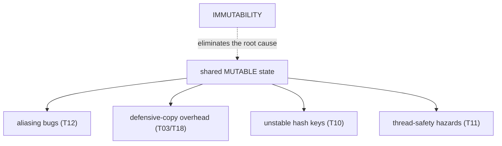
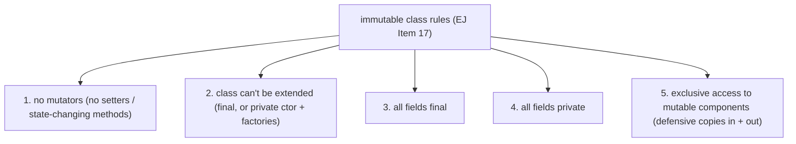
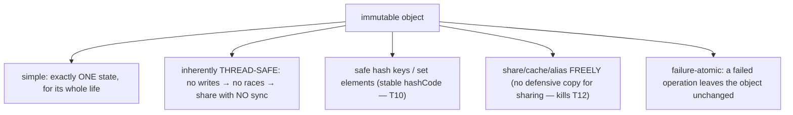
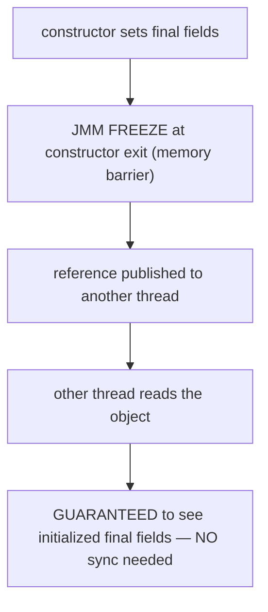
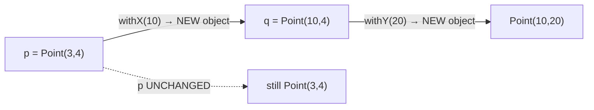
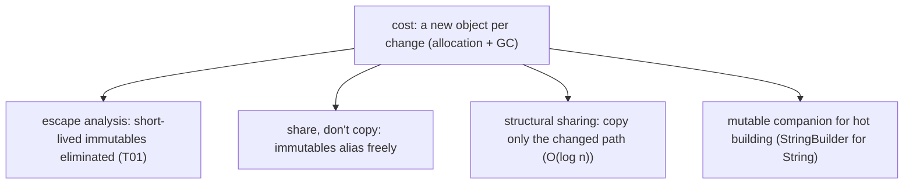
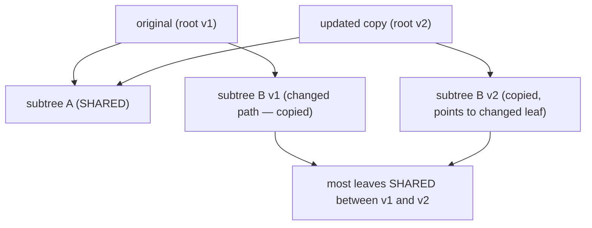
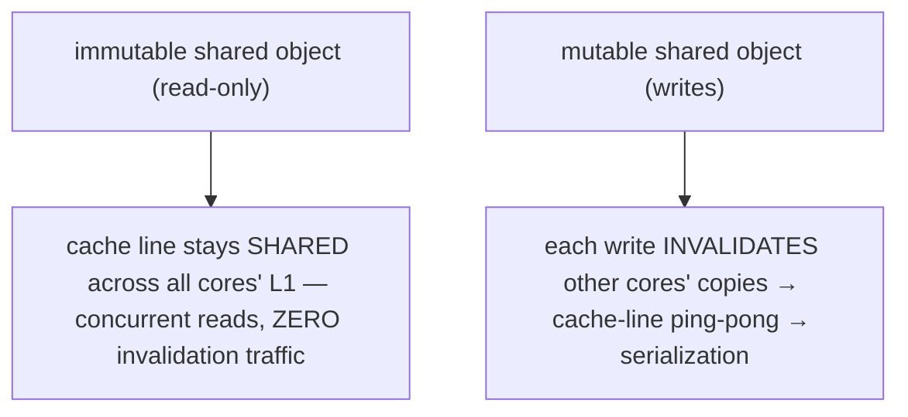
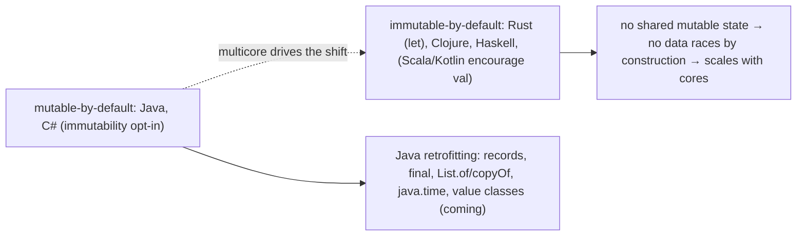

# Immutability & immutable class design

An **immutable** object is one whose state **cannot change after construction** — once built, it stays exactly as it was, forever. `String`, `Integer`, `BigDecimal`, `LocalDate`, and every record are immutable: there is no method that mutates them, and every "change" produces a *new* object instead. This is the **capstone of the OOP chapter** because immutability resolves, in one stroke, the problems that recurred through every topic before it: the aliasing bug where a "copy" silently shares mutable state ([T12](./T12-inner-local-and-anonymous-classes.md)), the defensive-copy dance to protect internal state ([T03](./T03-encapsulation-and-access-modifiers.md)/[T18](./T18-object-cloning-and-cloneable.md)), the requirement that hash keys never change ([T10](./T10-equals-hashcode-tostring-contracts.md)), the thread-safety hazards of shared mutable state ([T11](./T11-static-members-blocks-and-nested-classes.md)), and the broken `clone()` mechanism ([T18](./T18-object-cloning-and-cloneable.md) — you don't copy what can't change, you share it). *Effective Java* Item 17 is "Minimize mutability," and it is among the most consequential pieces of advice in all of Java.

The depth bar here is **why immutability buys thread-safety for free, and what it costs**. The deep answer to "why are immutable objects inherently thread-safe?" is the **Java Memory Model's `final`-field safe-publication guarantee** ([T02](./T02-fields-methods-constructors-this.md)): when a constructor with `final` fields completes, the JVM inserts a **freeze** (a memory barrier — a `StoreStore` on weakly-ordered ARM, often a no-op on x86) that guarantees *any* thread reading a reference to the object after construction sees the fully-initialized `final` fields — **without any synchronization, lock, or `volatile`**. That single guarantee is why `String` and every immutable object can be shared across threads via plain non-volatile references and never expose a half-built or stale state. The cost is **a new object per "change"** (more allocation, more GC pressure), but it's mitigated by **escape analysis** eliminating short-lived immutables ([T01](./T01-classes-and-objects.md)), by **sharing** immutable objects freely instead of copying them, and by **structural sharing** — persistent data structures where a "modified copy" of a million-element collection copies only the ~log₃₂(N) ≈ 4 nodes on the changed path and *shares* the rest. At the architecture level, read-only shared data is also **cache-friendly**: an immutable object's cache line stays in the MESI "Shared" state across all cores simultaneously, with zero invalidation traffic — the opposite of mutable shared state's cache-line ping-pong. By the end you'll design a contract-correct immutable class, explain the JMM freeze that makes it thread-safe, defensively copy mutable components, reach for structural sharing when copies would be expensive, and place Java's immutability retrofit in the industry-wide trend toward immutable-by-default.

> [!NOTE]
> Prerequisites: [Fields, methods, constructors, this](./T02-fields-methods-constructors-this.md) (`L1/C01/T02`) — `final` fields, the JMM freeze, leaking `this`; [equals/hashCode](./T10-equals-hashcode-tostring-contracts.md) (`L1/C01/T10`) — why immutable objects are safe hash keys; [Inner/anonymous classes](./T12-inner-local-and-anonymous-classes.md) (`L1/C01/T12`) — aliasing (shared mutable state); [record types](./T14-record-types.md) (`L1/C01/T14`) — immutable carriers; [Object cloning](./T18-object-cloning-and-cloneable.md) (`L1/C01/T18`) — defensive copies, why you share immutables instead of cloning.

## The Recurring Problem — Mutation and Aliasing

Almost every hazard in this chapter traces back to one root cause: **shared mutable state**. When two references point at the same mutable object ([T01](./T01-classes-and-objects.md)/[T12](./T12-inner-local-and-anonymous-classes.md)), a change through one is silently visible through the other:

```java
List<String> names = new ArrayList<>(List.of("Alice"));
Customer c = new Customer(names);
names.add("Bob");                    // mutates the list the Customer also holds
c.getNames();                        // [Alice, Bob] — the Customer's state changed behind its back
```

This is the **aliasing bug** ([T12](./T12-inner-local-and-anonymous-classes.md)), and the chapter's recurring defenses against it — defensive copies ([T03](./T03-encapsulation-and-access-modifiers.md)/[T18](./T18-object-cloning-and-cloneable.md)), `clone()` ([T18](./T18-object-cloning-and-cloneable.md)), careful encapsulation — are all *patches* for a problem that **immutability eliminates at the source**. If the object can't change, sharing it is harmless: there's no mutation to leak, no defensive copy to make, no race to lose. Immutability isn't one more technique; it's the design that makes most of the others unnecessary.



## What Immutability Means

An object is **immutable** if its observable state cannot change after the constructor returns. Concretely: no method changes any field, no field is reassigned, and any object the immutable one references is *also* effectively beyond the reach of mutation (or is itself immutable). Every operation that would "change" an immutable object instead returns a **new** object with the change applied, leaving the original untouched:

```java
String s = "hello";
String t = s.toUpperCase();          // returns a NEW String "HELLO"; s is still "hello"
BigInteger a = BigInteger.valueOf(5);
BigInteger b = a.add(BigInteger.ONE);// returns a NEW BigInteger 6; a is still 5
LocalDate d = LocalDate.of(2026, 1, 1);
LocalDate e = d.plusDays(30);        // returns a NEW LocalDate; d is unchanged
```

The JDK is full of immutable types: `String`, all the wrappers (`Integer`, `Long`, …), `BigInteger`, `BigDecimal`, the entire `java.time` API (`LocalDate`, `Instant`, `Duration`, …), and every record. They share the property that you can pass them anywhere, store them in any collection, share them across any number of threads — and never worry that someone, somewhere, changed them.

## The Five Rules of an Immutable Class

*Effective Java* Item 17 gives five rules for designing an immutable class:



1. **Don't provide mutators.** No setters, no methods that change state. Operations return new objects.
2. **Ensure the class can't be extended.** Make it `final` ([T04](./T04-inheritance-and-super.md)), or make the constructor `private`/package-private and hand out instances via static factories ([T11](./T11-static-members-blocks-and-nested-classes.md)). Otherwise a malicious or careless subclass could *add* mutable state or override methods to pretend the object changed — breaking the immutability guarantee for code that holds the object as the supertype.
3. **Make all fields `final`.** This expresses intent, and — crucially — gives the JMM safe-publication guarantee ([§ The JMM Freeze](#the-jmm-final-field-safe-publication-guarantee)).
4. **Make all fields `private`.** So clients can't read-and-then-mutate a field's referenced object directly ([T03](./T03-encapsulation-and-access-modifiers.md)).
5. **Ensure exclusive access to any mutable components.** If a field references a mutable object (an array, a `List`, a `Date`), the class must **defensively copy** it on the way in (constructor) and on the way out (accessor) so no client can obtain a reference to the internal object and mutate it.

A complete example:

```java
public final class Period {                        // rule 2: final
    private final Date start;                       // rules 3 + 4: private final
    private final Date end;

    public Period(Date start, Date end) {
        this.start = new Date(start.getTime());     // rule 5: defensive copy IN
        this.end   = new Date(end.getTime());
        if (this.start.after(this.end))             // validate AFTER copying (avoid TOCTOU)
            throw new IllegalArgumentException("start after end");
    }

    public Date start() { return new Date(start.getTime()); }   // rule 5: defensive copy OUT
    public Date end()   { return new Date(end.getTime()); }
    // rule 1: no setters
}
```

> [!IMPORTANT]
> Defensive-copy **into the fields first, then validate the copies** — not the parameters. `Date` is mutable, so validating the parameter and *then* copying leaves a window where another thread mutates the parameter between the check and the copy (a TOCTOU — time-of-check-to-time-of-use — race). Copy first, validate the copy. (This whole headache is why `java.time` replaced `Date` with immutable types — `Period` of two `Instant`s needs no defensive copies at all.)

## Defensive Copies — The Mutable-Component Rule

Rule 5 is the one that bites, and it's the direct continuation of [T18](./T18-object-cloning-and-cloneable.md)'s copying and [T10](./T10-equals-hashcode-tostring-contracts.md)'s array-component caveat. `final` only freezes the **reference**, not the object it points at ([T02](./T02-fields-methods-constructors-this.md)):

```java
public final class Config {
    private final List<String> servers;
    public Config(List<String> servers) {
        this.servers = servers;              // BUG: stores the caller's mutable list
    }
    public List<String> servers() {
        return servers;                       // BUG: hands out the internal list
    }
}

List<String> input = new ArrayList<>(List.of("a"));
Config c = new Config(input);
input.add("evil");                            // mutates Config's "immutable" state
c.servers().add("also evil");                 // mutates it again, through the accessor
```

The fixes ([T18](./T18-object-cloning-and-cloneable.md)): copy in and out, or — better — use **immutable component types** so the copies aren't needed:

```java
public Config(List<String> servers) {
    this.servers = List.copyOf(servers);      // immutable snapshot IN (Java 10+)
}
public List<String> servers() {
    return servers;                            // safe to share — it's already immutable
}
```

`List.copyOf`/`Set.copyOf`/`Map.copyOf` return **immutable** collections, so one copy at construction suffices and the accessor can return the field directly. This is the modern, allocation-light way: snapshot once into an immutable type, share freely thereafter. The lesson generalizes — **prefer immutable component types** (`List` over `[]`, `Instant` over `Date`, records over mutable beans) so immutability composes without a thicket of defensive copies.

## The Benefits of Immutability

Why go to this trouble? Immutability pays off on five fronts ([EJ Item 17](#the-five-rules-of-an-immutable-class)):



1. **Simplicity.** An immutable object has exactly one state — the one it was created with. There's no lifecycle, no "is it initialized?", no temporal coupling. You reason about it as a *value*, like the number 5.
2. **Thread-safety for free.** No writes means no data races; immutable objects need **no synchronization** and can be shared across any number of threads safely ([§ The JMM Freeze](#the-jmm-final-field-safe-publication-guarantee)).
3. **Safe hash keys and set elements.** A key whose state never changes has a stable `hashCode` ([T10](./T10-equals-hashcode-tostring-contracts.md)) — it can never "get lost" in a `HashMap` by mutating after insertion. Immutable types are the *ideal* map keys.
4. **Free sharing and caching.** Because they can't change, immutable objects can be shared, cached, interned, and aliased without defensive copies — the [T12](./T12-inner-local-and-anonymous-classes.md) aliasing problem simply doesn't exist for them. `BigInteger.ZERO` is a single shared instance; the `String` pool and `Integer` cache exploit this.
5. **Failure atomicity.** If a method throws partway through, the object is left exactly as it was — because an immutable object never changes state, a failed operation can't leave it half-modified. You get failure atomicity for free.

The price (one disadvantage): **a separate object for every distinct value**, addressed in [§ The Cost](#the-cost-and-its-mitigations).

## The JMM Final-Field Safe-Publication Guarantee

Here is the **deep reason** immutable objects are thread-safe — and it's not obvious. Sharing *any* object across threads normally requires synchronization, because without it, one thread might see another's writes out of order or not at all (the visibility problem — full treatment in L3/C01). So how can an immutable object be shared via a plain, non-volatile, unsynchronized reference and still be seen correctly?

The answer is the **Java Memory Model's `final`-field guarantee** (JLS §17.5), the **freeze** we met in [T02](./T02-fields-methods-constructors-this.md). When a constructor that sets `final` fields completes, the JVM inserts a **freeze action** — a memory barrier — at the end of the constructor. The guarantee: **any thread that reads a reference to the object, where that reference was written after the constructor returned, is guaranteed to see the correctly-initialized values of the object's `final` fields** — with **no synchronization required**.



This is **safe publication for immutable objects**. It's why `String s = computeString(); sharedField = s;` in one thread, read by another thread as `sharedField`, never exposes a half-built `String` — the `final byte[] value` is frozen and visible. Without `final` fields, there's no such guarantee: another thread could see the default (zero/null) value of a non-`final` field even after construction, because the constructor's writes could be reordered after the reference write.

Two caveats ([T02](./T02-fields-methods-constructors-this.md)):

- **`this` must not escape during construction.** If the constructor publishes `this` before finishing (the leaking-`this` bug), the freeze hasn't happened yet and the guarantee is void.
- **It applies only to `final` fields.** This is *why* rule 3 (all fields `final`) matters beyond intent — it's load-bearing for thread-safety.

At the architecture level, the freeze is a **`StoreStore` barrier** on weakly-ordered CPUs (ARM emits `dmb ishst`; Power emits `lwsync` — [T02 deeper section](./T02-fields-methods-constructors-this.md#deeper-jvm-internals--putfield-field-offsets-and-final-freeze-barriers)) ensuring the field writes retire before the publishing write; on strongly-ordered x86 (TSO) it's typically a no-op because the hardware already preserves store order. Either way, the cost is ~zero on x86 and a few cycles on ARM, paid once at construction — a tiny price for lock-free sharing.

> [!INTERVIEW]
> "Why are immutable objects thread-safe?" Two layers: (1) no mutation means no concurrent writes, so no data races; (2) the JMM `final`-field freeze guarantees that an object's `final` fields are fully visible to any thread that reads the object after construction, *without synchronization* — safe publication for free. Together these let you share an immutable object across threads via a plain reference with no locks. This is the deepest practical benefit of immutability and the reason `String`, records, and `java.time` types are safely shareable.

## Functional Updates and "Withers"

Since you can't mutate, you **return a new object** for every change — the *functional update*. The JDK's immutable types all do this (`String.toUpperCase`, `BigInteger.add`, `LocalDate.plusDays`). For your own immutable classes and records, the idiom is a **"wither"** ([T14](./T14-record-types.md)/[T18](./T18-object-cloning-and-cloneable.md)):

```java
public record Point(int x, int y) {
    public Point withX(int newX) { return new Point(newX, y); }   // a modified COPY
    public Point withY(int newY) { return new Point(x, newY); }
}

Point p = new Point(3, 4);
Point q = p.withX(10);            // Point[x=10, y=4]; p is unchanged
```

Each wither builds a new object sharing the unchanged components. Chained, they read like a fluent transformation (`p.withX(10).withY(20)`), each step producing a fresh immutable value. (Records don't auto-generate withers — [T14](./T14-record-types.md) — though a `with`-expression language feature is planned. Kotlin data classes auto-generate `copy(x = ...)` to the same end.)



## Records as Immutability-by-Default

Records ([T14](./T14-record-types.md)) are the language's **immutability-by-default** construct: `final` class, `private final` fields, no setters, generated value-based `equals`/`hashCode` — four of the five rules satisfied automatically. For a transparent immutable value, `record Point(int x, int y) {}` *is* a correct immutable class in one line.

The one rule records *don't* automatically satisfy is **rule 5** (mutable components): a record with a mutable component is only *shallowly* immutable — the component can be mutated through its shared reference ([T14](./T14-record-types.md)/[T18](./T18-object-cloning-and-cloneable.md)):

```java
record Data(int[] values) {}              // shallowly immutable — the array is mutable!
record Data2(List<Integer> values) {      // deeply immutable IF you copy
    Data2 { values = List.copyOf(values); }   // compact constructor: immutable snapshot
}
```

So: **for immutable value types, default to records**; add defensive copies in the compact constructor (or use immutable component types) when a component is mutable. Records make rules 1–4 free and turn rule 5 into a one-line compact-constructor copy.

## Effectively Immutable and the Mutability Spectrum

Immutability isn't binary; there's a useful spectrum:


| Tier | Definition | Thread-safe? |
|------|------------|--------------|
| **Immutable** | `final` fields, no mutation, deeply protected components | yes, with JMM freeze (no sync) |
| **Effectively immutable** | never mutated after construction, but fields not `final` | yes, *only if safely published* (needs `volatile`/sync) |
| **Defensively copied** | mutable, but copies cross every boundary | depends |
| **Mutable** | freely changes | no (needs synchronization) |

An **effectively immutable** object is technically mutable (non-`final` fields, maybe setters) but is *never mutated* after construction in practice. It gets immutability's *simplicity* benefits, but it **lacks the JMM freeze** (which requires `final` fields), so safe publication across threads requires `volatile` or synchronization. Prefer genuine immutability (`final` fields) when you can — the freeze is free thread-safety that effectively-immutable objects don't get.

## The Cost and Its Mitigations

The one real downside: **a new object for every distinct value**, which means more allocation and GC pressure when values are large or change often. A loop that "updates" an immutable object N times creates N objects. Four mitigations:



1. **Escape analysis** ([T01](./T01-classes-and-objects.md)) — a short-lived immutable that doesn't escape its method is scalar-replaced and never allocated. The functional-update object that you immediately consume costs nothing in hot code.
2. **Share, don't copy.** Because immutables can't change, you *share* them instead of copying — the opposite of the mutable world's defensive copying. `BigInteger.ZERO`, `""`, `Optional.empty()`, `List.of()` are shared singletons.
3. **Structural sharing** ([§ Structural Sharing](#memory-layer--structural-sharing)) — for collections, a "modified copy" shares the unchanged structure, copying only the changed path (O(log n) nodes, not O(n)).
4. **A mutable companion for performance-critical building.** `String` is immutable, but `StringBuilder` is its mutable companion for building strings in a loop ([L0/C02/T07](../../L0-foundations/C02-java-core/T07-stringbuilder-stringbuffer.md)) — build mutably, freeze to immutable at the end (`sb.toString()`). The pattern: mutate locally where it's confined and safe, expose immutability at the boundary.

## Memory Layer — Immutable Object Layout

An immutable object has **no special memory layout** — it's an ordinary object: header + fields ([T01](./T01-classes-and-objects.md)), with the fields marked `final` (the `ACC_FINAL` flag — [T03](./T03-encapsulation-and-access-modifiers.md)). `record Point(int x, int y)` is 24 bytes (12 header + 4 + 4 + 4 pad), identical to a mutable `Point` ([T14](./T14-record-types.md)). Immutability is a property of the *type's contract and the `final` flags*, not of the instance bytes — there's no per-object "immutable" tag.

The `final` flag does two things in memory: it makes the field read-only after construction (the verifier and compiler reject reassignment — [T02](./T02-fields-methods-constructors-this.md)), and it triggers the JMM freeze barrier at constructor exit. The JIT can also exploit `final`: it may **constant-fold** a `final` field's value if it's provably constant, and it can **cache** a `final` field's value across reads without re-loading (a non-`final` field must be re-read in case another thread changed it — a real optimization difference).

### String's Immutability Mechanics

`String` is the archetypal immutable, and its internals show the pattern ([L0/C02/T06](../../L0-foundations/C02-java-core/T06-strings-and-text-blocks.md)):

```java
public final class String {            // final class
    private final byte[] value;         // final — the characters, never mutated or exposed
    private final byte coder;           // final
    private int hash;                   // NON-final — but a benign data race (see below)
}
```

The `value` array is `final`, `private`, never handed out, and never mutated after construction — so the `String` is deeply immutable even though it holds an array (the array is *exclusively owned*, rule 5). This is what makes `String` safely shareable, internable (the string pool), and a perfect hash key. The one non-`final` field, `hash`, is a **deliberate benign data race**: it caches the hashCode, and if two threads compute it simultaneously they compute the *same* value, so the race is harmless ([T10](./T10-equals-hashcode-tostring-contracts.md)) — a rare, expert-level exception that proves the rule.

## Memory Layer — Structural Sharing

The technique that makes immutable *collections* practical is **structural sharing**, the heart of **persistent data structures** (Clojure's vectors/maps, Scala's immutable collections, Java's planned persistent collections). The idea: an "update" creates a new version that **shares the unchanged structure** with the old version, copying only the path from the root to the changed node.

Consider an immutable tree-backed list of a million elements. A naive immutable update would copy all million elements — O(n), prohibitive. A persistent vector (a wide tree, branching factor 32) instead copies only the nodes on the **path from root to the changed leaf** — about log₃₂(1,000,000) ≈ **4 nodes** — and *shares* every other subtree with the original:



So a "modified copy" of a million-element persistent collection copies ~4 nodes and shares the rest — O(log n), not O(n). Both versions remain valid and immutable; the old one is unaffected. This is why functional languages can treat collections as immutable values without crippling performance: structural sharing turns "copy the whole thing" into "copy the spine." It also dovetails with garbage collection — when the old version becomes unreachable, only its ~4 unique nodes are garbage; the shared structure stays alive under the new version.

## Memory Layer — Interning and Caching

Because immutable objects can't change, **identical values can be deduplicated into a single shared instance** — interning. The JVM does this for two important cases ([L0/C02/T05](../../L0-foundations/C02-java-core/T05-type-conversion-and-casting.md)/[T06](../../L0-foundations/C02-java-core/T06-strings-and-text-blocks.md)):

- **The String pool** — `String` literals are interned: every `"hello"` in your program refers to the *same* `String` object ([L0/C02/T06](../../L0-foundations/C02-java-core/T06-strings-and-text-blocks.md)). `String.intern()` deduplicates dynamically-created strings. Safe *because* `String` is immutable — sharing one instance among many call sites can't cause a surprise, since no one can change it.
- **The Integer cache** — `Integer.valueOf(i)` returns a cached shared instance for −128..127 ([L0/C02/T05](../../L0-foundations/C02-java-core/T05-type-conversion-and-casting.md)). Safe for the same reason: an immutable `Integer` can be shared without risk (and it's the cause of the `Integer == Integer` cache trap).

Interning is a *direct consequence* of immutability: you can only safely share-one-for-many if the shared thing can't be mutated by any of the sharers. Mutable objects can never be interned. Immutability is what unlocks deduplication, caching, and the flyweight pattern.

## Architecture Layer — Read-Only Data Is Cache-Friendly

Immutability has a multicore performance benefit beyond lock-free sharing: **read-only shared data is cache-coherence-friendly**. Under the MESI cache-coherence protocol, when multiple cores read the same cache line, each holds it in the **Shared** state in its own L1 — all cores can read concurrently with **zero coherence traffic** ([T01](./T01-classes-and-objects.md) caches). No core's read invalidates another's copy.

Mutable shared data is the opposite. When one core *writes* a cache line, the protocol must **invalidate** every other core's copy (transition them to Invalid), and the next reader must re-fetch — the cache line **ping-pongs** between cores' caches. For a hot mutable field touched by many threads, this coherence traffic dominates and serializes what looks like parallel code (the true-sharing / false-sharing problem, full treatment in L3/C01).



So immutable shared data is not merely *safe* on multicore — it's *fast*, because read-only lines never trigger coherence traffic. This is increasingly decisive: as core counts grow, the cost of mutable shared state grows with them, while immutable shared state scales freely. It's a deep reason the industry is trending toward immutability for concurrent and parallel code — the hardware *rewards* read-only sharing.

## Cross-Language Perspective — The Immutable-by-Default Trend

Java makes mutability the default and immutability a discipline you opt into. Many modern languages do the reverse — and the trend is unmistakably toward immutable-by-default:

| Language | Default | Immutability mechanism |
|----------|---------|------------------------|
| **Java** | mutable | `final`, records, `List.of`/`copyOf` (opt-in) |
| **Rust** | **immutable** (`let`) | `let mut` to opt *into* mutation; borrow checker enforces shared-xor-mutable |
| **Clojure** | **immutable** | persistent data structures with structural sharing as the core model |
| **Haskell** | **immutable** (pure) | no mutation at all; state via monads |
| **Scala** | mutable allowed, immutable encouraged | `val` vs `var`; immutable collections by default |
| **Kotlin** | mutable allowed, immutable encouraged | `val` vs `var`; `data class`; read-only collection interfaces |
| **C#** | mutable | `readonly`, records (C# 9), `ImmutableList` |

Two contrasts:

**Rust makes immutability the default *and* enforces safe sharing.** A `let x = 5` binding is immutable; you opt into mutation with `let mut x = 5`. More deeply, Rust's borrow checker enforces the rule that at any moment you may have **either one mutable reference or many immutable references**, never both ([T01](./T01-classes-and-objects.md)/[T12](./T12-inner-local-and-anonymous-classes.md)) — which makes shared-immutable data *provably* safe at compile time and is the language-level resolution of the aliasing problem Java patches with discipline. Rust gets, at compile time, what Java achieves only by convention.

**Clojure and Haskell build everything on immutability.** Clojure's core data structures are *persistent and immutable* with structural sharing — "modifying" a map returns a new map sharing most of its structure ([§ Structural Sharing](#memory-layer--structural-sharing)), and this is the *normal* way to work, designed for effortless concurrency. Haskell goes further: nothing mutates, ever; the entire language is built on immutable values and pure functions, with controlled effects via monads. These languages chose immutable-by-default *specifically because* it makes concurrent and parallel programming tractable — no shared mutable state means no data races by construction.

The industry trend is clear: as multicore became universal, immutable-by-default went from a functional-programming niche to a mainstream concurrency strategy. Java is **retrofitting** — records, the encouragement to "minimize mutability," immutable collection factories (`List.of`, `copyOf`), the `java.time` redesign around immutability, and (forthcoming) value classes and `with`-expressions. You can't make Java immutable-by-default without breaking decades of code, but every modern Java feature pushes that direction. The takeaway for *your* code: **make classes immutable unless there's a compelling reason not to** — it's the single most effective way to make Java code simpler, safer, and more concurrency-ready.



## Common Mistakes

> [!WARNING]
> **Missing defensive copy of a mutable component.** A `final` field referencing a mutable object (array, `List`, `Date`) is *not* immutable — clients can mutate it through a shared reference. Copy in and out, or use immutable component types (`List.copyOf`, `Instant`).

> [!WARNING]
> **Non-`final` class.** If your "immutable" class isn't `final` (and lacks private-constructor-plus-factory protection), a subclass can add mutable state or override methods to fake mutation, breaking the guarantee for code holding it as the supertype.

> [!WARNING]
> **Confusing `final` field with deep immutability.** `final` freezes the *reference*, not the referenced object's contents ([T02](./T02-fields-methods-constructors-this.md)/[T18](./T18-object-cloning-and-cloneable.md)). `private final int[] data` is a frozen reference to a *mutable* array.

> [!WARNING]
> **Returning the internal mutable collection from an accessor.** Even with a `final` private field, an accessor that returns the field hands out a mutable reference — an encapsulation leak ([T03](./T03-encapsulation-and-access-modifiers.md)). Return an immutable view/copy.

> [!WARNING]
> **Validating before defensively copying.** With a mutable parameter (`Date`), validate the *copy*, not the parameter — otherwise a TOCTOU race lets another thread change the value between the check and the copy.

> [!WARNING]
> **Over-copying when sharing or structural sharing would do.** Immutables can be *shared* freely — don't defensively copy an immutable object (it can't change). For large collections, reach for immutable/persistent collections rather than copying on every change.

> [!WARNING]
> **Relying on effective immutability across threads without safe publication.** A never-mutated-but-non-`final`-field object lacks the JMM freeze; sharing it across threads still needs `volatile`/synchronization. Use `final` fields for free thread-safety.

> [!INTERVIEW]
> Common interview questions for this topic:
> 1. **What are the five rules for an immutable class?** No mutators; class final (or private ctor + factories); all fields final; all fields private; defensive copies of mutable components (in and out).
> 2. **Why are immutable objects thread-safe?** No writes → no races; plus the JMM `final`-field freeze guarantees safe publication (other threads see initialized final fields without synchronization). Together: share via a plain reference, no locks.
> 3. **What's the JMM final-field guarantee?** When a constructor setting `final` fields completes, a freeze (memory barrier) ensures any thread reading the object after construction sees the initialized final fields — no synchronization needed (provided `this` didn't escape).
> 4. **Why must immutable fields be `final` and not just never-mutated?** `final` triggers the JMM freeze (free safe publication); effectively-immutable objects with non-final fields lack it and need explicit synchronization to publish safely.
> 5. **Why does `final` alone not make an object immutable?** `final` freezes the reference, not the referenced object's contents — a `final` array/List/Date field is still mutable.
> 6. **What's a defensive copy and when?** Copying a mutable component in the constructor (so the class owns it) and the accessor (so clients can't mutate the internal one). Or use immutable component types.
> 7. **What's structural sharing?** A persistent data structure's "modified copy" shares the unchanged structure and copies only the changed path (O(log n) nodes, not O(n)) — what makes immutable collections practical.
> 8. **Why are immutable objects good hash keys?** Their state never changes, so their `hashCode` is stable — they can't get lost in a `HashMap` by mutating after insertion ([T10](./T10-equals-hashcode-tostring-contracts.md)).
> 9. **What's the cost of immutability and how is it mitigated?** A new object per change. Mitigated by escape analysis (eliminate short-lived ones), sharing (don't copy immutables), structural sharing (for collections), and mutable companions (StringBuilder).
> 10. **Why is immutable shared data cache-friendly?** Read-only cache lines stay in the MESI Shared state across all cores with no invalidation traffic; mutable shared data ping-pongs between caches on every write.
> 11. **How do records relate to immutability?** Records are immutable-by-default (final class, private final fields, no setters) — four of five rules free; only mutable components need defensive copies (rule 5).
> 12. **What's a "wither"?** A method returning a modified copy of an immutable object (`point.withX(10)`), the functional-update idiom since you can't mutate.
> 13. **How does Rust's approach differ?** Immutable by default (`let` vs `let mut`), and the borrow checker enforces shared-xor-mutable at compile time — making shared-immutable data provably safe, which Java only achieves by convention.
> 14. **Why is the industry trending to immutable-by-default?** Multicore: no shared mutable state means no data races by construction, and read-only sharing scales with core count while mutable sharing degrades — immutability is the simplest path to safe, scalable concurrency.

## Practice

1. **Five-rule immutable class.** Build an immutable `Money(long cents, String currency)` following all five rules (final class, private final fields, no setters, validation, immutable components). Add an `add(Money)` that returns a new `Money`. Confirm the original is never modified.

2. **Defensive copy with a mutable component.** Build the `Period(Date start, Date end)` example. Demonstrate the bug *without* defensive copies (mutate the input `Date` and the accessor's returned `Date`, observe the `Period` changes), then fix with copies in and out. Then rewrite with `Instant` and observe no copies are needed.

3. **TOCTOU validation order.** Show that validating the parameter before copying (vs copying then validating) leaves a race window. Reorder to copy-then-validate.

4. **`List.copyOf` snapshot.** Rewrite a `Config` holding a `List<String>` to snapshot with `List.copyOf` in the constructor. Confirm mutating the input list afterward doesn't affect the `Config`, and the accessor can safely return the field directly (it's immutable).

5. **Immutable as a stable hash key.** Put an immutable `Point` in a `HashMap`. Confirm you can always retrieve it (its hashCode never changes). Contrast with a mutable `Point` whose field you change after insertion — it gets lost ([T10](./T10-equals-hashcode-tostring-contracts.md)).

6. **JMM safe publication.** Build an immutable class with a `final` field. Publish an instance from one thread via a *non-volatile* static field; read it from another. Confirm correct visibility (statistically). Then make the field non-`final` and a never-set-correctly value can appear under contention (hard to reproduce; document the rule).

7. **`final` is shallow.** Declare `private final int[] data`. Confirm you can't reassign `data` but *can* do `data[0] = 99`. Conclude that `final` ≠ deep immutability.

8. **Functional update / wither.** Add `withX`/`withY` to a `Point` record. Chain `p.withX(10).withY(20)`; confirm the original `p` and each intermediate are unchanged.

9. **Record shallow-immutability fix.** Make `record Data(int[] values)`. Mutate the array through the component; observe the record "changed." Fix by switching to `List<Integer>` + `List.copyOf` in a compact constructor.

10. **Structural sharing.** Use a persistent collection (e.g., via a library like Vavr or a hand-built persistent list, or study Clojure semantics). "Update" a large persistent vector and confirm (conceptually or via instrumentation) that most structure is shared, not copied — O(log n) new nodes.

11. **String immutability mechanics.** Use reflection to read `String`'s private `final byte[] value`. Confirm it's never exposed by any public method. Confirm two `"hello"` literals are `==` (interned — shared because immutable).

12. **Sharing vs copying immutables.** Show that you can freely share `BigInteger.ZERO` / `""` / `List.of()` across threads and data structures with no defensive copies — because they can't change.

13. **EA eliminates a short-lived immutable.** Write a hot method that creates an immutable object, uses it, and discards it. Run with `-XX:+PrintEliminateAllocations`; confirm the allocation is eliminated by escape analysis ([T01](./T01-classes-and-objects.md)).

14. **Mutable companion.** Build a `String` in a loop with `+=` (creating many immutables) vs a `StringBuilder` (mutable companion). Measure the allocation/time difference; conclude the pattern "build mutably, freeze to immutable."

15. **End-to-end explain-it-back (capstone).** Trace why `String s = compute(); sharedField = s;` is safe to read from another thread with no lock: (a) `String` is immutable with a `final byte[] value`; (b) the constructor's freeze inserts a memory barrier (a `dmb ishst` on ARM, a no-op on x86) at construction exit; (c) the barrier guarantees the `value` writes retire before the publishing write to `sharedField`; (d) the reading thread sees the fully-initialized `String`, never a half-built one; (e) no mutation means no further races; (f) tie this back to the chapter — how immutability dissolves the aliasing (T12), defensive-copy (T18), hash-key (T10), and thread-safety problems at once. Twelve sentences max.

## Recap

You should now be able to:

**Language layer.**

- Define immutability (state can't change after construction) and recognize the JDK's immutable types (`String`, wrappers, `BigInteger`, `java.time`, records).
- Apply the five rules: no mutators; final class (or private ctor + factories); all fields final; all fields private; defensive copies of mutable components.
- Defensively copy mutable components in and out — or, better, use immutable component types (`List.copyOf`, `Instant`).
- State immutability's benefits: simplicity, free thread-safety, safe hash keys, free sharing/caching, failure atomicity.
- Write functional updates / withers (return a new object).
- Use records as immutability-by-default and fix the shallow-immutability caveat with compact-constructor copies.
- Distinguish immutable, effectively-immutable, defensively-copied, and mutable, and know the thread-safety implications of each.

**Memory layer.**

- Explain that an immutable object has a normal layout (header + `final` fields, `ACC_FINAL`); immutability is in the contract and flags, not the bytes.
- Explain `String`'s immutability mechanics (final private never-exposed `value` array; the benign `hash` data race).
- Explain structural sharing: a persistent collection's modified copy shares unchanged structure, copying only the O(log n) changed path.
- Explain how immutability enables interning and caching (String pool, Integer cache) — safe deduplication of shared instances.

**Architecture layer.**

- Explain the JMM `final`-field freeze as the mechanism behind safe publication: a constructor-exit memory barrier (StoreStore on ARM, no-op on x86) that makes `final` fields visible to other threads without synchronization.
- Explain why immutable shared data is cache-friendly (read-only lines stay MESI-Shared across cores, zero invalidation traffic) and mutable shared data ping-pongs.
- Explain the cost (new object per change) and its mitigations (EA, sharing, structural sharing, mutable companions).
- Place Java's immutability retrofit in the immutable-by-default trend (Rust's `let`/borrow-checker, Clojure/Haskell persistence/purity) and articulate why multicore drives it.

**Chapter capstone.** Immutability ties together everything in L1/C01: it's `final` fields ([T02](./T02-fields-methods-constructors-this.md)) made into a design discipline, the resolution of the aliasing problem ([T12](./T12-inner-local-and-anonymous-classes.md)), the reason `equals`/`hashCode` keys stay stable ([T10](./T10-equals-hashcode-tostring-contracts.md)), the natural form of records ([T14](./T14-record-types.md)), and the reason you share instead of clone ([T18](./T18-object-cloning-and-cloneable.md)). The single most valuable habit from this chapter: **make classes immutable unless you have a compelling reason not to.**

## Next

This completes **L1/C01 — Object-Oriented Programming**. You can now design Java types from first principles: classes and objects in memory; constructors, encapsulation, inheritance, overriding, and polymorphism; abstract classes and interfaces; the `Object` contract and `equals`/`hashCode`/`toString`; static members and the four kinds of nested class; enums, records, and sealed types for modern data modeling; packages and modules for organization; and cloning and immutability for copying and protecting state — all with their memory and machine-level mechanics.

Continue to **[L1/C02 — Collections & Core APIs](../C02-collections-and-core-apis/)**, starting with [Collections framework overview](../C02-collections-and-core-apis/T01-collections-framework-overview.md). Having built the *types*, you'll now use the JDK's *data structures* — `List`, `Set`, `Map`, `Queue` and their implementations — applying everything from this chapter (`equals`/`hashCode` for keys, immutability for safety, generics for type-safety) to store and manipulate data at scale, with the same memory-and-performance depth.
