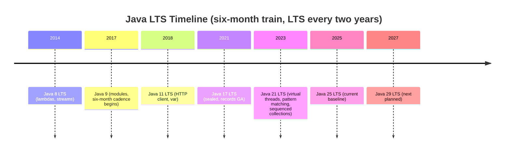
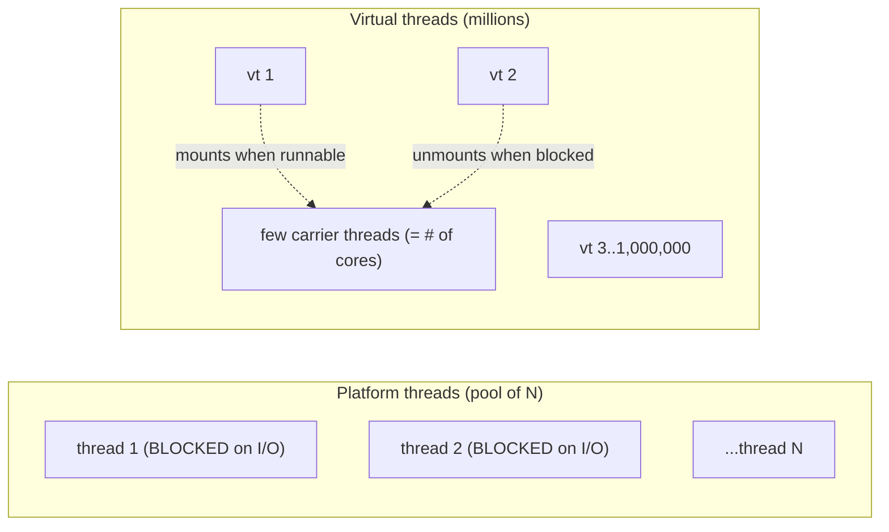
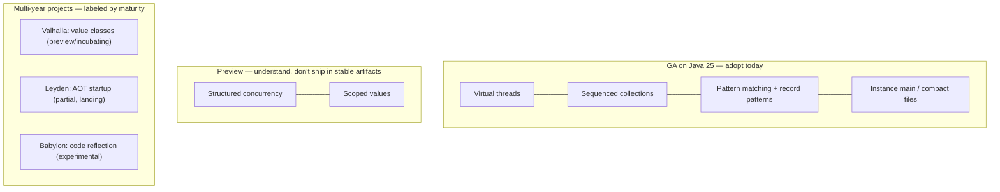

# Modern Java & the Java 25 LTS Landscape

For most of its life, "the Java you use at work" lagged years behind "the Java that exists." A team would standardize on Java 8 in 2015 and still be running it in 2023, while five major versions shipped in between. That era is over. Since 2017 the JDK has shipped on a **strict six-month release train** — a new feature release every March and September, like clockwork — and every **two years one of those releases is designated Long-Term Support (LTS)**: 8, 11, 17, 21, and now **25** (released **September 2025**). The result is that a 2026 backend codebase looks *qualitatively* different from a Java 8 one: requests are served on **virtual threads** instead of a fixed thread pool, concurrent work is organized with **structured concurrency**, context flows through **scoped values** instead of `ThreadLocal`, collections expose a **first/last element protocol** (`SequencedCollection`), and branching logic is written as **pattern matching `switch`** over **record patterns** and **sealed** hierarchies ([T14](./T14-record-types.md)/[T15](./T15-sealed-classes-and-interfaces.md)) rather than `instanceof`-and-cast chains. This topic is the **map** of that landscape: what's mainstream and safe to adopt today, what's a *preview* or *experimental* feature you should understand but not yet ship, and where the big multi-year projects — **Valhalla**, **Babylon**, **Leyden** — are heading.

The depth bar here is **judgment, not novelty**: not just "what's new," but *which* baseline a team should choose, *how* preview features are gated and why, and *what* the in-flight projects will change about the cost model you've internalized — value classes that erase the object-header overhead you learned about ([T01](./T01-classes-and-objects.md)/[T19](./T19-immutability-and-immutable-class-design.md)), AOT caching that attacks JVM startup, code reflection that turns Java methods into analyzable models. By the end you'll place every recent LTS on a timeline, write correct small examples of the features that are now GA, explain the `--enable-preview` mechanism and why a preview feature must never leak into a stable artifact, and give honest, maturity-labeled guidance on the projects that are still incubating.

> [!NOTE]
> Prerequisites: [record types](./T14-record-types.md) (`L1/C01/T14`) and [sealed classes & interfaces](./T15-sealed-classes-and-interfaces.md) (`L1/C01/T15`) — the algebraic-data-type pair that pattern matching destructures; [immutability](./T19-immutability-and-immutable-class-design.md) (`L1/C01/T19`) — the design that value classes (Valhalla) push down to the runtime; [polymorphism](./T06-polymorphism-compile-time-vs-runtime.md) (`L1/C01/T06`) — the `instanceof`-chain that pattern matching replaces; [JPMS](./T17-java-module-system-jpms.md) (`L1/C01/T17`) — module-level context for the platform's evolution.

> [!IMPORTANT]
> This is a **forward-looking, 2026-dated** topic. GA features (virtual threads, sequenced collections, record patterns, pattern-matching switch) are stated as fact. Anything marked **preview**, **incubating**, or **experimental** is *honestly hedged* — exact JEP numbers and the version where a feature finalizes can drift, so verify against the [OpenJDK JEP index](https://openjdk.org/jeps/0) and your JDK's release notes before relying on a specific number.

## Why the Release Cadence and LTS Matter

Before Java 9 (2017), releases were large, infrequent, and unpredictable — Java 7 to 8 took ~2.5 years. The cadence change traded *big-bang* releases for a **time-boxed train**: features ship when they're ready and miss the train if they're not, so a six-month release is always *shippable* and never *blocked* on one late feature. But shipping a new version every six months is impractical for most enterprises — you can't requalify your entire production fleet twice a year. The **LTS designation** resolves the tension: vendors (Oracle, plus distributions like **Eclipse Temurin / Adoptium**, Amazon Corretto, Azul Zulu, Red Hat) commit to **multi-year security and bug-fix updates** for LTS releases, so a team can sit on an LTS for years while still *previewing* the interim releases in CI.



The **non-LTS releases still matter**: they're where preview features land, mature, and finalize. A feature like virtual threads spent *two preview cycles* (Java 19, 20) before going GA in 21. Running your test suite on the latest interim release is the cheapest possible way to discover, two years early, what will break when you adopt the next LTS.

A common misconception is that LTS releases get *more features* — they don't. An LTS is just a regular six-month release that vendors **commit to patch for longer**; it contains exactly the features that happened to be ready on its train. What makes 17, 21, and 25 feel like "big" releases is the **accumulation** of two years of finalized features since the previous LTS, plus the fact that most teams *skip* the interim releases and therefore experience every change at once. There is also no single "LTS" owner: the OpenJDK project ships the reference releases, and each **distribution** decides its own LTS support window — typically several years of security and bug-fix updates — which is why "what Java are we on" in practice means *both* a version number *and* a vendor.

| Aspect | Six-month (interim) release | LTS release |
| --- | --- | --- |
| Cadence | Every March & September | Every ~2 years (one of the interim releases) |
| Vendor updates | ~6 months, then superseded | Multi-year security & bug fixes |
| Role | Proving ground; previews mature here | Production baseline |
| Who runs it | CI / early adopters | Most production fleets |
| Examples | 9, 10, 12–16, 18–20, 22–24 | 8, 11, 17, 21, 25 |

> [!INTERVIEW]
> **"Why doesn't everyone just run the newest Java version?"** Strong answer: the six-month releases get only ~6 months of updates, so production fleets standardize on an **LTS** (8 → 11 → 17 → 21 → 25) for multi-year security patches. Interim releases are the *proving ground* — you run CI against them to surface breakage early, but you deploy an LTS. A senior follow-up: name the trade — newer LTS means newer features and a smaller migration gap *next* time, but a bigger jump *now* and a shorter track record of third-party-library and APM-agent compatibility.

## The Features That Are Now Mainstream

These are **GA** as of the 21/25 line — safe to adopt on a current LTS, no flags required.

### Virtual Threads (Java 21, JEP 444)

The single biggest change for backend Java. A **platform thread** is a thin wrapper over an OS thread — expensive (≈1 MB stack reserved, kernel-scheduled), so you pool a few hundred of them and queue work. A **virtual thread** is a lightweight, JVM-scheduled thread that's **mounted onto a platform "carrier" thread only while it runs**; when it blocks on I/O, the JVM **unmounts** it and frees the carrier to run another virtual thread. You can have **millions** of them.

The analogy: platform threads are a **fixed payroll of permanent staff** — you keep a small, costly roster busy with a queue of tasks. Virtual threads are **hiring a temp per task** — cheap, disposable, one-per-unit-of-work — and the JVM is the agency that quietly reassigns the few real desks (carriers) whenever a temp goes idle waiting on the phone (blocks on I/O).

```java
// One virtual thread PER TASK — this would be catastrophic with platform threads,
// but is routine with virtual threads.
try (var executor = Executors.newVirtualThreadPerTaskExecutor()) {
    for (int i = 0; i < 100_000; i++) {
        int id = i;
        executor.submit(() -> {
            // A BLOCKING call. The virtual thread unmounts here; the carrier is freed.
            String body = fetchFromService(id);   // e.g. an HTTP or JDBC call
            return process(body);
        });
    }
} // close() waits for all tasks — try-with-resources, no manual shutdown
```



**Why it matters:** the classic **thread-per-request** server model — the simplest, most debuggable style, where each request runs top-to-bottom on its own thread — was abandoned at scale because OS threads are too scarce. Reactive/async frameworks brought scalability back but at the cost of inverted, hard-to-debug, "callback-colored" code. Virtual threads let you write **plain blocking, synchronous code** and get reactive-level throughput, because a blocked virtual thread costs almost nothing. The scaling limit moves from "number of threads" to "actual resource the work needs" (connections, memory, downstream capacity).

Mechanically, a virtual thread's stack lives on the **heap** as a small, growable object rather than as a fixed multi-megabyte OS-thread stack. When the thread blocks, the JVM **copies (parks) its continuation** off the carrier and stores it; when the awaited I/O completes, it's **unparked** back onto any free carrier. The carriers themselves are a small `ForkJoinPool`, sized by default to the number of CPU cores — so a million virtual threads still run on a handful of OS threads. Crucially, **stack traces, debuggers, thread dumps, and profilers still work per-task** (each virtual thread has its own identity and trace), which is exactly the debuggability that callback-style async gives up. That preserved observability is half the reason virtual threads, not reactive frameworks, became the recommended default for new I/O-bound services.

> [!WARNING]
> Virtual threads are **not** faster CPUs — they help **I/O-bound** workloads (a thread spends most of its time *waiting*), not CPU-bound ones. Two sharp edges: (1) **never pool virtual threads** — create one per task; pooling fights the entire model. (2) A virtual thread can still be **pinned** to its carrier (unable to unmount) inside a `synchronized` block over a blocking call on older builds, or during native/foreign calls — the long-standing fix is to prefer `ReentrantLock`, though Java 24+ work (JEP 491) removes most `synchronized` pinning. Verify pinning behavior for your exact JDK.

### Structured Concurrency (preview, JEP 453 and successors)

When one task fans out into several concurrent subtasks, you want them to **succeed or fail as a unit** — like a function call's scope, but concurrent. **Structured concurrency** (still **preview** through the 21–25 line; the API has been revised across previews, so treat the exact shape as not-yet-final) binds subtasks to a lexical scope: if one fails, the rest are cancelled; the scope doesn't return until all are done.

```java
// PREVIEW API — shape may change; requires --enable-preview. Illustrative.
try (var scope = new StructuredTaskScope.ShutdownOnFailure()) {
    Supplier<User>  user  = scope.fork(() -> fetchUser(id));      // subtask 1
    Supplier<Order> order = scope.fork(() -> fetchOrder(id));     // subtask 2
    scope.join();             // wait for both
    scope.throwIfFailed();    // if either failed, the other was cancelled
    return new Dashboard(user.get(), order.get());
}
```

Contrast with an unstructured `ExecutorService`, where a failed subtask leaks: siblings keep running, you forget to cancel them, and errors get swallowed. Structured concurrency makes the **fan-out/fan-in** shape explicit and leak-proof — the concurrent analogue of a `try` block.

### Scoped Values (preview, JEP 446 and successors)

`ThreadLocal` was the old way to pass implicit context (the current user, a trace ID) down a call chain. It's mutable, unbounded in lifetime, awkward to inherit across threads, and a memory-leak magnet. **Scoped values** are the modern replacement: an **immutable** value, **bound for the dynamic extent of a block** and automatically visible to child tasks in a structured scope.

```java
// PREVIEW API. Bind a value for the duration of a call, immutably.
private static final ScopedValue<User> CURRENT_USER = ScopedValue.newInstance();

ScopedValue.where(CURRENT_USER, authenticatedUser)
    .run(() -> handleRequest());     // CURRENT_USER is readable anywhere inside, then auto-unbound

// Deep in the call stack:
User u = CURRENT_USER.get();         // no parameter threading, no ThreadLocal leak
```

This pairs naturally with virtual threads (cheap, short-lived, one-per-request) and structured concurrency (the binding flows to forked subtasks) — the three are designed as a set.

### Sequenced Collections (Java 21, JEP 431)

A long-standing wart: `List` had `get(0)`, `Deque` had `getFirst()`, `LinkedHashSet` had *no clean way* to get the last element, and reversing differed everywhere. Java 21 added three interfaces — `SequencedCollection`, `SequencedSet`, `SequencedMap` — retrofitted onto the existing types, giving a **uniform first/last/reversed protocol**.

```java
SequencedCollection<String> list = new ArrayList<>(List.of("a", "b", "c"));
list.getFirst();        // "a"   — was list.get(0)
list.getLast();         // "c"   — was list.get(list.size() - 1)
list.addFirst("z");     // prepend, uniformly
SequencedCollection<String> rev = list.reversed();   // a reversed VIEW, not a copy

SequencedMap<String, Integer> map = new LinkedHashMap<>();
map.putFirst("a", 1);
var firstEntry = map.firstEntry();   // uniform access to encounter-order ends
```

### Pattern Matching for `switch` + Record Patterns (Java 21, JEPs 441 & 440)

This is the payoff of the records-and-sealed work from [T14](./T14-record-types.md)/[T15](./T15-sealed-classes-and-interfaces.md). Instead of `instanceof`-test-then-cast chains ([T06](./T06-polymorphism-compile-time-vs-runtime.md)), you `switch` over the **type** and **deconstruct** records in one move; over a **sealed** hierarchy the compiler checks **exhaustiveness** (no `default` needed if every permitted case is covered).

```java
sealed interface Shape permits Circle, Rectangle {}
record Circle(double radius) implements Shape {}
record Rectangle(double w, double h) implements Shape {}

double area(Shape s) {
    return switch (s) {
        case Circle(double r)        -> Math.PI * r * r;          // record pattern: r is bound
        case Rectangle(double w, double h) -> w * h;              // deconstructed in place
    };  // no default — sealed + records make this EXHAUSTIVE; compiler enforces it
}
```

You can also add `when` guards (`case Circle(var r) when r > 10 -> ...`) and switch on `null` explicitly (`case null -> ...`). This turns Java's branching toward the **expression-oriented, total-function** style of functional languages.

### The Beginner On-Ramp: Instance `main` and Compact Source Files (Java 25, JEP 512)

A quieter but strategically important change: lowering the "hello world" barrier. After several preview cycles, **Java 25 finalized** *compact source files* and *instance `main` methods*, so a first program no longer needs a class declaration, `public static void`, or a `String[] args`:

```java
// A complete, runnable Java 25 program — no class, no static, no String[].
void main() {
    IO.println("Hello, modern Java");   // simplified console I/O
}
```

The full ceremony is still there and still correct for real code — this just removes the wall of incantations a learner must accept on faith on day one. (The exact name of the console helper class evolved across previews; confirm against your JDK.)

> [!TIP]
> **In Practice — what "modern" buys a real service.** A thread-per-request HTTP service capped at ~200 platform threads, throttled because each blocked thread held an OS thread hostage, can switch to `newVirtualThreadPerTaskExecutor()` and serve tens of thousands of concurrent in-flight requests on the *same* hardware — with the *same* simple blocking code — because the bottleneck moves from threads to the actual downstream (DB connections, remote-call capacity). No reactive rewrite, no callback coloring.

## The Big Projects on the Horizon — Honestly Labeled by Maturity

These are **multi-year OpenJDK projects**. Understand the direction; do **not** assume any is GA on Java 25 unless your release notes say so.

### Project Valhalla — Value Classes & Objects (preview / incubating)

The most consequential long-term change to Java's *cost model*. Today every object — even a tiny `Point(int x, int y)` — is a heap allocation with an **object header** and is referenced by a pointer (the indirection and header overhead you studied in [T01](./T01-classes-and-objects.md)/[T19](./T19-immutability-and-immutable-class-design.md)). **Value classes** let you declare a class as a pure **value** with **no identity**: the JVM may then store it **inline / flattened** (no header, no separate allocation, no pointer chase), so an array of value points can be laid out like a C struct array — dramatically less memory traffic and better cache behavior. The slogan: *"codes like a class, works like an `int`."*

```java
// PREVIEW/INCUBATING — syntax illustrative and subject to change.
value record Point(int x, int y) {}   // an identity-less value; JVM may flatten it
```

Status (2026): Valhalla has been in development for years and ships in **previews/early-access builds**; pieces (like the `value` modifier and identity-free classes) are maturing, but the full feature set was **not yet a finalized GA language feature** at the 25 line. This is the standalone deep dive — see **[L3/C02 — JVM Internals & Performance](../../L3-advanced-jvm/C02-jvm-internals-and-performance/)** for the object-layout, headers, and flattening mechanics it builds on.

### Project Leyden — Faster Startup & AOT (early; partial features landing)

Java's classic weakness is **slow startup and warmup**: the JVM loads classes lazily and the JIT ([L3/C02 T04](../../L3-advanced-jvm/C02-jvm-internals-and-performance/T04-jit-compilation-c1-c2-tiered.md)) needs time to compile hot paths. **Leyden** attacks this with **ahead-of-time (AOT) caching** — capturing class-loading and profiling/compilation work into a cache produced from a training run, so a later launch starts already-warmed. Early Leyden-derived features (an **AOT cache**, building on Application Class-Data Sharing) have begun landing in recent releases.

How it differs from **GraalVM Native Image** ([L3/C02 T05](../../L3-advanced-jvm/C02-jvm-internals-and-performance/T05-aot-and-graalvm-native-image.md)): GraalVM compiles a *closed-world* native binary — near-instant startup and tiny memory, but it gives up the dynamic JVM (limited reflection, no runtime class loading, separate toolchain). Leyden's goal is to bring much of that startup win **while staying on the standard JVM** with full dynamism — a spectrum, not a single switch. Treat Leyden as **in progress**: useful pieces are arriving incrementally, the full vision is not done.

### Project Babylon — Code Reflection (experimental)

The newest and least mature of the three. **Babylon** adds **code reflection**: the ability to access a Java method's *code* as a structured, analyzable **model** at compile/run time — so a library could take a Java lambda and translate it into SQL, GPU kernels, or an autodiff graph, instead of needing a separate DSL. Think of it as reflection that reaches *inside* method bodies, not just signatures. Status: **experimental**, developed in a side repo/early-access builds — interesting to watch, **not** something to design around in production.



## How Preview Features Work — and Why the Gate Exists

A **preview feature** is a *complete, fully-specified, fully-implemented* feature shipped for **feedback**, with the explicit warning that it **may change or be removed** before it finalizes. To use one you must opt in at **both compile and run time**, naming the JDK version:

```bash
javac --release 25 --enable-preview Demo.java
java  --enable-preview Demo
```

The gate is deliberate friction. Class files compiled with `--enable-preview` are **marked** with a preview flag tied to that exact JDK version, and the JVM **refuses to run them on a different version** without the flag. This guarantees a preview-built artifact can **never silently leak into a stable production deploy** — you cannot accidentally depend on an API that the next release might reshape. Distinguish the maturity tiers: **preview** (language/VM features, the `--enable-preview` gate), **incubating** (new *modules/APIs*, e.g. under `jdk.incubator.*`, opted in via `--add-modules`), and **experimental** (often JIT/GC flags behind `-XX:+UnlockExperimentalVMOptions`).

> [!CAUTION]
> Never ship preview-compiled artifacts to production. Use preview features in spikes, learning, and CI experiments to give the JDK team feedback — but a library you publish or a service you deploy must be built **without** `--enable-preview`, or every consumer is locked to one exact JDK version.

## Decision Guidance — Choosing and Adopting an LTS

A concrete, real-world decision: a team on **Java 17** in 2026 is deciding between **21** and **25**.

- **Default to the newest LTS (25)** for *greenfield* projects and when you want the longest runway before the next forced migration. You get virtual threads, pattern matching, sequenced collections, and the latest GC and startup improvements out of the box.
- **Choose the previous LTS (21)** when your **critical dependencies, APM/observability agents, build plugins, or container base images** are certified for 21 but not yet 25. The gap between 21 and 25 is small (both have the headline features), so 21 is a low-risk, well-trodden baseline with a large ecosystem track record.
- **Migration mechanics, in order:** (1) bump the JDK in CI and run the suite *before* changing any `--release` level — most breakage is removed APIs, stricter encapsulation of `jdk.internal.*` (a JPMS consequence — [T17](./T17-java-module-system-jpms.md)), and changed defaults. (2) Update build toolchain and bytecode-manipulating libraries (ASM, Byte Buddy, mocking frameworks) **first** — they break hardest on new class-file versions because they parse and synthesize bytecode at runtime, and a class-file format bump can make them throw immediately. (3) Re-verify your **APM/profiling agents** and **GC configuration** ([L3/C02](../../L3-advanced-jvm/C02-jvm-internals-and-performance/)) — defaults and flags shift between LTSs (for example, the long-deprecated permanent generation, Concurrent Mark Sweep, and various `-XX` flags were *removed*, not just discouraged, across the 11→17→21 line; a startup flag your fleet has carried for years can refuse to boot a new JVM). (4) Only then raise `--release` and start *using* new features.
- **Two recurring landmines worth naming explicitly.** *Strong encapsulation* of internal APIs ([T17](./T17-java-module-system-jpms.md)): code or libraries reaching into `sun.misc.Unsafe` or `jdk.internal.*` that merely warned on older JDKs now **fails hard**; the temporary escape hatch is `--add-opens` / `--add-exports`, but treat that as a *to-do*, not a fix. *Removed and changed defaults*: features like the Security Manager are deprecated for removal, and default character sets, time-zone data, and TLS defaults can shift — so a behavioral diff, not just a compile error, is a normal migration finding. Budget time to *read the release notes between your old and new LTS*, not just the new one.

> [!TIP]
> **In Practice — adopt virtual threads incrementally.** You don't rewrite anything to start: switch your request executor to `Executors.newVirtualThreadPerTaskExecutor()` and audit for the two pitfalls — `ThreadLocal`-heavy code (migrate hot paths to scoped values) and `synchronized` around blocking calls (prefer `ReentrantLock`, or confirm your JDK has the pinning fix). Measure with JFR ([L3/C02 T11](../../L3-advanced-jvm/C02-jvm-internals-and-performance/T11-profiling-jfr-async-profiler-visualvm.md)), which has virtual-thread events, before and after.

## Practice

1. **Place the LTS releases on a timeline.** From memory, list 8, 11, 17, 21, 25 with one headline feature each and the ~2-year LTS spacing. Explain why interim (non-LTS) releases still matter.
2. **Virtual-thread scaling demo.** Submit 100,000 tasks that each `Thread.sleep(1000)` to (a) a fixed platform-thread pool of 200 and (b) `newVirtualThreadPerTaskExecutor()`. Time both. Explain the difference in terms of mounting/unmounting on carriers.
3. **Spot the anti-pattern.** Given code that wraps virtual threads in a fixed pool of 50, explain why it defeats the model and rewrite it as one-task-per-virtual-thread.
4. **Pinning hunt.** Write a virtual-thread task that does a blocking call inside a `synchronized` block. Describe how you'd detect pinning (JFR `jdk.VirtualThreadPinned` event) and fix it with `ReentrantLock`.
5. **Refactor to pattern matching.** Take an `instanceof`-and-cast chain over a `sealed` shape hierarchy and rewrite it as an exhaustive `switch` with record patterns. Confirm the compiler rejects it if you omit a permitted subtype.
6. **Sequenced collections.** Replace `get(0)` / `get(size()-1)` / manual reversal in a snippet with `getFirst`/`getLast`/`reversed()`. Confirm `reversed()` returns a *view*, not a copy (mutate one, observe the other).
7. **Scoped value vs ThreadLocal.** Pass a request-scoped trace ID down a call chain with a `ScopedValue` instead of a `ThreadLocal`; note that it auto-unbinds at the end of the scope.
8. **Preview gate experiment.** Compile a structured-concurrency snippet with `--enable-preview --release 25`, run it on 25 (works), then try to run the same class on a *different* JDK without the flag and observe the refusal. Explain why this gate prevents production leakage.
9. **Maturity sort.** Label each as GA / preview / experimental as of the 25 line: virtual threads, structured concurrency, scoped values, sequenced collections, record patterns, value classes (Valhalla), code reflection (Babylon), AOT cache (Leyden). Verify against current release notes.
10. **LTS decision memo.** Write a one-paragraph recommendation for a team on 17 choosing between 21 and 25, listing the concrete checks (agent compatibility, library certification, base images) that would tip the decision either way.

## Recap

You should now be able to:

**The cadence.**

- Explain the six-month release train and the every-two-years LTS designation (8 → 11 → 17 → 21 → 25), and why production fleets standardize on an LTS while exercising interim releases in CI.
- Articulate the role of distributions (Temurin/Adoptium, Corretto, Zulu) in providing multi-year LTS updates.

**Mainstream (GA) features.**

- Explain virtual threads as JVM-scheduled threads that mount/unmount on carrier threads, why they revive the simple thread-per-request model for I/O-bound work, and the two pitfalls (don't pool; watch pinning).
- Use structured concurrency (preview) to make fan-out/fan-in succeed-or-fail as a unit, and scoped values (preview) as the immutable, auto-unbound replacement for `ThreadLocal`.
- Use the `Sequenced*` first/last/reversed protocol, and write exhaustive pattern-matching `switch` with record patterns over sealed hierarchies.
- Recognize the on-ramp features (instance `main`, compact source files, finalized in Java 25) and what they do and don't change about real code.

**The horizon projects (maturity-labeled).**

- Valhalla — value classes/objects that the JVM can flatten to erase header/pointer overhead (preview/incubating; deep dive in L3/C02).
- Leyden — AOT caching to cut startup/warmup while staying on the standard JVM, vs GraalVM's closed-world native image (partial features landing).
- Babylon — code reflection exposing method bodies as analyzable models (experimental).

**Judgment.**

- Explain the `--enable-preview` double gate (compile + run, version-stamped) and why a preview artifact must never reach production.
- Choose between two LTSs based on ecosystem/agent/base-image readiness, and sequence a migration (CI first, then toolchain/bytecode libs, then agents/GC, then `--release` and new features).

## Next

This is the **final topic of L1/C01 — Object-Oriented Programming**, and a bridge forward. You've now built Java types from first principles — classes and memory, encapsulation, inheritance, polymorphism, interfaces, the `Object` contract, nested classes, enums, records, sealed types, modules, cloning, and immutability — and seen how the *platform itself* is evolving around them: virtual threads and structured concurrency reshape how those types run concurrently, value classes (Valhalla) will reshape how they're laid out in memory, and the LTS cadence governs when any of it reaches your codebase.

Continue to **[L1/C02 — Collections & Core APIs](../C02-collections-and-core-apis/)**, starting with [Collections framework overview](../C02-collections-and-core-apis/T01-collections-framework-overview.md) — where `SequencedCollection` from this topic slots into the broader hierarchy. The concurrency machinery (virtual threads, structured concurrency, scoped values) gets its full treatment in **[L3/C01 — Concurrency](../../L3-advanced-jvm/C01-concurrency/)**, and the JVM-layout and startup mechanics behind Valhalla and Leyden in **[L3/C02 — JVM Internals & Performance](../../L3-advanced-jvm/C02-jvm-internals-and-performance/)**.
