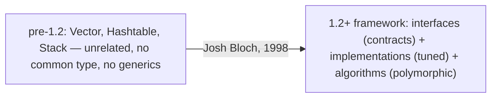
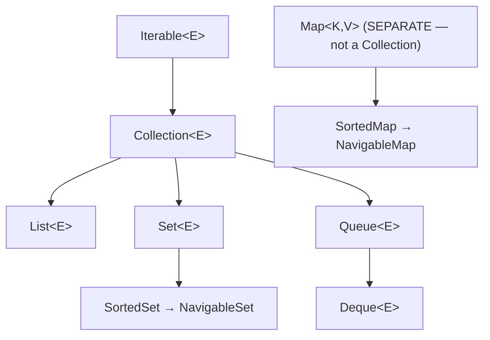
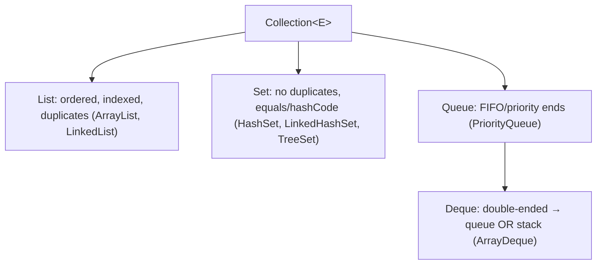
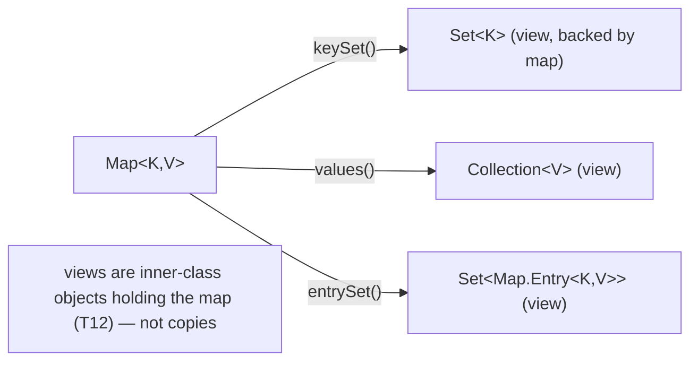
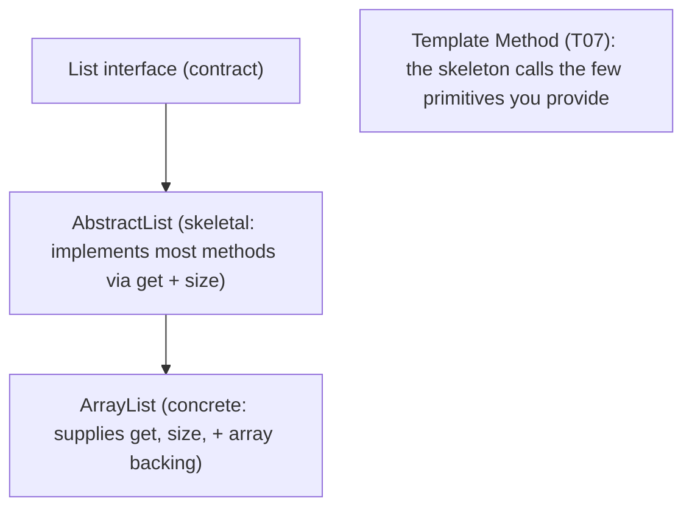
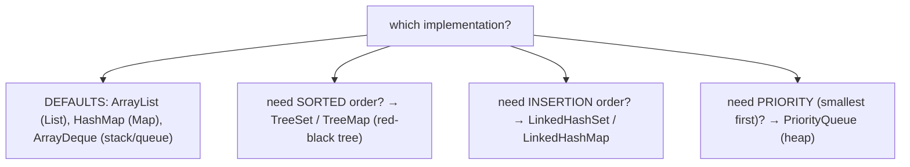
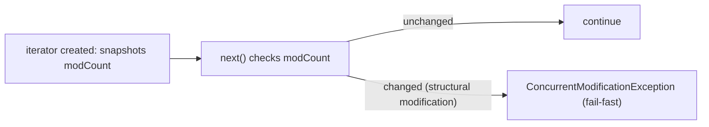
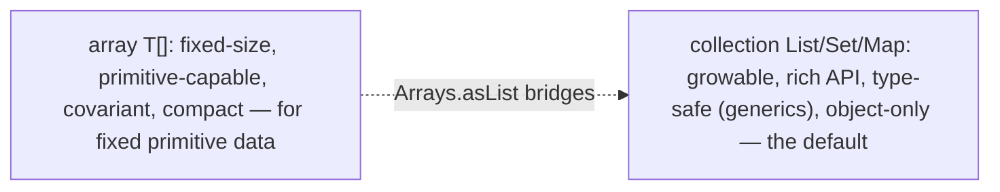
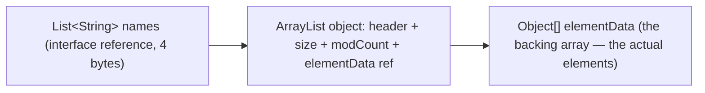
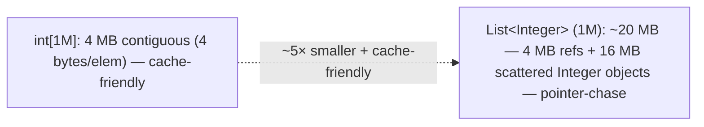

# Collections framework overview

The **Java Collections Framework** (JCF) is the JDK's unified architecture for storing and manipulating groups of objects — `List`, `Set`, `Queue`, `Map`, and their many implementations. It is one of the most-used and best-designed parts of the standard library: a small set of **interfaces** defining contracts (a `List` is ordered and indexed; a `Set` rejects duplicates; a `Map` keys values), a layer of **skeletal abstract implementations** that do most of the work, and a family of **concrete implementations** tuned for different performance trade-offs. This topic is the **map of the framework** — the interface hierarchy, the contracts, how the pieces fit, and the idioms that apply across all of them. The per-structure deep dives (how `ArrayList` resizes, how `HashMap` buckets work, how `TreeMap`'s red-black tree balances) come in [T02](./T02-list-arraylist-linkedlist.md)–[T05](./T05-queue-deque-priorityqueue-stack.md); here we build the scaffold they hang on.

This is also where everything from [L1/C01](../C01-oop/) pays off. The framework is built *on* the OOP machinery you just learned: collections are **generic interfaces** ([T08](../C01-oop/T08-interfaces-default-static-private-methods.md)) implemented by classes you select polymorphically ([T06](../C01-oop/T06-polymorphism-compile-time-vs-runtime.md)); `Set` and `Map` keys depend on correct **`equals`/`hashCode`** ([T10](../C01-oop/T10-equals-hashcode-tostring-contracts.md)); the skeletal classes are textbook **Template Method** ([T07](../C01-oop/T07-abstraction-and-abstract-classes.md)); the collection *views* a `Map` exposes are **inner classes** holding the enclosing map ([T12](../C01-oop/T12-inner-local-and-anonymous-classes.md)); and the modern immutable factories (`List.of`, `copyOf`) are the **immutability** discipline ([T19](../C01-oop/T19-immutability-and-immutable-class-design.md)) applied to data structures. The depth bar for this overview is to see the framework as an *architecture* — to know which interface to program against, why `Map` is deliberately *not* a `Collection`, what backing structure each implementation actually uses in memory, and the boxing cost that separates `List<Integer>` from `int[]`. By the end you'll read a collection type signature and immediately know its contract, its memory shape, and its rough performance — the foundation for choosing the right structure in every program you write.

> [!NOTE]
> Prerequisites: [equals/hashCode contracts](../C01-oop/T10-equals-hashcode-tostring-contracts.md) (`L1/C01/T10`) — `Set`/`Map` key requirements; [Immutability](../C01-oop/T19-immutability-and-immutable-class-design.md) (`L1/C01/T19`) — immutable collections, safe keys; [Interfaces](../C01-oop/T08-interfaces-default-static-private-methods.md) (`L1/C01/T08`) — the interface contracts the framework is built on; [Polymorphism](../C01-oop/T06-polymorphism-compile-time-vs-runtime.md) (`L1/C01/T06`) — program-to-the-interface; [Abstraction](../C01-oop/T07-abstraction-and-abstract-classes.md) (`L1/C01/T07`) — skeletal implementations as Template Method. Forward: [T02](./T02-list-arraylist-linkedlist.md) (List), [T03](./T03-set-hashset-linkedhashset-treeset.md) (Set), [T04](./T04-map-hashmap-linkedhashmap-treemap.md) (Map), [T05](./T05-queue-deque-priorityqueue-stack.md) (Queue/Deque), [T08](./T08-collection-performance-characteristics-big-o.md) (Big-O) hold the deep dives.

## Why a Framework — The Pre-1.2 Chaos

Before the Collections Framework arrived in **Java 1.2 (1998)**, the JDK had a handful of unrelated, inconsistent data-structure classes: `Vector`, `Hashtable`, `Stack`, `Properties`, and the `Enumeration` interface. They didn't share a common type — you couldn't write a method that accepted "any collection," because there was no `Collection` interface. Each had its own ad-hoc method names (`Vector.addElement` vs `Hashtable.put`), no generics (everything was `Object`, requiring casts), and no shared algorithms (no common `sort`, no common iteration protocol).

The framework, designed largely by **Joshua Bloch**, replaced this with a coherent architecture:

- **Interfaces** define the abstract data types (`List`, `Set`, `Queue`, `Map`) as *contracts*, independent of implementation.
- **Implementations** provide concrete, performance-tuned realizations (`ArrayList`, `HashMap`, …).
- **Algorithms** (in the `Collections` utility class) operate polymorphically on any implementation of an interface (`Collections.sort(anyList)`).

The result is one of the most-cited examples of good API design — consistent, extensible, and so successful that C# and other languages modelled their collection libraries on it. Understanding its *structure* is what lets you navigate dozens of classes with a handful of mental rules.



## The Two Hierarchies — Collection and Map

The framework has **two separate root interfaces**, and recognizing this split is the single most important orientation:

1. **`Collection<E>`** — a group of individual **elements** (a bag, a list, a set, a queue). Its root is actually `Iterable<E>` (which enables the for-each loop — [L0/C02/T09](../../L0-foundations/C02-java-core/T09-loops-while-do-while-for-for-each.md)).
2. **`Map<K, V>`** — a mapping from **keys to values**. **`Map` is NOT a `Collection`** — it's a deliberately separate hierarchy ([§ Why Map Is Not a Collection](#the-map-hierarchy--and-why-map-is-not-a-collection)).



Everything else is a refinement of one of these two roots. Internalize the split — "is this a collection of elements, or a mapping of keys to values?" — and the rest of the framework falls into place.

## The Collection Interface Family

`Collection<E>` (extending `Iterable<E>`) declares the operations common to all element-collections: `add`, `remove`, `contains`, `size`, `isEmpty`, `clear`, `iterator`, `stream`, `toArray`. Three sub-interfaces specialize it, each with a distinct **contract**:

### `List<E>` — Ordered and Indexed, Duplicates Allowed

A `List` is a **positionally ordered** sequence: elements have indices (`get(i)`, `set(i, e)`, `add(i, e)`), the order is meaningful and stable, and **duplicates are allowed**. It's the closest collection to an array. Implementations: `ArrayList` (array-backed), `LinkedList` (doubly-linked) — deep dive in [T02](./T02-list-arraylist-linkedlist.md).

```java
List<String> names = new ArrayList<>();
names.add("Alice"); names.add("Bob"); names.add("Alice");  // duplicates OK
names.get(0);          // "Alice" — indexed access
names.size();          // 3
```

### `Set<E>` — No Duplicates

A `Set` models a **mathematical set**: **no duplicate elements** (by `equals` — [T10](../C01-oop/T10-equals-hashcode-tostring-contracts.md)), and (for the hash-based ones) no positional order. Adding a duplicate is a no-op. `Set` is where **`equals`/`hashCode` correctness is load-bearing** — a `HashSet` uses `hashCode` to bucket and `equals` to deduplicate, so a broken `hashCode` ([T10](../C01-oop/T10-equals-hashcode-tostring-contracts.md)) silently lets "equal" elements coexist. Implementations: `HashSet`, `LinkedHashSet`, `TreeSet` — deep dive in [T03](./T03-set-hashset-linkedhashset-treeset.md).

```java
Set<String> tags = new HashSet<>();
tags.add("java"); tags.add("java");    // second add is a no-op
tags.size();                            // 1
```

`SortedSet`/`NavigableSet` (implemented by `TreeSet`) add a *sorted* order and navigation (`first`, `last`, `floor`, `ceiling`).

### `Queue<E>` and `Deque<E>` — Ends-Oriented

A `Queue` holds elements for **processing in an order**, typically FIFO (first-in-first-out): `offer` (add to tail), `poll` (remove from head), `peek` (inspect head). A `Deque` ("deck") is a **double-ended queue** — add/remove at *both* ends (`addFirst`/`addLast`, `pollFirst`/`pollLast`) — so it can serve as a queue *or* a stack. Implementations: `ArrayDeque` (circular array — the recommended stack and queue), `PriorityQueue` (a heap, orders by priority), `LinkedList` (also a `Deque`) — deep dive in [T05](./T05-queue-deque-priorityqueue-stack.md).

```java
Deque<Integer> stack = new ArrayDeque<>();
stack.push(1); stack.push(2);          // use as a stack (LIFO)
stack.pop();                            // 2

Queue<Integer> queue = new ArrayDeque<>();
queue.offer(1); queue.offer(2);        // use as a queue (FIFO)
queue.poll();                           // 1
```



## The Map Hierarchy — and Why Map Is Not a Collection

`Map<K, V>` is a separate hierarchy: an association of **unique keys** to values. Core operations: `put(k, v)`, `get(k)`, `remove(k)`, `containsKey`, `containsValue`, `size`. Keys are unique (a second `put` with the same key replaces the value); like `Set`, hash-based maps depend on the key's **`equals`/`hashCode`** ([T10](../C01-oop/T10-equals-hashcode-tostring-contracts.md)). Implementations: `HashMap`, `LinkedHashMap`, `TreeMap` — deep dive in [T04](./T04-map-hashmap-linkedhashmap-treemap.md).

**Why isn't `Map` a `Collection`?** Because a map isn't a collection of single elements — it's a collection of key→value *associations*. Making `Map extends Collection<?>` would be awkward: what would `add(E)` take? What would `iterator()` walk — keys, values, or pairs? Rather than force a bad fit, the framework keeps `Map` separate and connects it to the collection world through **three collection views**:

- **`keySet()`** → a `Set<K>` of the keys.
- **`values()`** → a `Collection<V>` of the values.
- **`entrySet()`** → a `Set<Map.Entry<K, V>>` of the key-value pairs.

These views are **backed by the map** — they're inner-class objects holding a reference to the enclosing map ([T12](../C01-oop/T12-inner-local-and-anonymous-classes.md)), not copies. Iterating `keySet()` walks the map's keys; `keySet().remove(k)` removes the entry from the map. This is how `Map` integrates with the framework (you can for-each over `entrySet()`, pass `values()` to a method taking a `Collection`) without the inheritance being a lie.



> [!INTERVIEW]
> "Is `Map` part of the Collections Framework? Is it a `Collection`?" It's *part of the framework* but is **not** a `Collection` — it's a separate root interface, because a map is key→value associations, not a bag of elements. It connects to the collection types through views: `keySet()` (a `Set`), `values()` (a `Collection`), `entrySet()` (a `Set<Map.Entry>`), each backed by the map.

## Skeletal Implementations — Template Method

Between the interfaces and the concrete classes sits a layer of **abstract skeletal implementations**: `AbstractCollection`, `AbstractList`, `AbstractSet`, `AbstractMap`, `AbstractQueue`. These implement *most* of an interface's methods in terms of a *few* primitive ones, so a concrete class (or your own custom collection) only has to supply the essentials. This is the **Template Method pattern** ([T07](../C01-oop/T07-abstraction-and-abstract-classes.md)) at framework scale:

- `AbstractList` implements `add`, `indexOf`, `iterator`, `equals`, `hashCode`, etc. given just `get(int)` and `size()` (for a random-access list).
- `AbstractSet` provides `equals`/`hashCode` honoring the `Set` contract, given an `iterator()` and `size()`.
- `AbstractMap` implements most of `Map` given just `entrySet()`.



To write your own collection, you extend the skeletal class and implement the handful of abstract methods — the framework supplies the rest. This is why custom collections are rare: the standard implementations already cover almost every need, and the skeletal classes make the few custom cases easy.

## The Concrete Implementations — A Tour

The implementations realize each interface with different performance trade-offs. Here's the map; the *mechanics* of each are the subject of [T02](./T02-list-arraylist-linkedlist.md)–[T05](./T05-queue-deque-priorityqueue-stack.md), and the comparative Big-O is [T08](./T08-collection-performance-characteristics-big-o.md):

| Interface | Implementation | Backing structure | Use when |
|-----------|----------------|-------------------|----------|
| `List` | `ArrayList` | resizable array | random access, iteration (the default List) |
| `List` | `LinkedList` | doubly-linked nodes | frequent add/remove at ends; also a `Deque` |
| `Set` | `HashSet` | a `HashMap` | fast membership, no order |
| `Set` | `LinkedHashSet` | `HashMap` + linked list | fast membership, insertion order |
| `Set` | `TreeSet` | red-black tree | sorted order, range queries |
| `Map` | `HashMap` | `Node[]` table (T10) | fast key lookup, no order (the default Map) |
| `Map` | `LinkedHashMap` | hash table + linked list | fast lookup, insertion/access order |
| `Map` | `TreeMap` | red-black tree | sorted by key, range queries |
| `Queue`/`Deque` | `ArrayDeque` | circular array | stack or queue (the default for both) |
| `Queue` | `PriorityQueue` | binary heap | retrieve smallest/largest first |

Two defaults to remember: **`ArrayList` is the default `List`**, **`HashMap` is the default `Map`**, **`ArrayDeque` is the default stack and queue** (not the legacy `Stack`). Reach for the others only when you need their specific property (sorting → `Tree*`; insertion order → `Linked*`; priority → `PriorityQueue`).



## Generics on Collections

Collections are **generic** ([T11](./T11-generics-basics.md)/[T12](./T12-generics-bounded-types-wildcards-type-erasure.md) for the full treatment): `List<String>`, `Map<String, Integer>`, `Set<Point>`. The type parameter makes them **type-safe** — the compiler ensures you only add the right type and you retrieve without casting:

```java
List<String> names = new ArrayList<>();
names.add("Alice");
String s = names.get(0);          // no cast — the compiler knows it's a String
names.add(42);                     // COMPILE ERROR — 42 is not a String
```

Before generics (Java 1.2–1.4), collections held raw `Object`, requiring casts on retrieval (`String s = (String) names.get(0)`) and offering no compile-time type checking — a `ClassCastException` waiting to happen. **Raw types** (`List` without `<>`) still compile for backward compatibility but are unsafe; always parameterize. Generics are erased at runtime ([T12](./T12-generics-bounded-types-wildcards-type-erasure.md)) — `List<String>` and `List<Integer>` are the same class at runtime — but the compile-time safety is the point.

## The `Collections` Utility Class

`java.util.Collections` (plural — distinct from the `Collection` interface) is a class of **static utility methods** that operate polymorphically on any collection:

```java
Collections.sort(list);                       // sort in place
Collections.reverse(list);
Collections.shuffle(list);
int i = Collections.binarySearch(sortedList, key);
T max = Collections.max(collection);
List<T> readOnly = Collections.unmodifiableList(list);   // read-only VIEW
List<T> empty = Collections.emptyList();                  // shared immutable empty
List<T> sync = Collections.synchronizedList(list);        // thread-safe wrapper (legacy-ish)
```

These embody the framework's "algorithms operate on interfaces" principle — `Collections.sort` works on *any* `List`, regardless of implementation. (`Arrays` is the parallel utility class for arrays.)

## Immutable and Unmodifiable Collections

Connecting to [T19](../C01-oop/T19-immutability-and-immutable-class-design.md): the framework offers read-only collections in two flavors, and the distinction matters:

- **Truly immutable** — `List.of(...)`, `Set.of(...)`, `Map.of(...)` (Java 9+) and `List.copyOf(...)` (Java 10+) create **genuinely immutable** collections: compact, can't be modified, throw `UnsupportedOperationException` on any mutation. Safe to share, cache, and use as keys ([T19](../C01-oop/T19-immutability-and-immutable-class-design.md)).
- **Unmodifiable views** — `Collections.unmodifiableList(list)` wraps an existing collection in a read-only *view*. You can't modify it *through the view*, but **the backing collection can still change** (and those changes show through the view). It's a one-way barrier, not a guarantee of immutability.

```java
List<String> immutable = List.of("a", "b");           // truly immutable
immutable.add("c");                                    // throws UnsupportedOperationException

List<String> backing = new ArrayList<>(List.of("a"));
List<String> view = Collections.unmodifiableList(backing);
view.add("c");                                         // throws (can't modify through view)
backing.add("c");                                      // OK — and now view shows [a, c] too!
```

> [!WARNING]
> `Collections.unmodifiableList` is an *unmodifiable view*, not an immutable copy — the backing list can still change, and the change is visible through the view. For a true immutable snapshot, use `List.copyOf(backing)` ([T19](../C01-oop/T19-immutability-and-immutable-class-design.md)).

## Fail-Fast Iterators

Most collections' iterators are **fail-fast**: they detect if the collection is **structurally modified** during iteration (by anything other than the iterator's own `remove`) and throw **`ConcurrentModificationException`** ([L0/C02/T09](../../L0-foundations/C02-java-core/T09-loops-while-do-while-for-for-each.md)). The mechanism is a **`modCount`** field — a modification counter the iterator snapshots at creation and checks on each `next()`; a mismatch means someone changed the collection, and iterating further could produce undefined behavior, so it fails fast instead.

```java
List<String> list = new ArrayList<>(List.of("a", "b", "c"));
for (String s : list) {
    if (s.equals("b")) list.remove(s);    // ConcurrentModificationException (modCount changed)
}
```

Fixes: use `Iterator.remove()` (the iterator-aware removal), `Collection.removeIf(predicate)`, iterate over a copy, or use a concurrent collection (`CopyOnWriteArrayList`, `ConcurrentHashMap`) that tolerates concurrent modification. Fail-fast is **best-effort** (it can't catch every case across threads), but it turns a class of silent bugs into loud exceptions.



## Arrays vs Collections

When do you reach for a collection over a plain array ([L0/C02/T11](../../L0-foundations/C02-java-core/T11-arrays-1-d-multi-dimensional.md))?

| Property | Array (`T[]`) | Collection (`List<T>`, etc.) |
|----------|---------------|------------------------------|
| Size | fixed at creation | growable/shrinkable |
| Primitives | yes (`int[]`) — no boxing | no — must box (`List<Integer>`) |
| Type variance | covariant (`String[]` is `Object[]`) | invariant (`List<String>` is not `List<Object>`) |
| Type safety | runtime (`ArrayStoreException`) | compile-time (generics) |
| API richness | minimal (`length`, indexing) | rich (add, remove, contains, stream, …) |
| Memory | compact, contiguous | object overhead + indirection |

Use **collections** for flexibility (growable, rich API, type-safe); use **arrays** for fixed-size primitive data where memory and cache performance dominate (`int[]` for a million numbers beats `List<Integer>` by ~5× memory — [§ Boxing Cost](#memory-layer--the-boxing-cost)). `Arrays.asList(array)` bridges an array to a (fixed-size) `List` view.



## Legacy Collections — and What Replaced Them

The pre-1.2 classes were retrofitted into the framework (so `Vector` implements `List`) but are **discouraged in new code**:

| Legacy | Problem | Modern replacement |
|--------|---------|--------------------|
| `Vector` | every method `synchronized` (slow even single-threaded) | `ArrayList` (or `CopyOnWriteArrayList` for concurrency) |
| `Hashtable` | synchronized; rejects `null` keys/values | `HashMap` (or `ConcurrentHashMap` for concurrency) |
| `Stack` | extends `Vector` (the broken-inheritance example — [T04](../C01-oop/T04-inheritance-and-super.md)); exposes `Vector`'s insert-anywhere methods | `ArrayDeque` (`push`/`pop`) |
| `Enumeration` | older, clunkier iterator | `Iterator` / for-each |

The legacy synchronized classes are a double mistake in modern code: their built-in synchronization is slow *and* insufficient (it locks each method but not compound operations), so for thread-safety you should use **`java.util.concurrent`** (`ConcurrentHashMap`, `CopyOnWriteArrayList`) — full coverage in **L3/C01**. For single-threaded code, use the unsynchronized `ArrayList`/`HashMap`/`ArrayDeque`.

## Memory Layer — Interface Reference, Implementation Object, Backing Structure

A collection in memory is **three layers** ([T01](../C01-oop/T01-classes-and-objects.md)/[T06](../C01-oop/T06-polymorphism-compile-time-vs-runtime.md)):

1. **The reference** — typed as the *interface* (`List<String> names`), a 4-byte pointer ([T01](../C01-oop/T01-classes-and-objects.md)).
2. **The implementation object** — the concrete instance (`new ArrayList<>()`) on the heap: a normal object with a header plus a few bookkeeping fields (size, modCount) and a reference to…
3. **The backing structure** — the actual storage: an `Object[]` for `ArrayList`, a chain of `Node` objects for `LinkedList`, a `Node[]` table for `HashMap` ([T10](../C01-oop/T10-equals-hashcode-tostring-contracts.md)).



This three-layer shape is why **"program to the interface"** works: the reference type is `List`, so callers depend only on the contract, while the object it points to can be any `List` implementation. Swapping `new ArrayList<>()` for `new LinkedList<>()` changes layer 2–3 (the object and its backing structure) without touching any code that holds the `List` reference. The *specific* backing structures and their costs are [T02](./T02-list-arraylist-linkedlist.md)–[T05](./T05-queue-deque-priorityqueue-stack.md); the point here is the layering.

## Memory Layer — The Boxing Cost

The framework's one unavoidable memory tax: **collections hold objects, not primitives.** A `List<Integer>` doesn't store `int` values — it stores references to boxed `Integer` objects ([L0/C02/T05](../../L0-foundations/C02-java-core/T05-type-conversion-and-casting.md)). Each element is a 16-byte `Integer` object on the heap plus a 4-byte reference in the backing array — versus a 4-byte `int` packed contiguously in an `int[]`:

```
int[1_000_000]:        4 MB, contiguous (one allocation, cache-friendly)
List<Integer> (1M):    ~20 MB — 4 MB of references + 16 MB of Integer objects,
                       scattered across the heap (pointer-chase, cache-hostile)
```

That's **~5× the memory** and a major cache penalty ([L0/C02/T05](../../L0-foundations/C02-java-core/T05-type-conversion-and-casting.md)/[T11](../../L0-foundations/C02-java-core/T11-arrays-1-d-multi-dimensional.md)) — the price of the framework's uniform object model. For large primitive datasets, this is why you reach for primitive arrays, or specialized primitive-collection libraries (Eclipse Collections, fastutil, the `IntStream`/primitive-stream APIs). Generic collections are the right default for *objects*; for millions of *primitives*, the boxing cost is real and the array is often the answer. (Project Valhalla's value classes aim to eventually erase this gap — [T01](../C01-oop/T01-classes-and-objects.md).)



## Architecture Layer — Program to the Interface

The framework's central design idiom, enabled by polymorphism ([T06](../C01-oop/T06-polymorphism-compile-time-vs-runtime.md)): **declare variables, parameters, and return types as the interface; instantiate the implementation.**

```java
// GOOD — program to the interface
List<String> names = new ArrayList<>();          // reference type = interface
void process(List<String> items) { ... }          // parameter = interface
Map<String, Integer> counts() { return new HashMap<>(); }   // return = interface

// AVOID — program to the implementation
ArrayList<String> names = new ArrayList<>();      // locks callers to ArrayList
void process(ArrayList<String> items) { ... }      // can't pass a LinkedList
```

Programming to the interface lets you **swap implementations** without changing callers — change `new ArrayList<>()` to `new LinkedList<>()` (or to a `List.of(...)`) and every method taking a `List` still works. It's the dependency-inversion principle ([T06](../C01-oop/T06-polymorphism-compile-time-vs-runtime.md)) applied to data structures, and it's why JCF code is so composable.

The dispatch cost is small: a method call through a `List` reference is `invokeinterface` ([T06](../C01-oop/T06-polymorphism-compile-time-vs-runtime.md)/[T08](../C01-oop/T08-interfaces-default-static-private-methods.md)) — a hair slower than `invokevirtual` at megamorphic sites, but the JIT devirtualizes monomorphic call sites (where the runtime type is always `ArrayList`) to direct, inlined calls ([T05](../C01-oop/T05-method-overriding.md)). So the flexibility of interface-typed references is essentially free in practice. The performance *that matters* is the algorithmic complexity of the operations — `ArrayList.get` is O(1), `LinkedList.get` is O(n) — which is the subject of [T08](./T08-collection-performance-characteristics-big-o.md).

## Cross-Language Perspective — Collection Libraries

Every language has a collections story, and the JCF sits in a clear lineage:

| Language | Collections | Interface hierarchy? | Notes |
|----------|-------------|----------------------|-------|
| **Java** | JCF (`List`, `Set`, `Map`, …) | yes — interfaces + skeletal + concrete | Bloch, 1998; the model |
| **C++** | STL (`vector`, `list`, `set`, `map`, `unordered_map`) | concepts (compile-time) | the inspiration: containers + iterators + algorithms |
| **Python** | built-in `list`, `dict`, `set`, `tuple` | protocols (duck-typed) | simpler, no explicit hierarchy |
| **C#** | `List<T>`, `Dictionary<K,V>`, `HashSet<T>` + `IEnumerable`/`IList` | yes — very close to Java | parallel design |

Two contrasts:

**C++'s STL was the inspiration.** The Standard Template Library (Stepanov, ~1994) introduced the architecture Java adopted: **containers** (data structures), **iterators** (a uniform traversal protocol), and **algorithms** (functions that work on any container via iterators — `std::sort`, `std::find`). Java's `Iterable`/`Iterator` is the STL iterator idea, and `Collections.sort` working on any `List` is the STL algorithm idea. The big difference: STL is **template-based** (compile-time polymorphism, zero-overhead, no common base type), while the JCF is **interface-based** (runtime polymorphism, a small dispatch cost, a shared `Collection` type you can reference). STL trades a common type for zero overhead; Java trades a little dispatch for a unifying type hierarchy.

**Python and C# bracket the design space.** Python has no interface hierarchy — `list`, `dict`, `set` are concrete built-ins unified only by informal *protocols* (anything with `__iter__` is iterable). It's simpler and less ceremonious, but you can't "program to the `List` interface" the way Java encourages — there's no `List` interface, just the concrete `list`. C#, designed after Java, landed almost exactly on the JCF's model (`IEnumerable<T>`, `ICollection<T>`, `IList<T>`, `IDictionary<K,V>` over `List<T>`, `Dictionary<K,V>`) — a sign the interface-hierarchy approach proved its worth. The JCF's influence is visible across the industry.

## Common Mistakes

> [!WARNING]
> **Programming to the implementation in signatures.** Declaring a parameter as `ArrayList<X>` instead of `List<X>` locks callers to that implementation — they can't pass a `LinkedList` or a `List.of(...)`. Use the interface type in fields, parameters, and returns; use the concrete type only at instantiation.

> [!WARNING]
> **Treating `Map` as a `Collection`.** `Map` is not a `Collection` — you can't for-each over a `Map` directly or pass it where a `Collection` is expected. Use its views: `map.entrySet()`, `map.keySet()`, `map.values()`.

> [!WARNING]
> **Modifying a collection during iteration.** Structural modification during a for-each (other than via the iterator) throws `ConcurrentModificationException`. Use `Iterator.remove()`, `removeIf`, iterate a copy, or a concurrent collection.

> [!WARNING]
> **Using `Vector`/`Hashtable`/`Stack` in new code.** They're legacy, slow (per-method synchronization), and `Stack` has a broken inheritance design. Use `ArrayList`/`HashMap`/`ArrayDeque`; for concurrency use `java.util.concurrent`.

> [!WARNING]
> **Raw types.** Using `List` without a type parameter (`List names = new ArrayList()`) loses compile-time type safety and forces casts. Always parameterize: `List<String>`.

> [!WARNING]
> **Confusing `Collections.unmodifiableList` with immutability.** It's an unmodifiable *view* — the backing list can still change. For a true immutable snapshot, use `List.copyOf` or `List.of`.

> [!WARNING]
> **Storing millions of primitives in a generic collection.** `List<Integer>` boxes every element (~5× the memory of `int[]`, cache-hostile). For large primitive datasets, use arrays or primitive-collection libraries.

> [!INTERVIEW]
> Common interview questions for this topic:
> 1. **What are the core interfaces of the Collections Framework?** `Collection` (root, extends `Iterable`) → `List`, `Set`, `Queue`/`Deque`; and the separate `Map` hierarchy.
> 2. **Is `Map` a `Collection`?** No — it's a separate root (key→value associations, not a bag of elements). It connects via views: `keySet`, `values`, `entrySet`.
> 3. **`List` vs `Set` vs `Queue`?** List: ordered, indexed, duplicates. Set: no duplicates (by `equals`/`hashCode`). Queue/Deque: ends-oriented (FIFO/priority/double-ended).
> 4. **What's "program to the interface"?** Declare references/parameters/returns as the interface (`List`), instantiate the implementation (`ArrayList`), so implementations can be swapped without changing callers.
> 5. **What are skeletal implementations?** Abstract classes (`AbstractList`, `AbstractMap`) that implement most of an interface given a few primitives — the Template Method pattern; you extend them to build custom collections cheaply.
> 6. **What's a fail-fast iterator?** One that detects structural modification during iteration (via `modCount`) and throws `ConcurrentModificationException` rather than risk undefined behavior. Best-effort.
> 7. **`List.of` vs `Collections.unmodifiableList`?** `List.of` is truly immutable; `unmodifiableList` is an unmodifiable *view* whose backing list can still change.
> 8. **Why do `Set` and `Map` keys need correct `equals`/`hashCode`?** Hash-based sets/maps bucket by `hashCode` and deduplicate/match by `equals`; a broken `hashCode` causes lost or duplicated elements ([T10](../C01-oop/T10-equals-hashcode-tostring-contracts.md)).
> 9. **Array vs collection?** Arrays: fixed-size, primitive-capable, compact, covariant. Collections: growable, rich API, type-safe (generics), object-only (boxing).
> 10. **Why avoid `Vector`/`Hashtable`?** Per-method synchronization (slow, and insufficient for compound operations); legacy design. Use `ArrayList`/`HashMap`, or `java.util.concurrent` for thread-safety.
> 11. **What's the memory cost of `List<Integer>` vs `int[]`?** ~5× — each element is a boxed `Integer` (16 bytes) plus a reference, scattered; an `int[]` packs 4-byte ints contiguously.
> 12. **What backing structures do the main implementations use?** `ArrayList` → array; `LinkedList` → doubly-linked nodes; `HashMap`/`HashSet` → hash table (`Node[]`); `TreeMap`/`TreeSet` → red-black tree; `ArrayDeque` → circular array; `PriorityQueue` → binary heap.

## Practice

1. **Map the hierarchy.** Draw the interface hierarchy from memory: `Iterable` → `Collection` → `List`/`Set`/`Queue`/`Deque`, and the separate `Map` → `SortedMap`/`NavigableMap`. Place `ArrayList`, `HashSet`, `TreeSet`, `HashMap`, `TreeMap`, `ArrayDeque`, `PriorityQueue` under their interfaces.

2. **Contracts.** For a `List`, a `Set`, and a `Queue`, write a few lines exercising each one's defining contract (duplicates in a List, dedup in a Set, FIFO in a Queue). Confirm the behaviors differ as specified.

3. **Map is not a Collection.** Try to for-each over a `Map` directly (compile error / no `iterator`). Then iterate `entrySet()`, `keySet()`, and `values()`. Confirm `keySet().remove(k)` removes the entry from the map (the view is backed by the map).

4. **Program to the interface.** Write a method `int total(List<Integer> xs)`. Call it with an `ArrayList` and a `LinkedList` and a `List.of(...)`; confirm all work. Then change the parameter to `ArrayList<Integer>`; observe you can no longer pass the others.

5. **Swap implementations.** Write code using a `List<String>` reference backed by `ArrayList`. Change only the instantiation to `LinkedList`; confirm nothing else changes. Discuss why (the reference type is the interface).

6. **Skeletal implementation.** Extend `AbstractList<String>` implementing only `get(int)` and `size()` (back it with an array). Confirm you get `iterator`, `contains`, `indexOf`, `equals`, `hashCode` for free from the skeleton (Template Method).

7. **Fail-fast.** Reproduce `ConcurrentModificationException` by removing during a for-each. Fix it three ways: `Iterator.remove()`, `removeIf`, and iterating a copy. Inspect `modCount` via reflection before and after a modification.

8. **Immutable vs unmodifiable.** Create `List.of("a","b")` and confirm `add` throws. Create `Collections.unmodifiableList(backing)`; confirm `add` through the view throws but mutating `backing` changes what the view shows. Switch to `List.copyOf(backing)`; confirm it's a true snapshot.

9. **Generics safety.** Declare a `List<String>`; confirm adding a non-String is a compile error and retrieval needs no cast. Then use a raw `List`; observe the lost type safety (and the unchecked warning).

10. **Collections utility tour.** Use `Collections.sort`, `reverse`, `shuffle`, `binarySearch`, `max`, `frequency`, and `unmodifiableList` on a `List`. Note they work on any `List` implementation (polymorphic algorithms).

11. **Array vs collection memory.** Build an `int[1_000_000]` and an `ArrayList<Integer>` of the same million values. Measure heap usage (JOL or `Runtime.totalMemory`); confirm the collection uses ~5× the memory. Explain the boxing.

12. **Legacy to modern.** Take code using `Vector`, `Hashtable`, and `Stack`; refactor to `ArrayList`, `HashMap`, and `ArrayDeque`. Note the legacy classes' synchronization and `Stack`'s `Vector`-inherited insert-anywhere methods.

13. **Backing structure inspection.** Use reflection (or a debugger) to inspect the private backing field of an `ArrayList` (`elementData`, an `Object[]`) and a `HashMap` (`table`, a `Node[]`). Confirm the three-layer shape (reference → object → backing structure).

14. **Default choices.** For five scenarios (a growable ordered list; a set of unique tags; a sorted set; a key→value cache; a stack), state which implementation you'd reach for and why. (Answers: ArrayList; HashSet; TreeSet; HashMap; ArrayDeque.)

15. **End-to-end explain-it-back.** For `List<String> names = new ArrayList<>(); names.add("x");`: (a) the reference `names` is typed as the `List` interface; (b) the object is an `ArrayList`, with a backing `Object[] elementData`; (c) `add` goes through `invokeinterface List.add`, dispatched to `ArrayList.add` (devirtualized if monomorphic); (d) the element is a reference into `elementData`; (e) why declaring `names` as `List` (not `ArrayList`) lets callers stay implementation-agnostic; (f) how this whole design rests on polymorphism (T06), interfaces (T08), and `equals`/`hashCode` for the Set/Map variants (T10). Twelve sentences max.

## Recap

You should now be able to:

**Language layer.**

- Recognize the two root hierarchies — `Collection` (elements) and `Map` (key→value) — and why `Map` is deliberately separate, connecting via views.
- Place `List`, `Set`, `Queue`/`Deque` under `Collection` and state each one's contract (ordered/indexed/duplicates; no duplicates; ends-oriented).
- Identify the major implementations and their default roles (`ArrayList`, `HashMap`, `ArrayDeque`) and when to choose the alternatives (`Tree*` for sorting, `Linked*` for order, `PriorityQueue` for priority).
- Explain skeletal implementations as Template Method (implement a few primitives, inherit the rest).
- Use generics for type-safe collections and avoid raw types.
- Use the `Collections` utility class and distinguish truly immutable (`List.of`/`copyOf`) from unmodifiable views (`Collections.unmodifiableList`).
- Recognize fail-fast iteration and `ConcurrentModificationException`, and the fixes.
- Choose between arrays and collections, and avoid legacy `Vector`/`Hashtable`/`Stack`.

**Memory layer.**

- Describe the three-layer shape: interface reference → implementation object → backing structure (array / linked nodes / hash table).
- Explain the boxing cost: `List<Integer>` uses ~5× the memory of `int[]` (boxed objects + references vs contiguous primitives).
- Identify the backing structure of each major implementation (deep mechanics deferred to T02–T05).

**Architecture layer.**

- Explain "program to the interface" and how it enables swapping implementations without changing callers.
- Recognize that interface dispatch (`invokeinterface`) is cheap and devirtualized at monomorphic sites — flexibility is essentially free; algorithmic complexity is what matters.
- Place the JCF in its lineage: C++ STL (containers + iterators + algorithms, the inspiration), Python (protocol-based, no hierarchy), C# (a parallel interface design) — and recognize the JCF as a model of API design.

This is the scaffold; the next four topics fill it in with the structures themselves. The single most useful habit from this overview: **read a collection type and immediately know its contract, its backing structure, and its rough cost** — the basis for choosing the right data structure every time.

## Next

Continue to [List (ArrayList, LinkedList)](./T02-list-arraylist-linkedlist.md) — the first deep dive, into the `List` interface and its two main implementations. We'll see exactly how `ArrayList`'s resizable array grows (the 1.5× capacity rule, `System.arraycopy`, amortized O(1) append) and how `LinkedList`'s doubly-linked nodes trade random-access speed for O(1) end operations — with the byte-level memory layout of each, the cache-behavior difference that makes `ArrayList` almost always the right default, and the Big-O that [T08](./T08-collection-performance-characteristics-big-o.md) will systematize across all the structures.
