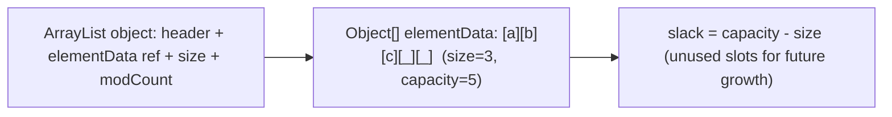
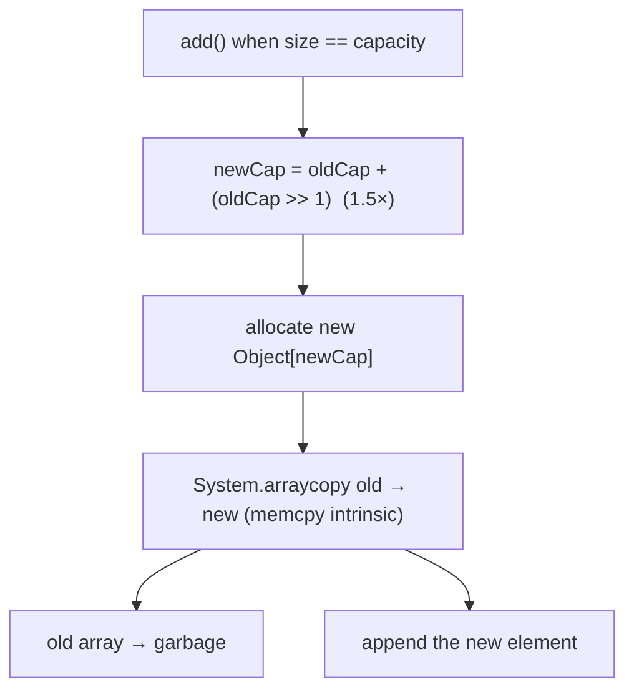
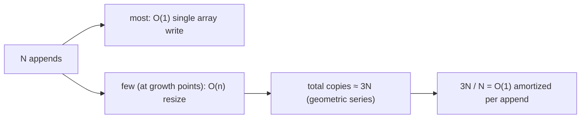
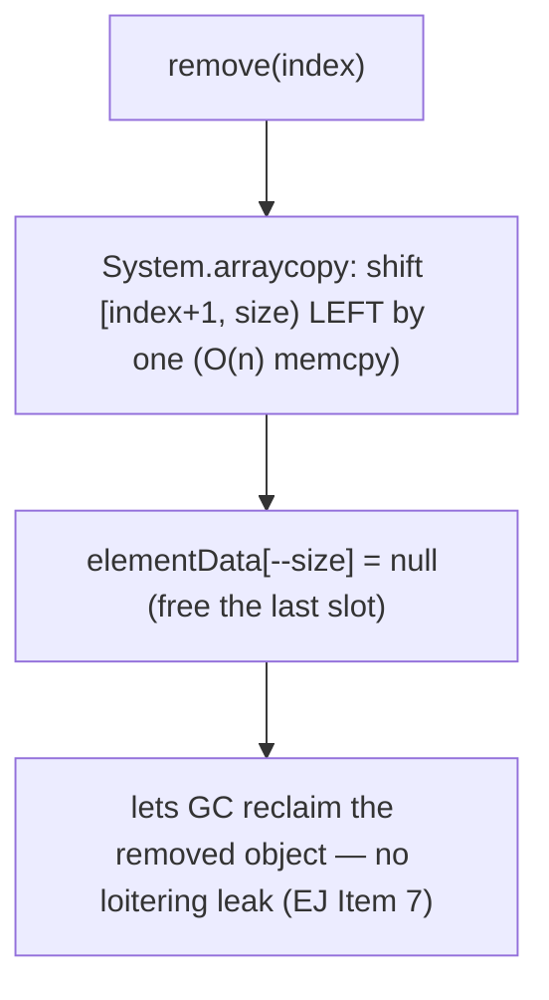
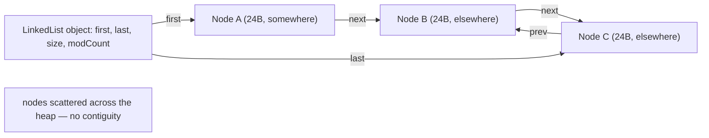
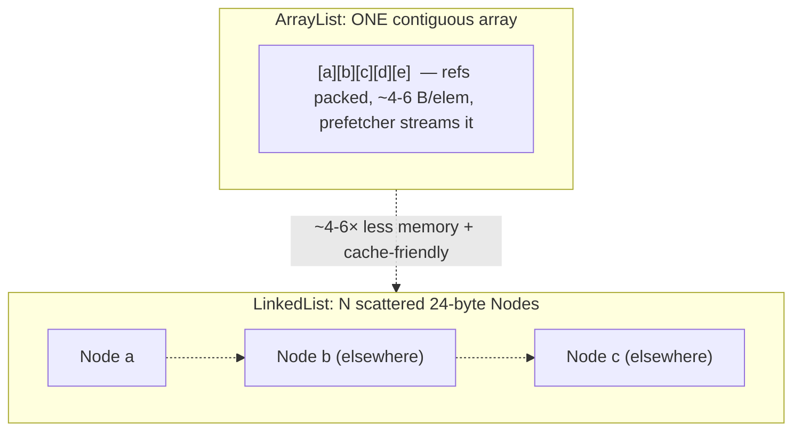
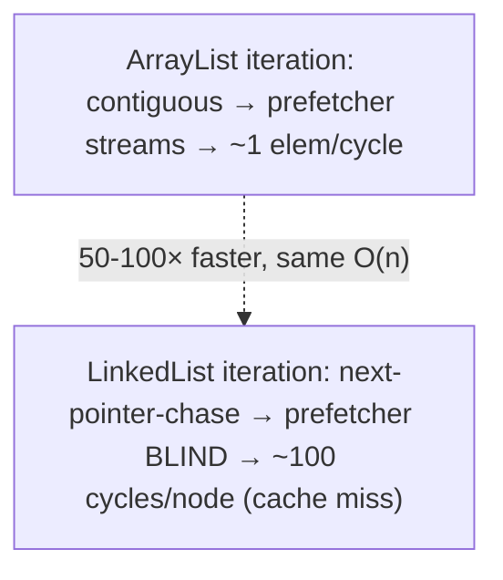
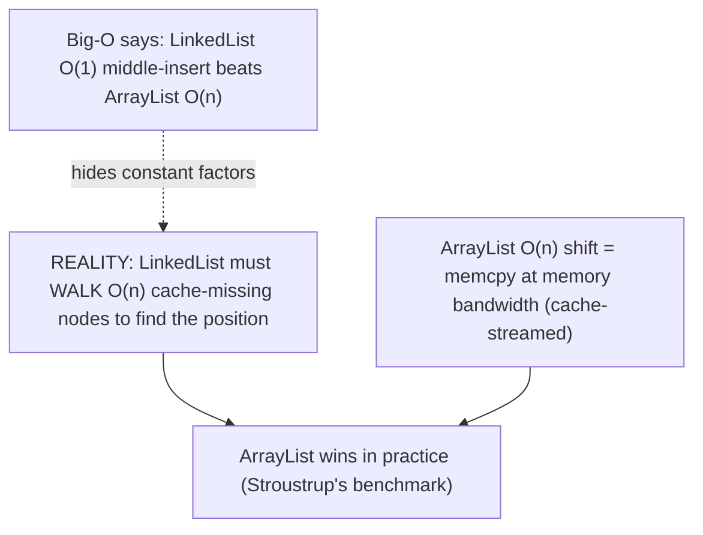
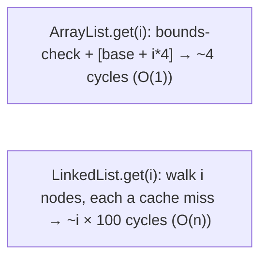
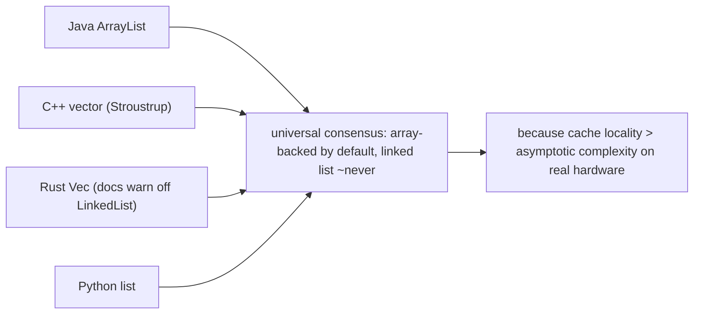

# List (ArrayList, LinkedList)

A **`List`** is the ordered, indexed, duplicate-allowing collection ([T01](./T01-collections-framework-overview.md)) — the closest thing to an array with a rich, growable API. The JDK ships two main implementations with opposite internal structures: **`ArrayList`**, backed by a **resizable array**, and **`LinkedList`**, backed by a **chain of doubly-linked nodes**. They have the same `List` interface and pass the same tests, but their performance profiles are mirror images — and the headline lesson of this topic, perhaps the single most important practical performance lesson in everyday programming, is that **`ArrayList` wins almost always**, even in the cases where Big-O notation predicts `LinkedList` should win. This is the first structural deep dive ([T01](./T01-collections-framework-overview.md) was the framework map); here we open up `ArrayList`'s array and `LinkedList`'s nodes down to the byte, work the amortized analysis of array growth, and see exactly why modern hardware makes the contiguous array beat the linked list.

The depth bar is the **memory layout and the cache story**. An `ArrayList` is an `Object[] elementData` plus an `int size` and an `int modCount`; appending grows the array by **1.5×** (not 2×) via `Arrays.copyOf`, which lowers to the `System.arraycopy` intrinsic — a `memcpy` running at memory bandwidth ([T01-L0/C02/T07](../../L0-foundations/C02-java-core/T07-stringbuilder-stringbuffer.md)). The growth makes append **amortized O(1)**: across N appends the total copy work is a geometric series summing to ~3N, so the per-append cost is constant. A `LinkedList` is N separate **`Node` objects** (each 24 bytes — header + item + next + prev — [T01](../C01-oop/T01-classes-and-objects.md)) **scattered across the heap**, so it costs ~4–6× the per-element memory *and*, far more importantly, defeats the CPU's hardware prefetcher: iterating it pointer-chases to unpredictable addresses, each a likely cache miss (~100 cycles), while iterating an `ArrayList` is a stride-1 scan the prefetcher streams at ~1 element/cycle ([L0/C02/T09](../../L0-foundations/C02-java-core/T09-loops-while-do-while-for-for-each.md)/[T11](../../L0-foundations/C02-java-core/T11-arrays-1-d-multi-dimensional.md)). This cache reality is why even a *mid-list insert* — `LinkedList`'s theoretical O(1) sweet spot — usually runs faster on an `ArrayList`: the array's `memcpy` shift streams at memory bandwidth, while the linked list must first *walk* O(n) cache-missing nodes just to find the position. By the end you'll predict the resize points of a growing `ArrayList`, explain why its append is amortized O(1), read the byte layout of both structures, and know — with the hardware reasons — why "use `ArrayList`; avoid `LinkedList`" is the right default.

> [!NOTE]
> Prerequisites: [Collections framework overview](./T01-collections-framework-overview.md) (`L1/C02/T01`) — the `List` contract, the three-layer shape, program-to-the-interface; [Classes & objects](../C01-oop/T01-classes-and-objects.md) (`L1/C01/T01`) — object header, references, allocation, caches; [Inner classes](../C01-oop/T12-inner-local-and-anonymous-classes.md) (`L1/C01/T12`) — `subList`/iterator views; [Arrays](../../L0-foundations/C02-java-core/T11-arrays-1-d-multi-dimensional.md) (`L0/C02/T11`) — array layout, scaled-index addressing, `System.arraycopy` intrinsic, the prefetcher; [Loops](../../L0-foundations/C02-java-core/T09-loops-while-do-while-for-for-each.md) (`L0/C02/T09`) — range-check elimination, cache behavior. Forward: [T05](./T05-queue-deque-priorityqueue-stack.md) (Deque — `LinkedList`'s other role), [T08](./T08-collection-performance-characteristics-big-o.md) (the full Big-O table).

## The List Contract and API

A `List<E>` is **positionally ordered**: every element has an index `[0, size)`, the order is stable, and **duplicates are allowed** ([T01](./T01-collections-framework-overview.md)). Beyond `Collection`'s methods, `List` adds index-based operations:

```java
List<String> names = new ArrayList<>();
names.add("Alice");              // append at end
names.add("Bob");
names.add(1, "Carol");           // insert at index 1 — shifts Bob right
names.get(0);                    // "Alice" — indexed read
names.set(0, "Alice2");          // replace at index 0
names.indexOf("Bob");            // 2 — first index of, or -1
names.remove(0);                 // remove at index (or remove(Object))
names.subList(0, 2);             // a VIEW of indices [0, 2)
names.sort(Comparator.naturalOrder());   // in-place sort
names.replaceAll(String::toUpperCase);   // map in place
```

Both `ArrayList` and `LinkedList` implement *all* of this identically from the caller's view — the difference is entirely in *how fast* each operation runs, which flows from the backing structure.

## ArrayList — The Resizable Array

`ArrayList` stores elements in an `Object[]` that it **grows as needed**. It's the **default `List`** and the right choice in the overwhelming majority of cases. Its defining strength is **O(1) random access** — `get(i)` is a single array index — and **cache-friendly iteration**.

```java
List<String> list = new ArrayList<>();      // empty — no backing array yet (lazy)
list.add("a");                               // first add allocates capacity-10 array
String s = list.get(500);                    // O(1) — direct array index
```

### ArrayList Memory Layout

The instance fields (OpenJDK):

```java
public class ArrayList<E> {
    transient Object[] elementData;   // the backing array (the elements live here as references)
    private int size;                 // logical element count (≤ elementData.length)
    protected transient int modCount; // structural-modification counter (from AbstractList) — fail-fast (T01)
}
```

The `ArrayList` *object* itself is small — a header plus three fields (~24 bytes) — and holds a reference to the separate `elementData` array, which holds the actual element references:

```
ArrayList object (compressed oops):
  +0   header        12 bytes
  +12  elementData   4 bytes (ref to the Object[])
  +16  size          4 bytes
  +20  modCount      4 bytes
  total: 24 bytes  →  + the Object[] backing array (16-byte header + capacity×4 bytes)
```

Two distinct numbers: **`size`** (how many elements you've added) and **capacity** (`elementData.length`, how many the array can hold). `size ≤ capacity`. The slack between them is unused space that growth manages.



An empty `ArrayList` (default constructor) is **lazy** — it holds a shared empty array and allocates the real capacity-10 array only on the first `add`. So thousands of empty `ArrayList`s cost almost nothing until used.

### The Resize Mechanism — 1.5× Growth

When `add` would exceed capacity, `ArrayList` **grows**. The mechanism (OpenJDK `grow`):

```java
private Object[] grow(int minCapacity) {
    int oldCapacity = elementData.length;
    int newCapacity = oldCapacity + (oldCapacity >> 1);   // oldCapacity × 1.5
    // (with overflow + minCapacity safeguards)
    return elementData = Arrays.copyOf(elementData, newCapacity);
}
```

The growth factor is **1.5×** (`oldCapacity + oldCapacity/2`), a common interview gotcha — many assume 2× (which C++ `std::vector` often uses). Java chose 1.5× as a memory/time trade-off: less wasted slack than 2×, at the cost of slightly more frequent resizes. Starting from the default capacity 10, the capacities go **10 → 15 → 22 → 33 → 49 → 73 → …**. Each resize calls `Arrays.copyOf`, which allocates a new, larger array and copies the old contents via **`System.arraycopy`** — a HotSpot intrinsic that lowers to `rep movs`/AVX/NEON `memcpy` running at memory bandwidth ([L0/C02/T07](../../L0-foundations/C02-java-core/T07-stringbuilder-stringbuffer.md)/[T11](../../L0-foundations/C02-java-core/T11-arrays-1-d-multi-dimensional.md)). The old array becomes garbage.



> [!TIP]
> If you know the final size, **pre-size**: `new ArrayList<>(expectedSize)` allocates the capacity up front and eliminates *all* resizes. For building a large list, this is a real win — no repeated allocate-and-copy. `ensureCapacity(n)` grows an existing list in one step; `trimToSize()` shrinks capacity down to size to reclaim slack.

### Amortized O(1) Append

A resize copies all `n` elements — that's O(n). So how can appending be "O(1)"? Because resizes are **rare and the work amortizes**. Consider N appends starting from a small capacity. Resizes happen at capacities `c, 1.5c, 2.25c, …` up to N. The total number of elements ever copied is a geometric series:

```
copies ≈ c + 1.5c + 2.25c + … + N  =  N × (1 + 1/1.5 + 1/1.5² + …)  ≈  N × 3
```

So across N appends, the total copy work is **~3N** — a constant (3) times N. Divide by N appends: **~3 copies per append, amortized — O(1)**. Most appends are a single array write (O(1)); the occasional resize is O(n) but happens so rarely (only at the growth points) that it averages out to a constant. This is the classic **amortized analysis** of a dynamic array, the same reason `StringBuilder` append is amortized O(1) ([L0/C02/T07](../../L0-foundations/C02-java-core/T07-stringbuilder-stringbuffer.md)).



### Remove and the Null-Out

`remove(i)` shifts the elements after `i` left by one (via `System.arraycopy`) and then **nulls out the now-vacated last slot**:

```java
public E remove(int index) {
    E oldValue = (E) elementData[index];
    int numMoved = size - index - 1;
    if (numMoved > 0)
        System.arraycopy(elementData, index+1, elementData, index, numMoved);  // shift left
    elementData[--size] = null;   // null out the freed slot
    return oldValue;
}
```

The null-out matters: without it, the array would keep a reference to the removed object, preventing the GC from reclaiming it — a **loitering object** / memory leak (*Effective Java* Item 7, "Eliminate obsolete object references"). Nulling the slot lets the object be collected. So `remove` is O(n) (the shift), and the null-out is the small but crucial GC-hygiene step.



## LinkedList — The Doubly-Linked List

`LinkedList` stores each element in its own **`Node`** object, chained by `prev`/`next` references. It maintains `first` and `last` pointers for O(1) access to the ends. It also implements `Deque` ([T05](./T05-queue-deque-priorityqueue-stack.md)), so it can serve as a queue or stack — though `ArrayDeque` beats it there too.

```java
public class LinkedList<E> {
    transient int size = 0;
    transient Node<E> first;
    transient Node<E> last;
    // modCount from AbstractList

    private static class Node<E> {
        E item;
        Node<E> next;
        Node<E> prev;
    }
}
```

### LinkedList Memory Layout

Each `Node` is a separate heap object holding three references:

```
Node object (compressed oops):
  +0   header   12 bytes
  +12  item     4 bytes (ref to the element)
  +16  next     4 bytes (ref to the next Node)
  +20  prev     4 bytes (ref to the prev Node)
  total: 24 bytes per node
```

So a `LinkedList` of N elements is N separate 24-byte `Node` objects, plus the `LinkedList` object (header + first + last + size + modCount), plus the elements themselves. The nodes are **allocated independently and scattered across the heap** — there's no contiguous block.



## The Headline Comparison — Memory and Cache

Put the two layouts side by side for N elements:



| | `ArrayList` | `LinkedList` |
|--|-------------|--------------|
| Per-element overhead | ~4–6 bytes (one array slot + growth slack) | **24 bytes** (a whole Node) |
| Layout | **one contiguous array** | N scattered Node objects |
| Allocations | ~1 (the array) + occasional resizes | **N** (one per element) |
| Cache behavior | stride-1, prefetcher-friendly | pointer-chase, prefetcher-blind |
| `get(i)` | **O(1)** array index | **O(n)** node walk |

The memory difference (~4–6× overhead) is real but secondary. The **cache difference is the decisive one**. An `ArrayList`'s elements (references) sit contiguously, so iterating them is a stride-1 scan the CPU's hardware prefetcher streams ahead of, hitting L1 at ~1 element/cycle ([L0/C02/T09](../../L0-foundations/C02-java-core/T09-loops-while-do-while-for-for-each.md)/[T11](../../L0-foundations/C02-java-core/T11-arrays-1-d-multi-dimensional.md)). A `LinkedList`'s nodes are scattered, so iterating *pointer-chases* — and the prefetcher **cannot follow**, because the next node's address depends on reading the current node's `next` field (a data dependency the prefetcher can't predict). Each node access is a likely cache miss (~100 cycles cold). So iterating a million-element `LinkedList` can be **50–100× slower** than an `ArrayList` of the same size — and both iterations are O(n)! The difference is pure cache behavior, invisible to Big-O.



## ListIterator and subList

Two `List` features worth knowing:

**`ListIterator`** is a bidirectional iterator (`next`/`previous`, `hasNext`/`hasPrevious`) that can also `set` (replace the current element), `add` (insert), and `remove` during iteration. For `LinkedList`, the `ListIterator` is the *one* place it shines: inserting/removing at the cursor is genuinely O(1) (you're already at the node, no walk). If you have a real local-edit-during-traversal workload, that's `LinkedList`'s niche.

**`subList(from, to)`** returns a **view** backed by the original list — an inner-class object holding the parent ([T12](../C01-oop/T12-inner-local-and-anonymous-classes.md)), *not* a copy. Changes through the sublist write through to the parent, and structurally modifying the parent (not via the sublist) **invalidates** the sublist (`ConcurrentModificationException` on next use). For a copy, wrap it: `new ArrayList<>(list.subList(from, to))`.

```java
List<Integer> list = new ArrayList<>(List.of(0,1,2,3,4));
List<Integer> mid = list.subList(1, 4);    // view of [1,2,3]
mid.set(0, 99);                              // writes through: list is now [0,99,2,3,4]
list.add(5);                                 // structural mod to parent
mid.get(0);                                  // ConcurrentModificationException — view invalidated
```

> [!WARNING]
> `subList` is a *view*, not a copy. Mutations write through to the backing list, and modifying the backing list (outside the sublist) invalidates the view. Wrap it in `new ArrayList<>(...)` when you need an independent copy.

## `Arrays.asList` vs `List.of` vs Copy

Three ways to make a `List` from elements, with different mutability:

| Expression | Mutability | Backed by |
|------------|-----------|-----------|
| `Arrays.asList(arr)` | **fixed-size** (set OK, add/remove throw) | the array (writes through both ways) |
| `List.of(a, b, c)` | **immutable** (all mutation throws — [T19](../C01-oop/T19-immutability-and-immutable-class-design.md)) | internal, immutable |
| `new ArrayList<>(List.of(...))` | **fully mutable** | a fresh array (independent copy) |

`Arrays.asList` returns a fixed-size `List` view *backed by the array* — you can `set` elements (the change shows in the array and vice versa) but not `add`/`remove` (`UnsupportedOperationException`). `List.of` (Java 9+) is truly immutable. For a mutable list, copy into `new ArrayList<>(...)`. (Recall the [L0/C02/T11](../../L0-foundations/C02-java-core/T11-arrays-1-d-multi-dimensional.md) trap: `Arrays.asList(intArray)` gives a `List<int[]>` of size 1, not a `List<Integer>` — varargs can't bind a primitive array. Use a boxed array or a stream.)

## The Decision — Why ArrayList Almost Always Wins

The Big-O table *suggests* a nuanced choice:

| Operation | `ArrayList` | `LinkedList` |
|-----------|-------------|--------------|
| `get(i)` / `set(i)` | **O(1)** | O(n) |
| `add` (at end) | amortized O(1) | O(1) |
| `add(0, e)` / remove front | O(n) | **O(1)** |
| `add(i, e)` (middle) | O(n) shift | O(1) *if at the node* + O(n) to find it |
| iteration | O(n), cache-friendly | O(n), cache-hostile |
| memory | low overhead | ~24 B/element |

By Big-O alone, you'd pick `LinkedList` for front/middle insertion. **In practice, `ArrayList` still usually wins**, because Big-O hides the constant factors that dominate at realistic sizes:

- **Random access**: `ArrayList` O(1) vs `LinkedList` O(n) — `ArrayList` wins decisively.
- **Iteration**: `ArrayList`'s cache-friendly scan beats `LinkedList`'s pointer-chase by 50–100× — `ArrayList` wins.
- **Middle insert**: `LinkedList`'s "O(1) insert" requires first *walking* O(n) cache-missing nodes to find the position — and that walk dominates. `ArrayList`'s "O(n) shift" is a `System.arraycopy` `memcpy` streaming at memory bandwidth. For a million-element list, the `ArrayList` shift copies a few MB at ~10 GB/s (~hundreds of µs), while the `LinkedList` walk is n/2 cache misses (~tens of ms). **`ArrayList` wins by orders of magnitude.** (The only exception: you're already at the position via a `ListIterator`, so there's no walk.)

This is the famous result from **Bjarne Stroustrup's "Are lists evil?"** benchmark (and echoed across the industry): even on insertion/deletion-heavy workloads that *look* tailor-made for a linked list, the contiguous `vector`/`ArrayList` wins because cache locality dominates asymptotic complexity. **The practical rule: use `ArrayList` by default; reach for `LinkedList` essentially never** — and for queue/stack/deque use `ArrayDeque` ([T05](./T05-queue-deque-priorityqueue-stack.md)), which beats `LinkedList` at its own game.



## Architecture — `get(i)`: Array Load vs Node Walk

The two structures' random-access cost is the sharpest contrast.

**`ArrayList.get(i)`** is a bounds check plus one array load:

```
; elementData[i]  (elementData base in a register, i in another)
cmp   i, size                    ; bounds check (often ELIMINATED by RCE in loops — L0/C02/T09)
jae   throw_IndexOutOfBounds
mov   rax, [elementData + 16 + i*4]   ; array header 16 + i × 4 (scaled-index, L0/C02/T11)
```

~4 cycles on an L1 hit; in a hot loop the JIT's **range-check elimination** ([L0/C02/T09](../../L0-foundations/C02-java-core/T09-loops-while-do-while-for-for-each.md)) often removes the bounds check entirely, leaving a single load. O(1), fast, cache-friendly.

**`LinkedList.get(i)`** walks the chain (from `first` or `last`, whichever is nearer):

```
node = first
for (k = 0; k < i; k++)
    node = node.next       ; each iteration: load node.next, dereference the next Node (likely CACHE MISS)
```

O(i) pointer dereferences, each to a scattered `Node` — a likely cache miss (~100 cycles cold). For `get(n/2)`, that's n/2 cache misses. This is why an **indexed loop over a `LinkedList` is O(n²)**: `for (int i=0; i<list.size(); i++) list.get(i)` walks ~n/2 nodes on each of n iterations ([L0/C02/T09](../../L0-foundations/C02-java-core/T09-loops-while-do-while-for-for-each.md) callback) — catastrophic. (Use a `for-each` / iterator, which walks once.)



## Cross-Language Perspective — Array-List Beats Linked-List Everywhere

The "use the array-backed list, avoid the linked list" lesson is **universal across modern languages** — every mainstream language's default sequence is array-backed, and linked lists are a niche or discouraged choice:

| Language | Array-backed (the default) | Linked list | Verdict |
|----------|----------------------------|-------------|---------|
| **Java** | `ArrayList` | `LinkedList` | use `ArrayList` |
| **C++** | `std::vector` | `std::list` | "use `vector` by default" (Stroustrup) |
| **Python** | `list` (array-backed) | none built-in (`deque` is block-linked) | `list` always |
| **C#** | `List<T>` | `LinkedList<T>` (rare) | `List<T>` |
| **Rust** | `Vec<T>` | `LinkedList<T>` | docs literally recommend against `LinkedList` |

**C++'s `std::vector` is the canonical default container**, and Stroustrup's talks ("Are lists evil?", "Why you should avoid linked lists") made the cache argument famous: he benchmarked the textbook "linked lists are better for insertion" claim and found `vector` winning even on insertion-heavy workloads, because the linear search to find the insertion point (and the cache-unfriendliness of scattered nodes) overwhelms the O(1) splice. **Rust's documentation is even blunter** — the `LinkedList` docs say it is "almost always better to use `Vec` or `VecDeque`." The agreement is total: contiguous memory beats pointer-chasing on modern hardware, and the asymptotic advantage of linked lists almost never materializes because the constant factors (cache misses, allocations) dominate at every realistic size. Java's `ArrayList`-by-default is the same wisdom, and one of the most transferable performance lessons you'll learn.



## Common Mistakes

> [!WARNING]
> **Indexed loop over a `LinkedList`.** `for (int i=0; i<list.size(); i++) list.get(i)` is O(n²) — each `get` walks ~n/2 nodes. Use a `for-each`/iterator (walks once, O(n)). Better: don't use `LinkedList`.

> [!WARNING]
> **Choosing `LinkedList` from the Big-O table without measuring.** Its O(1) front/middle insert is a trap — the O(n) walk-to-position and cache-hostility make `ArrayList` faster in practice. Measure; you'll almost always find `ArrayList` wins.

> [!WARNING]
> **Not pre-sizing a large `ArrayList`.** Building a million-element list from the default capacity triggers ~30 resizes (each an allocate-and-copy). `new ArrayList<>(1_000_000)` eliminates them.

> [!WARNING]
> **Treating `subList` as a copy.** It's a view backed by the parent — mutations write through, and modifying the parent invalidates it. Wrap in `new ArrayList<>(...)` for a copy.

> [!WARNING]
> **Modifying a list during a for-each.** Structural modification (other than via the iterator) throws `ConcurrentModificationException` ([T01](./T01-collections-framework-overview.md)). Use `Iterator.remove()`, `removeIf`, or iterate a copy.

> [!WARNING]
> **Expecting `Arrays.asList` to be growable.** It's fixed-size — `add`/`remove` throw. And `Arrays.asList(primitiveArray)` gives a size-1 `List` of the array, not a list of the elements ([L0/C02/T11](../../L0-foundations/C02-java-core/T11-arrays-1-d-multi-dimensional.md)).

> [!INTERVIEW]
> Common interview questions for this topic:
> 1. **`ArrayList` vs `LinkedList` — when each?** `ArrayList` for almost everything (O(1) random access, cache-friendly iteration, low memory). `LinkedList` essentially never — even its O(1) insert is beaten by `ArrayList` in practice; for queue/stack use `ArrayDeque`.
> 2. **How does `ArrayList` grow?** By 1.5× (`oldCapacity + oldCapacity/2`), via `Arrays.copyOf` → `System.arraycopy`. Default capacity 10 (lazily allocated on first add).
> 3. **Why is `ArrayList` append amortized O(1)?** Resizes are rare and the copy work is a geometric series summing to ~3N across N appends, so per-append it's a constant.
> 4. **Why is `LinkedList` slow despite O(1) inserts?** Random access and the walk-to-position are O(n) and cache-hostile (scattered 24-byte nodes, prefetcher-blind). The constant factors dominate; `ArrayList`'s cache-friendly array wins.
> 5. **`size` vs capacity?** `size` is the element count; capacity (`elementData.length`) is the array's physical length. `size ≤ capacity`; growth manages the slack.
> 6. **Why does `ArrayList.remove` null out the slot?** To let the GC reclaim the removed object — otherwise the array holds a stale reference (a loitering-object leak).
> 7. **What's a `LinkedList` `Node`'s memory cost?** 24 bytes (header + item + next + prev), one per element, scattered — ~4–6× `ArrayList`'s per-element overhead.
> 8. **Indexed loop over `LinkedList` complexity?** O(n²) — each `get(i)` walks ~i nodes. Use an iterator.
> 9. **`Arrays.asList` vs `List.of` vs `new ArrayList<>()`?** Fixed-size array-backed view; truly immutable; fully mutable copy.
> 10. **Is `subList` a copy?** No — a view backed by the parent; write-through, and parent modification invalidates it.
> 11. **How do you eliminate `ArrayList` resizes?** Pre-size with `new ArrayList<>(expectedSize)` or `ensureCapacity`.
> 12. **Why do all modern languages default to array-backed lists?** Cache locality dominates asymptotic complexity on real hardware (Stroustrup's benchmark) — contiguous memory beats pointer-chasing.

## Practice

1. **Observe the resize points.** Add 100 elements to an `ArrayList`, using reflection to read `elementData.length` after each add. Record where capacity jumps; confirm the sequence 10 → 15 → 22 → 33 → … (1.5× growth).

2. **Prove 1.5× (not 2×).** From the capacity sequence in #1, confirm each new capacity is `old + old/2`, not `old × 2`. Note this is a common interview gotcha.

3. **Amortized append timing.** Time N appends to a default `ArrayList` vs a pre-sized one (`new ArrayList<>(N)`). Confirm the pre-sized is faster (no resizes) but both are roughly linear in N (amortized O(1) per append).

4. **`System.arraycopy` in resize.** Run with `-XX:+UnlockDiagnosticVMOptions -XX:+PrintIntrinsics`; confirm `System.arraycopy` is intrinsified during `ArrayList` growth. (Or inspect `Arrays.copyOf` → `System.arraycopy` in the source.)

5. **Null-out on remove.** Remove an element from an `ArrayList` and use reflection to confirm the vacated last slot is `null` (not a stale reference). Explain the loitering-leak it prevents.

6. **Random-access benchmark.** Fill an `ArrayList` and a `LinkedList` with a million elements. Time `get(n/2)` on each repeatedly. Confirm `ArrayList` is O(1) (~ns) and `LinkedList` is O(n) (~ms) — orders of magnitude.

7. **Indexed-loop O(n²) trap.** Loop a 100,000-element `LinkedList` with `for (int i...) get(i)`. Time it. Then loop with a `for-each`. Confirm the indexed loop is dramatically slower (O(n²) vs O(n)).

8. **Iteration cache benchmark.** Iterate (for-each) a million-element `ArrayList` and `LinkedList`, summing. Time both. Confirm `LinkedList` is ~50–100× slower despite both being O(n) — pure cache behavior.

9. **Mid-insert benchmark (the surprise).** Insert 10,000 elements at random middle positions into a large `ArrayList` vs `LinkedList`. Confirm `ArrayList` wins despite its "O(n) shift" — the `LinkedList` walk-to-position dominates.

10. **Node memory via JOL.** Use JOL (`jol-cli internals java.util.LinkedList$Node`) to confirm the 24-byte node layout. Compare the total memory of a million-element `LinkedList` vs `ArrayList`.

11. **`subList` view.** Create a `subList`, mutate through it (write-through to parent), then structurally modify the parent and confirm the next sublist access throws `ConcurrentModificationException`. Then take a copy with `new ArrayList<>(...)` and confirm it's independent.

12. **`ListIterator` local edit.** Use a `ListIterator` on a `LinkedList` to insert/remove at the cursor during traversal. Note this is the one case `LinkedList` is genuinely O(1) (no walk).

13. **`Arrays.asList` semantics.** Create `Arrays.asList(arr)`; `set` an element (confirm it writes through to `arr`); try `add` (confirm `UnsupportedOperationException`). Then `Arrays.asList(intArray)` and confirm `size()` is 1 (the primitive-array trap).

14. **Pre-sizing payoff.** Build a 10-million-element list two ways (default vs pre-sized). Measure time and peak allocation (`-verbose:gc` or a profiler). Confirm the default version does many resizes and allocates more.

15. **End-to-end explain-it-back.** Trace `list.add("x")` on an `ArrayList` at `size == capacity == 10`: (a) `add` sees no room; (b) `grow` computes newCap = 10 + 5 = 15; (c) `Arrays.copyOf` allocates `Object[15]`, `System.arraycopy` memcpys the 10 refs (intrinsic); (d) the old array becomes garbage; (e) `"x"` is written at index 10, size becomes 11; (f) why this resize is O(n) but the append is amortized O(1) across many adds. Twelve sentences max.

## Recap

You should now be able to:

**Language layer.**

- State the `List` contract (ordered, indexed, duplicates) and use the index-based API (`get`/`set`/`add(i,e)`/`indexOf`/`subList`/`sort`/`replaceAll`).
- Distinguish `ArrayList` (resizable array, default) from `LinkedList` (doubly-linked nodes, also a `Deque`).
- Use `ListIterator` for bidirectional traversal and in-place edits, and recognize it as `LinkedList`'s one sweet spot.
- Recognize `subList` as a view (not a copy) and the `Arrays.asList`/`List.of`/`new ArrayList<>()` mutability ladder.
- Choose `ArrayList` by default and know `LinkedList` is essentially never the right choice.

**Memory layer.**

- Describe `ArrayList`'s layout (`Object[] elementData` + `size` + `modCount`), the lazy empty array, and `size` vs capacity.
- Explain the 1.5× growth mechanism (`oldCap + oldCap/2`, `Arrays.copyOf` → `System.arraycopy`) and the resize sequence.
- Work the amortized O(1) append analysis (geometric series → ~3N total copies for N appends).
- Explain the null-out on remove (loitering-object prevention).
- Describe `LinkedList`'s 24-byte scattered `Node` layout and the ~4–6× memory overhead vs `ArrayList`.

**Architecture layer.**

- Contrast `ArrayList.get` (bounds check + scaled-index load, ~4 cycles, RCE in loops) with `LinkedList.get(i)` (O(n) node walk, ~100 cycles/node cache miss).
- Explain why `ArrayList` iteration is prefetcher-friendly (stride-1) and `LinkedList` iteration is prefetcher-blind (data-dependent pointer-chase) — a 50–100× difference at the same O(n).
- Explain why `ArrayList` beats `LinkedList` even on middle inserts (memcpy shift vs O(n) cache-missing walk-to-position) — the Stroustrup benchmark.
- Place the result in the cross-language consensus (`vector`/`list`, `List<T>`/`LinkedList<T>`, `Vec`/`LinkedList`) — array-backed wins everywhere because cache locality dominates asymptotic complexity.

This is the template for the structural deep dives: open the backing structure, work the memory and the resize/balance mechanics, then explain the performance with the cache and CPU reasons behind the Big-O. The next two topics apply it to `Set` and `Map`, where the backing structure is a hash table or a balanced tree and `equals`/`hashCode` ([T10](../C01-oop/T10-equals-hashcode-tostring-contracts.md)) becomes load-bearing.

## Next

Continue to [Set (HashSet, LinkedHashSet, TreeSet)](./T03-set-hashset-linkedhashset-treeset.md) — the no-duplicates collection, where `HashSet` is backed by a `HashMap` (the hash-table mechanics from [T10](../C01-oop/T10-equals-hashcode-tostring-contracts.md) — buckets, spreading, treeification), `LinkedHashSet` adds insertion-order via a linked list through the entries, and `TreeSet` is a red-black tree giving sorted order and range queries. We'll see why `Set` membership leans entirely on correct `equals`/`hashCode`, and the memory and performance of each variant.
