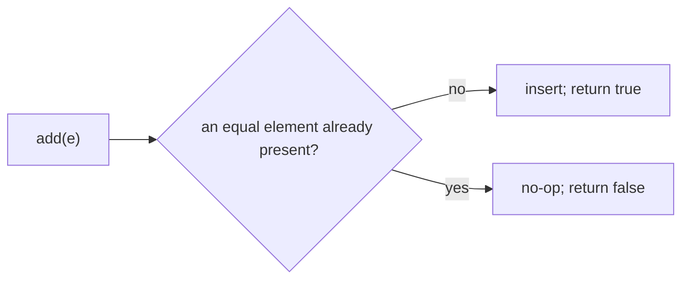
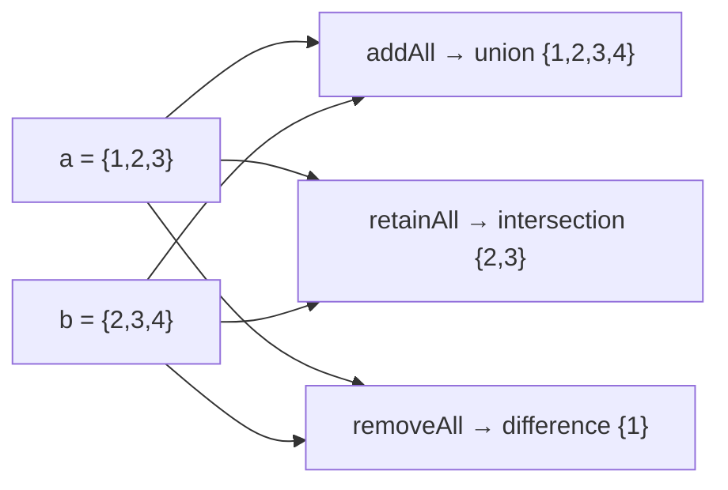
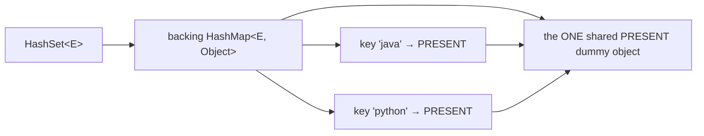
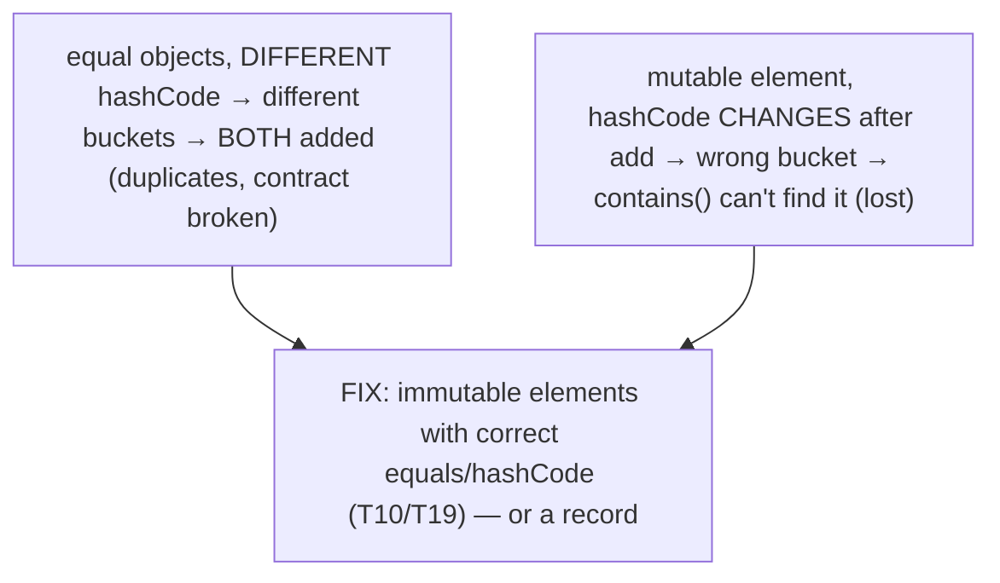
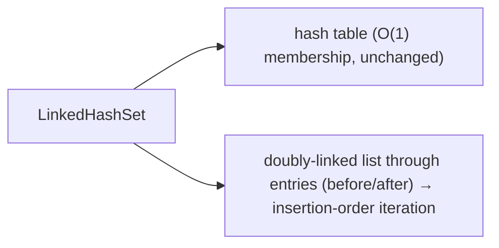
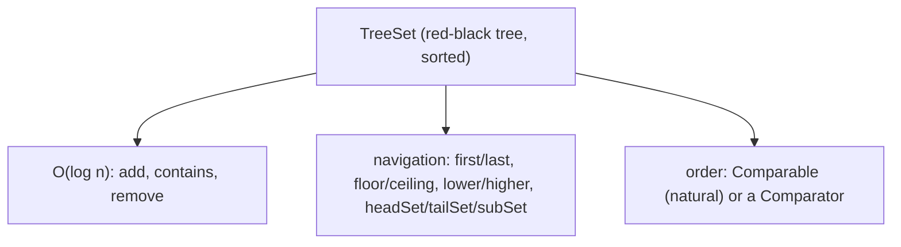
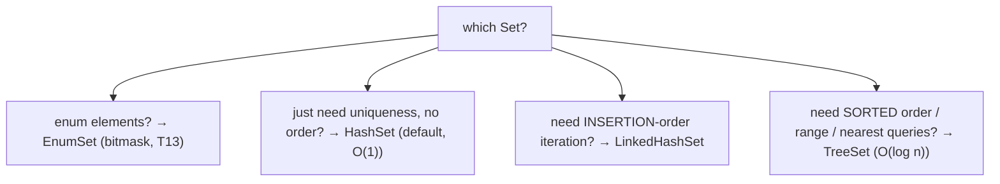
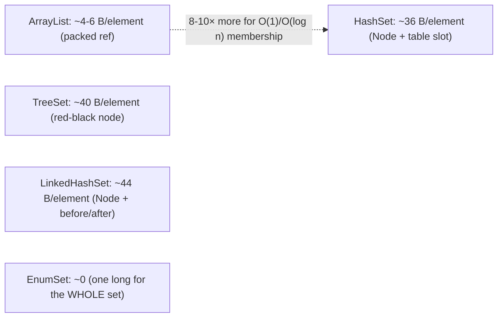
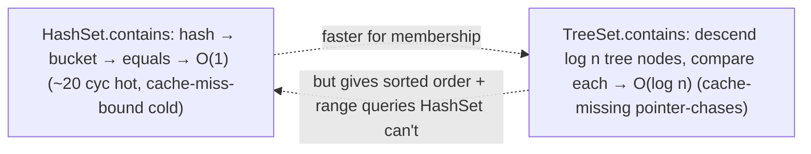
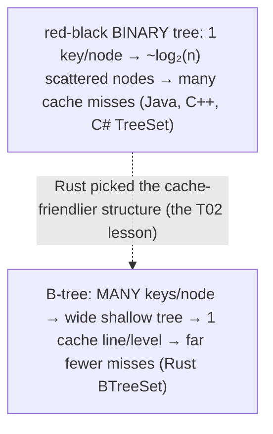

# Set (HashSet, LinkedHashSet, TreeSet)

A **`Set`** is the collection that models a mathematical set: **no duplicate elements** ([T01](./T01-collections-framework-overview.md)). Where a `List` ([T02](./T02-list-arraylist-linkedlist.md)) keeps every element you add in order, a `Set` keeps at most one of each — adding a duplicate is a no-op. The three main implementations differ in *how* they decide "duplicate" and *what order* they iterate: **`HashSet`** uses a hash table (fast, no order), **`LinkedHashSet`** adds insertion-order iteration, and **`TreeSet`** keeps elements sorted in a red-black tree with range queries. This is where **`equals`/`hashCode` ([T10](../C01-oop/T10-equals-hashcode-tostring-contracts.md)) become load-bearing** — a `Set`'s entire correctness rests on them, and a broken `hashCode` silently lets "equal" elements coexist or makes elements vanish.

The depth bar is the **backing structure each one reuses**. The striking fact: **`HashSet` *is* a `HashMap`** — internally, each element is stored as a *key* mapping to a single shared dummy value (`PRESENT`), so `HashSet` has almost no code of its own; it delegates everything to `HashMap`. That means a `HashSet`'s memory and performance *are* a `HashMap`'s ([T10](../C01-oop/T10-equals-hashcode-tostring-contracts.md)): the `Node[]` table, the 32-byte `Node` per element, hash spreading, bucketing, and treeification all apply — with the value slot of every node holding the same shared `PRESENT` reference. `LinkedHashSet` is backed by a `LinkedHashMap` (entries threaded into a doubly-linked list for insertion order, +8 bytes/element), and `TreeSet` by a `TreeMap` (a red-black tree, ~40 bytes/node, no table). At the architecture level, `HashSet.contains` is the O(1) hash lookup from [T10](../C01-oop/T10-equals-hashcode-tostring-contracts.md) (~20 cycles hot, dominated by cache misses on a large cold map), while `TreeSet.contains` is an O(log n) tree descent — ~20 cache-missing pointer-chases for a million elements — slower for pure membership but the price of sorted order. Because `Set` leans so heavily on the `Map` machinery, this topic **references [T10](../C01-oop/T10-equals-hashcode-tostring-contracts.md)'s hash-table mechanics and defers the full `HashMap` byte layout and red-black tree to [T04](./T04-map-hashmap-linkedhashmap-treemap.md)** — here we cover the `Set` contract, the three implementations, and what their backing structures cost.

> [!NOTE]
> Prerequisites: [Collections overview](./T01-collections-framework-overview.md) (`L1/C02/T01`) — the `Set` contract, `Map` views; [List](./T02-list-arraylist-linkedlist.md) (`L1/C02/T02`) — the deep-dive template, cache locality; [equals/hashCode contracts](../C01-oop/T10-equals-hashcode-tostring-contracts.md) (`L1/C01/T10`) — **the hash-table mechanics `HashSet` reuses (buckets, spreading, treeification), and why correct `equals`/`hashCode` is essential**; [Immutability](../C01-oop/T19-immutability-and-immutable-class-design.md) (`L1/C01/T19`) — immutable elements as stable members; [enums](../C01-oop/T13-enum-types-with-fields-methods.md) (`L1/C01/T13`) — `EnumSet`. Forward: [T04](./T04-map-hashmap-linkedhashmap-treemap.md) holds the full `HashMap`/`TreeMap` internals.

## The Set Contract

A `Set<E>` holds **distinct** elements: it contains no two elements `e1`, `e2` with `e1.equals(e2)` ([T10](../C01-oop/T10-equals-hashcode-tostring-contracts.md)). Adding an element already present is a no-op; `add` returns `false` to signal "already there."

```java
Set<String> tags = new HashSet<>();
tags.add("java");      // true  — added
tags.add("java");      // false — already present, no-op
tags.size();           // 1
tags.contains("java"); // true
```

The "duplicate" test is `equals` (with `hashCode` for the hash-based sets — [T10](../C01-oop/T10-equals-hashcode-tostring-contracts.md)). Hash-based sets (`HashSet`, `LinkedHashSet`) allow **at most one null**; `TreeSet` allows **no null** by default (it can't compare null against other elements — `NullPointerException`).



## Set Algebra — Bulk Operations

`Set`'s bulk operations are mathematical set algebra — a clean, expressive way to combine sets:

| Operation | Method | Result |
|-----------|--------|--------|
| Union | `a.addAll(b)` | a ∪ b (a gains b's elements) |
| Intersection | `a.retainAll(b)` | a ∩ b (a keeps only what's in b) |
| Difference | `a.removeAll(b)` | a − b (a drops what's in b) |
| Subset test | `a.containsAll(b)` | b ⊆ a ? |

```java
Set<Integer> a = new HashSet<>(Set.of(1, 2, 3));
Set<Integer> b = new HashSet<>(Set.of(2, 3, 4));
Set<Integer> union = new HashSet<>(a); union.addAll(b);        // {1,2,3,4}
Set<Integer> inter = new HashSet<>(a); inter.retainAll(b);     // {2,3}
Set<Integer> diff  = new HashSet<>(a); diff.removeAll(b);      // {1}
```

(Copy first if you want to keep the originals — these mutate in place.) This set-algebra expressiveness is a reason to reach for a `Set` even when duplicates aren't the concern.



## HashSet — A HashMap in Disguise

`HashSet` is the **default `Set`**: O(1) average `add`/`contains`/`remove`, no iteration order. Its implementation is almost startlingly thin — **it's a `HashMap` where every element is a key mapped to a single shared dummy value**:

```java
public class HashSet<E> {
    private transient HashMap<E, Object> map;
    private static final Object PRESENT = new Object();   // the one dummy value, shared by all entries

    public boolean add(E e)         { return map.put(e, PRESENT) == null; }   // put returns old value; null = was absent
    public boolean contains(Object o){ return map.containsKey(o); }
    public boolean remove(Object o) { return map.remove(o) == PRESENT; }
    public int size()               { return map.size(); }
}
```

Every `HashSet` operation delegates to its backing `HashMap` ([T10](../C01-oop/T10-equals-hashcode-tostring-contracts.md)): `add(e)` is `map.put(e, PRESENT)` — and since `put` returns the *previous* value for the key, a `null` return means the element was absent (so it was genuinely added → `add` returns `true`), while a `PRESENT` return means it was already there (→ `false`). This is an elegant reuse: `HashSet` inherits all of `HashMap`'s machinery — hash spreading (`h ^ h>>>16`), power-of-two bucketing, collision chains, treeification at 8 ([T10](../C01-oop/T10-equals-hashcode-tostring-contracts.md)) — for free, by treating the set as the *key set* of a map.



### The PRESENT Sentinel and Memory

Because `HashSet` *is* a `HashMap`, its memory is a `HashMap`'s ([T10](../C01-oop/T10-equals-hashcode-tostring-contracts.md)): a `Node[]` table plus a **32-byte `Node`** per element (header + hash + key + value + next). The `value` field of every node holds the *same* shared `PRESENT` reference — so the 4-byte value slot is "wasted" per node, but it points at a single heap object, not one per element. So a `HashSet` of N elements costs roughly the same as a `HashMap` of N entries: ~32 bytes/element of `Node` plus the table array (sized to ~1.33× the element count at load factor 0.75). The full byte-level mechanics — the `Node[]` table, spreading, treeification — are [T04](./T04-map-hashmap-linkedhashmap-treemap.md)'s subject; here the point is that **a `HashSet` carries a `HashMap`'s full per-entry overhead** (much more than a `List`'s ~4–6 bytes/element from [T02](./T02-list-arraylist-linkedlist.md)).

### `equals`/`hashCode` Is Load-Bearing

Because `HashSet` deduplicates via the backing map's key logic, **its correctness rests entirely on the elements' `equals`/`hashCode`** ([T10](../C01-oop/T10-equals-hashcode-tostring-contracts.md)). `contains`/`add` compute the element's `hashCode`, spread it, find the bucket, and compare with `equals` within the bucket. Two failure modes, both from [T10](../C01-oop/T10-equals-hashcode-tostring-contracts.md):

- **Equal objects with different `hashCode`s** land in *different buckets*, so the set never sees them as equal — **both get added** (duplicates coexist, silently violating the `Set` contract).
- **A mutable element whose `hashCode` changes after being added** is now in the "wrong" bucket — `contains` computes the new hash, looks in the new bucket, and **can't find the element** (it's lost, though still occupying memory).



```java
class BadKey { int id; public int hashCode() { return id; } /* mutable, no proper equals */ }
Set<BadKey> set = new HashSet<>();
BadKey k = new BadKey(); k.id = 1; set.add(k);
k.id = 2;                              // hashCode changed!
set.contains(k);                        // false — k is "lost" (in bucket for hash 1, looked up under hash 2)
```

This is exactly the [T10](../C01-oop/T10-equals-hashcode-tostring-contracts.md) hazard, and `Set` is where it bites hardest. **Use immutable elements** ([T19](../C01-oop/T19-immutability-and-immutable-class-design.md)) — or at least keep `equals`/`hashCode`-relevant fields unchanged while the element is in a set.

> [!WARNING]
> A `Set`'s correctness depends entirely on its elements' `equals`/`hashCode` ([T10](../C01-oop/T10-equals-hashcode-tostring-contracts.md)). Equal-but-different-`hashCode` elements both get added (duplicates); a mutable element whose `hashCode` changes after insertion is lost. Prefer immutable elements ([T19](../C01-oop/T19-immutability-and-immutable-class-design.md)).

## LinkedHashSet — Insertion Order

`HashSet` has **no iteration order** — elements come out in hash-bucket order, which looks random and can change across JVM runs. When you want fast membership *and* predictable iteration, use **`LinkedHashSet`**: it's a `HashSet` backed by a **`LinkedHashMap`**, which threads all entries into a **doubly-linked list** so iteration follows **insertion order**.

```java
Set<String> ordered = new LinkedHashSet<>();
ordered.add("c"); ordered.add("a"); ordered.add("b");
ordered;   // iterates [c, a, b] — insertion order, predictable
```

The cost: each entry is a `LinkedHashMap.Entry` (a `HashMap.Node` plus `before`/`after` references for the order list — ~8 extra bytes/element, [T10](../C01-oop/T10-equals-hashcode-tostring-contracts.md)). Membership is still O(1) (the hash table is unchanged); the linked list only adds ordered iteration. `LinkedHashSet` is the right choice when you need deterministic iteration (e.g., reproducible output, ordered de-duplication) — common enough that it's worth knowing as "the predictable `HashSet`."



## TreeSet — Sorted and Navigable

`TreeSet` keeps elements in **sorted order**, backed by a **`TreeMap`** (a **red-black tree** — [T04](./T04-map-hashmap-linkedhashmap-treemap.md)). It implements `NavigableSet` (extends `SortedSet`), giving sorted iteration *plus* range and navigation queries. Order comes from either the elements' **natural ordering** (`Comparable` — [T13/L0](../../L0-foundations/C02-java-core/T13-method-overloading.md)) or a supplied **`Comparator`**:

```java
TreeSet<Integer> sorted = new TreeSet<>(Set.of(5, 1, 3, 2, 4));
sorted;                       // iterates [1, 2, 3, 4, 5] — sorted
sorted.first();               // 1
sorted.last();                // 5
sorted.floor(3);              // 3  — greatest ≤ 3
sorted.ceiling(3);            // 3  — least ≥ 3
sorted.lower(3);              // 2  — greatest < 3 (strict)
sorted.higher(3);             // 4  — least > 3 (strict)
sorted.headSet(3);            // [1, 2]   — elements < 3
sorted.tailSet(3);            // [3, 4, 5] — elements ≥ 3
sorted.subSet(2, 4);          // [2, 3]    — range [2, 4)
sorted.pollFirst();           // 1, and removes it

// custom order:
TreeSet<String> byLength = new TreeSet<>(Comparator.comparingInt(String::length));
```

All operations are **O(log n)** (a tree descent), versus `HashSet`'s O(1) — the price of keeping elements sorted. The navigation methods (`floor`/`ceiling`/`subSet`/etc.) are `TreeSet`'s killer feature: they answer "what's the nearest element to X?" and "give me the range [a, b)" in O(log n), which a `HashSet` can't do at all. Use `TreeSet` when you need **sorted iteration or range/nearest queries**.



> [!WARNING]
> `TreeSet` requires its elements to be **mutually comparable** — either `Comparable` or via a supplied `Comparator`. Adding a non-`Comparable` element with no `Comparator` throws `ClassCastException` at the `add` (not at construction). And `TreeSet` uses `compareTo`/`compare` for equality — *not* `equals` — so an element is a "duplicate" if `compareTo` returns 0, which can differ from `equals` (a subtle inconsistency to watch for).

## EnumSet — The Bitmask Set

For **enum elements**, never use `HashSet` — use **`EnumSet`** ([T13](../C01-oop/T13-enum-types-with-fields-methods.md)). It represents a set of enum constants as the **bits of a single `long`** (for enums with ≤ 64 constants), so set operations are single bitwise instructions and the whole set is ~16 bytes regardless of size — **~20× smaller and faster** than a `HashSet<MyEnum>` ([T13](../C01-oop/T13-enum-types-with-fields-methods.md)):

```java
EnumSet<Day> weekend = EnumSet.of(Day.SATURDAY, Day.SUNDAY);
EnumSet<Day> workdays = EnumSet.complementOf(weekend);
```

`EnumSet` is the textbook case of a specialized collection crushing the general one — always prefer it for enum elements ([T13](../C01-oop/T13-enum-types-with-fields-methods.md)).

## The Decision — Which Set



- **`HashSet`** — the default. Fastest membership (O(1)), no order, lowest memory of the three.
- **`LinkedHashSet`** — when you need predictable insertion-order iteration with hash-speed membership (+8 bytes/element).
- **`TreeSet`** — when you need sorted iteration or range/nearest queries (O(log n), `Comparable`/`Comparator` required).
- **`EnumSet`** — always, for enum elements.
- **`Set.of(...)`** — an immutable set ([T19](../C01-oop/T19-immutability-and-immutable-class-design.md)) for fixed, shareable contents.

## Memory Layer — Per-Entry Cost

Because all three (except `EnumSet`) wrap a `Map`, their per-element memory is the `Map`'s per-entry memory — much heavier than a `List`'s. Approximate per-element overhead (excluding the elements themselves, [T10](../C01-oop/T10-equals-hashcode-tostring-contracts.md)):

| Set | Backing | Per-element node | + table | ≈ total/element |
|-----|---------|------------------|---------|-----------------|
| `HashSet` | `HashMap` | 32 B (`Node`) | ~4 B (table slot, LF 0.75) | **~36 B** |
| `LinkedHashSet` | `LinkedHashMap` | 40 B (`Node` + before/after) | ~4 B | **~44 B** |
| `TreeSet` | `TreeMap` | ~40 B (red-black node: key+value+left+right+parent+color) | none (no table) | **~40 B** |
| `EnumSet` | a `long` bitmask | — | — | **~0** (one `long` for the whole set) |

So all three general sets cost ~36–44 bytes/element — roughly **8–10× a plain `ArrayList`'s** ~4–6 bytes/element ([T02](./T02-list-arraylist-linkedlist.md)). That's the price of O(1) (or O(log n)) membership: you're storing a hash/links/tree-pointers per element, not just a packed reference. `EnumSet` is the dramatic exception — a single `long` for the entire set. (The full `Node`/`TreeNode` byte layouts and treeification are [T04](./T04-map-hashmap-linkedhashmap-treemap.md).)



## Architecture Layer — `contains`: Hash O(1) vs Tree O(log n)

The membership-test cost is the sharpest performance contrast:

**`HashSet.contains`** is the [T10](../C01-oop/T10-equals-hashcode-tostring-contracts.md) hash lookup: compute the element's `hashCode`, spread it (`h ^ h>>>16`), mask to a bucket, walk the (usually length-0–1) bucket chain comparing with `equals`. ~20 cycles when everything is L1-hot; on a large *cold* set, dominated by **cache misses** — the table slot, the `Node`, and the element are each likely a miss (~150–300 cycles total, [T10](../C01-oop/T10-equals-hashcode-tostring-contracts.md)). O(1) regardless of size.

**`TreeSet.contains`** descends the red-black tree, comparing at each node: ~log₂(n) comparisons, each a pointer-chase to a (likely cache-missed) tree node. For a million elements, that's ~20 comparisons ≈ 20 cache misses cold ≈ ~2 µs. **O(log n)** — slower than `HashSet`'s O(1) for pure membership, and cache-hostile (the tree nodes are scattered, like `LinkedList`'s nodes in [T02](./T02-list-arraylist-linkedlist.md)).



The trade-off is clear: **`HashSet` for raw membership speed; `TreeSet` when you need order or range** — and you pay O(log n) + cache misses for that capability. (`LinkedHashSet`'s membership is `HashSet`'s O(1); its linked list only orders iteration, not lookup.) As always ([T02](./T02-list-arraylist-linkedlist.md)), elements are compared with `equals` (hash sets) or `compareTo`/`compare` (tree set), and `==` identity only for the rare identity-set case.

## Cross-Language Perspective — Hash Set vs Ordered Set

The hash-set / ordered-set split is universal, and one cross-language choice is especially instructive:

| Language | Hash set | Ordered set | Ordered-set structure |
|----------|----------|-------------|----------------------|
| **Java** | `HashSet` | `TreeSet` | **red-black tree** (binary) |
| **C++** | `std::unordered_set` | `std::set` | red-black tree (binary) |
| **Python** | `set` / `frozenset` | none built-in | (use `sortedcontainers`) |
| **C#** | `HashSet<T>` | `SortedSet<T>` | red-black tree (binary) |
| **Rust** | `HashSet` | `BTreeSet` | **B-tree** (wide nodes) |

Java, C++, and C# all use a **red-black binary tree** for their ordered set — one element per node, so a lookup of N elements pointer-chases ~log₂(N) scattered nodes, each a likely cache miss ([T02](./T02-list-arraylist-linkedlist.md)). **Rust chose a B-tree instead** (`BTreeSet`/`BTreeMap`) — and the reason is exactly the cache lesson from [T02](./T02-list-arraylist-linkedlist.md). A B-tree packs *many* elements per node (a wide, shallow tree), so each level touched is one cache line holding many keys, dramatically fewer cache misses than a binary tree's one-key-per-node descent. Rust's docs note B-trees are chosen specifically because "comparison-based search and modern CPUs with caches favor B-trees over binary search trees." Java's `TreeSet`/`TreeMap` are the classic 1990s red-black design; a from-scratch modern library (Rust, 2015) picked the cache-friendlier structure. It's the same "contiguity beats pointer-chasing" theme — Java's ordered collections predate the cache-awareness that would have favored a B-tree. (Java has no built-in B-tree collection; libraries provide them where it matters.)



## Common Mistakes

> [!WARNING]
> **Relying on `HashSet` iteration order.** It has none — elements come out in hash-bucket order, which looks arbitrary and can change between runs. For insertion order use `LinkedHashSet`; for sorted use `TreeSet`.

> [!WARNING]
> **Mutable elements whose `hashCode` changes after `add`.** The element lands in one bucket, then a field change moves its hash — `contains` looks in the new bucket and can't find it (lost). Use immutable elements ([T19](../C01-oop/T19-immutability-and-immutable-class-design.md)).

> [!WARNING]
> **Elements without proper `equals`/`hashCode` in a `HashSet`.** Equal-but-unequal-`hashCode` objects both get added — duplicates coexist, breaking the `Set` contract ([T10](../C01-oop/T10-equals-hashcode-tostring-contracts.md)). Override both, or use a record.

> [!WARNING]
> **`TreeSet` with non-`Comparable` elements and no `Comparator`.** `ClassCastException` at the first `add`. Supply a `Comparator` or make elements `Comparable`. Also remember `TreeSet` uses `compareTo` for equality, not `equals` — a `compareTo` of 0 means "duplicate."

> [!WARNING]
> **`HashSet<MyEnum>` instead of `EnumSet`.** `EnumSet` is ~20× smaller (a `long` bitmask) and faster for enum elements ([T13](../C01-oop/T13-enum-types-with-fields-methods.md)). Always use it for enums.

> [!WARNING]
> **Forgetting set-algebra ops mutate in place.** `a.addAll(b)`/`retainAll`/`removeAll` modify `a`. Copy first (`new HashSet<>(a)`) to preserve the original.

> [!INTERVIEW]
> Common interview questions for this topic:
> 1. **How is `HashSet` implemented?** As a `HashMap` — each element is a key mapped to a single shared `PRESENT` dummy value. It delegates all operations to the map.
> 2. **Why does a `Set` need correct `equals`/`hashCode`?** It deduplicates via them — equal elements must hash equal and compare equal, or duplicates coexist / elements get lost ([T10](../C01-oop/T10-equals-hashcode-tostring-contracts.md)).
> 3. **`HashSet` vs `LinkedHashSet` vs `TreeSet`?** `HashSet`: O(1), no order. `LinkedHashSet`: O(1) + insertion-order iteration (+8 B/element). `TreeSet`: O(log n) + sorted order + range queries.
> 4. **What order does `HashSet` iterate in?** None defined — hash-bucket order, effectively arbitrary. Use `LinkedHashSet`/`TreeSet` for predictable order.
> 5. **What backs `TreeSet`?** A `TreeMap` — a red-black tree. O(log n) operations, sorted by `Comparable`/`Comparator`.
> 6. **`TreeSet` navigation methods?** `first`/`last`, `floor`(≤)/`ceiling`(≥), `lower`(<)/`higher`(>), `headSet`/`tailSet`/`subSet`, `pollFirst`/`pollLast`.
> 7. **Memory cost of a `Set` vs a `List`?** Much higher — ~36–44 bytes/element (a hash `Node` or tree node) vs a `List`'s ~4–6 bytes; the price of O(1)/O(log n) membership.
> 8. **What's `EnumSet` and why use it?** A bitmask set for enum elements (a `long`), ~20× smaller/faster than `HashSet<Enum>` ([T13](../C01-oop/T13-enum-types-with-fields-methods.md)).
> 9. **Set algebra operations?** `addAll` (union), `retainAll` (intersection), `removeAll` (difference), `containsAll` (subset) — they mutate the receiver.
> 10. **Does `TreeSet` use `equals` for duplicates?** No — it uses `compareTo`/`compare` (a result of 0 means duplicate), which can differ from `equals`.
> 11. **`HashSet.contains` vs `TreeSet.contains` cost?** O(1) hash lookup (cache-miss-bound on a large cold set) vs O(log n) tree descent (~log n cache-missing pointer-chases).
> 12. **Why does Rust use a B-tree for its ordered set?** Cache-friendliness — wide B-tree nodes pack many keys per cache line, far fewer misses than a binary red-black tree's one-key-per-node descent.

## Practice

1. **Dedup with a `Set`.** Take a `List` with duplicates; build a `HashSet` from it; confirm duplicates are removed. Note iteration order is arbitrary.

2. **The `PRESENT` backing.** Use reflection to read a `HashSet`'s private `map` field and confirm it's a `HashMap` whose values are all the same `PRESENT` object. Explain how `add` returns `true`/`false` via `put`'s return value.

3. **Broken `hashCode` → duplicates.** Create a class with field-based `equals` but a constant `hashCode`... no — create one with field-based `equals` but `hashCode` *not* overridden (identity hash). Add two "equal" instances to a `HashSet`; confirm both are present (size 2), violating the contract. Fix by overriding `hashCode` (or use a record).

4. **Mutable element lost.** Add a mutable element to a `HashSet`, then change a `hashCode`-relevant field. Confirm `contains` now returns `false` (the element is lost). Discuss why immutability ([T19](../C01-oop/T19-immutability-and-immutable-class-design.md)) prevents this.

5. **`LinkedHashSet` order.** Add elements in a scrambled order to a `HashSet` and a `LinkedHashSet`; print both. Confirm the `HashSet` order is arbitrary and the `LinkedHashSet` order is insertion order.

6. **`TreeSet` sorted + navigation.** Build a `TreeSet<Integer>`; exercise `first`/`last`/`floor`/`ceiling`/`lower`/`higher`/`headSet`/`tailSet`/`subSet`/`pollFirst`. Predict each result, then verify.

7. **`TreeSet` `ClassCastException`.** Try to add a non-`Comparable` object to a `TreeSet` with no `Comparator`. Observe the exception at `add` (not construction). Fix with a `Comparator`.

8. **`TreeSet` uses `compareTo`, not `equals`.** Make a `Comparator` that compares by one field; add two elements that are unequal by `equals` but compare equal by the comparator. Confirm the `TreeSet` treats them as duplicates (only one is kept).

9. **Set algebra.** With two `HashSet`s, compute union (`addAll`), intersection (`retainAll`), and difference (`removeAll`) — copying first to preserve originals. Verify each result.

10. **`HashSet` vs `TreeSet` membership benchmark.** Fill both with a million elements; time `contains` repeatedly. Confirm `HashSet` is O(1) (faster) and `TreeSet` is O(log n) (slower, more cache misses). Discuss when `TreeSet`'s order is worth the cost.

11. **`EnumSet` vs `HashSet` memory.** Build `EnumSet.allOf(Day.class)` and `new HashSet<>(EnumSet.allOf(Day.class))`. Measure memory (JOL/heap dump); confirm `EnumSet` is ~20× smaller. Microbench `contains` on both.

12. **Per-element memory.** Measure the heap of a million-element `HashSet`, `LinkedHashSet`, and `TreeSet` (excluding the elements). Confirm the ~36/~44/~40 bytes/element ranking and that all are ~8–10× an `ArrayList`.

13. **Immutable `Set.of`.** Create `Set.of(1, 2, 3)`; confirm mutation throws. Confirm it's safe to share. Note `Set.of` with duplicate arguments throws `IllegalArgumentException` (unlike `new HashSet<>` which silently dedups).

14. **Predictable de-dup.** De-duplicate a list while preserving first-occurrence order, using a `LinkedHashSet`. Confirm the result keeps insertion order (a common idiom).

15. **End-to-end explain-it-back.** Trace `set.add("x")` on a `HashSet`: (a) `HashSet.add` calls `map.put("x", PRESENT)`; (b) `HashMap` computes `"x".hashCode()`, spreads it, masks to a bucket; (c) walks the bucket comparing with `equals`; (d) if absent, inserts a `Node` (key `"x"`, value `PRESENT`) and `put` returns `null`; (e) `add` sees `null` → returns `true`; (f) why the whole thing rests on `"x"`'s `equals`/`hashCode`, and why a `HashSet` is really a `HashMap`. Twelve sentences max.

## Recap

You should now be able to:

**Language layer.**

- State the `Set` contract (no duplicates by `equals`; ≤1 null in hash sets, none in `TreeSet`).
- Use set-algebra bulk operations (`addAll`/`retainAll`/`removeAll`/`containsAll`) and know they mutate in place.
- Explain that `HashSet` is a `HashMap` in disguise (elements as keys → shared `PRESENT` value).
- Use `LinkedHashSet` for insertion-order iteration and `TreeSet` for sorted order + navigation (`floor`/`ceiling`/`subSet`/…).
- Recognize that a `Set`'s correctness rests on `equals`/`hashCode` (hash sets) or `compareTo`/`compare` (`TreeSet`).
- Use `EnumSet` for enum elements and `Set.of` for immutable sets.
- Choose the right `Set` (HashSet default; LinkedHashSet for order; TreeSet for sorted/range; EnumSet for enums).

**Memory layer.**

- Explain that a `HashSet`'s memory *is* a `HashMap`'s (32-byte `Node`/element, value slot = shared `PRESENT`), `LinkedHashSet` adds ~8 bytes/element, `TreeSet` is ~40-byte red-black nodes with no table.
- Rank the per-element cost (~36/44/40 bytes) and recognize all are ~8–10× an `ArrayList`'s.
- Recognize `EnumSet` as a single `long` bitmask — the dramatic exception.
- Defer the full `HashMap`/`TreeMap` byte layout and treeification to [T04](./T04-map-hashmap-linkedhashmap-treemap.md).

**Architecture layer.**

- Contrast `HashSet.contains` (O(1) hash lookup, cache-miss-bound on a large cold set) with `TreeSet.contains` (O(log n) tree descent, cache-missing pointer-chases).
- Explain why `HashSet` wins for membership but `TreeSet` wins when order or range queries are needed.
- Place Java's red-black `TreeSet` against Rust's cache-friendlier `BTreeSet`, recognizing the same contiguity-beats-pointer-chasing lesson from [T02](./T02-list-arraylist-linkedlist.md).

`Set` is the framework's clearest demonstration that the collections are built on each other — `HashSet` *is* a `HashMap`, `LinkedHashSet` *is* a `LinkedHashMap`, `TreeSet` *is* a `TreeMap`. That makes the next topic, the `Map` deep dive, the structural heart of the framework: once you understand `HashMap`'s table and `TreeMap`'s red-black tree at the byte level, you understand the `Set`s too.

## Next

Continue to [Map (HashMap, LinkedHashMap, TreeMap)](./T04-map-hashmap-linkedhashmap-treemap.md) — the structural heart of the framework, and the backing structure behind every `Set` in this topic. We'll finally open `HashMap` to the byte: the `Node[]` table, the hash-spreading function, the power-of-two bucket index, collision chains, the treeification to a red-black tree at bucket size 8, the load factor and resize, and the full memory layout — plus `LinkedHashMap`'s access-order mode (LRU caches) and `TreeMap`'s red-black tree mechanics. Everything [T10](../C01-oop/T10-equals-hashcode-tostring-contracts.md) and this topic deferred gets its complete treatment.
