# Map (HashMap, LinkedHashMap, TreeMap)

A **`Map`** associates **unique keys** with **values** — the dictionary, the lookup table, the index. It is the **structural heart of the Java Collections Framework**: not only the most-used data structure in everyday code and the most-asked in interviews, but literally the backing structure behind every `Set` ([T03](./T03-set-hashset-linkedhashset-treeset.md) — `HashSet` *is* a `HashMap`). The three main implementations mirror the `Set`s exactly: **`HashMap`** (a hash table, O(1), no order), **`LinkedHashMap`** (insertion- or access-order, the basis of an **LRU cache**), and **`TreeMap`** (a red-black tree, sorted by key, with range queries). This topic is the **full byte-level treatment** of what [T10](../C01-oop/T10-equals-hashcode-tostring-contracts.md) (equals/hashCode) and [T03](./T03-set-hashset-linkedhashset-treeset.md) (Set) referenced and deferred: the `Node[]` table, the hash-spreading function, the power-of-two bucketing, collision chains, treeification to a red-black tree, the doubling resize, and the cache story that makes "O(1)" memory-latency-bound at scale.

The depth bar is **everything**. A `HashMap` is a `Node<K,V>[] table` — an array of bucket heads, always a power-of-two length — where each entry is a **32-byte `Node`** (header + cached hash + key + value + next, [T10](../C01-oop/T10-equals-hashcode-tostring-contracts.md)). A key's bucket is `(table.length - 1) & spread(hash)`, where `spread` is `h ^ (h >>> 16)` (mixing high bits into the low bits the mask uses) and the power-of-two length turns the modulo into a single-cycle AND. Collisions chain as linked `Node`s; when a bucket reaches **8** nodes *and* the table is at least **64** slots, that bucket **treeifies** into a red-black tree of **~56-byte `TreeNode`s** (O(log n) instead of O(n) — and the Java 8 defense against hash-flooding denial-of-service). The table **resizes** (doubles) when `size` exceeds `capacity × 0.75`, using a clever single-bit "lo/hi split" that redistributes each chain without recomputing any hash. At the architecture level, `HashMap.get` is ~20 cycles when all-L1-hot but **~150–300 cycles (≈3 cache misses) on a large cold map** — the table slot, the `Node`, and the key object are each a likely miss — so the famous "O(1)" is dominated by memory latency, not computation. By the end you'll predict a `HashMap`'s bucket for any key, explain treeification and resize at the byte level, build an LRU cache from `LinkedHashMap` in five lines, and place Java's chaining design against the modern open-addressing SwissTable that Rust and Go use.

> [!NOTE]
> Prerequisites: [equals/hashCode contracts](../C01-oop/T10-equals-hashcode-tostring-contracts.md) (`L1/C01/T10`) — **the HashMap mechanics introduced there get their full treatment here** (Node, spreading, bucketing, treeification, the cache story, hash flooding); [Set](./T03-set-hashset-linkedhashset-treeset.md) (`L1/C02/T03`) — `HashSet`/`TreeSet` *are* maps; [Collections overview](./T01-collections-framework-overview.md) (`L1/C02/T01`) — Map views, the framework; [Immutability](../C01-oop/T19-immutability-and-immutable-class-design.md) (`L1/C01/T19`) — immutable keys, `Map.of`; [enums](../C01-oop/T13-enum-types-with-fields-methods.md) (`L1/C01/T13`) — `EnumMap`. This is the longest topic in the chapter — budget the time.

## The Map Contract and the Views

A `Map<K, V>` maps each **unique key** to a value. Putting a value with an existing key **replaces** the old value (returning it); keys are deduplicated by `equals`/`hashCode` ([T10](../C01-oop/T10-equals-hashcode-tostring-contracts.md)) for hash maps, or `compareTo`/`Comparator` for tree maps.

```java
Map<String, Integer> ages = new HashMap<>();
ages.put("Alice", 30);
ages.put("Alice", 31);     // replaces — returns 30
ages.get("Alice");          // 31
ages.containsKey("Bob");    // false
ages.size();                // 1
```

`Map` is **not** a `Collection` ([T01](./T01-collections-framework-overview.md)) — it connects to the framework through three **views** ([T12](../C01-oop/T12-inner-local-and-anonymous-classes.md) inner classes, backed by the map):

```java
map.keySet();      // Set<K>  — the keys
map.values();      // Collection<V> — the values
map.entrySet();    // Set<Map.Entry<K,V>> — the key-value pairs (the idiomatic way to iterate)

for (Map.Entry<String, Integer> e : map.entrySet())
    System.out.println(e.getKey() + " -> " + e.getValue());
```

`entrySet()` is the right way to iterate a map (one pass over the pairs); `keySet()` + `get` is two lookups per entry.

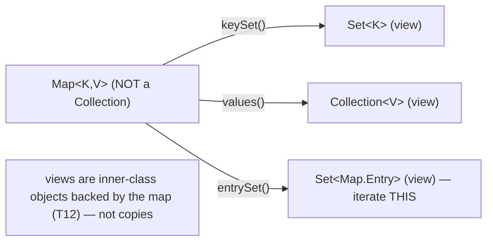

## The Map API — Including the Java 8 Functional Methods

Beyond `put`/`get`/`remove`/`containsKey`, Java 8 added functional methods that **transformed** map code, replacing verbose get-check-put boilerplate:

```java
map.getOrDefault(key, 0);                          // get, or a default if absent
map.putIfAbsent(key, value);                       // put only if absent
map.computeIfAbsent(key, k -> new ArrayList<>());  // compute-and-store if absent
map.compute(key, (k, v) -> v == null ? 1 : v + 1); // recompute from current
map.merge(key, 1, Integer::sum);                   // combine existing + new
map.forEach((k, v) -> ...);                        // iterate
map.replaceAll((k, v) -> v.toUpperCase());          // map all values
```

Two idioms are worth memorizing — they're everywhere in modern Java:

```java
// The MULTIMAP idiom — group values under a key
Map<String, List<String>> byFirstLetter = new HashMap<>();
for (String word : words)
    byFirstLetter.computeIfAbsent(word.substring(0,1), k -> new ArrayList<>()).add(word);

// The COUNTING idiom — tally occurrences
Map<String, Integer> counts = new HashMap<>();
for (String word : words)
    counts.merge(word, 1, Integer::sum);
```

`computeIfAbsent(k, f)` returns the existing value, or computes one with `f`, stores it, and returns it — perfect for "get-or-create." `merge(k, v, f)` sets `v` if absent, else combines the existing value with `v` via `f` — perfect for accumulation. Before Java 8 these were 4–5 lines of get-null-check-put each; now they're one.

## HashMap — The Hash Table

`HashMap` is the **default `Map`**: O(1) average `put`/`get`/`remove`, no iteration order, allows one null key. It's a **hash table with separate chaining** — an array of buckets, each bucket a chain (or tree) of entries that hashed there.

### HashMap Memory Layout

The instance fields and the `Node`:

```java
public class HashMap<K,V> {
    transient Node<K,V>[] table;   // the bucket array — power-of-2 length, lazily allocated
    transient int size;            // number of key-value mappings
    int threshold;                 // resize trigger = capacity × loadFactor
    final float loadFactor;        // default 0.75
    transient int modCount;        // fail-fast counter (T01)

    static final int DEFAULT_INITIAL_CAPACITY = 16;
    static final float DEFAULT_LOAD_FACTOR = 0.75f;
    static final int TREEIFY_THRESHOLD = 8;
    static final int UNTREEIFY_THRESHOLD = 6;
    static final int MIN_TREEIFY_CAPACITY = 64;

    static class Node<K,V> {
        final int hash;   // the SPREAD hash, cached at insertion
        final K key;
        V value;
        Node<K,V> next;   // next node in this bucket's chain
    }
}
```

A `Node` is **32 bytes** ([T10](../C01-oop/T10-equals-hashcode-tostring-contracts.md)):

```
Node (compressed oops):
  +0   header  12 bytes
  +12  hash     4 bytes (the cached spread hash)
  +16  key      4 bytes (ref)
  +20  value    4 bytes (ref)
  +24  next     4 bytes (ref)
  +28  padding  4 bytes
  total: 32 bytes per entry
```

So a `HashMap` of N entries holds N × 32 bytes of `Node`s, plus the `table` array (`Object[]` of bucket heads, sized to ~1.33× N at load factor 0.75 — so ~4 bytes × 1.33N ≈ 5.3N bytes of table). A million-entry map is ~32 MB of `Node`s + ~8 MB of table ≈ 40 MB — before the keys and values themselves.

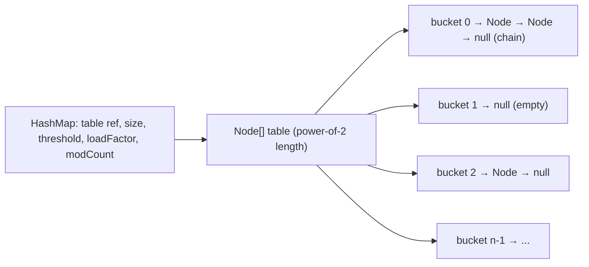

### The Hash Spreading and Bucket Index

To place a key, `HashMap` first **spreads** the key's `hashCode`, then **masks** to a bucket:

```java
static final int hash(Object key) {
    int h;
    return (key == null) ? 0 : (h = key.hashCode()) ^ (h >>> 16);   // spread: mix high bits into low
}
// bucket index:
int index = (table.length - 1) & hash;                              // mask: power-of-2 → AND, not modulo
```

**Spreading** (`h ^ h>>>16`) mixes the high 16 bits into the low 16 — because the bucket index uses only the *low* bits, and many `hashCode`s vary mostly in the high bits. One shift + one XOR (~2 cycles) salvages a mediocre `hashCode` into a decent bucket distribution ([T10](../C01-oop/T10-equals-hashcode-tostring-contracts.md)). **Masking** with `(length-1)` works because the table length is **always a power of two**, so `length-1` is a low-bit mask and the `&` extracts the low bits — a 1-cycle AND versus a 20–40-cycle modulo. A null key spreads to 0 and lives in bucket 0 (`HashMap` allows one null key; `Hashtable` doesn't).

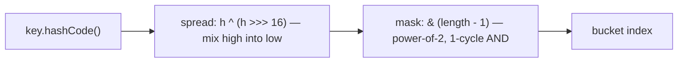

### put and get — The Algorithms

**`put(k, v)`**:
1. Spread the hash; if the table is null, lazily allocate it (capacity 16).
2. Compute the bucket. If empty, place a new `Node` there.
3. Else walk the bucket: if a node has the same hash *and* (`key == k` or `key.equals(k)`), **replace** its value (return the old). Else append a new `Node` at the chain's end.
4. If the chain reached **8** nodes and the table is ≥ **64** slots, **treeify** the bucket (next section). (If the table is < 64, resize instead — a long chain in a tiny table is better cured by more buckets.)
5. If `++size > threshold`, **resize**.

**`get(k)`**:
1. Spread the hash; compute the bucket; load `table[index]` (null → return null).
2. Check the first node (the common case — a well-distributed map has ≤1 node per bucket): hash match and `key == k || key.equals(k)` → return its value.
3. Else, if the bucket is a tree, do an O(log n) tree lookup; else walk the chain comparing with `equals`.

The `key == k || key.equals(k)` order is an optimization: the identity check (`==`) is one instruction and handles the interned/cached-key fast path before the (possibly expensive) `equals` ([T10](../C01-oop/T10-equals-hashcode-tostring-contracts.md)).

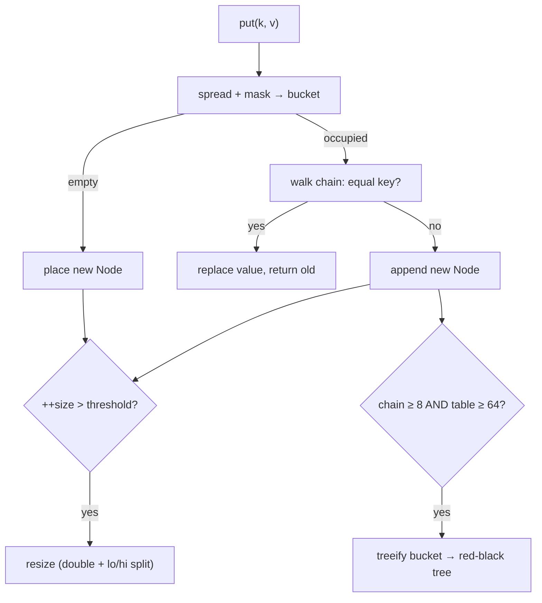

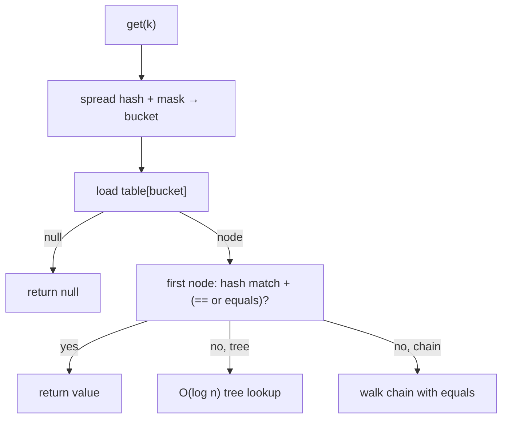

### Collision Chains and Treeification

When multiple keys hash to the same bucket (after spreading and masking), they form a **collision chain** — a linked list of `Node`s. A good `hashCode` keeps chains length 0–1 and lookup O(1). A bad one (or an adversary — [§ Hash Flooding](#architecture--hash-flooding)) grows chains toward O(n).

Java 8 added a defense: when a single bucket's chain reaches **`TREEIFY_THRESHOLD = 8`** *and* the table has at least **`MIN_TREEIFY_CAPACITY = 64`** slots, that bucket **treeifies** — its linked list becomes a **red-black tree** of `TreeNode`s, making worst-case lookup **O(log n)** instead of O(n). A `TreeNode` is much larger than a plain `Node` ([T10](../C01-oop/T10-equals-hashcode-tostring-contracts.md)):

```
TreeNode = Node (16: hash+key+value+next)
         + LinkedHashMap.Entry adds before+after (8)
         + TreeNode adds parent+left+right+prev+red (17)
         + header (12) + padding
         ≈ 56 bytes per node
```

So treeification **nearly doubles** per-node memory (32 → 56 bytes) but bounds the worst case at O(log n). It de-treeifies back to a list at **`UNTREEIFY_THRESHOLD = 6`** during resize/remove — the gap (treeify at 8, untreeify at 6) is **hysteresis** to avoid thrashing around the threshold. Treeification orders the red-black tree by the keys' natural ordering if they're `Comparable`, else by identity hash + class name (works, but weaker balance — [T10](../C01-oop/T10-equals-hashcode-tostring-contracts.md)).

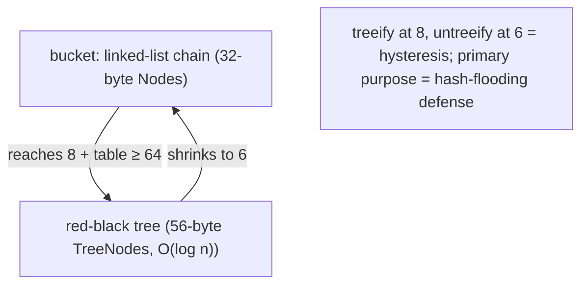

### Resize — Doubling and the Lo/Hi Split

When `size` exceeds `threshold` (`capacity × loadFactor`, default `capacity × 0.75`), the table **doubles** (new capacity = old × 2, still a power of two) and `threshold` doubles too. Each existing entry must move to the larger table — but Java 8 does this *without recomputing any hash*, via a clever **lo/hi split**.

Because the capacity doubled, the bucket index uses one more bit of the (unchanged) hash. So an entry's new index is **either the same as the old index, or old index + old capacity**, depending on a single bit: `(hash & oldCapacity) == 0`. `HashMap` walks each old bucket's chain and splits it into a **"lo" list** (bit clear → stays at the same index) and a **"hi" list** (bit set → moves to index + oldCapacity), preserving relative order:

```
old capacity 16, bucket 5 has keys with hashes ...0_0101 and ...1_0101
new capacity 32: the bit-4 (value 16) of the hash now matters
  hash ...0_0101 → (hash & 16) == 0 → LO → stays at bucket 5
  hash ...1_0101 → (hash & 16) != 0 → HI → moves to bucket 5 + 16 = 21
```

This avoids rehashing (no `hashCode` recomputation) and, by preserving order, fixed a pre-Java-8 bug where resize could *reverse* a chain and, under concurrent (mis)use, create a cycle and an infinite loop. Resize is O(n) (it touches every entry) but **amortized O(1)** per insertion (like `ArrayList` growth — [T02](./T02-list-arraylist-linkedlist.md)). For a huge map a single resize is a real pause; **pre-size** with `new HashMap<>(expectedSize)` (or, precisely, `expectedSize / 0.75 + 1` capacity) to avoid resizes entirely.

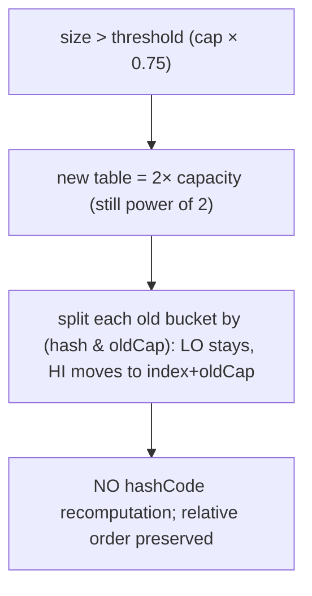

### The Load Factor Trade-off

The **load factor** (default 0.75) is the fullness threshold that triggers resize — the trade-off between memory and collision rate:

- **Lower** (e.g., 0.5): resizes earlier, so the table is sparser → fewer collisions, faster lookups, but **more memory** (more empty buckets).
- **Higher** (e.g., 0.9): resizes later, denser table → **less memory** but more collisions, slower lookups.

0.75 is the empirically-chosen sweet spot (a Poisson analysis in the `HashMap` Javadoc shows that at 0.75, the probability of a bucket having ≥8 entries — the treeify threshold — is ~6 in ten million for random hashes). Rarely change it; pre-sizing matters far more than tuning the load factor.

## LinkedHashMap — Order and the LRU Cache

`LinkedHashMap` extends `HashMap` and threads all entries into a **doubly-linked list** (each entry adds `before`/`after` references — +8 bytes/entry), giving **predictable iteration order**. It has two modes:

- **Insertion order** (default): iteration follows the order keys were first inserted.
- **Access order** (`accessOrder = true` in the constructor): every `get`/`put` **moves** the entry to the end of the list — so iteration goes least-recently-used → most-recently-used.

Access order is the basis of one of the most elegant features in the JDK: an **LRU (least-recently-used) cache** in five lines, by overriding `removeEldestEntry` to evict the oldest when the map exceeds a capacity:

```java
class LRUCache<K, V> extends LinkedHashMap<K, V> {
    private final int capacity;
    LRUCache(int capacity) {
        super(16, 0.75f, true);          // accessOrder = true
        this.capacity = capacity;
    }
    @Override
    protected boolean removeEldestEntry(Map.Entry<K, V> eldest) {
        return size() > capacity;         // evict the least-recently-used when over capacity
    }
}

LRUCache<String, Data> cache = new LRUCache<>(100);   // keeps the 100 most-recently-used entries
```

Every access moves an entry to the most-recently-used end; when a `put` pushes the size over `capacity`, `removeEldestEntry` returns true and the least-recently-used entry (the front of the list) is evicted. The classic "implement an LRU cache" interview question has this five-line answer. (`LinkedHashMap` is also why `Set` insertion order works — `LinkedHashSet` is a `LinkedHashMap` — [T03](./T03-set-hashset-linkedhashset-treeset.md).)

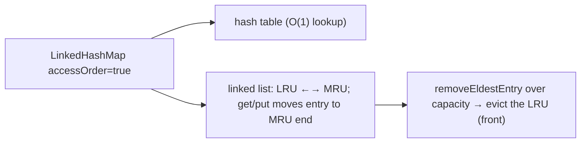

## TreeMap — Sorted and Navigable

`TreeMap` keeps entries **sorted by key** in a **red-black tree**, implementing `NavigableMap`. Order comes from the keys' natural ordering (`Comparable`) or a supplied `Comparator`. All operations are **O(log n)** (a tree descent), and it offers the navigation suite:

```java
TreeMap<Integer, String> tm = new TreeMap<>();
tm.put(5, "e"); tm.put(1, "a"); tm.put(3, "c");
tm.firstKey();        // 1   — sorted iteration order
tm.lastKey();         // 5
tm.floorKey(4);       // 3   — greatest key ≤ 4
tm.ceilingKey(4);     // 5   — least key ≥ 4
tm.lowerKey(3);       // 1   — strictly < 3
tm.higherKey(3);      // 5   — strictly > 3
tm.firstEntry();      // 1=a
tm.headMap(3);        // {1=a}      — keys < 3
tm.tailMap(3);        // {3=c,5=e}  — keys ≥ 3
tm.subMap(1, 5);      // {1=a,3=c}  — range [1, 5)
tm.descendingMap();   // reverse-order view
```

`TreeMap`'s navigation (`floorKey`/`ceilingKey`/`subMap`/…) answers "nearest key" and "key range" queries in O(log n) — which a `HashMap` can't do at all. Use `TreeMap` when you need **sorted iteration or range/nearest-key queries**; use `HashMap` for raw lookup. (As with `TreeSet`, `TreeMap` uses `compareTo`/`compare` for key equality, not `equals` — a `compareTo` of 0 means "same key.")

## EnumMap, Hashtable, and Immutable Maps

Three more to know:

- **`EnumMap<K extends Enum, V>`** — for enum keys, an **array indexed by ordinal** (no hashing, no `Node`s — [T13](../C01-oop/T13-enum-types-with-fields-methods.md)). `vals[key.ordinal()]` is a direct array access (~4 cycles), far smaller and faster than `HashMap<MyEnum, V>`. **Always use it for enum keys.**
- **`Hashtable`** — the legacy synchronized map ([T01](./T01-collections-framework-overview.md)): every method `synchronized` (slow), no null keys/values. Use `HashMap` (single-threaded) or **`ConcurrentHashMap`** (concurrent — far better than `Hashtable`'s coarse locking; full coverage in L3/C01).
- **`Map.of(...)` / `Map.copyOf(...)`** — immutable maps ([T19](../C01-oop/T19-immutability-and-immutable-class-design.md)). `Map.of(k1, v1, ..., k10, v10)` up to 10 pairs, `Map.ofEntries(...)` for more. Compact, unmodifiable, safe to share.

## The Decision — Which Map

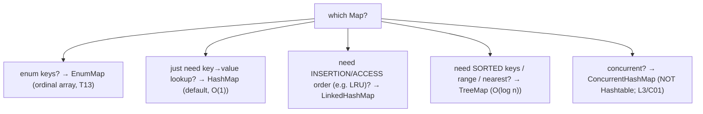

- **`HashMap`** — the default; fastest lookup (O(1)), no order.
- **`LinkedHashMap`** — predictable order (insertion or access); the LRU cache.
- **`TreeMap`** — sorted keys, range/nearest queries (O(log n)).
- **`EnumMap`** — always, for enum keys.
- **`ConcurrentHashMap`** — concurrent access (not `Hashtable`).
- **`Map.of`/`copyOf`** — immutable, shareable.

## Architecture — `get`: The Cache Story

The famous "O(1)" of `HashMap.get` hides a memory-latency reality ([T10](../C01-oop/T10-equals-hashcode-tostring-contracts.md)). A lookup on a **large, cold** map:

```
1. key.hashCode()        — cheap (often cached, e.g. String — T10)
2. spread: h ^ h>>>16    — ~2 cycles
3. mask: & (length-1)    — ~1 cycle
4. load table[index]     — near-RANDOM array access → likely CACHE MISS (~150 cyc cold)
5. load the Node object  — separate heap object → another likely MISS
6. compare key (equals)  — load the key object → another likely MISS
```

So a `get` on a large cold map is dominated by **~3 cache misses ≈ 150–300 cycles ≈ 50–90 ns**, versus ~20 cycles (≈6 ns) when the table, node, and key are all L1-hot. **The "O(1)" is real in operation count but memory-latency-bound in wall-clock at scale** — hashing scatters keys uniformly (that's the point), which is inherently prefetcher-hostile, and each `Node` and key is a separate scattered heap object ([T02](./T02-list-arraylist-linkedlist.md)/[T03](./T03-set-hashset-linkedhashset-treeset.md)). This is why a `HashMap.get` that looks free in Big-O can be 10–15× slower on a map that doesn't fit in cache. (`TreeMap.get` is worse: O(log n) tree descent, each node a likely miss — ~20 misses for a million entries.)

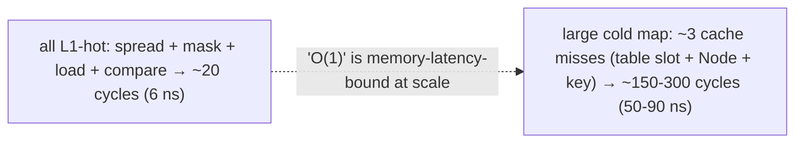

## Architecture — Hash Flooding

The collision-walk cost is also a **denial-of-service vector** ([T10](../C01-oop/T10-equals-hashcode-tostring-contracts.md)). If an attacker controls the *keys* — and they often do, because web frameworks parse HTTP parameters, JSON keys, and headers into `HashMap`s — they can craft thousands of distinct keys that all hash to the **same bucket**. Inserting `n` such keys is **O(n²)** (each insert walks the growing chain), and a few tens of thousands of crafted keys can pin a CPU core for seconds. This was a real, cross-language vulnerability disclosed in 2011 (28C3, CVE-2011-4858) affecting Java, PHP, Python, Ruby, and ASP.NET — a ~1 MB POST with colliding parameter names could hang a server for minutes.

Java's **treeification (Java 8)** is the primary mitigation: a bucket that would have grown to a length-n chain becomes a red-black tree, capping the attack at **O(n log n)** instead of O(n²) — slowed, but no longer catastrophic. This is *why* treeification was added — it's a security feature as much as a performance one ([T10](../C01-oop/T10-equals-hashcode-tostring-contracts.md)). The lesson reaches back to the contract: for keys from untrusted input, a well-distributed `hashCode` isn't just faster, it's a security control.

## Cross-Language Perspective — Chaining vs SwissTable

The hash-map / sorted-map split is universal, but the *hash-map implementation strategy* is where Java now looks dated:

| Language | Hash map | Strategy | Sorted map |
|----------|----------|----------|------------|
| **Java** | `HashMap` | **separate chaining** + treeification | `TreeMap` (red-black) |
| **C++** | `std::unordered_map` | separate chaining | `std::map` (red-black) |
| **Python** | `dict` | **open addressing** + compact/insertion-ordered (3.7+) | (none built-in) |
| **Rust** | `HashMap` | **SwissTable** (open addressing + SIMD) | `BTreeMap` (B-tree) |
| **Go** | `map` | open addressing (bucketed) | (none built-in) |
| **C#** | `Dictionary` | open addressing (entries + buckets) | `SortedDictionary` |

Two contrasts define the modern landscape:

**Java's chaining is the classic 1990s design; the modern world moved to open addressing.** Java's `HashMap` uses **separate chaining** — buckets point to linked `Node`s, each a *separate scattered heap allocation* ([§ Layout](#hashmap-memory-layout)) — so a lookup pointer-chases to cache-hostile objects. The modern design, exemplified by **Google's SwissTable** (used by Rust's `hashbrown`, Abseil, and Go's map), uses **open addressing in one contiguous array**: entries live directly in slots (no per-entry `Node` allocation), collisions probe *nearby* slots (cache-friendly), and a SIMD instruction compares **16 control bytes at once** (SSE2) to find a match or empty slot in a group. The result is dramatically better cache behavior and speed for most workloads — the same "contiguity beats pointer-chasing" lesson as `ArrayList` over `LinkedList` ([T02](./T02-list-arraylist-linkedlist.md)) and Rust's B-tree over the red-black tree ([T03](./T03-set-hashset-linkedhashset-treeset.md)). Java's `HashMap` predates the cache-optimal era; a from-scratch modern hash map uses SwissTable. (Java may adopt such a design eventually; for now, chaining + treeification is what the JDK ships.)

**Python's dict is insertion-ordered — by accident, then by guarantee.** Since Python 3.6 (and guaranteed in 3.7), `dict` preserves **insertion order** — `for k in d` yields keys in the order inserted. This came from the 2016 "compact dict" redesign (Raymond Hettinger): the hash table became a *sparse index array* of small integers pointing into a *dense, insertion-ordered entries array*, which saved memory *and*, as a side effect, made iteration ordered. It was so useful it became a language guarantee. So Python's *default* `dict` is what Java's `LinkedHashMap` is — an insertion-ordered hash map — whereas Java's `HashMap` has *no* order and you must reach for `LinkedHashMap`. A notable difference when porting code: never assume Java `HashMap` iteration order; in Python you can.

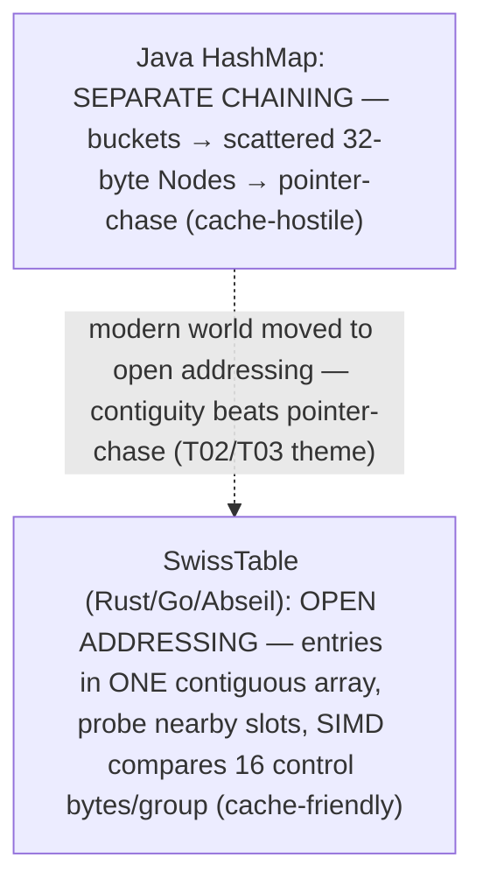

## Common Mistakes

> [!WARNING]
> **A mutable key whose `hashCode` changes after `put`.** The entry lands in one bucket, then a field change moves its hash — `get` looks in the new bucket and can't find it (lost, though still in memory). Use **immutable keys** ([T19](../C01-oop/T19-immutability-and-immutable-class-design.md)/[T10](../C01-oop/T10-equals-hashcode-tostring-contracts.md)).

> [!WARNING]
> **Relying on `HashMap` iteration order.** It has none — and the order can change across runs and resizes. Use `LinkedHashMap` (insertion/access order) or `TreeMap` (sorted). (Unlike Python's `dict`, Java's `HashMap` is unordered.)

> [!WARNING]
> **Keys without correct `equals`/`hashCode`.** Two "equal" keys with different `hashCode`s become two separate entries ([T10](../C01-oop/T10-equals-hashcode-tostring-contracts.md)). Override both, or use a record/`String`/immutable type as the key.

> [!WARNING]
> **Not pre-sizing a large `HashMap`.** Building a million-entry map from the default capacity triggers ~16 resizes (each rehashing the whole table). `new HashMap<>(expectedSize)` eliminates them.

> [!WARNING]
> **`HashMap<MyEnum, V>` instead of `EnumMap`.** `EnumMap` is an ordinal-indexed array — far smaller and faster for enum keys ([T13](../C01-oop/T13-enum-types-with-fields-methods.md)). Always use it.

> [!WARNING]
> **`Hashtable` in new code.** Legacy, coarse-grained synchronized, no nulls. Use `HashMap` (single-threaded) or `ConcurrentHashMap` (concurrent).

> [!WARNING]
> **Modifying a map inside its own `computeIfAbsent`.** Recursively `put`ting into the same map from the mapping function can throw `ConcurrentModificationException` or corrupt the table. Don't structurally modify the map from within `compute*`.

> [!INTERVIEW]
> Common interview questions for this topic:
> 1. **How does `HashMap` work internally?** A `Node[]` table of buckets; a key's bucket is `(length-1) & spread(hashCode)`; collisions chain as `Node`s; a bucket treeifies to a red-black tree at 8 nodes (table ≥ 64); the table doubles at `size > capacity × 0.75`.
> 2. **What's the hash-spreading function and why?** `h ^ (h >>> 16)` — mixes high bits into the low bits the bucket mask uses, since `(length-1) & hash` only reads the low bits.
> 3. **Why is the table a power of two?** So the bucket index is `(length-1) & hash` — a 1-cycle AND instead of a 20–40-cycle modulo.
> 4. **What's treeification?** At a bucket chain length of 8 (table ≥ 64), the linked list becomes a red-black tree — O(log n) worst case instead of O(n). `TreeNode` ~56 bytes vs `Node` 32. Untreeify at 6 (hysteresis). It's the hash-flooding defense.
> 5. **How does resize work?** Double the table; split each chain into "lo" (stays) and "hi" (moves to index + oldCap) by one hash bit (`hash & oldCap`) — no rehashing, order preserved.
> 6. **What's the load factor?** The fullness ratio (default 0.75) that triggers resize — the memory-vs-collision trade-off. Lower = sparser/faster/more memory; higher = denser/slower/less memory.
> 7. **How big is a `HashMap` entry?** A 32-byte `Node` (header + hash + key + value + next) + its table slot — ~36 bytes/entry, plus keys/values.
> 8. **Is `HashMap.get` really O(1)?** In operation count, yes; in wall-clock at scale, it's memory-latency-bound — ~3 cache misses (table slot, Node, key) on a large cold map.
> 9. **How do you implement an LRU cache?** `LinkedHashMap` with `accessOrder = true` and `removeEldestEntry` returning `size() > capacity` — five lines.
> 10. **`HashMap` vs `LinkedHashMap` vs `TreeMap`?** HashMap: O(1), no order. LinkedHashMap: O(1) + insertion/access order. TreeMap: O(log n) + sorted keys + range queries.
> 11. **What's hash flooding and the mitigation?** Attacker keys all colliding → O(n²) inserts → DoS; treeification (Java 8) caps it at O(n log n).
> 12. **`HashMap` vs `Hashtable`?** `HashMap`: unsynchronized, allows one null key. `Hashtable`: synchronized (slow), no nulls, legacy. Use `HashMap`/`ConcurrentHashMap`.
> 13. **How does Java's `HashMap` differ from a modern SwissTable?** Java uses separate chaining (scattered `Node` allocations, cache-hostile); SwissTable (Rust/Go) uses open addressing in a contiguous array with SIMD probing — far more cache-friendly.
> 14. **The `computeIfAbsent`/`merge` idioms?** `computeIfAbsent(k, f)` = get-or-create (multimap); `merge(k, v, f)` = accumulate (counting). The Java 8 replacements for get-check-put boilerplate.

## Practice

1. **Bucket by hand.** For a few `String` keys, compute `hashCode`, the spread `h ^ h>>>16`, and the bucket `(16-1) & spread`. Insert them into a 16-capacity `HashMap` and (via reflection on `table`) confirm they land in the predicted buckets.

2. **`Node` layout.** Use JOL (`jol-cli internals java.util.HashMap$Node`) to confirm the 32-byte layout (header + hash + key + value + next + pad). Then `HashMap$TreeNode` for the ~56-byte tree node.

3. **Force treeification.** Write a key class with a constant `hashCode` (all keys collide). Insert 64+ keys into a `HashMap`; use reflection/debugger to confirm a bucket became a `TreeNode` tree. Confirm fewer than 8, or a table < 64, stays a linked list.

4. **Resize observation.** Reflect on `table.length` as you add entries past the threshold (12 at capacity 16, LF 0.75). Confirm the table doubles (16 → 32 → 64). Confirm the lo/hi split by tracking where a specific key lands before and after.

5. **Pre-sizing payoff.** Build a 10-million-entry `HashMap` from default capacity vs `new HashMap<>(expectedSize)`. Time both and count resizes; confirm pre-sizing eliminates the repeated rehashing.

6. **LRU cache.** Implement the five-line `LinkedHashMap` LRU cache. Insert past capacity; confirm the least-recently-used entries are evicted and that `get`ting an entry protects it from eviction (access order).

7. **`computeIfAbsent` multimap.** Group a list of words by first letter using `computeIfAbsent(k, x -> new ArrayList<>()).add(w)`. Compare with the pre-Java-8 get-null-check-put version.

8. **`merge` counting.** Count word frequencies with `merge(word, 1, Integer::sum)`. Compare with `getOrDefault(word, 0) + 1` and the old boilerplate.

9. **`HashMap.get` cache benchmark.** Time `get` on a small (L1-fitting) map vs a huge (cache-missing) map. Confirm the large map's `get` is ~10× slower despite both being "O(1)" — the cache-miss cost ([T10](../C01-oop/T10-equals-hashcode-tostring-contracts.md)).

10. **Hash flooding.** Insert 50,000 constant-`hashCode` keys (all collide) into a `HashMap`; time it. Compare with well-distributed keys. Observe the O(n²) blowup, and that treeification keeps it from being catastrophic.

11. **`TreeMap` navigation.** Build a `TreeMap`; exercise `floorKey`/`ceilingKey`/`lowerKey`/`higherKey`/`firstEntry`/`subMap`/`descendingMap`. Predict and verify each.

12. **`EnumMap` vs `HashMap`.** Build an `EnumMap<Day, X>` and a `HashMap<Day, X>`. Measure memory (JOL/heap dump) and `get` speed; confirm `EnumMap` is smaller and faster (ordinal array, no hashing).

13. **Iteration order.** Insert the same keys into a `HashMap`, `LinkedHashMap`, and `TreeMap`; print each. Confirm HashMap is arbitrary, LinkedHashMap is insertion order, TreeMap is sorted. (Note: Python's `dict` would match `LinkedHashMap`.)

14. **Mutable-key loss.** Use a mutable object as a `HashMap` key, then change a `hashCode`-relevant field. Confirm `get` returns null (the entry is lost). Discuss immutable keys.

15. **End-to-end explain-it-back.** Trace `map.put(k, v)` that triggers treeification: (a) spread `k`'s hash, mask to a bucket; (b) walk the chain — no equal key, so append a new `Node`; (c) the chain now has 8 nodes and the table is ≥ 64 → treeify the bucket into a red-black tree of `TreeNode`s; (d) `++size` may exceed `threshold` → resize (double, lo/hi split); (e) why treeification is both an O(log n) performance fix and the hash-flooding security mitigation; (f) why the whole thing rests on `k`'s `equals`/`hashCode`. Twelve sentences max.

## Recap

You should now be able to:

**Language layer.**

- State the `Map` contract (unique keys, key→value) and iterate via `entrySet`/`keySet`/`values` views.
- Use the Java 8 functional methods — especially the `computeIfAbsent` (multimap) and `merge` (counting) idioms.
- Choose `HashMap` (default), `LinkedHashMap` (order/LRU), `TreeMap` (sorted/range), `EnumMap` (enum keys), `ConcurrentHashMap` (concurrent), `Map.of` (immutable).
- Build an LRU cache from `LinkedHashMap` (access order + `removeEldestEntry`).
- Use `TreeMap`'s navigation (`floorKey`/`ceilingKey`/`subMap`/…).
- Recognize that a `Map`'s correctness rests on key `equals`/`hashCode` (or `compareTo` for `TreeMap`).

**Memory layer.**

- Describe `HashMap`'s layout: a power-of-two `Node[]` table, 32-byte `Node`s, `size`/`threshold`/`loadFactor`/`modCount`.
- Explain the spread (`h ^ h>>>16`) and bucket index (`(length-1) & hash`, power-of-two → AND).
- Explain treeification (chain → red-black tree of ~56-byte `TreeNode`s at 8 nodes + table ≥ 64; untreeify at 6) and resize (double + lo/hi single-bit split, no rehash).
- Explain the load-factor (0.75) memory-vs-collision trade-off and why pre-sizing matters.
- Recognize `EnumMap` (ordinal array) as the dramatic memory exception.

**Architecture layer.**

- Explain why `HashMap.get` is "O(1)" in operation count but cache-miss-bound (~3 misses, ~150–300 cycles) on a large cold map.
- Explain hash flooding (colliding keys → O(n²) DoS) and treeification as the Java 8 security mitigation.
- Contrast Java's separate chaining (scattered `Node`s, cache-hostile) with the modern open-addressing SwissTable (Rust/Go — contiguous, SIMD-probed, cache-friendly), recognizing the same contiguity-beats-pointer-chasing lesson from [T02](./T02-list-arraylist-linkedlist.md)/[T03](./T03-set-hashset-linkedhashset-treeset.md).
- Note that Python's `dict` is insertion-ordered by default (Java's `HashMap` is not — use `LinkedHashMap`).

`Map` is the structural heart of the framework — `HashMap`'s table and `TreeMap`'s tree back every `Set` ([T03](./T03-set-hashset-linkedhashset-treeset.md)) and underpin caches, indexes, and counters everywhere. With `List`, `Set`, and `Map` deeply understood, the next topic covers the remaining shape — `Queue`/`Deque` and the priority heap — completing the tour of the core data structures before the comparative Big-O synthesis in [T08](./T08-collection-performance-characteristics-big-o.md).

## Next

Continue to [Queue, Deque, PriorityQueue, Stack](./T05-queue-deque-priorityqueue-stack.md) — the ends-oriented collections. We'll see `ArrayDeque`'s circular array (the recommended stack *and* queue, beating both `Stack` and `LinkedList`), `PriorityQueue`'s binary heap (retrieve-smallest-first in O(log n), with the array-backed heap layout and sift-up/sift-down mechanics), and why the legacy `Stack` (a synchronized `Vector` subclass — [T04](../C01-oop/T04-inheritance-and-super.md)'s broken-inheritance example) should never be used in new code. After that, [T06](./T06-iterators-and-iterable.md)–[T08](./T08-collection-performance-characteristics-big-o.md) cover iterators, comparators, and the full comparative Big-O table.
