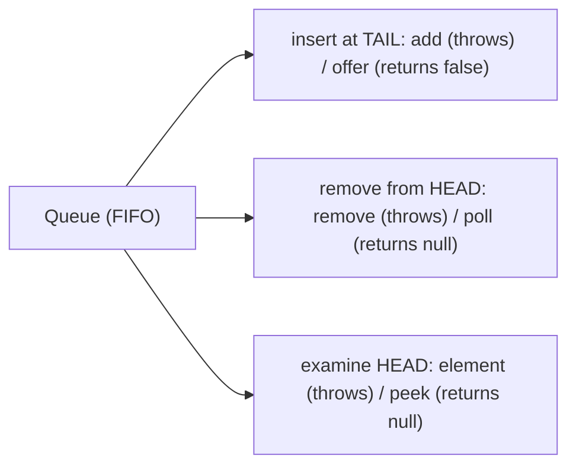
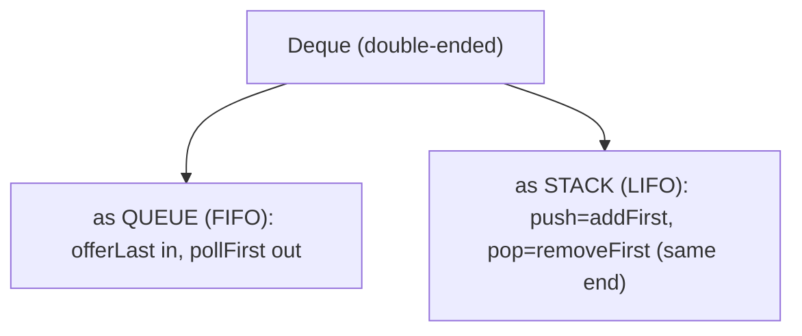
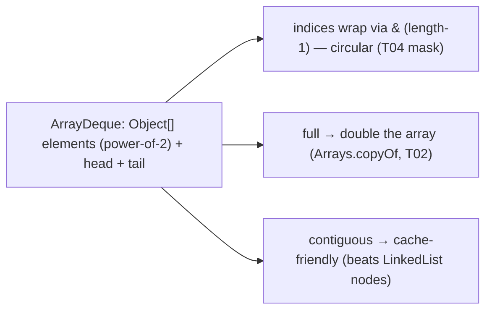
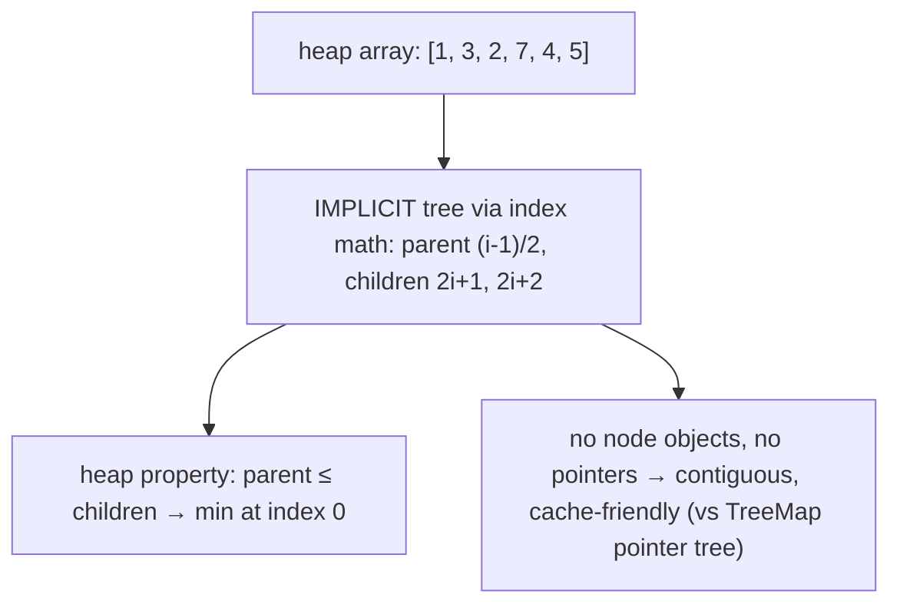
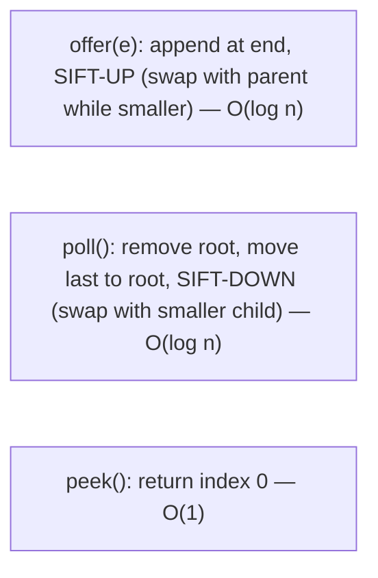
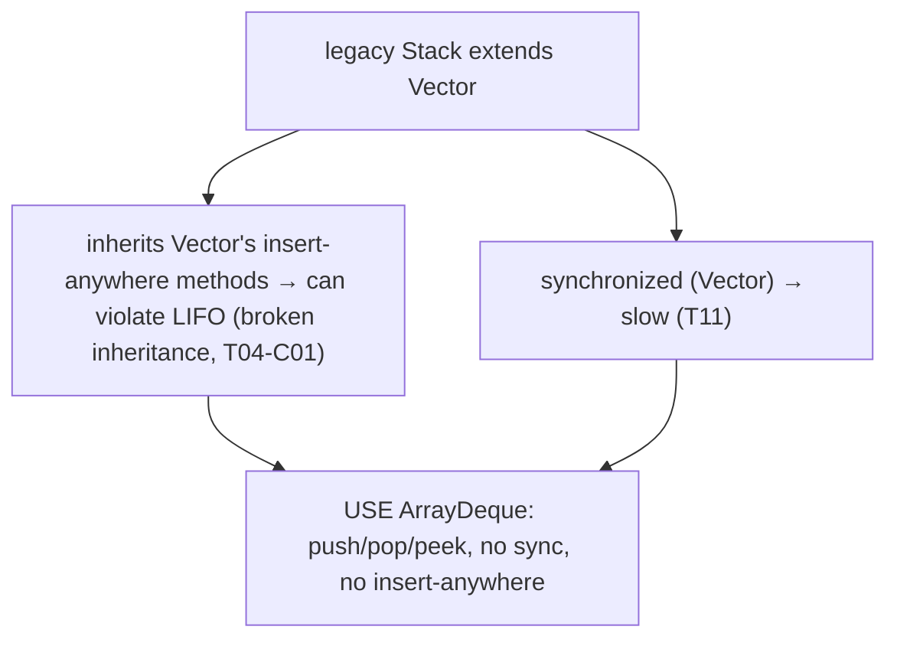
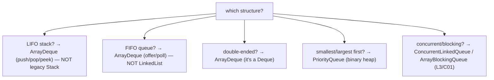
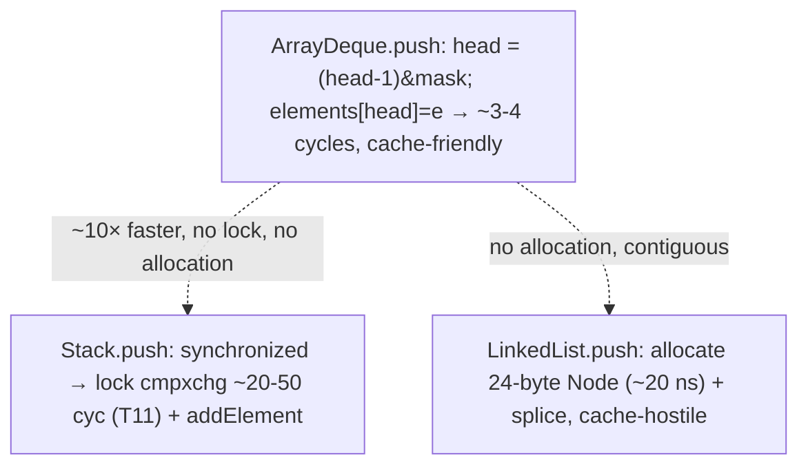
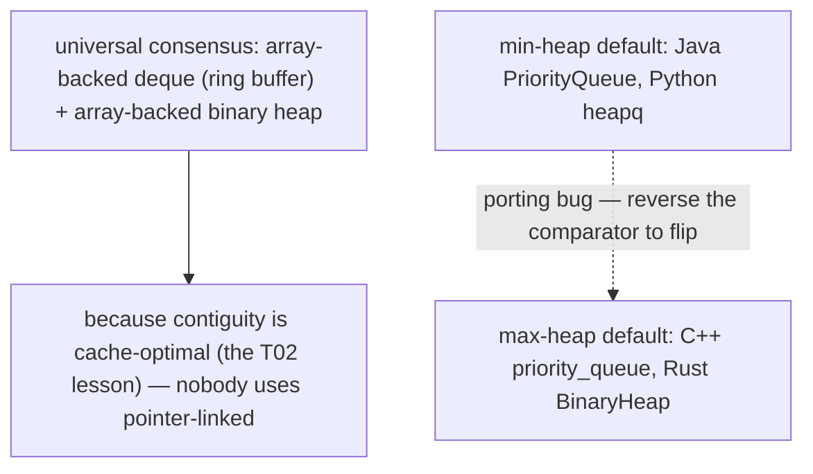

# Queue, Deque, PriorityQueue, Stack

The **ends-oriented** collections complete the core-structure tour ([T02](./T02-list-arraylist-linkedlist.md) List, [T03](./T03-set-hashset-linkedhashset-treeset.md) Set, [T04](./T04-map-hashmap-linkedhashmap-treemap.md) Map). A **`Queue`** holds elements for processing in an order — usually FIFO (first-in-first-out). A **`Deque`** ("deck," double-ended queue) adds/removes at *both* ends, so it serves as a queue *or* a stack. A **`PriorityQueue`** is a heap that always yields the smallest (or largest) element next. And **`Stack`** — Java's legacy LIFO class — is the cautionary counter-example: a broken design you should never use, replaced by `ArrayDeque`. The recommendations are crisp: **`ArrayDeque` is the right implementation for both stacks and queues** (beating both the legacy `Stack` and `LinkedList`), and **`PriorityQueue` is the binary heap** for retrieve-smallest-first.

The depth bar is the **two array-backed structures and why they win**. An `ArrayDeque` is a **circular array** — an `Object[]` with `head` and `tail` indices that wrap around via a power-of-two mask (the same `& (length-1)` trick as `HashMap` bucketing — [T04](./T04-map-hashmap-linkedhashmap-treemap.md)) — so adding/removing at either end is O(1) with *no per-element allocation* and *contiguous, cache-friendly* storage, beating `LinkedList`'s scattered nodes ([T02](./T02-list-arraylist-linkedlist.md)) and `Stack`'s per-method synchronization ([T11](../C01-oop/T11-static-members-blocks-and-nested-classes.md)). A `PriorityQueue` is a **binary heap stored in a flat array** as an *implicit complete binary tree*: the element at index `i` has its parent at `(i-1)/2` and children at `2i+1`/`2i+2` — **no node objects, no pointers; the array indices *are* the tree structure**. That makes a heap's `offer`/`poll` (sift-up/sift-down, O(log n)) a sequence of array accesses, cache-friendly, unlike `TreeMap`'s pointer-linked red-black tree ([T04](./T04-map-hashmap-linkedhashmap-treemap.md)). And the legacy `Stack` is the textbook **broken-inheritance** example ([T04-C01](../C01-oop/T04-inheritance-and-super.md)): it `extends Vector`, so it inherits `Vector`'s insert-anywhere methods, letting you violate the LIFO contract — *a "stack" you can insert into the middle of is not a stack*. By the end you'll use the throwing-vs-returning queue method families correctly, build a stack and a queue from `ArrayDeque`, trace a heap's sift-down at the array level, and know why every modern language stores its deque and heap in a contiguous array.

> [!NOTE]
> Prerequisites: [List](./T02-list-arraylist-linkedlist.md) (`L1/C02/T02`) — array vs node, cache locality, the deep-dive template; [Map](./T04-map-hashmap-linkedhashmap-treemap.md) (`L1/C02/T04`) — power-of-two masking, the array-vs-pointer-tree theme; [Inheritance](../C01-oop/T04-inheritance-and-super.md) (`L1/C01/T04`) — the `Stack extends Vector` broken-inheritance example; [static members](../C01-oop/T11-static-members-blocks-and-nested-classes.md) (`L1/C01/T11`) — the `synchronized` cost of legacy `Stack`/`Vector`; [Collections overview](./T01-collections-framework-overview.md) (`L1/C02/T01`) — the `Queue`/`Deque` interfaces. Forward: [T08](./T08-collection-performance-characteristics-big-o.md) (the comparative Big-O), L3/C01 (concurrent queues).

## The Queue Contract — Two Method Families

A `Queue<E>` holds elements for retrieval in some order (FIFO for most). It has **two method families** for the three core operations — one that **throws** on failure, one that **returns a special value** — and you should know both:

| Operation | Throws exception | Returns special value |
|-----------|------------------|------------------------|
| **Insert** | `add(e)` → `IllegalStateException` if full | `offer(e)` → `false` if full |
| **Remove** | `remove()` → `NoSuchElementException` if empty | `poll()` → `null` if empty |
| **Examine** | `element()` → `NoSuchElementException` if empty | `peek()` → `null` if empty |

For **unbounded** queues (most — `ArrayDeque`, `LinkedList`, `PriorityQueue`), `add` and `offer` are equivalent (they never fail to insert). The distinction matters for **bounded** queues (e.g., `ArrayBlockingQueue` with a fixed capacity, L3/C01): `add` throws when full, `offer` returns `false` — letting you handle backpressure without exceptions. The returning family (`offer`/`poll`/`peek`) is generally preferred because `null`/`false` is cheaper to handle than catching exceptions for the normal empty/full cases.



## The Deque Contract — Double-Ended

A `Deque<E>` (extends `Queue`) operates at **both ends**, with throwing/returning families for each:

| | First (head) | Last (tail) |
|--|--------------|-------------|
| Insert | `addFirst`/`offerFirst` | `addLast`/`offerLast` |
| Remove | `removeFirst`/`pollFirst` | `removeLast`/`pollLast` |
| Examine | `getFirst`/`peekFirst` | `getLast`/`peekLast` |

Because it works at both ends, a `Deque` can serve as **either a queue or a stack**:

- **As a FIFO queue**: `offer`(= `offerLast`, add to tail) + `poll`(= `pollFirst`, remove from head). In at the tail, out at the head.
- **As a LIFO stack**: `push`(= `addFirst`) + `pop`(= `removeFirst`) + `peek`(= `peekFirst`). In and out at the same (head) end.

```java
Deque<Integer> stack = new ArrayDeque<>();
stack.push(1); stack.push(2);   // [2, 1] (head first)
stack.pop();                     // 2 (LIFO)

Deque<Integer> queue = new ArrayDeque<>();
queue.offer(1); queue.offer(2); // tail: [1, 2]
queue.poll();                    // 1 (FIFO)
```

One class, both roles — and `ArrayDeque` implements it efficiently for both.



## ArrayDeque — The Circular Array

`ArrayDeque` is the **recommended implementation for both stacks and queues** — faster than the legacy `Stack` (no synchronization) and faster than `LinkedList` (no per-element node allocation, cache-friendly). It's backed by a **circular array** (a "ring buffer").

```java
Deque<String> dq = new ArrayDeque<>();
dq.addLast("a"); dq.addLast("b");   // tail grows right
dq.addFirst("z");                    // head grows left (wraps around)
dq.pollFirst();                      // "z"
```

### ArrayDeque Memory Layout

`ArrayDeque` holds an `Object[] elements` and two indices, `head` and `tail`:

```java
public class ArrayDeque<E> {
    transient Object[] elements;   // the circular buffer (power-of-2 length)
    transient int head;            // index of the first element
    transient int tail;            // index one past the last element
}
```

Elements occupy a contiguous (possibly wrapped) run between `head` and `tail`. **`addLast`** writes at `tail` and increments it; **`addFirst`** decrements `head` and writes there. Both indices **wrap around** modulo the array length — and because the length is **always a power of two**, the wrap is a single AND: `(index) & (elements.length - 1)` (the same mask trick as `HashMap` bucketing — [T04](./T04-map-hashmap-linkedhashmap-treemap.md), or array-index wrapping). The deque is empty when `head == tail`; when it fills, it **doubles** (allocate a 2× array, copy the elements unwrapped via `System.arraycopy` — [T02](./T02-list-arraylist-linkedlist.md)).

```
elements (length 8, power of 2):   indices 0  1  2  3  4  5  6  7
after addLast a,b,c then addFirst z:        a  b  c  _  _  _  _  z
                                            ↑tail=3          head=7↑
  (z is at index 7; the next addFirst would wrap to index 6; the run wraps 7→0→1→2)
```



The memory advantage over `LinkedList` ([T02](./T02-list-arraylist-linkedlist.md)): `ArrayDeque` stores elements in one contiguous array (~4 bytes/element + slack), versus `LinkedList`'s scattered 24-byte `Node` per element. And the speed advantage: no per-element allocation, and the contiguous array is prefetcher-friendly. **`ArrayDeque` forbids `null`** — because `null` is the "empty" signal returned by `poll`/`peek`, allowing a `null` element would make "the deque returned null" ambiguous.

### ArrayDeque as Stack and Queue

`ArrayDeque` is the modern replacement for *both* legacy patterns:

- **Stack** (instead of `Stack`): `push`/`pop`/`peek` operate at the head — LIFO, no synchronization, no insert-anywhere methods.
- **Queue** (instead of `LinkedList`): `offer`/`poll`/`peek` — FIFO, contiguous and cache-friendly.

*Effective Java* (Item 6 region / collections guidance) explicitly recommends `ArrayDeque` over `Stack` (for stacks) and over `LinkedList` (for queues). It's the single answer for ends-oriented work.

## PriorityQueue — The Binary Heap

A `PriorityQueue` doesn't yield elements in insertion order — it yields them in **priority order**, smallest first (a **min-heap**), by natural ordering (`Comparable`) or a supplied `Comparator`. The head is always the minimum; `offer`/`poll` are O(log n), `peek` is O(1).

```java
PriorityQueue<Integer> pq = new PriorityQueue<>();
pq.offer(5); pq.offer(1); pq.offer(3);
pq.peek();    // 1 — the minimum, always at the head
pq.poll();    // 1, removed; next peek() is 3
pq.poll();    // 3

// max-heap: reverse the comparator
PriorityQueue<Integer> maxHeap = new PriorityQueue<>(Comparator.reverseOrder());
```

Use cases: **top-k** (keep a size-k heap, the smallest k or largest k), **Dijkstra's shortest path** (the priority queue of frontier nodes), **event simulation** (process events in time order), **task scheduling** by priority, **merging k sorted streams**.

### The Binary Heap in an Array — An Implicit Tree

Here is the structural elegance. A `PriorityQueue` is a **binary heap stored in a flat array** as an **implicit complete binary tree** — no node objects, no pointers; the array indices *encode* the tree:

```java
public class PriorityQueue<E> {
    transient Object[] queue;   // the heap: a complete binary tree, level by level
    int size;
    private final Comparator<? super E> comparator;
}
```

The tree relationships are **index arithmetic**:

```
element at index i:
  parent      = (i - 1) / 2
  left child  = 2*i + 1
  right child = 2*i + 2
```

```
heap array:    [1, 3, 2, 7, 4, 5]   (a min-heap)
implicit tree:        1 (index 0)
                    /   \
              3 (idx1)   2 (idx2)
              /  \       /
        7(idx3) 4(idx4) 5(idx5)
  heap property: every parent ≤ its children (so the min is always at index 0)
```

This is the **key contrast with `TreeMap`** ([T04](./T04-map-hashmap-linkedhashmap-treemap.md)): a red-black tree stores each node as a separate heap object with `left`/`right`/`parent` *pointers*, scattered across memory, so a descent pointer-chases (cache-hostile). A binary heap stores the *same tree shape* in a contiguous array with *implicit* parent/child relationships via arithmetic — so navigating it is array indexing, no pointer dereference, and the frequently-touched upper levels stay hot in cache. It's the same "contiguity beats pointer-chasing" lesson as `ArrayList` over `LinkedList` ([T02](./T02-list-arraylist-linkedlist.md)), the array-heap is just a particularly clean example: the structure lives in the *layout*, not in stored pointers.



### sift-up and sift-down

Maintaining the heap property uses two operations, each walking *one path* from a node to the root or a leaf — O(log n):

- **`offer(e)` → sift-up**: place `e` at the end of the array (index `size`), then repeatedly swap it with its parent while it's smaller than the parent. It bubbles up to its correct level. O(log n) swaps.
- **`poll()` → sift-down**: the minimum is at index 0; remove it, move the *last* element to index 0, then repeatedly swap it with its *smaller child* while it's larger than a child. It sinks to its correct level. O(log n) swaps.
- **`peek()`**: return index 0 — O(1).



The heap grows like `ArrayList` (doubling when small, +50% when large — [T02](./T02-list-arraylist-linkedlist.md)). Draining a heap by repeated `poll` yields elements in sorted order at O(n log n) total — that's **heap sort**.

### PriorityQueue Iteration Is *Not* Sorted

A crucial gotcha: **iterating a `PriorityQueue` does not give sorted order.** Only the *head* (index 0) is guaranteed to be the minimum; the rest of the array is *heap-ordered* (every parent ≤ children), which is *not* fully sorted. To get elements in sorted order, **`poll` repeatedly** (each `poll` re-heapifies, so draining is O(n log n)):

```java
PriorityQueue<Integer> pq = new PriorityQueue<>(List.of(5, 1, 3, 2, 4));
pq;                  // iteration order: [1, 2, 3, 5, 4] — heap order, NOT sorted!
while (!pq.isEmpty()) System.out.print(pq.poll() + " ");   // 1 2 3 4 5 — sorted (drain)
```

> [!WARNING]
> `PriorityQueue` iteration (`for-each`, `toArray`, `stream`) is **not** sorted — only `peek`/`poll` respect priority. To process in priority order, `poll` until empty. Treating the iterator as sorted is a common bug.

## The Legacy Stack — Why Not

Java's `Stack` (from Java 1.0) is the framework's **cautionary tale**, and the canonical broken-inheritance example ([T04-C01](../C01-oop/T04-inheritance-and-super.md)):

```java
public class Stack<E> extends Vector<E> {   // ← extends Vector — the mistake
    public E push(E item) { addElement(item); return item; }
    public synchronized E pop()  { ... }
    public synchronized E peek() { ... }
}
```

Two problems:

1. **It `extends Vector`** — so it **inherits all of `Vector`'s methods**, including `add(int index, E)`, `insertElementAt`, `remove(int)`, `get(int)`. That means you can **insert and remove at arbitrary positions** of a "stack" — `stack.add(0, x)` puts an element at the bottom — *violating the LIFO abstraction*. A stack you can insert into the middle of is not a stack. This is the textbook **"inheritance breaks encapsulation"** failure ([T04-C01](../C01-oop/T04-inheritance-and-super.md), *Effective Java* Item 18): `Stack` should have *had a* `Vector` (composition), not *been a* `Vector` (inheritance).
2. **It's synchronized** (inherited from `Vector`) — every operation locks ([T11](../C01-oop/T11-static-members-blocks-and-nested-classes.md)), slow even single-threaded, and insufficient for real concurrency anyway.

There's even an iteration-order quirk: `Stack`'s iterator goes bottom-to-top (oldest first), while `ArrayDeque`-as-a-stack iterates top-to-bottom (newest first) — opposite directions, a trap when migrating.

**Never use `Stack` in new code.** Use **`ArrayDeque`** (`push`/`pop`/`peek`) — no synchronization, no insert-anywhere methods, faster.



## The Decision — Which Ends-Oriented Collection



- **`ArrayDeque`** — stacks, queues, and deques. The default for all three.
- **`PriorityQueue`** — retrieve-smallest-first (or largest with a reversed comparator).
- **`ConcurrentLinkedQueue` / `BlockingQueue`** — concurrent producer-consumer (L3/C01).
- **Never** `Stack` (use `ArrayDeque`); avoid `LinkedList` as a queue (use `ArrayDeque`).

## Architecture — Push/Pop Cost and Heap Cache-Friendliness

The performance contrasts are sharp:

**`ArrayDeque.push` (addFirst)** is a decrement, a mask, and an array store:

```
head = (head - 1) & (length - 1)   ; ~2 cycles (subtract + AND)
elements[head] = e                  ; ~1 cycle (array store, likely L1-hot)
```

~3–4 cycles, cache-friendly (the head region is hot, the array is contiguous). Compare:

- **`Stack.push`** is `synchronized` → a `lock cmpxchg` on the object's mark word (~20–50 cycles uncontended — [T11](../C01-oop/T11-static-members-blocks-and-nested-classes.md)/[T09](../C01-oop/T09-object-class-and-its-methods.md)) *plus* the `Vector.addElement`. ~10× slower than `ArrayDeque` for uncontended pushes.
- **`LinkedList.push`** allocates a `Node` (~20 ns — [T02](./T02-list-arraylist-linkedlist.md)) and splices it. Slower than `ArrayDeque`'s no-allocation array write, and cache-hostile.

So `ArrayDeque` wins on both counts — no lock, no allocation, contiguous memory.



**`PriorityQueue.offer`/`poll`** are O(log n) sift operations, each a path of ~log₂(n) array accesses + comparisons. Because the heap is a contiguous array (not a pointer tree — [§ Implicit Tree](#the-binary-heap-in-an-array--an-implicit-tree)), the upper levels (touched on every sift) stay cache-hot, and the accesses are array-indexed, not pointer-chased. So a heap's O(log n) is *fast* O(log n) — far better cache behavior than a `TreeMap`'s pointer-linked red-black tree of the same height ([T04](./T04-map-hashmap-linkedhashmap-treemap.md)). The binary-heap-in-an-array is one of the cleanest demonstrations that the *layout* (contiguous array + implicit structure) matters as much as the asymptotic complexity.

## Cross-Language Perspective — Array-Backed Deque and Heap Everywhere

The ends-oriented structures are universal, and two patterns are consistent across languages:

| Language | Deque (ring buffer) | Stack | Priority queue / heap | Default heap |
|----------|---------------------|-------|----------------------|--------------|
| **Java** | `ArrayDeque` | `ArrayDeque` (not `Stack`) | `PriorityQueue` | **min**-heap |
| **C++** | `std::deque` | `std::stack` (adapter) | `std::priority_queue` | **max**-heap |
| **Python** | `collections.deque` | `list` (append/pop) | `heapq` (functions on a list) | **min**-heap |
| **Rust** | `VecDeque` | `Vec` (push/pop) | `BinaryHeap` | **max**-heap |
| **C#** | (no direct deque) | `Stack<T>` | `PriorityQueue<TElement,TPriority>` | min-heap |

Two observations:

**Everyone uses a contiguous array for both the deque and the heap.** The deque is a **ring buffer** (a circular array — Java's `ArrayDeque`, Rust's `VecDeque`, C++/Python's deque are segmented but still array-based), and the priority queue is a **binary heap in an array** (Java's `PriorityQueue`, C++'s `priority_queue` over a `vector`, Python's `heapq` over a `list`, Rust's `BinaryHeap` over a `Vec`). Nobody uses a pointer-linked structure for these, because the array layout is cache-optimal — the same lesson as `ArrayList` ([T02](./T02-list-arraylist-linkedlist.md)). C++ and Python even expose the priority queue as an *adapter over an existing array container* (a thin interface over a `vector`/`list`), making the "it's just a heap in an array" reality explicit.

**Java and Python default to a min-heap; C++ and Rust default to a max-heap.** `PriorityQueue` and `heapq` give you the *smallest* first; `std::priority_queue` and `BinaryHeap` give you the *largest* first. This is a frequent porting bug — a C++ programmer expecting `priority_queue`'s max-first behavior in Java gets min-first, and vice versa. The fix is the same everywhere: reverse the comparator (`Comparator.reverseOrder()` in Java) to flip min↔max. Knowing your language's default orientation prevents a class of subtle bugs.



## Common Mistakes

> [!WARNING]
> **Using the legacy `Stack`.** It `extends Vector` (broken inheritance — exposes insert-anywhere methods, violating LIFO) and is synchronized (slow). Use `ArrayDeque` (`push`/`pop`/`peek`) for stacks.

> [!WARNING]
> **Expecting `PriorityQueue` iteration to be sorted.** Only `peek`/`poll` respect priority; iteration is heap order, not sorted. `poll` repeatedly to drain in priority order.

> [!WARNING]
> **Putting `null` in `ArrayDeque` or `PriorityQueue`.** Both forbid `null` (`null` is the empty signal for `poll`/`peek`) — `NullPointerException`. (`LinkedList` allows null, a behavioral difference.)

> [!WARNING]
> **Confusing `add` (throws) with `offer` (returns false) on bounded queues.** For unbounded queues they're equal; for bounded ones (`ArrayBlockingQueue`), `add` throws when full and `offer` returns `false`. Pick the one matching your backpressure handling.

> [!WARNING]
> **`PriorityQueue` of non-`Comparable` elements without a `Comparator`.** `ClassCastException` at the first `offer` that needs a comparison. Supply a `Comparator` or make elements `Comparable`.

> [!WARNING]
> **Min-heap vs max-heap default.** Java's `PriorityQueue` is a min-heap (smallest first). If you want largest-first (or are porting from C++/Rust), use `Comparator.reverseOrder()`.

> [!WARNING]
> **`LinkedList` as a queue.** It works (it's a `Deque`), but `ArrayDeque` is faster (no node allocation, cache-friendly). Use `ArrayDeque`.

> [!INTERVIEW]
> Common interview questions for this topic:
> 1. **Queue's two method families?** Throwing (`add`/`remove`/`element`) vs returning (`offer`/`poll`/`peek`). They differ for bounded/empty queues; equal for unbounded insert.
> 2. **What's a `Deque` and what can it be?** A double-ended queue — add/remove at both ends; serves as a FIFO queue *or* a LIFO stack. `ArrayDeque` is the implementation.
> 3. **What backs `ArrayDeque`?** A circular array (ring buffer) with `head`/`tail` indices wrapping via a power-of-two mask. O(1) amortized at both ends, contiguous, cache-friendly, no null.
> 4. **How is `PriorityQueue` implemented?** A binary min-heap in a flat array — an implicit complete binary tree (parent `(i-1)/2`, children `2i+1`/`2i+2`), no node objects. O(log n) offer/poll (sift-up/down), O(1) peek.
> 5. **Why is a heap in an array cache-friendly?** No pointers — the tree structure is index arithmetic over a contiguous array, so navigation is array indexing (no pointer-chasing), unlike `TreeMap`'s scattered red-black nodes.
> 6. **Is `PriorityQueue` iteration sorted?** No — only the head is the minimum; the rest is heap order. `poll` repeatedly for sorted order (that's heap sort, O(n log n)).
> 7. **Why not use `Stack`?** It `extends Vector` (inherits insert-anywhere methods, violating LIFO — broken inheritance) and is synchronized (slow). Use `ArrayDeque`.
> 8. **What's the recommended stack and queue implementation?** `ArrayDeque` for both — beats `Stack` (no sync, no insert-anywhere) and `LinkedList` (no allocation, cache-friendly).
> 9. **min-heap or max-heap by default?** Java's `PriorityQueue` is a min-heap. For max, use `Comparator.reverseOrder()`. (C++/Rust default to max.)
> 10. **sift-up vs sift-down?** sift-up (offer): bubble the new last element up to its level. sift-down (poll): move the last element to the root and sink it. Both O(log n).
> 11. **Can `ArrayDeque`/`PriorityQueue` hold null?** No — `null` is the empty signal for `poll`/`peek`. (`LinkedList` allows it.)
> 12. **A use for `PriorityQueue`?** Top-k, Dijkstra's algorithm, event simulation, task scheduling, merging sorted streams — anywhere you need smallest/largest-first.

## Practice

1. **`ArrayDeque` as stack and queue.** Use one `ArrayDeque` as a stack (`push`/`pop`) and another as a queue (`offer`/`poll`). Confirm LIFO and FIFO behavior respectively.

2. **Circular wrap.** Add and remove from both ends of an `ArrayDeque` to force the `head`/`tail` indices to wrap around. Use reflection to inspect `head`, `tail`, and `elements`; confirm the elements wrap (e.g., the run spans index 7→0→1).

3. **Two method families.** On a bounded `ArrayBlockingQueue` (capacity 2), fill it, then call `add` (observe `IllegalStateException`) vs `offer` (observe `false`). On an empty queue, call `remove` (exception) vs `poll` (null).

4. **`ArrayDeque` forbids null.** Try `dq.add(null)`; observe `NullPointerException`. Contrast with `LinkedList`, which allows null.

5. **`PriorityQueue` order.** Offer scrambled integers; `peek` (confirm minimum); `poll` repeatedly (confirm ascending). Then iterate with for-each and confirm it is *not* sorted (heap order).

6. **Heap array layout.** Reflect on a `PriorityQueue`'s `queue` array. For each index `i`, verify the heap property: `queue[i] >= queue[(i-1)/2]` (every node ≥ its parent). Confirm the min is at index 0.

7. **sift-up trace.** Offer elements one at a time to a `PriorityQueue`, printing the `queue` array after each. Trace how a small new element bubbles up (swaps with its parent) to its correct level.

8. **sift-down trace.** Poll from a heap, printing the array before and after. Trace how the last element moves to the root and sinks (swaps with its smaller child).

9. **max-heap.** Build a max-heap with `new PriorityQueue<>(Comparator.reverseOrder())`. Confirm `poll` gives descending order. Discuss the min↔max default difference vs C++/Rust.

10. **Top-k.** Use a size-k min-heap to find the k *largest* elements of a stream (keep the heap at size k; if a new element is larger than the head, replace). Confirm O(n log k).

11. **`Stack` is broken.** Create a `Stack<Integer>`; push some values; then call the inherited `add(0, x)` to insert at the bottom. Confirm it compiles and corrupts the LIFO order — the broken-inheritance failure. Refactor to `ArrayDeque`; confirm no such method exists.

12. **`ArrayDeque` vs `Stack` vs `LinkedList` as a stack.** Benchmark a million push/pop on each. Confirm `ArrayDeque` is fastest (no sync, no allocation), `Stack` is slow (synchronized), `LinkedList` is slow (allocation).

13. **`ArrayDeque` vs `LinkedList` as a queue.** Benchmark a million offer/poll on each. Confirm `ArrayDeque` wins (contiguous, no allocation — [T02](./T02-list-arraylist-linkedlist.md) cache lesson).

14. **Heap sort.** Drain a `PriorityQueue` of N elements by repeated `poll` into a list; confirm sorted output and O(n log n) behavior. Note this *is* heap sort.

15. **End-to-end explain-it-back.** Trace `pq.poll()` on a min-heap `[1, 3, 2, 7, 4, 5]`: (a) the minimum (1) is at index 0; (b) move the last element (5) to index 0; (c) sift-down — compare with children `2*0+1=1` (3) and `2*0+2=2` (2); swap 5 with the smaller child (2); (d) continue from the new position until 5 is ≤ its children or a leaf; (e) why this is O(log n) and cache-friendly (array accesses, not pointer-chases); (f) why iterating the result is *not* sorted. Twelve sentences max.

## Recap

You should now be able to:

**Language layer.**

- Use the `Queue` two method families (throwing `add`/`remove`/`element` vs returning `offer`/`poll`/`peek`) and know when the distinction matters (bounded queues).
- Use a `Deque` as both a FIFO queue (`offer`/`poll`) and a LIFO stack (`push`/`pop`/`peek`).
- Choose `ArrayDeque` for stacks and queues (over `Stack` and `LinkedList`).
- Use `PriorityQueue` for retrieve-smallest-first (or largest with a reversed comparator), knowing iteration is *not* sorted.
- Recognize the legacy `Stack` as broken (`extends Vector`, synchronized) and never use it.

**Memory layer.**

- Describe `ArrayDeque`'s circular array (`Object[]` + `head`/`tail`, power-of-two mask wrap, doubling growth) and its contiguous, cache-friendly, no-null nature.
- Describe `PriorityQueue`'s binary heap as an implicit complete binary tree in a flat array (parent `(i-1)/2`, children `2i+1`/`2i+2`), with no node objects or pointers.
- Explain sift-up (offer) and sift-down (poll) as O(log n) single-path operations.

**Architecture layer.**

- Contrast `ArrayDeque.push` (O(1) array index + mask, no lock, no allocation) with `Stack.push` (synchronized, ~20–50 cycles) and `LinkedList.push` (node allocation).
- Explain why a binary heap in an array is cache-friendly (array indexing, contiguous, hot upper levels) versus a `TreeMap`'s pointer-linked red-black tree — the same contiguity lesson as [T02](./T02-list-arraylist-linkedlist.md)/[T04](./T04-map-hashmap-linkedhashmap-treemap.md).
- Recognize the universal "array-backed deque + array heap" consensus across languages, and the Java/Python min-heap vs C++/Rust max-heap default difference.

This completes the **core-data-structure tour** — `List`, `Set`, `Map`, and now `Queue`/`Deque`/heap, each opened to the byte with its memory layout and cache story. The remaining foundational topics generalize *across* the structures: [T06](./T06-iterators-and-iterable.md) (iteration, the uniform traversal protocol), [T07](./T07-comparable-vs-comparator.md) (ordering, which `TreeMap`/`TreeSet`/`PriorityQueue` all depend on), and [T08](./T08-collection-performance-characteristics-big-o.md) (the comparative Big-O synthesis that ties every structure's costs together).

## Next

Continue to [Iterators & Iterable](./T06-iterators-and-iterable.md) — the uniform traversal protocol underlying every collection's `for-each` loop. We've used iteration throughout ([L0/C02/T09](../../L0-foundations/C02-java-core/T09-loops-while-do-while-for-for-each.md), the fail-fast `ConcurrentModificationException` of [T01](./T01-collections-framework-overview.md)); T06 opens the `Iterable`/`Iterator` interfaces, how `for-each` desugars to `iterator()`/`hasNext()`/`next()`, the `modCount` fail-fast mechanism, `Iterator.remove`, `ListIterator`, and `Spliterator` (the parallel-iteration foundation under streams) — the protocol that lets one `for-each` loop work over every structure in this chapter.
