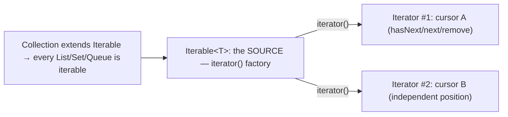
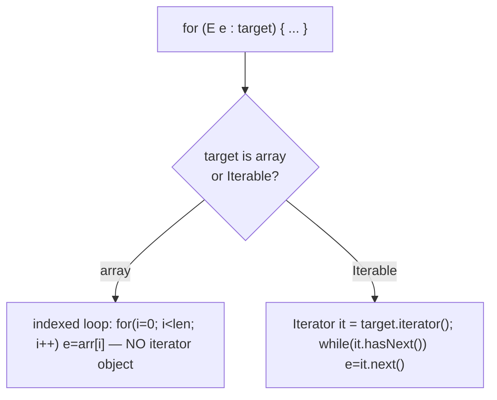
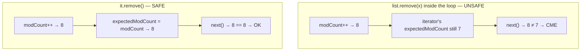
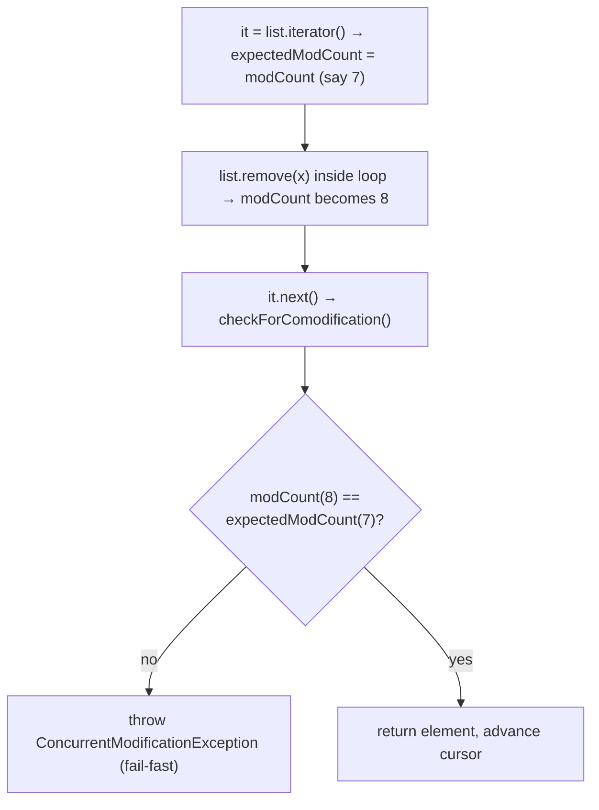
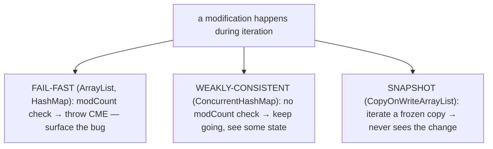
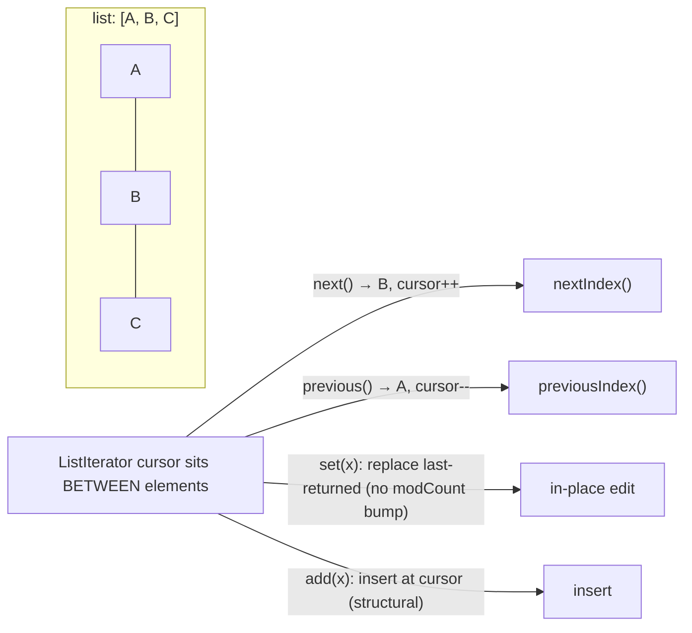
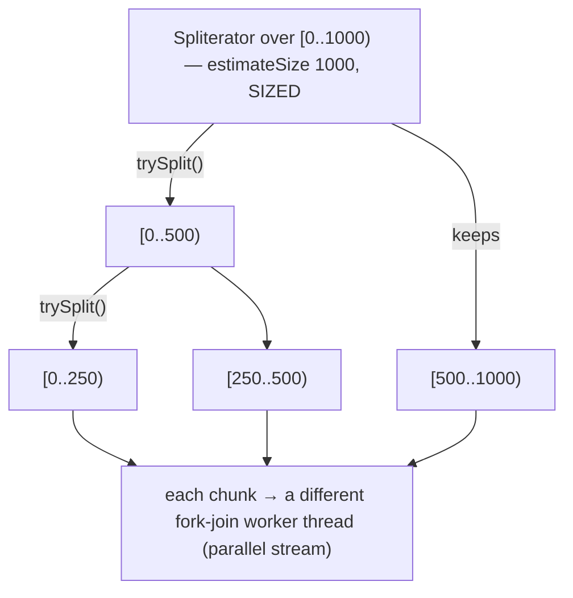
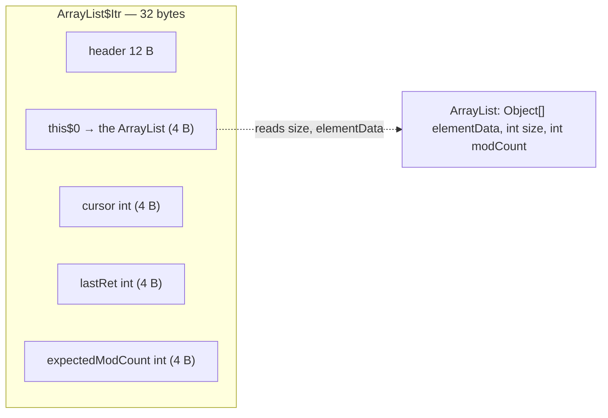
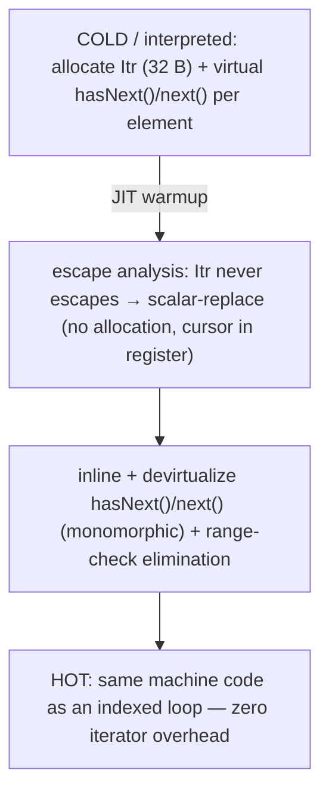
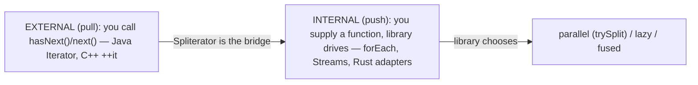

# Iterators & Iterable

The previous topics opened the **structures** ([T02](./T02-list-arraylist-linkedlist.md) List, [T03](./T03-set-hashset-linkedhashset-treeset.md) Set, [T04](./T04-map-hashmap-linkedhashmap-treemap.md) Map, [T05](./T05-queue-deque-priorityqueue-stack.md) Queue/Deque/heap). This one opens the **protocol for walking them**. Every `for (E e : collection)` loop you have written — over an `ArrayList`, a `HashSet`, an `ArrayDeque` — runs the *same* two-interface protocol underneath: **`Iterable`** (a type that can produce an iterator) and **`Iterator`** (a one-element-at-a-time cursor over that type). The `for-each` loop is pure syntactic sugar — the compiler rewrites it into `iterator()`/`hasNext()`/`next()` calls. Understanding that rewrite explains three things at once: why one loop shape works over every collection, why modifying a collection mid-loop throws `ConcurrentModificationException`, and why `for-each` is *not* slower than a hand-written indexed loop once the JIT warms up.

The depth bar here is **what an iterator physically is and how the fail-fast check works**. An iterator is a **separate heap object** holding a cursor — for `ArrayList` it is an `ArrayList$Itr` with three `int` fields (`cursor`, `lastRet`, `expectedModCount`) plus a hidden back-reference to the list (an inner class — [T12](../C01-oop/T12-inner-local-and-anonymous-classes.md)), about 32 bytes. Each `iterator()` call allocates a fresh one, so iterations are independent. The **fail-fast** mechanism is a single `int` field on the collection, **`modCount`**, bumped on every structural change; the iterator snapshots it as `expectedModCount` at creation and re-checks it on every `next()` — a mismatch means "the collection changed under me" and throws `ConcurrentModificationException`. And the reason `for-each` carries no steady-state cost is **escape analysis** ([T01](../C01-oop/T01-classes-and-objects.md)): the iterator never escapes the loop, so the JIT scalar-replaces it (no allocation) and inlines the monomorphic `hasNext()`/`next()` calls, producing the same machine code as an indexed loop. By the end you will desugar a `for-each` by hand, reproduce and correctly fix a `ConcurrentModificationException`, use `ListIterator` for bidirectional edits, split a `Spliterator`, and explain why Rust catches the iterator-invalidation bug at compile time that Java catches at run time.

> [!NOTE]
> Prerequisites: [List](./T02-list-arraylist-linkedlist.md) (`L1/C02/T02`) — the `ArrayList`/`LinkedList` we will iterate; [Inner & anonymous classes](../C01-oop/T12-inner-local-and-anonymous-classes.md) (`L1/C01/T12`) — the iterator is an inner class with a `this$0` back-reference; [Collections overview](./T01-collections-framework-overview.md) (`L1/C02/T01`) — `Iterable` at the root of the hierarchy, the fail-fast preview; [loops](../../L0-foundations/C02-java-core/T09-loops-while-do-while-for-for-each.md) (`L0/C02/T09`) — the `for-each` syntax this topic explains. Forward: [T07](./T07-comparable-vs-comparator.md) (ordering), [T08](./T08-collection-performance-characteristics-big-o.md) (comparative Big-O), L2 (Streams — internal iteration over `Spliterator`).

## The Two Interfaces — `Iterable` and `Iterator`

Two tiny interfaces carry the whole protocol. **`Iterable<T>`** marks a type that can be traversed — its one essential method, `iterator()`, is a *factory* that hands back a fresh cursor:

```java
public interface Iterable<T> {
    Iterator<T> iterator();
    default void forEach(Consumer<? super T> action) { /* for (T t : this) action.accept(t); */ }
    default Spliterator<T> spliterator() { /* splittable cursor — see below */ }
}
```

**`Iterator<T>`** is the cursor itself — it walks the elements one at a time:

```java
public interface Iterator<E> {
    boolean hasNext();                 // is there another element?
    E next();                          // return it and advance; throws NoSuchElementException if none
    default void remove() { throw new UnsupportedOperationException(); }  // remove the last-returned element
    default void forEachRemaining(Consumer<? super E> action) { while (hasNext()) action.accept(next()); }
}
```

`Collection<E> extends Iterable<E>` ([T01](./T01-collections-framework-overview.md)), so **every** collection — `List`, `Set`, `Queue`, `Deque` — is iterable. (A `Map` is *not* `Iterable`, but its three views `keySet()`/`values()`/`entrySet()` are — [T04](./T04-map-hashmap-linkedhashmap-treemap.md).) The split is deliberate: **`Iterable` is the source, `Iterator` is the position**. One source can hand out many independent cursors.



## How `for-each` Desugars — It's Pure Sugar

The enhanced-`for` loop is **compiler syntax** with no bytecode of its own. The compiler rewrites it depending on whether the target is a collection or an array (JLS §14.14.2).

**Over an `Iterable`** (any collection), `for (E e : coll) body;` becomes a `while` loop driven by an iterator:

```java
// you write:
for (String s : list) { use(s); }

// the compiler emits:
for (Iterator<String> it = list.iterator(); it.hasNext(); ) {
    String s = it.next();
    use(s);
}
```

**Over an array**, there is **no iterator at all** — it desugars to a plain indexed loop (arrays are not `Iterable`; the compiler special-cases them):

```java
// you write:
for (String s : array) { use(s); }

// the compiler emits:
for (int i = 0; i < array.length; i++) {
    String s = array[i];
    use(s);
}
```

This is why the same loop shape works over every collection: the compiler always lowers it to the iterator protocol, and each collection supplies its own iterator. It is also why a `for-each` loop gives you **read access only** to the element variable — `s` is a fresh local copy each turn; reassigning it changes nothing in the collection.



## `Iterator.remove()` and `removeIf` — Editing During a Walk

You cannot structurally modify a collection through the *collection's* own methods while a `for-each` is running (that throws — next section). The **only** safe single-element deletion mid-iteration is **`Iterator.remove()`**, which removes the element most recently returned by `next()`:

```java
Iterator<String> it = list.iterator();
while (it.hasNext()) {
    String s = it.next();
    if (s.isBlank()) it.remove();   // safe: the iterator updates its own cursor + expectedModCount
}
```

`remove()` deletes `lastRet` (the index `next()` just returned), fixes the cursor, and **re-syncs `expectedModCount = modCount`** so the iterator stays consistent with the collection. *That re-sync is the whole difference* — `list.remove(x)` bumps `modCount` but leaves the iterator's stale `expectedModCount`, so the next `next()` throws; `it.remove()` bumps `modCount` **and** updates `expectedModCount` in lockstep, so the counters never diverge. Rules: it removes the *last returned* element, so you must call `next()` first (else `IllegalStateException`), and you cannot call it twice in a row.



Since Java 8, the idiomatic one-liner is **`Collection.removeIf(predicate)`** — it does the iterator-remove loop for you (and `ArrayList` overrides it with a single-pass batch compaction that is faster than element-by-element shifting):

```java
list.removeIf(String::isBlank);   // the modern, safe, often-faster replacement
```

## The Fail-Fast Mechanism — `modCount` and `ConcurrentModificationException`

Here is the deep mechanism. Most collections keep an `int` field **`modCount`** (declared `protected transient int modCount` in `AbstractList`, and present on `HashMap`, `ArrayDeque`, etc.). **Every structural modification** — any `add`/`remove` that changes the size — increments it. When you create an iterator, it **snapshots** the current value into its own `expectedModCount`, and on every `next()` (and `remove()`/`forEachRemaining()`) it runs:

```java
final void checkForComodification() {
    if (modCount != expectedModCount)
        throw new ConcurrentModificationException();
}
```

So if *anything* structurally changes the collection between the iterator's creation and a `next()` call — another thread, or your own code calling `list.remove(x)` inside the loop — the counters diverge and `next()` throws **`ConcurrentModificationException`** (CME). This is the "**fail-fast**" contract: surface the bug immediately and loudly rather than silently corrupt or skip elements.



> [!WARNING]
> **CME is best-effort, not a guarantee.** The javadoc is explicit: *"the fail-fast behavior of an iterator cannot be guaranteed... it would be wrong to write a program that depended on this exception for its correctness."* A modification that happens to leave `modCount` unchanged, or a race that lands between checks, may slip through. Use CME as a **bug detector**, never as control flow. Confusingly, CME is also thrown in **single-threaded** code (the common case) — "concurrent" here means "concurrent with the iteration," not "from another thread."

## Fail-Fast vs Weakly-Consistent Iterators

Not every iterator fails fast. The `java.util.concurrent` collections (L3/C01) trade the fail-fast guarantee for the ability to iterate safely while other threads mutate:

| Iterator kind | Collections | Behavior on concurrent modification |
|---|---|---|
| **Fail-fast** | `ArrayList`, `HashMap`, `HashSet`, `ArrayDeque`, `TreeMap` | throws `ConcurrentModificationException` (best-effort) |
| **Weakly-consistent** | `ConcurrentHashMap`, `ConcurrentLinkedQueue`, `CopyOnWriteArrayList` | never throws; reflects *some* state at/after creation, may or may not see concurrent updates |

A `CopyOnWriteArrayList` iterator walks an immutable **snapshot** of the array taken at `iterator()` time — concurrent writes create a new array and never disturb the snapshot, so the iterator is consistent but possibly stale. A `ConcurrentHashMap` iterator is **weakly consistent** — it never throws and is guaranteed to traverse elements present at creation exactly once, and *may* reflect later updates. Both are the right choice for concurrent reads; the fail-fast collections are for single-threaded use where a mid-loop mutation is a bug worth surfacing.



## `ListIterator` — Bidirectional, Positional, Mutating

`List` offers a richer cursor, **`ListIterator<E>`** (from `list.listIterator()`), that a plain `Iterator` lacks. It conceptually sits **between** two elements and can move both ways, report indices, and edit in place:

```java
ListIterator<String> it = list.listIterator();
while (it.hasNext()) {
    String s = it.next();
    if (s.equals("old")) it.set("new");   // replace in place — no structural change, no modCount bump
}
while (it.hasPrevious()) {                // now walk backward
    String s = it.previous();
}
```

Beyond `hasNext`/`next`/`remove`, it adds **`hasPrevious()`/`previous()`** (reverse), **`nextIndex()`/`previousIndex()`** (the cursor position), **`set(e)`** (replace the last-returned element — *not* structural, so no CME), and **`add(e)`** (insert at the cursor). This is the **one place `LinkedList` shines** ([T02](./T02-list-arraylist-linkedlist.md)): `set`/`add`/`remove` at the cursor are O(1) node splices, whereas the same edits by index would be O(n) walks.



## `Spliterator` — The Splittable Cursor Under Streams

Java 8 added **`Spliterator<T>`** ("splittable iterator") to support **parallel** traversal. A plain `Iterator` can only go forward one element at a time — useless for dividing work across cores. A `Spliterator` can **partition itself**:

```java
public interface Spliterator<T> {
    boolean tryAdvance(Consumer<? super T> action);  // process one element, like next()+hasNext()
    Spliterator<T> trySplit();                        // hand off ~half the remaining elements, or null
    long estimateSize();                              // how many elements remain (exact if SIZED)
    int characteristics();                            // ORDERED | SIZED | DISTINCT | SORTED | IMMUTABLE ...
}
```

`trySplit()` returns a new `Spliterator` covering a *prefix* of the remaining elements (and the original keeps the rest), so the fork-join framework can recursively halve the work and hand each half to a different thread. `ArrayList`'s spliterator just splits its index range `[lo, hi)` at the midpoint — O(1), because the backing array is contiguous ([T02](./T02-list-arraylist-linkedlist.md)); a `LinkedList`'s cannot split cheaply (it must walk), which is one more reason `ArrayList` parallelizes better. The **`characteristics()`** bitmask lets the stream pipeline optimize: a `SIZED` + `SUBSIZED` spliterator enables exact array pre-allocation, `DISTINCT` lets `distinct()` no-op, `SORTED` lets `sorted()` no-op. Every `Iterable` gets a default `spliterator()`, and `stream()` / `parallelStream()` are built on top of it (L2).



## Writing Your Own `Iterable`

Because the protocol is just two interfaces, any type can join the `for-each` world by implementing `Iterable`. A half-open integer range:

```java
record Range(int start, int end) implements Iterable<Integer> {
    public Iterator<Integer> iterator() {
        return new Iterator<>() {                 // anonymous inner Iterator — T12
            private int current = start;
            public boolean hasNext() { return current < end; }
            public Integer next() {
                if (!hasNext()) throw new NoSuchElementException();
                return current++;
            }
        };
    }
}

for (int i : new Range(0, 5)) System.out.print(i);   // 01234
```

Note the iterator holds its *own* `current` state, so two concurrent `for-each` loops over the same `Range` get independent cursors — exactly the `Iterable`-is-the-source / `Iterator`-is-the-position split.

## Memory — The Iterator Is a Heap Object

An iterator is **not free**: `iterator()` allocates an object. For `ArrayList` it is the private inner class `ArrayList$Itr`:

```java
private class Itr implements Iterator<E> {
    int cursor;                       // index of next element — 4 bytes
    int lastRet = -1;                 // index last returned, -1 if none — 4 bytes
    int expectedModCount = modCount;  // fail-fast snapshot — 4 bytes
    // + synthetic final ArrayList this$0 — the inner-class back-reference (T12) — 4 bytes (compressed oops)
}
```

So one `ArrayList` iterator is **object header (12 B) + `this$0` ref (4 B) + three ints (12 B) = 28 B, padded to 32 bytes** ([T01](../C01-oop/T01-classes-and-objects.md) alignment). The `this$0` field is what lets `hasNext()` read `ArrayList.this.size` and `next()` read `ArrayList.this.elementData` — the iterator reaches back into the list it came from ([T12](../C01-oop/T12-inner-local-and-anonymous-classes.md)). `hasNext()` is just `cursor != size`; `next()` checks `modCount`, loads `elementData[cursor]`, sets `lastRet = cursor`, increments `cursor`, and returns — a handful of field reads and one array load.



Each `iterator()` call makes a **new** `Itr` (independent cursors → you can nest two loops over one list). Over an **array**, by contrast, the desugaring uses no object at all — just an `int` index in a register. That 32-byte allocation per loop is the entire "cost" of collection iteration in cold code — and the next section shows why it usually disappears.

## Architecture — Why `for-each` Costs Nothing After Warmup

In the **interpreter and cold code**, a collection `for-each` really does allocate an `Itr` and make a virtual `hasNext()`/`next()` call per element — measurable overhead versus an indexed array loop. But in **hot code the JIT erases it**, via two optimizations from [T01](../C01-oop/T01-classes-and-objects.md)/[T05-C01](../C01-oop/T05-method-overriding.md):

- **Escape analysis + scalar replacement.** The `Itr` is created inside the loop, never stored in a field, never returned — it **does not escape**. So the JIT proves it can skip the heap allocation entirely and keep `cursor`/`expectedModCount` in **registers**. Zero allocation, zero GC pressure.
- **Inlining + devirtualization.** At a monomorphic call site (the loop only ever sees `ArrayList$Itr`), `hasNext()` and `next()` inline to their bodies — a register compare and a bounds-checked array load — and the bounds check is often hoisted out of the loop (range-check elimination, [L0/C02/T09](../../L0-foundations/C02-java-core/T09-loops-while-do-while-for-for-each.md)).

The net result: a warmed-up `for (e : arrayList)` compiles to **essentially the same machine code** as `for (i=0; i<size; i++)`. This is the concrete justification for "prefer `for-each`" — it is as readable as a foreach and, after JIT, as fast as an indexed loop, with no steady-state penalty. The **`modCount` check** adds one `int` field load + one register compare + a branch that is *never taken* in correct code → perfectly predicted by the CPU ([L0 branch-prediction theme]) → effectively free.



## Cross-Language Perspective — External vs Internal Iteration

The iterator idea is universal, but the safety guarantees differ sharply:

| Language | Protocol | Invalidation / concurrent-modification handling |
|---|---|---|
| **Java** | `Iterable.iterator()` → `hasNext`/`next` | **fail-fast at run time** via `modCount` → CME |
| **C++** | `begin()`/`end()`, `++it`, `*it` (iterator categories) | **undefined behavior** — a realloc invalidates iterators; no check, just UB |
| **Python** | `__iter__`/`__next__` + `StopIteration`; generators (`yield`) | dict raises `RuntimeError` (fail-fast); list silently misbehaves |
| **C#** | `IEnumerable.GetEnumerator()` → `MoveNext`/`Current` | **fail-fast** via a version field → `InvalidOperationException` (identical to `modCount`) |
| **Rust** | `Iterator::next() -> Option<T>`; `IntoIterator` | **compile error** — borrow checker forbids mutating a borrowed collection |

Two deep contrasts. **C++ iterators are generalized pointers** — fast and flexible (the whole STL `<algorithm>` library operates on iterator pairs), but modifying a `vector` while iterating it (e.g. a `push_back` that triggers a reallocation) **invalidates every iterator** and is undefined behavior: no exception, just a crash or silent corruption. Java's `modCount` fail-fast is precisely the safety net C++ lacks. **Rust goes one better and moves the check to compile time**: iterating a `Vec` takes an immutable borrow, and mutating it needs a mutable borrow, and the borrow checker forbids holding both at once — so the iterator-invalidation/CME bug is a **compile error**, caught statically with zero runtime cost. Java detects the bug when it happens (run time, via `modCount`); Rust proves it can never happen (compile time). Rust's lazy adapter chains (`iter().map().filter()`) are also **zero-cost** — they compile to the same loop as hand-written code, the same escape-analysis end-state Java's JIT reaches dynamically.

The last row of the table points at the bigger shift. Java's `Iterator` is **external iteration** — *you* pull, calling `hasNext`/`next`, controlling the loop. `Iterable.forEach`, Streams, and Rust's adapters are **internal iteration** — you hand the library a function and *it* drives the traversal. Internal iteration is what lets the library choose the strategy: run in parallel (via `Spliterator.trySplit`), run lazily, or fuse multiple operations into one pass. The `Spliterator` is the bridge from this chapter's external iterators to L2's internal-iteration Streams.



## Common Mistakes

> [!WARNING]
> **Structurally modifying a collection inside a `for-each`.** `for (String s : list) { if (cond) list.remove(s); }` bumps `modCount` and the next `next()` throws CME. Fix with `Iterator.remove()` (single removal) or, better, `list.removeIf(s -> cond)`.

> [!WARNING]
> **`next()` without `hasNext()`.** Calling `next()` on an exhausted iterator throws `NoSuchElementException`. Always gate on `hasNext()` (the `for-each` does this for you).

> [!WARNING]
> **Misusing `Iterator.remove()`.** Calling `remove()` before any `next()`, or twice in a row, throws `IllegalStateException` — it removes the *last element returned by `next()`*, and there must be exactly one such pending element.

> [!WARNING]
> **Depending on iteration order.** `HashSet`/`HashMap` iteration order is unspecified and can change across resizes ([T03](./T03-set-hashset-linkedhashset-treeset.md)/[T04](./T04-map-hashmap-linkedhashmap-treemap.md)). Use `LinkedHashSet`/`LinkedHashMap` (insertion order) or `TreeSet`/`TreeMap` (sorted) if order matters.

> [!WARNING]
> **Reusing a spent iterator.** Once `hasNext()` returns `false`, the iterator stays exhausted — there is no `reset()`. Call `iterator()` again for a fresh cursor.

> [!WARNING]
> **Treating CME as a feature.** It is best-effort and may not fire; never write logic that relies on catching it. And it is *not* about threads — it fires in ordinary single-threaded code when you mutate during your own loop.

## Practice

> [!INTERVIEW]
> Common interview questions for this topic:
> 1. **What makes a class usable in a `for-each` loop?** Implementing `Iterable<T>` — its single method `iterator()` returns the cursor the loop drives.
> 2. **How does `for-each` desugar?** Over a collection: `Iterator it = c.iterator(); while (it.hasNext()) { e = it.next(); ... }`. Over an array: a plain indexed loop with no iterator object.
> 3. **What is `ConcurrentModificationException` and what causes it?** A fail-fast signal thrown when a collection is structurally modified during iteration — detected by `modCount != expectedModCount`.
> 4. **How do you remove elements while iterating?** `Iterator.remove()` (single) or `Collection.removeIf(predicate)` (the Java 8 idiom) — never the collection's own `remove` inside a `for-each`.
> 5. **Is CME guaranteed?** No — best-effort, for bug detection only; never depend on it for correctness.
> 6. **What is `modCount` and where does it live?** An `int` on the collection (e.g. `AbstractList`), incremented on every structural change; the iterator snapshots it as `expectedModCount`.
> 7. **`Iterator` vs `ListIterator`?** `ListIterator` (List only) is bidirectional (`previous`/`hasPrevious`), positional (`nextIndex`/`previousIndex`), and can `set`/`add` in place.
> 8. **What is a `Spliterator` and why does it exist?** A splittable iterator (`trySplit`) with a size estimate and characteristics — the foundation of (parallel) Streams.
> 9. **Does `for-each` have overhead vs an indexed loop?** In cold code yes (iterator allocation + virtual calls); after JIT escape-analysis scalar-replaces the iterator and inlines, it is the same machine code.
> 10. **Why does each `iterator()` call return a new object?** Independent cursor state — so nested/re-entrant iteration over one collection works.
> 11. **Fail-fast vs weakly-consistent iterators?** Fail-fast (`ArrayList`/`HashMap`) throw CME; weakly-consistent (`ConcurrentHashMap`, `CopyOnWriteArrayList`) never throw and reflect a snapshot or partial state.
> 12. **External vs internal iteration?** External = caller pulls (`Iterator`); internal = library drives, you supply behavior (`forEach`/Streams) — enables parallel/lazy/fused traversal.
> 13. **How does Rust avoid the CME bug entirely?** Its borrow checker forbids mutating a collection while it is borrowed for iteration — a compile error, so the bug cannot exist at run time.

1. **Implement `Iterable`.** Write a `Range(int start, int end)` that implements `Iterable<Integer>`; loop over it with `for-each` and print the values. Confirm two concurrent loops get independent cursors.

2. **Desugar by hand.** Take a `for (String s : list)` loop and rewrite it as the explicit `Iterator`/`hasNext`/`next` `while` loop the compiler produces. Verify identical output.

3. **Array vs collection desugaring.** Compile a `for-each` over an `int[]` and over a `List<Integer>`; use `javap -c` to confirm the array version has no `iterator()` call (indexed) while the list version invokes `iterator`/`hasNext`/`next`.

4. **Reproduce a CME.** Loop over an `ArrayList` with `for-each` and call `list.remove(x)` inside; observe `ConcurrentModificationException`. Note it is single-threaded.

5. **Fix it two ways.** Fix exercise 4 with (a) an explicit `Iterator` + `it.remove()`, and (b) `list.removeIf(...)`. Confirm both remove the intended elements without CME.

6. **`modCount` via reflection.** Read `ArrayList`'s `modCount` field (reflection) before and after an `add`; confirm it increments. Read an iterator's `expectedModCount` and watch the two diverge when you mutate the list mid-loop.

7. **`IllegalStateException`.** Call `it.remove()` before any `next()`, and again twice in a row after one `next()`; observe the exception both times.

8. **`ListIterator` bidirectional.** Walk a list forward replacing every "old" with "new" via `set()`; then walk backward with `previous()` printing each. Confirm `set()` does *not* trigger CME (it is non-structural).

9. **`ListIterator.add`.** Use `listIterator()` to insert an element after each match while iterating; confirm it works (the `ListIterator` tracks the structural change) where the collection's `add` would CME.

10. **Fail-fast vs weakly-consistent.** Iterate an `ArrayList` while another thread adds to it (expect CME); repeat with `CopyOnWriteArrayList` (no exception, snapshot semantics). Explain the difference.

11. **`Spliterator.trySplit`.** Get `list.spliterator()`, call `trySplit()`, and confirm you now have two spliterators each covering ~half; print `estimateSize()` of each. Check the `characteristics()` bits (`SIZED`, `ORDERED`).

12. **`forEachRemaining`.** Advance an iterator a few steps with `next()`, then call `it.forEachRemaining(System.out::println)`; confirm it consumes only the *remaining* elements.

13. **Infinite iterator.** Write an `Iterator<Integer>` whose `hasNext()` always returns `true` (the natural numbers). Drive it with a `for-each` + `break`, or `Stream.iterate`, to take the first 10. Discuss why `hasNext` need not be finite.

14. **Independent cursors.** Obtain two iterators from one list; advance them by different amounts; confirm each tracks its own position (nested iteration works).

15. **End-to-end explain-it-back.** For `for (String s : list)` over an `ArrayList`: (a) what object `iterator()` allocates and its fields (`cursor`, `lastRet`, `expectedModCount`, `this$0`) and size (~32 B); (b) what `hasNext()` and `next()` each do; (c) how `modCount`/`expectedModCount` produce a CME if you mutate mid-loop; (d) why, after JIT, escape analysis makes this loop allocate nothing and run as fast as an indexed array loop; (e) one reason an array `for-each` skips all of this. Twelve sentences max.

## Recap

You should now be able to:

**Language layer.**

- Explain the `Iterable` (source, `iterator()` factory) / `Iterator` (cursor: `hasNext`/`next`/`remove`) split and why every collection is iterable while a `Map` is not (its views are).
- Desugar a `for-each` into the `iterator()`/`hasNext()`/`next()` loop (collection) or an indexed loop (array).
- Remove safely during iteration with `Iterator.remove()` or `removeIf`, and use `ListIterator` for bidirectional, positional, in-place edits.
- Describe what `Spliterator` adds (`trySplit` + characteristics) and that Streams are built on it.

**Memory layer.**

- Describe an iterator as a separate heap object — `ArrayList$Itr` is ~32 bytes (header + `this$0` back-reference + `cursor`/`lastRet`/`expectedModCount`) — allocated fresh per `iterator()` call, versus an array `for-each` that allocates nothing.
- Explain `modCount` as a single `int` on the collection and `expectedModCount` as the iterator's snapshot of it.

**Architecture layer.**

- Explain why `for-each` has no steady-state cost: escape analysis scalar-replaces the non-escaping iterator (no allocation) and inlining/devirtualization + range-check elimination make it the same machine code as an indexed loop.
- Describe the fail-fast check as a near-free predicted-branch `int` compare, and contrast fail-fast (`ArrayList`/`HashMap`) with weakly-consistent (`ConcurrentHashMap`/`CopyOnWriteArrayList`) iterators.
- Place Java's run-time fail-fast against C++'s undefined-behavior invalidation and Rust's compile-time borrow-checker prevention, and distinguish external (pull) from internal (push) iteration.

With traversal established, the next two topics finish the framework's cross-cutting concerns: [T07](./T07-comparable-vs-comparator.md) (the **ordering** contract that `TreeMap`/`TreeSet`/`PriorityQueue` and `sort` all consume) and [T08](./T08-collection-performance-characteristics-big-o.md) (the comparative **Big-O** synthesis tying every structure's costs together).

## Next

Continue to [Comparable vs Comparator](./T07-comparable-vs-comparator.md) — the ordering protocol. We have repeatedly leaned on "natural order" and "a `Comparator`" without opening them: `TreeSet`/`TreeMap` ([T03](./T03-set-hashset-linkedhashset-treeset.md)/[T04](./T04-map-hashmap-linkedhashmap-treemap.md)) keep elements sorted, `PriorityQueue` ([T05](./T05-queue-deque-priorityqueue-stack.md)) yields the smallest first, and `Collections.sort` orders a list — all via `Comparable.compareTo` (a type's *one* natural order) or a `Comparator` (any number of external orders). T07 opens both interfaces, the `compareTo`/`compare` contracts (and the consistency-with-`equals` caveat that bit us in `TreeSet`), the `Comparator` combinators (`comparing`/`thenComparing`/`reversed`), and why a broken comparator silently corrupts a `TreeMap` or throws from `sort`.
