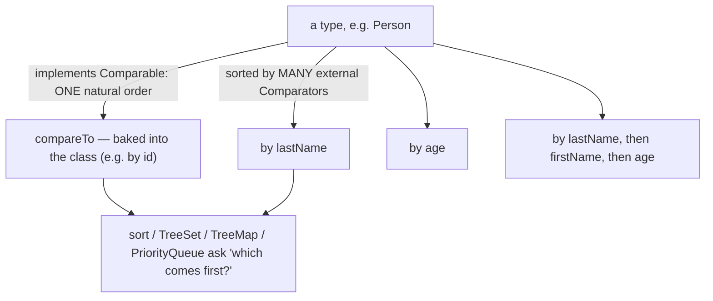
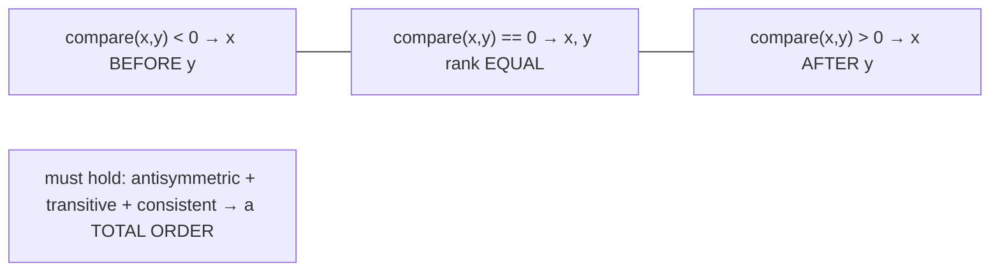
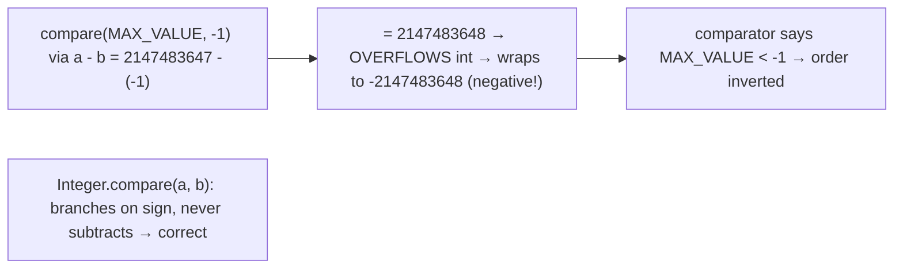
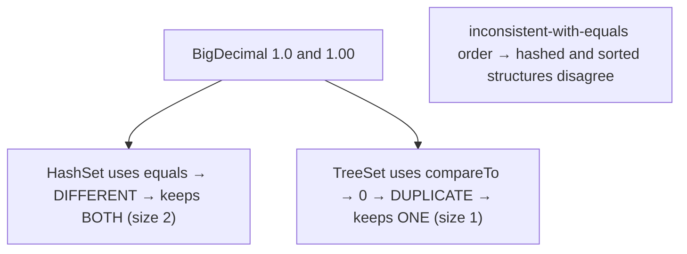
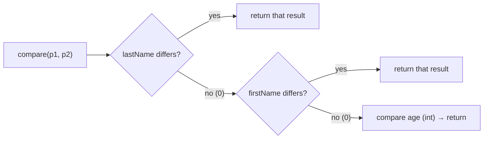
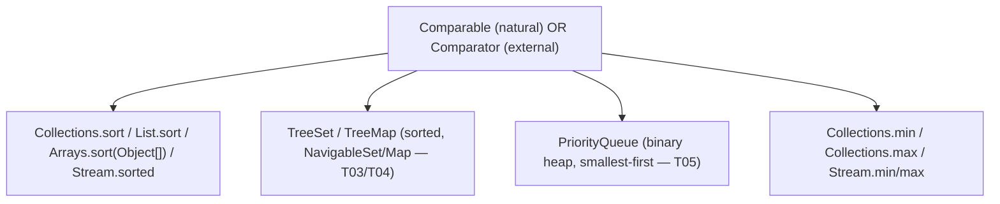
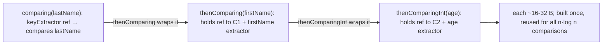
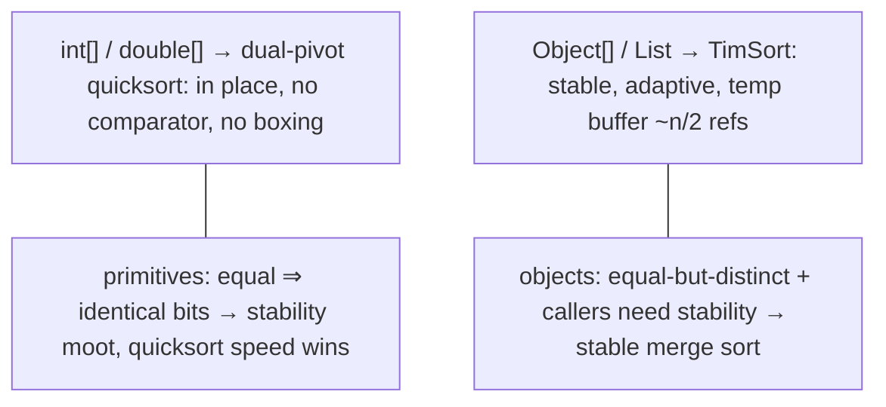
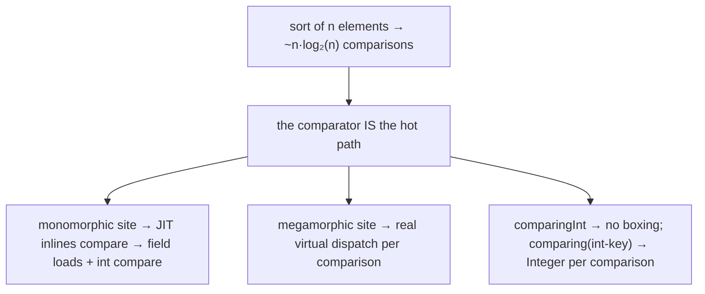
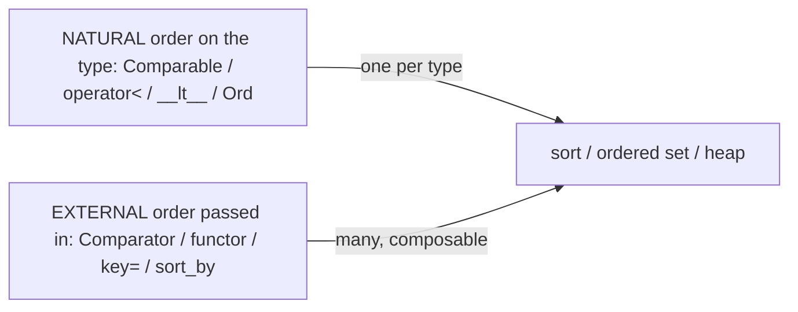

# Comparable vs Comparator

We have leaned on "natural order" and "a `Comparator`" repeatedly without opening them. A `TreeSet`/`TreeMap` keeps its elements **sorted** ([T03](./T03-set-hashset-linkedhashset-treeset.md)/[T04](./T04-map-hashmap-linkedhashmap-treemap.md)); a `PriorityQueue` yields the **smallest first** ([T05](./T05-queue-deque-priorityqueue-stack.md)); `Collections.sort`, `List.sort`, `Arrays.sort`, and `Stream.sorted` all put a sequence in order. Every one of them asks the same question — *given two elements, which comes first?* — and gets the answer from one of two interfaces. **`Comparable`** is a type's **one natural order**, baked into the class via `compareTo` (this is why `String`, `Integer`, and `LocalDate` sort sensibly out of the box). **`Comparator`** is an **external order**, a separate object you pass in — and you can have as many as you like (by last name, then first name, then age). The split is the whole topic: *natural order lives on the type; external orders are values you build and pass around.*

The depth bar is **the ordering contract and why violating it silently corrupts data structures**. `compareTo`/`compare` must define a **total order** — return negative/zero/positive consistently, antisymmetric and transitive — or things break in surprising ways: a non-total-order comparator makes `Arrays.sort` throw *"Comparison method violates its general contract!"*, and an order **inconsistent with `equals`** makes a `TreeSet` disagree with a `HashSet` about what counts as a duplicate (the canonical `BigDecimal("1.0")` vs `BigDecimal("1.00")` trap — equal by `compareTo`, unequal by `equals`). Underneath, ordering is a **virtual call on the hottest path in sorting**: a sort makes O(n log n) comparisons, so the comparator dominates the cost; the JIT inlines a monomorphic one to nearly nothing, the `comparingInt` family avoids a boxed `Integer` per comparison, and the JDK picks **dual-pivot quicksort** for primitives (no comparator, in place) but **TimSort** for objects (stable, adaptive, allocates a temp buffer). By the end you will implement `Comparable`, build multi-key `Comparator` chains, reproduce both the `a - b` overflow and the contract-violation exception, explain the `BigDecimal`/`TreeSet` gotcha, and know why Rust's type system encodes the `NaN` ordering problem that `Double.compare` papers over.

> [!NOTE]
> Prerequisites: [Set](./T03-set-hashset-linkedhashset-treeset.md) (`L1/C02/T03`) and [Map](./T04-map-hashmap-linkedhashmap-treemap.md) (`L1/C02/T04`) — `TreeSet`/`TreeMap` use ordering, *not* `equals`, to decide duplicates; [PriorityQueue](./T05-queue-deque-priorityqueue-stack.md) (`L1/C02/T05`) — the heap orders by `Comparable`/`Comparator`; [equals/hashCode](../C01-oop/T10-equals-hashcode-tostring-contracts.md) (`L1/C01/T10`) — the consistency-with-`equals` recommendation; [Interfaces](../C01-oop/T08-interfaces-default-static-private-methods.md) (`L1/C01/T08`) — `Comparator` is a `@FunctionalInterface` with `default`/`static` combinators. Forward: [T08](./T08-collection-performance-characteristics-big-o.md) (comparative Big-O), L2 (`Stream.sorted`).

## The Two Interfaces — Natural Order vs External Order

**`Comparable<T>`** has a single method and expresses a type's *one* intrinsic ordering. A class implements it to say "instances of me have a natural sort order":

```java
public interface Comparable<T> {
    int compareTo(T o);   // this vs o: negative if this < o, 0 if equal, positive if this > o
}

record Version(int major, int minor) implements Comparable<Version> {
    public int compareTo(Version o) {
        int c = Integer.compare(major, o.major);
        return c != 0 ? c : Integer.compare(minor, o.minor);   // major first, minor as tie-breaker
    }
}
```

**`Comparator<T>`** is a *separate* object that imposes an order from the outside — and a `@FunctionalInterface`, so it is usually a lambda:

```java
@FunctionalInterface
public interface Comparator<T> {
    int compare(T a, T b);   // same negative/0/positive convention
    // + a rich set of default/static combinators (Java 8) — see below
}

Comparator<Version> byMinorFirst = (a, b) -> Integer.compare(a.minor(), b.minor());
```

A type has **at most one** `Comparable` natural order but can be sorted by **any number** of `Comparator`s. The JDK's `Comparable` types include `String` (lexicographic by UTF-16 code unit), the wrapper types, `BigInteger`/`BigDecimal`, `LocalDate`/`Instant` (chronological), and enums (declaration order — [T13](../C01-oop/T13-enum-types-with-fields-methods.md)). When both are available, a method that takes a `Comparator` uses it; one that takes none falls back to natural order (and throws `ClassCastException` if the elements are not `Comparable`).



## The Contract — A Total Order

Both methods must define a **total order** over the elements, or the structures that rely on them misbehave. The rules (from the `Comparable` javadoc, and identical for `Comparator`):

- **Sign convention.** `compareTo`/`compare` returns a negative int, zero, or a positive int — *only the sign matters*, not the magnitude.
- **Antisymmetry.** `sgn(compare(x, y)) == -sgn(compare(y, x))` for all `x, y` (and one throws iff the other throws).
- **Transitivity.** `compare(x, y) > 0 && compare(y, z) > 0` ⇒ `compare(x, z) > 0`.
- **Consistency.** `compare(x, y) == 0` ⇒ `sgn(compare(x, z)) == sgn(compare(y, z))` for every `z` (equal elements compare the same against everything else).



Violate transitivity (a comparator whose logic forms a "rock-paper-scissors" cycle) and the sort can loop, skip elements, or — for `Arrays.sort`/`Collections.sort` on objects — detect the impossibility mid-merge and throw:

> [!WARNING]
> **"Comparison method violates its general contract!"** TimSort (the object-array sort) validates its merge invariants as it runs; a non-total-order comparator makes them impossible and it throws `IllegalArgumentException` with this message. Common causes: an intransitive hand-rolled comparator, or a comparator that reads a field that **mutates during the sort** (so the same pair compares differently at different times). The fix is to make the order total and stable for the duration of the sort.

## The `a - b` Subtraction Pitfall

A tempting one-liner for integers is `(a, b) -> a - b` — *and it is a latent bug*. Integer subtraction **overflows**: if `a` is large positive and `b` is large negative, `a - b` wraps around to a negative result, inverting the order. `Integer.MAX_VALUE - (-1)` overflows to a negative number, so the comparator claims `MAX_VALUE < -1`.

```java
Comparator<Integer> broken = (a, b) -> a - b;                 // WRONG — overflows
Comparator<Integer> correct = (a, b) -> Integer.compare(a, b); // RIGHT — no arithmetic
```



Always use `Integer.compare`/`Long.compare`/`Double.compare` (or the `comparingInt` family below), which compute the sign without subtracting. This is one of the most common real-world comparator bugs.

## Consistency With `equals` — The `BigDecimal`/`TreeSet` Trap

One contract rule is only **strongly recommended, not required**: that `compareTo(y) == 0` exactly when `equals(y)` is `true` ("consistent with `equals`"). It matters because **`TreeSet` and `TreeMap` use the *ordering*, not `equals`, to decide what is a duplicate** ([T03](./T03-set-hashset-linkedhashset-treeset.md)/[T04](./T04-map-hashmap-linkedhashmap-treemap.md)). When the two disagree, a sorted structure and a hashed structure disagree about the same data. `BigDecimal` is the textbook case:

```java
BigDecimal a = new BigDecimal("1.0"), b = new BigDecimal("1.00");
a.equals(b);       // false — different scale (1 vs 2 decimal places)
a.compareTo(b);    // 0    — numerically equal

Set<BigDecimal> hash = new HashSet<>(List.of(a, b));   // size 2 — equals says distinct
Set<BigDecimal> tree = new TreeSet<>(List.of(a, b));   // size 1 — compareTo says duplicate!
```

`BigDecimal`'s own javadoc warns: *"this class has a natural ordering that is inconsistent with `equals`."* The lesson generalizes to **any** comparator that compares fewer fields than `equals`: a `TreeSet` built with a by-last-name comparator treats two different people with the same last name as one element, silently dropping the second. If a comparator is inconsistent with `equals`, never use it to build a `TreeSet`/`TreeMap` unless you *intend* that "duplicate by order" semantics.



> [!WARNING]
> **`Double`/`NaN` is inconsistent too.** `Double.compare` imposes a *total* order by fiat — it ranks `-0.0 < 0.0` and treats `NaN` as equal to itself and greater than everything — but `==` says `NaN != NaN` and `-0.0 == 0.0`. So a `TreeSet<Double>` can contain and find `NaN` (which `==`-based logic never could) and keeps `-0.0` and `0.0` as distinct. The wrapper comparators are total but deliberately *not* consistent with primitive `==`.

## The `Comparator` Combinators (Java 8)

Before Java 8, multi-field comparators were verbose nested `if`s. The `Comparator` static/default methods ([T08](../C01-oop/T08-interfaces-default-static-private-methods.md)) make them declarative and composable:

```java
people.sort(
    Comparator.comparing(Person::lastName)        // primary key
              .thenComparing(Person::firstName)    // tie-breaker
              .thenComparingInt(Person::age)       // second tie-breaker, no boxing
              .reversed());                        // flip the whole order
```

The toolkit:

- **`comparing(keyExtractor)`** — order by a `Comparable` key pulled from each element; `comparing(keyExtractor, keyComparator)` to order the key itself however you like.
- **`comparingInt`/`comparingLong`/`comparingDouble`** — primitive-specialized; avoid boxing the key (see Architecture).
- **`thenComparing(...)`** — a tie-breaker applied only when the prior comparator returns 0; chainable.
- **`reversed()`** — reverse the order this comparator defines.
- **`Comparator.naturalOrder()` / `reverseOrder()`** — the element's own `Comparable` order, forward or backward.
- **`nullsFirst(cmp)` / `nullsLast(cmp)`** — wrap a comparator to tolerate `null` elements (ordering them at one end).

Each combinator returns a **new** `Comparator` that delegates to the previous ones — composition, not mutation.



## Who Consumes Ordering

The same two interfaces feed every ordering operation in the library — learn them once, use them everywhere:



`TreeMap`/`TreeSet` take an optional `Comparator` in their constructor (else natural order); `PriorityQueue` likewise; `List.sort(null)` means natural order. If you pass no comparator and the elements are not `Comparable`, you get a `ClassCastException` at the first comparison.

## Memory — Where the Order Lives, and the Sort's Footprint

**`Comparable` adds no instance state.** Implementing it just adds a `compareTo` method to the class's vtable ([T05-C01](../C01-oop/T05-method-overriding.md)/[T06](./T06-iterators-and-iterable.md)) — zero bytes per object. **A `Comparator`, by contrast, is an object.** A lambda comparator compiles to an `invokedynamic` site ([T12](../C01-oop/T12-inner-local-and-anonymous-classes.md)) that yields a (often cached, non-capturing) instance with no class file; an anonymous-class comparator is a real `Outer$1` class plus an instance. A **`thenComparing` chain is a small linked tree of comparator objects** — each combinator allocates a wrapper (~16–32 bytes: header + a reference to the next comparator + the key-extractor function reference). A three-key chain is three or four tiny objects; built once, reused for the whole sort, so the cost is negligible.



The **sort algorithm's** memory differs sharply by element type:

| Sort | Used for | Algorithm | Extra memory | Stable? |
|---|---|---|---|---|
| `Arrays.sort(int[]/double[]/…)` | primitives | **dual-pivot quicksort** | O(log n) stack, **in place** | n/a |
| `Arrays.sort(Object[])`, `Collections.sort`, `List.sort` | objects | **TimSort** (adaptive merge sort) | **temp buffer up to ~n/2 refs** + run stack | **yes** |

Why two algorithms? **Primitives have no identity** — two `int`s that compare equal *are* bit-identical, so "stability" is meaningless and quicksort's in-place speed wins. **Objects can be equal-but-distinct** (two `Person`s with the same key), and callers rely on **stable** sorting (equal elements keep their input order); merge sort is naturally stable, and TimSort is also O(n log n) *worst-case*, avoiding quicksort's O(n²) adversarial blow-up that an attacker-controlled comparator could trigger.



## Architecture — The Comparator Is the Hot Path

Sorting is **comparison-bound**: an n-element sort performs ~`n log n` calls to `compare`/`compareTo`. That makes the comparator the single hottest piece of code in the operation, and three architectural facts follow:

- **Virtual dispatch, then inlining.** Each comparison is an `invokeinterface`/`invokevirtual` ([T05-C01](../C01-oop/T05-method-overriding.md)). At a **monomorphic** site — one sort call that only ever sees one comparator implementation — the JIT devirtualizes and **inlines** the comparator body, so the comparison becomes a couple of field loads and an integer compare with no call overhead. At a **megamorphic** site — a shared utility that sorts with many different comparators — the call cannot be inlined and each of the `n log n` comparisons pays real dispatch cost.
- **`comparingInt` avoids boxing.** `comparing(Person::getAge)` where `getAge` returns `int` extracts the key as a boxed `Integer` — potentially an allocation per element per comparison (mitigated only by the small-`Integer` cache). `comparingInt(Person::getAge)` keeps the key primitive and calls `Integer.compare` on the `int`s — **zero boxing**, a real win in a tight sort over millions of elements ([T01](../C01-oop/T01-classes-and-objects.md)/L0 boxing-cost callback).
- **TimSort is adaptive and cache-friendly.** It finds existing ascending/descending **runs** in the data, so already-sorted or nearly-sorted input costs ~O(n) (it detects the single run and stops). Its **galloping mode** uses exponential search when one run consistently supplies the next elements, and its merges are sequential array scans — prefetcher-friendly ([T02](./T02-list-arraylist-linkedlist.md)). Real-world data is often partly ordered, so TimSort routinely beats a textbook O(n log n).



## Cross-Language Perspective

The natural-order-vs-external-order split is universal; the safety of the contract differs:

| Language | Natural order | External order | Contract violation |
|---|---|---|---|
| **Java** | `Comparable.compareTo` | `Comparator` / `comparingInt` | `IllegalArgumentException` (TimSort) or wrong results |
| **C++** | `operator<` | functor/lambda to `std::sort`/`std::set` | **undefined behavior** (strict-weak-ordering required) |
| **Python** | `__lt__` | `key=` function, `cmp_to_key` | `TypeError` / wrong results |
| **C#** | `IComparable.CompareTo` | `IComparer` / `Comparison<T>` | `InvalidOperationException` / `ArgumentException` |
| **Rust** | `Ord::cmp` | `sort_by` / `sort_by_key` closures | won't compile (`f64` is not `Ord`) |

Three deep contrasts. **C++** requires a **strict weak ordering** and makes violating it **undefined behavior** — `std::sort` can crash or loop, strictly more dangerous than Java's exception; `std::sort` is introsort (quicksort with a heapsort fallback), `std::stable_sort` is the merge-sort analog of TimSort. **Python** pioneered both TimSort (Tim Peters wrote it for CPython; Java adopted it) and the **`key=` function** model — compute a sort key once per element, then sort by it (the "decorate–sort–undecorate" / Schwartzian transform) — which is exactly what `Comparator.comparing` mirrors. **Rust** encodes the ordering contract in the **type system**: `Ord` is a *total* order, `PartialOrd` is *partial*, and `f64` implements only `PartialOrd` because **`NaN` is unordered** — so `vec_of_f64.sort()` *does not compile* (you must use `sort_by(|a,b| a.partial_cmp(b).unwrap())` or `total_cmp` and acknowledge the NaN question). That is the same `NaN` problem `Double.compare` silently resolves by imposing a total order; Rust makes you confront it at compile time. `#[derive(Ord)]` generates a lexicographic order over a struct's fields — the language-level version of a `comparing(...).thenComparing(...)` chain.



## Common Mistakes

> [!WARNING]
> **`(a, b) -> a - b` integer overflow.** Subtraction wraps for large/negative values and inverts the order. Use `Integer.compare`/`Long.compare`/`comparingInt`.

> [!WARNING]
> **An order inconsistent with `equals` in a `TreeSet`/`TreeMap`.** The tree decides duplicates by `compareTo`/`compare` returning 0, *not* `equals` — so `BigDecimal("1.0")`/`("1.00")` collapse to one, and a by-one-field comparator silently drops elements that differ in other fields ([T03](./T03-set-hashset-linkedhashset-treeset.md)/[T04](./T04-map-hashmap-linkedhashmap-treemap.md)).

> [!WARNING]
> **A non-total-order comparator.** Intransitive logic (or a key that mutates mid-sort) triggers TimSort's *"Comparison method violates its general contract!"* `IllegalArgumentException`. Make the order total and stable.

> [!WARNING]
> **Mutating an element's sort key while it sits in a `TreeSet`/`TreeMap`.** The element is now misplaced and may become unfindable — the same hazard as a mutating `hashCode` in a `HashSet` ([T03](./T03-set-hashset-linkedhashset-treeset.md)). Keep sort keys effectively immutable.

> [!WARNING]
> **Boxing via `comparing` where `comparingInt` fits.** `comparing(Person::getAge)` (primitive key) boxes an `Integer` per comparison; `comparingInt(Person::getAge)` does not. In a large sort this is real GC pressure.

> [!WARNING]
> **`reversed()` placement.** `comparing(A).thenComparing(B).reversed()` reverses the *entire* chain. To reverse only one key, reverse that key's comparator: `thenComparing(B, Comparator.reverseOrder())`.

## Practice

> [!INTERVIEW]
> Common interview questions for this topic:
> 1. **`Comparable` vs `Comparator`?** `Comparable` is a type's one natural order (`compareTo`, baked into the class); `Comparator` is an external, separately-supplied order (`compare`) — and you can have many.
> 2. **What does `compareTo` return?** A negative int, zero, or positive int for less/equal/greater — only the sign matters.
> 3. **What is the ordering contract?** A total order: antisymmetric, transitive, and consistent (equal elements compare identically against all others).
> 4. **What does "consistent with `equals`" mean and why does it matter?** `compareTo == 0` iff `equals` — when violated, `TreeSet`/`TreeMap` (which use the order, not `equals`) disagree with `HashSet`/`HashMap` about duplicates (e.g. `BigDecimal`).
> 5. **Why is `(a,b) -> a - b` wrong?** Integer subtraction overflows for large/negative values and inverts the order; use `Integer.compare`.
> 6. **How do you sort by multiple fields?** `Comparator.comparing(key1).thenComparing(key2)...`, optionally `reversed()`/`nullsFirst`.
> 7. **`comparing` vs `comparingInt`?** `comparingInt` keeps the key primitive (no boxing); `comparing` on a primitive key boxes an `Integer` per comparison.
> 8. **What sort does Java use?** Dual-pivot quicksort for primitive arrays (in place); TimSort for object arrays / `List.sort` (stable, adaptive, temp buffer).
> 9. **Why two different sorts?** Primitives have no identity so stability is moot (quicksort speed wins); objects can be equal-but-distinct and need stable, O(n log n)-worst-case sorting.
> 10. **What causes "Comparison method violates its general contract!"?** A non-total-order comparator (intransitive, or a mutating key) detected by TimSort's invariant checks → `IllegalArgumentException`.
> 11. **What happens with no comparator and non-`Comparable` elements?** `ClassCastException` at the first comparison.
> 12. **How does `Double.compare` handle `NaN`/`-0.0`?** It imposes a total order — `NaN` equals itself and is greatest, `-0.0 < 0.0` — deliberately inconsistent with primitive `==`.
> 13. **How does Rust express the same ordering ideas?** `Ord` (total) vs `PartialOrd` (partial); `f64` is only `PartialOrd` because `NaN` is unordered, so it won't `.sort()` without acknowledging it.

1. **Implement `Comparable`.** Give a `Version(int major, int minor)` a natural order (major, then minor). Put several in a `TreeSet`; confirm sorted iteration.

2. **Multi-key `Comparator`.** Sort a `List<Person>` by last name, then first name, then age, using `comparing(...).thenComparing(...).thenComparingInt(...)`. Verify the tie-breaking order.

3. **`a - b` overflow.** Write `(a,b) -> a - b`, then sort `List.of(Integer.MAX_VALUE, -1, 0)`; observe the wrong order. Replace with `Integer.compare` and confirm the fix.

4. **Contract violation.** Write an intransitive comparator (e.g. rock-paper-scissors logic) and sort a large list; observe *"Comparison method violates its general contract!"*.

5. **`BigDecimal` trap.** Put `new BigDecimal("1.0")` and `new BigDecimal("1.00")` into both a `HashSet` and a `TreeSet`; confirm sizes 2 and 1. Explain via `equals` vs `compareTo`.

6. **By-one-field `TreeSet` drop.** Build a `TreeSet<Person>` with a by-last-name comparator; add two different people with the same last name; confirm only one survives. Discuss consistency-with-`equals`.

7. **`comparingInt` vs `comparing` boxing.** Benchmark sorting a million `Person`s by an `int` age with `comparing(Person::getAge)` vs `comparingInt(Person::getAge)`; observe the boxing difference (allocation/GC).

8. **`reversed` and `nullsFirst`.** Sort a list containing `null`s with `Comparator.nullsFirst(naturalOrder())`; then `reversed()`. Predict and verify where the `null`s land.

9. **Stability.** Sort a list of `(key, seq)` pairs by `key` only with `List.sort`; confirm equal-key elements keep their original `seq` order (TimSort is stable). Contrast with the idea of an unstable sort.

10. **Adaptive TimSort.** Time `List.sort` on already-sorted, reverse-sorted, and random data of the same size; observe the already-sorted case is fastest (run detection → ~O(n)).

11. **Natural vs external on one type.** Sort the same `List<String>` by natural order, then by `Comparator.comparingInt(String::length)`, then by `String.CASE_INSENSITIVE_ORDER`. Confirm three different orders.

12. **`PriorityQueue` with a comparator.** Build a max-heap with `new PriorityQueue<>(Comparator.reverseOrder())`; confirm `poll` yields descending. Relate to [T05](./T05-queue-deque-priorityqueue-stack.md).

13. **Mutating sort key.** Put a mutable object in a `TreeSet`, then mutate the field the comparator reads; show the element becomes unfindable (`contains` returns false). Relate to mutating `hashCode` ([T03](./T03-set-hashset-linkedhashset-treeset.md)).

14. **`Double`/`NaN`.** Put `Double.NaN`, `0.0`, and `-0.0` in a `TreeSet<Double>`; confirm `NaN` is present and findable and `-0.0`/`0.0` are distinct — then show `==`-based logic disagrees.

15. **End-to-end explain-it-back.** For `people.sort(comparing(Person::lastName).thenComparingInt(Person::age))`: (a) what objects the chain allocates; (b) how `compare(p1, p2)` evaluates the two keys in order and when the tie-breaker runs; (c) why this comparison is the sort's hot path and what the JIT does to it at a monomorphic call site; (d) why `thenComparingInt` avoids boxing; (e) which sort algorithm runs and whether it is stable. Twelve sentences max.

## Recap

You should now be able to:

**Language layer.**

- Distinguish `Comparable` (a type's one natural order via `compareTo`) from `Comparator` (any number of external orders via `compare`), and know which operations consume each.
- State the total-order contract (sign convention, antisymmetry, transitivity, consistency) and recognize a violation's symptoms.
- Explain consistency-with-`equals` and the `BigDecimal`/`TreeSet` (and `Double`/`NaN`) consequences of ignoring it.
- Build multi-key orders with `comparing`/`thenComparing`/`reversed`/`nullsFirst`/`comparingInt`, and avoid the `a - b` overflow with `Integer.compare`.

**Memory layer.**

- Explain that `Comparable` adds no instance state (just a vtable method) while a `Comparator` is an object — a lambda (`invokedynamic`, often cached) or a small linked chain of combinator wrappers.
- Contrast the sort footprints: dual-pivot quicksort (primitives, in place) vs TimSort (objects, stable, temp buffer ~n/2 refs), and why the element type drives the choice.

**Architecture layer.**

- Explain why the comparator is the hot path (O(n log n) comparisons) and how monomorphic inlining vs megamorphic dispatch changes the cost.
- Explain why `comparingInt` avoids a boxed `Integer` per comparison, and why TimSort's run detection and galloping make it adaptive and cache-friendly.
- Place Java's ordering against C++ strict-weak-ordering UB, Python's `key=`/TimSort lineage, and Rust's `Ord`/`PartialOrd` type-level encoding of the `NaN` problem.

With ordering and traversal ([T06](./T06-iterators-and-iterable.md)) established, the chapter's structural story is complete. [T08](./T08-collection-performance-characteristics-big-o.md) is the **performance capstone** — a comparative Big-O synthesis that ties together every structure (T02–T05), so you can pick the right collection by its operation costs at a glance.

## Next

Continue to [Collection Performance Characteristics (Big-O)](./T08-collection-performance-characteristics-big-o.md) — the synthesis that ties the whole chapter together. We have opened each structure's mechanics individually — `ArrayList`'s contiguous array vs `LinkedList`'s nodes ([T02](./T02-list-arraylist-linkedlist.md)), `HashMap`'s O(1) buckets vs `TreeMap`'s O(log n) tree ([T04](./T04-map-hashmap-linkedhashmap-treemap.md)), the heap's O(log n) sift ([T05](./T05-queue-deque-priorityqueue-stack.md)) — and now T08 lays them side by side: the comparative cost table for `add`/`get`/`contains`/`remove`/iteration across every collection, *why* each cost is what it is (the memory and cache reasoning from this chapter), and how to choose the right structure for an access pattern — the practical payoff of everything from T01 onward.
