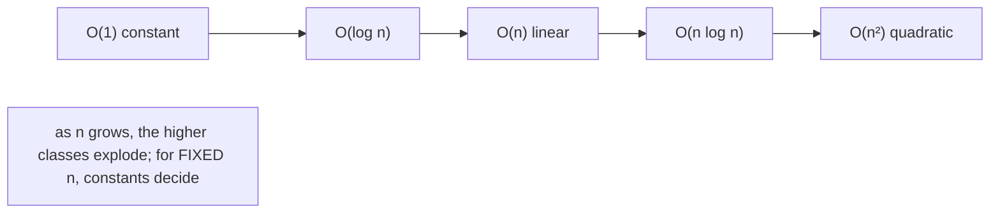
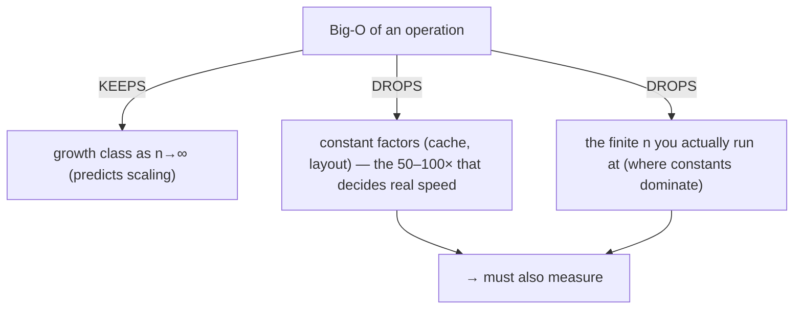
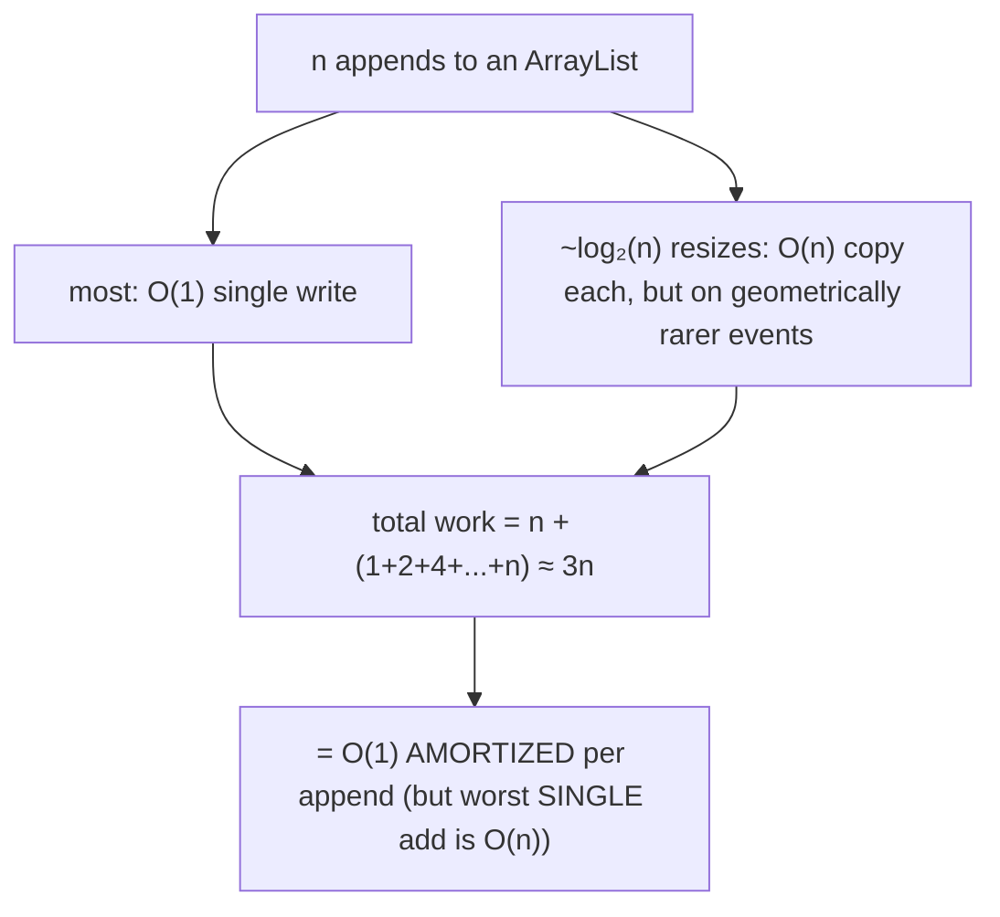
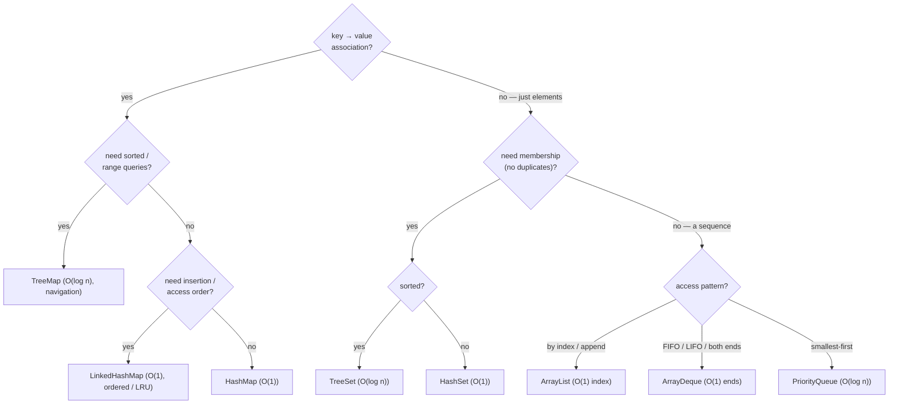
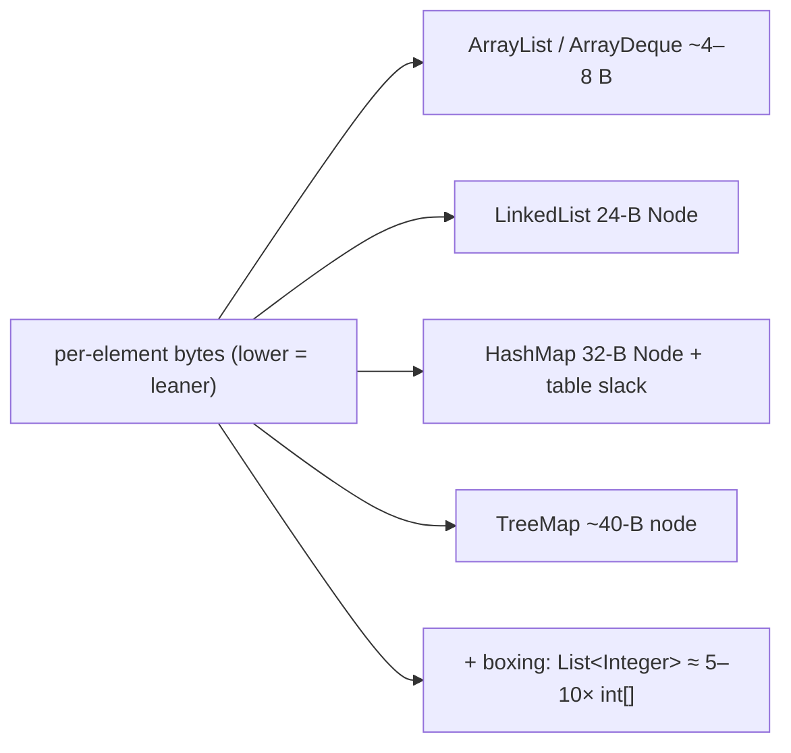
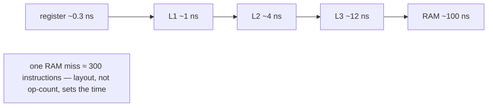
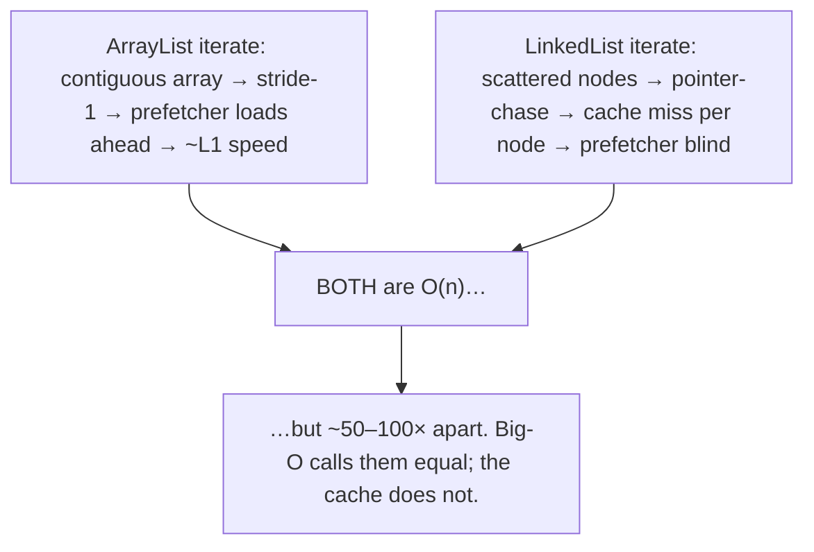
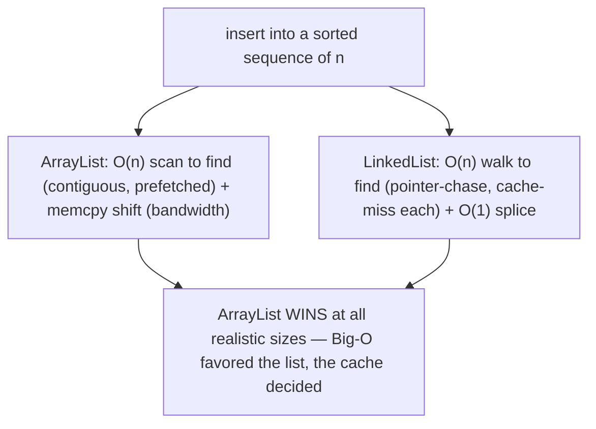
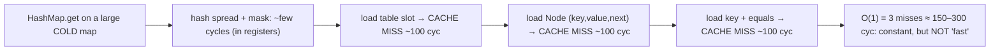
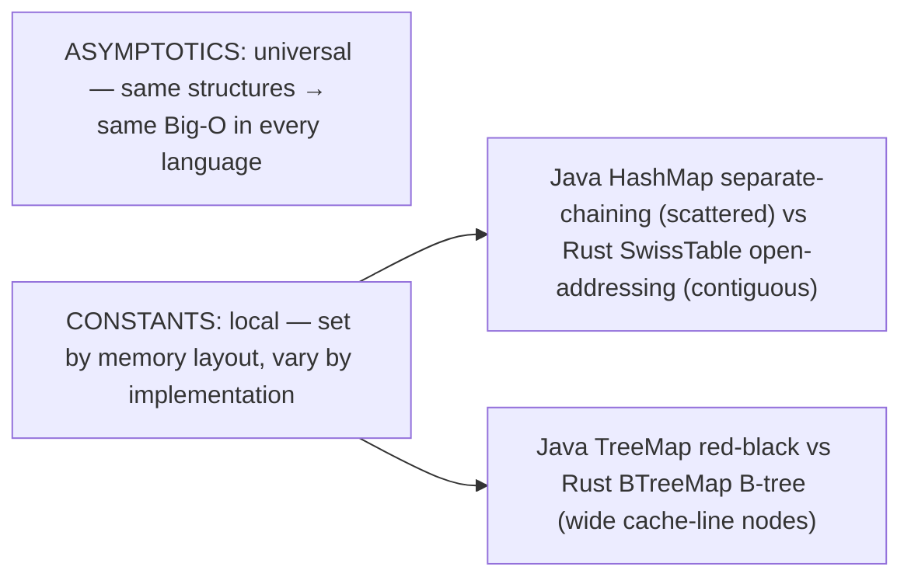

# Collection Performance Characteristics (Big-O)

This is the chapter's **performance capstone**. We opened each structure's mechanics individually — `ArrayList`'s contiguous array versus `LinkedList`'s scattered nodes ([T02](./T02-list-arraylist-linkedlist.md)), `HashMap`'s O(1) buckets versus `TreeMap`'s O(log n) red-black tree ([T03](./T03-set-hashset-linkedhashset-treeset.md)/[T04](./T04-map-hashmap-linkedhashmap-treemap.md)), the heap's O(log n) sift ([T05](./T05-queue-deque-priorityqueue-stack.md)). Now we lay them side by side and turn the chapter into a **decision tool**: given an access pattern — index lookup, key lookup, FIFO, sorted range, smallest-first, membership — which collection has the right cost profile? Big-O is the vocabulary for that comparison, the one notation that lets you predict how an operation's cost grows as the collection grows, independent of machine speed.

But the deeper lesson of this topic is the one Big-O *hides*. **Big-O counts operations as the input grows toward infinity; it says nothing about wall-clock time at the sizes you actually run.** A modern CPU executes an instruction in a fraction of a nanosecond but stalls ~100 ns on a cache miss — so performance is **memory-hierarchy-bound**, and the *constant factor*, which is mostly determined by memory layout, dominates until n is large. That is why two O(n) traversals can differ 50–100× (contiguous `ArrayList` versus pointer-chasing `LinkedList`), why an `ArrayList` beats a `LinkedList` at mid-list insertion *even though Big-O favors the list*, and why a `HashMap.get` is "O(1)" yet costs ~150–300 cycles on a large cold map (three cache misses). By the end you will have the master cost table memorized, know when an operation is amortized versus worst-case, choose a collection by its access pattern in seconds, and — most importantly — know when to trust Big-O and when to reach for a profiler instead.

> [!NOTE]
> Prerequisites: this topic **synthesizes** the whole chapter — [List](./T02-list-arraylist-linkedlist.md) (`L1/C02/T02`), [Set](./T03-set-hashset-linkedhashset-treeset.md) (`L1/C02/T03`), [Map](./T04-map-hashmap-linkedhashmap-treemap.md) (`L1/C02/T04`), [Queue/Deque/heap](./T05-queue-deque-priorityqueue-stack.md) (`L1/C02/T05`). It assumes you know each structure's memory layout and the cache lessons from those topics; here we generalize them into a comparative framework. Forward: L2 (Streams — where laziness and parallelism add another performance axis), L4 (JVM performance & profiling).

## What Big-O Measures — and What It Hides

**Big-O notation** describes how the *number of basic operations* an algorithm performs grows as the input size `n` grows toward infinity, **dropping constant factors and lower-order terms**. `O(1)` is constant (independent of n), `O(log n)` grows slowly (doubling n adds one step), `O(n)` is linear, `O(n log n)` is the cost of a good sort, `O(n²)` is quadratic (a nested loop). It is the right tool for one question: **how does this scale?** — and the wrong tool for another: **how fast is this *right now*?**

Two things Big-O deliberately throws away come back to bite you:

- **Constant factors.** `O(n)` with a cache-friendly stride-1 scan and `O(n)` with a cache-missing pointer chase are the *same* Big-O but differ 50–100× in practice. Big-O calls them equal; your latency budget does not.
- **The size you actually run at.** Big-O is an *asymptotic* (n→∞) statement. At n=10 or n=1000, the lower-order terms and constants dominate, and an "O(n²)" algorithm with a tiny constant can beat an "O(n)" one with a large constant.

So Big-O is necessary but not sufficient: it tells you which structure *won't fall over* as data grows, but the constant factor — set by memory layout — tells you which is *actually fast* at your scale. Hold both ideas at once; the rest of this topic is about exactly that tension.

## The Master Cost Table

Here is the whole chapter in one table — the **average-case** time complexity of each core operation. Memorize the shape; the reasons are in T02–T05.

| Collection | add / offer | get(index) | contains / get(key) | remove | iterate (n elements) |
|---|---|---|---|---|---|
| **`ArrayList`** | O(1)† append | **O(1)** | O(n) | O(n) shift | O(n) **cache-friendly** |
| **`LinkedList`** | O(1) ends | O(n) walk | O(n) | O(1) at cursor / O(n) by index | O(n) **cache-hostile** |
| **`ArrayDeque`** | O(1)† ends | — (no index) | O(n) | O(1) ends | O(n) cache-friendly |
| **`HashMap`/`HashSet`** | O(1)† avg | — | **O(1)** avg | O(1) avg | O(n + capacity) |
| **`LinkedHashMap`/`Set`** | O(1)† avg | — | O(1) avg | O(1) avg | O(n) (linked order) |
| **`TreeMap`/`TreeSet`** | O(log n) | — | O(log n) | O(log n) | O(n) sorted |
| **`PriorityQueue`** | O(log n) | — | O(n) | O(log n) poll-min / O(n) arbitrary | O(n) **not sorted** |

† **amortized** O(1) — see the next section; an individual operation can be O(n) when it triggers a resize. `HashMap`'s O(1) is **average-case**; its worst case is O(log n) once a bucket treeifies ([T04](./T04-map-hashmap-linkedhashmap-treemap.md)). The `HashMap` iteration cost is O(n + capacity) because you walk the whole `Node[]` table including empty slots — a sparsely-filled large-capacity map iterates slower than its element count suggests, which `LinkedHashMap` fixes by following its own linked list instead.

The table is the *what*; the chapter taught the *why*. `ArrayList.get` is O(1) because an array index is base+scale arithmetic on contiguous memory; `LinkedList.get` is O(n) because it walks node-by-node. `HashMap.get` is O(1) because a hash jumps straight to a bucket; `TreeMap.get` is O(log n) because it descends a balanced tree. The heap's O(log n) is a single root-to-leaf sift path.

## Amortized vs Worst-Case — The Fine Print on O(1)

Several "O(1)" entries are **amortized**, not per-operation guarantees, and the distinction matters enormously for latency-sensitive code.

`ArrayList.add` (append) writes one slot — O(1) — *until* the backing array is full, when it allocates a 1.5×-larger array and copies every element — O(n) ([T02](./T02-list-arraylist-linkedlist.md)). So *most* appends are O(1) and *occasional* ones are O(n). **Amortized analysis** proves the average is still O(1): because the array grows *geometrically*, the total copy work across n appends is a geometric series that sums to ~2–3n, so the per-append average is constant. (If it grew by a *fixed* +1 each time, total work would be 1+2+...+n = O(n²), i.e. O(n) per append — geometric growth is the whole trick.)

> [!WARNING]
> **Amortized O(1) ≠ bounded latency.** A trading system, a game frame, or a real-time pipeline cannot tolerate the occasional O(n) resize stall or `HashMap` rehash hidden inside an "O(1)" append. The averages are fine; the *tail latency* is not. The fix is to **pre-size** (`new ArrayList<>(expectedSize)`, `new HashMap<>(expectedСapacity)`) so the resizes never happen on the hot path, or to use a structure with bounded worst-case behavior.

`HashMap.put`/`get` are **average** O(1): a good hash spreads keys one-per-bucket. But adversarial or poor hashing piles keys into one bucket — pre-Java-8 that degraded to O(n); since Java 8 a long bucket **treeifies** into a red-black tree, capping the worst case at O(log n) ([T04](./T04-map-hashmap-linkedhashmap-treemap.md)). Always remember the spread: HashMap is *typically* O(1), *worst-case* O(log n).

## The Decision Framework — Choose by Access Pattern

The practical payoff: pick the collection whose cheap operations match what your code does most. Start from the access pattern, not the data.

The defaults that cover most code: **`ArrayList`** for a sequence, **`HashMap`** for a lookup, **`HashSet`** for membership, **`ArrayDeque`** for a stack or queue ([T05](./T05-queue-deque-priorityqueue-stack.md)). Reach for the O(log n) sorted structures only when you genuinely need order or range queries — they cost more per operation and more per element. `LinkedList` is almost never the right answer ([T02](./T02-list-arraylist-linkedlist.md)).

## Space Complexity — The Other Big-O

Time is only half the cost; **space** has its own Big-O, and the per-element constant factor varies ~10× across these structures (the byte counts are from T02–T05):

| Collection | Per-element overhead | Notes |
|---|---|---|
| **`ArrayList`** | ~4–8 B/elem (a reference) + up to ~2× slack | most memory-efficient general collection |
| **`ArrayDeque`** | ~4–8 B/elem + power-of-2 slack | contiguous like ArrayList |
| **`LinkedList`** | **24-B `Node`** (header + item + next + prev) per element | ~3–6× ArrayList |
| **`HashMap`/`HashSet`** | **32-B `Node`** + table slack (load factor 0.75) | + ~56-B `TreeNode` in treeified buckets |
| **`TreeMap`/`TreeSet`** | **~40-B red-black node** (key, value, left, right, parent, color) | no table, but fat nodes |

And the **boxing tax** sits on top: a `List<Integer>` of n ints stores n separate `Integer` objects (~16 B each) plus n references, versus an `int[]` at n×4 B — roughly **5–10× more memory and far worse cache behavior** ([T01](../C01-oop/T01-classes-and-objects.md), L0 boxing). For millions of primitives, a primitive array or a specialized library (e.g. an `IntList`) beats any generic collection on both space and speed.

## Architecture — Big-O Counts Operations, the Memory Hierarchy Counts Time

Here is the thesis of the topic, stated plainly: **Big-O counts operations; the CPU spends its time waiting for memory.** A modern core executes an instruction in ~0.3 ns but stalls roughly **100 ns on a main-memory access** — so one cache miss costs as much as ~300 instructions. Performance is **memory-latency-bound**, which means the *constant factor* of an operation — set almost entirely by its memory-access pattern — dominates the wall-clock time until n is very large.

Three consequences run through this whole chapter:

- **Same Big-O, 50–100× apart.** Iterating an `ArrayList` is a stride-1 sequential scan the hardware **prefetcher** loads ahead → near-L1 speed. Iterating a `LinkedList` is a pointer chase to scattered 24-B nodes, each likely a cache miss the prefetcher cannot predict. Both are O(n); the array is ~50–100× faster ([T02](./T02-list-arraylist-linkedlist.md)).

- **The cache beats the asymptotics — `ArrayList` wins at mid-list insert.** Big-O says inserting into a sorted sequence favors `LinkedList` (O(1) splice) over `ArrayList` (O(n) shift). Measured, `ArrayList` wins at *every* size (Stroustrup's "Are lists evil?"): finding the position is O(n) for both, but the array scans contiguously while the list cache-misses node-by-node, and the array's shift is a `System.arraycopy` running at memory bandwidth while the list's "O(1)" insert first paid an O(n) cache-missing walk to reach the spot. Cache-friendly O(n) crushes cache-hostile O(n).

- **Memory-latency-bound "O(1)".** A `HashMap.get` on a large *cold* map computes the hash (a few cycles), then loads the table slot (cache miss), the `Node` (cache miss), and the key for `equals` (cache miss) — ~150–300 cycles, **three misses**, despite being O(1) ([T04](./T04-map-hashmap-linkedhashmap-treemap.md)). The O(1) is honest (a constant number of misses regardless of n) but "O(1)" does not mean "fast" — it means "memory-latency-bound at a constant." This is exactly why the modern open-addressing maps (next section) win: they cut the number of misses.

The unifying rule: **use Big-O to rule out structures that won't scale, then let memory layout (the constant factor) pick the winner among those that do.** Contiguity wins; pointer-chasing loses; this single idea explains T02 through T05.

## Cross-Language Perspective — Universal Asymptotics, Local Constants

The cost table is **language-independent**. Every language's dynamic array (`ArrayList`, C++ `vector`, Python `list`, Rust `Vec`, Go slice) is O(1) index + amortized O(1) append; every hash map is average O(1); every balanced-tree map is O(log n); every binary heap is O(log n) — because they all use the **same data structures** ([T02](./T02-list-arraylist-linkedlist.md)–[T05](./T05-queue-deque-priorityqueue-stack.md)). Learn this table once and it transfers everywhere.

The **constant factors are not** universal — they depend on the implementation's memory layout:

- **Hash maps.** Java's `HashMap` uses **separate chaining** (a `Node[]` of pointers to scattered, heap-allocated nodes) — classic, but cache-hostile (each probe a potential miss). Rust (`hashbrown`/SwissTable), C++ (`absl::flat_hash_map`), Go, and Swift use **open addressing** — keys stored *inline* in one contiguous array, often SIMD-probed — so a lookup touches one or two cache lines instead of chasing pointers. Same O(1); a meaningfully smaller constant ([T04](./T04-map-hashmap-linkedhashmap-treemap.md)).
- **Sorted maps.** Java's `TreeMap` is a **red-black tree** (pointer nodes, one key each). Rust's `BTreeMap` and most database indexes are **B-trees** (wide nodes holding many keys per cache line) → fewer cache misses per descent at the same O(log n) ([T03](./T03-set-hashset-linkedhashset-treeset.md)).

Stroustrup's advice — *prefer contiguous structures, avoid linked lists* — is **universal**, because the memory hierarchy is the same under every language. The takeaway: memorize the Big-O table (it predicts scaling everywhere), but **measure the constant factor in your own language and implementation** when performance matters.

## Common Mistakes

> [!WARNING]
> **Choosing by Big-O without measuring.** The `LinkedList`-has-O(1)-insert myth is the classic trap — measured, `ArrayList` wins for almost all real workloads ([T02](./T02-list-arraylist-linkedlist.md)). Big-O rules out non-scalers; a profiler picks the winner.

> [!WARNING]
> **Treating all O(n) as equal.** A contiguous O(n) scan and a pointer-chasing O(n) walk differ 50–100×. The constant factor (cache behavior) is not noise — at realistic sizes it *is* the performance.

> [!WARNING]
> **Ignoring amortized vs worst-case on a latency-critical path.** An "O(1)" `ArrayList.add` or `HashMap.put` occasionally stalls O(n) on a resize/rehash. Pre-size to keep the spike off the hot path.

> [!WARNING]
> **`ArrayList.contains` inside a loop → O(n²).** Membership-testing each of n items against an `ArrayList` is quadratic. Use a `HashSet` (O(1) contains) and the loop becomes O(n). This is the most common accidental-quadratic bug.

> [!WARNING]
> **Assuming `HashMap` is always O(1).** A bad `hashCode` or hash-flooding attack collides all keys into one bucket → O(log n) treeified, or O(n) pathologically ([T04](./T04-map-hashmap-linkedhashmap-treemap.md)). O(1) is *average*, contingent on a good hash.

> [!WARNING]
> **Ignoring space.** A `LinkedList<Integer>` of a million elements is ~40 MB (24-B node + 16-B `Integer` each) versus ~4 MB for an `int[]` — a 10× memory difference that also wrecks cache behavior.

## Practice

> [!INTERVIEW]
> Common interview questions for this topic:
> 1. **`ArrayList` vs `LinkedList` time complexity?** `ArrayList`: O(1) index, O(n) search/mid-insert, amortized O(1) append. `LinkedList`: O(n) index, O(1) ends/cursor, O(n) search. In practice `ArrayList` wins almost always (cache).
> 2. **`HashMap` get/put complexity?** Average O(1); worst-case O(log n) since Java 8 (treeified bucket), O(n) pre-8 / pathological.
> 3. **`TreeMap` vs `HashMap`?** `TreeMap` O(log n) sorted with range navigation; `HashMap` O(1) unordered. Use `TreeMap` only when you need order.
> 4. **What does "amortized O(1)" mean for `ArrayList.add`?** Most appends are O(1); occasional resizes are O(n); geometric growth makes the average O(1), but a single add can be O(n).
> 5. **Why is geometric growth essential?** Fixed +k growth makes n appends O(n²) total; geometric (×1.5) makes it O(n) total → O(1) amortized.
> 6. **Why can an `ArrayList` beat a `LinkedList` even where Big-O favors the list?** Contiguous memory is cache-friendly and prefetched; the list's pointer-chase cache-misses per node — the constant factor swamps the asymptotic advantage.
> 7. **Is `HashMap.get` fast because it's O(1)?** O(1) means a constant number of memory accesses, but on a large cold map that's ~3 cache misses (~150–300 cycles) — memory-latency-bound, not "fast."
> 8. **`PriorityQueue` complexity?** offer/poll O(log n), peek O(1), contains/arbitrary-remove O(n), iteration O(n) and not sorted.
> 9. **What does Big-O ignore?** Constant factors and lower-order terms — exactly the memory-layout effects that dominate real performance at realistic n.
> 10. **How do you avoid an accidental O(n²)?** Replace repeated `List.contains` with a `HashSet`; pre-build lookup structures outside loops.
> 11. **Space complexity ranking?** `ArrayList`/`ArrayDeque` (lean) < `LinkedList`/`HashMap` < `TreeMap`; plus the ~5–10× boxing tax for primitives in generic collections.
> 12. **Why do other languages' hash maps beat Java's at the same O(1)?** Open addressing (SwissTable) stores keys contiguously → fewer cache misses than Java's separate chaining; same asymptotics, smaller constant.
> 13. **When do you stop trusting Big-O and measure?** Whenever the constant factor or tail latency matters — i.e. most production performance work; Big-O picks candidates, profiling picks the winner.

1. **Reconstruct the table.** From memory, fill in add/get/contains/remove/iterate for `ArrayList`, `LinkedList`, `ArrayDeque`, `HashMap`, `TreeMap`, `PriorityQueue`. Check against the master table.

2. **Traversal constant factor.** Sum a million-element `ArrayList<Integer>` and an equivalent `LinkedList<Integer>`; time both. Confirm the same O(n) differs ~50–100×, and explain via cache locality.

3. **Cache beats Big-O (the Stroustrup test).** Insert n random values into a sorted `ArrayList` vs a sorted `LinkedList`, keeping each sorted. Confirm `ArrayList` wins at all sizes despite the list's O(1)-splice Big-O.

4. **Cold vs hot `HashMap`.** Time `get` on a small repeatedly-accessed map vs a huge map with random keys. Observe the cache-miss latency on the large cold map; relate to the ~3-miss path.

5. **Accidental O(n²).** Deduplicate a list two ways: repeated `ArrayList.contains` (O(n²)) and a `HashSet` (O(n)). Benchmark across growing n; watch the quadratic curve diverge.

6. **Amortized resize.** Append a million elements to an `ArrayList`, timing each insert; plot the spikes (resizes) and confirm the average is flat (O(1) amortized).

7. **Pre-sizing.** Compare appending n elements to `new ArrayList<>()` vs `new ArrayList<>(n)`, and to `new HashMap<>()` vs a pre-sized map. Measure the resize savings.

8. **Geometric vs linear growth.** Implement a growable array that grows by +1 each time; compare its total append cost (O(n²)) to one that doubles (O(n)). Demonstrate why geometric growth is the whole trick.

9. **Pick the collection.** For each scenario — LRU cache, leaderboard top-10, autocomplete prefix range, request dedup, task scheduler, undo stack — name the right collection and justify by cost profile.

10. **Force worst-case `HashMap`.** Insert keys all colliding into one bucket (a `hashCode` returning a constant); observe the bucket treeify and lookups degrade to O(log n) ([T04](./T04-map-hashmap-linkedhashmap-treemap.md)).

11. **Space measurement.** Estimate retained heap for a million ints as `int[]`, `ArrayList<Integer>`, and `LinkedList<Integer>`. Confirm the ~10× spread and explain the boxing + node overhead.

12. **Range query.** Find all keys in `[lo, hi]` via `TreeMap.subMap` (O(log n + k)) vs filtering an `ArrayList` (O(n)). Show when the tree's per-element cost pays off.

13. **Top-k vs full sort.** Find the 10 largest of a million elements with a size-10 `PriorityQueue` (O(n log k)) vs sorting all and taking the tail (O(n log n)). Measure the difference.

14. **`HashMap` iteration cost.** Iterate a `HashMap` created with a huge initial capacity but few entries; observe iteration is O(n + capacity), slower than the element count implies. Contrast `LinkedHashMap`.

15. **End-to-end explain-it-back.** Explain why an `ArrayList` beats a `LinkedList` for inserting into the middle of a sorted sequence even though Big-O says the opposite: (a) the cost of finding the position for each; (b) the cost of the actual insert for each; (c) why contiguous memory + prefetching + `arraycopy` beat pointer-chasing; (d) what the memory hierarchy contributes (cache-miss cost vs instruction cost); (e) the general rule this illustrates about Big-O vs constant factors. Twelve sentences max.

## Recap

You should now be able to:

**Language layer.**

- State what Big-O measures (growth of operation count, constants dropped) and what it deliberately hides (constant factors, the size you run at).
- Reproduce the master cost table — add/get/contains/remove/iterate for every core collection — and explain each entry from the structure's mechanics (T02–T05).
- Distinguish amortized O(1) (`ArrayList.add`, `HashMap.put`) from worst-case, and average O(1) (`HashMap`) from its treeified O(log n) worst case.
- Choose a collection from an access pattern using the decision framework.

**Memory layer.**

- Compare per-element space overhead across collections (`ArrayList` ~4–8 B, `LinkedList` 24 B, `HashMap` 32 B, `TreeMap` ~40 B) and add the ~5–10× boxing tax for primitives.
- Explain the amortized analysis of geometric resizing (geometric series → O(1) amortized) and why fixed-increment growth would be O(n²).

**Architecture layer.**

- Explain why performance is memory-latency-bound (a cache miss ≈ 300 instructions) and why the constant factor (memory layout) dominates wall-clock time until n is large.
- Justify, mechanically, why two O(n) traversals differ 50–100×, why `ArrayList` beats `LinkedList` at mid-list insert despite Big-O, and why `HashMap.get` is O(1) yet ~3 cache misses on a large cold map.
- Recognize that asymptotics are universal across languages but constant factors are local (open-addressing vs separate chaining, B-tree vs red-black), and know when to stop trusting Big-O and measure.

This **closes the core-structures arc** of C02 ([T02](./T02-list-arraylist-linkedlist.md)–[T08](./T08-collection-performance-characteristics-big-o.md)): you now know every collection's layout, cost, and the cache reality beneath the Big-O. The chapter now pivots from data structures to the **core APIs and language facilities** that every Java program leans on — exception handling, generics, I/O, the `java.time` date/time library, regular expressions, reflection and annotations, `Optional`, and `BigDecimal`/`BigInteger`.

## Next

Continue to [Exceptions: try/catch/finally, checked vs unchecked](./T09-exceptions-try-catch-finally-checked-vs-unchecked.md) (`L1/C02/T09`) — the error-handling model that underlies every API in the chapters ahead. We have already seen exceptions thrown by the collections — `ConcurrentModificationException` from a fail-fast iterator ([T06](./T06-iterators-and-iterable.md)), `NoSuchElementException` from an empty queue ([T05](./T05-queue-deque-priorityqueue-stack.md)), `ClassCastException` from a missing comparator ([T07](./T07-comparable-vs-comparator.md)) — and T09 opens the mechanism itself: the `try`/`catch`/`finally` control flow, the `Throwable` hierarchy, the checked-vs-unchecked divide and the design debate behind it, exception chaining, and the stack-unwinding and stack-trace-capture costs at the JVM level. It begins the run of core-language and core-API topics (T09–T23) that complete the chapter.
