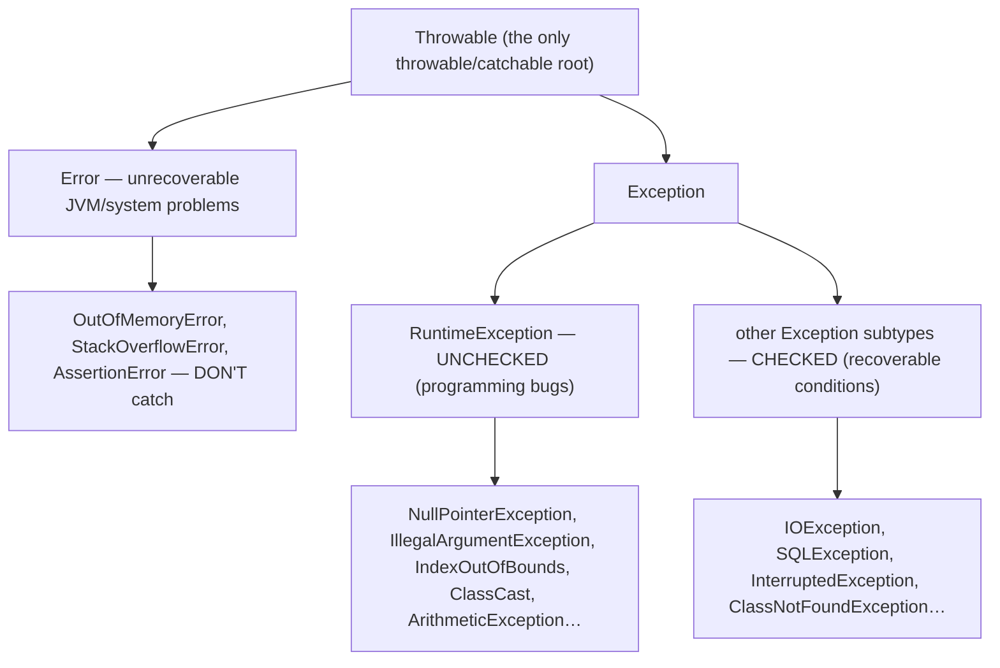
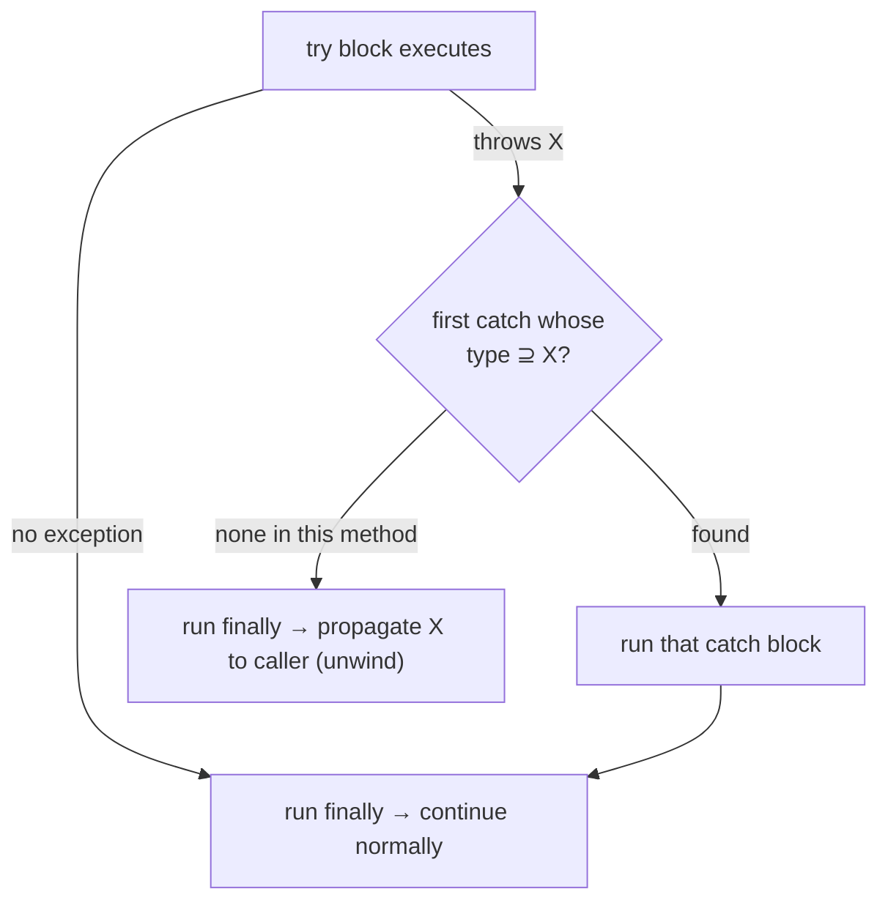
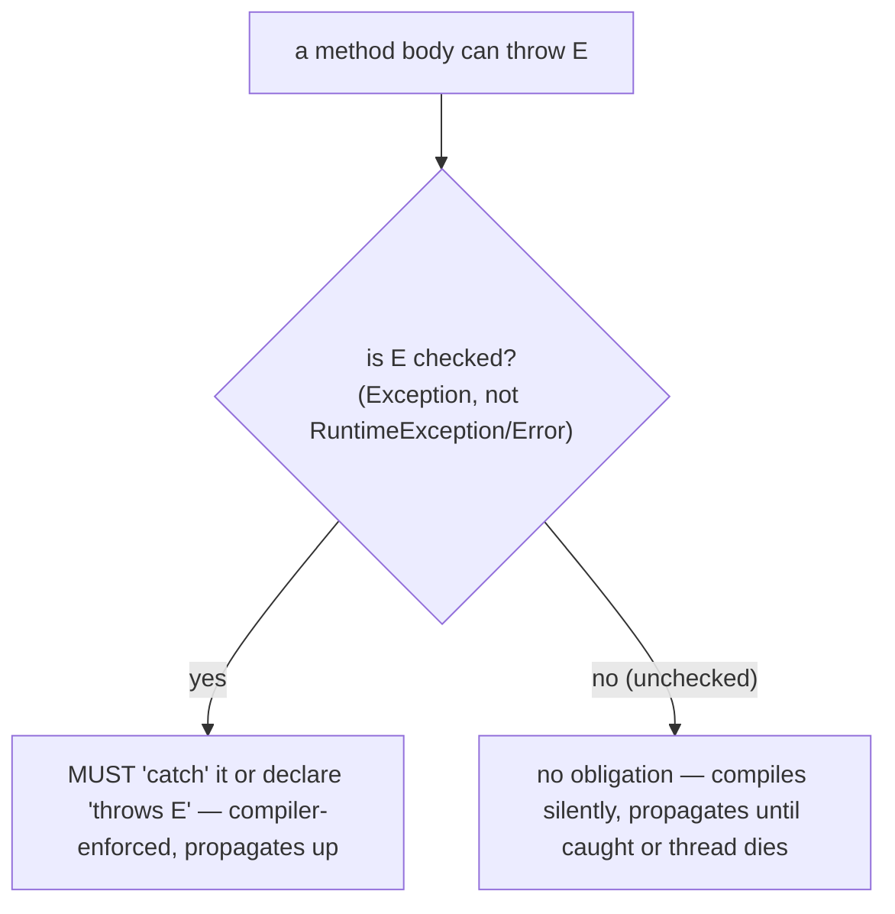
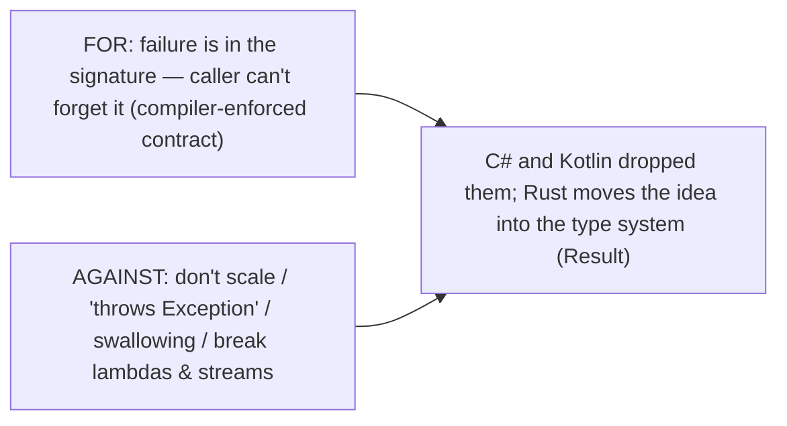
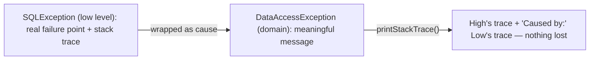
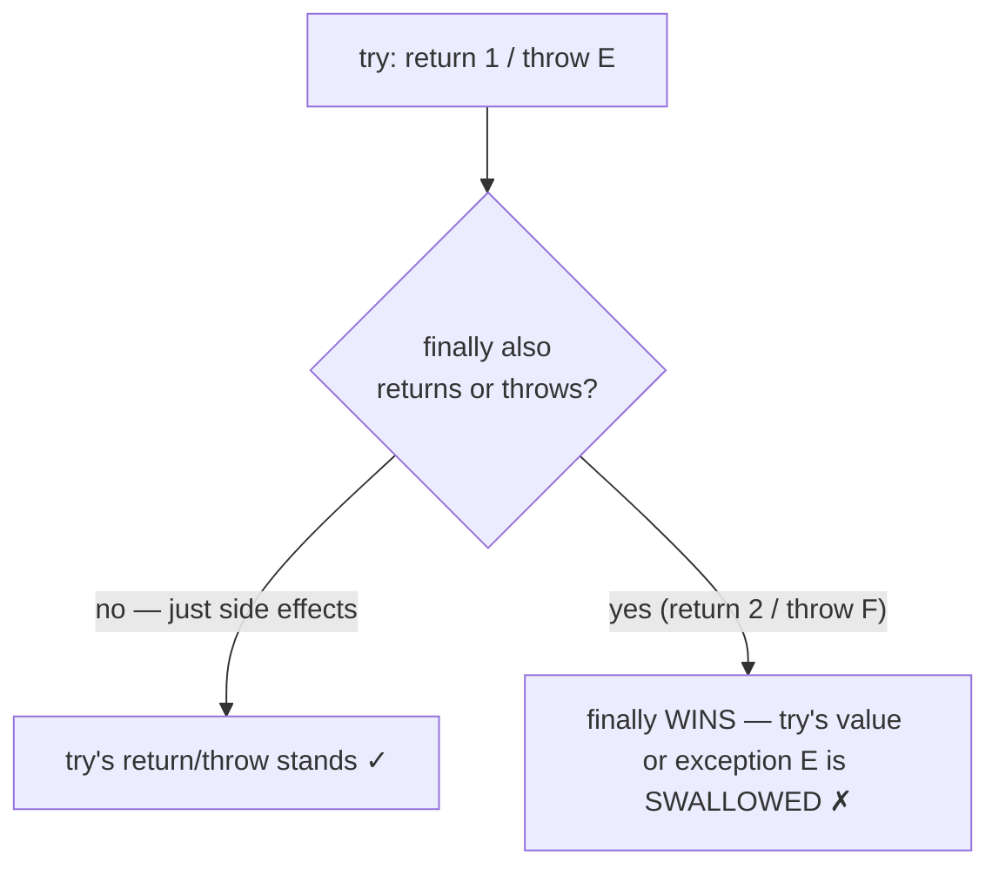
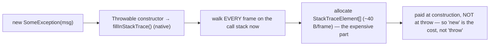
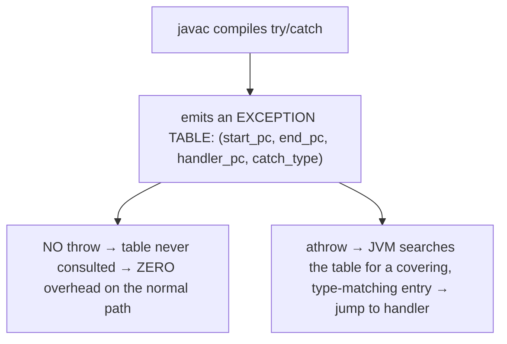
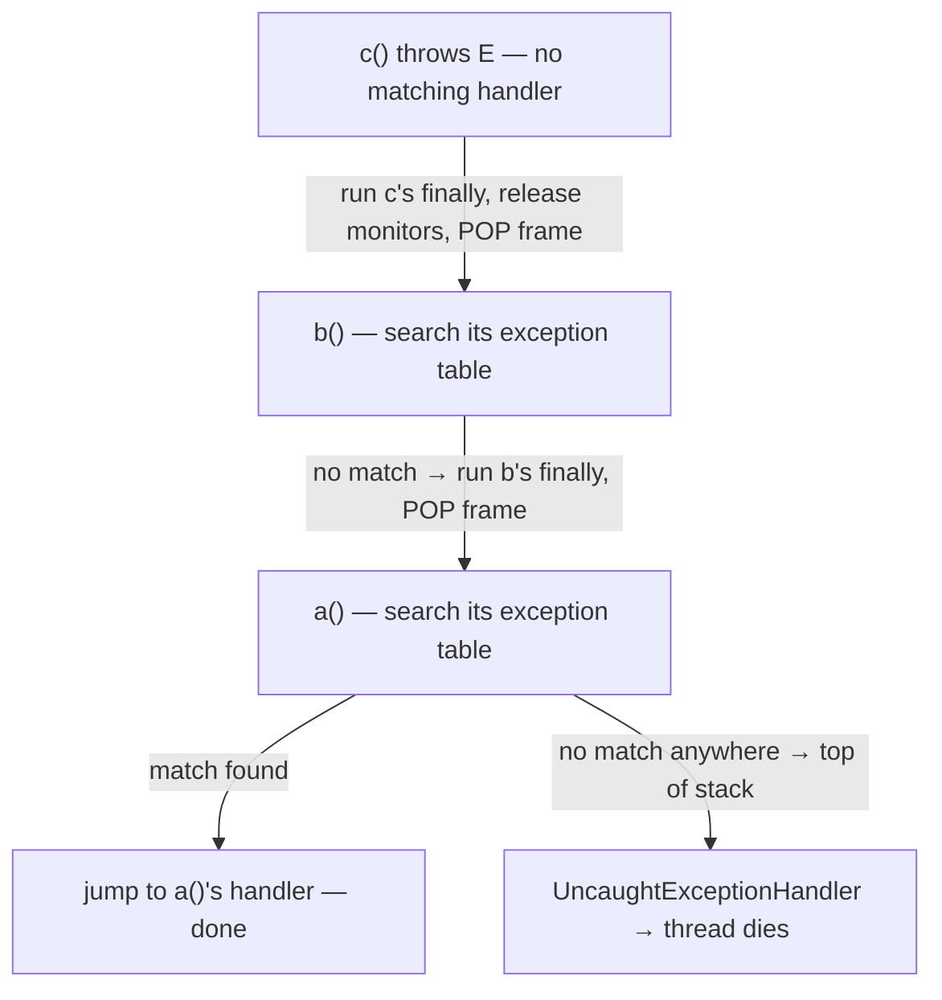
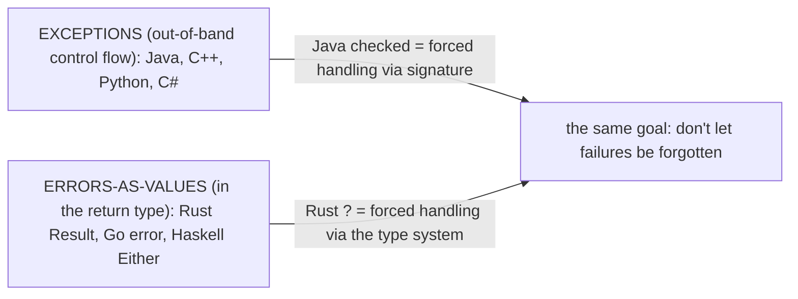

# Exceptions: try/catch/finally, checked vs unchecked

The chapter now turns from data structures to the **language facilities and core APIs** every program leans on, starting with the one that underlies all of them: **error handling**. You have already met exceptions thrown by the collections — `ConcurrentModificationException` from a fail-fast iterator ([T06](./T06-iterators-and-iterable.md)), `NoSuchElementException` from an empty queue ([T05](./T05-queue-deque-priorityqueue-stack.md)), `ClassCastException` from a missing comparator ([T07](./T07-comparable-vs-comparator.md)). This topic opens the mechanism itself: how a thrown exception transfers control, the `Throwable` hierarchy that classifies what went wrong, the `try`/`catch`/`finally` construct that handles it, and Java's distinctive — and controversial — split between **checked** exceptions (the compiler forces you to handle or declare them) and **unchecked** ones (it does not).

The depth bar is **what an exception physically costs and why**. An exception is an object, and the surprising fact is that *throwing and catching are cheap while constructing is expensive*: the `Throwable` constructor calls the native `fillInStackTrace()`, which walks the entire call stack and allocates a `StackTraceElement[]` — microseconds for a deep stack. The `try` block itself, by contrast, is **free on the happy path**: `try`/`catch` compiles to an **exception table** in the bytecode that the JVM consults *only when an exception is actually thrown*, so a `try` that never throws adds zero instructions to the normal flow ("zero-cost try"). Those two facts explain the central rule — exceptions are for *exceptional* conditions, never for control flow — and why HotSpot has a "fast throw" optimization that strips stack traces from hot implicit exceptions. By the end you will read the `Throwable` hierarchy fluently, use `try`/`catch`/`finally` and multi-catch correctly, avoid the `return`-in-`finally` trap that silently swallows exceptions, chain a low-level cause into a domain exception without losing its stack trace, and explain why Rust's `Result` type is widely seen as the checked-exception idea done right.

> [!NOTE]
> Prerequisites: [Object class](../C01-oop/T09-object-class-and-its-methods.md) (`L1/C01/T09`) — an exception is an ordinary object with a header and fields; [Inheritance](../C01-oop/T04-inheritance-and-super.md) (`L1/C01/T04`) — the `Throwable` hierarchy and `catch` matching by supertype; [Interfaces](../C01-oop/T08-interfaces-default-static-private-methods.md) (`L1/C01/T08`) — checked exceptions and the lambda/functional-interface friction. Forward: [T10](./T10-custom-exceptions-and-try-with-resources.md) (writing your own exceptions + `try`-with-resources + suppressed exceptions), which continues directly from here.

## The `Throwable` Hierarchy

Only an instance of **`Throwable`** can be thrown or caught. Its hierarchy splits everything that can go wrong into two fundamentally different categories:



- **`Error`** signals a problem so serious that a reasonable application should not try to handle it — the JVM is out of memory (`OutOfMemoryError`), the stack overflowed (`StackOverflowError`), a class failed to load (`NoClassDefFoundError`). These are **unchecked**. Don't catch them.
- **`Exception`** is the recoverable family, itself split in two:
  - **`RuntimeException`** and its subclasses are **unchecked** — they represent **programming errors** (a `null` dereference, a bad index, an illegal argument). The right fix is usually to *fix the bug*, not to catch.
  - **Every other `Exception`** is **checked** — `IOException`, `SQLException`, `InterruptedException` — representing **recoverable external conditions** (a file is missing, the network dropped) that a well-written caller should be forced to consider.

This three-way split — `Error` / unchecked `RuntimeException` / checked `Exception` — is the entire taxonomy, and which branch a type lives in determines whether the compiler polices it.

## `try` / `catch` / `finally` and Multi-Catch

The handling construct has three parts. The `try` block holds the risky code; `catch` blocks handle specific `Throwable` types; the optional `finally` block runs no matter what:

```java
try {
    var data = readFile(path);        // may throw IOException
    process(data);                    // may throw a RuntimeException
} catch (IOException e) {              // checked — most specific first
    log.error("read failed", e);
} catch (RuntimeException e) {         // unchecked
    log.error("processing bug", e);
} finally {
    releaseLock();                     // ALWAYS runs (see semantics below)
}
```

`catch` blocks are tested **top to bottom**, and the **first matching type wins** — so a more specific type must precede a more general one, or the compiler rejects the unreachable later block. When two `catch` blocks would do the same thing, **multi-catch** collapses them; the caught variable is **effectively final** and typed as the common supertype:

```java
try { risky(); }
catch (IOException | SQLException e) {     // one handler for both
    log.error("io or db failure", e);      // e cannot be reassigned
}
```



## Checked vs Unchecked — The Compiler's Rule

The practical difference is a **compile-time rule** that applies only to checked exceptions: **"catch or declare."** If a method can throw a checked exception, it must either handle it (`try`/`catch`) or announce it in its signature (`throws`), and that obligation propagates up the call chain until someone handles it. Unchecked exceptions carry no such obligation.

```java
// CHECKED — won't compile unless you catch or declare:
void load() throws IOException {        // declared → callers must handle/declare too
    Files.readString(path);              // throws checked IOException
}

// UNCHECKED — compiles with no annotation:
int parse(String s) {
    return Integer.parseInt(s);          // throws unchecked NumberFormatException — no 'throws' needed
}
```



The design intent (Bloch, *Effective Java* Item 70): **use checked exceptions for recoverable conditions and unchecked (runtime) exceptions for programming errors**. A missing file is recoverable → checked; a `null` argument is a bug → unchecked. In practice many modern Java codebases lean heavily on unchecked exceptions (and frameworks like Spring wrap checked ones) for reasons the next section unpacks.

## The Great Checked-Exception Debate

Checked exceptions are **Java's unique experiment** — no other mainstream language enforces them at compile time, and the industry's verdict has been mixed-to-negative. Knowing both sides is interview-relevant and design-relevant.

**The case for:** a checked exception puts the failure mode *in the method's signature*. The caller cannot forget that `readFile` may fail — the compiler insists they handle or propagate it. The set of failures becomes part of the documented contract, not a runtime surprise.

**The case against** (Anders Hejlsberg, who omitted them from C#; Bruce Eckel; and the Kotlin designers, who also omitted them):

- **They don't scale.** As code composes, `throws` clauses accumulate; developers widen them to `throws Exception`, which throws away all the information the feature was supposed to provide.
- **They encourage swallowing.** The path of least resistance to silence the compiler is an empty `catch` block — the single worst thing you can do with an exception, and checked exceptions actively nudge you toward it.
- **They break with lambdas and streams.** A `Function<T,R>` ([T08](../C01-oop/T08-interfaces-default-static-private-methods.md)) cannot throw a checked exception, so any checked exception inside a `stream().map(...)` must be caught and wrapped right there — boilerplate that a language without checked exceptions never needs.



The honest summary: checked exceptions were a well-intentioned attempt to make failure a first-class part of an API's contract, judged by most of the industry as a net negative for large codebases — *but the underlying idea is sound*, and Rust's `Result` type (cross-language section) realizes it without the drawbacks.

## Exception Chaining — Preserving the Cause

When you catch a low-level exception and throw a more meaningful one, **wrap the original as the cause** so its stack trace is not lost (*Effective Java* Item 73: throw exceptions appropriate to the abstraction):

```java
try {
    return jdbc.query(sql);
} catch (SQLException e) {
    throw new DataAccessException("Could not load user " + id, e);   // 'e' becomes the cause
}
```

The `Throwable(String, Throwable)` constructor (or `initCause`) stores the cause; `getCause()` retrieves it; and `printStackTrace()` renders it as a **"Caused by:"** section showing both stack traces. This translates the exception to the right abstraction level (callers of a data-access layer should not see raw `SQLException`s) **without discarding the diagnostic trail** — the original failure point is still in the chained trace.



## `finally` Semantics and the `return`-in-`finally` Trap

A `finally` block **always runs** — whether the `try` completed normally, threw and was caught, or threw and is propagating uncaught (it runs *during* the unwind, before the exception leaves the method). The only escapes are `System.exit()` (the JVM terminates outright), a JVM crash, or an infinite loop / killed daemon thread.

That guarantee makes `finally` the classic place for cleanup — but it has a sharp edge:

> [!WARNING]
> **Never `return` or `throw` from a `finally` block.** A `finally` that returns or throws **overrides** whatever the `try`/`catch` was returning or throwing — including a pending exception, which is **silently swallowed**. `try { return 1; } finally { return 2; }` returns **2**; `try { throw new IllegalStateException(); } finally { return 0; }` discards the exception entirely and returns **0**. The bug is invisible at the call site. Keep `finally` to side-effecting cleanup only — and prefer `try`-with-resources ([T10](./T10-custom-exceptions-and-try-with-resources.md)), which handles resource cleanup correctly and avoids the trap.



## Memory — An Exception Is an Object, and the Stack Trace Costs

A `Throwable` is an ordinary heap object ([T09-C01](../C01-oop/T09-object-class-and-its-methods.md)) with a handful of fields:

```java
public class Throwable {
    private String detailMessage;                 // the message — ref (4 B)
    private Throwable cause = this;                // chained cause; 'this' means "not yet set" — ref (4 B)
    private StackTraceElement[] stackTrace;        // the captured trace — ref (4 B)
    private List<Throwable> suppressedExceptions;  // try-with-resources (T10) — ref (4 B)
    // + a transient native 'backtrace' holding the raw stack snapshot
}
```

The expensive field is `stackTrace`, and the crucial fact is **when** it is filled: the `Throwable` **constructor** calls the native **`fillInStackTrace()`**, which walks the current thread's entire call stack and records every frame. So the cost is paid at **`new`-time, not throw-time** — `new IOException()` has already walked the stack even if you never throw it. Each frame becomes a `StackTraceElement` (declaring class, method, file name, line number — ~40 bytes each), so a 30-frame-deep stack materializes a ~1 KB array of trace objects.



## Architecture — Zero-Cost `try`, Expensive Construction, and Unwinding

Three mechanisms explain exception performance, and together they justify the "exceptions are not control flow" rule.

**The `try` block is free on the happy path.** When `javac` compiles `try`/`catch`, it does **not** emit per-instruction "am I inside a try?" checks. Instead it records an **exception table** in the method's `Code` attribute — a list of `(start_pc, end_pc, handler_pc, catch_type)` entries. The normal path runs the `try`-block bytecode with zero added instructions. **Only when an exception is actually thrown** does the JVM consult the table: find an entry whose bytecode range covers the throwing instruction and whose `catch_type` matches the thrown class, then jump to its handler. This is the **"zero-cost try"** model — you can wrap code in `try`/`catch` as liberally as you like without slowing the case where nothing throws.



**Throwing is cheap; constructing is expensive.** The `athrow` + table lookup + unwind is a controlled non-local jump — fast. The expense is the `fillInStackTrace()` walk done in the constructor (previous section). **This is the real reason "exceptions are slow"** — it is the stack capture, not the throw/catch. Hence two consequences:

- **Exceptions-as-control-flow is an anti-pattern** — a `try`/`catch` in a hot loop that throws every iteration pays the stack-walk cost each time. Use a boolean check or an `Optional` ([T19](./T19-optional.md)) instead.
- **HotSpot's "fast throw"**: for certain hot, repeatedly-thrown implicit exceptions (`NullPointerException`, `ArithmeticException`, …), after enough throws at the same site the JIT throws a **pre-allocated, stack-trace-less** instance — which is why production logs sometimes show an NPE *with no stack trace*. The flag **`-XX:-OmitStackTraceInFastThrow`** disables this to always capture traces (essential when debugging those traceless NPEs).

**Stack unwinding** is how propagation works: if the current method's exception table has no matching handler, the JVM **pops the frame** — running any `finally` blocks and releasing any `synchronized` monitors as it goes — then checks the *caller's* table, repeating up the stack until a handler is found or the top is reached (an uncaught exception → the thread's `UncaughtExceptionHandler`, then the thread dies). The `finally`-always-runs guarantee is implemented precisely by this unwind walk.



## Cross-Language Perspective

Error handling is where languages diverge most sharply — and Java's checked exceptions sit at one extreme:

| Language | Checked exceptions? | Cleanup mechanism | Recoverable-error model |
|---|---|---|---|
| **Java** | **yes** (unique) | `finally` / try-with-resources ([T10](./T10-custom-exceptions-and-try-with-resources.md)) | exceptions (checked + unchecked) |
| **C++** | no (specs removed in C++17) | **RAII** — destructors run on unwind | exceptions (zero-cost, table-based) |
| **Python** | no | `finally` / `with` | exceptions (idiomatic — **EAFP**) |
| **C#** | no (rejected deliberately) | `using` | exceptions |
| **Rust** | n/a | `Drop` (RAII) | **`Result<T,E>` + `?`**; `panic!` for bugs |
| **Go** | n/a | `defer` | explicit `error` returns; `panic`/`recover` |

Three deep contrasts. **C++** has the same zero-cost table-based exception model as the JVM but **no `finally`** — cleanup is automatic via **RAII** (a stack object's destructor runs deterministically during unwinding), and its `throw()` exception specifications were *removed* in C++17, the same retreat from compile-time exception declarations that Java's critics point to. **Python** treats exceptions as ordinary control flow — the **EAFP** style ("Easier to Ask Forgiveness than Permission") deliberately *tries* and catches rather than checking first, and `StopIteration` even drives iteration ([T06](./T06-iterators-and-iterable.md)). **Rust** abolishes exceptions for recoverable errors entirely: a fallible function returns **`Result<T, E>`** (an `Ok`/`Err` enum), and the **`?` operator** propagates an `Err` up with one character — the ergonomics of checked exceptions, but the error is a **value in the return type**, visible in the signature, composable through generics and closures (no lambda-leakage problem), and impossible to silently ignore. `panic!` is reserved for unrecoverable bugs (like an `Error`). Rust's `Result` is widely regarded as **"checked exceptions done right"** — it achieves the original goal (failure is part of the contract, the caller must deal with it) without the drawbacks that sank Java's version. Go takes the explicit route: errors are ordinary return values checked with `if err != nil`, verbose but impossible to overlook.



## Common Mistakes

> [!WARNING]
> **Swallowing exceptions.** An empty `catch (Exception e) {}` discards the failure and its diagnostics — the single worst exception anti-pattern. At minimum log it with its stack trace; better, handle or rethrow it.

> [!WARNING]
> **Catching too broadly.** `catch (Throwable t)` or `catch (Exception e)` around a wide block hides bugs and catches things you cannot handle (`OutOfMemoryError`, `NullPointerException`). Catch the **narrowest** type you can actually recover from.

> [!WARNING]
> **`return`/`throw` in `finally`.** It overrides — and silently swallows — any pending return value or exception from the `try`/`catch`. Keep `finally` to side effects only.

> [!WARNING]
> **Losing the cause.** `throw new MyException("failed")` inside a `catch` without passing the caught exception as the cause discards the original stack trace. Always chain: `throw new MyException("failed", e)`.

> [!WARNING]
> **Exceptions for control flow.** Catching `NumberFormatException` to test whether a string is a number (instead of validating) pays the `fillInStackTrace` cost on every non-number and obscures intent. Use a check, an `Optional`, or a `tryParse`-style API.

> [!WARNING]
> **Catch-log-rethrow at every level.** Logging an exception and rethrowing it at each layer produces the same stack trace many times in the log. Log **once**, at the boundary where you handle it; otherwise just let it propagate.

## Practice

> [!INTERVIEW]
> Common interview questions for this topic:
> 1. **Checked vs unchecked exceptions?** Checked = compiler-enforced "catch or declare" (`Exception` minus `RuntimeException`); unchecked = `RuntimeException` + `Error`, no enforcement.
> 2. **The `Throwable` hierarchy?** `Throwable` → `Error` (unrecoverable, don't catch) + `Exception` → `RuntimeException` (unchecked / bugs) + other checked exceptions.
> 3. **When use checked vs unchecked?** Checked for recoverable external conditions the caller should handle; unchecked for programming errors (EJ Item 70).
> 4. **What does `finally` guarantee?** It always runs except on `System.exit`/JVM death — used for cleanup (superseded by try-with-resources for resources, T10).
> 5. **The `return`-in-`finally` trap?** A `return`/`throw` in `finally` overrides the `try`/`catch` and silently swallows a pending exception — never do it.
> 6. **Multi-catch?** `catch (A | B e)` — one handler for several types; `e` is effectively final, typed as the common supertype.
> 7. **Exception chaining and why?** Wrap a low-level cause in a domain exception (cause constructor / `initCause`) to translate the abstraction without losing the stack trace; `getCause` / "Caused by:".
> 8. **Are exceptions expensive?** Throwing/catching is cheap; *constructing* is expensive because `fillInStackTrace` walks the stack — so exceptions-as-control-flow is the anti-pattern.
> 9. **What is the zero-cost try?** `try`/`catch` compiles to an exception table consulted only on a throw, so the happy path has zero overhead.
> 10. **Why do some production NPEs have no stack trace?** HotSpot "fast throw" reuses a pre-allocated traceless exception for hot implicit throws; `-XX:-OmitStackTraceInFastThrow` restores traces.
> 11. **The checked-exception debate?** Pro: failure is in the signature; con: doesn't scale, encourages swallowing, breaks lambdas/streams — C#/Kotlin dropped them.
> 12. **How does Rust handle recoverable errors?** `Result<T,E>` + `?` — errors as values in the return type, the checked-exception idea without the drawbacks.
> 13. **Risk of `catch (Throwable)`?** It catches `Error`s (e.g. `OutOfMemoryError`) you cannot handle; catch the narrowest type you can recover from.

1. **Map the hierarchy.** Write out `Error`, `Exception`, and `RuntimeException` with two real examples each, and label which are checked vs unchecked.

2. **Catch or declare.** Write a method calling `Files.readString` (checked `IOException`); show it won't compile until you `catch` or add `throws`. Then call `Integer.parseInt` (unchecked) and confirm no annotation is needed.

3. **Multi-catch.** Combine two `catch` blocks that handle `IOException` and `SQLException` identically into one multi-catch; confirm the variable is effectively final (try to reassign it → compile error).

4. **Catch order.** Put `catch (Exception e)` before `catch (IOException e)`; observe the "unreachable catch block" compile error; fix the order.

5. **`finally` always runs.** Print from `finally` in three scenarios: a normal return from `try`, a caught exception, and an uncaught exception propagating out. Confirm it runs in all three.

6. **The `return`-in-`finally` trap.** Verify `try { return 1; } finally { return 2; }` returns 2, and `try { throw new RuntimeException(); } finally { return 0; }` swallows the exception and returns 0. Explain why this is dangerous.

7. **Exception chaining.** Catch an `SQLException` (or any low-level exception), wrap it in a custom domain exception with the cause, and print the stack trace; identify the "Caused by:" section and call `getCause()`.

8. **Measure construction cost.** Benchmark throwing-and-catching a normal exception in a tight loop vs a custom exception that overrides `fillInStackTrace()` to return `this` (skipping the walk). Quantify how much of the cost is the stack capture.

9. **Zero-cost try.** Benchmark a loop body wrapped in a `try`/`catch` that never throws vs the same body without the `try`. Confirm no measurable difference, and explain via the exception table.

10. **Fast throw.** In a loop, repeatedly trigger an NPE at the same line; after warmup, observe the stack trace become empty (HotSpot fast throw). Re-run with `-XX:-OmitStackTraceInFastThrow` and confirm the trace returns.

11. **Stack unwinding + `finally` order.** Nest three methods each with a `try`/`finally`; throw from the innermost; print in each `finally` and confirm they run innermost-first during the unwind.

12. **Appropriate type.** Take a failure (e.g. "config value missing") and implement it once as a checked exception and once as an unchecked one; argue which is appropriate and how it changes the callers.

13. **Result vs exception (cross-language).** Sketch (in Java pseudocode or Rust) a fallible operation as an exception-throwing method and as a `Result`-returning function; discuss the lambda/stream difference.

14. **No swallowing.** Take a code snippet with an empty `catch` block; show the failure it hides; rewrite it three ways (log, handle, rethrow-wrapped) and discuss when each is right.

15. **End-to-end explain-it-back.** Trace `throw new IOException("disk full")` from a method three frames deep: (a) what the constructor does (`fillInStackTrace` walks the stack, allocates the `StackTraceElement[]`) and *when*; (b) what `athrow` does; (c) how the JVM searches each frame's exception table during unwinding and runs `finally` blocks; (d) what happens if no handler is found; (e) why the surrounding `try` blocks that did *not* match cost nothing on the happy path. Twelve sentences max.

## Recap

You should now be able to:

**Language layer.**

- Read the `Throwable` hierarchy (`Error` / `RuntimeException`-unchecked / other-`Exception`-checked) and know which branch to catch and which to let propagate.
- Use `try`/`catch`/`finally` with correct (most-specific-first) catch order and multi-catch, and state the "catch or declare" rule for checked exceptions.
- Chain a cause to translate an exception to the right abstraction without losing its stack trace, and avoid the `return`-in-`finally` trap.
- Argue both sides of the checked-exception debate and state Bloch's recoverable-vs-programming-error guideline.

**Memory layer.**

- Describe a `Throwable` as an object (message, cause, `stackTrace`, suppressed list) whose `StackTraceElement[]` is captured by `fillInStackTrace()` at **construction**, ~40 bytes per frame.

**Architecture layer.**

- Explain the **zero-cost try**: `try`/`catch` compiles to an exception table consulted only on a throw, so the happy path is free.
- Explain why **throwing is cheap but constructing is expensive** (the `fillInStackTrace` stack walk), why that makes exceptions-as-control-flow an anti-pattern, and what HotSpot "fast throw" / `-XX:-OmitStackTraceInFastThrow` do.
- Describe stack unwinding (pop frames, run `finally`/release monitors, search each caller's table) and place Java's checked exceptions against C++ RAII, Python EAFP, C# `using`, and Rust's `Result`/`?`.

The next topic completes the error-handling foundation: [T10](./T10-custom-exceptions-and-try-with-resources.md) — designing your own exception types and the `try`-with-resources statement that makes resource cleanup leak-proof (and finally retires the `finally`-block-for-cleanup pattern, with the suppressed-exceptions machinery that supports it).

## Next

Continue to [Custom exceptions & try-with-resources](./T10-custom-exceptions-and-try-with-resources.md) — the practical other half of error handling. T09 covered the mechanism; T10 covers using it well: when (and how) to define your own exception class versus reusing a standard one (`IllegalArgumentException`, `IllegalStateException`), the `AutoCloseable`/`Closeable` interface and the `try`-with-resources statement that closes resources automatically in reverse order of acquisition, the **suppressed-exceptions** mechanism that solves the classic "exception in `finally` masks the real exception" bug, and why `try`-with-resources is strictly better than the `try`/`finally`-close idiom this topic warned about.
