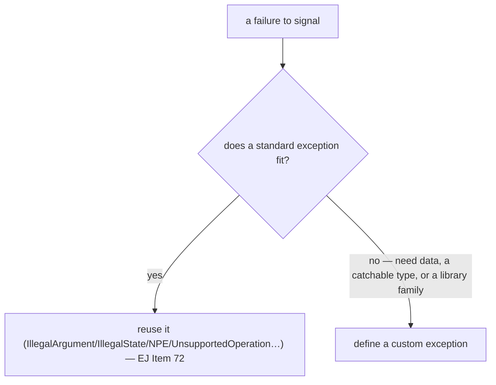
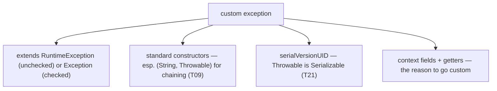
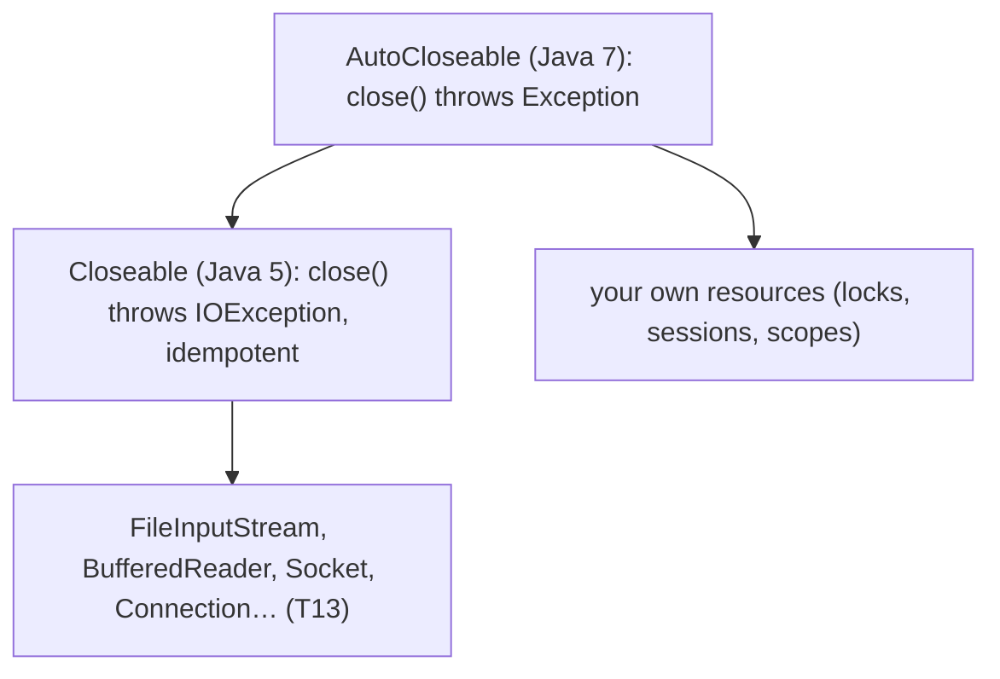
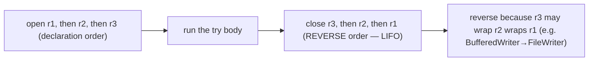
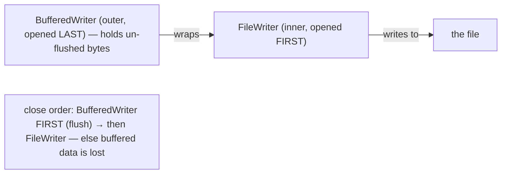
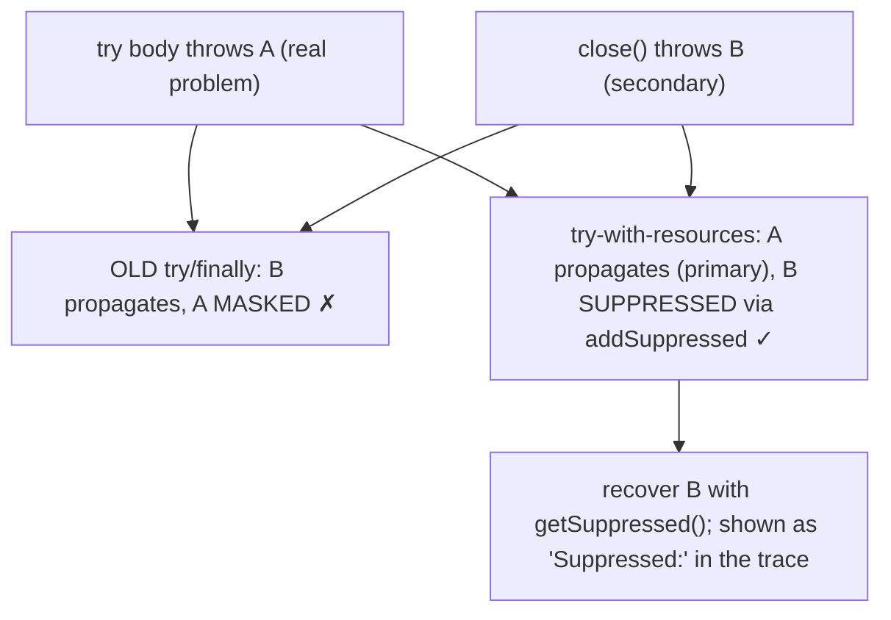
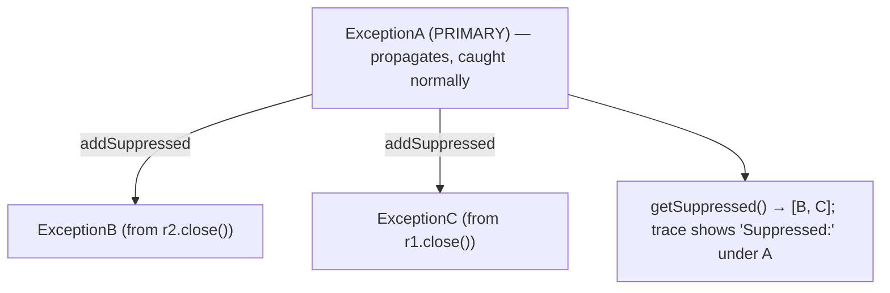
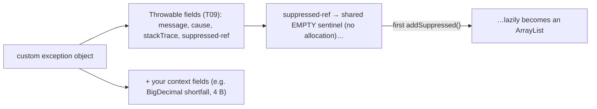
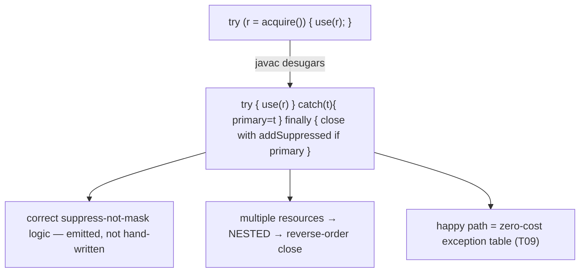
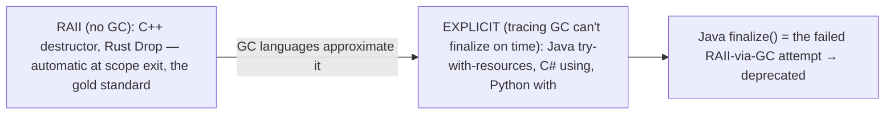

# Custom exceptions & try-with-resources

[T09](./T09-exceptions-try-catch-finally-checked-vs-unchecked.md) covered the exception *mechanism*; this topic covers using it *well*. Two practical halves complete the error-handling foundation. First, **designing exceptions**: when to reuse a standard type (`IllegalArgumentException`, `IllegalStateException`) versus define your own, and how to write a custom exception class correctly — the right supertype, the standard constructors, the context fields, the `serialVersionUID`. Second, **managing resources**: the `try`-with-resources statement that automatically closes files, sockets, and database connections — the construct that finally retires the leak-prone `try`/`finally`-close idiom T09 warned about, and with it the subtle "the exception in `finally` masked the real exception" bug that plagued Java for its first decade.

The depth bar is **the suppressed-exceptions machinery and the desugaring that powers it**. The old `try`/`finally`-close idiom had a vicious failure mode: if the body threw exception A (the real problem) and `close()` then threw exception B, B propagated and **A was lost** — you debugged the wrong failure. `try`-with-resources fixes this at the language level: the body's exception A stays **primary** and propagates, while `close()`'s exception B is **suppressed** — attached to A via `addSuppressed()` and retrievable with `getSuppressed()`. The compiler generates this correct close-and-suppress logic by **desugaring** `try`-with-resources into a precise `try`/`finally` with a primary-exception local — the error-prone idiom humans wrote wrong, now emitted correctly by `javac`. And it costs nothing on the happy path (the same zero-cost exception table from T09). By the end you will choose between standard and custom exceptions like a library author, write a leak-proof resource block, explain suppressed exceptions and the desugaring, and see why Java's `try`-with-resources is a garbage-collected language's approximation of C++/Rust **RAII**.

> [!NOTE]
> Prerequisites: [Exceptions](./T09-exceptions-try-catch-finally-checked-vs-unchecked.md) (`L1/C02/T09`) — the `Throwable` hierarchy, chaining, and the `finally`-masking bug this topic fixes; [Inheritance](../C01-oop/T04-inheritance-and-super.md) (`L1/C01/T04`) — a custom exception `extends` a `Throwable` subtype and calls `super(...)`; [Interfaces](../C01-oop/T08-interfaces-default-static-private-methods.md) (`L1/C01/T08`) — `AutoCloseable`/`Closeable` are interfaces. Forward: [T13](./T13-i-o-streams-byte-and-character.md) (I/O streams — the prime `try`-with-resources clients), [T21](./T21-serialization-and-deserialization.md) (why exceptions need `serialVersionUID`).

## Reuse a Standard Exception, or Define Your Own?

Before writing a new exception class, check whether the JDK already has the right one. *Effective Java* Item 72 — **favor standard exceptions** — lists the reusable types, and most failures fit one:

| Standard exception | Use when |
|---|---|
| `IllegalArgumentException` | a parameter value is inappropriate (and not specifically null/index) |
| `IllegalStateException` | the object's state is wrong for this call (e.g. not initialized) |
| `NullPointerException` | a `null` was passed where prohibited (use `Objects.requireNonNull`) |
| `IndexOutOfBoundsException` | an index is out of range |
| `UnsupportedOperationException` | the object doesn't support the operation (e.g. an immutable collection — [T19](../C01-oop/T19-immutability-and-immutable-class-design.md)) |
| `ConcurrentModificationException` | concurrent modification detected ([T06](./T06-iterators-and-iterable.md)) |

**Define a custom exception** only when a standard one doesn't fit — specifically when you need to **carry extra data** (the offending value, an error code), when **callers should catch your specific type** to handle it differently, or when you're building a library that wants a coherent exception family. Do *not* reinvent a standard type under a new name (a custom `InvalidParameterException` instead of `IllegalArgumentException` just makes your API harder to learn).



## Designing a Custom Exception

A custom exception is just a subclass of `RuntimeException` (unchecked) or `Exception` (checked). Get four things right:

```java
public class InsufficientFundsException extends RuntimeException {  // unchecked: caller usually can't recover
    private static final long serialVersionUID = 1L;               // (3) Throwable is Serializable
    private final BigDecimal shortfall;                            // (4) context data

    public InsufficientFundsException(String message, BigDecimal shortfall) {   // (1) standard ctors
        super(message);
        this.shortfall = shortfall;
    }
    public InsufficientFundsException(String message, Throwable cause) {        // (2) chaining ctor
        super(message, cause);
    }
    public BigDecimal getShortfall() { return shortfall; }
}
```

1. **Pick the supertype.** Extend `RuntimeException` for **unchecked** (the modern default — use it unless the caller can genuinely recover and *must* be forced to handle the failure), or `Exception` for **checked** ([T09](./T09-exceptions-try-catch-finally-checked-vs-unchecked.md)).
2. **Provide the standard constructors** that `Throwable` offers — `()`, `(String)`, `(String, Throwable)`, `(Throwable)` — at minimum `(String)` and **`(String, Throwable)`** so callers can **chain a cause** ([T09](./T09-exceptions-try-catch-finally-checked-vs-unchecked.md)). An exception with no cause-accepting constructor is a chaining dead end.
3. **Declare a `serialVersionUID`.** `Throwable implements Serializable`, so every exception is serializable; a `serialVersionUID` pins the version identity ([T21](./T21-serialization-and-deserialization.md)).
4. **Add context fields** (here, the `shortfall`) and accessors, so a handler can inspect *what specifically* went wrong — the main reason to define a custom type at all.



## `AutoCloseable` and `Closeable`

A resource that should be released — a file, socket, stream, lock, DB connection — implements one of two interfaces so `try`-with-resources can close it:

```java
public interface AutoCloseable {          // Java 7 — the try-with-resources interface
    void close() throws Exception;
}
public interface Closeable extends AutoCloseable {   // Java 5, retrofitted to extend AutoCloseable
    void close() throws IOException;       // narrower checked type; specified idempotent
}
```

**`AutoCloseable`** (Java 7) is the general interface; its `close()` may throw the broad `Exception`. **`Closeable`** (from Java 5, predating `try`-with-resources) extends it, narrows `close()` to throw `IOException`, and is specified to be **idempotent** — closing an already-closed `Closeable` has no effect. Almost every JDK I/O type ([T13](./T13-i-o-streams-byte-and-character.md)) implements `Closeable`; implement `AutoCloseable` for your own resources.



## `try`-with-resources

A resource declared in the `try` **header** is closed automatically when the block exits — normally *or* via an exception — with no `finally` block:

```java
try (var in  = new FileInputStream(src);     // resource 1
     var out = new FileOutputStream(dst)) {   // resource 2
    in.transferTo(out);
}   // automatic: out.close() THEN in.close() — reverse order, even if transferTo threw
```

Three rules:

- **Automatic close, always.** Whether the body finishes normally or throws, every declared resource is closed. No leak path.
- **Reverse order of declaration.** Resources close **last-opened-first** (LIFO), because later resources commonly *wrap* earlier ones — a `BufferedWriter` over a `FileWriter` must flush and close before the underlying `FileWriter` does, or buffered data is lost.
- **Effectively-final variables (Java 9+).** You may list an already-declared *effectively final* variable in the header: `try (existingResource) { ... }` — no need to re-declare.



The reverse order is not cosmetic — it respects the **wrapping dependency**. A buffered writer holds bytes the underlying file writer hasn't seen yet; closing the outer one first flushes those bytes *down* before the inner one shuts the file:



## Suppressed Exceptions — The Bug `try`-with-resources Fixes

Here is the payoff, and the reason `try`-with-resources is strictly better than the old idiom. Consider the pre-Java-7 pattern:

```java
FileInputStream in = new FileInputStream(f);
try {
    process(in);     // throws ExceptionA — the REAL failure
} finally {
    in.close();      // close() ALSO throws ExceptionB
}
// ExceptionB propagates; ExceptionA is LOST — you debug the wrong exception
```

Because `finally`'s exception overrides the body's ([T09](./T09-exceptions-try-catch-finally-checked-vs-unchecked.md) — the `finally` trap), the *secondary* failure from `close()` masks the *primary* one from the body. `try`-with-resources inverts this correctly: the **body's exception A is primary** and propagates, and `close()`'s exception B is **suppressed** — attached to A via `addSuppressed(B)` rather than replacing it. You retrieve suppressed exceptions with `getSuppressed()`, and they print under a **"Suppressed:"** heading in the stack trace.



The `Throwable` suppression API is small: `addSuppressed(Throwable)` attaches a secondary, `getSuppressed()` returns the array. (If *only* `close()` throws and the body succeeds, that exception is not suppressed — it simply propagates as the primary.)



## Memory — A Custom Exception and the Lazy Suppressed List

A custom exception's memory is the `Throwable` layout from [T09](./T09-exceptions-try-catch-finally-checked-vs-unchecked.md) (header + `detailMessage` + `cause` + `stackTrace` + `suppressedExceptions`) **plus your context fields** — `InsufficientFundsException` adds one `BigDecimal` reference (4 bytes, compressed). The `serialVersionUID` is `static final` — class metadata, **not** per-instance, so it adds zero bytes to each object.

The **`suppressedExceptions` list is lazily allocated**: it starts as a shared sentinel (a single immutable empty list constant reused by every `Throwable`), and only when `addSuppressed()` is first called does it become a real `ArrayList`. So the overwhelmingly common case — no suppression — costs **no extra allocation**; you pay for the list only when a `close()` actually throws alongside a body exception. The resource variables themselves (`in`, `out`) are ordinary locals on the stack frame ([T09](./T09-exceptions-try-catch-finally-checked-vs-unchecked.md)/L0), not heap state.



## Architecture — The Desugaring That Gets It Right

`try`-with-resources is **syntactic sugar**: the compiler rewrites it into the exact `try`/`finally` that a careful human *would* write — including the close-and-suppress logic almost everyone got wrong by hand. A single-resource block desugars to roughly:

```java
Resource r = acquire();
Throwable primary = null;
try {
    use(r);
} catch (Throwable t) {
    primary = t;               // remember the body's exception
    throw t;
} finally {
    if (r != null) {
        if (primary != null) {
            try { r.close(); }
            catch (Throwable sup) { primary.addSuppressed(sup); }   // suppress, don't mask
        } else {
            r.close();         // body succeeded → close()'s exception (if any) propagates normally
        }
    }
}
```

This is the architectural point: **the language moved a subtle, error-prone idiom into the compiler.** Two more facts follow. **Zero-cost on the happy path** — it compiles to the same exception-table mechanism as any `try`/`catch` ([T09](./T09-exceptions-try-catch-finally-checked-vs-unchecked.md)), so when nothing throws there is no overhead beyond the `close()` call itself. **Multiple resources desugar by nesting** — each resource becomes its own nested `try`-with-resources, which is exactly why closing happens in **reverse order** (the innermost-declared `finally` runs first). `close()` is invoked through the `AutoCloseable` interface (`invokeinterface` — [T06](./T06-iterators-and-iterable.md)), and if acquiring a resource throws, it was never assigned, so the `!= null` guard ensures there is nothing to close.



## Cross-Language Perspective — RAII and Its Approximations

Every language needs deterministic resource cleanup; the mechanism splits cleanly by memory model:

| Language | Construct | Mechanism |
|---|---|---|
| **Java** | `try`-with-resources / `AutoCloseable` | explicit, scope-bound; suppressed exceptions |
| **C++** | (none needed) — **RAII** | destructor runs automatically on scope exit / unwind |
| **Python** | `with` + context manager | `__enter__` / `__exit__` (can suppress) |
| **C#** | `using` / `IDisposable` | `Dispose()` at scope end (+ C# 8 `using` declarations) |
| **Rust** | (none needed) — **`Drop`** | `drop()` runs automatically on scope exit (RAII) |
| **Go** | `defer` | scheduled LIFO at function return |

The deep split is **RAII vs explicit cleanup**, and it follows from garbage collection. **C++ and Rust** have no tracing GC, so an object's lifetime is tied deterministically to its scope — a `std::lock_guard` or a Rust `File` releases its resource in its **destructor / `Drop`**, automatically, exactly when it goes out of scope (including during exception unwind). There is no `close()` to call and no `try`-with-resources to write — RAII *is* the cleanup, and it's the gold standard. **Java, C#, and Python have a tracing GC** that finalizes objects *whenever it pleases* ([T09](./T09-exceptions-try-catch-finally-checked-vs-unchecked.md)/L4), so they **cannot** rely on finalizers for timely resource release — Java's `finalize()` was exactly that failed attempt and is deprecated. Instead they add an **explicit, scope-bound construct** — `try`-with-resources, `using`, `with` — that pins cleanup to a lexical block. Java's `try`-with-resources is therefore best understood as **a GC language's approximation of RAII**: it recovers RAII's determinism (cleanup at scope exit, even on exception) at the cost of an explicit declaration. Go's `defer` is the same idea pinned to function scope rather than block scope.



## Common Mistakes

> [!WARNING]
> **Not using `try`-with-resources.** The manual `try`/`finally`-close idiom both leaks (if you forget `close()` on some path) and **masks** the real exception when `close()` throws ([T09](./T09-exceptions-try-catch-finally-checked-vs-unchecked.md)). Use `try`-with-resources for every `AutoCloseable`.

> [!WARNING]
> **Reinventing standard exceptions.** A custom `InvalidArgumentException` instead of `IllegalArgumentException` adds nothing and makes your API harder to learn. Favor standard exceptions (EJ Item 72); go custom only for data or a catchable type.

> [!WARNING]
> **A custom exception with no `(String, Throwable)` constructor.** Without a cause-accepting constructor, callers cannot chain — the original failure's stack trace is lost when they wrap it ([T09](./T09-exceptions-try-catch-finally-checked-vs-unchecked.md)).

> [!WARNING]
> **Expecting `getSuppressed()` to return the primary.** The body's exception is the one that *propagates* (catch it normally); `getSuppressed()` returns the **secondary** `close()` exceptions attached to it.

> [!WARNING]
> **A non-idempotent `Closeable.close()`.** `Closeable` specifies that closing an already-closed resource is a no-op. A `close()` that throws or corrupts on a second call violates the contract and breaks defensive double-close code.

> [!WARNING]
> **Overusing `Exception`/deep custom hierarchies.** A sprawling tree of custom exceptions nobody catches specifically is cost with no benefit. Add a custom type only when something will actually catch it or read its data.

## Practice

> [!INTERVIEW]
> Common interview questions for this topic:
> 1. **When define a custom exception vs reuse a standard one?** Reuse `IllegalArgumentException`/`IllegalStateException`/etc. where they fit (EJ Item 72); define custom only to carry data or expose a catchable type.
> 2. **What constructors should a custom exception provide?** The standard `Throwable` set — at least `(String)` and `(String, Throwable)` so callers can chain a cause.
> 3. **Why a `serialVersionUID` on an exception?** `Throwable` is `Serializable`, so the exception is too; the UID pins serialization version identity (T21).
> 4. **`AutoCloseable` vs `Closeable`?** `AutoCloseable` (Java 7, `close() throws Exception`) is the try-with-resources interface; `Closeable` extends it (`close() throws IOException`, idempotent), from Java 5.
> 5. **What does `try`-with-resources guarantee?** Every resource declared in the header is closed at block exit (normal or exceptional), in reverse order of declaration.
> 6. **Why reverse-order close?** Later resources often wrap earlier ones (BufferedWriter over FileWriter), so they must flush/close first.
> 7. **What problem do suppressed exceptions solve?** The old `try`/`finally` bug where a `close()` exception masked the real body exception; now the body exception is primary and `close()`'s is suppressed.
> 8. **How do you retrieve a suppressed exception?** `getSuppressed()`; it also appears under "Suppressed:" in the stack trace.
> 9. **What does `try`-with-resources desugar to?** A `try`/`finally` with a primary-exception local that calls `close()` and `addSuppressed()` if the body already threw.
> 10. **Can you use an existing variable as a resource?** Yes, since Java 9, if it is effectively final.
> 11. **Why can't Java use RAII like C++/Rust?** Its tracing GC finalizes non-deterministically, so cleanup can't ride on object destruction; `try`-with-resources ties it to scope explicitly.
> 12. **Checked or unchecked for a custom exception?** Unchecked by default; checked only if the caller can recover and should be forced to handle it.
> 13. **Is `close()` called if resource acquisition throws?** No — the variable was never assigned, and the desugared `!= null` guard skips the close.

1. **Reuse vs custom.** Take a class with a custom `InvalidAgeException` thrown for a negative argument; refactor it to `IllegalArgumentException`. Discuss when a custom type *would* be justified.

2. **Design a custom exception.** Write both a checked and an unchecked custom exception, each with all four standard constructors, a `serialVersionUID`, and one context field with a getter.

3. **Implement `AutoCloseable`.** Write a `Resource` that prints on construction and in `close()`; use it in `try`-with-resources; confirm `close()` runs after the body.

4. **Reverse-order close.** Open three `AutoCloseable`s in one `try` header, each printing its name on open and close; confirm they close last-opened-first.

5. **Close on exception.** Throw inside the body of a `try`-with-resources; confirm the resource still closes (print in `close()`), then the exception propagates.

6. **Reproduce the masking bug.** Write the old `try`/`finally` where the body throws A and `close()` throws B; confirm B propagates and A is lost.

7. **Suppression.** Rewrite exercise 6 with `try`-with-resources; confirm A propagates and `getSuppressed()` returns B. Print the stack trace and find the "Suppressed:" section.

8. **Effectively-final resource (Java 9).** Acquire a resource into a variable, then use that variable (not a new declaration) in the `try` header; confirm it closes.

9. **Idempotent close.** Implement `Closeable` and call `close()` twice; make the second call a safe no-op per the contract.

10. **Desugaring.** Compile a `try`-with-resources and use `javap -c` to find the generated `try`/`finally`, the primary-exception local, and the `addSuppressed` call.

11. **Context-carrying handler.** Throw your custom exception with a context value; in the `catch`, read the value via the getter and act on it (e.g. log the shortfall).

12. **Multiple resources, one throws on close.** Three resources where the middle one throws on `close()`; confirm the others still close and the throw is handled/suppressed appropriately.

13. **Custom exception serialization (preview).** Serialize and deserialize your custom exception ([T21](./T21-serialization-and-deserialization.md) preview); confirm the message and context field survive the round trip.

14. **Lightweight exception.** Use the four-arg `Throwable(message, cause, enableSuppression, writableStackTrace)` constructor to build an exception with no stack trace; relate to the `fillInStackTrace` cost from [T09](./T09-exceptions-try-catch-finally-checked-vs-unchecked.md).

15. **End-to-end explain-it-back.** For a `try (var r = open()) { use(r); }` where `use` throws A and `r.close()` throws B: (a) what the compiler desugars this into; (b) which exception is primary and which is suppressed, and how B attaches to A; (c) how you would recover B; (d) why resources close in reverse order; (e) why this is strictly better than the hand-written `try`/`finally` it replaces. Twelve sentences max.

## Recap

You should now be able to:

**Language layer.**

- Decide between reusing a standard exception (EJ Item 72) and defining a custom one, and design a custom exception with the right supertype, standard constructors (including the chaining `(String, Throwable)`), `serialVersionUID`, and context fields.
- Use `AutoCloseable`/`Closeable` and `try`-with-resources to close resources automatically, in reverse order, with no `finally`.
- Explain suppressed exceptions and how they fix the `finally`-masks-the-real-exception bug, and retrieve them with `getSuppressed()`.

**Memory layer.**

- Describe a custom exception's layout as the `Throwable` fields plus context fields, with `serialVersionUID` as class metadata (zero per-instance cost).
- Explain that the `suppressedExceptions` list is lazily allocated (a shared empty sentinel until the first `addSuppressed`), so the no-suppression case costs nothing.

**Architecture layer.**

- Explain that `try`-with-resources desugars to a `try`/`finally` with a primary-exception local and conditional `addSuppressed` — the correct idiom emitted by the compiler — with zero overhead on the happy path and reverse-order close via nesting.
- Place Java's `try`-with-resources as a garbage-collected language's approximation of C++/Rust **RAII**, contrast it with `using`/`with`/`defer`, and explain why a tracing GC can't do deterministic cleanup (the deprecated `finalize()` lesson).

This **completes the error-handling foundation** ([T09](./T09-exceptions-try-catch-finally-checked-vs-unchecked.md) mechanism + T10 practice): you can classify, throw, catch, chain, design, and clean up exceptions correctly. The chapter now turns to **generics** — the type-parameter system that makes the collections you've used since [T01](./T01-collections-framework-overview.md) type-safe — beginning with the fundamentals.

## Next

Continue to [Generics — basics](./T11-generics-basics.md) — the type-parameter system underneath every `List<String>`, `Map<K,V>`, and `Comparator<T>` you have used throughout this chapter. We have relied on angle-bracket type parameters since the [collections overview](./T01-collections-framework-overview.md) without opening them; T11 explains what `<T>` actually is — generic classes and methods, type parameters and type arguments, how generics deliver compile-time type safety (no more casting out of a raw `List`), the diamond operator, and the first glimpse of **type erasure** (the compile-time-only nature of generics that T12 then explores in full, with bounded types, wildcards, and the `List<Object>`-vs-`List<String>` invariance that surprises everyone).
