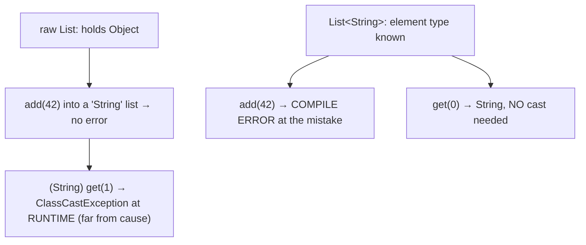
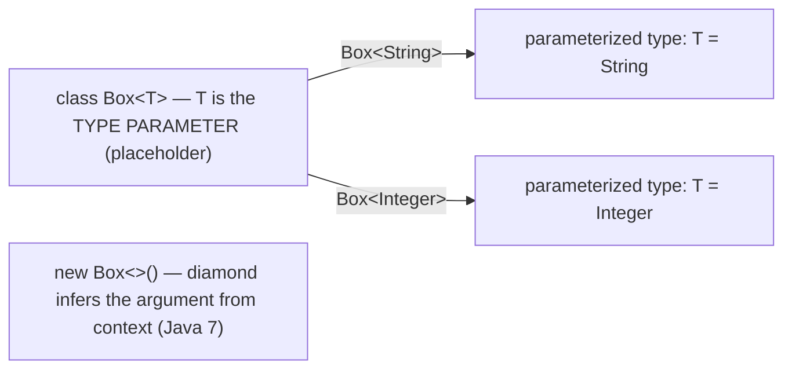
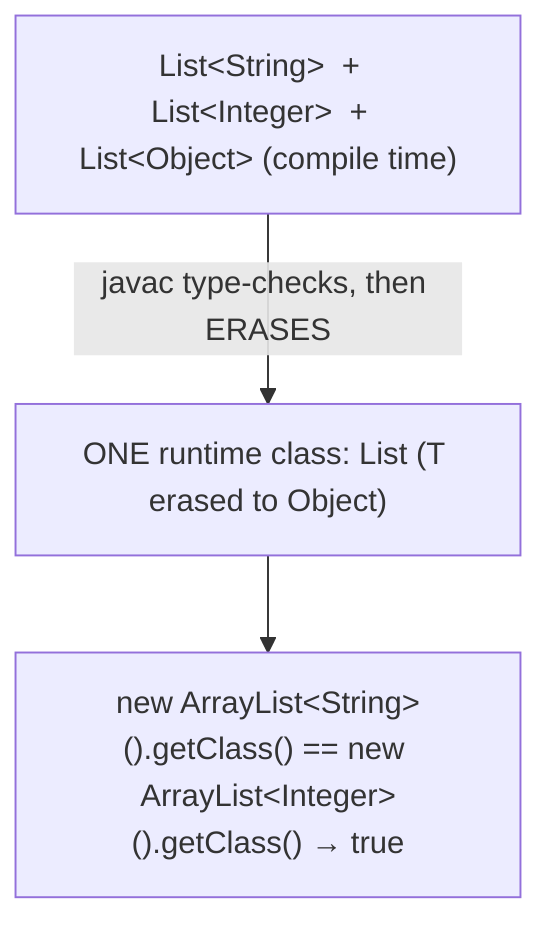
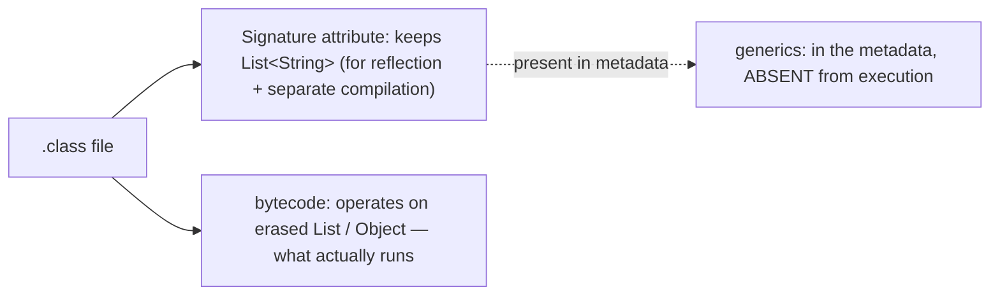
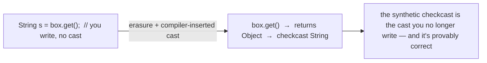
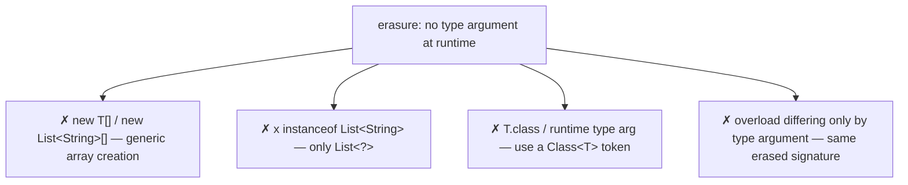
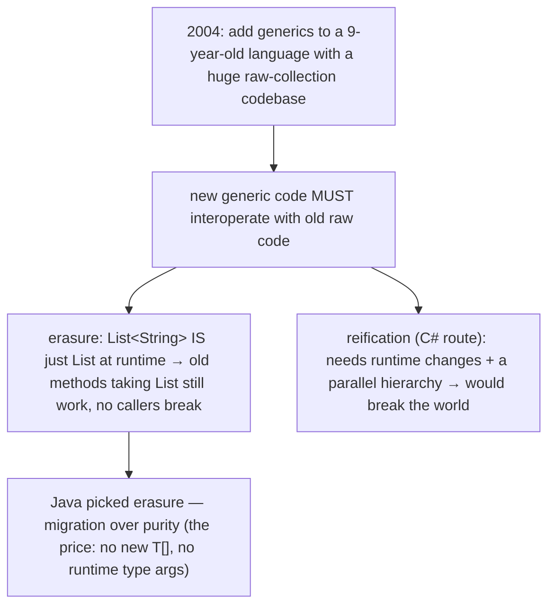
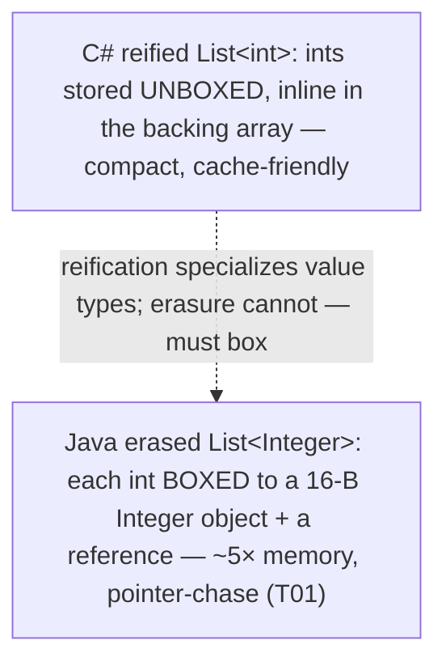
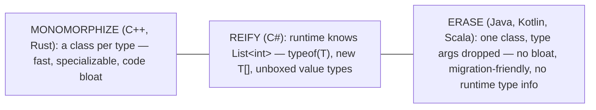

# Generics — basics

Every `List<String>`, `Map<K,V>`, and `Comparator<T>` you have used since the [collections overview](./T01-collections-framework-overview.md) relied on a feature we never opened: **generics**, the type-parameter system added in Java 5 (2004). This topic explains what those angle brackets actually are. Before generics, a collection held `Object`s — you cast every element on the way out and nothing stopped you from putting the *wrong* type in, so a type mistake surfaced as a `ClassCastException` at runtime, far from its cause. Generics fix both problems at once: a `List<String>` lets the compiler *know* the element type, so it removes the cast (you read a `String` directly) and rejects a wrong-type `add` at **compile time**. That is the whole pitch — **generics move type errors from runtime to compile time, and eliminate casts** — and it is why typed collections are one of the most consequential features in Java's history.

The depth bar is **type erasure**, the single most important — and most surprising — fact about Java generics. Generics are a **compile-time-only** construct: the compiler uses the type parameters to check your code, then *erases* them, replacing each with its bound (`Object` for an unbounded `<T>`) and inserting the casts you no longer write. The consequence is profound: at runtime there is exactly **one `List` class** — `List<String>` and `List<Integer>` are the *same* class, and `new ArrayList<String>().getClass() == new ArrayList<Integer>().getClass()` is `true`. This is the opposite of C++ templates and Rust generics, which *monomorphize* (a separate compiled class per type), and of C# generics, which are *reified* (the runtime knows `List<int>`). Erasure gives Java zero-cost, no-code-bloat generics but forbids `new T[]`, `instanceof List<String>`, and `T.class` — and Java chose it for one overriding reason: **migration compatibility** with the decade of pre-generics collection code that had to keep working. By the end you will write generic classes and methods, use the diamond operator, know why raw types are a trap, prove erasure with `getClass()`, and place Java on the erasure-vs-reification spectrum against C++, C#, Rust, and Kotlin.

> [!NOTE]
> Prerequisites: [Collections overview](./T01-collections-framework-overview.md) (`L1/C02/T01`) — the generic collections this explains; [Object class](../C01-oop/T09-object-class-and-its-methods.md) (`L1/C01/T09`) — what type parameters erase *to*; [Polymorphism](../C01-oop/T06-polymorphism-compile-time-vs-runtime.md) (`L1/C01/T06`) — generics are compile-time, dispatch is runtime; [Comparable/Comparator](./T07-comparable-vs-comparator.md) (`L1/C02/T07`) — `Comparable<T>`/`Comparator<T>` are generic interfaces. Forward: [T12](./T12-generics-bounded-types-wildcards-type-erasure.md) (bounded types, wildcards, PECS, erasure in depth, bridge methods) — the advanced half.

## The Problem Generics Solve

Before Java 5, collections were **raw** — they held `Object`, so every read needed a cast and every write was unchecked:

```java
// Pre-generics (raw) — the compiler cannot help:
List list = new ArrayList();
list.add("hello");
list.add(42);                          // no error — a String list silently gains an Integer
String s = (String) list.get(0);       // cast required on every read
String s2 = (String) list.get(1);      // ClassCastException at RUNTIME — far from the bad add
```

The bug (`add(42)`) and its symptom (the cast failing) are separated in space and time, which makes it hard to diagnose. Generics close the gap:

```java
// Generic — the compiler enforces the element type:
List<String> list = new ArrayList<>();
list.add("hello");
list.add(42);                          // COMPILE ERROR — caught immediately, at the mistake
String s = list.get(0);                // no cast — the compiler knows it's a String
```



So generics deliver **compile-time type safety** (wrong-type insertions are rejected) and **eliminate casts** (the compiler supplies them). Both benefits flow from the compiler *knowing* the type argument.

## Generic Classes

A **generic class** declares one or more **type parameters** in angle brackets after its name, then uses them like types inside the body:

```java
public class Box<T> {                    // T is a TYPE PARAMETER
    private T value;
    public void set(T value) { this.value = value; }
    public T get() { return value; }     // returns T — no cast for the caller
}

Box<String> b = new Box<>();             // String is the TYPE ARGUMENT; <> is the diamond
b.set("hi");
String s = b.get();                      // typed as String
```

Distinguish the two roles: the `<T>` in the *declaration* is the **type parameter** (a placeholder); the `<String>` at the *use site* is the **type argument** (the concrete type filling it). `Box<String>` and `Box<Integer>` are two **parameterized types** of the one generic type `Box`. The **diamond operator** `<>` (Java 7) lets you omit the argument on the right-hand side when the compiler can infer it from context — `new Box<>()` instead of `new Box<String>()`.



## Generic Methods and Type Inference

A **method** can declare its *own* type parameter, independent of any class type parameter, by putting it before the return type:

```java
public static <T> T firstOrNull(List<T> list) {       // <T> is the method's own type parameter
    return list.isEmpty() ? null : list.get(0);
}

String s = firstOrNull(List.of("a", "b"));            // T inferred as String from the argument
Integer i = firstOrNull(List.<Integer>of());          // explicit type witness (rare, when inference can't)
```

Usually **type inference** figures out the type argument from the call's arguments and target, so you rarely write it explicitly; when you must, the **type witness** syntax `Util.<String>method(...)` supplies it. Inference also powers the diamond (`new HashMap<>()`) and, since Java 10, `var`:

```java
Map<String, List<Integer>> m = new HashMap<>();   // diamond infers the right-hand type arguments
var list = new ArrayList<String>();                // var infers the left-hand type (ArrayList<String>)
```

```mermaid
flowchart LR
  GM["static &lt;T&gt; T firstOrNull(List&lt;T&gt; list)"]
  GM --> TP["&lt;T&gt; before return type = the method's type parameter"]
  GM --> Inf["call firstOrNull(List.of(\"a\")) → T inferred = String"]
  GM --> Wit["explicit witness: Util.&lt;Integer&gt;firstOrNull(...) when inference fails"]
```

Multiple type parameters use a comma list — `Map<K,V>`, `Pair<A,B>`, `Function<T,R>` — and Java's **naming convention** keeps them readable: `T` (type), `E` (element, in collections), `K`/`V` (key/value), `N` (number), `R` (return), and `S`/`U` for additional types.

## Raw Types — A Backward-Compatibility Trap

A generic type used **without** type arguments is a **raw type** — `List` instead of `List<String>`. Raw types exist *only* so pre-generics code keeps compiling; using one **disables generic type checking** and earns an "unchecked" warning:

```java
List raw = new ArrayList();    // raw type — no element type
raw.add("x");
raw.add(1);                    // unchecked: no type safety, exactly the old problem
List<String> g = raw;          // unchecked warning — "heap pollution" risk
```

Never use raw types in new code (*Effective Java* Item 26). They throw away the entire benefit of generics and reintroduce runtime `ClassCastException`s. If you want to accept "a list of anything," use the **unbounded wildcard** `List<?>` ([T12](./T12-generics-bounded-types-wildcards-type-erasure.md)), which keeps type safety, not the raw `List`.

## Memory — Type Erasure

Here is the defining fact. Generics are a **compile-time** mechanism: `javac` uses the type parameters to type-check your code, then **erases** them — replacing each type parameter with its **bound** (`Object` for an unbounded `<T>`, the leftmost bound for a bounded one — [T12](./T12-generics-bounded-types-wildcards-type-erasure.md)) and inserting casts. After compilation, the type arguments are **gone**:

```java
// You write:                          // After erasure, the bytecode is effectively:
class Box<T> { T value;                class Box   { Object value;
  T get() { return value; } }            Object get() { return value; } }
```

The runtime consequence: **`List<String>`, `List<Integer>`, and `List<Object>` are all the same class — `List`.** There is exactly one `List` class loaded, not one per parameterization. You can prove it:

```java
List<String>  a = new ArrayList<>();
List<Integer> b = new ArrayList<>();
a.getClass() == b.getClass();   // TRUE — both are just ArrayList at runtime
```



A generic instance carries **zero extra memory** for its type argument — a `List<String>` object is byte-identical to a raw `List` object; the `<String>` lives only in the compiler and the class-file metadata, never in the instance. The `.class` file *does* retain the generic types in a **`Signature` attribute** (so reflection and separate compilation can recover the declared generics — e.g. `Method.getGenericReturnType()`), but the executable **bytecode** operates on the erased types.



## Architecture — Zero-Cost, No Bloat, and the Price of Erasure

**Erasure makes generics free at runtime.** Because `Box<String>` erases to `Box` returning `Object`, a `String s = box.get()` compiles to `box.get()` plus a single **synthetic `checkcast String`** — the very cast you used to write by hand, now emitted by the compiler and *guaranteed correct* because it already type-checked. There is no per-type specialization, no extra field, no boxing beyond what the element type already needs. Generic code runs at exactly the speed of the equivalent hand-cast raw code.



**One class, no code bloat.** A single `List` class serves every `List<X>`, so class loading and the JIT's working set stay small — unlike C++/Rust, which generate a fresh compiled copy per type. But the same erasure that buys this imposes the **price of no reified generics** — at runtime you *cannot*:

- **create a generic array** — `new T[n]` or `new List<String>[n]` is a compile error (an array does runtime component-type checks on every store, but `T` is erased, so it cannot). Work around with `(T[]) new Object[n]` (unchecked) or a `List<T>`.
- **test `instanceof List<String>`** — only `instanceof List<?>` (the type argument isn't there to check).
- **read `T.class` or the runtime type argument** — erased. The workaround is a **type token**: pass a `Class<T>` parameter (as `EnumSet`, `Collectors.toCollection`, and many frameworks do).
- **overload on type arguments** — `void m(List<String>)` and `void m(List<Integer>)` erase to the *same* signature `m(List)` → a "name clash" compile error.



**Why Java chose erasure: migration compatibility.** Generics arrived in Java 5 (2004), nine years and an enormous codebase after Java 1.0. Erasure let new generic code and old raw code **interoperate seamlessly** — because `List<String>` *is* just `List` at runtime, existing methods taking `List` kept working, and adding generics to the existing collection classes broke no callers. Reified generics (the C# route) would have required runtime changes and a parallel collection hierarchy. Java chose **"don't break the world"** over theoretical purity — erasure is a pragmatic compatibility decision, not an ideal, and it is the root of every "why can't I do `new T[]`?" frustration.



## Cross-Language Perspective — Erasure vs Reification vs Monomorphization

Generic type parameters exist in most modern languages; what they compile *to* differs sharply, and that is the whole story:

| Language | Strategy | Runtime type info? | Cost / benefit |
|---|---|---|---|
| **Java** | **erasure** | no | one class, no bloat, migration-friendly; no `new T[]`/reflection of args |
| **Kotlin** | erasure (+ `reified` in `inline` funs) | no (except reified) | JVM interop; a partial escape hatch Java lacks |
| **C#** | **reification** | **yes** | `typeof(T)`, `new T[]`, unboxed `List<int>`; needed CLR support |
| **C++** | **monomorphization** | n/a (concrete) | fastest, specializable; code bloat + cryptic errors |
| **Rust** | monomorphization | n/a (concrete) | zero-cost, trait bounds, clear errors; code bloat |

The three strategies sit on a spectrum. **Monomorphization** (C++ templates, Rust generics) generates a separate, fully specialized compiled copy per type — `vector<int>` and `vector<string>` are distinct machine code. It is the fastest (everything is concrete, value types unboxed, specializable) at the cost of **code bloat** and, in C++, famously cryptic template errors. **Reification** (C#) keeps generic types alive at runtime: the CLR knows `List<int>` is a list of `int`, so `typeof(T)`, `new T[]`, and reflection all work, and `List<int>` stores unboxed `int`s — a real speed and memory win over Java's boxed `List<Integer>` ([T01](../C01-oop/T01-classes-and-objects.md)). C# could do this because it added generics in 2005 to a young runtime its team controlled. **Erasure** (Java, and Scala/Kotlin which target the JVM) keeps one class and discards the type arguments — minimal footprint and seamless legacy interop, but no runtime type information. **Kotlin** softens erasure with `reified` type parameters in `inline` functions: because the function body is inlined at each call site, the concrete type *is* known there, so `inline fun <reified T> isA(x: Any) = x is T` works — an escape hatch the JVM's erasure denies plain Java. Java sits firmly at the erasure end, for the migration reason above.





## Common Mistakes

> [!WARNING]
> **Using raw types.** `List` instead of `List<String>` disables type checking and reintroduces runtime `ClassCastException` (EJ Item 26). For "a list of anything," use the wildcard `List<?>` ([T12](./T12-generics-bounded-types-wildcards-type-erasure.md)), never the raw `List`.

> [!WARNING]
> **Generic array creation.** `new T[n]` and `new List<String>[n]` are compile errors because erasure leaves the array no component type to check stores against. Use `(T[]) new Object[n]` (with a documented unchecked cast) or a `List<T>`.

> [!WARNING]
> **`instanceof` with a type argument.** `x instanceof List<String>` is illegal — the argument is erased. You can only write `x instanceof List<?>`.

> [!WARNING]
> **Expecting a runtime type argument.** There is no `T.class`, and `getClass()` on `List<String>` returns just `List`. If you need the type at runtime, pass a `Class<T>` **type token**.

> [!WARNING]
> **Assuming parameterizations are distinct classes.** `List<String>` and `List<Integer>` share one runtime class; you cannot overload on them (`m(List<String>)` vs `m(List<Integer>)` is a name clash) or tell them apart reflectively on an instance.

> [!WARNING]
> **Ignoring unchecked warnings.** They flag heap-pollution risk — a path where a `List<String>` could actually hold a non-`String`. Fix the cause or, only when provably safe, suppress narrowly with `@SuppressWarnings("unchecked")` and a comment.

## Practice

> [!INTERVIEW]
> Common interview questions for this topic:
> 1. **What problem do generics solve?** Compile-time type safety — they eliminate casts and catch type errors at compile time instead of as a runtime `ClassCastException`.
> 2. **Type parameter vs type argument?** `<T>` in the declaration is the parameter (placeholder); `<String>` at the use site is the argument (the concrete type).
> 3. **What is type erasure?** Generics are compile-time only; the compiler erases type parameters to their bounds (`Object` if unbounded) and inserts casts, so one runtime class serves all parameterizations.
> 4. **Do `List<String>` and `List<Integer>` share a runtime class?** Yes — `getClass()` is identical; the type argument is erased.
> 5. **Why can't you write `new T[]`?** Arrays do runtime component-type checks on every store, but `T` is erased, so there is no type to check against.
> 6. **Why is `instanceof List<String>` illegal?** The type argument isn't available at runtime; only `instanceof List<?>` is allowed.
> 7. **What is a raw type, and should you use it?** A generic type with no arguments (`List`); only for legacy interop — never in new code, as it disables type checking.
> 8. **What's the diamond operator?** `<>` — infers the right-hand side's type arguments from context (Java 7).
> 9. **Does using generics cost anything at runtime?** No — erasure means one class plus a synthetic `checkcast`; zero overhead versus hand-cast raw code.
> 10. **Why did Java choose erasure over reified generics?** Migration compatibility — generic and pre-generics raw code had to interoperate in 2004 without breaking existing collections.
> 11. **How do C++ templates differ?** Monomorphization — a separate specialized class per type (fast, specializable, but code bloat); no erasure.
> 12. **How do C# generics differ?** Reified — the runtime knows `List<int>` (`typeof(T)`, `new T[]`, unboxed value types).
> 13. **How do you get a type argument at runtime if you must?** Pass a `Class<T>` type token (or use a super-type-token via the `Signature` attribute and reflection).

1. **Raw vs generic.** Write the raw `List` + cast version that throws `ClassCastException` at runtime, then the `List<String>` version that catches the same mistake at compile time.

2. **Generic class.** Write `Box<T>` with `get`/`set`; instantiate `Box<String>` and `Box<Integer>` and confirm each is type-checked independently.

3. **Generic method.** Write `<T> T firstOrNull(List<T>)`; call it once with inference and once with an explicit type witness.

4. **Diamond + `var`.** Declare a `Map<String, List<Integer>>` with the diamond, and an `ArrayList<String>` with `var`; confirm the inferred types.

5. **Prove erasure.** Assert `new ArrayList<String>().getClass() == new ArrayList<Integer>().getClass()`; explain why it's `true`.

6. **Generic array error.** Try `T[] arr = new T[5]` inside a generic class; observe the compile error; work around it with `(T[]) new Object[5]` and note the unchecked warning.

7. **`instanceof`.** Try `x instanceof List<String>` (error), then `x instanceof List<?>`; explain the difference.

8. **Type token.** Write a method that needs the runtime type, and supply it via a `Class<T>` parameter; use it to create or check instances.

9. **Heap pollution.** Assign a `List<String>` to a raw `List`, `add` an `Integer` through the raw reference, then read through the generic reference; observe the `ClassCastException` appearing far from the bad `add`.

10. **Overload clash.** Declare `m(List<String>)` and `m(List<Integer>)` in one class; observe the "name clash: same erasure" compile error.

11. **Multiple type parameters.** Write `Pair<A,B>` with `first()`/`second()`; use `Pair<String,Integer>`.

12. **Recover generics via reflection.** Use `getGenericSuperclass()` / `getGenericReturnType()` to read a declared generic type from the `Signature` attribute that the bytecode "erased."

13. **Bounded preview.** Write `<T extends Number> double sum(List<T>)`; show the bound lets you call `.doubleValue()` (full bounds in [T12](./T12-generics-bounded-types-wildcards-type-erasure.md)).

14. **Reified vs erased (cross-language).** Contrast, conceptually, C#'s unboxed reified `List<int>` with Java's boxed erased `List<Integer>`; identify the memory and speed difference.

15. **End-to-end explain-it-back.** For `List<String> list = new ArrayList<>(); list.add("x"); String s = list.get(0);`: (a) what the compiler checks at compile time; (b) what `list` and `add`/`get` erase to in the bytecode; (c) the synthetic `checkcast` inserted at `get`; (d) what `list.getClass()` returns and why; (e) why this carries zero runtime overhead versus the raw-plus-cast version. Twelve sentences max.

## Recap

You should now be able to:

**Language layer.**

- Explain that generics provide compile-time type safety and eliminate casts, moving type errors from runtime `ClassCastException` to compile time.
- Write generic classes (`Box<T>`) and generic methods (`<T> T m(...)`), distinguish type parameter from type argument, and use the diamond, `var`, and type witnesses.
- Recognize raw types as a backward-compatibility trap and prefer `List<?>` for "a list of anything."

**Memory layer.**

- Explain type erasure: type parameters are erased to their bounds at compile time, so one runtime class serves all parameterizations (`getClass()` is identical) and a generic instance carries zero extra memory for its type argument.
- Describe the `Signature` attribute as the class-file metadata that retains declared generics for reflection while the bytecode runs on erased types.

**Architecture layer.**

- Explain why generics are zero-cost at runtime (erasure + a synthetic `checkcast`) and produce no code bloat (one class), and list what erasure forbids (`new T[]`, `instanceof List<String>`, `T.class`, type-argument overloads).
- State the migration-compatibility reason Java chose erasure, and place Java on the erasure-vs-reification-vs-monomorphization spectrum against C++, C#, Rust, and Kotlin.

This is the generics **foundation**; [T12](./T12-generics-bounded-types-wildcards-type-erasure.md) builds the advanced half on it — bounding type parameters (`<T extends Number>`), wildcards (`? extends` / `? super`) and the **PECS** rule, the invariance that makes `List<String>` *not* a `List<Object>`, erasure's subtler consequences, and the bridge methods the compiler synthesizes to keep erased overriding polymorphic.

## Next

Continue to [Generics — bounded types, wildcards, type erasure](./T12-generics-bounded-types-wildcards-type-erasure.md) — the advanced half that makes generics genuinely useful for APIs. T11 gave you `<T>`; T12 answers the questions it raises: how do you require `T` to be `Comparable` or a `Number` (**bounded type parameters**, `<T extends ...>`)? Why is a `List<String>` *not* a `List<Object>` (**invariance**), and how do **wildcards** (`? extends T` for producers, `? super T` for consumers — the **PECS** mnemonic) restore the flexibility invariance takes away? And what subtler behaviors does **erasure** produce — the `Signature` attribute, bridge methods for covariant overrides, and the reason you can't catch a generic exception type? It is the topic that turns generics from "typed collections" into a tool for designing flexible, type-safe APIs.
