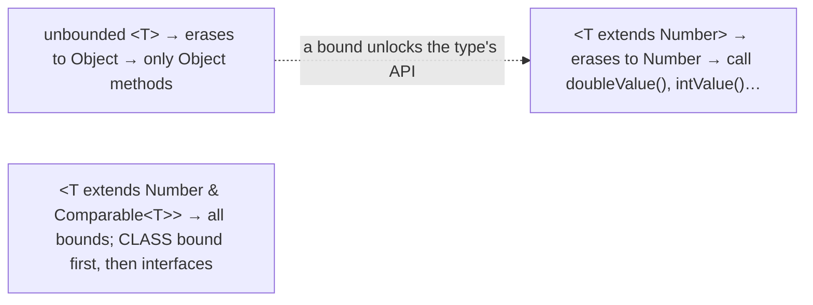
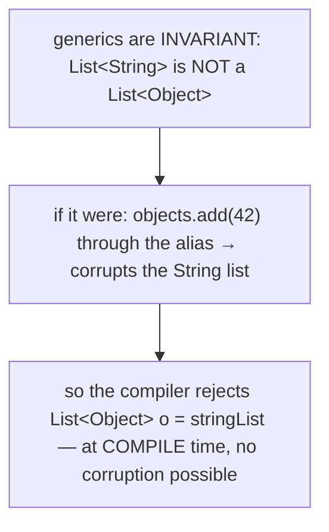
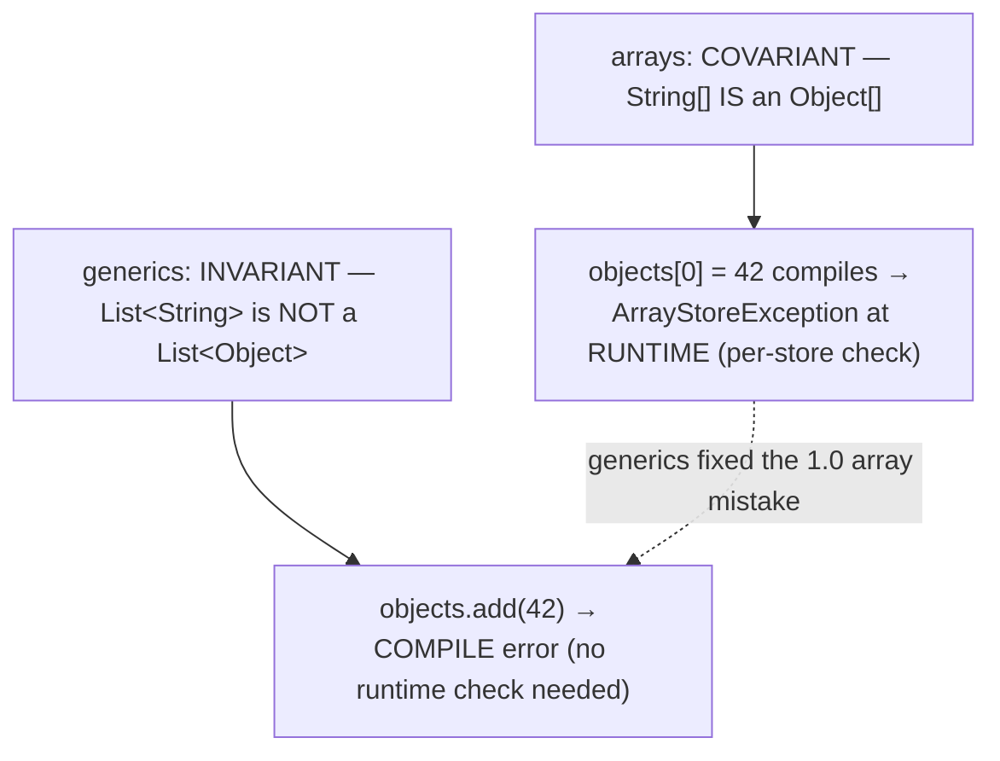
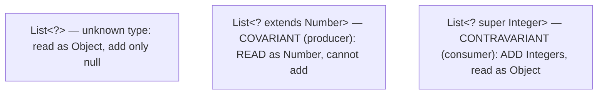
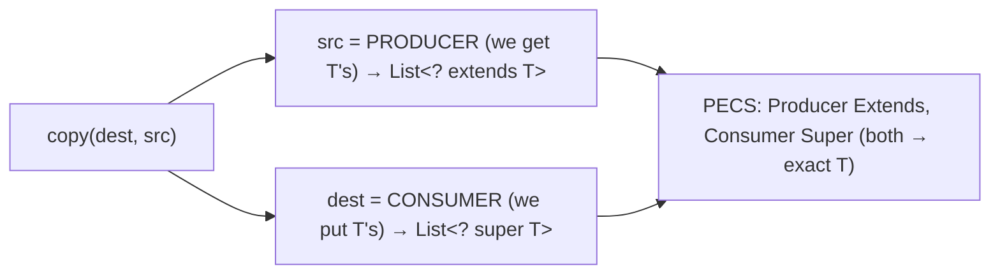
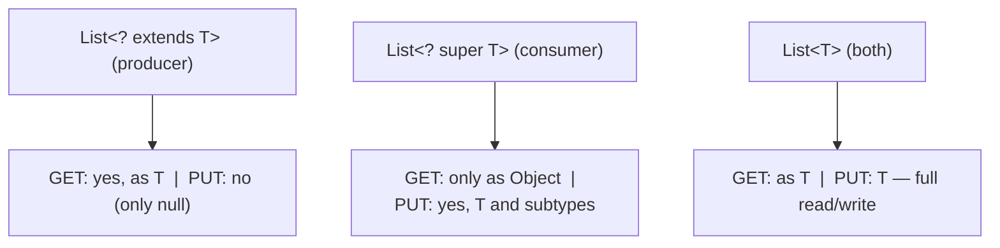
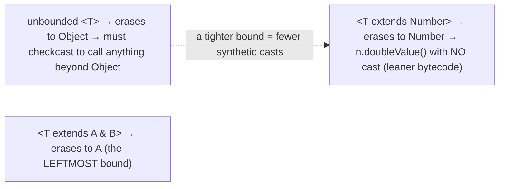
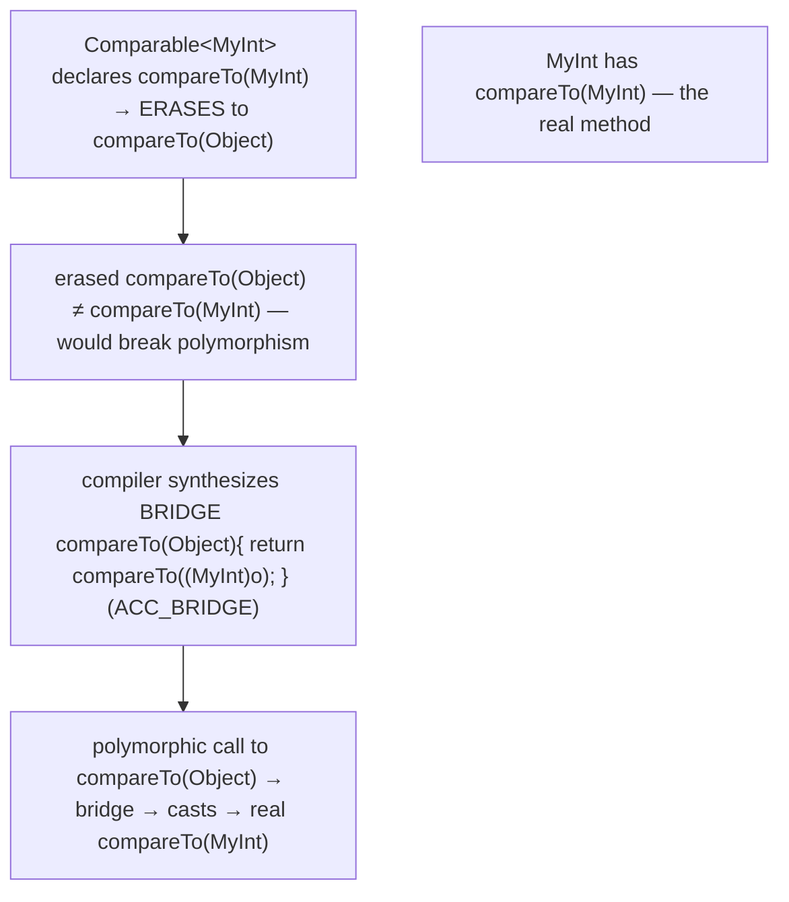
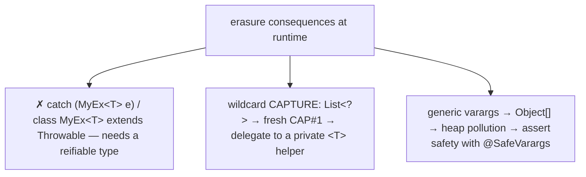
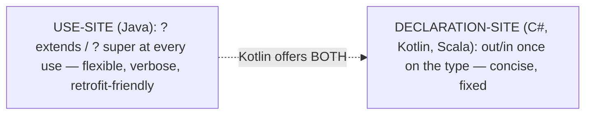

# Generics — bounded types, wildcards, type erasure

[T11](./T11-generics-basics.md) introduced `<T>` and the type erasure beneath it; this topic turns generics from "typed collections" into a tool for designing **flexible, type-safe APIs**. Three ideas do the work. **Bounded type parameters** (`<T extends Number>`) let a generic require that its type argument has certain capabilities — so you can actually *call methods* on a `T` instead of treating it as an opaque `Object`. **Variance** answers the question that surprises everyone: a `List<String>` is **not** a `List<Object>`, even though `String` is an `Object` — generics are *invariant*, for a reason that protects type safety. And **wildcards** (`? extends T`, `? super T`) restore the flexibility invariance takes away, governed by the **PECS** rule — *Producer Extends, Consumer Super* — the single most useful mnemonic in Java generics.

The depth bar is **why invariance is correct and how erasure keeps overriding working**. Invariance is not arbitrary: if `List<String>` *were* a `List<Object>`, you could alias it, `add` an `Integer` through the alias, and corrupt the original — so the compiler forbids the assignment. Arrays, by contrast, *are* covariant (a `String[]` is an `Object[]`), and they pay for it with a **runtime** `ArrayStoreException` and a per-store type check; generics learned from that mistake and close the hole at **compile time** with zero runtime cost. And erasure ([T11](./T11-generics-basics.md)) has a subtle consequence: when a class implements `Comparable<MyType>`, its `compareTo(MyType)` doesn't match the erased interface method `compareTo(Object)` — so the compiler synthesizes a **bridge method**, an invisible `compareTo(Object)` that casts and forwards, preserving polymorphism through erasure. By the end you will bound type parameters, explain invariance and the array-covariance hole, apply PECS to design flexible signatures, read a bridge method in `javap`, and contrast Java's *use-site* wildcards with the *declaration-site* variance of C#, Kotlin, and Scala.

> [!NOTE]
> Prerequisites: [Generics basics](./T11-generics-basics.md) (`L1/C02/T11`) — type parameters and erasure, which this builds on directly; [Comparable/Comparator](./T07-comparable-vs-comparator.md) (`L1/C02/T07`) — `Comparable<T>` is the canonical bounded/bridge-method example; [Polymorphism](../C01-oop/T06-polymorphism-compile-time-vs-runtime.md) (`L1/C01/T06`) — bridge methods preserve runtime dispatch through erasure; [Inheritance](../C01-oop/T04-inheritance-and-super.md) (`L1/C01/T04`) — the subtype relationships variance is about. Forward: [T13](./T13-i-o-streams-byte-and-character.md) (I/O streams) — the first core-API topic, where the language facilities give way to the libraries.

## Bounded Type Parameters

An unbounded `<T>` erases to `Object` ([T11](./T11-generics-basics.md)), so you can only call `Object` methods on a `T`. A **bound** restricts `T` to a type (or its subtypes), unlocking that type's methods:

```java
public static <T extends Number> double sum(List<T> list) {   // T must be a Number or subtype
    double total = 0;
    for (T n : list) total += n.doubleValue();                // legal — T is at least a Number
    return total;
}
```

`<T extends Number>` is an **upper bound**: the argument must be `Number` or below. Note `extends` is used for both classes *and* interfaces (even where you'd normally write `implements`). A parameter can have **multiple bounds** with `&` — `<T extends Number & Comparable<T>>` — requiring `T` to satisfy all of them; if one bound is a **class**, it must come **first**, before any interface bounds (at most one class bound is allowed). Bounds can even be **recursive** — `<T extends Comparable<T>>` ("`T` is comparable to itself"), exactly the signature `Collections.max` uses.



## The Invariance Problem — Why `List<String>` Is Not a `List<Object>`

A `String` is an `Object`, so intuition says a `List<String>` should be usable as a `List<Object>`. **It cannot** — and the compiler is right to forbid it:

```java
List<String> strings = new ArrayList<>();
List<Object> objects = strings;   // COMPILE ERROR — generics are INVARIANT
```

Why? Imagine it were allowed. Then through the `objects` alias you could insert a non-`String`, corrupting `strings`:

```java
List<Object> objects = strings;   // (hypothetically allowed)
objects.add(42);                  // an Integer goes into what is really a List<String>
String s = strings.get(0);        // ClassCastException — the list is now poisoned
```

To prevent exactly this, generics are **invariant**: `List<String>` and `List<Object>` are *unrelated* types regardless of the relationship between `String` and `Object`. The error appears at the assignment, at **compile time**, before any corruption can happen.



### The Array-Covariance Hole

This is where Java's history bites. **Arrays are covariant** — a `String[]` *is* an `Object[]` — a decision from Java 1.0, before generics existed. That covariance creates exactly the hole invariance closes, but it is caught only at **runtime**:

```java
Object[] objects = new String[3];   // ALLOWED — arrays are covariant
objects[0] = 42;                     // compiles fine… but throws ArrayStoreException at RUNTIME
```

Because an array knows its component type and **checks every store**, the illegal write is caught — but at runtime, with a per-store cost, and only when the bad line executes. Generics learned the lesson: be **invariant and compile-time-checked** instead of **covariant and runtime-checked**. The contrast is the cleanest illustration of the difference between reified arrays (which carry their type and check at runtime) and erased generics (which check at compile time and carry nothing — [T11](./T11-generics-basics.md)).



## Wildcards — Restoring Flexibility

Invariance is safe but rigid: a method written for `List<Number>` would reject a `List<Integer>`, which is annoying. **Wildcards** add controlled variance back. There are three:

- **`List<?>`** — unbounded; "a list of *some* unknown type." You can read elements as `Object` and call type-independent methods (`size`, `clear`), but you **cannot add** anything except `null` (you don't know the element type).
- **`List<? extends Number>`** — upper-bounded, **covariant**; "a list of `Number` or some subtype." A `List<Integer>` *is* a `List<? extends Number>`. You can **read** elements as `Number`, but **cannot add** (you don't know if it's a `List<Integer>` or a `List<Double>`).
- **`List<? super Integer>`** — lower-bounded, **contravariant**; "a list of `Integer` or some supertype." A `List<Number>` *is* a `List<? super Integer>`. You can **add** `Integer`s, but can only **read** elements as `Object`.



## PECS — Producer Extends, Consumer Super

When do you use which wildcard? Josh Bloch's mnemonic **PECS — Producer Extends, Consumer Super** — answers it. If a parameter **produces** values you read out, use `? extends T`. If it **consumes** values you write in, use `? super T`. If it does both, use an exact `T` (no wildcard). The textbook example is `Collections.copy`:

```java
public static <T> void copy(List<? super T> dest, List<? extends T> src) {
    for (int i = 0; i < src.size(); i++)
        dest.set(i, src.get(i));     // src PRODUCES T's (read) → extends; dest CONSUMES T's (write) → super
}
```

`src` is the **producer** — you `get` `T`s from it — so `? extends T` (you can read, and it accepts any subtype list). `dest` is the **consumer** — you `set` `T`s into it — so `? super T` (you can write, and it accepts any supertype list). This single signature accepts `copy(List<Number>, List<Integer>)`, `copy(List<Object>, List<String>)`, and more — the flexibility invariance alone could not give. (The older name for the same rule is the **get/put principle**: *get → extends, put → super*.) You see PECS throughout the JDK: `Collections.max(Collection<? extends T>)`, `Comparator<? super T>` parameters, and the `Stream` API.



> [!WARNING]
> **You cannot `add` to a `List<? extends T>`** (except `null`). It is a *producer* — the compiler can't know its exact element type, so no specific value is provably safe to insert. If you need to add, the parameter is a *consumer* and wants `? super T`. Getting PECS backwards is the most common wildcard error.



## Memory — Bounded Erasure and Bridge Methods

Two erasure consequences from [T11](./T11-generics-basics.md) deepen here. First, a **bounded** type parameter erases to its **bound**, not to `Object`: `<T extends Number>` erases `T` to `Number`, so the synthetic casts the compiler inserts are `checkcast Number`, and calling `n.doubleValue()` needs **no cast** because `T` is already `Number` at the bytecode level. Multiple bounds erase to the **leftmost** bound — another reason the class bound (if any) must come first.



Second, the **bridge method** — erasure's subtlest artifact. Consider implementing `Comparable`:

```java
class MyInt implements Comparable<MyInt> {
    private final int v;
    public int compareTo(MyInt o) { return Integer.compare(v, o.v); }   // the real, specific method
}
```

`Comparable<T>` declares `compareTo(T)`, which **erases to `compareTo(Object)`**. But `MyInt` only has `compareTo(MyInt)` — so the erased interface method `compareTo(Object)` appears *unimplemented*, which would break polymorphic calls through a `Comparable` reference. To fix this, the compiler **synthesizes a bridge method**:

```java
// compiler-generated, invisible in source — flagged ACC_BRIDGE | ACC_SYNTHETIC:
public int compareTo(Object o) { return compareTo((MyInt) o); }   // cast + forward to the real method
```

`javap -p MyInt` shows *two* `compareTo` methods: yours and the synthetic bridge. The bridge is how erasure preserves overriding ([T06](../C01-oop/T06-polymorphism-compile-time-vs-runtime.md)/[T07](./T07-comparable-vs-comparator.md)): a call to the erased `compareTo(Object)` lands on the bridge, which casts and dispatches to your `compareTo(MyInt)`. Any time a generic supertype is overridden with a more specific type, a bridge appears.



## Architecture — Cheaper Casts, Bridge Indirection, and What Erasure Forbids

Several runtime consequences follow from bounded erasure and bridges. **Bounds can reduce casts**: because `<T extends Number>` erases to `Number`, calling `Number` methods on a `T` needs *no* synthetic cast, whereas an unbounded `T` (erased to `Object`) would need a cast to do anything beyond `Object`'s methods — so a tighter bound is not just safer, it can emit leaner bytecode. **Bridge methods add one indirection**: a polymorphic generic call hits the bridge, which does a `checkcast` and forwards — an extra tiny method call. But the bridge is monomorphic and trivial, so the JIT virtually always **inlines** it ([T05](../C01-oop/T05-method-overriding.md)/[T06](../C01-oop/T06-polymorphism-compile-time-vs-runtime.md)), making the indirection free in hot code.

Erasure also **forbids three things** that catch people out:

- **You cannot catch a generic exception type.** `catch (MyException<String> e)` is illegal, and a generic class **cannot** extend `Throwable` at all. A `catch` needs a **reifiable** type — one fully known at runtime — but erasure makes `MyException<String>` and `MyException<Integer>` indistinguishable, so the JVM could not decide which clause matches.
- **Wildcard capture** is the compiler's trick for handling `?`. When you pass a `List<?>` to a method, the compiler "captures" the unknown type as a fresh synthetic variable (`CAP#1`); a private generic helper with a real `<T>` parameter can then operate on it. This is why the idiomatic way to mutate a `List<?>` is to delegate to a `private static <T> void helper(List<T>)`.
- **Generic varargs cause heap pollution.** A method like `void m(List<String>... lists)` creates an `Object[]` of a generic type at the call site, which can be aliased and made to hold the wrong parameterization — "heap pollution," and the compiler warns. If the method is genuinely safe (it only reads the varargs, never stores into the array), annotate it **`@SafeVarargs`** to assert that and silence the warning (as `List.of` and `Arrays.asList` do).



## Cross-Language Perspective — Use-Site vs Declaration-Site Variance

Every language with generics must answer "is a `List<Cat>` a `List<Animal>`?", and the deep design split is **where you declare the variance**:

| Language | Variance style | How |
|---|---|---|
| **Java** | **use-site** | wildcards `? extends` / `? super` at each method parameter |
| **C#** | **declaration-site** | `out T` (covariant) / `in T` (contravariant) on the interface |
| **Kotlin** | **both** | `out`/`in` on the declaration + use-site projections |
| **Scala** | **declaration-site** | `+T` / `-T` / `T` on the type |
| **C++** | invariant + duck-typed | templates; bounds via `concepts` (C++20) |
| **Rust** | inferred | trait bounds `<T: Ord>`; variance inferred by the compiler |

**Java uses use-site variance**: the variance lives at each *use* — every method that wants flexibility writes `? extends`/`? super` in its signature. This is maximally flexible (the same `List<T>` is read covariantly in one method and written contravariantly in another) but **verbose** — the wildcards repeat across every signature, and beginners find PECS hard. **C#, Kotlin, and Scala use declaration-site variance**: you mark a type parameter variant **once**, on the type itself — C#'s `IEnumerable<out T>` says "`IEnumerable` is covariant in `T`" forever, so an `IEnumerable<Cat>` is automatically an `IEnumerable<Animal>` with no per-use wildcard. That is cleaner and easier to learn, but less flexible (the variance is fixed at declaration, and in C# applies only to interfaces and delegates). **Kotlin offers both** — declaration-site `out`/`in` plus Java-style use-site projections — the most complete design. **C++** templates are invariant and structurally typed (a template just fails to compile if an operation isn't supported; `concepts` add named bounds in C++20), and **Rust** uses trait bounds like Java's `extends` while *inferring* variance from how a type uses its parameters. Java chose use-site wildcards because they could be **retrofitted** onto the already-shipped invariant generics without changing a single existing type declaration — the same migration-pragmatism that drove erasure ([T11](./T11-generics-basics.md)).



## Common Mistakes

> [!WARNING]
> **Assuming `List<String>` is a `List<Object>`.** Generics are invariant; the assignment is a compile error. Use `List<? extends Object>` (i.e. `List<?>`) if you only need to read.

> [!WARNING]
> **Getting PECS backwards.** `? extends T` for a parameter you write to (you then can't `add`), or `? super T` for one you read from (you then only get `Object`). Producer → extends, consumer → super.

> [!WARNING]
> **Using raw types to silence wildcard errors.** Switching `List<? extends Number>` to a raw `List` to make an `add` compile reintroduces the unsafety generics exist to prevent ([T11](./T11-generics-basics.md)). Fix the variance instead.

> [!WARNING]
> **Wrong multiple-bound order.** A class bound must precede interface bounds: `<T extends Number & Comparable<T>>` is legal, `<T extends Comparable<T> & Number>` is not (and there can be at most one class bound).

> [!WARNING]
> **Trying to catch a generic exception or extend `Throwable` generically.** `catch (MyEx<String> e)` and `class MyEx<T> extends Exception` are both illegal — a catchable/throwable type must be reifiable, which erasure prevents.

> [!WARNING]
> **Generic varargs without thinking about heap pollution.** Annotate a genuinely safe generic varargs method with `@SafeVarargs`; never add it to one that actually stores into the varargs array — that's asserting a falsehood.

## Practice

> [!INTERVIEW]
> Common interview questions for this topic:
> 1. **What is a bounded type parameter?** `<T extends X>` restricts `T` to `X` or a subtype, letting you call `X`'s methods on `T`; it erases to `X`.
> 2. **Why is `List<String>` not a `List<Object>`?** Invariance — allowing it would let you insert a non-`String` through the alias and corrupt the list.
> 3. **How do arrays differ from generics on variance?** Arrays are covariant and catch the resulting hole at runtime (`ArrayStoreException`); generics are invariant and catch it at compile time.
> 4. **What are the three wildcards?** `?` (unbounded), `? extends T` (covariant producer), `? super T` (contravariant consumer).
> 5. **What is PECS?** Producer Extends, Consumer Super — `? extends T` for parameters you read from, `? super T` for parameters you write to.
> 6. **Can you add to a `List<? extends Number>`?** No (except `null`) — the exact element type is unknown.
> 7. **Can you add to a `List<? super Integer>`?** Yes, `Integer`s — but you can only read elements as `Object`.
> 8. **What does a bounded type parameter erase to?** Its bound (the leftmost, for multiple bounds), not `Object` — so calling the bound's methods needs no cast.
> 9. **What is a bridge method?** A synthetic `ACC_BRIDGE` method the compiler generates to preserve polymorphism through erasure — e.g. `compareTo(Object)` forwarding to `compareTo(MyType)`.
> 10. **Why can't you catch a generic exception type?** A `catch` needs a reifiable type; erasure makes `MyEx<A>` and `MyEx<B>` indistinguishable at runtime.
> 11. **What is heap pollution / `@SafeVarargs`?** A parameterized variable referring to an object of a different parameterization (often via generic varargs); `@SafeVarargs` asserts a varargs method doesn't cause it.
> 12. **Use-site vs declaration-site variance?** Java declares variance at each use (wildcards — flexible, verbose); C#/Kotlin/Scala declare it once on the type (`out`/`in` — concise, fixed).
> 13. **Multiple-bound ordering rule?** At most one class bound, and it must come first, before interface bounds.

1. **Bounded parameter.** Write `<T extends Comparable<T>> T max(List<T> list)`; call it on a `List<Integer>` and a `List<String>`. Explain the recursive bound.

2. **Multiple bounds.** Write a method bounded by `<T extends Number & Comparable<T>>`; use both the `Number` and `Comparable` capabilities of `T`.

3. **Invariance.** Try `List<Object> o = stringList;`; observe the compile error; explain the corruption it prevents.

4. **Array-covariance hole.** Write `Object[] a = new String[2]; a[0] = 42;`; observe the `ArrayStoreException` at runtime; contrast with the compile-time rejection generics give.

5. **PECS copy.** Implement `copy(List<? super T> dest, List<? extends T> src)`; confirm it accepts `copy(numberList, integerList)` and explain which is producer and which is consumer.

6. **`? extends` is read-only.** Try to `add` to a `List<? extends Number>` parameter; observe the compile error; confirm you can still read elements as `Number` and add `null`.

7. **`? super` is write-restricted.** From a `List<? super Integer>`, `add` an `Integer` (works) and try to assign an element to `Integer` (fails — only `Object`); explain.

8. **Unbounded `?`.** Write `printAll(List<?> list)`; confirm it accepts any `List` but cannot `add` (except `null`).

9. **Bridge method.** Implement `Comparable<MyType>`; run `javap -p` and find the synthetic `compareTo(Object)` bridge; explain its role.

10. **Can't catch generic.** Try `catch (MyEx<String> e)` and `class MyEx<T> extends Exception`; observe both compile errors and explain why erasure forbids them.

11. **Wildcard capture.** Write a `swap(List<?> list, int i, int j)` that delegates to a `private static <T> void swapHelper(List<T> list, int i, int j)`; explain the capture.

12. **`@SafeVarargs`.** Write a safe generic varargs method (only reads its varargs); observe the heap-pollution warning; add `@SafeVarargs` and confirm it's gone.

13. **Bounded erasure in bytecode.** Compile a `<T extends Number>` method; `javap -c` it and confirm the erased signature uses `Number` (and `doubleValue` is called without a cast).

14. **Use-site vs declaration-site.** Express the same covariance in Java (`List<? extends T>`) and conceptually in C#/Kotlin (`out T`); discuss the verbosity/flexibility trade-off.

15. **End-to-end explain-it-back.** For `Collections.copy(List<? super T> dest, List<? extends T> src)` and a class implementing `Comparable<MyType>`: (a) why `src` is `? extends T` and `dest` is `? super T`; (b) what you can and cannot do with each; (c) what bridge method the compiler generates for the `Comparable` class and why; (d) how a polymorphic `compareTo` call reaches the real method; (e) why none of this carries runtime type information. Twelve sentences max.

## Recap

You should now be able to:

**Language layer.**

- Bound type parameters (`<T extends X>`, multiple bounds with the class first, recursive bounds) to call the bound's methods on `T`.
- Explain invariance — why `List<String>` is not a `List<Object>` — and contrast it with covariant arrays and their runtime `ArrayStoreException`.
- Use the three wildcards and apply **PECS** (Producer Extends, Consumer Super) to design flexible, type-safe signatures.

**Memory layer.**

- Explain that a bounded type parameter erases to its bound (leftmost for multiple bounds), reducing the casts the compiler must insert.
- Describe bridge methods: synthetic `ACC_BRIDGE` methods the compiler generates so an erased override (`compareTo(Object)`) forwards to the real specific method, preserving polymorphism.

**Architecture layer.**

- Explain that bounds can emit leaner bytecode (fewer casts) and that bridge-method indirection is normally inlined away by the JIT.
- State what erasure forbids — catching/extending a generic `Throwable`, distinguishing parameterizations at runtime — and explain wildcard capture and `@SafeVarargs` heap-pollution.
- Contrast Java's use-site wildcard variance with the declaration-site variance of C#, Kotlin, and Scala, and tie Java's choice to retrofit/migration pragmatism.

This **completes the generics pair** ([T11](./T11-generics-basics.md) basics + T12 advanced) and the chapter's **language-facilities run** (exceptions T09–T10, generics T11–T12). Everything from here is the **core API libraries** — and the chapter opens that arc with the one every program uses to move data across boundaries: input and output.

## Next

Continue to [I/O streams (byte & character)](./T13-i-o-streams-byte-and-character.md) — the first of the core-API topics, and a shift from *language facilities* to *libraries*. We leave type systems behind and turn to moving bytes and characters across boundaries — files, sockets, pipes. T13 opens the two parallel hierarchies: `InputStream`/`OutputStream` for raw **bytes** and `Reader`/`Writer` for **characters**, why the split exists (the charset-decoding boundary — the same encoding concerns from L0), the **decorator pattern** that composes them (`BufferedReader` wrapping a `FileReader` wrapping bytes — the wrapping you met in [T10](./T10-custom-exceptions-and-try-with-resources.md)'s reverse-order close), why **buffering** matters (the memory-hierarchy lesson from [T08](./T08-collection-performance-characteristics-big-o.md), now at the syscall and disk level), and the `try`-with-resources discipline ([T10](./T10-custom-exceptions-and-try-with-resources.md)) that every stream demands.
