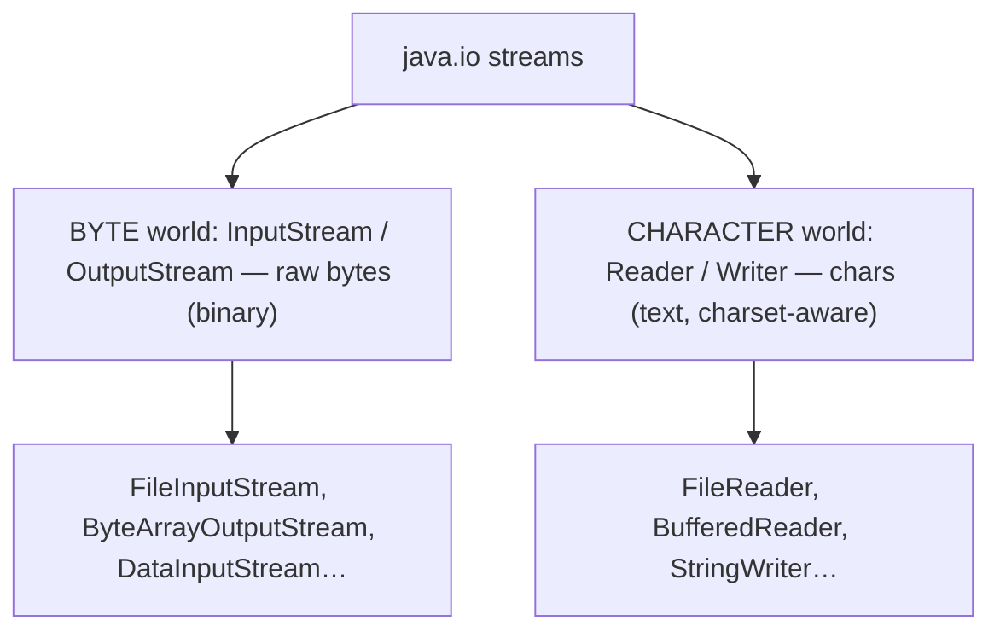
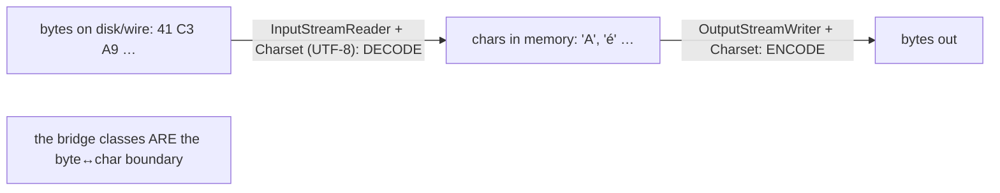
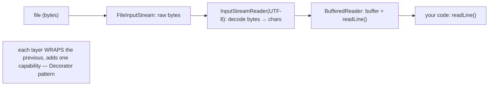
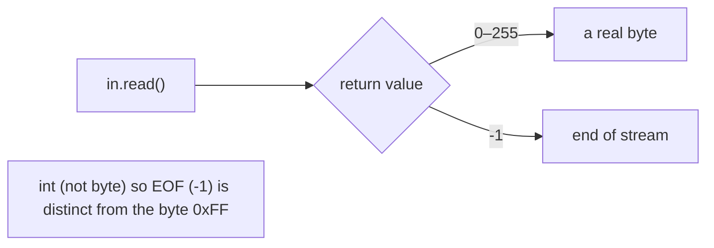
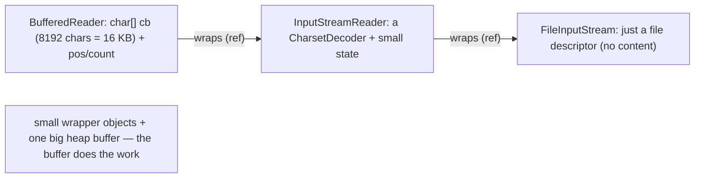
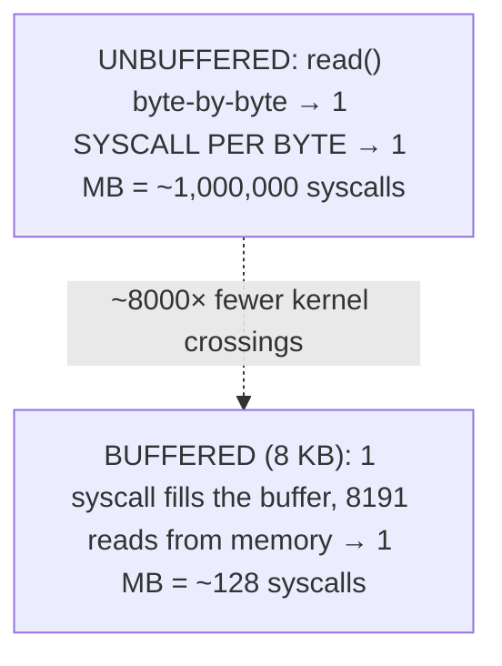
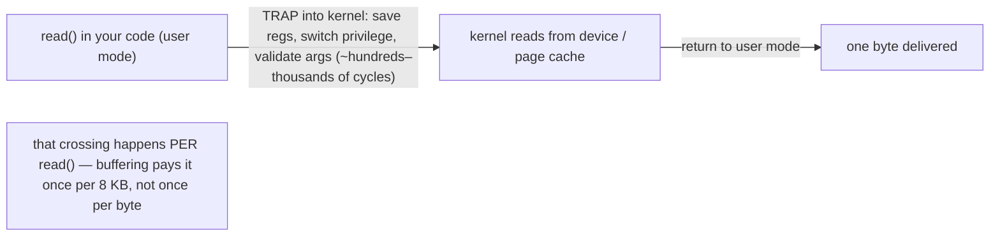
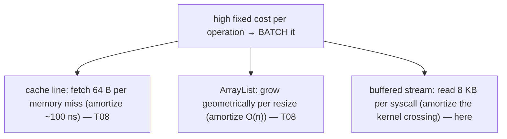
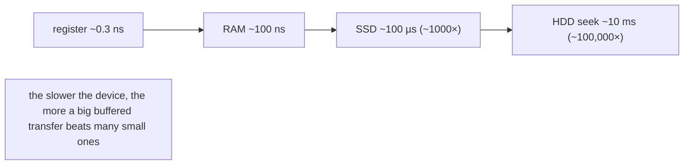
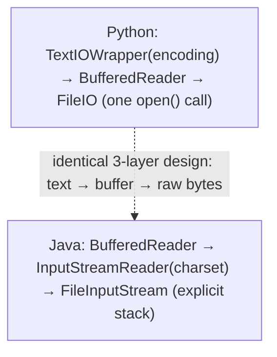

# I/O streams (byte & character)

This is the chapter's first **core-API** topic — a shift from *language facilities* (exceptions, generics) to the *libraries* every program leans on, beginning with the one that moves data across boundaries: input and output. A running program is an island of in-memory objects; to read a file, talk to a socket, or write a response, it must move **bytes** in and out. Java models that movement as **streams** — sequences of data you read from or write to one chunk at a time — and splits them into two parallel worlds: **`InputStream`/`OutputStream`** for raw **bytes** (images, compressed data, anything binary), and **`Reader`/`Writer`** for **characters** (text). The split exists because a character is *not* a byte — turning bytes into text requires decoding them through a **charset** (UTF-8, UTF-16, …), and that decoding boundary is exactly where the two hierarchies meet, via the bridge classes `InputStreamReader` and `OutputStreamWriter`.

The depth bar is **buffering, and why it is the memory-hierarchy lesson all over again — now at the syscall and disk level**. An unbuffered `read()` that fetches one byte is a **system call**: a controlled transition from user mode into the kernel that costs hundreds to thousands of CPU cycles *before* any disk access. Reading a 1 MB file one byte at a time is therefore a *million* syscalls — catastrophic. A `BufferedInputStream` reads **8 KB per syscall** into an in-memory buffer and serves the rest from memory, turning those million syscalls into about 128. That is the *exact same pattern* as `ArrayList`'s geometric growth and the CPU's cache lines from [T08](./T08-collection-performance-characteristics-big-o.md) — *batch a high-fixed-cost operation so you pay it rarely* — just moved from the CPU-memory boundary to the OS-device boundary. And the design that lets you compose buffering, decoding, and typed reads à la carte is the **Decorator pattern**, of which `java.io` is the textbook example. By the end you will read and write both bytes and text correctly, compose decorator stacks, specify charsets to avoid the `FileReader` portability trap, and explain — in syscalls — why buffering is non-negotiable.

> [!NOTE]
> Prerequisites: [try-with-resources](./T10-custom-exceptions-and-try-with-resources.md) (`L1/C02/T10`) — every stream is `Closeable` and must be closed; the decorator stack is the reverse-order-close example; [Big-O / memory hierarchy](./T08-collection-performance-characteristics-big-o.md) (`L1/C02/T08`) — buffering is the same batch-to-amortize pattern at the syscall level; [Interfaces](../C01-oop/T08-interfaces-default-static-private-methods.md) (`L1/C01/T08`) — the abstract stream classes and the `Closeable` interface. Forward: [T14](./T14-nio-2-path-files-channels.md) (NIO.2 — `Path`/`Files`/channels, the modern file API that complements these streams), [T21](./T21-serialization-and-deserialization.md) (object streams).

## The Two Hierarchies — Bytes and Characters

Java's classic I/O is two parallel families of abstract classes:

| | Read | Write | Unit |
|---|---|---|---|
| **Bytes** | `InputStream` | `OutputStream` | a `byte` (0–255), `read()` → `int` |
| **Characters** | `Reader` | `Writer` | a `char` (UTF-16), `read()` → `int` |

**Byte streams** (`InputStream`/`OutputStream`) move raw bytes — `read()` returns one byte, `read(byte[])` fills an array, `write(int)`/`write(byte[])` emit bytes. Concrete subclasses include `FileInputStream`/`FileOutputStream` (files), `ByteArrayInputStream`/`ByteArrayOutputStream` (in-memory), and `DataInputStream`/`DataOutputStream` (typed primitives). Use them for **binary** data: images, audio, ZIP, serialized objects ([T21](./T21-serialization-and-deserialization.md)).

**Character streams** (`Reader`/`Writer`) move characters — `read()` returns one `char`, `BufferedReader.readLine()` returns a whole line, `Writer.write(String)` emits text. Concrete subclasses include `FileReader`/`FileWriter`, `StringReader`/`StringWriter`, and `BufferedReader`/`BufferedWriter`. Use them for **text**.



## Why Two Hierarchies — The Charset Boundary

A `char` is not a `byte`. A byte is an 8-bit unit of storage; a character is an abstract symbol that, on disk or the wire, is encoded as **one or more bytes** according to a **charset**. In UTF-8, `A` is one byte, `é` is two, and an emoji is four; in UTF-16 every character is two or four. So you cannot turn bytes into text without knowing the charset — and that is precisely what character streams add over byte streams: **decoding and encoding**.

The two worlds meet at the **bridge classes**:

- **`InputStreamReader`** wraps an `InputStream` (bytes) plus a `Charset` and produces a `Reader` (chars), **decoding** bytes → chars as you read.
- **`OutputStreamWriter`** wraps an `OutputStream` plus a `Charset` and produces a `Writer`, **encoding** chars → bytes as you write.



> [!WARNING]
> **`FileReader`/`FileWriter` use the default charset.** The no-charset constructors decode/encode with the **platform default** charset, so text written on a UTF-8 machine can come back garbled on a machine whose default is Windows-1252 — a classic portability bug. Always specify a charset: `new FileReader(file, StandardCharsets.UTF_8)` (Java 11+) or an `InputStreamReader(new FileInputStream(file), UTF_8)`. (Java 18 made UTF-8 the default via JEP 400, but specifying it explicitly is still the correct habit.)

## The Decorator Pattern — Composing Streams

`java.io` is the **textbook Decorator pattern** ([GoF]): a stream **wraps** another stream, adding one capability while presenting the same interface, so you compose exactly the behavior you need. The canonical text-reading stack is three layers:

```java
try (BufferedReader br = new BufferedReader(            // layer 3: buffering + readLine()
         new InputStreamReader(                          // layer 2: byte → char decoding (charset)
             new FileInputStream(path),                  // layer 1: raw bytes from the file
             StandardCharsets.UTF_8))) {
    String line;
    while ((line = br.readLine()) != null) process(line);
}
```

Each layer delegates to the one it wraps and adds a single capability: `FileInputStream` provides raw bytes; `InputStreamReader` decodes them to characters; `BufferedReader` buffers and supplies `readLine()`. The composition is the point — swap `FileInputStream` for a `ByteArrayInputStream` to read from memory, add a `GZIPInputStream` to decompress, insert a `DataInputStream` for typed reads — all without new classes. This is *why* `java.io` has so many stream types: they are composable building blocks, not a fixed menu of combinations.



## Buffering and `read()`'s `int` Return

A **buffered** stream interposes an in-memory array between you and the raw source. `BufferedInputStream`/`BufferedReader` (and their `Output`/`Writer` siblings) keep an internal buffer — 8 KB by default — fill it with one large read, then serve your small reads from memory until it empties. The next section quantifies why this matters enormously; for now, the rule is **always buffer** unless you are already reading in large `byte[]` chunks yourself.

One subtlety in the read loop: **`read()` returns an `int`, not a `byte`**, even though it reads a single byte. A byte value ranges 0–255, but a Java `byte` is *signed* (−128–127), so it cannot represent both all 256 values *and* a distinct end-of-file signal. `read()` returns 0–255 for a real byte and **`-1` for EOF** — which is why the idiom uses an `int`:

```java
int b;                                  // int, not byte
while ((b = in.read()) != -1) { ... }   // -1 distinguishes EOF from the byte 0xFF
```

Storing `read()` in a `byte` breaks the EOF test (the byte `0xFF` would compare equal to `-1`). The standard streams `System.in` (an `InputStream`), `System.out`, and `System.err` (both `PrintStream`s) follow the same model.



## Memory — Small Stream Objects, One Big Buffer

A bare stream object is tiny: a `FileInputStream` holds essentially a **file descriptor** (a small OS handle) and an object header — it does *not* hold the file's contents. The memory of interest is the **buffer**:

- **`BufferedInputStream`** holds a `byte[] buf` (default **8192 bytes = 8 KB**) on the heap, plus `pos` and `count` ints tracking the read position and valid length.
- **`BufferedReader`** holds a `char[] cb` (default 8192 chars = **16 KB**, since a `char` is 2 bytes — [T01](../C01-oop/T01-classes-and-objects.md) / L0) plus its indices.

The decorator stack is a short **linked list of small wrapper objects** — `BufferedReader` → `InputStreamReader` → `FileInputStream`, three objects, each holding a reference to the one it wraps, with the buffers attached to the buffered layers. So the whole text-reading stack costs ~8–24 KB of buffer plus three small objects — trivial, and the buffer is the thing earning its keep. Remember the encoding asymmetry: a `String`'s characters in memory (a `byte[]` — Latin-1 or UTF-16 — since Java 9's compact strings) versus the file's bytes differ by the charset (UTF-8 packs ASCII into 1 byte/char, CJK into 3, emoji into 4).



## Architecture — Buffering Is Syscall Amortization

Here is the heart of the topic. Every unbuffered `read()` on a `FileInputStream` is a **system call** — a controlled trap from user mode into the kernel. The mode transition alone costs **hundreds to a few thousand CPU cycles** (saving registers, validating arguments, switching privilege level), dwarfing an ordinary method call (~1–10 cycles), and that is *before* any device access. So reading a 1 MB file one byte at a time is **~1,000,000 syscalls** — even if the OS page cache serves every byte from RAM (no physical disk hit), the syscall overhead alone is ~a billion cycles. Catastrophic.

A `BufferedInputStream` collapses this: one syscall fills the 8 KB buffer, and the next 8191 `read()`s are served from memory with **no syscall**, until the buffer drains and one more refills it. A 1 MB file becomes **~128 syscalls** (1 MB ÷ 8 KB) instead of a million — roughly **8000× fewer kernel crossings**.





This is **the same pattern you already know**, at a new boundary. The CPU fetches a whole 64-byte **cache line** per miss to amortize ~100 ns of memory latency; `ArrayList` grows **geometrically** to amortize the O(n) resize over many appends ([T08](./T08-collection-performance-characteristics-big-o.md)); a buffered stream reads **8 KB per syscall** to amortize the kernel-crossing cost over thousands of bytes. The unifying rule: **when an operation has a high fixed cost, batch it** — pay it once for a big chunk rather than many times for small pieces.



The numbers make it inescapable. Extending the latency hierarchy from [T08](./T08-collection-performance-characteristics-big-o.md) down to storage: a register is ~0.3 ns, RAM ~100 ns, an **SSD ~100 µs (≈1000× RAM)**, and an **HDD seek ~10 ms (≈100,000× RAM)**. Against a device that slow, doing fewer, larger transfers is everything. (Two more notes: the OS keeps its own **page cache** of disk blocks in RAM, so repeated reads may avoid the physical disk — but *not* the per-call syscall overhead, which only your buffer removes; and character streams pay a small extra cost to **decode** each chunk through the charset, negligible beside the syscall savings. NIO's `transferTo` can even use OS **zero-copy** (`sendfile`) to move data file→socket without round-tripping through user space — [T14](./T14-nio-2-path-files-channels.md).)



## Cross-Language Perspective

Every language faces the same two truths — text needs a charset, and I/O needs buffering — and solves them almost identically:

| Language | Byte I/O | Character/text I/O | Buffering |
|---|---|---|---|
| **Java** | `InputStream`/`OutputStream` | `Reader`/`Writer` (+ charset) | **opt-in** (`BufferedX`) |
| **C** | `read(2)`/`write(2)` syscalls | — (manual) | `FILE*` **buffered by default** (`setvbuf`) |
| **Python** | `io.FileIO` (binary mode) | `io.TextIOWrapper` (`encoding=`) | **default** (`BufferedReader`) |
| **C#** | `Stream` / `FileStream` | `StreamReader`/`StreamWriter` (`Encoding`) | `BufferedStream` |
| **Go** | `io.Reader`/`io.Writer` | `golang.org/x/text` | `bufio` |

Three observations. **The byte/text split is universal** — Python's `io` module literally layers `TextIOWrapper` (charset) over `BufferedReader` (buffering) over `FileIO` (raw bytes), which is *exactly* Java's `BufferedReader`→`InputStreamReader`→`FileInputStream` stack, just hidden behind one `open()` call; C# has `Stream` + `StreamReader`; everyone separates raw bytes from decoded text. **Buffering is universal, but who does it by default differs** — C's `stdio` (`FILE*`/`fread`) and Python's `open()` buffer **automatically** (C even distinguishes line-buffered terminals from block-buffered files via `setvbuf`), whereas **Java makes you opt in** by wrapping in `BufferedInputStream`/`BufferedReader` — a frequent footgun, since a forgotten buffer silently runs thousands of times slower. **The composition pattern is universal**, and **Java's `java.io` is the canonical Decorator example** taught in design-patterns courses — C's `FILE*` hides the layering, Go composes via interface embedding (`bufio.NewReader(file)`), but the idea is the same: wrap a raw source to add buffering and decoding. The portable rule across all of them: **buffer, and name your charset.**



## Common Mistakes

> [!WARNING]
> **Not buffering.** Reading or writing byte-by-byte (or char-by-char) on an unbuffered `FileInputStream`/`FileReader` is one syscall per unit — thousands of times slower than necessary. Wrap in `BufferedInputStream`/`BufferedReader`, or read into a large `byte[]` chunk yourself.

> [!WARNING]
> **Relying on the default charset.** `FileReader`/`FileWriter` (and `String.getBytes()` with no argument) use the platform default, producing text that garbles across machines. Always pass `StandardCharsets.UTF_8` (or the correct charset).

> [!WARNING]
> **Not closing streams.** An unclosed stream leaks a file descriptor, and the OS caps how many a process may hold. Use `try`-with-resources ([T10](./T10-custom-exceptions-and-try-with-resources.md)) — every stream is `Closeable`, and closing the outer decorator closes the whole chain.

> [!WARNING]
> **Storing `read()` in a `byte`.** `byte b = in.read();` loses the `-1` EOF signal (and sign-extends `0xFF` to `-1`). Always read into an `int` and compare to `-1`.

> [!WARNING]
> **Forgetting to flush a `Writer`.** Buffered output stays in the buffer until `flush()` or `close()`; if the program exits without closing, that data is lost. `try`-with-resources closes (and thus flushes) for you.

> [!WARNING]
> **Treating bytes as text without decoding.** Building a `String` from a `byte[]` without specifying the charset, or mixing byte and character streams, produces mojibake for any non-ASCII content. Decode through a `Reader` with an explicit charset.

## Practice

> [!INTERVIEW]
> Common interview questions for this topic:
> 1. **Byte streams vs character streams?** `InputStream`/`OutputStream` move raw bytes (binary); `Reader`/`Writer` move characters with charset decoding (text).
> 2. **Why two hierarchies?** A character isn't a byte — converting between them needs a charset, which byte streams can't do; character streams handle the encoding boundary.
> 3. **What are the bridge classes?** `InputStreamReader` (bytes→chars + `Charset`) and `OutputStreamWriter` (chars→bytes) — they connect the two worlds.
> 4. **What design pattern is `java.io`?** Decorator — streams wrap other streams to add buffering, decoding, or typed reads while keeping the same interface.
> 5. **Why buffer?** An unbuffered `read()` is one syscall per byte; a `BufferedInputStream` reads 8 KB per syscall and serves the rest from memory — ~1M syscalls become ~128 for a 1 MB file.
> 6. **Why does `read()` return `int`, not `byte`?** To represent all 256 byte values plus a distinct `-1` EOF; a signed `byte` couldn't separate EOF from `0xFF`.
> 7. **What's the `FileReader`/`FileWriter` trap?** They use the platform default charset → non-portable garbled text; always specify the charset.
> 8. **Default buffer size?** 8192 bytes (8 KB).
> 9. **How do you guarantee a stream is closed?** `try`-with-resources (every stream is `Closeable`); closing the outer decorator closes the chain.
> 10. **What does `flush()` do?** Forces buffered output to the underlying stream; `close()` flushes automatically.
> 11. **What is the syscall cost buffering avoids?** A user→kernel mode transition (~hundreds–thousands of cycles) per call, plus device latency; batching amortizes it.
> 12. **How do Python/C# compare?** Same byte/text split + buffering + layering — Python's `open()` is `TextIOWrapper(BufferedReader(FileIO))`, C# has `Stream` + `StreamReader`. Java I/O is the textbook decorator example.
> 13. **What's `transferTo` / zero-copy?** `in.transferTo(out)` copies a whole stream; NIO can use OS zero-copy (`sendfile`) to skip user-space buffers.

1. **Unbuffered vs buffered copy.** Copy a large file byte-by-byte with raw `FileInputStream`/`FileOutputStream`, then with `Buffered` wrappers. Time both; if available, use `strace`/`dtruss` to count the syscalls. Explain the ratio.

2. **The decorator stack.** Build `BufferedReader(new InputStreamReader(new FileInputStream(path), UTF_8))` and read the file with `readLine()`. Identify what each layer contributes.

3. **`readLine` loop.** Read a text file line-by-line until `readLine()` returns `null`; count the lines.

4. **The default-charset trap.** Write a string containing `é`/`日` via `OutputStreamWriter(…, UTF_8)`, then read it back with a no-charset `FileReader` on a non-UTF-8 default (or simulate by reading with a different charset). Observe the garbling; fix by specifying UTF-8.

5. **`read()` and EOF.** Write the byte-copy loop with `int b = in.read()`; then change `b` to a `byte` and show the EOF check breaks.

6. **`ByteArrayOutputStream`.** Accumulate bytes in memory, then call `toByteArray()`; use it to build a byte payload without a file.

7. **`transferTo`.** Copy one stream to another with `in.transferTo(out)` in a single call; compare to the manual buffer loop.

8. **`System.in`.** Read a line from standard input with `new BufferedReader(new InputStreamReader(System.in))`.

9. **Flush behavior.** Write to a `BufferedWriter` and exit *without* closing; observe the file is empty (or short). Add `try`-with-resources and confirm the data appears.

10. **Charset byte counts.** Encode the same non-ASCII string as UTF-8, UTF-16, and ISO-8859-1; compare `getBytes(charset).length` and explain the differences.

11. **`DataOutputStream`.** Write an `int`, a `double`, and a UTF string with `DataOutputStream`; read them back with `DataInputStream` in the same order.

12. **Your own buffer.** Read into a `byte[8192]` in a loop on a *raw* `FileInputStream` (no `BufferedInputStream`); confirm it's nearly as fast as buffered — because you batched the syscalls yourself.

13. **NIO.2 convenience (preview).** Read a small file with `Files.readString(path)` and `Files.lines(path)`; note how they hide the buffering and charset ([T14](./T14-nio-2-path-files-channels.md)).

14. **Arbitrary composition.** Wrap a `ByteArrayInputStream` in a `GZIPInputStream` in an `InputStreamReader` in a `BufferedReader`; show the decorator pattern composes to any stack.

15. **End-to-end explain-it-back.** For reading a 1 MB file byte-by-byte: (a) why the unbuffered version is ~1,000,000 syscalls; (b) what a syscall costs and why; (c) how an 8 KB `BufferedInputStream` makes it ~128 syscalls; (d) which earlier pattern (cache lines, `ArrayList` growth) this is the same as; (e) why this holds even when the OS page cache avoids the physical disk. Twelve sentences max.

## Recap

You should now be able to:

**Language layer.**

- Distinguish byte streams (`InputStream`/`OutputStream`) from character streams (`Reader`/`Writer`) and choose by binary-vs-text.
- Use the bridge classes (`InputStreamReader`/`OutputStreamWriter`) with an explicit charset, and avoid the `FileReader`/`FileWriter` default-charset trap.
- Compose decorator stacks (`BufferedReader`→`InputStreamReader`→`FileInputStream`), read with `readLine`, handle the `int`/`-1` EOF idiom, and close with `try`-with-resources.

**Memory layer.**

- Describe a bare stream as a tiny object (a file descriptor), and the buffered decorators as holders of an 8 KB `byte[]` (or 16 KB `char[]`) heap buffer, chained as small wrapper objects.
- Explain the charset-driven asymmetry between a `String`'s in-memory characters and the file's bytes.

**Architecture layer.**

- Explain that an unbuffered `read()` is a syscall (a user→kernel crossing of hundreds–thousands of cycles) and that buffering turns ~1M syscalls into ~128 for a 1 MB file.
- Connect buffering to the same batch-to-amortize pattern as cache lines and `ArrayList` growth ([T08](./T08-collection-performance-characteristics-big-o.md)), and place it against the device-latency hierarchy (RAM/SSD/HDD).
- Recognize the byte/text split, buffering, and decorator composition as universal (C `stdio`, Python `io`, C# `Stream`), with Java's opt-in buffering as a footgun and `java.io` as the canonical Decorator example.

The streams here are the *data-movement* layer; the next topic adds the *filesystem* layer on top. [T14](./T14-nio-2-path-files-channels.md) — NIO.2 — introduces `Path` and `Files`, the modern API for naming, creating, walking, and reading files (with the buffering and charset handled for you), plus channels and buffers for high-performance and memory-mapped I/O.

## Next

Continue to [NIO.2 (Path, Files, channels)](./T14-nio-2-path-files-channels.md) — the modern filesystem API that sits above these streams. T13 covered moving bytes and characters; T14 covers *naming and managing the files themselves*: the `Path` abstraction (replacing the old `java.io.File`), the `Files` utility class (`readString`, `lines`, `copy`, `walk`, `createDirectories` — the conveniences that wrap T13's stream-and-charset boilerplate into one call), directory traversal and watching, and the lower-level `channel`/`ByteBuffer` API behind memory-mapped and high-throughput I/O. Together T13 and T14 are Java's complete file story — streams for the bytes, NIO.2 for the filesystem.
