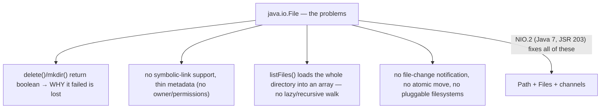
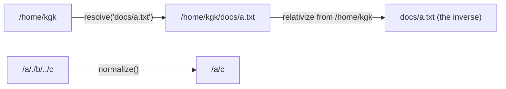
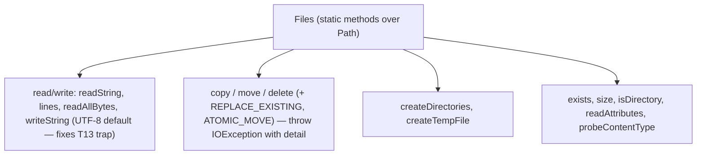
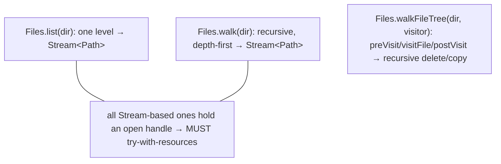
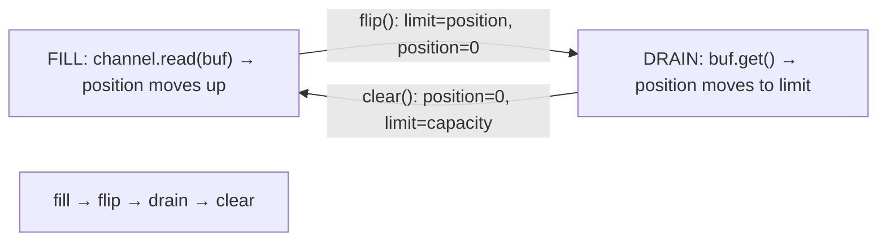
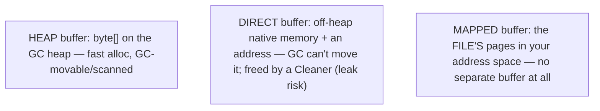
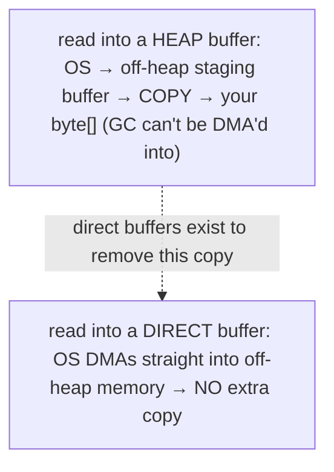
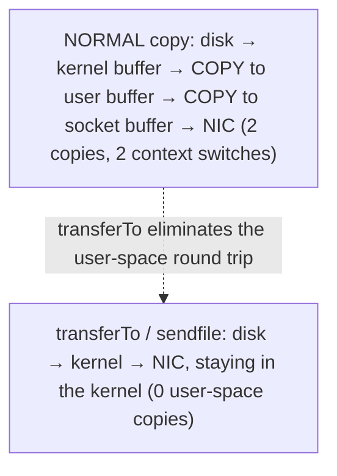
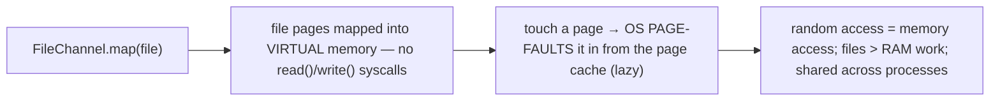
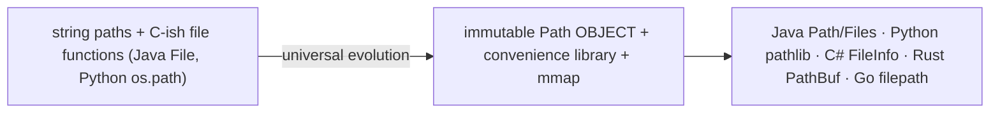

# NIO.2 (Path, Files, channels)

[T13](./T13-i-o-streams-byte-and-character.md) covered moving bytes and characters; this topic covers **naming and managing the files themselves**. The two together are Java's complete file story: streams for the *data*, NIO.2 for the *filesystem*. NIO.2 (Java 7, JSR 203) replaced the original `java.io.File` — a class so flawed that `file.delete()` returning `false` told you *nothing* about why it failed — with three things: **`Path`**, an immutable, manipulable representation of a file location; **`Files`**, a utility class of static methods that wrap T13's stream-and-charset boilerplate into one-line conveniences (`Files.readString`, `Files.lines`, `Files.copy`, `Files.walk`) *and* default to UTF-8, fixing the `FileReader` trap; and the lower-level **channels and buffers** (`FileChannel`, `ByteBuffer`) behind high-performance and memory-mapped I/O. For everyday file work, `Path` + `Files` is all you need; the channel layer is for when throughput matters.

The depth bar is **why direct and memory-mapped buffers exist — the copy that a heap buffer forces and a direct buffer avoids**. When you read a file into a heap `ByteBuffer` (backed by a `byte[]` on the GC heap), the OS *cannot* transfer data straight into it, because a moving garbage collector can relocate that array mid-transfer — so the JVM reads into an off-heap staging buffer and then **copies** it onto the heap. A **direct** `ByteBuffer` lives off-heap and pinned, so the OS can **DMA** straight into it with no intermediate copy — which is why high-throughput libraries use them. A **memory-mapped** file goes further: `FileChannel.map` puts the file's pages directly into your process's virtual address space, so reading the buffer is just a memory access and the OS faults pages in lazily through its page cache — no `read()` syscalls at all. And `transferTo` can invoke the kernel's **zero-copy** `sendfile` to move a file to a socket without ever entering user space. By the end you will manipulate paths, use the `Files` conveniences, walk and watch directory trees, drive the `ByteBuffer` flip/clear cycle, and explain in terms of DMA and page faults why the buffer you choose changes how many times your data gets copied.

> [!NOTE]
> Prerequisites: [I/O streams](./T13-i-o-streams-byte-and-character.md) (`L1/C02/T13`) — NIO.2 sits above these streams and `Files` wraps them; [try-with-resources](./T10-custom-exceptions-and-try-with-resources.md) (`L1/C02/T10`) — the `Stream`-returning `Files` methods hold an open handle and must be closed; [Big-O / memory hierarchy](./T08-collection-performance-characteristics-big-o.md) (`L1/C02/T08`) — direct buffers and `mmap` are about avoiding copies, the constant-factor lesson again; [Iterators](./T06-iterators-and-iterable.md) (`L1/C02/T06`) — `Path` is `Iterable`, and `Files.walk` returns a lazy `Stream`. Forward: [T15](./T15-date-time-api-java-time.md) (java.time), L3 (non-blocking socket channels & selectors).

## Why NIO.2 — `java.io.File` Was Not Enough

The original `java.io.File` (1996) aged badly, and NIO.2 was the fix:



`Files` methods **throw `IOException` with details** instead of returning a bare `false`; `Path` understands symbolic links and rich attributes; `Files.walk` traverses lazily; `WatchService` notifies on changes; `Files.move` can be atomic; and `FileSystems` lets the same API drive a ZIP archive or an in-memory filesystem. Old `File` lingers only for interop (`file.toPath()` / `path.toFile()`).

## `Path` — An Abstract, Immutable Location

A **`Path`** represents a file location — *not necessarily an existing file*. It is immutable, so it's safe to share and use as a map key, and it does **not touch the disk** until you pass it to a `Files` method:

```java
Path p = Path.of("/home", "kgk", "notes.txt");   // or Paths.get(...)
p.getFileName();      // notes.txt
p.getParent();        // /home/kgk
p.resolve("draft");   // /home/kgk/notes.txt/draft  (join)
Path base = Path.of("/home/kgk");
base.relativize(Path.of("/home/kgk/docs/a.txt"));  // docs/a.txt  (the inverse of resolve)
Path.of("/a/./b/../c").normalize();                // /a/c        (remove . and ..)
```

The core operations are **`resolve`** (join a child onto a base — the inverse of which is **`relativize`**, the relative path from one to another) and **`normalize`** (collapse `.`/`..`). `resolveSibling` replaces the last element; `toAbsolutePath`/`toRealPath` make it absolute (the latter resolves symlinks and requires the file to exist). `Path` implements `Iterable<Path>` (iterate its name elements — [T06](./T06-iterators-and-iterable.md)) and `Comparable<Path>`.



## `Files` — The Utility Class

`Files` is a class of **static methods** operating on `Path`s, and it is where NIO.2 earns its keep. The conveniences collapse T13's three-layer decorator stacks into one call:

```java
String text   = Files.readString(path);                 // whole file → String (UTF-8 by default!)
List<String> ls = Files.readAllLines(path);             // all lines
byte[] bytes  = Files.readAllBytes(path);               // whole file → byte[]
Files.writeString(path, "hello");                       // String → file
try (Stream<String> lines = Files.lines(path)) { ... }  // LAZY line stream — must close
BufferedReader br = Files.newBufferedReader(path);      // T13's buffered+decoded reader, in one call
```

Beyond read/write it offers file operations that report failures as exceptions: `copy`/`move`/`delete` (with options like `REPLACE_EXISTING`, `ATOMIC_MOVE`, `COPY_ATTRIBUTES`), `createFile`/`createDirectories`/`createTempFile`, and queries `exists`/`isDirectory`/`size`/`getLastModifiedTime`/`probeContentType`. Crucially, **`Files.readString` and `newBufferedReader` default to UTF-8** — the explicit fix for the `FileReader` default-charset trap from [T13](./T13-i-o-streams-byte-and-character.md).



## Directory Traversal

Reading a single file is easy; walking a tree is where `File` was worst and NIO.2 shines. Three lazy, `Stream`-based options plus a visitor:

- **`Files.list(dir)`** → `Stream<Path>` of the immediate children (one level).
- **`Files.walk(dir)`** → `Stream<Path>` of the whole subtree, depth-first (optional max depth).
- **`Files.find(dir, depth, matcher)`** → `walk` + a predicate.
- **`Files.walkFileTree(dir, visitor)`** → the **visitor** form: a `FileVisitor` with `preVisitDirectory`/`visitFile`/`visitFileFailed`/`postVisitDirectory`, each returning a `FileVisitResult` (`CONTINUE`/`SKIP_SUBTREE`/`TERMINATE`). Subclass `SimpleFileVisitor` and override what you need — this is how you recursively delete or copy a tree (delete files in `visitFile`, the now-empty dir in `postVisitDirectory`).



> [!WARNING]
> **Close the `Stream` from `Files.lines`/`list`/`walk`/`find`.** Unlike a `Stream` over a collection, these hold an **open file/directory handle**, and leaving them unclosed leaks file descriptors (the OS caps them). Always use `try`-with-resources ([T10](./T10-custom-exceptions-and-try-with-resources.md)): `try (Stream<Path> s = Files.walk(dir)) { ... }`.

The **`WatchService`** rounds out the API: register a directory for `ENTRY_CREATE`/`ENTRY_MODIFY`/`ENTRY_DELETE` events and `take()` the keys as changes happen (backed by OS facilities like `inotify`) — the basis of config hot-reload. And **`FileSystems.newFileSystem(zipPath)`** opens a ZIP/JAR *as a filesystem*, so the same `Path`/`Files` API reads entries inside it.

## Channels and `ByteBuffer` — The Lower Level

Beneath the conveniences, NIO works in terms of **channels** (connections to a file or socket) and **`ByteBuffer`s** (fixed-capacity buffers you read into and write out of). A `ByteBuffer` has four markers — `capacity` (size), `position` (next index), `limit` (first index off-limits), and `mark` — and the famous **flip/clear** cycle switches it between filling and draining:

```java
ByteBuffer buf = ByteBuffer.allocate(1024);
channel.read(buf);     // FILL: position advances as bytes arrive
buf.flip();            // SWITCH TO READ: limit = position, position = 0
while (buf.hasRemaining()) process(buf.get());   // DRAIN: position advances to limit
buf.clear();           // RESET TO FILL: position = 0, limit = capacity
```

The mental model is **fill → flip → drain → clear**. `flip()` prepares a just-filled buffer for reading; `clear()` prepares a drained buffer for the next fill; `compact()` keeps unread bytes; `rewind()` re-reads. A `ByteBuffer` also carries a **byte order** (`ByteOrder.BIG_ENDIAN`/`LITTLE_ENDIAN` — the endianness from L0), so `getInt()` decodes multi-byte values correctly.



## Memory — Path Objects, Heap vs Direct Buffers, Mapped Files

A `Path` is a small immutable object: the Unix implementation (`sun.nio.fs.UnixPath`) holds a `byte[]` of the path's bytes plus offsets to each name element; the Windows one holds a `String`. It carries no file content and touches no disk. `BasicFileAttributes` is a small snapshot (creation/modified/access times, size, flags) materialized by one `stat` call.

The interesting memory is the `ByteBuffer`, which comes in two kinds:

- **Heap buffer** (`ByteBuffer.allocate(n)`) — a Java object wrapping a `byte[]` **on the GC heap**, plus the position/limit/capacity/mark ints. Allocates fast, is scanned and movable by the GC.
- **Direct buffer** (`ByteBuffer.allocateDirect(n)`) — a `DirectByteBuffer` holding a **native memory address** to an **off-heap** allocation (outside the GC heap). It is not moved or scanned by the GC and is freed *non-deterministically* by a `Cleaner` when the buffer is collected — so allocating many is a native-memory leak risk; pool them.

A **`MappedByteBuffer`** (from `FileChannel.map`) is a direct buffer whose memory **is the file's pages** mapped into the process address space — there is no separate buffer to copy into; touching the buffer touches the file's page cache.



## Architecture — The Copy a Direct Buffer Avoids

Here is the payoff. When you read a file into a **heap** `ByteBuffer`, the OS cannot transfer data straight into it: a **moving garbage collector** may relocate the backing `byte[]` mid-transfer, which would corrupt the read. So the JVM reads into a temporary **off-heap** buffer and then **copies** those bytes onto the heap — an extra copy on every operation. A **direct** buffer is already off-heap and pinned, so the OS can **DMA** (direct memory access — the device writes to memory without the CPU) straight into it: **no intermediate copy**. That single avoided copy is why throughput-critical libraries (Netty, NIO servers) use direct buffers, accepting their slower allocation and `Cleaner`-based freeing.



Two further optimizations build on this. **Zero-copy `transferTo`**: `FileChannel.transferTo(pos, count, socketChannel)` asks the kernel to copy file pages **directly to the socket** via `sendfile(2)` — the data never enters user space, eliminating two copies and two context switches (this is the "zero-copy" mentioned in [T13](./T13-i-o-streams-byte-and-character.md), and how web servers ship static files fast).



**Memory-mapped files**: `FileChannel.map` maps the file's pages into virtual memory, so after the (cheap) mapping there are **no `read`/`write` syscalls** — accessing the `MappedByteBuffer` is plain memory access, and the OS **lazily page-faults** file pages in and writes dirty pages back through its page cache. This makes random access cheap, lets multiple processes share one copy, and handles files larger than RAM (only touched pages load) — at the cost of page-fault latency on first touch and `force()` to control when writes hit disk. It is how databases and search engines (Lucene) get their file performance.



## Cross-Language Perspective

Every modern language has made the same two moves NIO.2 made — from string paths to a `Path` *object*, and from C-ish file functions to a rich library — and they all expose memory-mapping:

| Language | Path object | File ops | Memory-map |
|---|---|---|---|
| **Java** | `Path` (`resolve`, `relativize`) | `Files` (static) | `FileChannel.map` → `MappedByteBuffer` |
| **Python** | `pathlib.Path` (`/` operator) | `os` / `shutil` / `Path.read_text` | `mmap` module |
| **C#** | `Path`/`FileInfo`/`DirectoryInfo` | `File` / `Directory` (static) | `MemoryMappedFile` |
| **Rust** | `Path` / `PathBuf` | `std::fs` | `memmap2` crate |
| **Go** | `path/filepath` | `os` | `syscall.Mmap` |

The standout parallel is **Python's `pathlib`**, the direct twin of NIO.2's `Path`: object-oriented paths with the `/` operator overloaded for `resolve` (`Path("home") / "kgk" / "notes.txt"`), `.name`/`.parent`/`.suffix` like `getFileName`/`getParent`, `.read_text()`/`.write_text()` mirroring `Files.readString`/`writeString`, and `.glob()`/`.rglob()` mirroring `Files.find`/`walk`. Python's journey from `os.path` (string functions) to `pathlib` (objects) is **exactly** Java's `File` → `Path` evolution, a decade apart. C# has the same split (`Path` string ops + `File`/`Directory` operations + `FileInfo` objects), Rust mirrors `&str`/`String` with `&Path`/`PathBuf`, and `mmap` is a universal OS primitive every language surfaces. The consensus is settled: **an immutable `Path` object plus a convenience library plus memory-mapping** — and NIO.2 (2011) was Java catching up to it.



## Common Mistakes

> [!WARNING]
> **Still using `java.io.File`.** New code should use `Path`/`Files` — better error reporting (exceptions, not `false`), symlinks, rich attributes, lazy traversal, atomic ops. Convert legacy `File` with `file.toPath()`.

> [!WARNING]
> **Not closing a `Files.lines`/`walk`/`list` stream.** These hold an open file/directory handle; leaking them exhausts the OS's file-descriptor limit. Always `try`-with-resources them ([T10](./T10-custom-exceptions-and-try-with-resources.md)).

> [!WARNING]
> **`readAllBytes`/`readString` on a huge file.** They load the entire file into memory — an `OutOfMemoryError` waiting to happen. Stream it with `Files.lines` or a `BufferedReader` instead.

> [!WARNING]
> **Confusing `resolve` with `resolveSibling`, or misusing `relativize`.** `resolve` appends a child; `resolveSibling` replaces the last element. `relativize` requires both paths to be the same type (both absolute or both relative) or it throws.

> [!WARNING]
> **Leaking direct buffers.** Direct/off-heap buffers are freed non-deterministically by a `Cleaner`, so allocating many small ones leaks native memory and can crash the process. Allocate few, large, and pooled.

> [!WARNING]
> **Assuming a mapped write is on disk.** A `MappedByteBuffer` write goes to the page cache; the OS flushes lazily. Call `force()` when you need durability, and remember `Path` operations never touch the disk at all — only `Files` calls do.

## Practice

> [!INTERVIEW]
> Common interview questions for this topic:
> 1. **Why NIO.2 over `java.io.File`?** Exceptions with detail (not booleans), symlinks, rich attributes, lazy/recursive traversal, atomic operations, a watch service, and pluggable filesystems.
> 2. **What is a `Path`?** An immutable, abstract file location (not necessarily existing); manipulated with `resolve`/`relativize`/`normalize`; it touches the disk only via `Files`.
> 3. **`resolve` vs `relativize`?** `resolve` joins a child onto a base; `relativize` is the inverse — the relative path from one to another.
> 4. **What does `Files` add over streams?** One-call read/write (`readString`, `lines`, `readAllBytes`), `copy`/`move`/`delete` with options, traversal, attributes — and UTF-8 by default, fixing the `FileReader` trap.
> 5. **How do you walk a directory tree?** `Files.walk` (lazy recursive `Stream`) or `Files.walkFileTree` (a `FileVisitor`); close the `Stream`-based ones.
> 6. **Why must you close `Files.lines`/`walk`?** They hold an open handle; not closing leaks file descriptors. Use `try`-with-resources.
> 7. **Heap vs direct `ByteBuffer`?** Heap is a `byte[]` on the GC heap; direct is off-heap native memory the OS can DMA into without an intermediate copy.
> 8. **Why does a direct buffer avoid a copy?** A moving GC could relocate a heap `byte[]` mid-transfer, so the OS can't DMA into the heap — it stages off-heap and copies. A direct buffer is already off-heap, so no copy.
> 9. **What is a memory-mapped file?** `FileChannel.map` puts file pages into virtual memory; access is plain memory access and the OS page-faults pages in lazily — great for large, random, or shared access.
> 10. **What is zero-copy / `transferTo`?** `FileChannel.transferTo` uses the kernel's `sendfile` to move file→socket without user-space buffers, removing copies and context switches.
> 11. **Explain the `ByteBuffer` flip/clear cycle.** Fill (position advances), `flip()` to read (limit=position, position=0), drain, `clear()` to fill again.
> 12. **What is `WatchService`?** OS-backed directory-change notification (create/modify/delete events).
> 13. **How do Python/C# compare?** Python `pathlib.Path` (`/` operator, `read_text`) + `mmap`; C# `Path`/`File`/`FileInfo` + `MemoryMappedFile` — the same Path-object + convenience-library + memory-map consensus.

1. **`Path` manipulation.** Build paths with `Path.of`; exercise `resolve`, `relativize`, `normalize`, `getParent`, `getFileName`; confirm they work on nonexistent paths (no disk access).

2. **`readString`/`writeString`.** Round-trip a non-ASCII string through `Files.writeString`/`readString`; confirm it survives — because `Files` defaults to UTF-8 (contrast the [T13](./T13-i-o-streams-byte-and-character.md) `FileReader` trap).

3. **`Files.lines` stream.** Read a file as a `Stream<String>` inside `try`-with-resources; filter and count lines; explain why the close matters.

4. **`Files.walk`.** Walk a directory tree and collect every `*.java` file into a list; bound the depth.

5. **`copy`/`move`.** Copy a file with `REPLACE_EXISTING`, then `move` it with `ATOMIC_MOVE`; observe the exception when the target exists without the option.

6. **Attributes.** Read a file's size and timestamps in one call via `Files.readAttributes(path, BasicFileAttributes.class)`.

7. **Recursive delete.** Implement a `SimpleFileVisitor` and `Files.walkFileTree` to delete a directory tree (files in `visitFile`, dirs in `postVisitDirectory`).

8. **`WatchService`.** Register a directory and print `ENTRY_CREATE`/`MODIFY`/`DELETE` events as you touch files in it.

9. **Heap vs direct buffer.** Allocate a `ByteBuffer.allocate(n)` and a `ByteBuffer.allocateDirect(n)`; check `isDirect()`; discuss when each is appropriate.

10. **flip/clear cycle.** Write three `int`s into a `ByteBuffer`, `flip()`, read them back; then `clear()` and reuse. Print `position`/`limit` at each step.

11. **Memory-mapped file.** `FileChannel.map` a file as a `MappedByteBuffer`; read a byte, modify a byte, `force()` it; confirm the change on disk.

12. **`transferTo`.** Copy a file using `FileChannel.transferTo` (or `Files.copy`); note that file→socket transfers can use OS zero-copy.

13. **ZIP filesystem.** Open a JAR with `FileSystems.newFileSystem` and list/read entries inside it using the same `Path`/`Files` API.

14. **Old vs new.** Take a `java.io.File`-based snippet (e.g. `file.delete()` with a boolean check) and rewrite it with `Files.delete`; compare the error reporting.

15. **End-to-end explain-it-back.** Reading a file into a heap `ByteBuffer` vs a direct one vs memory-mapping: (a) why the heap read forces an extra copy; (b) what DMA into a direct buffer avoids; (c) what `FileChannel.map` does differently and how page faults serve the data; (d) what `transferTo`/`sendfile` eliminates for file→socket; (e) the connection to the constant-factor/copy-avoidance lesson from [T08](./T08-collection-performance-characteristics-big-o.md)/[T13](./T13-i-o-streams-byte-and-character.md). Twelve sentences max.

## Recap

You should now be able to:

**Language layer.**

- Explain why NIO.2 replaced `java.io.File`, and manipulate `Path`s with `resolve`/`relativize`/`normalize` (knowing they never touch the disk).
- Use `Files` conveniences (`readString`, `lines`, `writeString`, `copy`/`move`, `createDirectories`) — with UTF-8 by default — and traverse trees with `walk`/`walkFileTree`, closing the `Stream`-based ones.
- Drive a `ByteBuffer` through the fill→flip→drain→clear cycle and register a `WatchService`.

**Memory layer.**

- Describe a `Path` as a small immutable object (no content, no disk), and distinguish a heap `ByteBuffer` (`byte[]` on the GC heap) from a direct one (off-heap, `Cleaner`-freed) and a mapped one (the file's pages).

**Architecture layer.**

- Explain why a heap-buffer read forces an extra copy (a moving GC can't be DMA'd into) and a direct buffer avoids it, and what `transferTo`/`sendfile` zero-copy eliminates.
- Describe memory-mapped files (pages in virtual memory, lazy page faults via the page cache) and when they win, and connect all of it to the copy-avoidance/constant-factor lesson from [T08](./T08-collection-performance-characteristics-big-o.md)/[T13](./T13-i-o-streams-byte-and-character.md).
- Recognize the OO-`Path` + convenience-library + memory-map design as the cross-language consensus (Python `pathlib`, C#, Rust, Go).

This **completes Java's file story** — [T13](./T13-i-o-streams-byte-and-character.md) streams for the bytes, T14 NIO.2 for the filesystem. The chapter now turns from *where data lives* to *what data is*, starting with the type every program gets wrong until it uses the right library: dates and times.

## Next

Continue to [Date/Time API (java.time)](./T15-date-time-api-java-time.md) — the modern temporal library, and one of the best-designed parts of the JDK. After files, the next perennially-hard data type is **time** — time zones, daylight saving, leap years, instants vs human calendars. Java's first two attempts (`java.util.Date` and `Calendar`) were notoriously broken — mutable, zero-based months, no time-zone clarity — and Java 8 replaced them with **`java.time`** (JSR 310, inspired by Joda-Time): an immutable, well-typed family — `Instant` (a machine timestamp), `LocalDate`/`LocalTime`/`LocalDateTime` (human date/time without a zone), `ZonedDateTime` (with a zone), `Duration`/`Period` (amounts of time), and `DateTimeFormatter`. T15 covers the model, the immutability-and-thread-safety payoff (the [T19](../C01-oop/T19-immutability-and-immutable-class-design.md) lesson applied), and the byte-level representation of an instant.
