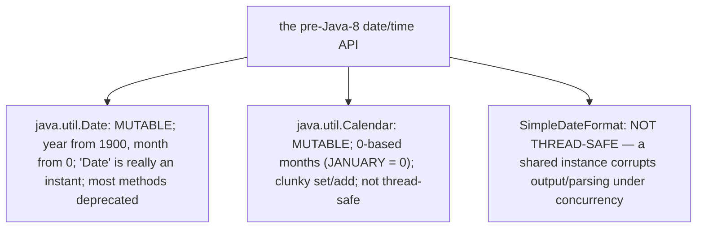
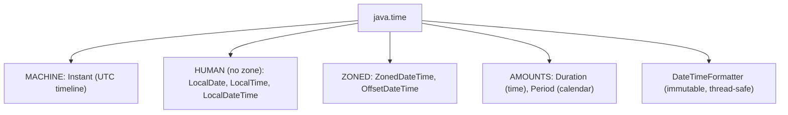
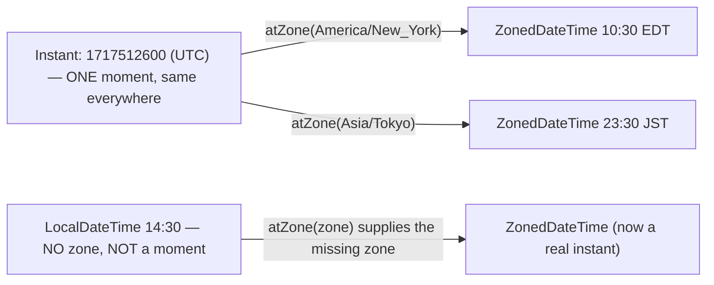
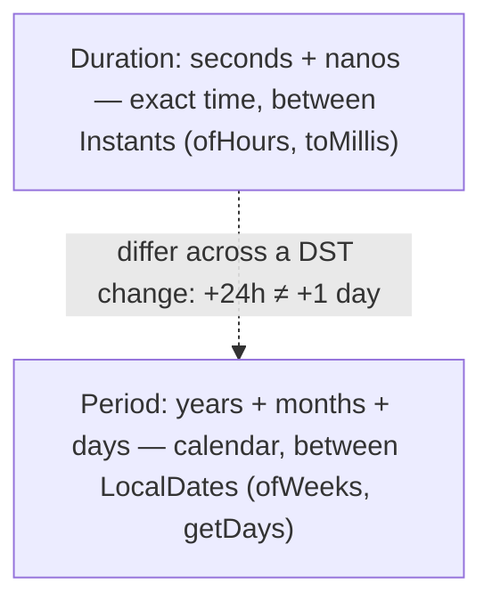
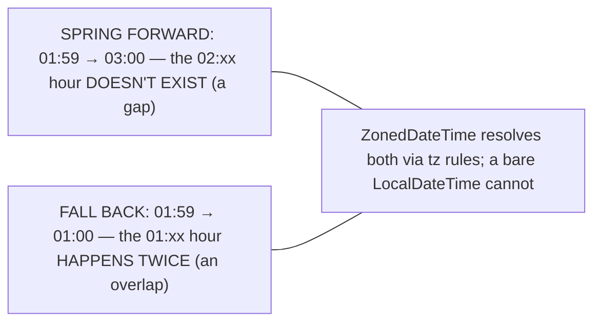
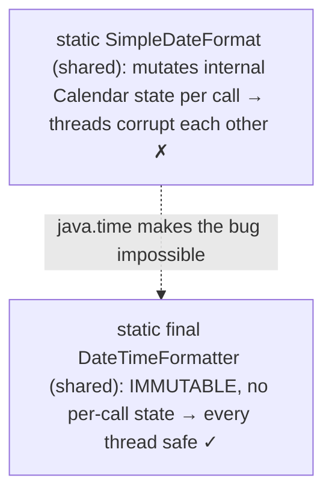
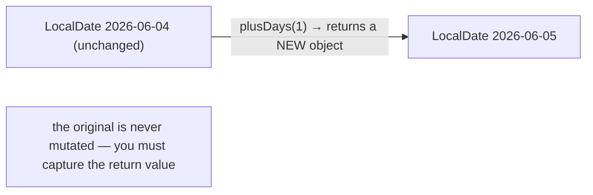
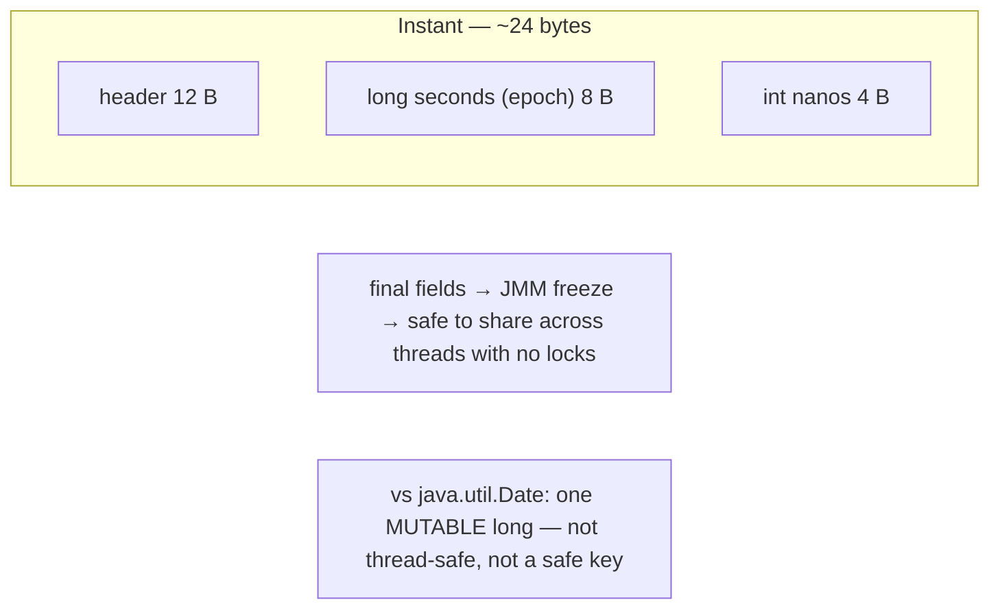
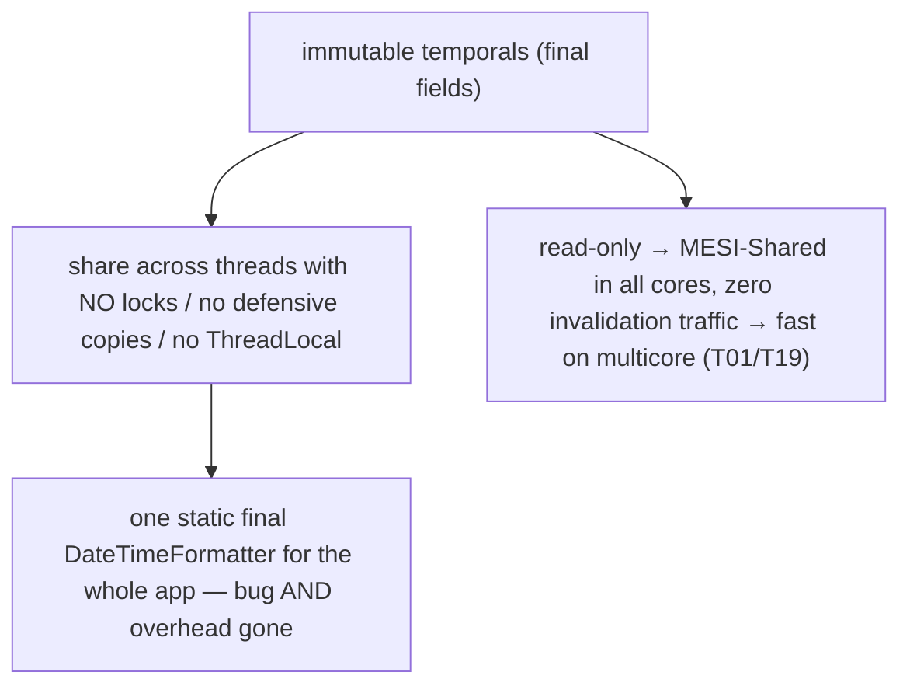
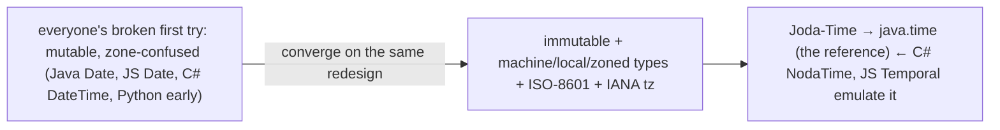

# Date/Time API (java.time)

After files, the next perennially-hard data type is **time** — time zones, daylight saving, leap years, the gap between a machine timestamp and a human calendar. Java got it wrong *twice* before getting it right. `java.util.Date` (1996) is mutable, counts years from 1900 and months from zero, and isn't really a date at all (it's an instant); `java.util.Calendar` (1997) kept the zero-based months and mutability while adding a clunky API; and `SimpleDateFormat` is *not thread-safe*, a single shared instance silently corrupting output under concurrency — one of the most-hit production bugs in Java's history. Java 8 swept all three away with **`java.time`** (JSR 310), designed by Stephen Colebourne from his battle-tested **Joda-Time** library. It is now widely considered the **gold-standard** date/time API, emulated by JavaScript's `Temporal` and C#'s NodaTime.

The depth bar is **the immutability that makes the whole library thread-safe, and the byte-level representation of an instant**. Every `java.time` type is **immutable** — `date.plusDays(1)` returns a *new* `LocalDate` and never mutates the original — which is the [T19](../C01-oop/T19-immutability-and-immutable-class-design.md) immutability lesson applied at scale: you can share an `Instant` or a `static final DateTimeFormatter` across threads with **zero synchronization**, because nothing can change underneath you. That single property fixes the `SimpleDateFormat` thread-safety disaster outright. And the model draws a sharp line between **machine time** and **human time**: an `Instant` is a point on the UTC timeline stored as a `long` of epoch-seconds plus an `int` of nanoseconds — ~12 bytes of state holding nanosecond precision — while a `LocalDateTime` is a human "wall clock" reading with *no* zone, and a `ZonedDateTime` ties the two together through the IANA time-zone rules that encode every DST transition in history. By the end you will pick the right type for "a timestamp" versus "a birthday" versus "a meeting in Tokyo," explain why immutability makes the formatter shareable, and describe what an `Instant` actually stores.

> [!NOTE]
> Prerequisites: [Immutability](../C01-oop/T19-immutability-and-immutable-class-design.md) (`L1/C01/T19`) — the design principle behind every `java.time` type and its free thread-safety; [enums](../C01-oop/T13-enum-types-with-fields-methods.md) (`L1/C01/T13`) — `Month`/`DayOfWeek` are enums; [equals/hashCode](../C01-oop/T10-equals-hashcode-tostring-contracts.md) (`L1/C01/T10`) — immutable temporals are safe map keys; [Object class](../C01-oop/T09-object-class-and-its-methods.md) (`L1/C01/T09`) — the field layout. Forward: [T16](./T16-regular-expressions.md) (regular expressions), [T20](./T20-math-bigdecimal-biginteger-random.md) (`BigDecimal`, another immutable value type).

## Why the Old API Was Broken

Three classes, three categories of failure — and knowing them explains every design choice in `java.time`:



`Date` pretends to be a calendar date but is actually a millisecond count, with `getYear()` returning the year *minus 1900* and `getMonth()` returning `0`–`11`. `Calendar` was meant to fix it but kept the zero-based months (`Calendar.JANUARY == 0` — the source of countless off-by-one bugs) and the mutability. Worst of all, `SimpleDateFormat` holds mutable internal `Calendar` state while it works, so a single instance shared across threads (the natural thing to do — `static final SimpleDateFormat FMT = ...`) produces garbled dates or throws under load, a heisenbug that passes every single-threaded test. The workaround was a `ThreadLocal<SimpleDateFormat>` or a fresh instance per call. `java.time` makes the bug *impossible*.

## The `java.time` Model

`java.time` (Java 8, JSR 310, by Joda-Time's author Stephen Colebourne) is a family of immutable types, each modeling exactly one temporal concept:

| Type | Models | Example |
|---|---|---|
| **`Instant`** | a point on the UTC timeline (machine time) | a log timestamp |
| **`LocalDate`** | a date, no time, no zone | a birthday: `2026-06-04` |
| **`LocalTime`** | a time, no date, no zone | an alarm: `07:30` |
| **`LocalDateTime`** | date + time, **no zone** | `2026-06-04T14:30` (but *where*?) |
| **`ZonedDateTime`** | date + time + zone | `2026-06-04T14:30 America/New_York` |
| **`Duration`** | a time amount (seconds/nanos) | `Duration.ofMinutes(90)` |
| **`Period`** | a calendar amount (years/months/days) | `Period.ofWeeks(2)` |
| **`DateTimeFormatter`** | immutable, thread-safe formatter/parser | `ofPattern("yyyy-MM-dd")` |

The design rests on four principles: **immutable** (thread-safe, shareable — every "change" returns a new object); **clear separation** of machine time, human local time, and zoned time (you pick the type that matches your meaning); **fluent** (`date.plusDays(1).withMonth(6)`); and **ISO-8601** as the default text format. Months are **1-based** at last (`Month.JUNE.getValue() == 6`, via the `Month` enum), and a `Clock` abstraction lets tests inject a fixed "now."



## Machine Time vs Human Time — The Central Distinction

The most important choice is **which type matches your meaning**, and it turns on machine-versus-human time:

- An **`Instant`** is *machine time* — an unambiguous point on the global UTC timeline. Use it for **timestamps**: when an event happened, log entries, "created at." It is the same instant everywhere on Earth.
- A **`LocalDateTime`** is *human time with no zone* — a wall-clock reading like "2:30 PM on June 4." It does **not** identify a moment: 2:30 PM happens at different instants in Tokyo and New York. Use it for times **not tied to a place** (a recurring "09:00 daily" alarm) or when the zone is supplied separately.
- A **`ZonedDateTime`** ties them together — a `LocalDateTime` *plus* a `ZoneId` — so it identifies a real instant **and** knows the local rules (DST). Use it when the **zone matters**: "the meeting is at 14:30 in New York."



The conversions are explicit: `instant.atZone(zoneId)` → `ZonedDateTime`; `zdt.toInstant()` → `Instant`; `localDateTime.atZone(zone)` → `ZonedDateTime`. The rule of thumb: **store and transmit `Instant`** (or `OffsetDateTime`), **display `ZonedDateTime`**, and reach for `LocalDate`/`LocalDateTime` only for genuinely zoneless concepts.

## `Duration` vs `Period` — Two Kinds of "Amount"

There are two ways to measure an *amount* of time, and they are **not** interchangeable:

- **`Duration`** is **machine time** — a count of seconds and nanoseconds. `Duration.between(twoInstants)`, `ofHours(2)`, `toMillis()`. It is exact, time-based.
- **`Period`** is **calendar time** — years, months, and days. `Period.between(twoLocalDates)`, `ofWeeks(2)`, `getMonths()`. It is human, date-based.

The difference bites at a **DST boundary**: adding `Period.ofDays(1)` to a `ZonedDateTime` advances the *calendar day* (the wall clock reads the same time tomorrow, even though only 23 or 25 actual hours passed across a DST change), while adding `Duration.ofHours(24)` advances *exactly 24 hours* (so the wall clock shifts by an hour across the transition). "One day" and "24 hours" are the same only when there's no DST change between them — which is exactly the subtlety `Period` and `Duration` exist to keep straight.



At a DST transition the wall clock itself jumps, which is exactly why a zone-aware type is required:



## `DateTimeFormatter` — Immutable and Thread-Safe

Formatting and parsing use **`DateTimeFormatter`**, and its headline feature is what `SimpleDateFormat` lacked: it is **immutable and thread-safe**, so you declare *one* `static final` instance and share it across the whole application:

```java
static final DateTimeFormatter FMT = DateTimeFormatter.ofPattern("yyyy-MM-dd HH:mm");

String text = FMT.format(zdt);                 // format — safe from any thread
LocalDateTime ldt = LocalDateTime.parse("2026-06-04 14:30", FMT);   // parse — also safe
```

Built-in ISO formatters (`ISO_LOCAL_DATE`, `ISO_INSTANT`, …) cover the standard formats, `ofPattern` builds custom ones, and `withLocale` localizes. Because the formatter holds no mutable state, there is no `ThreadLocal` dance, no per-call allocation, no corruption — the entire class of `SimpleDateFormat` concurrency bugs simply cannot occur.



## Immutability — Every "Change" Returns a New Object

The principle worth internalizing: **`java.time` objects never mutate**. Every method that looks like a mutation — `plusDays`, `minusHours`, `withYear`, `truncatedTo` — returns a **new** instance and leaves the original untouched (the [T19](../C01-oop/T19-immutability-and-immutable-class-design.md) wither pattern):

```java
LocalDate today = LocalDate.of(2026, 6, 4);
today.plusDays(1);          // returns a NEW date — and it's DISCARDED here
System.out.println(today);  // still 2026-06-04 — the original never changed
LocalDate tomorrow = today.plusDays(1);   // you must ASSIGN the result
```



> [!WARNING]
> **Forgetting to capture the result.** `date.plusDays(1);` on its own does nothing observable — it computes a new date and throws it away. This is the #1 `java.time` beginner mistake, and the compiler can't catch it. Always assign: `date = date.plusDays(1);`.

## Memory — What an `Instant` Stores

The byte-level representation rewards a look. An **`Instant` holds two fields**: a `long seconds` (epoch-seconds since `1970-01-01T00:00:00Z`, 8 bytes) and an `int nanos` (nanosecond-of-second, 0–999,999,999, 4 bytes) — **12 bytes of state**, plus a 12-byte object header and padding → ~24 bytes, carrying **nanosecond precision**. `LocalDate` packs an `int year` + a `short month` + a `short day`; `LocalDateTime` composes a `LocalDate` and a `LocalTime`; `ZonedDateTime` holds a `LocalDateTime`, a `ZoneOffset`, and a **`ZoneId`** — and that `ZoneId` is a **shared, interned** object (one instance per region, cached), so a million `ZonedDateTime`s in `America/New_York` reference the *same* zone object rather than duplicating it.

Crucially, **all these fields are `final`**, which triggers the JMM **final-field freeze** ([T19](../C01-oop/T19-immutability-and-immutable-class-design.md)/[T02](../C01-oop/T02-fields-methods-constructors-this.md)): once a constructor completes, any thread that obtains the reference is guaranteed to see the fully-initialized fields, with **no synchronization**. Contrast the old `java.util.Date`, which is a single **mutable** `long fastTime` — not thread-safe, not a safe map key, and the reason `Date` objects had to be defensively copied everywhere ([T18](../C01-oop/T18-object-cloning-and-cloneable.md)/[T19](../C01-oop/T19-immutability-and-immutable-class-design.md)).



## Architecture — Immutability Buys Free Thread-Safety

The architectural payoff is the [T19](../C01-oop/T19-immutability-and-immutable-class-design.md) lesson made concrete. Because every `java.time` object is immutable, **sharing one across threads needs no synchronization** — no locks, no defensive copies, no `ThreadLocal`. And it goes beyond "safe": read-only shared data is held **MESI-Shared** in every core's cache with **zero coherence-invalidation traffic**, whereas mutable shared data ping-pongs between cores on every write ([T01](../C01-oop/T01-classes-and-objects.md) cache lesson). So immutable temporals are not merely safe on multicore — they are *fast*.

The practical consequence is the **`DateTimeFormatter` win**: one `static final` formatter, shared by every thread, with no corruption and no per-call allocation — eliminating both the bug *and* the overhead of the old `SimpleDateFormat` workarounds. `Instant` arithmetic is cheap `long` math (`plusSeconds(n)` is `new Instant(seconds + n, nanos)`), and comparisons are `long` comparisons. The one genuinely complex part is **time zones**: `ZoneId` rules come from the **IANA Time-Zone Database** (`tzdata`, bundled with the JDK) via a `ZoneRulesProvider`, encoding every DST transition and historical offset change, so a zone conversion at a given instant looks up the rule in effect *then* — which is how `ZonedDateTime` adds a calendar day correctly across a "spring forward," and why a bare `LocalDateTime` (no rules) cannot. (One caveat: `java.time` uses a *smoothed* UTC that ignores leap seconds, keeping `Duration` math simple.)



## Cross-Language Perspective — Everyone's First Try Was Wrong

Date/time is subtle enough that almost every language shipped a broken first attempt and then converged on the same immutable, typed redesign:

| Language | The redesign | The machine/local split |
|---|---|---|
| **Java** | `java.time` (JSR 310) — based on **Joda-Time** | `Instant` vs `LocalDateTime` vs `ZonedDateTime` |
| **Python** | `datetime` + `zoneinfo` | **naive vs aware** datetimes |
| **C#** | `DateTimeOffset` + **NodaTime** + .NET 6 `DateOnly`/`TimeOnly` | `DateTimeKind` / NodaTime's `Instant`/`LocalDateTime` |
| **JavaScript** | **`Temporal`** (replacing the broken `Date`) | `Instant` / `PlainDateTime` / `ZonedDateTime` |
| **Rust** | `chrono` | `DateTime<Utc>` vs `NaiveDateTime` |

The throughline is striking. **Joda-Time** was Colebourne's third-party fix for Java's broken `Date`/`Calendar` years before Java 8 — and `java.time` is its standardized successor (same author, JSR 310), so Joda-Time's own docs now say "use `java.time`." **Python**'s `datetime` encodes the exact machine/local distinction as **naive** (no `tzinfo` = `LocalDateTime`) versus **aware** (has `tzinfo` = `ZonedDateTime`), and mixing them is its famous footgun. **C#**'s original `DateTime` was weak enough that Jon Skeet ported Joda-Time to .NET as **NodaTime**, and .NET 6 finally added `DateOnly`/`TimeOnly` — Java's `LocalDate`/`LocalTime`, eight years later. **JavaScript**'s `Date` is the notorious worst — mutable, zero-based months (like *old* Java!) — and its replacement **`Temporal`** adopts immutable types named almost identically to `java.time` (`Instant`, `PlainDateTime`, `ZonedDateTime`). The convergence is the lesson: a correct date/time library is **immutable, strongly typed (machine vs local vs zoned), ISO-8601, IANA-tz-backed** — and `java.time` is the reference implementation the others now emulate.



## Common Mistakes

> [!WARNING]
> **Using `Date`/`Calendar`/`SimpleDateFormat` in new code.** They're mutable, error-prone (zero-based months), and `SimpleDateFormat` isn't thread-safe. Use `java.time` throughout; convert legacy values with `Date.from(instant)` / `date.toInstant()`.

> [!WARNING]
> **A shared `SimpleDateFormat`.** A `static`/shared instance corrupts output or throws under concurrency. A `static final DateTimeFormatter` is immutable and safe to share — use it instead.

> [!WARNING]
> **`LocalDateTime` for a timestamp.** It has no zone, so "14:30" doesn't identify a moment — storing it loses the actual instant. Use `Instant` for machine timestamps, or `ZonedDateTime`/`OffsetDateTime` when the zone matters.

> [!WARNING]
> **Confusing `Period` and `Duration`.** `Period` is calendar amounts (days/months/years); `Duration` is time amounts (seconds/hours). Across a DST change, `+1 day` (`Period`) and `+24 hours` (`Duration`) differ — pick the one that matches your intent.

> [!WARNING]
> **Forgetting immutability.** `date.plusDays(1);` discards its result. Capture it: `date = date.plusDays(1);`.

> [!WARNING]
> **Assuming zero-based months.** `java.time` is **1-based** (`Month.JUNE.getValue() == 6`), unlike `Calendar`. Migrating old code without adjusting the month numbers introduces off-by-one bugs.

## Practice

> [!INTERVIEW]
> Common interview questions for this topic:
> 1. **Why was the old date/time API replaced?** `Date`/`Calendar` were mutable with zero-based months and 1900-offset years, and `SimpleDateFormat` wasn't thread-safe; `java.time` (JSR 310) fixed all of it.
> 2. **`Instant` vs `LocalDateTime`?** `Instant` is a machine timestamp on the UTC timeline; `LocalDateTime` is a human date+time with **no** zone (so it doesn't identify a moment).
> 3. **When do you use `ZonedDateTime`?** When the time zone matters — a real instant in a place, with DST handled by the IANA rules.
> 4. **`Duration` vs `Period`?** `Duration` is a time amount (seconds/nanos, between `Instant`s); `Period` is a calendar amount (years/months/days, between `LocalDate`s) — they differ across DST.
> 5. **Are `java.time` types mutable?** No — all immutable; `plusDays`/`withYear` return new instances, the original never changes.
> 6. **Why is immutability valuable here?** Free thread-safety (share without locks), safe map keys, and fast multicore reads — the [T19](../C01-oop/T19-immutability-and-immutable-class-design.md) lesson.
> 7. **Why was `SimpleDateFormat` dangerous, and what replaces it?** It's stateful and not thread-safe; a shared instance corrupts under concurrency. The immutable `DateTimeFormatter` is safe to share.
> 8. **How is an `Instant` stored?** A `long` of epoch-seconds plus an `int` of nanosecond-of-second — ~12 bytes of state, nanosecond precision.
> 9. **Are months zero- or one-based?** One-based (`Month.JANUARY.getValue() == 1`), unlike the old `Calendar`.
> 10. **How does `java.time` handle DST?** `ZonedDateTime` applies IANA tz rules, so a calendar-day add crosses a DST transition correctly; a bare `LocalDateTime` can't.
> 11. **What is `Clock` for?** Abstracting "now" so tests inject a fixed time (`Clock.fixed`) instead of calling `Instant.now()`.
> 12. **`ZoneId` vs `ZoneOffset`?** `ZoneId` is a region with DST rules (`America/New_York`); `ZoneOffset` is a fixed offset (`+05:00`) with no rules.
> 13. **How does `java.time` relate to other languages?** It's based on Joda-Time; Python has naive/aware `datetime`, C# has NodaTime (a Joda-Time port) + `DateOnly`/`TimeOnly`, and JS's `Temporal` emulates it — the cross-language gold standard.

1. **Pick the type.** For each — a log timestamp, a birthday, a daily 09:00 alarm, a meeting at 14:30 in New York — choose `Instant`/`LocalDate`/`LocalTime`/`ZonedDateTime` and justify it.

2. **Immutability.** Call `today.plusDays(1)` without assigning; print `today` and confirm it's unchanged. Then assign the result and print the new date.

3. **`Duration` between instants.** Compute `Duration.between(start, end)` for two `Instant`s; print `toMillis()` and `toSeconds()`.

4. **`Period` between dates.** Compute `Period.between(birthDate, today)`; print years/months/days.

5. **`DateTimeFormatter`.** Build a `static final` formatter with `ofPattern`; format a `ZonedDateTime` and parse it back. Note why declaring it `static final` is safe.

6. **Zone conversion.** Take a `ZonedDateTime` in `America/New_York` and convert to `Asia/Tokyo` with `withZoneSameInstant`; confirm the instant is identical and the wall time differs.

7. **DST boundary.** To a `ZonedDateTime` just before a spring-forward, add `Period.ofDays(1)` and separately `Duration.ofHours(24)`; observe the wall-clock results differ by an hour.

8. **The `SimpleDateFormat` bug.** Share one `SimpleDateFormat` across several threads parsing concurrently; observe corruption or exceptions. Replace it with a shared `DateTimeFormatter` and confirm the problem vanishes.

9. **`Clock` for tests.** Write code that takes a `Clock` and calls `Instant.now(clock)`; inject `Clock.fixed(...)` and assert a deterministic result.

10. **Legacy interop.** Convert a `java.util.Date` to an `Instant` and back with `toInstant()`/`Date.from(...)`.

11. **`Month` enum.** Use `Month.of(6)`, `Month.JUNE.getValue()`; confirm it's 1-based and contrast with `Calendar.JUNE` (== 5).

12. **`Instant` byte layout.** Use reflection to read the private `seconds` (long) and `nanos` (int) fields of an `Instant`; confirm the representation.

13. **Parse ISO-8601.** Parse `"2026-06-04T14:30:00Z"` with `Instant.parse`; format an `Instant` with `DateTimeFormatter.ISO_INSTANT`.

14. **`ChronoUnit`.** Use `ChronoUnit.DAYS.between(d1, d2)` and `ChronoUnit.HOURS.between(t1, t2)`; compare with `Period`/`Duration`.

15. **End-to-end explain-it-back.** For `static final DateTimeFormatter FMT = ...; ... FMT.format(instant)` called from many threads: (a) why sharing one formatter is safe here but a shared `SimpleDateFormat` is a bug; (b) what property of `java.time` guarantees it; (c) what an `Instant` stores in bytes; (d) why immutable temporals are fast (not just safe) on multicore; (e) why you'd store an `Instant` but display a `ZonedDateTime`. Twelve sentences max.

## Recap

You should now be able to:

**Language layer.**

- Explain why `Date`/`Calendar`/`SimpleDateFormat` were replaced (mutability, zero-based months, thread-unsafety) and use the `java.time` family instead.
- Choose the right type — `Instant` (machine timestamp), `LocalDate`/`LocalTime`/`LocalDateTime` (zoneless human time), `ZonedDateTime` (zoned) — and convert between them with `atZone`/`toInstant`.
- Distinguish `Duration` (time) from `Period` (calendar), and use the immutable, thread-safe `DateTimeFormatter`.

**Memory layer.**

- Describe an `Instant` as a `long` of epoch-seconds plus an `int` of nanoseconds (~12 bytes of state, nanosecond precision), with all fields `final` and `ZoneId` interned/shared.
- Contrast this with the single mutable `long` of `java.util.Date` and explain why the old type needed defensive copying.

**Architecture layer.**

- Explain that immutability gives free thread-safety (no locks, no `ThreadLocal`) and fast multicore reads (MESI-Shared, no invalidation), and that this is exactly what makes a `static final DateTimeFormatter` safe where `SimpleDateFormat` was not.
- Describe time-zone rules as IANA-tzdata-backed (DST, historical offsets) and why `ZonedDateTime` handles DST correctly while `LocalDateTime` cannot.
- Recognize `java.time` as the cross-language gold standard (Joda-Time lineage; Python naive/aware, C# NodaTime, JS `Temporal` all mirror it).

The next topic stays in the core-library arc with another text-processing workhorse: pattern matching over strings. [T16](./T16-regular-expressions.md) — regular expressions — covers the `Pattern`/`Matcher` API, how a regex compiles to a state machine, capturing groups, and the catastrophic-backtracking performance trap that turns a careless pattern into a denial-of-service.

## Next

Continue to [Regular expressions](./T16-regular-expressions.md) — pattern matching over text, and the engine behind validation, parsing, and search-and-replace. T16 opens the `Pattern`/`Matcher` API (compile once, match many — `Pattern` is immutable and thread-safe like `DateTimeFormatter`, `Matcher` is the stateful per-match worker), the regex syntax (character classes, quantifiers, anchors, groups), how a pattern **compiles to a finite-state machine** under the hood, capturing vs non-capturing groups and backreferences, and the **catastrophic backtracking** trap — where a pattern like `(a+)+$` on certain input goes exponential and becomes a ReDoS (regex denial-of-service) vulnerability, the same class of input-driven blow-up as the hash-flooding from [T04](./T04-map-hashmap-linkedhashmap-treemap.md).
