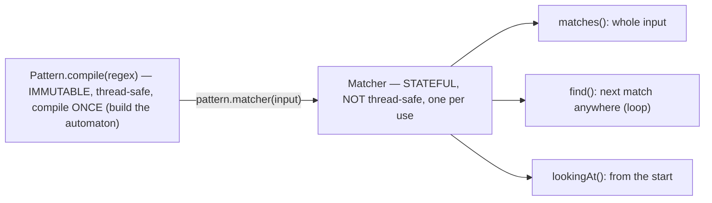
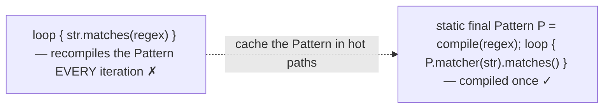
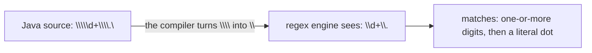
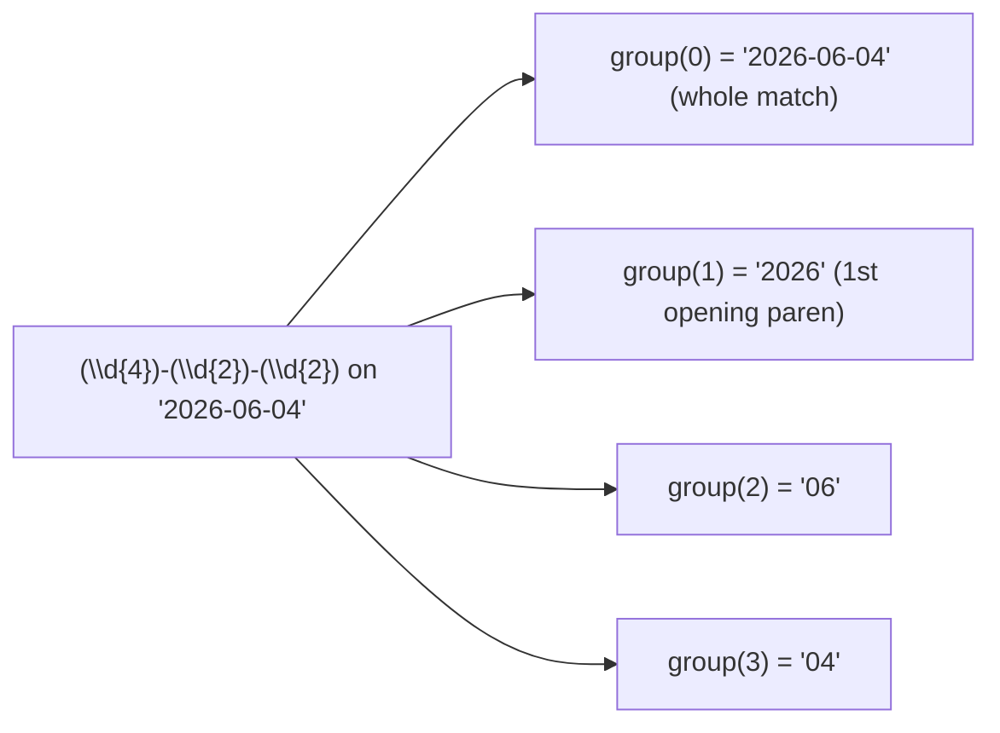
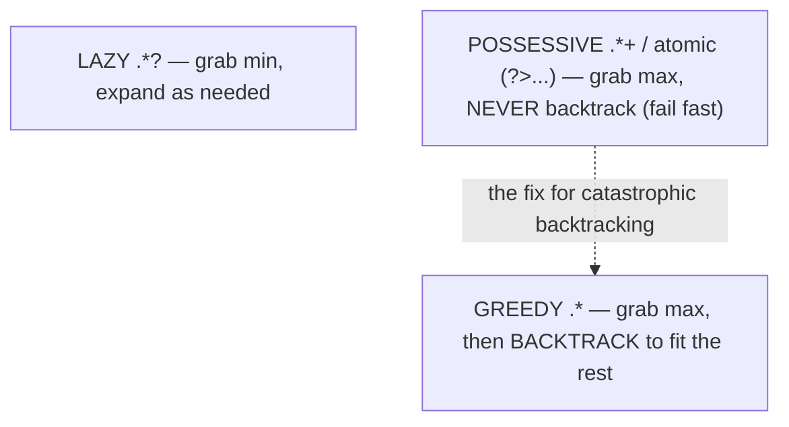
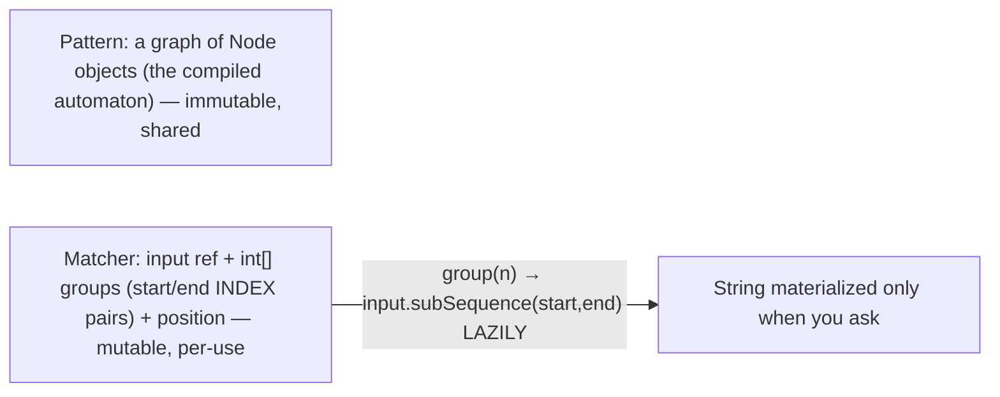
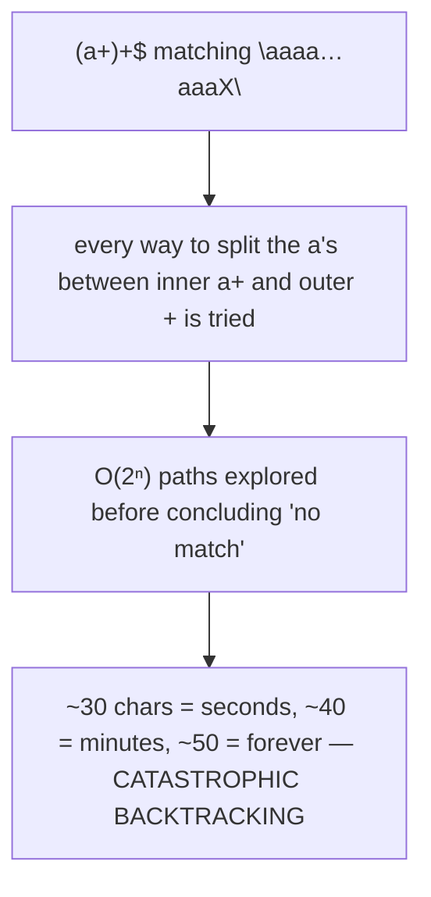
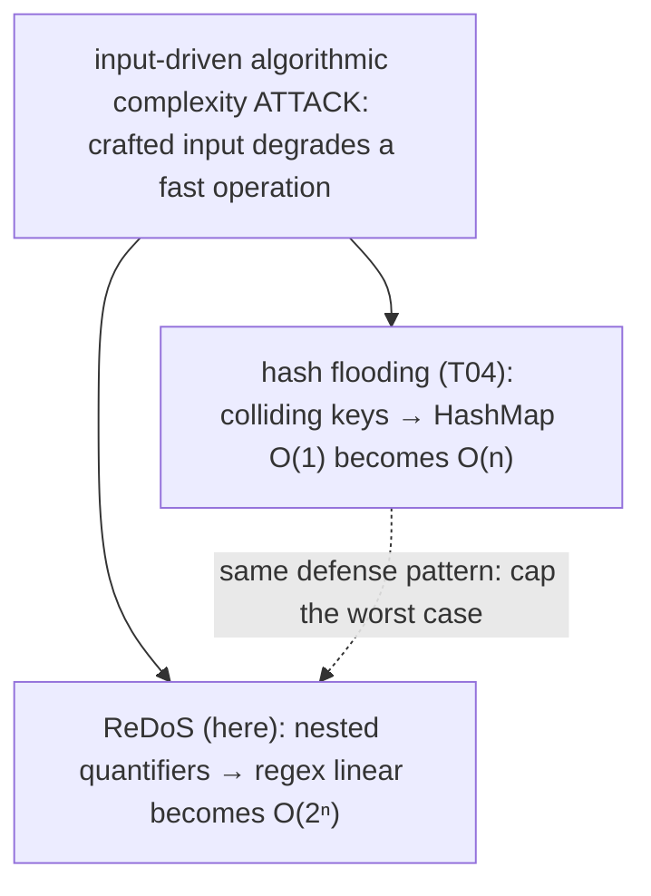
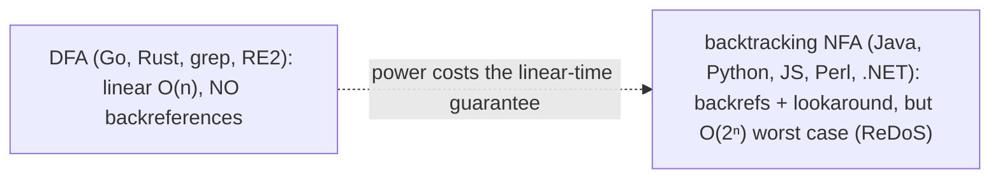

# Regular expressions

A **regular expression** is a pattern that describes a *set of strings* — and the engine that matches it is behind nearly every validation, parse, and search-and-replace you write. Java exposes it through two classes: **`Pattern`**, the immutable, thread-safe *compiled* regex (compile once, reuse — exactly like the `DateTimeFormatter` from [T15](./T15-date-time-api-java-time.md)), and **`Matcher`**, the stateful, per-use worker that runs one compiled pattern against one input. The syntax — character classes, quantifiers, anchors, groups, lookaround — is shared, with minor variations, across almost every language (the PCRE family), so what you learn here transfers directly to Python, JavaScript, and Perl.

The depth bar is **how a regex actually matches, and the catastrophic-backtracking trap that turns a careless pattern into a denial-of-service**. A regex compiles to a **finite automaton**, and Java — like Perl, Python, and JavaScript — uses a **backtracking NFA** engine, because backtracking is what enables backreferences and lookaround that a pure linear DFA cannot do. For ordinary patterns that runs in roughly linear time, but a pattern with **nested quantifiers** like `(a+)+$` on a non-matching input explores **exponentially** many ways to partition the characters — `O(2ⁿ)` — so a 40-character string can hang a thread for *minutes*. When that input is attacker-controlled, it is a **ReDoS** (regular-expression denial-of-service) vulnerability — the *same* class of input-driven algorithmic blow-up as the hash-flooding attack from [T04](./T04-map-hashmap-linkedhashmap-treemap.md), and the cause of real outages at Stack Overflow and Cloudflare. By the end you will use `Pattern`/`Matcher` correctly, read and write the core syntax, recognize and defuse catastrophic backtracking with possessive quantifiers, and explain why Go and Rust deliberately gave up backreferences to guarantee linear-time matching.

> [!NOTE]
> Prerequisites: [Date/Time](./T15-date-time-api-java-time.md) (`L1/C02/T15`) — `Pattern` is immutable and compile-once-share like `DateTimeFormatter`; [Map internals](./T04-map-hashmap-linkedhashmap-treemap.md) (`L1/C02/T04`) — hash flooding, the same input-driven complexity-attack pattern as ReDoS; [Big-O](./T08-collection-performance-characteristics-big-o.md) (`L1/C02/T08`) — `O(2ⁿ)` versus linear, the heart of the backtracking story; [Immutability](../C01-oop/T19-immutability-and-immutable-class-design.md) (`L1/C01/T19`) — why a `Pattern` is shareable but a `Matcher` is not. Forward: [T17](./T17-reflection.md) (reflection).

## `Pattern` and `Matcher`

The API splits the immutable, reusable part from the stateful, per-use part:

```java
Pattern p = Pattern.compile("(\\d{4})-(\\d{2})-(\\d{2})");   // compile ONCE — immutable, thread-safe
Matcher m = p.matcher("2026-06-04");                          // one Matcher per input — stateful, NOT thread-safe
if (m.matches()) {                                            // whole input must match
    String year = m.group(1);                                 // "2026" — capturing group 1
}
```

**`Pattern.compile`** builds the compiled automaton — relatively expensive — and the result is **immutable and thread-safe**, so you compile it **once** (ideally a `static final` field) and share it everywhere. **`pattern.matcher(input)`** produces a **`Matcher`**, which holds the match position and group boundaries — it is **stateful and not thread-safe**, so each thread/use gets its own. The three match methods differ in scope:

- **`matches()`** — the **entire** input must match the pattern.
- **`find()`** — find the **next** match anywhere in the input; call it in a `while` loop to iterate matches (it advances each time).
- **`lookingAt()`** — match from the **start**, but not necessarily to the end.



The `String` conveniences — `"abc".matches(regex)`, `str.replaceAll(regex, repl)`, `str.split(regex)` — **compile a fresh `Pattern` on every call**. That's fine for a one-off, but in a loop it recompiles the automaton each iteration; cache a `Pattern` instead.



## Regex Syntax

The building blocks, with Java's double-backslash escaping in mind:

| Construct | Syntax | Matches |
|---|---|---|
| **Character class** | `[abc]` `[a-z]` `[^abc]` | one of / range / **not** one of |
| **Predefined class** | `\d` `\w` `\s` (and `\D \W \S`) | digit / word char / whitespace (and negations) |
| **Quantifier** | `*` `+` `?` `{n}` `{n,m}` | 0+, 1+, 0-or-1, exactly n, n-to-m (greedy) |
| **Anchor** | `^` `$` `\b` | start / end / word boundary |
| **Alternation** | `a|b` | a or b |
| **Any char** | `.` | any char except newline (any, with `DOTALL`) |

> [!WARNING]
> **The double-backslash trap.** A backslash is a metacharacter in *both* Java string literals and regex, so a regex `\d` must be written `"\\d"` in source, a literal dot `"\\."`, and a literal backslash `"\\\\"`. Forgetting it gives a `PatternSyntaxException` or a silently wrong match. `Pattern.quote(s)` escapes an entire literal string with metacharacters.



## Groups and Lookaround

Parentheses do two jobs — **grouping** (for quantifiers/alternation) and **capturing** (remembering the matched text):

- **Capturing group `( … )`** — captures its match, retrieved by number (`group(1)`, left-to-right by opening paren; `group(0)` is the whole match).
- **Named group `(?<name> … )`** — `group("name")`, more readable than numbers.
- **Non-capturing group `(?: … )`** — groups *without* capturing (no number, slightly cheaper) — use it when you only need grouping.
- **Backreference `\1`** (or `\k<name>`) — match the *same text a prior group captured*; e.g. `(\w+)\s+\1` finds a doubled word. **Backreferences are why a backtracking engine is needed** — a linear DFA cannot remember and re-match captured text.
- **Lookaround** — zero-width assertions that test a position without consuming: lookahead `(?= … )`/`(?! … )` and lookbehind `(?<= … )`/`(?<! … )`. Used for rules like "contains a digit": `(?=.*\d)`.

```mermaid
flowchart TB
  G["( ... )"]
  G --> Cap["capturing: group(1), group(2)… (group(0) = whole match)"]
  G --> Named["(?&lt;y&gt;...) named: group(\"y\")"]
  G --> NonCap["(?:...) non-capturing: group, don't capture"]
  G --> Back["backreference \\1: re-match prior capture → REQUIRES backtracking"]
  G --> Look["(?=...)/(?&lt;=...) lookaround: zero-width assertions"]
```

Groups are numbered by **opening parenthesis, left to right**, with `group(0)` always the whole match:



## Greedy, Lazy, and Possessive Quantifiers

A quantifier's *appetite* controls both correctness and the backtracking behavior that the architecture section hinges on:

- **Greedy** (default) — `.*` matches **as much as possible**, then *backtracks* (gives characters back) to let the rest of the pattern match. `<.*>` on `"<a><b>"` matches the whole `"<a><b>"`.
- **Lazy / reluctant** (`?` suffix) — `.*?` matches **as little as possible**, expanding only as needed. `<.*?>` matches just `"<a>"`.
- **Possessive** (`+` suffix) — `.*+` matches as much as possible and **never backtracks**; if the rest then fails, the whole match fails. Possessive quantifiers and **atomic groups `(?> … )`** are the primary tool for **preventing catastrophic backtracking** (next section).



## Memory — A Compiled Automaton and Index-Based Groups

A compiled `Pattern` holds the regex translated into a **graph of `Node` objects** — Java's `java.util.regex` builds a linked tree where each node matches one construct (a node for a character class, a `Curly` for a quantifier, a `Branch` for alternation, a `GroupHead`/`GroupTail` pair, …), forming an NFA-style state machine. The `Pattern` is immutable (it caches the source string and flags), so sharing it across threads is free.

A `Matcher` carries the per-match state: a reference to the input, the append position, and — the interesting part — an **`int[] groups`** array storing the **start and end *indices*** of each captured group (`groups[0]`/`groups[1]` are the bounds of group 0, `groups[2]`/`groups[3]` of group 1, …, so `2 × (groupCount+1)` ints). Crucially, the groups are **indices, not strings**: `group(n)` materializes a `String` **lazily** via `input.subSequence(start, end)` only when you call it. So a pattern you only *test* with `matches()` — never extracting a group — allocates **no** substrings. The `Pattern` is the shared immutable program; the `Matcher` is the cheap, resettable, per-use cursor.



## Architecture — Backtracking, and the Catastrophic-Backtracking Trap

A regex describes a *regular language*, classically recognized by a finite automaton — and there are two engine families, a choice that defines everything about performance:

- A **DFA** (deterministic finite automaton) matches in a single **linear** `O(n)` pass and **never backtracks**, but **cannot do backreferences** or general lookaround (those aren't "regular"). `grep`, RE2, Go, and Rust use this.
- A **backtracking NFA** simulates the regex by trying alternatives and **backing up** on failure. It **can** do backreferences and lookaround — but the backtracking can explode. Perl, PCRE, **Java**, Python, JavaScript, and .NET use this.

Java uses a **backtracking NFA** because backreferences and lookaround are features programmers want. For most patterns it's roughly linear. The trap is **nested quantifiers**: in `(a+)+$`, the inner `a+` and the outer `+` both quantify the same characters, so on an input of many `a`s followed by a character that prevents the final match, the engine tries **every way to partition the `a`s** between the two quantifiers — exponentially many, `O(2ⁿ)`. Thirty `a`s is ~10⁹ paths (seconds); forty is minutes; fifty never finishes.



When the input is attacker-controlled — a regex validating an email, URL, or user-agent — this is a **ReDoS** (regular-expression denial-of-service): a 40-character string pins a CPU and hangs the request thread, taking the service down. It caused real outages (Stack Overflow 2016, Cloudflare 2019), and it is the **same class of input-driven algorithmic complexity attack as hash flooding** ([T04](./T04-map-hashmap-linkedhashmap-treemap.md)) — a normally-fast operation degraded to pathological by crafted input.



The fixes:

- **Rewrite** to remove the ambiguity (avoid a quantifier inside a quantifier; make alternations non-overlapping).
- **Possessive quantifiers** (`a++`) or **atomic groups** (`(?>a+)`) — they refuse to backtrack, so the exponential exploration can't happen; the match just fails fast.
- **Bound the input length** and/or run matching with a **timeout**.
- Use a **DFA engine** (RE2, via `re2j` on the JVM) — guaranteed linear time, at the cost of no backreferences.

This is the **DFA-vs-NFA trade-off** in one line: **linear-time safety (DFA, no backrefs) versus expressive power (NFA backtracking, backrefs/lookaround, ReDoS risk)** — you cannot have both. And **compile once**: `Pattern.compile` builds the automaton, so do it outside hot loops and reuse the `Pattern`.



## Cross-Language Perspective

Regex syntax is largely shared, but the *engine* choice splits the world:

| Language | Engine | Backreferences? | ReDoS-prone? |
|---|---|---|---|
| **Java / Python / JS / Perl / .NET** | backtracking NFA (PCRE family) | **yes** | **yes** |
| **Go** | RE2 | no | **no** (linear) |
| **Rust** (`regex`) | RE2-style | no | **no** (linear) |
| **grep / awk** | DFA | no | no |

Most languages — **Java, Python (`re`), JavaScript (`RegExp`), Perl, .NET** — share the **PCRE** (Perl-Compatible Regular Expressions) syntax and a **backtracking** engine, so they share both the power (backreferences, lookaround) *and* the ReDoS risk; JavaScript in particular is a notorious source of ReDoS CVEs in npm validation libraries, and .NET added a non-backtracking mode and a match timeout precisely to mitigate it. **Go and Rust deliberately chose RE2** (Russ Cox's engine, in the Ken Thompson lineage): a guaranteed **linear-time** automaton that **drops backreferences** — a conscious *safety-over-power* decision, so no Go regex can catastrophically backtrack. The deep insight (from Cox's "Regular Expression Matching Can Be Simple And Fast") is that true regular expressions *never* need backtracking — a Thompson NFA simulation is linear — but the convenience features people call "regex" (especially backreferences) **aren't regular**, which is the only reason mainstream engines backtrack at all. Knowing which engine your language uses tells you immediately whether an untrusted-input regex is a liability.

## Common Mistakes

> [!WARNING]
> **Compiling the `Pattern` in a loop.** `str.matches`/`replaceAll`/`split` recompile the automaton on every call. In hot paths, `Pattern.compile` once (a `static final` field) and reuse it.

> [!WARNING]
> **Catastrophic backtracking on untrusted input.** A pattern with nested quantifiers (`(a+)+`, `(.*)*`, `(\w+)*$`) can go exponential and become a ReDoS. Audit every regex that touches user input; prefer possessive quantifiers/atomic groups, bound the input, or use RE2.

> [!WARNING]
> **The double-backslash.** `\d` is `"\\d"` in Java source, a literal dot is `"\\."`. Use `Pattern.quote` to safely embed a literal string that may contain metacharacters.

> [!WARNING]
> **Sharing a `Matcher` across threads.** `Matcher` is stateful and not thread-safe. Share the immutable `Pattern`; create (or `reset`) a `Matcher` per thread/use.

> [!WARNING]
> **Using regex for HTML or nested structures.** True regular expressions cannot match arbitrarily nested or balanced delimiters. Use a real parser for HTML/XML/JSON, not a regex.

> [!WARNING]
> **Confusing `matches()` with `find()`.** `matches()` requires the *entire* input to match; `find()` searches for a substring. Anchoring (`^…$`) makes a `find` behave like a `matches`.

## Practice

> [!INTERVIEW]
> Common interview questions for this topic:
> 1. **`Pattern` vs `Matcher`?** `Pattern` is the immutable, thread-safe compiled regex (compile once, reuse); `Matcher` is the stateful, not-thread-safe per-match worker.
> 2. **`matches` vs `find` vs `lookingAt`?** `matches` = whole input; `find` = next match anywhere (loop); `lookingAt` = from the start, not necessarily to the end.
> 3. **Why compile a `Pattern` once?** Compiling builds the automaton (expensive); `String.matches`/`replaceAll` recompile every call — cache the `Pattern` in hot paths.
> 4. **The double-backslash escaping?** A backslash is a metacharacter in both Java strings and regex, so `\d` is written `"\\d"`.
> 5. **Capturing vs non-capturing group?** `(…)` captures (via `group(n)`); `(?:…)` groups without capturing (no number, slightly cheaper).
> 6. **What is a backreference and why does it matter?** `\1` re-matches a prior group's captured text; it requires a backtracking engine (a DFA can't do it).
> 7. **Greedy vs lazy vs possessive?** Greedy matches max then backtracks; lazy matches min; possessive matches max and never backtracks (prevents catastrophic backtracking).
> 8. **How does a regex match under the hood?** It compiles to a finite automaton; Java uses a backtracking NFA (for backrefs/lookaround) rather than a linear DFA.
> 9. **What is catastrophic backtracking / ReDoS?** Nested quantifiers on crafted input explore exponentially many paths — `O(2ⁿ)` — hanging the thread; a denial-of-service if the input is attacker-controlled.
> 10. **How do you prevent ReDoS?** Avoid nested quantifiers; use possessive quantifiers/atomic groups; bound input length / add a timeout; or use a DFA engine (RE2).
> 11. **Why does Java risk ReDoS when Go doesn't?** Java backtracks (for backreferences/lookaround); Go uses RE2 (linear-time DFA, no backreferences).
> 12. **Is `Matcher` thread-safe?** No — it's stateful; share the `Pattern`, not the `Matcher`.
> 13. **Can regex parse HTML / nested brackets?** No — regular expressions can't match arbitrary nesting; use a parser.

1. **`Pattern`/`Matcher` basics.** Compile a date pattern, run `matches`/`find`/`group` on inputs; extract the year/month/day groups.

2. **Cache vs recompile.** Benchmark a loop using `str.matches(regex)` versus a cached `static final Pattern`; quantify the compile overhead.

3. **Syntax drills.** Write patterns for: a 4-digit year, an identifier (`[A-Za-z_]\w*`), and a line of only whitespace; test each with classes, quantifiers, and anchors.

4. **Capturing groups.** Parse `2026-06-04` with `(\d{4})-(\d{2})-(\d{2})`; read `group(1)`/`group(2)`/`group(3)` and `group(0)`.

5. **Named groups.** Rewrite exercise 4 with `(?<year>\d{4})-(?<month>\d{2})-(?<day>\d{2})` and read `group("year")`.

6. **Non-capturing vs capturing.** Compare `(ab)+` and `(?:ab)+`; check `groupCount()` for each.

7. **Backreference.** Use `(\w+)\s+\1` to find doubled words in a sentence; explain why this needs backtracking.

8. **Lookaround.** Validate "at least one digit and one letter" with lookaheads `(?=.*\d)(?=.*[A-Za-z])`; extract a number after a `$` with lookbehind `(?<=\$)\d+`.

9. **Greedy vs lazy.** Match `<.*>` vs `<.*?>` against `"<a><b>"`; observe the difference and explain.

10. **`replaceAll` with references.** Reformat `2026-06-04` to `04/06/2026` using `replaceAll` and `$1`/`$2`/`$3`.

11. **Escaping.** Write Java string literals for the regexes `\d+\.\d+` and `C:\\temp`; confirm they compile.

12. **Reproduce catastrophic backtracking.** Run `Pattern.compile("(a+)+$").matcher("aaaaaaaaaaaaaaaaaaaaaaaaaaaaaa!").matches()`; time it as you add `a`s and watch it explode.

13. **Fix it.** Rewrite exercise 12 with a possessive quantifier (`(a++)+$` / `a++`) or an atomic group `(?>a+)`; confirm it now fails fast.

14. **Flags and streams.** Use `CASE_INSENSITIVE` and `MULTILINE`; iterate all matches with `Matcher.results()` (Java 9) as a `Stream<MatchResult>`.

15. **End-to-end explain-it-back.** For `(a+)+$` on `"aaaa…X"`: (a) why the engine explores exponentially many paths; (b) what a backtracking NFA does that a DFA doesn't; (c) why Java can't simply use a DFA; (d) how a possessive quantifier eliminates the blow-up; (e) the connection to hash flooding ([T04](./T04-map-hashmap-linkedhashmap-treemap.md)). Twelve sentences max.

## Recap

You should now be able to:

**Language layer.**

- Use `Pattern` (immutable, compile-once) and `Matcher` (stateful, per-use), and choose `matches`/`find`/`lookingAt` correctly.
- Read and write the core syntax (classes, quantifiers, anchors, alternation), handle Java's double-backslash escaping, and use capturing/named/non-capturing groups, backreferences, and lookaround.
- Control matching with greedy, lazy, and possessive quantifiers.

**Memory layer.**

- Describe a compiled `Pattern` as a shared, immutable graph of `Node` objects (the automaton), and a `Matcher` as a per-use cursor holding group boundaries as an `int[]` of indices, materializing group strings lazily.

**Architecture layer.**

- Explain that a regex compiles to a finite automaton, that Java uses a backtracking NFA (for backreferences/lookaround) rather than a linear DFA, and the DFA-vs-NFA power/safety trade-off.
- Explain catastrophic backtracking / ReDoS (nested quantifiers → `O(2ⁿ)`), recognize it as the same input-driven complexity attack as hash flooding ([T04](./T04-map-hashmap-linkedhashmap-treemap.md)), and defuse it with possessive quantifiers/atomic groups, input bounds, or RE2.
- Identify which languages risk ReDoS (backtracking: Java/Python/JS) versus which guarantee linear time (RE2: Go/Rust), and why backreferences force backtracking.

The next topic turns from matching strings to inspecting *types* at runtime — the JVM's introspection API. [T17](./T17-reflection.md) — reflection — covers reading a class's fields, methods, and annotations at runtime, constructing objects and invoking methods dynamically, and the performance and encapsulation costs that make reflection a powerful but double-edged tool (and the foundation of the frameworks — Spring, Jackson, JUnit — you'll meet later).

## Next

Continue to [Reflection](./T17-reflection.md) — runtime introspection of types, the mechanism behind every framework that "magically" wires your objects together. T16 matched patterns in *data*; T17 examines the *program itself* at runtime: obtaining a `Class<?>` object (the runtime type metadata first met in [T11](./T11-generics-basics.md)'s erasure discussion), reading fields/methods/constructors/annotations reflectively, instantiating and invoking dynamically, the `setAccessible` escape hatch that bypasses encapsulation (and the module-system limits on it from [T17-C01](../C01-oop/T17-java-module-system-jpms.md)), and the real costs — no compile-time checking, slower dispatch, and broken encapsulation — that make reflection the engine of Spring/Jackson/JUnit but a poor choice for ordinary code.
