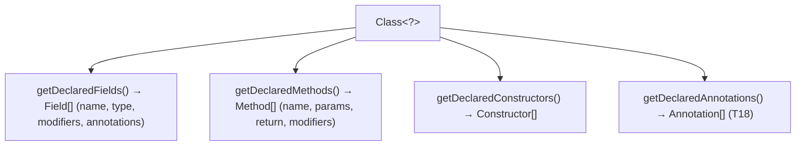
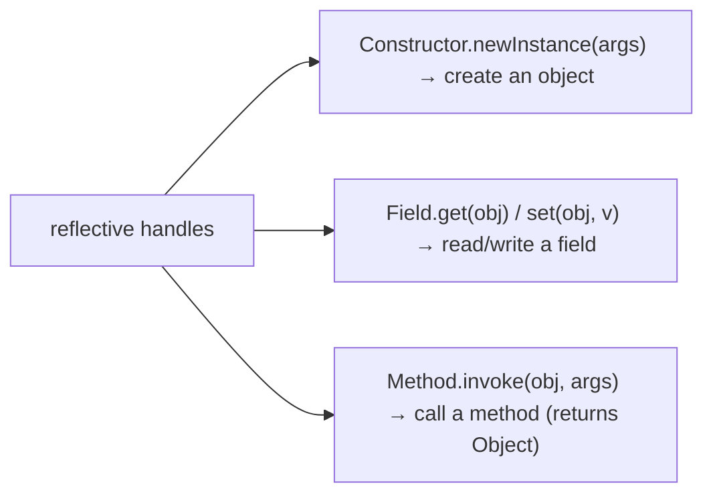
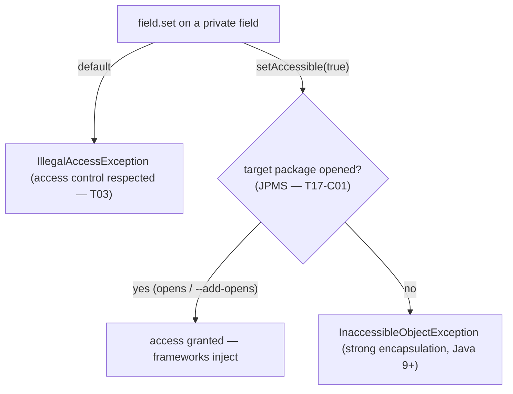
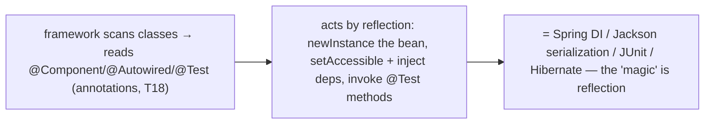
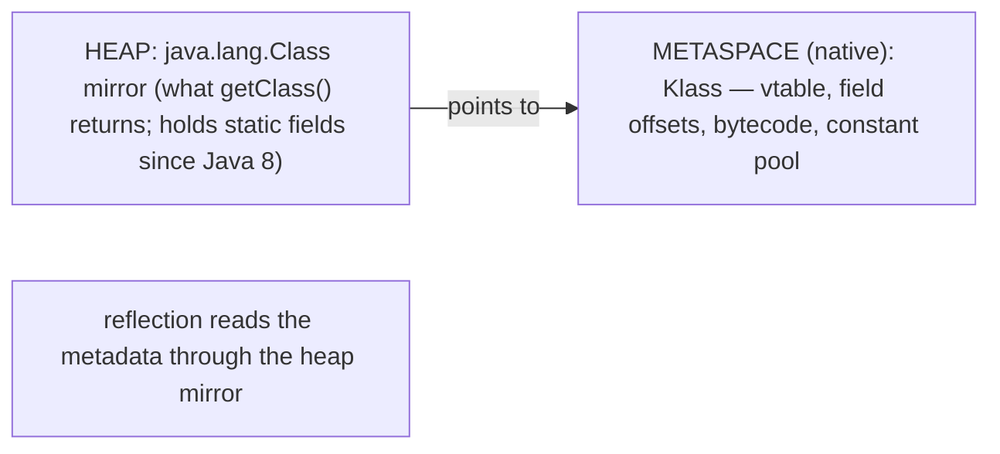
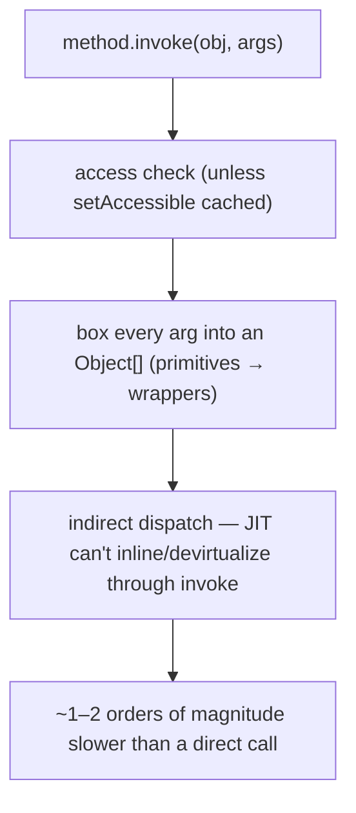
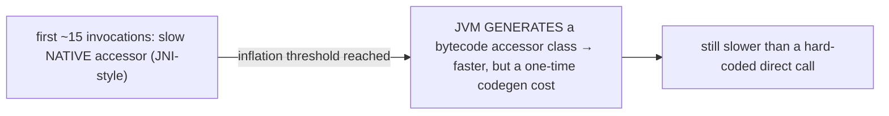
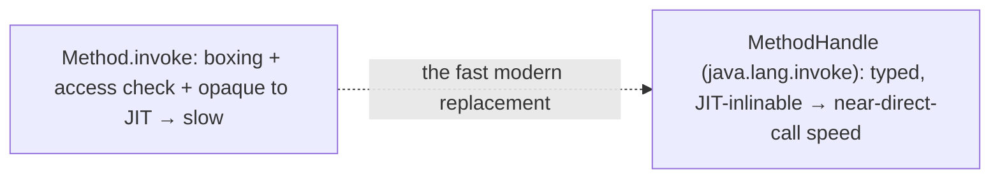
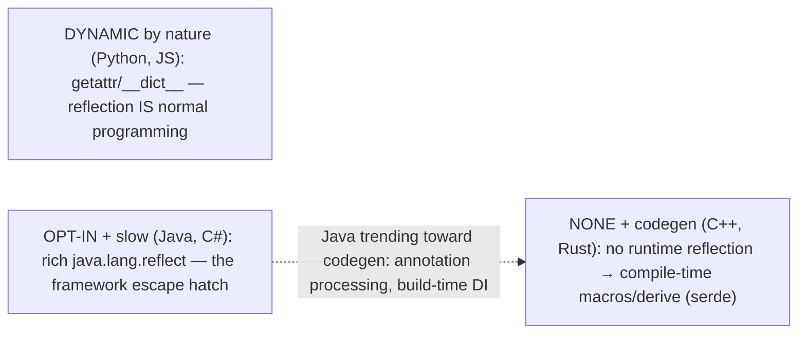

# Reflection

**Reflection** is the JVM's ability to inspect and manipulate a program's own types *at runtime* — to ask a class "what fields and methods do you have?", read and write those fields, call those methods, and construct objects, all by names and types discovered while the program runs rather than fixed at compile time. It is the engine behind the "magic" of every major Java framework: Spring wires your beans by reflecting over `@Autowired` fields, Jackson serializes your objects by reading their fields reflectively, JUnit finds your `@Test` methods by scanning for an annotation, and Hibernate maps rows to entities the same way. Strip away the magic and the pattern is always identical — **read metadata (often annotations, [T18](./T18-annotations-using-and-writing-meta-annotations.md)) and then act by reflection** (instantiate, invoke, inject).

The depth bar is **the cost of reflection and why it exists** — because reflection is powerful, slow, and dangerous in equal measure, and understanding the costs is what separates "frameworks may use it at startup" from "I should not use it in my request loop." A reflective `Method.invoke` is not a direct call: it resolves the target by name at runtime (so errors surface as runtime exceptions, not compile errors), **boxes every argument into an `Object[]`**, runs access checks, and — critically — **defeats the JIT's inlining and devirtualization** ([T05](../C01-oop/T05-method-overriding.md)/[T06](../C01-oop/T06-polymorphism-compile-time-vs-runtime.md)), so it runs one to two orders of magnitude slower than the equivalent direct call. The `Class` object you reflect over lives on the **heap** (the mirror), while the real VM type metadata (the `Klass`) sits in **Metaspace** ([T11](./T11-generics-basics.md)'s accuracy note made concrete), and `setAccessible(true)` is the escape hatch that bypasses `private` — reined in since Java 9 by the module system ([T17-C01](../C01-oop/T17-java-module-system-jpms.md)). By the end you will reflect over a class, invoke dynamically, understand why `MethodHandle` is the fast modern alternative, and know why the ecosystem is migrating toward compile-time codegen to escape reflection's costs.

> [!NOTE]
> Prerequisites: [Generics](./T11-generics-basics.md) (`L1/C02/T11`) — the `Class<?>` mirror and the erasure that reflection must work around (`getGenericType`); [Encapsulation](../C01-oop/T03-encapsulation-and-access-modifiers.md) (`L1/C01/T03`) — what `setAccessible` bypasses; [JPMS](../C01-oop/T17-java-module-system-jpms.md) (`L1/C01/T17`) — the `opens` rules that gate deep reflection; [Polymorphism](../C01-oop/T06-polymorphism-compile-time-vs-runtime.md) (`L1/C01/T06`) — why reflective dispatch defeats the optimizations of normal calls, and `MethodHandle`. Forward: [T18](./T18-annotations-using-and-writing-meta-annotations.md) (annotations — reflection's partner, the metadata frameworks read).

## The `Class` Object — The Entry Point

Every loaded type has exactly one **`java.lang.Class`** object, and it is the gateway to all reflection. You obtain it three ways:

```java
Class<?> c1 = obj.getClass();                  // the runtime class of an instance (T09)
Class<String> c2 = String.class;               // a class literal — compile-time, for a known type
Class<?> c3 = Class.forName("com.example.Foo"); // by name string — dynamic; loads the class if needed
```

`getClass()` returns the runtime type of an existing object ([T09](../C01-oop/T09-object-class-and-its-methods.md)); the `.class` literal names a type known at compile time; and `Class.forName(String)` resolves a class from a **runtime string** — the dynamic case that lets a framework load a class whose name it reads from a config file. From a `Class` you can ask `getName`, `getSuperclass`, `getInterfaces`, `getModifiers`, `isInterface`/`isEnum`/`isRecord`, and reach every member.

```mermaid
flowchart TB
  Ways["getting a Class&lt;?&gt;"]
  Ways --> A["obj.getClass() — runtime type of an instance"]
  Ways --> B["ClassName.class — compile-time literal"]
  Ways --> C["Class.forName(\"fqn\") — dynamic, by name string (loads if needed)"]
  A --> Gate["the gateway to all reflection: fields, methods, constructors, annotations"]
  B --> Gate
  C --> Gate
```

## Introspection — Reading a Type's Members

The first half of reflection is **introspection**: reading metadata. Three method families return reflective member objects, each with a `getDeclared…` variant (all members declared in *this* class, any access) and a plain variant (public members, including inherited):

```java
Class<?> c = user.getClass();
Field[]  fields  = c.getDeclaredFields();        // all fields declared here (any access)
Method[] methods = c.getDeclaredMethods();
Constructor<?>[] ctors = c.getDeclaredConstructors();
Annotation[] annos = c.getDeclaredAnnotations();  // T18

Field f = c.getDeclaredField("email");
f.getType();                                      // String.class — the ERASED type
f.getGenericType();                               // the declared generic (from the Signature attribute — T11/T12)
Modifier.isPrivate(f.getModifiers());             // decode the modifier bits
```

Each `Field`/`Method`/`Constructor` exposes its name, type(s), modifiers, and annotations. Note the generics caveat: `getType()` returns the **erased** type ([T11](./T11-generics-basics.md)), so a `List<String>` field reports `List`; to recover the declared `List<String>` you read `getGenericType()`, which consults the class file's `Signature` attribute.



## Dynamic Invocation — Acting on a Type

The second half is **doing**: reading and writing fields, calling methods, and constructing objects, all by the reflective handles:

```java
Constructor<User> ctor = User.class.getDeclaredConstructor(String.class);
User u = ctor.newInstance("ada@example.com");     // create an object dynamically

Field email = User.class.getDeclaredField("email");
String v = (String) email.get(u);                 // read a field
email.set(u, "grace@example.com");                // write a field

Method greet = User.class.getDeclaredMethod("greet", String.class);
Object result = greet.invoke(u, "hello");         // call a method dynamically
```

`Field.get`/`set` read/write (pass `null` as the object for a `static` field; `getInt`/`setInt` avoid boxing for primitives). `Method.invoke(receiver, args…)` calls the method and returns its result as an `Object` (a thrown exception is wrapped in an `InvocationTargetException` — the real cause is `getCause()`, [T09](./T09-exceptions-try-catch-finally-checked-vs-unchecked.md)). `Constructor.newInstance(args…)` runs the constructor (prefer it over the deprecated `Class.newInstance()`, which is no-arg-only and swallows exceptions).



## `setAccessible` and the JPMS Gate

By default reflection **respects access control** ([T03](../C01-oop/T03-encapsulation-and-access-modifiers.md)): `field.set` on a `private` field throws `IllegalAccessException`. The escape hatch is **`setAccessible(true)`**, which suppresses the check so frameworks can inject into private fields and call private methods — the basis of dependency injection. But since Java 9 the **module system** ([T17-C01](../C01-oop/T17-java-module-system-jpms.md)) reins it in: deep reflection into another module's package only works if that module **`opens`** the package (`opens com.example;` in `module-info`, or `--add-opens` at launch); otherwise you get an **`InaccessibleObjectException`**. This is why reflection-heavy frameworks (Spring, Hibernate) document `--add-opens` flags or require *open modules*.



The combination — read annotations, then `setAccessible` + `newInstance`/`invoke`/`set` — *is* how the frameworks work:



## Memory — The Heap Mirror and the Metaspace `Klass`

Reflection exposes a two-layer reality. The **`java.lang.Class` object you reflect over is the *mirror*, and it lives on the heap** — and since Java 8, a class's `static` fields live *in* that mirror on the heap, **not** in Metaspace or the removed PermGen ([T11](./T11-generics-basics.md) accuracy note). The *real* VM type metadata — the **`Klass`** (vtable, itable, field offsets, constant pool, method bytecode — [T01](../C01-oop/T01-classes-and-objects.md)/[T05](../C01-oop/T05-method-overriding.md)/[T06](../C01-oop/T06-polymorphism-compile-time-vs-runtime.md)) — lives in **Metaspace** (native, off-heap memory, since Java 8). The heap mirror holds a pointer to the native `Klass`; `getClass()` returns the mirror, and reflection reads through it into the metadata.



A practical memory pitfall: `getDeclaredFields()`/`getDeclaredMethods()` **clone their arrays on every call** (a defensive copy, because `setAccessible` makes the elements mutable). So repeatedly looking up the same `Method` allocates a fresh array each time — **cache** the `Field`/`Method`/`Constructor` objects you reuse rather than re-querying the `Class`.

## Architecture — Why Reflection Is Slow, and the Fast Alternative

A reflective call costs far more than a direct one, for compounding reasons:

- **No compile-time checking.** The target is resolved by name and type *at runtime*, so mistakes become runtime exceptions (`NoSuchMethodException`, `IllegalAccessException`, `IllegalArgumentException`) — and you lose the compiler, IDE navigation, and safe refactoring.
- **`Method.invoke` is not a direct call.** It performs an access check, **boxes every argument into an `Object[]`** (each primitive becomes a wrapper — [T01](../C01-oop/T01-classes-and-objects.md) boxing cost), unboxes inside, and boxes the return value — all per call.
- **Inflation.** The JVM's reflection implementation uses a slow **native** accessor for the first ~15 invocations (the *inflation threshold*), then **generates a bytecode accessor** class that calls the target more directly — faster, but with a one-time generation cost and still slower than a hard-coded call.
- **It defeats the JIT.** The compiler generally cannot see through `Method.invoke` to **inline or devirtualize** the target ([T05](../C01-oop/T05-method-overriding.md)/[T06](../C01-oop/T06-polymorphism-compile-time-vs-runtime.md)), so the optimizations that make ordinary calls nearly free do not apply.



The dispatch itself changes as a call site warms up — the *inflation* mechanism:



The result is fine for **framework startup** (DI wiring happens once at boot) but bad in a **hot loop** (per-request, per-element). Three mitigations, in order of power: **cache** the reflective objects; call **`setAccessible(true)` once** to skip the per-call access check; and — the real fix — use **`MethodHandle`/`VarHandle`** (`java.lang.invoke`, the [T06](../C01-oop/T06-polymorphism-compile-time-vs-runtime.md) `invokedynamic` machinery). A `MethodHandle` is a typed, directly-invokable reference that the **JIT *can* inline and optimize** to near-direct-call speed — it is the modern, fast alternative to reflective `invoke`, and the basis of lambdas, record `ObjectMethods`, and string concatenation under the hood.



Two more costs round out the picture. **Encapsulation**: `setAccessible` breaks the access guarantees of [T03](../C01-oop/T03-encapsulation-and-access-modifiers.md) — a "private" field is no longer private — which is part of why JPMS added strong encapsulation. **Ahead-of-time compilation**: reflection resolves members by string at runtime, which **defeats dead-code elimination and AOT** — GraalVM native-image must be *told* (via `reflect-config.json`) every reflectively-accessed member, because it cannot see them statically. This is the central reason the ecosystem is migrating away from runtime reflection (next section).

## Cross-Language Perspective

Where reflection sits in a language depends on whether the language is dynamically or statically typed, and whether it compiles to a managed runtime or to native code:

| Language | Runtime reflection | Style |
|---|---|---|
| **Java** | rich, opt-in (`java.lang.reflect`) | slow escape from static typing |
| **C#** | rich (`System.Reflection` + `Reflection.Emit`) | near-identical to Java |
| **Python** | reflective **by nature** | `getattr`/`setattr`/`__dict__`/`inspect` — idiomatic |
| **JavaScript** | reflective by nature | `Reflect`, `Proxy`, `Object.keys` |
| **Go** | yes, verbose (`reflect`) | used sparingly (e.g. `encoding/json`) |
| **C++ / Rust** | essentially **none** | compile-time codegen instead |

The deep contrast is **dynamic-by-nature versus opt-in-and-slow versus none-plus-codegen**. **Python** (and JavaScript) are reflective *by default* — because they are dynamically typed, `getattr(obj, name)`, `obj.__dict__`, and the `inspect` module are just normal programming, not a special slow API; there is no "reflection cost" distinction because everything is already dynamic. **Java and C#** are statically typed managed runtimes, so reflection is a rich but *opt-in, slow* escape hatch their frameworks lean on. **C++ and Rust** compile to native code and have **essentially no runtime reflection** — C++'s RTTI is just `typeid`/`dynamic_cast`, and Rust's `Any` gives only limited downcasting — so libraries that need reflection-like behavior (serialization) use **compile-time codegen**: C++ macros/templates, and Rust's `#[derive(Serialize)]`, where `serde` generates the serialization code at compile time, completely avoiding runtime reflection. That compile-time approach is exactly where **Java is now heading**: annotation processing ([T18](./T18-annotations-using-and-writing-meta-annotations.md)) and build-time dependency injection (Dagger, Micronaut, Quarkus) generate wiring code at *compile* time instead of reflecting at *startup* — cutting boot time and memory and enabling GraalVM native images. The reflection-heavy framework era is giving way to compile-time frameworks, driven by exactly the costs above.



## Common Mistakes

> [!WARNING]
> **Using reflection where ordinary code works.** Reflection is a last resort — slower, unchecked at compile time, and invisible to IDE navigation, refactoring, and static analysis. Prefer interfaces, polymorphism, factories, or `MethodHandle`; reach for reflection only when the type genuinely isn't known until runtime.

> [!WARNING]
> **Not caching reflective objects.** `getDeclaredFields`/`getDeclaredMethods` clone their arrays on every call. Look up the `Field`/`Method` once and cache it; never re-query inside a loop.

> [!WARNING]
> **Reflection in a hot path.** A reflective `invoke` is 1–2 orders of magnitude slower than a direct call. If it must run per-request or per-element, use a cached `MethodHandle` or restructure to avoid reflection entirely.

> [!WARNING]
> **Casual `setAccessible(true)`.** It breaks encapsulation ([T03](../C01-oop/T03-encapsulation-and-access-modifiers.md)) and can corrupt invariants or expose secrets. Use it deliberately, and expect `InaccessibleObjectException` across module boundaries without `opens`/`--add-opens` ([T17-C01](../C01-oop/T17-java-module-system-jpms.md)).

> [!WARNING]
> **Assuming reflection sees generics.** `getType()` returns the erased type ([T11](./T11-generics-basics.md)); use `getGenericType()` (the `Signature` attribute) to recover the declared `List<String>`.

> [!WARNING]
> **`Class.newInstance()`.** It is deprecated — no-arg only and it swallows constructor exceptions. Use `getDeclaredConstructor(...).newInstance(...)`.

## Practice

> [!INTERVIEW]
> Common interview questions for this topic:
> 1. **What is reflection?** Runtime inspection and manipulation of types — reading fields/methods/annotations and invoking/instantiating dynamically, by names/types discovered at runtime.
> 2. **How do you get a `Class` object?** `obj.getClass()`, `ClassName.class`, or `Class.forName("fqn")`.
> 3. **`getDeclaredMethods` vs `getMethods`?** `getDeclared*` = all members declared in this class (any access); `get*` = public members including inherited.
> 4. **What does `setAccessible(true)` do, and its limit?** Bypasses access control to reach private members; under JPMS it needs the target package opened, else `InaccessibleObjectException`.
> 5. **Why is reflection slow?** No compile-time checks; `Method.invoke` boxes args into an `Object[]`, runs access checks, and defeats JIT inlining; inflation uses a native then generated accessor.
> 6. **What's the faster alternative?** `MethodHandle`/`VarHandle` (`java.lang.invoke`) — JIT-inlinable, near-direct-call speed.
> 7. **Where do the `Class` object and static fields live?** On the heap (the mirror, since Java 8); the VM `Klass` metadata is in Metaspace (native).
> 8. **Why cache `Field`/`Method`?** `getDeclaredFields`/`Methods` clone the array on every call — re-querying allocates and is wasteful.
> 9. **Can reflection see generic types?** Not from `getType()` (erasure); use `getGenericType()` (the `Signature` attribute).
> 10. **Which frameworks use reflection and how?** Spring (DI), Jackson/Gson (serialization), JUnit (test discovery), Hibernate (ORM) — read annotations, then instantiate/invoke/inject reflectively.
> 11. **Reflection's downsides?** Slow, no compile-time safety, breaks encapsulation, hinders refactoring/static analysis, and blocks AOT/native-image without configuration.
> 12. **How do Python and Java reflection differ?** Python is reflective by nature (dynamically typed); Java reflection is a slow, opt-in escape from static typing.
> 13. **How are frameworks moving away from reflection?** Compile-time annotation processing and build-time DI (Dagger, Micronaut, Quarkus) generate code at build time — faster startup and AOT-friendly.

1. **Three ways to a `Class`.** Obtain `String`'s `Class` via `getClass()`, `.class`, and `Class.forName`; confirm all three are the same object.

2. **List members.** For a small class, print its declared fields, methods, and constructors with their types and modifiers (`Modifier.toString`).

3. **Private field access.** Read and write a `private` field of an instance with `getDeclaredField` + `setAccessible(true)` + `get`/`set`.

4. **Invoke by name.** Look up a method with `getDeclaredMethod` and call it with `invoke`; handle `InvocationTargetException` and unwrap the cause.

5. **Construct dynamically.** Create an instance with `getDeclaredConstructor(...).newInstance(...)`; contrast with the deprecated `Class.newInstance()`.

6. **Read an annotation.** Define a simple annotation, put it on a class, and read it reflectively with `getAnnotation` ([T18](./T18-annotations-using-and-writing-meta-annotations.md) preview).

7. **Benchmark reflective vs direct.** Call a method a million times directly and via `Method.invoke`; measure the slowdown.

8. **Speed it up.** Cache the `Method` and call `setAccessible(true)` once; re-benchmark and explain the improvement.

9. **`MethodHandle`.** Look up the same method as a `MethodHandle` (`MethodHandles.lookup().findVirtual`) and invoke it; compare its speed to reflection.

10. **JPMS gate.** Reflect into a JDK-internal field under the module system; observe `InaccessibleObjectException`, then fix it with `--add-opens`.

11. **Recover generics.** On a `List<String>` field, show `getType()` returns `List` but `getGenericType()` returns the parameterized type ([T11](./T11-generics-basics.md)/[T12](./T12-generics-bounded-types-wildcards-type-erasure.md)).

12. **Mini serializer.** Reflectively read all fields of an object and print them as `name=value` — the Jackson pattern in miniature.

13. **Mini DI.** Read an `@Inject` annotation on a field, instantiate the dependency, and inject it with `setAccessible` + `set` — the Spring pattern in miniature.

14. **Array cloning.** Call `getDeclaredMethods()` twice and confirm the two arrays are different objects (`!=`); explain why this motivates caching.

15. **End-to-end explain-it-back.** For `method.invoke(obj, arg)`: (a) the steps it performs (resolve, access check, box args into `Object[]`, dispatch, box return); (b) why each is slower than a direct call; (c) what inflation changes after ~15 calls; (d) why the JIT can't inline it; (e) how a `MethodHandle` avoids the overhead. Twelve sentences max.

## Recap

You should now be able to:

**Language layer.**

- Obtain a `Class` (`getClass`/`.class`/`forName`) and introspect its fields, methods, constructors, and annotations (`getDeclared…` vs public variants), recovering generics with `getGenericType`.
- Invoke dynamically — `Field.get`/`set`, `Method.invoke`, `Constructor.newInstance` — and use `setAccessible(true)` within the JPMS `opens` rules.
- Recognize the framework pattern (read annotations + act by reflection) behind Spring, Jackson, JUnit, and Hibernate.

**Memory layer.**

- Distinguish the heap `Class` *mirror* (holding static fields since Java 8) from the Metaspace `Klass` metadata it points to, and cache reflective objects because `getDeclared…` clones its arrays.

**Architecture layer.**

- Explain why reflection is slow — no compile-time checks, `Method.invoke` boxing into an `Object[]`, inflation (native → generated accessor), and defeated JIT inlining — and that it is acceptable at startup but not in a hot loop.
- Use `MethodHandle`/`VarHandle` as the JIT-inlinable fast alternative, and state reflection's encapsulation and AOT costs.
- Place Java's opt-in reflection against Python's reflective-by-nature dynamism and C++/Rust's compile-time codegen, and explain why Java frameworks are migrating to build-time alternatives.

The next topic is reflection's constant companion: the metadata that frameworks read *via* reflection. [T18](./T18-annotations-using-and-writing-meta-annotations.md) — annotations — covers using and writing them, the retention policies that decide whether an annotation survives to runtime (and is thus visible to reflection), the meta-annotations that configure them, and compile-time annotation processing, the codegen alternative to runtime reflection this topic kept pointing at.

## Next

Continue to [Annotations](./T18-annotations-using-and-writing-meta-annotations.md) — the typed metadata you attach to code, and the half of the framework story this topic kept referring to. T17 showed how frameworks *read* metadata and act by reflection; T18 shows what that metadata *is*: built-in annotations (`@Override`, `@Deprecated`, `@SuppressWarnings`), how to declare your own with `@interface`, the **meta-annotations** that configure them (`@Retention` — `SOURCE`/`CLASS`/`RUNTIME`, which decides whether reflection can even see the annotation; `@Target`, `@Inherited`, `@Repeatable`), and the two ways tools consume them — **runtime reflection** (this topic) versus **compile-time annotation processing** (the codegen path that Dagger, Lombok, and MapStruct take to avoid reflection's costs).
