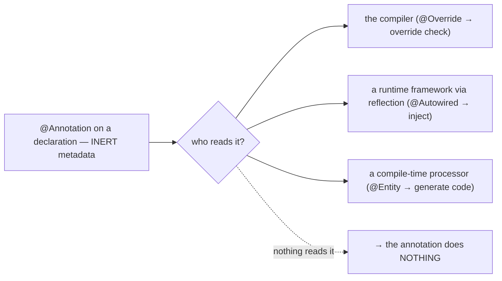
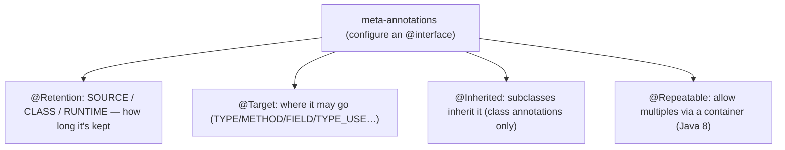
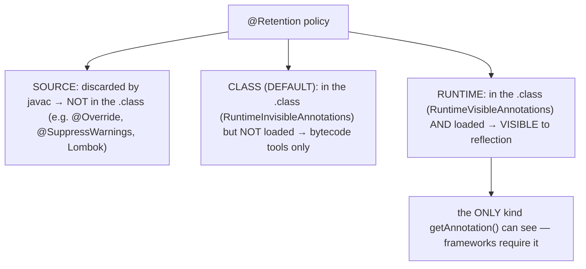
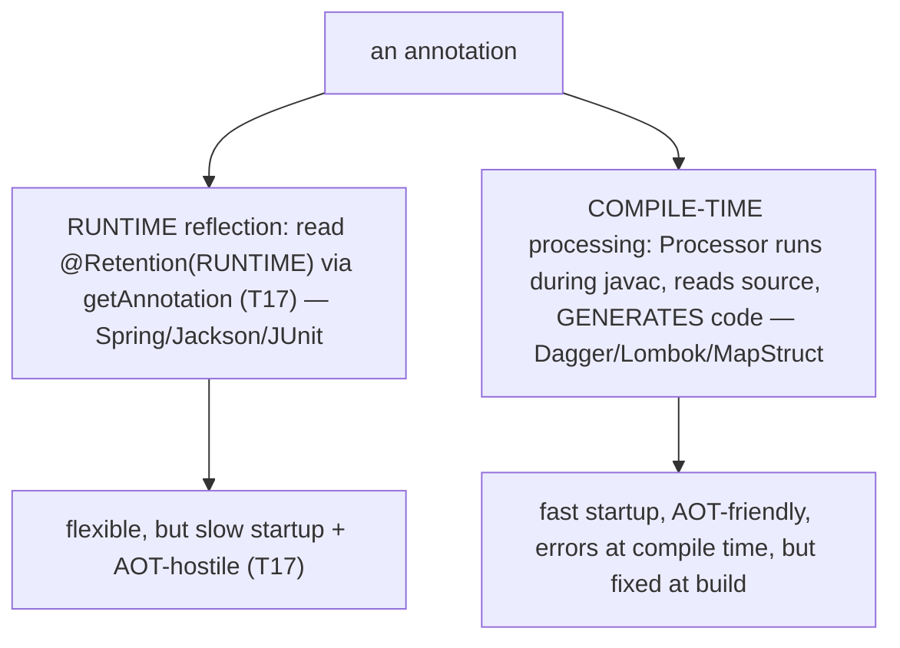
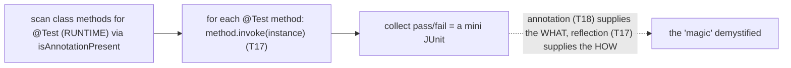
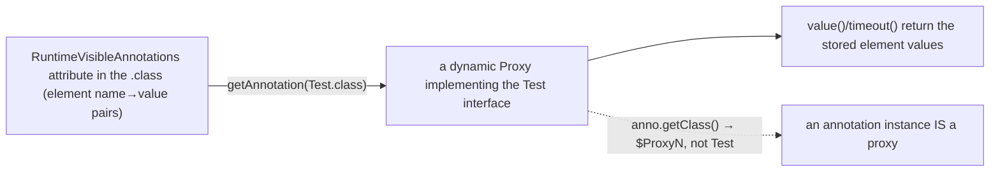
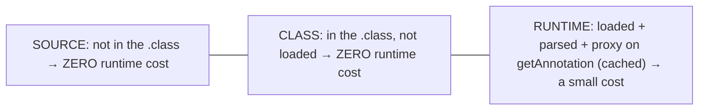
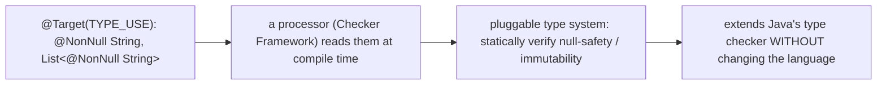

# Annotations (using & writing meta-annotations)

[T17](./T17-reflection.md) showed how frameworks *read* metadata and act by reflection; this topic is the other half — what that metadata **is**. An **annotation** is typed information you attach to a declaration (a class, method, field, parameter, or even a type usage), and its defining characteristic is that it is **inert**: an annotation does *nothing* by itself. `@Override` doesn't make a method override; `@Test` doesn't run anything; `@Autowired` injects nothing on its own. The behavior comes entirely from a **tool that reads the annotation and acts** — the compiler (`@Override` triggers an override check), a runtime framework reflecting over `@Autowired`/`@Test`, or a compile-time processor generating code from `@Entity`. Annotations are the vocabulary; reflection and annotation processing are the readers.

The depth bar is **the `@Retention` policy and how it maps to bytes — because it is the single most important and most-misunderstood thing about annotations**. An annotation's *retention* decides whether it survives to the `.class` file and whether it is loaded at runtime, and that decision is literally which attribute (if any) the annotation is written into: `SOURCE` annotations are **discarded by the compiler** and never reach the `.class`; `CLASS` annotations (the *default*) are written into a `RuntimeInvisibleAnnotations` attribute but **not loaded** by the JVM; only `RUNTIME` annotations are written into `RuntimeVisibleAnnotations` and **loaded**, making them the *only* kind reflection ([T17](./T17-reflection.md)) can see. Get this wrong — declare a custom annotation and forget `@Retention(RUNTIME)` — and `getAnnotation` silently returns `null`, the #1 annotation bug. And when reflection *does* return an annotation, that object is a **dynamic `Proxy`** synthesizing the annotation interface, not an ordinary instance. By the end you will use the built-in annotations, declare your own with elements and meta-annotations, choose the right retention, and understand the two ways tools consume annotations — runtime reflection versus compile-time processing.

> [!NOTE]
> Prerequisites: [Reflection](./T17-reflection.md) (`L1/C02/T17`) — the runtime reader of `RUNTIME` annotations, and why a returned annotation is a `Proxy`; [Interfaces](../C01-oop/T08-interfaces-default-static-private-methods.md) (`L1/C01/T08`) — an annotation type *is* an interface; [Method overriding](../C01-oop/T05-method-overriding.md) (`L1/C01/T05`) — `@Override`'s compile-time check; [Generics](./T12-generics-bounded-types-wildcards-type-erasure.md) (`L1/C02/T12`) — `@SafeVarargs` and element type rules. Forward: [T19](./T19-optional.md) (Optional).

## Annotations Are Inert Metadata

The first thing to internalize: an annotation carries information but **no behavior**. The built-in annotations make the pattern concrete — each does nothing until *something* reads it:

| Annotation | Read by | Effect |
|---|---|---|
| **`@Override`** | the compiler | error if the method doesn't actually override ([T05](../C01-oop/T05-method-overriding.md)) |
| **`@Deprecated`** | compiler + IDEs | warn on use (Java 9 added `since`/`forRemoval`) |
| **`@SuppressWarnings("unchecked")`** | the compiler | suppress the named warning category |
| **`@FunctionalInterface`** | the compiler | error if not exactly one abstract method ([T08](../C01-oop/T08-interfaces-default-static-private-methods.md)) |
| **`@SafeVarargs`** | the compiler | assert no heap pollution ([T12](./T12-generics-bounded-types-wildcards-type-erasure.md)) |



## Declaring Your Own

You declare an annotation type with **`@interface`** (which is really an interface extending `java.lang.annotation.Annotation`). Its **elements** look like methods but behave like named attributes, with optional **defaults**:

```java
@Retention(RetentionPolicy.RUNTIME)         // a meta-annotation — see below
@Target(ElementType.METHOD)
public @interface Test {
    String value() default "";              // the special 'value' element
    long timeout() default 0;
    String[] tags() default {};
}
```

Usage: `@Test`, `@Test("smoke")`, or `@Test(value = "smoke", timeout = 500)`. Element return types are **restricted** to primitives, `String`, `Class`, enums, annotations, and arrays of those — no arbitrary objects. Two conveniences: an element named **`value`** can be written positionally (`@Test("x")` ≡ `@Test(value="x")`), and an annotation with **no elements** is a **marker** (like `@Override`) whose mere presence is the signal.

```mermaid
flowchart TB
  Decl["@interface Test { String value() default \"\"; long timeout() default 0; }"]
  Decl --> El["elements = methods with limited return types + optional defaults"]
  Decl --> Val["value() → positional: @Test(\"x\") ≡ @Test(value=\"x\")"]
  Decl --> Marker["no elements → marker annotation (presence is the signal)"]
```

## The Meta-Annotations

**Meta-annotations** annotate annotation *declarations* and configure how an annotation behaves. Four matter:

- **`@Retention(policy)`** — how long the annotation is kept (next section in detail): `SOURCE`, `CLASS` (default), or `RUNTIME`.
- **`@Target(elements…)`** — where it may be placed: `TYPE`, `METHOD`, `FIELD`, `PARAMETER`, `CONSTRUCTOR`, `TYPE_PARAMETER`, `TYPE_USE`, …; the compiler rejects misplacement. (No `@Target` → usable anywhere.)
- **`@Inherited`** — a **class** annotation is inherited by subclasses (visible via `getAnnotations`, not `getDeclaredAnnotations`); applies *only* to class annotations, not interfaces or methods.
- **`@Repeatable(Container.class)`** (Java 8) — the same annotation may appear multiple times on one element, wrapped in a container annotation; read with `getAnnotationsByType`.

(`@Documented` additionally includes the annotation in Javadoc.)



## `@Retention` — The One That Controls Everything

`@Retention` decides the annotation's lifespan, and it maps **directly** to whether the annotation exists in the `.class` file and whether the JVM loads it:



- **`SOURCE`** — the compiler uses it and throws it away; it never reaches the `.class`. For compile-time-only tools (`@Override`, `@SuppressWarnings`, Lombok).
- **`CLASS`** — the **default** when `@Retention` is absent: written into the `.class` but *not* loaded at runtime, so reflection can't see it. For bytecode-level tools.
- **`RUNTIME`** — written into the `.class` *and* loaded by the JVM, so **reflection can read it** ([T17](./T17-reflection.md)). Required for every framework that inspects annotations at runtime (Spring, Jackson, JUnit, Hibernate).

> [!WARNING]
> **Forgetting `@Retention(RUNTIME)` is the #1 annotation bug.** The default retention is `CLASS`, *not* `RUNTIME`, so a custom annotation declared without `@Retention(RUNTIME)` is invisible to reflection — `getAnnotation` returns `null` and your framework silently does nothing. If anything reads the annotation at runtime, it *must* be `@Retention(RUNTIME)`.

## The Two Consumers — Runtime vs Compile-Time

Annotations are consumed in two fundamentally different ways, and the choice drives everything from performance to AOT-friendliness:



**Runtime reflection** reads `RUNTIME` annotations via the reflection API (`getAnnotation`, `isAnnotationPresent`, `getAnnotationsByType` for repeatables) and acts — the Spring/Jackson/JUnit path from [T17](./T17-reflection.md). It is flexible (works on any class loaded at runtime) but carries reflection's costs (slow startup, AOT-hostile).

**Compile-time annotation processing** (JSR 269, `javax.annotation.processing.Processor` / `AbstractProcessor`) runs *during* `javac`: a processor receives the annotated elements through the compile-time `javax.lang.model` mirror API (not reflection), and can **generate new source files**, emit errors/warnings, or validate. Dagger generates a DI graph, MapStruct generates mappers, AutoValue generates value classes, and Micronaut/Quarkus compute DI at build time — all **avoiding runtime reflection**, which is the migration [T17](./T17-reflection.md) pointed at. Processing runs in **rounds**: generated sources are themselves compiled and processed until none remain.

The runtime-reflection consumer makes the [T17](./T17-reflection.md)+T18 partnership concrete — a working test runner is just *find the annotation, then invoke by reflection*:



## Memory — `.class` Attributes and the Annotation Proxy

The retention policy is, concretely, **which `.class` attribute the annotation is written into**:

| Retention | `.class` attribute | Loaded at runtime? |
|---|---|---|
| `SOURCE` | *(none — discarded)* | no |
| `CLASS` | `RuntimeInvisibleAnnotations` | no |
| `RUNTIME` | `RuntimeVisibleAnnotations` | **yes** |

`javap -v` shows these attributes directly — a clean way to *see* retention in action. (Type annotations use the parallel `RuntimeVisible/InvisibleTypeAnnotations`.) When you call `getAnnotation(Test.class)` on a `RUNTIME` annotation, the JVM does **not** return an ordinary object — it returns a **dynamic `Proxy`** (`java.lang.reflect.Proxy`, backed by an `AnnotationInvocationHandler`) that implements the annotation *interface*, with its element methods (`value()`, `timeout()`) returning the values stored in the `RuntimeVisibleAnnotations` attribute. That is why `anno.getClass()` prints something like `jdk.proxy1.$Proxy3`, not your annotation type — the annotation type is an interface, and its runtime instances are synthesized, cached proxies.



## Architecture — Cost, the Compile-Time Trade-off, and Type Annotations

`SOURCE` and `CLASS` annotations have **zero runtime cost** — the first isn't even in the file, the second is present but never loaded. `RUNTIME` annotations cost a little: the attribute is parsed and a proxy is created on first `getAnnotation` (then cached). So **retention is a performance choice** too — don't make an annotation `RUNTIME` unless something reads it at runtime.



The deeper architectural theme is the **compile-time-vs-runtime trade-off**, continuing the [T17](./T17-reflection.md) story. *Runtime reflection* is flexible — read any class's annotations dynamically — but pays reflection's startup cost and resists AOT (the native-image compiler can't see reflective reads statically). *Compile-time processing* generates code at build time, so there is no runtime reflection: faster startup, smaller footprint, GraalVM-native-friendly, and errors caught during compilation — at the cost of being fixed at build and adding build complexity. The industry's shift toward Micronaut/Quarkus/Dagger is exactly this trade made deliberately.

The most powerful use of annotations turns metadata into **compile-time type checks**. **Type annotations** (JSR 308, Java 8) — declared `@Target(ElementType.TYPE_USE)` — may appear anywhere a type is *used*: `@NonNull String`, `List<@NonNull String>`, `@Readonly Object`. On their own they are still inert, but a processor like the **Checker Framework** reads them to run a **pluggable type system**, statically verifying null-safety or immutability *without changing the language*. Annotations thus extend Java's type checker from the outside — metadata becoming verification.



## Cross-Language Perspective

The "typed metadata on declarations" idea recurs, but with a crucial split over whether it is *inert* or *active*:

| Language | Mechanism | Inert or active? |
|---|---|---|
| **Java** | annotations (`@Anno`) | **inert** — read by reflection/processors |
| **C#** | attributes (`[Serializable]`) | **inert** — read by reflection |
| **Python** | decorators (`@dec`) | **ACTIVE** — wraps/transforms behavior |
| **Python** | type hints / `__annotations__` | inert (the true annotation analog) |
| **Rust** | attributes (`#[derive]`, `#[cfg]`) | compile-time codegen |
| **Go** | struct tags (`json:"name"`) | inert, **stringly-typed** |

The sharpest contrast is **Java annotations versus Python decorators**, which look identical (`@name`) but are opposites. A Java annotation is **passive metadata** — it does nothing until a separate tool reads it. A Python **decorator is a function** that takes the decorated function/class and *returns a transformed version*, **running at definition time and actively changing behavior** (`@lru_cache` wraps the function with caching; `@property` turns a method into a descriptor). Python's true *annotation* analog is its **type hints** (`def f(x: int) -> str`), stored inertly in `__annotations__` and read by tools like `mypy` — exactly Java's inert-metadata model. **C# attributes** are the direct, near-identical analog of Java annotations (inert, reflection-read). **Rust attributes** (`#[derive(Serialize)]`, `#[cfg]`) drive **compile-time codegen** via proc-macros — like Java's annotation processing, not its runtime reflection. **Go struct tags** (`json:"name,omitempty"`) are a weaker, **stringly-typed** version: a raw string on a field, parsed by convention and read reflectively, with no type safety or validation. So the archetype "annotation" — *typed, inert metadata read by a separate tool* — is Java's and C#'s; the others either make it active (Python/JS decorators), compile-time (Rust), or stringly-typed (Go).

```mermaid
flowchart TB
  Inert["INERT typed metadata (a tool must read + act): Java annotations, C# attributes"]
  Active["ACTIVE behavior-wrapping: Python/JS decorators (@lru_cache transforms the function)"]
  Codegen["COMPILE-TIME codegen: Rust attributes (#[derive] → proc-macro)"]
  Stringly["STRINGLY-TYPED reflective: Go struct tags (json:\"name\")"]
  Inert -.->|"look alike (@name), behave oppositely"| Active
```

## Common Mistakes

> [!WARNING]
> **Wrong `@Retention`.** The default is `CLASS`, not `RUNTIME` — so a reflectively-read annotation declared without `@Retention(RUNTIME)` is invisible (`getAnnotation` returns `null`). Always set `RUNTIME` for runtime-read annotations.

> [!WARNING]
> **Expecting an annotation to *do* something.** Annotations are inert. `@Transactional` does nothing unless Spring's proxy reads it; a custom annotation does nothing unless your code/processor reads it. The behavior lives in the reader, not the annotation.

> [!WARNING]
> **`@Inherited` misconceptions.** It applies *only* to class annotations and is visible *only* via `getAnnotations` (not `getDeclaredAnnotations`); it does nothing for interface or method annotations.

> [!WARNING]
> **Forgetting `@Target`.** Without it an annotation can be placed anywhere; add `@Target` to restrict it and let the compiler catch misplacement.

> [!WARNING]
> **Repeatable annotations without a container.** `@Repeatable` requires a declared container annotation, and you read repeatables with `getAnnotationsByType`, not `getAnnotation`.

> [!WARNING]
> **Confusing annotations with Python decorators.** A Java annotation is inert metadata; a Python decorator actively wraps and transforms. Don't expect an annotation to change behavior on its own.

## Practice

> [!INTERVIEW]
> Common interview questions for this topic:
> 1. **What is an annotation?** Typed, inert metadata on a declaration; it changes nothing by itself — a compiler, framework, or processor must read and act on it.
> 2. **Name some built-in annotations.** `@Override`, `@Deprecated`, `@SuppressWarnings`, `@FunctionalInterface`, `@SafeVarargs`.
> 3. **How do you declare a custom annotation?** With `@interface` and elements (methods with limited return types and optional defaults); `value()` can be written positionally.
> 4. **What is `@Retention` and its policies?** It sets lifespan: `SOURCE` (discarded), `CLASS` (in the `.class`, not loaded — default), `RUNTIME` (loaded, visible to reflection).
> 5. **Why is `@Retention(RUNTIME)` important?** Without it (default `CLASS`), reflection can't see the annotation and `getAnnotation` returns `null`.
> 6. **What is `@Target`?** Restricts where the annotation may be placed (`TYPE`, `METHOD`, `FIELD`, `TYPE_USE`, …).
> 7. **The two ways tools consume annotations?** Runtime reflection (read `RUNTIME` annotations via `getAnnotation`) and compile-time annotation processing (a `Processor` generates code/validates during `javac`).
> 8. **How are annotations stored, and what does `getAnnotation` return?** `RUNTIME` → `RuntimeVisibleAnnotations` in the `.class`; `getAnnotation` returns a dynamic `Proxy` implementing the annotation interface.
> 9. **What is `@Inherited`?** A class annotation inherited by subclasses (only classes, only via `getAnnotations`).
> 10. **What is `@Repeatable`?** It allows the same annotation multiple times on one element via a container annotation (Java 8).
> 11. **Java annotations vs Python decorators?** Java annotations are inert metadata; Python decorators are functions that wrap/transform behavior at definition time.
> 12. **What are type annotations?** `@Target(TYPE_USE)` annotations (Java 8) usable anywhere a type appears (`@NonNull String`); they power pluggable type checkers like the Checker Framework.
> 13. **Why are frameworks moving to compile-time processing?** It avoids runtime reflection's cost, enables AOT/native-image, and catches errors at compile time.

1. **Built-ins.** Add `@Override` to a method, then misspell the method name and observe the compile error; add `@Deprecated` and `@SuppressWarnings` and watch the warnings change.

2. **Declare a custom annotation.** Write `@interface Test` with a `value`, a defaulted `timeout`, and a `String[] tags`; use it three ways (marker, positional, named).

3. **Read it reflectively.** Add `@Retention(RUNTIME)` + `@Target(METHOD)` and read the annotation off a method with `getAnnotation` ([T17](./T17-reflection.md)); print its element values.

4. **The retention trap.** Declare the same annotation with `SOURCE`, then `CLASS`, then `RUNTIME`; show `getAnnotation` returns `null` for the first two and the instance for the third.

5. **Marker annotation.** Define a marker (no elements) and detect it with `isAnnotationPresent`.

6. **`@Inherited`.** Annotate a class with an `@Inherited` annotation; confirm a subclass sees it via `getAnnotations` but not `getDeclaredAnnotations`.

7. **`@Repeatable`.** Declare a repeatable annotation and its container; apply it twice to one element; read both with `getAnnotationsByType`.

8. **Inspect the bytes.** Run `javap -v` on a class with a `RUNTIME` annotation and find `RuntimeVisibleAnnotations`; confirm a `SOURCE` annotation is absent.

9. **The proxy.** Print `getAnnotation(Test.class).getClass()` and observe the `$ProxyN` class; explain why an annotation instance is a proxy.

10. **Mini `@Test` runner.** Scan a class for `@Test` methods (`RUNTIME`) and invoke them reflectively — the JUnit pattern in miniature.

11. **All element types.** Write an annotation with a `String`, an `int`, a `Class<?>`, an enum, an array, and a nested annotation element.

12. **Annotation processor sketch.** Write an `AbstractProcessor` that prints the elements annotated with your annotation during compilation (register it via `META-INF/services`).

13. **Type annotation.** Declare `@NonNull` with `@Target(TYPE_USE)` and use it on `List<@NonNull String>`; discuss how the Checker Framework would verify it.

14. **`@Deprecated` elements.** Use the Java 9 `@Deprecated(since = "2.0", forRemoval = true)` and observe the stronger warning.

15. **End-to-end explain-it-back.** For a custom `@Test` annotation: (a) how `@Retention` decides which `.class` attribute it lands in and whether reflection sees it; (b) what `getAnnotation` returns and why it's a `Proxy`; (c) the difference between a runtime-reflection consumer and a compile-time-processing consumer; (d) why `SOURCE`/`CLASS` cost nothing at runtime; (e) why an annotation alone never changes behavior. Twelve sentences max.

## Recap

You should now be able to:

**Language layer.**

- Explain that annotations are inert typed metadata, use the built-ins (`@Override`, `@Deprecated`, `@SuppressWarnings`, …), and declare your own with `@interface`, elements, defaults, `value()`, and markers.
- Apply the meta-annotations — `@Retention`, `@Target`, `@Inherited`, `@Repeatable` — and choose retention correctly (`RUNTIME` for anything read by reflection).
- Distinguish the two consumers: runtime reflection vs compile-time annotation processing.

**Memory layer.**

- Map retention to `.class` attributes (`SOURCE` discarded, `CLASS` → `RuntimeInvisibleAnnotations`, `RUNTIME` → `RuntimeVisibleAnnotations`), inspectable with `javap -v`.
- Explain that a runtime annotation instance is a dynamic `Proxy` implementing the annotation interface.

**Architecture layer.**

- Explain that `SOURCE`/`CLASS` annotations cost nothing at runtime while `RUNTIME` ones cost a parse + proxy, and the compile-time-vs-runtime trade-off (flexibility/AOT-hostility vs fast-startup/AOT-friendliness).
- Describe type annotations (`TYPE_USE`) and pluggable type systems (Checker Framework) as metadata becoming compile-time verification.
- Contrast Java's inert annotations with Python's active decorators, C# attributes, Rust compile-time attributes, and Go's stringly-typed struct tags.

The next topic returns to everyday API design with a small type that addresses a billion-dollar mistake. [T19](./T19-optional.md) — `Optional` — covers the container that makes "a value might be absent" explicit in the type, replacing `null` returns, why it should be a return type and not a field or parameter, the functional methods (`map`/`filter`/`orElse`/`ifPresent`), and the memory cost of wrapping every value in an object.

## Next

Continue to [Optional](./T19-optional.md) — Java's answer to the `null` problem, "the billion-dollar mistake" its inventor Tony Hoare apologized for. T18 was about metadata on code; T19 is about modeling *absence* in the type system. `Optional<T>` is a container that holds either a value or nothing, making "this might be absent" explicit in a method's return type instead of a `null` that explodes into a `NullPointerException` at the call site. T19 covers when to use it (return types — never fields or parameters, never collections), the functional API (`map`/`filter`/`flatMap`/`orElse`/`orElseThrow`/`ifPresent`), the `OptionalInt`/`OptionalLong`/`OptionalDouble` primitive variants, the memory cost (an extra object wrapping each value — the [T01](../C01-oop/T01-classes-and-objects.md) allocation/boxing lesson), and how other languages model the same idea (Kotlin's `?` nullable types, Rust's `Option<T>`, Haskell's `Maybe`).
