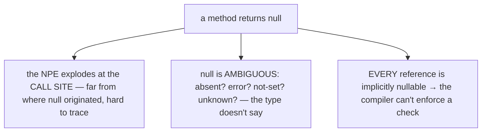
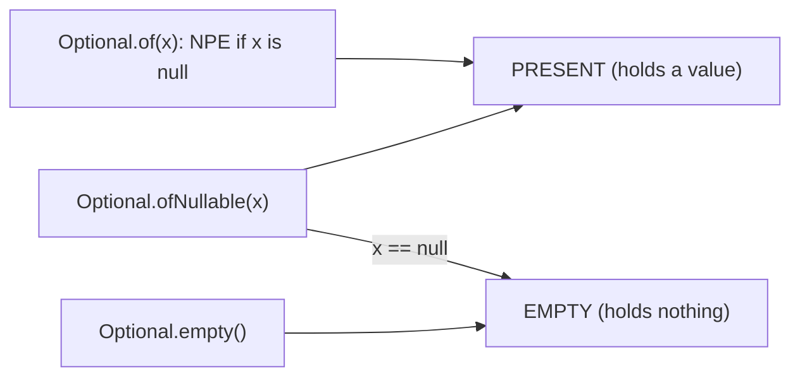
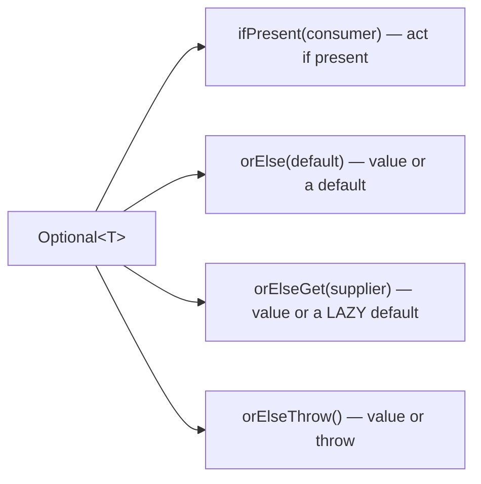
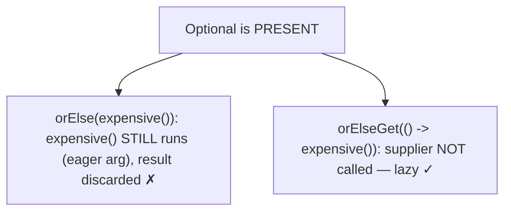
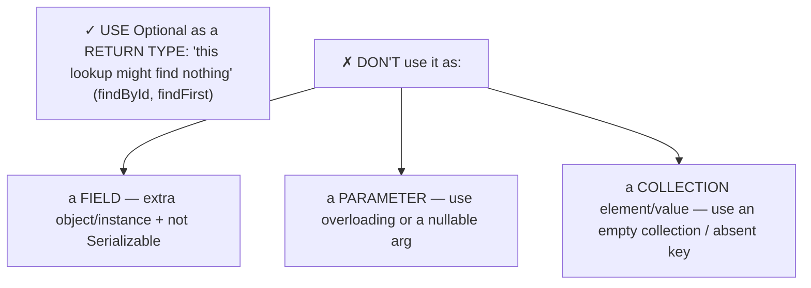
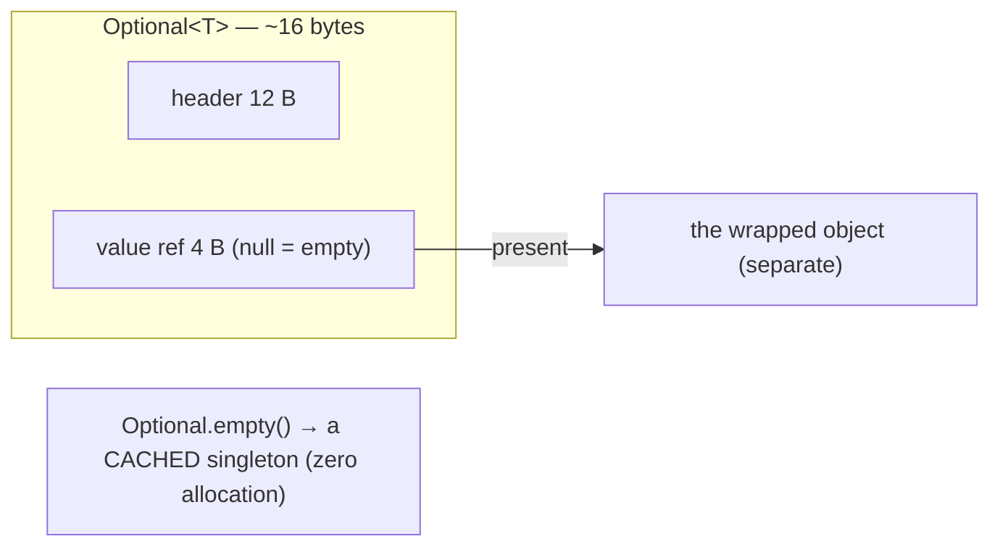
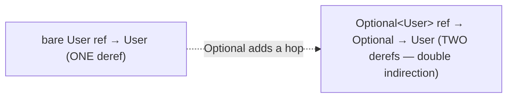
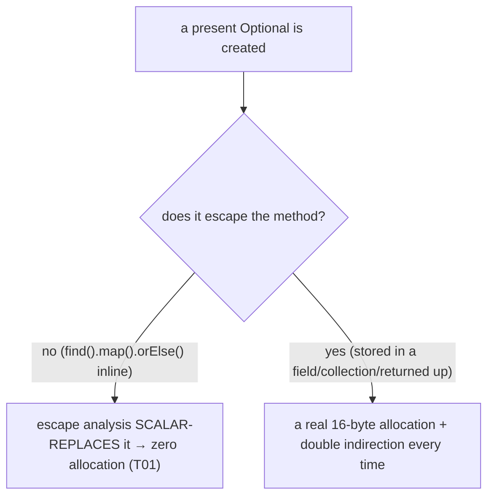
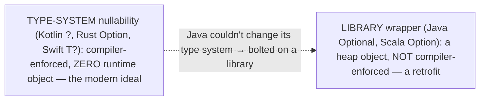

# Optional

`null` is, in its inventor's own words, a **"billion-dollar mistake."** Tony Hoare added the null reference to ALGOL W in 1965 "simply because it was so easy to implement," and apologized for it in 2009: it has caused "innumerable errors, vulnerabilities, and system crashes." The trouble is that a `null` return *explodes* into a `NullPointerException` at the call site — often far from where the `null` originated — and that `null` itself is **ambiguous**: does it mean "absent," "error," "not yet set," or "unknown"? The type can't say, because in Java *every* reference is implicitly nullable, so the compiler can't help you remember to check. Java 8's **`Optional<T>`** is a partial cure: a container that explicitly holds *either a value or nothing*, so a method returning `Optional<User>` announces in its signature that it might not find one — turning a silent, runtime `null` into a visible, type-level "maybe."

The depth bar is **the cost of that wrapper and why `Optional` is a return-type-only library bolt-on, not a type-system feature**. An `Optional<T>` is an extra heap object (~16 bytes) wrapping each value — so returning `Optional<User>` instead of `User` adds one allocation per present result, plus a double indirection on every access. The empty case is free (`Optional.empty()` is a cached singleton), and **escape analysis** ([T01](../C01-oop/T01-classes-and-objects.md)) often scalar-replaces a short-lived `Optional` that never escapes its method — but stash an `Optional` in a field or collection and it always allocates. That allocation cost, plus the fact that `Optional` is deliberately **not `Serializable`**, is exactly why the guidance restricts it to return types and forbids fields, parameters, and collection elements. And it explains the deeper truth: `Optional` is *weaker* than the nullable types of Kotlin, Swift, and Rust, where absence lives in the type system with **zero runtime object** — Java retrofitted a library because it couldn't change its type system non-breakingly. By the end you will use the functional API fluently, avoid the `orElse`/`orElseGet` eager-evaluation trap, know exactly where `Optional` belongs, and place it on the cross-language absence-modeling spectrum.

> [!NOTE]
> Prerequisites: [Classes & objects](../C01-oop/T01-classes-and-objects.md) (`L1/C01/T01`) — `Optional` is an object with allocation cost and escape analysis; [Immutability](../C01-oop/T19-immutability-and-immutable-class-design.md) (`L1/C01/T19`) — `Optional` is immutable; [Big-O / memory](./T08-collection-performance-characteristics-big-o.md) (`L1/C02/T08`) — the double-indirection and allocation cost; [Iterators](./T06-iterators-and-iterable.md) (`L1/C02/T06`) — `Optional.stream()` and the map/flatMap chain. Forward: [T20](./T20-math-bigdecimal-biginteger-random.md) (`BigDecimal`, another value type).

## The `null` Problem

`null` fails in three compounding ways, and `Optional` targets each:



A `String getName()` that can return `null` looks identical to one that never does — the signature hides the risk, and the caller learns about it only when an NPE fires. `Optional<String> getName()` makes the maybe *part of the type*, so the caller is forced to confront absence at compile time.

## Creating and Querying an `Optional`

An `Optional<T>` is either **present** (holds a value) or **empty**. You create one three ways:

```java
Optional<User> a = Optional.of(user);          // present — throws NPE if user is null
Optional<User> b = Optional.ofNullable(maybe); // present if non-null, EMPTY if null (the bridge)
Optional<User> c = Optional.empty();           // absent
```



`Optional.of` is for values you *know* are non-null (it throws on `null`); `Optional.ofNullable` is the bridge from nullable code; `Optional.empty()` is the absent case. To get the value out, the idioms — in order of preference — are:

```java
opt.ifPresent(u -> render(u));        // run a consumer if present (ifPresentOrElse adds an else — Java 9)
User u = opt.orElse(DEFAULT_USER);    // value, or a default
User u = opt.orElseGet(() -> load()); // value, or a LAZILY-computed default
User u = opt.orElseThrow();           // value, or throw NoSuchElementException (or a supplied exception)
boolean has = opt.isPresent();        // isEmpty() since Java 11
```



> [!WARNING]
> **Avoid `get()`.** `Optional.get()` returns the value or throws `NoSuchElementException` if empty — calling it (especially without an `isPresent()` guard) is just a disguised `null` dereference and defeats the whole point. Prefer `orElse`/`orElseGet`/`orElseThrow`/`map`/`ifPresent`. (This is why Java 10 added the clearer `orElseThrow()` as the explicit "I expect a value" form.)

## `orElse` vs `orElseGet` — The Eager-Evaluation Trap

The single most common `Optional` bug is choosing `orElse` where `orElseGet` is needed. **`orElse(x)` evaluates `x` *unconditionally*** — even when the `Optional` is present — because `x` is an ordinary method argument, computed *before* `orElse` runs. **`orElseGet(supplier)` is lazy** — the supplier runs *only* when the `Optional` is empty:

```java
opt.orElse(expensiveLoad());        // expensiveLoad() ALWAYS runs — wasteful (or buggy) when present
opt.orElseGet(() -> expensiveLoad()); // expensiveLoad() runs ONLY when empty
```

If the default is a cheap constant, `orElse` is fine and clearer. If it is **expensive, allocates, or has a side effect** (a DB call, a counter increment), use `orElseGet` — otherwise you pay the cost (or trigger the side effect) on every call, present or not.



## The Functional Chain — `map`, `flatMap`, `filter`

`Optional`'s real power is composing transformations that short-circuit on absence, replacing nested `null` checks:

```java
String city = findUser(id)               // Optional<User>
    .map(User::getAddress)               // Optional<Address> — applies fn if present, stays empty otherwise
    .map(Address::getCity)               // Optional<String>
    .filter(c -> !c.isBlank())           // keep only if non-blank
    .orElse("unknown");                  // unwrap with a default
```

- **`map(fn)`** — if present, apply `fn` and wrap the result; if empty, stay empty.
- **`flatMap(fn)`** — for an `fn` that itself returns an `Optional` (avoids `Optional<Optional<U>>` by flattening). Use it when the mapping step is already optional-returning.
- **`filter(pred)`** — keep the value if it matches, else become empty.
- **`Optional.stream()`** (Java 9) — a 0-or-1-element stream, so `stream.flatMap(Optional::stream)` turns a `Stream<Optional<T>>` into a `Stream<T>` of just the present values.

The chain expresses "get the city of this user's address, if all the pieces exist, else 'unknown'" with no explicit `null` checks and no nesting — the absence propagates automatically. (These are exactly the operations of the `Maybe` monad — Architecture, below.)

```mermaid
flowchart LR
  U["Optional&lt;User&gt;"] -->|"map(getAddress)"| A["Optional&lt;Address&gt;"]
  A -->|"map(getCity)"| C["Optional&lt;String&gt;"]
  C -->|"filter(non-blank)"| F["Optional&lt;String&gt;"]
  F -->|"orElse(\"unknown\")"| R["String"]
  Note["any empty step short-circuits the rest — no null checks"]
```

## Where `Optional` Belongs — and Where It Doesn't

`Optional` was designed for **one job: a method return type that signals a value might be absent** (a lookup or search that can miss — `findById`, `Stream.findFirst`). Used elsewhere it is an anti-pattern (*Effective Java* Item 55, and the language designers' explicit guidance):



- **Not a field** — it adds an object per instance (allocation + indirection) and `Optional` is **not `Serializable`**, so an `Optional` field breaks serialization. Use a nullable field or a sensible default.
- **Not a parameter** — it forces callers to wrap, and you must still handle both `empty` *and* a `null` `Optional`. Overload the method or accept a nullable argument.
- **Not in collections** — never `Optional<List<T>>` (return an empty list), `List<Optional<T>>`, or `Map<K, Optional<V>>` (use an absent key or `getOrDefault`). An empty collection already models "nothing."

For primitives, prefer **`OptionalInt`/`OptionalLong`/`OptionalDouble`**, which hold the value unboxed (an `Optional<Integer>` boxes the `int` *and* wraps it — double overhead).

## Memory — A Wrapper Object, a Cached Empty

`Optional<T>` is a `final` class with exactly one field — `private final T value` (`null` meaning empty). So an `Optional` *instance* is an **extra heap object**: a 12-byte header plus a 4-byte value reference ≈ **16 bytes**, wrapping the actual value (itself a separate object). Returning `Optional<User>` instead of `User` therefore adds one 16-byte object per *present* result. Two refinements matter:

- **`Optional.empty()` is a cached singleton** — a single `private static final Optional<?> EMPTY`, returned (cast) every time — so an *empty* `Optional` costs **zero allocation**. Only a *present* `Optional` allocates.
- **`Optional` is not `Serializable`** by design — which both prevents `Optional` fields from being serialized cleanly and signals "this is a return value, not state."

`OptionalInt` holds a `boolean isPresent` plus a raw `int value` (no boxing of the `int`, though it is still a heap object). And accessing the value is a **double indirection** — dereference the `Optional`, then use the wrapped reference — two hops versus one for a bare reference, slightly cache-unfriendlier ([T08](./T08-collection-performance-characteristics-big-o.md)).



Accessing the value is two hops instead of one — a small cache cost ([T08](./T08-collection-performance-characteristics-big-o.md)):



## Architecture — Allocation, Escape Analysis, and the Library Trade-off

Each *present* `Optional` is a heap allocation, so a hot path that creates many of them adds GC pressure. But **escape analysis** ([T01](../C01-oop/T01-classes-and-objects.md)) frequently erases that cost: when an `Optional` is created, queried, and discarded *within* a method — the common `find().map(...).orElse(default)` pattern, all inlined — it **never escapes**, so the JIT **scalar-replaces** it (no allocation; the `value` field becomes a local/register). The overhead is therefore real in cold/interpreted code and whenever the `Optional` **escapes** (stored in a field, returned up several layers, placed in a collection), and roughly **free** when it is consumed locally at the call site — which is exactly the intended use. This is the architectural justification for the return-type-only rule: as a transient return value it is nearly free; as stored state it always allocates and double-indirects.



The `orElse`/`orElseGet` distinction is the same eager-vs-lazy story at the language level: Java evaluates arguments eagerly (call-by-value), so `orElse`'s default is computed unconditionally, while `orElseGet`'s `Supplier` defers it — a correctness *and* performance lever. And the deepest point is a *design* one: `Optional` makes absence **explicit in the type**, shifting null-safety from runtime discipline (remember to check) to a type-level signal (the signature says `Optional`) — but it is a **library type bolted onto a language where every reference is still nullable**. It does not remove `null`; it adds a wrapper you opt into for return values. Its `map`/`flatMap` are literally the operations of the functional **`Maybe` monad** (Haskell), `map` = `fmap` and `flatMap` = bind (`>>=`) — `Optional` is that monad as a Java class.

## Cross-Language Perspective — The Absence Spectrum

Modeling "a value might be absent" splits languages cleanly by *where* absence lives — in the type system or in a library:

| Language | Mechanism | Runtime object? | Compiler-enforced? |
|---|---|---|---|
| **Kotlin** | nullable types `String?` | **no** (just T-or-null) | **yes** |
| **Swift** | `T?` / `Optional<T>` | minimal | **yes** |
| **Rust** | `Option<T>` (`Some`/`None`) | **no** (niche optimization) | **yes** (no `null` exists) |
| **C#** | `T?` (value) / nullable refs | value: no heap | partial (warnings) |
| **Java** | `Optional<T>` (library) | **yes** (~16 B) | no |
| **Scala** | `Option[T]` (library) | yes | no |

The spectrum runs from **nullability in the type system (zero-cost)** to **a library wrapper object (allocates)**. **Kotlin** makes nullability a *type property*: `String` is non-null, `String?` is nullable, and the **compiler forbids** dereferencing a `String?` without a null-check or safe-call (`?.`, `?:`) — and crucially a `String?` is **just a String-or-null at runtime, with no wrapper object**. **Rust** goes furthest: it has **no `null` at all** — the billion-dollar mistake designed out — and models absence with `Option<T>`, an enum the compiler forces you to handle (`match`, the `?` operator), made **zero-cost** by the niche optimization (`Option<&T>` is the same size as `&T`). **Swift** and **C#** (value-type `Nullable<T>`, plus C# 8's compile-time-checked nullable references) sit in the same type-system camp. **Java and Scala** are the outliers: `Optional`/`Option` are **library types** — heap objects you wrap values in, *not* compiler-enforced (you can still return `null` from an `Optional` method or hold a `null` field). Java is there for a familiar reason: it could not change its type system non-breakingly to add nullability (every existing `T` would need reclassifying — the migration theme from [T11](./T11-generics-basics.md)), so it retrofitted a library. Languages designed *after* the null problem was understood — Kotlin (2011), Swift (2014), Rust — put absence in the type system from day one. The takeaway: **`Optional` is a genuine improvement (explicit optionality in signatures) but strictly weaker than type-system nullability** — a heap object the compiler doesn't enforce — which is precisely why its use is confined to return types rather than offered as a universal `null` replacement.



## Common Mistakes

> [!WARNING]
> **`Optional` as a field, parameter, or collection element.** It belongs only as a *return type*. Fields add an object and break serialization; parameters should overload or accept nullable; collections should be empty (not `Optional<List>`/`List<Optional>`/`Map<K,Optional<V>>`).

> [!WARNING]
> **`orElse` with an expensive or side-effecting default.** It is evaluated eagerly even when the value is present. Use `orElseGet(() -> …)` for anything beyond a cheap constant.

> [!WARNING]
> **Calling `get()` (especially without `isPresent`).** It's a disguised `null` dereference. Use `orElse`/`orElseGet`/`orElseThrow`/`map`/`ifPresent`.

> [!WARNING]
> **`Optional.of(maybeNull)`.** It throws `NullPointerException` on `null`. Use `Optional.ofNullable` for values that might be `null`.

> [!WARNING]
> **Returning `null` from an `Optional`-returning method.** It defeats the entire purpose and is doubly surprising. Return `Optional.empty()`.

> [!WARNING]
> **`Optional<Optional<T>>` from chaining `map`.** When the mapping function already returns an `Optional`, use `flatMap` to flatten instead of `map`.

## Practice

> [!INTERVIEW]
> Common interview questions for this topic:
> 1. **What problem does `Optional` solve?** It makes "a value might be absent" explicit in the type, replacing `null` returns that explode into NPEs far from the cause.
> 2. **How do you create an `Optional`?** `Optional.of(nonNull)`, `Optional.ofNullable(maybeNull)`, `Optional.empty()`.
> 3. **`orElse` vs `orElseGet`?** `orElse` evaluates its default eagerly (even when present); `orElseGet` takes a supplier called only when empty — use it for expensive/side-effecting defaults.
> 4. **When should you use `Optional`, and when not?** As a return type signaling possible absence; never as a field, parameter, or collection element.
> 5. **Why not `Optional` fields?** Extra object per instance and `Optional` isn't `Serializable`; use a nullable field or default.
> 6. **What's wrong with `get()`?** It throws on empty and is a disguised `null` dereference; use `orElse`/`map`/`ifPresent`/`orElseThrow`.
> 7. **`map` vs `flatMap`?** `map` wraps the result; `flatMap` is for functions that already return an `Optional` (avoids `Optional<Optional>`).
> 8. **Memory cost?** An extra ~16-byte wrapper per present value (empty is a cached singleton), plus double indirection.
> 9. **Does `Optional` always allocate?** A present one allocates, but escape analysis often scalar-replaces a short-lived non-escaping `Optional` → zero allocation after JIT.
> 10. **Why `OptionalInt`?** `Optional<Integer>` boxes the `int` *and* wraps it; `OptionalInt` holds a raw `int`, avoiding the box.
> 11. **How do Kotlin/Rust differ?** They put nullability in the type system (`String?`, `Option<T>`) — compiler-enforced and zero-cost (no wrapper), versus Java's library wrapper.
> 12. **Can you return `null` from an `Optional` method?** You can, but never should — return `Optional.empty()`.
> 13. **Is `Optional` a monad?** Yes — `map`/`flatMap` are the `Maybe` monad's `fmap`/bind.

1. **Creation.** Build `Optional`s with `of`, `ofNullable`, and `empty`; show `of(null)` throws and `ofNullable(null)` is empty.

2. **Querying.** Show `get()` on an empty `Optional` throws; rewrite with `orElse`, then `ifPresent`.

3. **`orElse` vs `orElseGet` trap.** Put a `println` inside the default; call both on a *present* `Optional` and confirm `orElse` runs the side effect while `orElseGet` doesn't.

4. **`orElseThrow`.** Use `orElseThrow(() -> new NotFoundException(id))` to convert absence into a domain exception.

5. **`map`/`filter` chain.** From an `Optional<User>`, get the uppercase city via `map(User::getAddress).map(Address::getCity).map(String::toUpperCase).orElse("?")`.

6. **`flatMap`.** Make `getAddress` return `Optional<Address>`; show `map` yields `Optional<Optional<Address>>` while `flatMap` flattens it.

7. **`Optional.stream`.** Turn a `List<Optional<User>>` into a `List<User>` of present values with `.stream().flatMap(Optional::stream)`.

8. **`findById`.** Write a repository method returning `Optional<User>`; have the caller handle absence with `orElseThrow`.

9. **Refactor anti-patterns.** Take a class with an `Optional` field, an `Optional` parameter, and a `Map<K, Optional<V>>`; fix each (nullable field/default, overload, absent key).

10. **`OptionalInt`.** Return an `OptionalInt` from a method; contrast its memory with `Optional<Integer>` (no boxing).

11. **Serialization.** Try to serialize a class with an `Optional` field; observe the failure and explain why `Optional` isn't `Serializable`.

12. **Cross-language sketch.** Write "find a user by id" in Kotlin (`User?`), Rust (`Option<User>`), and Java (`Optional<User>`); compare the absence handling and the runtime cost.

13. **Allocation + escape analysis.** Benchmark a tight loop that does `find(i).map(...).orElse(d)` (non-escaping) vs one that stores the `Optional` in a list (escaping); explain the difference.

14. **The monad connection.** Note that `Optional.map`/`flatMap` mirror Haskell's `Maybe` `fmap`/bind; describe how absence propagates through a chain.

15. **End-to-end explain-it-back.** For `findUser(id).map(User::getEmail).orElseGet(() -> defaultEmail())`: (a) what objects are allocated and which are scalar-replaced; (b) why `orElseGet` is preferable to `orElse` here; (c) the memory layout of the `Optional`; (d) why `Optional` is a return type and not a field; (e) how Kotlin's `String?` would express the same thing with no wrapper object. Twelve sentences max.

## Recap

You should now be able to:

**Language layer.**

- Explain the `null` problem and how `Optional` makes absence explicit in a method's return type.
- Create `Optional`s (`of`/`ofNullable`/`empty`), unwrap them safely (`orElse`/`orElseGet`/`orElseThrow`/`ifPresent`, avoiding `get`), and compose with `map`/`flatMap`/`filter`/`stream`.
- State exactly where `Optional` belongs (return types) and the field/parameter/collection anti-patterns, and use `OptionalInt`/`OptionalLong`/`OptionalDouble` for primitives.

**Memory layer.**

- Describe an `Optional` as a ~16-byte wrapper around one value reference, with `empty()` a cached singleton (zero allocation) and the type deliberately not `Serializable`, plus the double indirection on access.

**Architecture layer.**

- Explain that a present `Optional` allocates but escape analysis scalar-replaces short-lived non-escaping ones (justifying the return-type-only rule), and the `orElse`/`orElseGet` eager-vs-lazy distinction.
- Recognize `Optional` as the `Maybe` monad and as a library bolt-on, and place it on the absence-modeling spectrum against the zero-cost, compiler-enforced nullable types of Kotlin, Swift, and Rust — explaining why Java retrofitted a library and confined it to return types.

The next topic turns to numeric correctness — the types you reach for when `double` and `int` aren't enough. [T20](./T20-math-bigdecimal-biginteger-random.md) — `Math`, `BigDecimal`/`BigInteger`, and `Random` — covers exact decimal arithmetic (why `0.1 + 0.2 != 0.3` in floating point and how `BigDecimal` fixes it for money), arbitrary-precision integers, the `Math` utility methods and overflow-checked arithmetic, and pseudo-random number generation.

## Next

Continue to [Math, BigDecimal / BigInteger, Random](./T20-math-bigdecimal-biginteger-random.md) — numeric correctness beyond `int` and `double`. T19 modeled absence; T20 models *exact numbers*. It covers why floating-point `double` can't represent `0.1` exactly (so `0.1 + 0.2 != 0.3`) and why you must **never use `double` for money** — reaching instead for **`BigDecimal`** (arbitrary-precision, exact decimal arithmetic, with its own scale/rounding rules and the `compareTo`-vs-`equals` trap from [T07](./T07-comparable-vs-comparator.md)); **`BigInteger`** for integers beyond `long`'s 64 bits (cryptography, factorials); the **`Math`** utilities and **overflow-checked** arithmetic (`Math.addExact` versus silent `int` wraparound); and **`Random`**/`ThreadLocalRandom`/`SecureRandom` — pseudo-random generation, why a seeded `Random` is reproducible, and why you need `SecureRandom` for anything security-sensitive. It's the topic that turns "the number looked right in testing" into "the arithmetic is provably correct."
