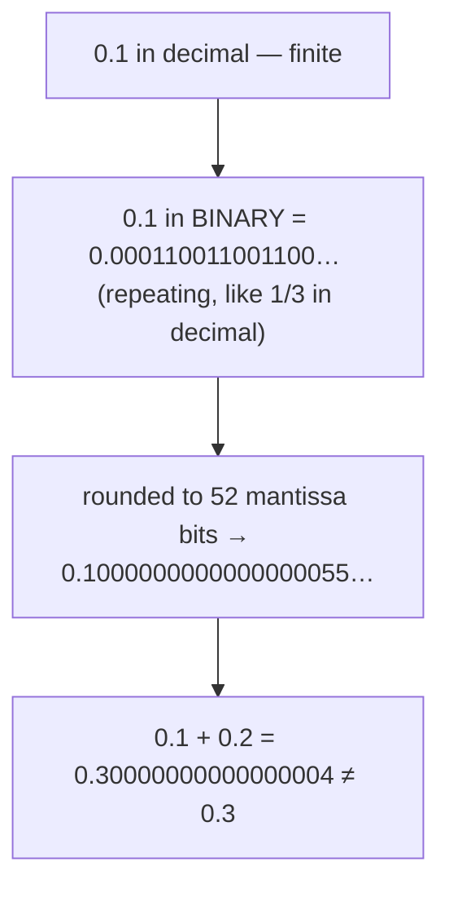
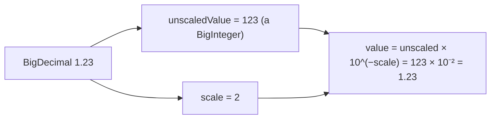
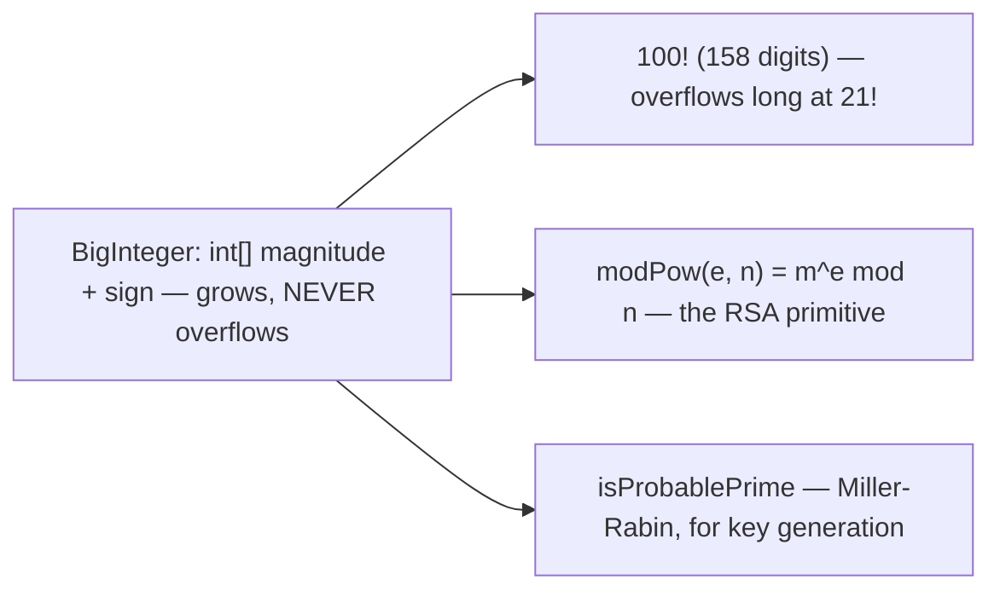
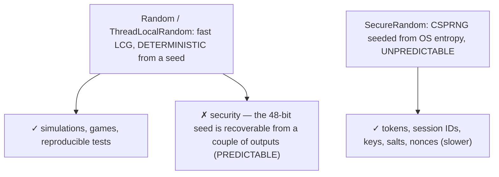
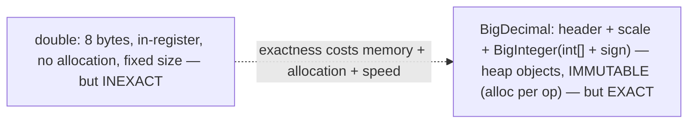
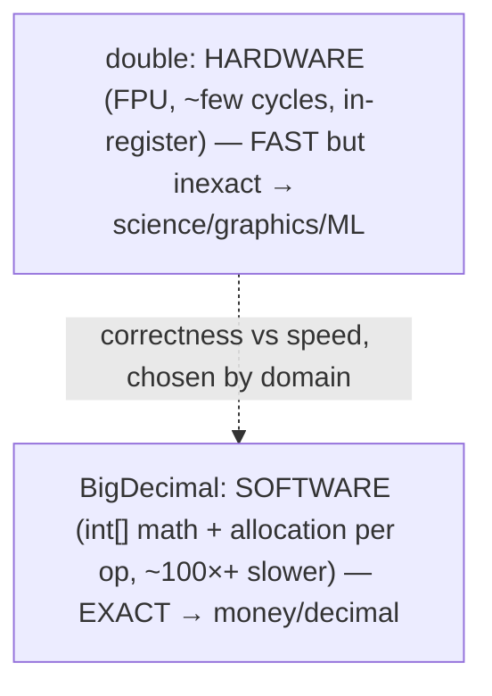
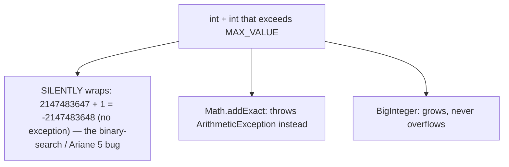
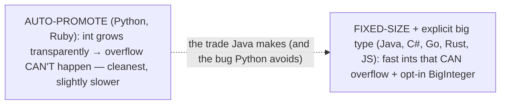

# Math, BigDecimal / BigInteger, Random

This topic is about **numeric correctness** — the types and methods you reach for when `int` and `double` are not enough, and the subtle, expensive bugs that follow from using them where they don't belong. The headline fact: **`0.1 + 0.2` is not `0.3`** in Java (it is `0.30000000000000004`), and this is not a Java quirk but a property of binary floating-point that holds in Python, JavaScript, C, and everywhere else. So you must **never compare `double`s with `==`** and **never use `double` for money** — for exact decimal arithmetic you reach for **`BigDecimal`**, for integers beyond `long`'s 64 bits you reach for **`BigInteger`**, the `Math` class gives you utilities and *overflow-checked* arithmetic, and `Random`/`SecureRandom` give you pseudo-random and cryptographically-secure number generation — two things that must never be confused.

The depth bar is **the hardware-versus-software trade behind exactness, and the silent-overflow trap**. A `double` is a 64-bit IEEE 754 value computed by the CPU's floating-point unit in a *single instruction* — blazing fast but *inexact*, because a decimal fraction like `0.1` is a repeating fraction in binary (just as `1/3` repeats in decimal) and gets rounded to fit 52 mantissa bits. A `BigDecimal` is the opposite: *exact* decimal arithmetic, but done in *software* over arrays of digits with a heap allocation per operation — orders of magnitude slower. That is the trade — `double` for science and graphics where speed rules and small errors wash out, `BigDecimal` for money where a fraction of a cent is unacceptable. The other trap is **integer overflow**: `int` and `long` are fixed-size and **wrap silently** (`Integer.MAX_VALUE + 1` is `Integer.MIN_VALUE`, no exception), the bug behind a famous 20-year-old binary-search defect and the Ariane 5 rocket's destruction — which `Math.addExact` turns into a thrown exception and `BigInteger` avoids entirely. By the end you will know exactly when to use each numeric type, the `new BigDecimal(double)` and `compareTo`-vs-`equals` traps, and why a `Random` token is a security hole that only `SecureRandom` closes.

> [!NOTE]
> Prerequisites: [Comparable/Comparator](./T07-comparable-vs-comparator.md) (`L1/C02/T07`) — `BigDecimal`'s `compareTo`-vs-`equals` inconsistency is *the* canonical example; [Map](./T04-map-hashmap-linkedhashmap-treemap.md) (`L1/C02/T04`) — how that trap plays out in `HashSet` vs `TreeSet`; [Classes & objects](../C01-oop/T01-classes-and-objects.md) (`L1/C01/T01`) — `BigDecimal`/`BigInteger` are heap objects vs a `double`'s 8 in-register bytes; [Big-O](./T08-collection-performance-characteristics-big-o.md) (`L1/C02/T08`) — the allocation cost of immutable big-number arithmetic. Forward: [T21](./T21-serialization-and-deserialization.md) (serialization).

## Floating-Point Is Inexact

A `double` (and `float`) is **IEEE 754 binary floating-point**: 64 bits as 1 sign + 11 exponent + 52 mantissa bits, representing `±1.mantissa × 2^exponent`. The catch is that a value like **`0.1` is a *repeating* fraction in binary** — `0.0001100110011…` — exactly as `1/3` is `0.333…` in decimal. It cannot be stored in finite binary, so the nearest `double` is `0.1000000000000000055511151231257827…`. Add the similarly-rounded `0.2` and the errors don't cancel:

```java
System.out.println(0.1 + 0.2);   // 0.30000000000000004  — NOT 0.3
System.out.println(0.1 + 0.2 == 0.3);   // false
```



Two rules follow. **Never compare `double`s with `==`** — use a tolerance: `Math.abs(a - b) < 1e-9`. And **never use `double`/`float` for money** — a fraction-of-a-cent error per operation, multiplied across millions of transactions, becomes real money lost or gained.

> [!WARNING]
> **`double` for money is a real bug, not a theoretical one.** Summing prices, applying tax, or computing interest in `double` accumulates rounding error that eventually shows up as a total that's off by a cent (or worse, fails an audit). Use `BigDecimal` for currency, or represent amounts as integer cents in a `long`.

## `BigDecimal` — Exact Decimal Arithmetic

`BigDecimal` represents a number **exactly** as an **unscaled `BigInteger` value** times a power of ten, tracked by an `int` **scale**: the number is `unscaledValue × 10^(−scale)`. So `1.23` is unscaled `123`, scale `2`; `1.230` is unscaled `1230`, scale `3` — the *same number*, a *different scale* (the source of the `equals` trap below).



**Construction has a trap.** `new BigDecimal("0.1")` parses the decimal string *exactly* (unscaled 1, scale 1). But `new BigDecimal(0.1)` takes the **already-inexact `double`** `0.1` and copies *all* of it — producing `0.1000000000000000055511151231257827…`. Always use the **String constructor** or **`BigDecimal.valueOf(0.1)`** (which goes through `Double.toString`, giving `"0.1"`).

```mermaid
flowchart TB
  Str["new BigDecimal(\"0.1\")"] --> Exact["EXACTLY 0.1 (parses the decimal string)"]
  Dbl["new BigDecimal(0.1)"] --> Wrong["0.1000000000000000055… (copies the inexact double) — THE TRAP"]
  Val2["BigDecimal.valueOf(0.1)"] --> Exact
```

Add, subtract, and multiply are exact (the scale grows as needed). **`divide` is the exception**: a non-terminating result like `1/3` throws `ArithmeticException` unless you supply a scale and **`RoundingMode`**: `a.divide(b, 2, RoundingMode.HALF_UP)`. Rounding modes matter — `HALF_UP` rounds halves away from zero (commercial rounding), while **`HALF_EVEN`** ("banker's rounding") rounds halves to the nearest even digit, minimizing cumulative bias and common in finance. `setScale(2, RoundingMode.HALF_UP)` fixes the number of decimal places.

> [!WARNING]
> **`BigDecimal`'s `compareTo` and `equals` disagree** ([T07](./T07-comparable-vs-comparator.md)). `new BigDecimal("1.0").equals(new BigDecimal("1.00"))` is **`false`** (different scale), but `compareTo` returns **`0`** (same value). So `1.0` and `1.00` are *two* elements in a `HashSet` but *one* in a `TreeSet` ([T04](./T04-map-hashmap-linkedhashmap-treemap.md)). Use **`compareTo`** for numeric equality; `BigDecimal` is the textbook "natural ordering inconsistent with `equals`."

```mermaid
flowchart TB
  Pair["new BigDecimal(\"1.0\") and \"1.00\""]
  Pair --> Eq["equals → FALSE (scale 1 ≠ scale 2) → HashSet keeps BOTH"]
  Pair --> Cmp["compareTo → 0 (same value) → TreeSet keeps ONE"]
  Note["use compareTo for numeric equality (T07)"]
```

## `BigInteger` — Arbitrary-Precision Integers

`BigInteger` is an integer with **no size limit** — it grows as needed and **never overflows**. Use it when values exceed `long`'s 64-bit range (max ~9.2×10¹⁸): factorials (`100!` has 158 digits), large combinatorics, and **cryptography** (RSA keys are 2048+ bits ≈ 600 digits). Internally it is an `int[]` magnitude plus a sign. Beyond the arithmetic methods, the cryptographic primitives matter: **`modPow(exp, mod)`** computes `(this^exp) mod m` — the core of RSA (`m^e mod n` to encrypt, `c^d mod n` to decrypt) — and `isProbablePrime` runs a Miller-Rabin test for key generation.



## `Math` and Overflow-Checked Arithmetic

`java.lang.Math` provides the static numeric utilities — `abs`, `min`/`max`, `pow`, `sqrt`, `floor`/`ceil`/`round`, the trig functions, and the constants `PI`/`E`. Two groups deserve emphasis. The **overflow-checked** methods (Java 8) — `addExact`, `subtractExact`, `multiplyExact`, `incrementExact`, `toIntExact` — **throw `ArithmeticException`** on overflow instead of silently wrapping; use them wherever an overflow would be a bug. And `floorDiv`/`floorMod` round toward negative infinity, giving correct results for negatives where `/` and `%` (which truncate toward zero) surprise you: `-7 % 3` is `-1`, but `Math.floorMod(-7, 3)` is `2` (always the sign of the divisor — ideal for clock/wrap arithmetic). `StrictMath` guarantees bit-identical results across platforms where `Math` may use faster platform intrinsics.

## `Random` vs `SecureRandom`

`java.util.Random` is a **pseudo-random** generator built on a Linear Congruential Generator (LCG): it is **deterministic from its seed**, so `new Random(42)` always produces the same sequence — reproducible, which is exactly what you want for tests and simulations. `ThreadLocalRandom.current()` is the faster choice in concurrent code (no contention on a shared seed). **`SecureRandom`** is a *cryptographically secure* PRNG (CSPRNG), seeded from OS entropy (`/dev/urandom`) and **unpredictable** — you cannot recover its state or predict future outputs from past ones.



> [!WARNING]
> **Never use `Random` for security.** Its LCG seed can be reconstructed from just two consecutive outputs, so an attacker who sees a few "random" session tokens or password-reset codes can predict *all* future ones. Use `SecureRandom` for anything security-sensitive — tokens, keys, salts, nonces.

## Memory — Heap Objects vs 8 In-Register Bytes

The cost of exactness is memory. A `double` is **8 bytes** (a `float` is 4) — held in a CPU register or inline in an object/array, with **no allocation** and a fixed size. A **`BigDecimal`** is a heap object: an `int` scale plus either a small value packed into a `long` (the `intCompact` optimization) *or* a reference to a **`BigInteger`**, which is itself another object (header + `int[]` magnitude + sign). And because both are **immutable** (like `String`), **every operation allocates a new object** — a loop summing a million `BigDecimal`s allocates a million intermediate results. A 2048-bit `BigInteger` is ~256 bytes of magnitude plus overhead. `Random` is tiny (a single `AtomicLong` seed); `SecureRandom` is heavier (the CSPRNG state and entropy pool).



## Architecture — Hardware `double` vs Software `BigDecimal`, and Silent Overflow

The exact/fast trade-off is, at bottom, **hardware vs software**. `double` arithmetic runs on the CPU's **floating-point unit** — one instruction, a few cycles, operands in FP registers — so it is blazing fast, at the cost of IEEE 754's built-in inexactness. `BigDecimal` arithmetic is **software**: big-integer math over `int[]` arrays (schoolbook or Karatsuba multiplication) with a heap allocation per result — often **100× slower** or more, plus GC pressure. So the choice is by domain: **`double` for science, graphics, and ML** (speed dominates, small errors are acceptable and average out) versus **`BigDecimal` for money and exact decimal** (correctness is non-negotiable, and a financial system does far fewer operations than a physics simulation).



The other architectural hazard is **integer overflow**. `int` and `long` are fixed-size two's-complement, and arithmetic **wraps silently** modulo 2³²/2⁶⁴ — `Integer.MAX_VALUE + 1` becomes `Integer.MIN_VALUE`, with **no exception**. This is the bug behind a binary-search defect that lived in the JDK (and Programming Pearls) for two decades — `int mid = (low + high) / 2` overflows when `low + high` exceeds `MAX_VALUE`, yielding a negative index (the fix is `low + (high - low) / 2`) — and a cousin of the overflow that destroyed the **Ariane 5** rocket in 1996 ($370M). `Math.addExact`/`multiplyExact` convert the silent wrap into a thrown `ArithmeticException`, and `BigInteger` sidesteps it entirely by growing.



Finally, `Random`'s **determinism is a feature for tests but a vulnerability for security**. Its LCG is fast but statistically weak and **predictable** — the 48-bit seed is recoverable from a couple of outputs — so it must never generate tokens or keys. `SecureRandom` trades speed for **computational unpredictability** by seeding a cryptographic algorithm from OS entropy. Reproducibility (good for simulations) and unpredictability (required for security) are opposite goals, which is why the two classes exist.

## Cross-Language Perspective

Two facts are universal, one design choice differs. **Floating-point inexactness is everywhere** — `0.1 + 0.2` is `0.30000000000000004` in Python, JavaScript, C, C++, Go, and Rust too, because they all use IEEE 754; it is not a Java flaw. The **`Random`-vs-secure split is universal** as well: Java `SecureRandom`, Python's `secrets`, Node's `crypto.randomBytes`, Go's `crypto/rand` — every language warns you off the fast PRNG for security. Where languages differ is **exact decimal and big integers**:

| Language | Exact decimal | Arbitrary-precision integer |
|---|---|---|
| **Java** | `BigDecimal` (class) | `BigInteger` (explicit) |
| **C#** | **`decimal`** (built-in 128-bit type!) | `BigInteger` |
| **Python** | `decimal.Decimal` / `fractions` | **int auto-promotes (no overflow ever)** |
| **JavaScript** | none built-in (decimal proposal pending) | `BigInt` (`123n`, since ES2020) |
| **Go / Rust** | `math/big` / `rust_decimal` | `big.Int` / `num-bigint` |

Two contrasts stand out. **C#'s `decimal` is a built-in primitive type** — `0.1m + 0.2m == 0.3m` works with operators, far more ergonomic than Java's verbose `BigDecimal` class (this is widely considered C#'s nicest money feature). And **Python and Ruby auto-promote integers**: an `int` grows transparently to arbitrary precision, so `2 ** 1000` just works and **integer overflow simply cannot happen** — the cleanest model, trading a little speed for the elimination of an entire bug class. Java (like C#, Go, Rust, and JS) instead has **fixed-size ints** (fast, can overflow) plus an **explicit big type** you must opt into — the trade Python avoids. The universal lessons hold regardless: **never `double` for money, never the fast PRNG for security, and watch fixed-size integers for overflow.**



## Common Mistakes

> [!WARNING]
> **`double`/`float` for money.** Rounding errors accumulate into wrong totals. Use `BigDecimal` (or integer cents in a `long`).

> [!WARNING]
> **`new BigDecimal(double)`.** It copies the inexact `double` (`new BigDecimal(0.1)` ≠ `0.1`). Use the String constructor `new BigDecimal("0.1")` or `BigDecimal.valueOf(0.1)`.

> [!WARNING]
> **`equals` instead of `compareTo` on `BigDecimal`.** `1.0` and `1.00` are unequal by `equals` (scale) but equal by `compareTo` (value). Use `compareTo` for numeric equality, and beware the `HashSet`-vs-`TreeSet` difference ([T07](./T07-comparable-vs-comparator.md)).

> [!WARNING]
> **`BigDecimal.divide` without a `RoundingMode`.** Non-terminating quotients (e.g. `1/3`) throw `ArithmeticException`. Always pass a scale + `RoundingMode` or a `MathContext`.

> [!WARNING]
> **Silent `int` overflow.** `(low + high) / 2`, summing large `int`s, or a factorial in `int`/`long` can wrap silently. Use `Math.addExact`/`multiplyExact` (throws), `BigInteger`, or restructure (`low + (high - low) / 2`).

> [!WARNING]
> **`Random` for security tokens.** Its seed is recoverable, so tokens are predictable. Use `SecureRandom` for tokens, keys, salts, and nonces.

## Practice

> [!INTERVIEW]
> Common interview questions for this topic:
> 1. **Why is `0.1 + 0.2 != 0.3`?** `double`s are binary IEEE 754; `0.1` is a repeating binary fraction stored inexactly, so the rounding errors don't cancel.
> 2. **Why never use `double` for money?** Accumulating rounding errors give wrong totals; use `BigDecimal` or integer cents.
> 3. **What's the `new BigDecimal(double)` trap?** It copies the inexact `double` rather than the literal; use the String constructor or `valueOf`.
> 4. **How does `BigDecimal` store a number?** An unscaled `BigInteger` value × `10^(−scale)`.
> 5. **Why does `BigDecimal.divide` sometimes throw?** Non-terminating results need a `RoundingMode`/scale, or it throws `ArithmeticException`.
> 6. **`compareTo` vs `equals` on `BigDecimal`?** `equals` requires equal scale (`1.0` ≠ `1.00`); `compareTo` compares value (`1.0` == `1.00`) — natural ordering inconsistent with `equals`.
> 7. **What is banker's rounding?** `HALF_EVEN` — round halves to the nearest even digit to minimize cumulative bias; common in finance.
> 8. **When use `BigInteger`?** Integers beyond `long`'s 64 bits — factorials, big combinatorics, cryptography (`modPow` for RSA).
> 9. **What happens on `int` overflow, and how do you detect it?** It silently wraps (`MAX_VALUE + 1` = `MIN_VALUE`); use `Math.addExact`/`multiplyExact` to throw.
> 10. **The binary-search midpoint bug?** `(low + high) / 2` overflows for large indices; use `low + (high − low) / 2`.
> 11. **`Random` vs `SecureRandom`?** `Random` is a fast, deterministic, predictable LCG for simulations/tests; `SecureRandom` is an entropy-seeded CSPRNG for security.
> 12. **Why is `double` fast but `BigDecimal` slow?** `double` is one hardware FPU instruction; `BigDecimal` is software big-integer math with per-operation allocation.
> 13. **How do other languages handle this?** Float inexactness is universal; C# has a built-in `decimal`; Python/Ruby auto-promote integers (no overflow).

1. **Show the inexactness.** Print `0.1 + 0.2` and `0.1 + 0.2 == 0.3`; then print `new BigDecimal(0.1)` to see the full inexact value.

2. **String vs double constructor.** Compare `new BigDecimal("0.1")` and `new BigDecimal(0.1)`; explain why only the first is exactly `0.1`.

3. **Money arithmetic.** Sum a list of prices as `double` and as `BigDecimal` with `setScale(2, HALF_UP)`; show the `double` total drifts.

4. **The `compareTo`/`equals` trap.** Put `new BigDecimal("1.0")` and `"1.00"` into a `HashSet` (size 2) and a `TreeSet` (size 1); explain via [T07](./T07-comparable-vs-comparator.md).

5. **`divide`.** Show `ONE.divide(new BigDecimal(3))` throws; fix it with `divide(THREE, 10, RoundingMode.HALF_UP)`.

6. **Rounding modes.** Round `2.5` and `3.5` with `HALF_UP` vs `HALF_EVEN`; observe banker's rounding (`2.5` → `2`, `3.5` → `4`).

7. **`BigInteger` factorial.** Compute `100!` with `BigInteger` (158 digits); show a `long` factorial overflows by `21!`.

8. **Toy RSA.** Use `BigInteger.modPow` to encrypt `m^e mod n` and decrypt `c^d mod n` with small keys.

9. **`int` overflow.** Show `Integer.MAX_VALUE + 1` wraps to `MIN_VALUE`; show `Math.addExact(Integer.MAX_VALUE, 1)` throws.

10. **The midpoint bug.** Construct `low`/`high` near `MAX_VALUE`; show `(low + high) / 2` goes negative and `low + (high − low) / 2` is correct.

11. **`floorMod`.** Compare `-7 % 3` with `Math.floorMod(-7, 3)`; use `floorMod` for a wrap-around (e.g. clock hours).

12. **Reproducible `Random`.** Create two `new Random(42)` and confirm identical sequences; discuss why this is good for tests but bad for tokens.

13. **`ThreadLocalRandom`.** Use it in a parallel stream and contrast with the contention of a shared `Random`/`Math.random()`.

14. **`SecureRandom` token.** Generate a secure random token (`byte[]` → Base64); explain why `Random` would make it predictable.

15. **End-to-end explain-it-back.** (a) Why `0.1` can't be represented exactly in a `double`; (b) when you'd choose `double` vs `BigDecimal` and the hardware/software reason; (c) what `int` overflow does and how `Math.addExact` helps; (d) why `Random` is unsafe for tokens but `SecureRandom` is safe; (e) the memory difference between a `double` and a `BigDecimal`. Twelve sentences max.

## Recap

You should now be able to:

**Language layer.**

- Explain why `double` is inexact (`0.1 + 0.2 != 0.3`), never compare `double`s with `==`, and never use `double` for money.
- Use `BigDecimal` for exact decimal (the String constructor, `divide` with a `RoundingMode`, `compareTo` for equality), `BigInteger` for arbitrary-precision integers (`modPow` for crypto), `Math`'s overflow-checked methods, and `Random`/`SecureRandom` appropriately.

**Memory layer.**

- Contrast a `double` (8 in-register bytes, no allocation) with `BigDecimal`/`BigInteger` (immutable heap objects — `int[]` magnitude + scale — allocating per operation).

**Architecture layer.**

- Explain the hardware-`double`-FPU vs software-`BigDecimal` speed/correctness trade and choose by domain (science vs money).
- Explain silent `int` overflow (two's-complement wrap, the binary-search and Ariane 5 bugs) and how `Math.addExact`/`BigInteger` address it.
- Explain why `Random` (deterministic, predictable LCG) is unsafe for security while `SecureRandom` (entropy-seeded CSPRNG) is, and place all of this against universal floating-point inexactness, C#'s built-in `decimal`, and Python/Ruby's auto-promoting integers.

The next topic concerns turning objects into bytes and back — for storage, caching, or transmission — and the security and versioning hazards that come with it. [T21](./T21-serialization-and-deserialization.md) — serialization & deserialization — covers Java's built-in `Serializable` mechanism, `serialVersionUID` (which you met on custom exceptions in [T10](./T10-custom-exceptions-and-try-with-resources.md)), `transient` fields, why native Java serialization is considered dangerous (the deserialization-of-untrusted-data vulnerability class), and the modern preference for explicit formats like JSON.

## Next

Continue to [Serialization & deserialization](./T21-serialization-and-deserialization.md) — converting objects to bytes and back, and the surprising security minefield it opens. T20 was about representing numbers correctly; T21 is about representing *whole objects* as a byte stream — for persistence, caching, or network transfer. It covers Java's built-in `Serializable` marker and the `ObjectOutputStream`/`ObjectInputStream` pair (the object streams from [T13](./T13-i-o-streams-byte-and-character.md)), `serialVersionUID` and how a class's evolution breaks old serialized data, `transient` fields (excluded from serialization — for secrets and derived state), and the headline: **why native Java serialization is widely regarded as a mistake** — the deserialization-of-untrusted-data vulnerability that has caused some of the worst RCE (remote code execution) exploits in Java's history — and why modern systems prefer explicit, schema-based formats like JSON (Jackson) or Protocol Buffers instead.
