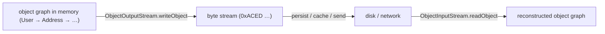
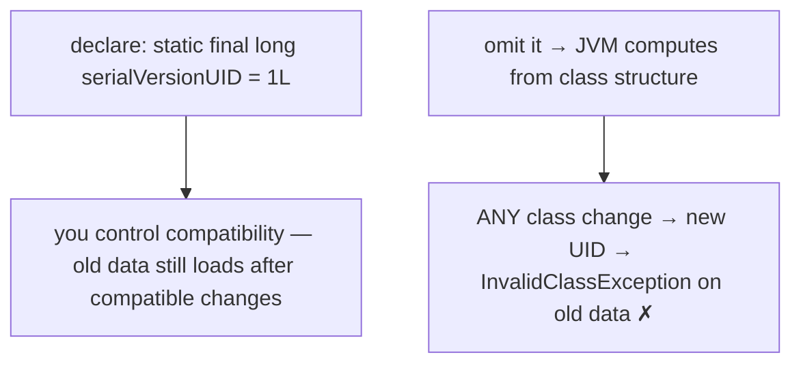
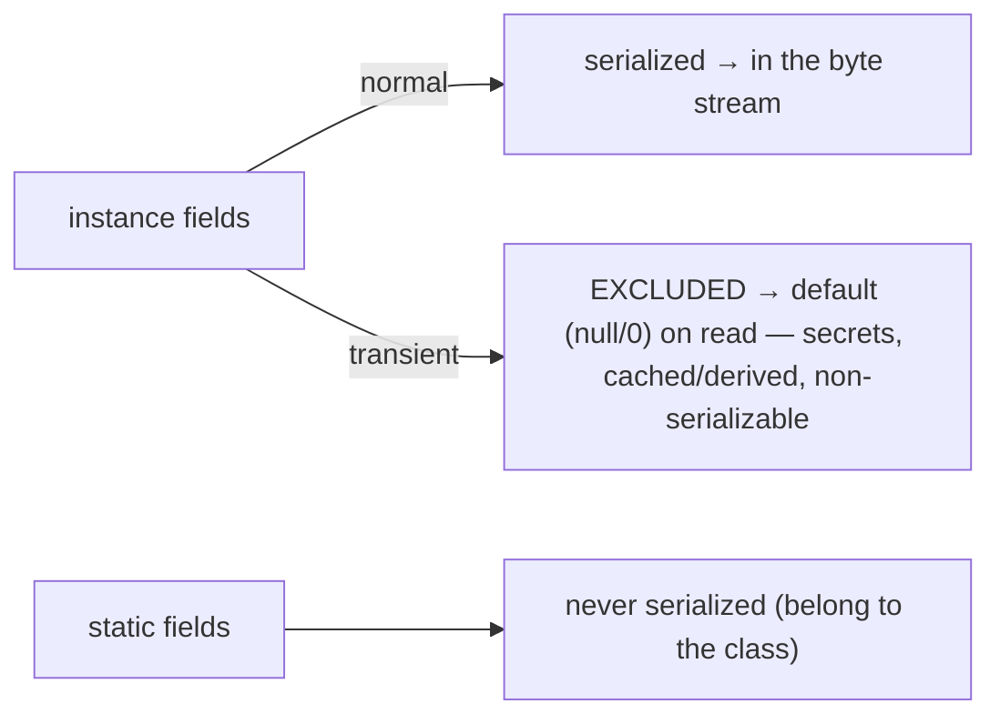
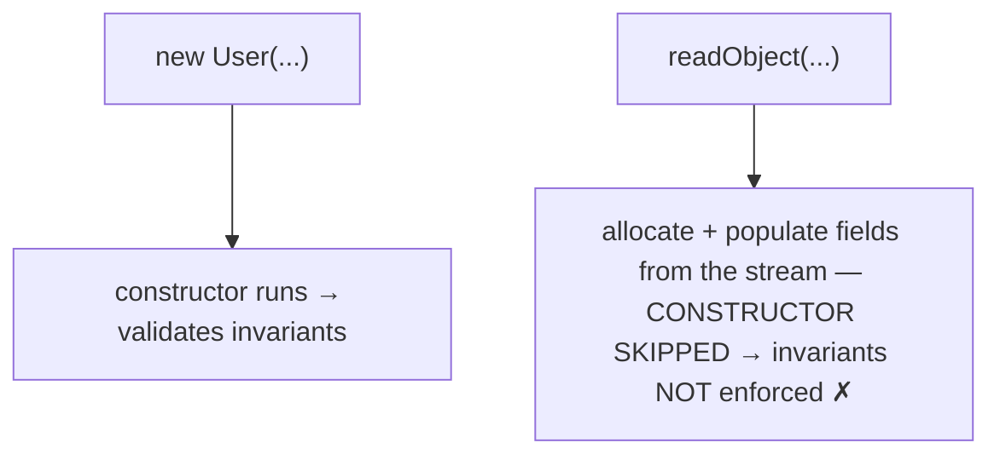
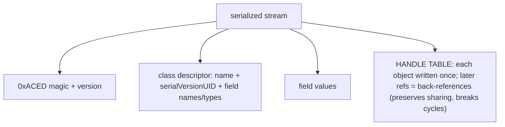
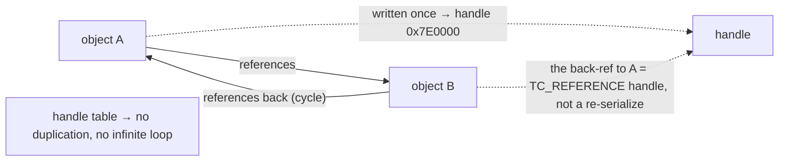
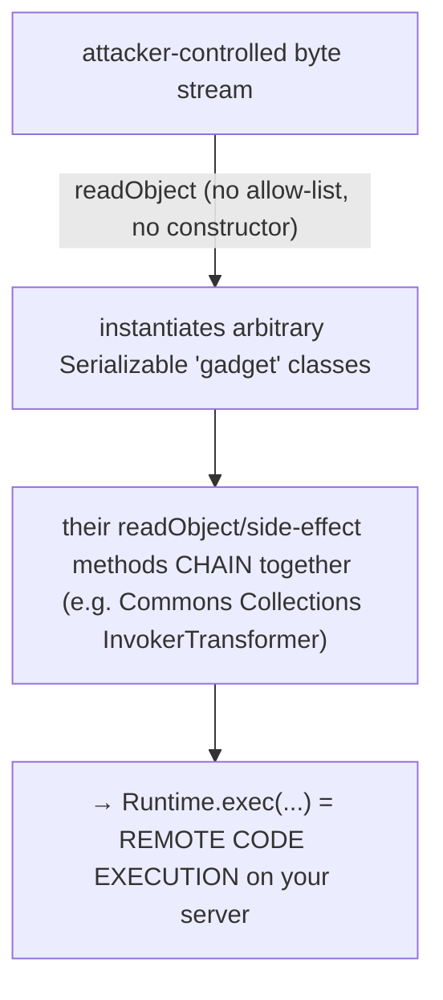
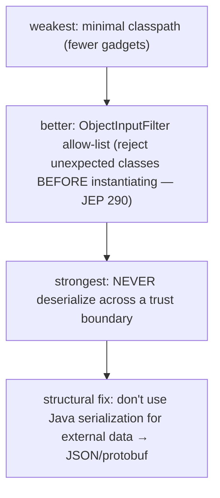
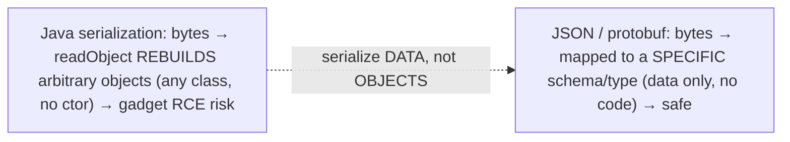
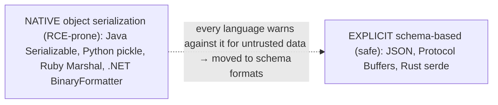

# Serialization & deserialization

**Serialization** converts an in-memory object — and the whole graph of objects it references — into a byte stream you can write to disk, store in a cache, or send over a network; **deserialization** rebuilds the object from those bytes. Java has had a built-in mechanism since 1.1: a class opts in by implementing the **`Serializable`** marker interface, and you write and read with `ObjectOutputStream.writeObject` / `ObjectInputStream.readObject` (the object streams from [T13](./T13-i-o-streams-byte-and-character.md)). It is remarkably convenient — one marker interface and any object graph becomes bytes — and that convenience is exactly the problem.

The depth bar here is **the security disaster that makes native Java serialization a design mistake**, and it is the most important security lesson in this chapter. Deserialization does *not* call the constructor — `readObject` allocates an object and populates its fields directly from the stream, reconstructing **arbitrary object graphs of arbitrary classes** without any of your validation logic running. When the bytes come from an untrusted source, an attacker can craft a stream that, on deserialization, chains together the side effects of "gadget" classes already on your classpath (a `readObject` here, a transformer there) all the way to **`Runtime.exec` — remote code execution**. This is not theoretical: the 2015 "Java deserialization apocalypse" produced RCE exploits in Jenkins, WebLogic, JBoss, and WebSphere, and it is why Joshua Bloch's *Effective Java* says "there is no reason to use Java serialization in any new system" and Oracle is working to remove it from the platform. The cure is the same across every language with this feature (Python's `pickle`, .NET's `BinaryFormatter` share the exact flaw): **never deserialize untrusted data, and use explicit, schema-based formats** — JSON, Protocol Buffers — that serialize *data against a schema*, not *objects via reflection*. By the end you will use the mechanism, control it with `serialVersionUID`/`transient`/`readObject`, and — most importantly — know why you should reach for JSON instead.

> [!NOTE]
> Prerequisites: [I/O streams](./T13-i-o-streams-byte-and-character.md) (`L1/C02/T13`) — `ObjectOutputStream`/`ObjectInputStream` are object streams over byte streams; [custom exceptions](./T10-custom-exceptions-and-try-with-resources.md) (`L1/C02/T10`) — `serialVersionUID` first appeared there (`Throwable` is `Serializable`); [Object cloning](../C01-oop/T18-object-cloning-and-cloneable.md) (`L1/C01/T18`) — deserialization, like `clone`, bypasses the constructor; [Encapsulation](../C01-oop/T03-encapsulation-and-access-modifiers.md) (`L1/C01/T03`) — serialization can expose and corrupt private state. Forward: [T22](./T22-networking-socket-httpclient.md) (networking — where serialized bytes travel).

## The Mechanism — `Serializable`, `writeObject`, `readObject`

A class opts in by implementing **`Serializable`**, a marker interface with no methods ([T08](../C01-oop/T08-interfaces-default-static-private-methods.md)). You then write and read with the object streams:

```java
class User implements Serializable {
    private static final long serialVersionUID = 1L;
    private String name;
    private transient String password;   // excluded — see below
}

try (var out = new ObjectOutputStream(new FileOutputStream("user.ser"))) {
    out.writeObject(user);               // serialize
}
try (var in = new ObjectInputStream(new FileInputStream("user.ser"))) {
    User u = (User) in.readObject();     // deserialize (throws ClassNotFoundException if the class is missing)
}
```

`writeObject` serializes the **entire reachable object graph** — the object plus everything it transitively references — so every referenced object must *also* be `Serializable` (or `transient`), or you get a `NotSerializableException`. A class that doesn't implement `Serializable` cannot be serialized at all.



## `serialVersionUID` and Versioning

Every `Serializable` class has a **`serialVersionUID`** — a `long` version stamp written into the stream and checked on deserialization. If the stream's UID doesn't match the loaded class's UID, you get an **`InvalidClassException`**. The catch: **if you don't declare it, the JVM computes one** by hashing the class's structure (name, fields, methods) — which is *fragile*, because almost any change (adding a method, reordering fields) changes the computed value and breaks every previously-serialized object.



> [!WARNING]
> **Always declare `serialVersionUID` explicitly** on any `Serializable` class. Without it, routine refactoring silently breaks deserialization of existing data. With an explicit UID you control versioning: *compatible* changes (adding a field — old streams read it as the default; adding a method) keep working, while *incompatible* ones (removing a field, changing a type) require a UID bump or migration.

## `transient` — Excluding Fields

The **`transient`** modifier excludes a field from serialization; on deserialization it takes its default value (`null`, `0`, `false`). Use it for three things: **secrets** (passwords, keys — never write them to disk or the wire), **derived or cached state** (a computed hash or memoized value — recompute it on read), and **non-serializable referenced fields** (a `Thread`, a `Socket` — mark them `transient` or serialization fails). `static` fields are also never serialized — they belong to the class, not the instance.



## The Constructor Is Not Called — and the Custom Hooks

Here is the fact that drives both the correctness hazards and the security disaster: **deserialization does not call the class's constructor.** `readObject` allocates the object (the same `Unsafe`-style allocation as `Object.clone` — [T18](../C01-oop/T18-object-cloning-and-cloneable.md)) and writes its fields *directly* from the stream, so none of the validation or invariant-establishing logic in your constructors runs. An object can therefore be reconstructed in a state your constructor would have rejected.



To regain control, a class can implement private hooks the streams call by reflection: **`private void writeObject(ObjectOutputStream)`** and **`private void readObject(ObjectInputStream)`** (call `defaultWriteObject`/`defaultReadObject`, then add custom logic — crucially, **validate** in `readObject` and throw `InvalidObjectException` on bad data); **`Object writeReplace()`** / **`Object readResolve()`** to substitute objects (e.g. `readResolve` returns the canonical singleton instance so a deserialized singleton stays unique — enums do this implicitly). `Externalizable` (a sub-interface) gives full manual control via `writeExternal`/`readExternal` and *does* call the public no-arg constructor.

## Memory — The Byte-Stream Format

The serialized stream is **self-describing**: it carries the class metadata, not just the data. It begins with a magic number **`0xACED`** plus a stream version, then for each object a **class descriptor** (`TC_CLASSDESC`: the class name, its `serialVersionUID`, flags, and the name+type of each non-`transient`, non-`static` field) followed by the **field values**. Shared and cyclic references are handled by a **handle table**: each object (and class descriptor and string) is written *once* and assigned a handle; a later reference to the same object writes a back-reference to that handle instead of re-serializing it — which both preserves object **sharing** and breaks **cycles** (the object is registered in the table before its fields are written, so a reference cycling back to it resolves to the handle).





Because the format embeds class names, field names, types, and UIDs, it is **verbose** (a tiny object can produce a surprisingly large stream) and **tightly coupled** to the exact class structure — which is both a performance cost and the reason versioning is so brittle. `transient` and `static` fields contribute zero bytes.

## Architecture — The Deserialization RCE Disaster

This is the lesson to carry out of the chapter. **Deserializing untrusted data is one of the worst remote-code-execution vulnerability classes in Java's history.** The mechanism that makes it possible: `readObject` will instantiate and populate **any `Serializable` class named in the stream**, without calling constructors, and *before* your code can check the type. Certain "**gadget**" classes on the classpath have `readObject` (or `finalize`, or transformer) methods with **side effects** — they invoke methods, perform reflection, or run transformations. An attacker who controls the bytes crafts a stream that, on deserialization, instantiates and **chains these gadgets** — a *gadget chain* — until one of them calls `Runtime.getRuntime().exec(...)`.



The canonical gadget was **Apache Commons Collections**' `InvokerTransformer`/`ChainedTransformer` (wrapped in a `TransformedMap` whose `readObject` triggers the chain), and the **ysoserial** tool generates ready-made payloads. The **2015 "Java deserialization apocalypse"** (Frohoff & Lawrence) showed that *any* application deserializing untrusted data with such a library on the classpath was exploitable — **Jenkins, WebLogic, JBoss, WebSphere, OpenNMS** all fell — one of the worst security events in Java's history, followed by a flood of CVEs. It is so dangerous because deserialization is an **invisible constructor running attacker-controlled code paths**, the type is validated only *after* objects are built, and there is **no allow-list by default**.

The mitigations, weakest to strongest: **`ObjectInputFilter`** (Java 9, JEP 290) lets you set an **allow-list** of acceptable classes (plus depth/size limits) that `readObject` enforces *before* instantiating; a minimal classpath reduces available gadgets; but the only real safety is to **never deserialize data that crosses a trust boundary**. And the structural fix is to stop using Java serialization for such data at all.



> [!WARNING]
> **Never call `readObject` on data from an untrusted source** — a network socket, a user upload, a cache an attacker can poison. It is a direct path to remote code execution. Use a schema-based data format (below), and if you *must* use Java serialization, lock it down with an `ObjectInputFilter` allow-list.

## The Modern Alternative — Serialize Data, Not Objects

The fix the industry converged on is **explicit, schema-based formats** that serialize **data against a known schema**, not **objects via reflection**. The difference is everything: deserialization maps the bytes into a *specific expected type*, so it cannot instantiate arbitrary classes or run gadget chains.



- **JSON** (Jackson, Gson) — human-readable, language-neutral, ubiquitous; binds to your DTO types via getters/constructors. The lingua franca of web APIs. (Jackson can still be misused — enabling polymorphic "default typing" on untrusted input reintroduces a gadget risk — but the data-binding model is fundamentally safer.)
- **Protocol Buffers** (Google), **Avro**, **Thrift** — binary, defined by an external **schema** (`.proto`), compact and fast, cross-language (the backbone of gRPC). The bytes are just field tags and values — no class metadata, no code.

These are also **smaller and faster** than Java serialization (which embeds verbose class descriptors), so they win on performance and cross-language interop even before security. And **records** ([T14-C01](../C01-oop/T14-record-types.md)) point toward safer native serialization: a record deserializes through its **canonical constructor**, so validation runs.

## Cross-Language Perspective

The pattern is universal: **native object serialization is a security disaster in every managed language that has it, and explicit schema-based formats are the safe path everywhere.**

| Language | Native (dangerous) | Safe / explicit |
|---|---|---|
| **Java** | `Serializable` / `ObjectInputStream` | JSON (Jackson), Protocol Buffers |
| **Python** | **`pickle`** ("not secure — only unpickle data you trust") | `json`, protobuf |
| **Ruby** | **`Marshal`** | JSON |
| **.NET** | **`BinaryFormatter`** (deprecated/removed — "can't be made secure") | `System.Text.Json`, protobuf |
| **Go** | `encoding/gob` (registered types — safer, Go-only) | `encoding/json`, protobuf |
| **Rust** | — | **`serde`** (compile-time, type-safe) |

The parallels are exact. **Python's `pickle`** has the identical flaw — its `__reduce__` protocol lets a serialized object name a callable to run on unpickle, so a crafted pickle can execute `os.system(...)`; the Python docs warn in bold "**only unpickle data you trust**." **Ruby's `Marshal`** and **.NET's `BinaryFormatter`** are the same story — and Microsoft **deprecated `BinaryFormatter`** (obsolete since .NET 5, throwing by default in .NET 9) with the blunt guidance that it "is insecure and can't be made secure." Every one of these languages reconstructs arbitrary objects via reflection and every one is a gadget-chain target. The **safe path is identical everywhere**: **JSON** for human-readable cross-language data, **Protocol Buffers** for compact binary, and at the safest end, **Rust's `serde`** — a *compile-time* framework (its derive macros generate the code — [T18](./T18-annotations-using-and-writing-meta-annotations.md)) that deserializes into a *specific type* with no reflection and no arbitrary instantiation. The convergence is a one-line rule that holds across the industry: **serialize data against a schema, never objects via reflection.**



## Common Mistakes

> [!WARNING]
> **Deserializing untrusted data.** The #1 mistake — a direct remote-code-execution path. Never `readObject` data from a network, upload, or attacker-poisonable cache. Use JSON/protobuf, or an `ObjectInputFilter` allow-list if you truly must.

> [!WARNING]
> **No `serialVersionUID`.** The JVM computes a fragile one, so any class change breaks old data with `InvalidClassException`. Always declare it explicitly.

> [!WARNING]
> **Forgetting `transient` on secrets.** Passwords, keys, and tokens in non-`transient` fields get written to disk and the wire in the clear. Mark them `transient`.

> [!WARNING]
> **Assuming the constructor runs.** Deserialization bypasses it, so invariants and validation are not enforced — an object can be reconstructed in an invalid (or malicious) state. Validate in a `readObject` method.

> [!WARNING]
> **A non-`Serializable` referenced field.** Serializing an object whose graph includes a non-`Serializable` field throws `NotSerializableException`. Mark the field `transient` or make its type serializable.

> [!WARNING]
> **Java serialization for long-term storage or cross-language data.** The format is brittle (tied to class structure) and Java-only. Use JSON or Protocol Buffers for anything that outlives the class version or crosses a language boundary.

## Practice

> [!INTERVIEW]
> Common interview questions for this topic:
> 1. **What is serialization?** Converting an object graph to a byte stream (for storage/transport) and back; Java uses `Serializable` + `ObjectOutputStream`/`ObjectInputStream`.
> 2. **What is `Serializable`?** A marker interface (no methods) that opts a class in; non-`Serializable` classes throw `NotSerializableException`.
> 3. **What is `serialVersionUID` and why declare it?** A version stamp checked on deserialization; without an explicit one the JVM computes a fragile value, so any class change breaks old data — always declare it.
> 4. **What does `transient` do?** Excludes a field (default/null on read) — for secrets, derived state, and non-serializable fields. `static` fields are also excluded.
> 5. **Does deserialization call the constructor?** No — it allocates and populates fields directly, bypassing validation; validate in a `readObject` method.
> 6. **How are cycles and shared references handled?** A handle table — each object is written once and later references are back-references.
> 7. **Why is Java deserialization dangerous?** Deserializing untrusted data can chain gadget classes' side effects into remote code execution; it's a top vulnerability class.
> 8. **How do you mitigate it?** Never deserialize untrusted data; use `ObjectInputFilter` (allow-list); prefer schema-based formats (JSON/protobuf).
> 9. **What's the modern alternative?** JSON (Jackson) and Protocol Buffers — they serialize data against a known schema, not arbitrary objects, so they can't run code.
> 10. **What are `writeReplace`/`readResolve`?** Hooks to substitute objects on write/read — `readResolve` returns the canonical instance (e.g. for singletons; enums use it implicitly).
> 11. **`Externalizable` vs `Serializable`?** `Externalizable` gives full manual control (`writeExternal`/`readExternal`) and calls the no-arg constructor; `Serializable` is automatic.
> 12. **How do other languages compare?** Python `pickle`, Ruby `Marshal`, .NET `BinaryFormatter` share the RCE risk (BinaryFormatter is deprecated); JSON/protobuf are the safe path.
> 13. **What's in the byte stream?** A `0xACED` magic number, class descriptors (name + `serialVersionUID` + fields), field values, and a handle table — self-describing and verbose.

1. **Round trip.** Make a class `Serializable`; write it with `ObjectOutputStream`, read it back with `ObjectInputStream`, and confirm equality.

2. **`serialVersionUID`.** Serialize a class with no explicit UID; add a field and try to deserialize the old bytes → `InvalidClassException`. Add an explicit UID and repeat; confirm it now loads.

3. **`transient`.** Mark a password field `transient`; serialize and deserialize; confirm the password is `null` afterward.

4. **Object graph.** Serialize a structure with a shared reference and a cycle; deserialize and confirm the sharing is preserved (one object) and the cycle didn't loop forever.

5. **Constructor not called.** Put a `println` in the constructor; deserialize an instance and confirm it does *not* print.

6. **`readObject` validation.** Add a `readObject` that calls `defaultReadObject` then validates an invariant; feed it a stream that violates the invariant and confirm it throws `InvalidObjectException`.

7. **`NotSerializableException`.** Add a non-`Serializable` field; serialize and observe the exception; fix it with `transient`.

8. **Gadget-chain concept (no real exploit).** Explain in words why `readObject` on untrusted data with a vulnerable library is an RCE path; name `ysoserial` and the Commons Collections gadget.

9. **JSON with Jackson.** Serialize the same object to JSON and back with `ObjectMapper`; compare readability and safety with Java serialization.

10. **`ObjectInputFilter`.** Set an allow-list filter on an `ObjectInputStream` and confirm it rejects an unexpected class before instantiation.

11. **`readResolve` singleton.** Serialize and deserialize a singleton; show a new instance appears without `readResolve` and the canonical one with it.

12. **Inspect the bytes.** Hex-dump a `.ser` file; find the `0xACED` magic and the embedded class name.

13. **Record serialization.** Serialize a record; confirm it deserializes via the canonical constructor (so validation runs).

14. **`Externalizable`.** Implement `writeExternal`/`readExternal` for full control; note that the public no-arg constructor *is* called.

15. **End-to-end explain-it-back.** (a) How `writeObject` serializes a graph (class descriptors + handle table); (b) why `readObject` skips the constructor and why that's dangerous; (c) the deserialization gadget-chain RCE; (d) how `ObjectInputFilter` helps; (e) why JSON/protobuf are safe (data against a schema, no arbitrary instantiation). Twelve sentences max.

## Recap

You should now be able to:

**Language layer.**

- Use `Serializable` + `ObjectOutputStream`/`ObjectInputStream` to serialize an object graph, and control it with `serialVersionUID`, `transient`, the `readObject`/`writeObject` hooks, and `readResolve`.
- Explain why deserialization bypasses the constructor and how to re-establish invariants by validating in `readObject`.

**Memory layer.**

- Describe the byte-stream format — `0xACED` magic, class descriptors (name + `serialVersionUID` + fields), field values, and a handle table that preserves sharing and breaks cycles — and why it is verbose and brittle.

**Architecture layer.**

- Explain the deserialization-of-untrusted-data RCE class (gadget chains, the 2015 apocalypse) and why it exists (arbitrary-class instantiation without constructors, no allow-list), and mitigate it with `ObjectInputFilter` and — properly — by not using Java serialization across trust boundaries.
- Justify the modern preference for schema-based formats (JSON, Protocol Buffers) that serialize data against a schema rather than objects via reflection, and place Java alongside Python `pickle`, Ruby `Marshal`, .NET `BinaryFormatter`, and the safe `serde`/JSON/protobuf path.

The next topic is where serialized bytes most often go: across the network. [T22](./T22-networking-socket-httpclient.md) — networking — covers the low-level `Socket`/`ServerSocket` TCP API and the modern `HttpClient`, the layers beneath them (TCP/IP, DNS, HTTP), blocking vs the building blocks of non-blocking I/O, and why you serialize data with JSON over HTTP rather than Java objects over a socket.

## Next

Continue to [Networking (Socket, HttpClient)](./T22-networking-socket-httpclient.md) — moving bytes between machines, the destination for everything you've learned to serialize. T21 turned objects into bytes; T22 sends those bytes across the network. It covers the low-level **`Socket`/`ServerSocket`** TCP API (a connection as a pair of streams — the [T13](./T13-i-o-streams-byte-and-character.md) `InputStream`/`OutputStream` again, now over the wire), the layers underneath (IP addressing, DNS resolution, TCP's reliable byte stream, and HTTP on top), the modern **`HttpClient`** (Java 11 — synchronous and asynchronous requests, HTTP/2), blocking I/O and a glimpse of the non-blocking model (the NIO channels/selectors from [T14](./T14-nio-2-path-files-channels.md) that power high-concurrency servers), and — tying back to T21 — why real systems send **JSON over HTTP** rather than Java objects over a raw socket.
