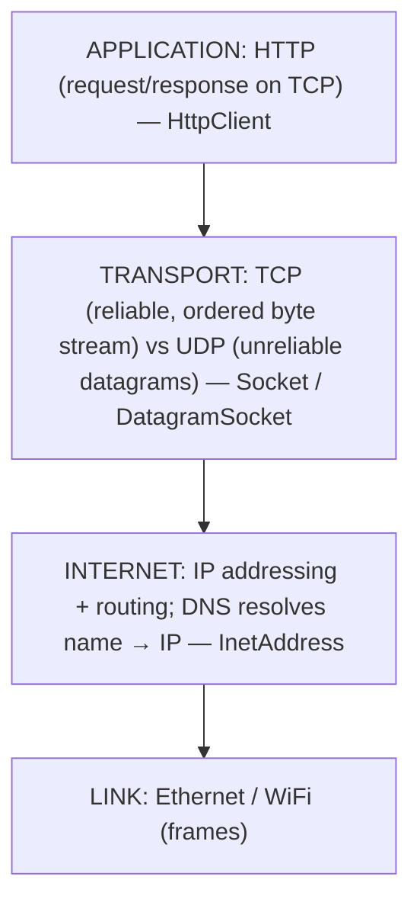
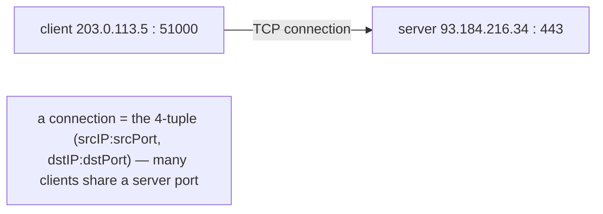
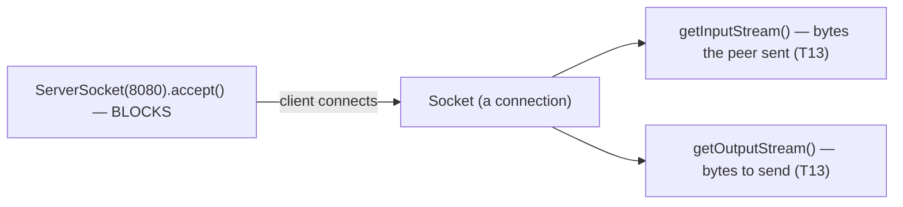
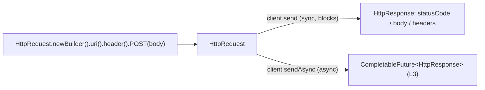
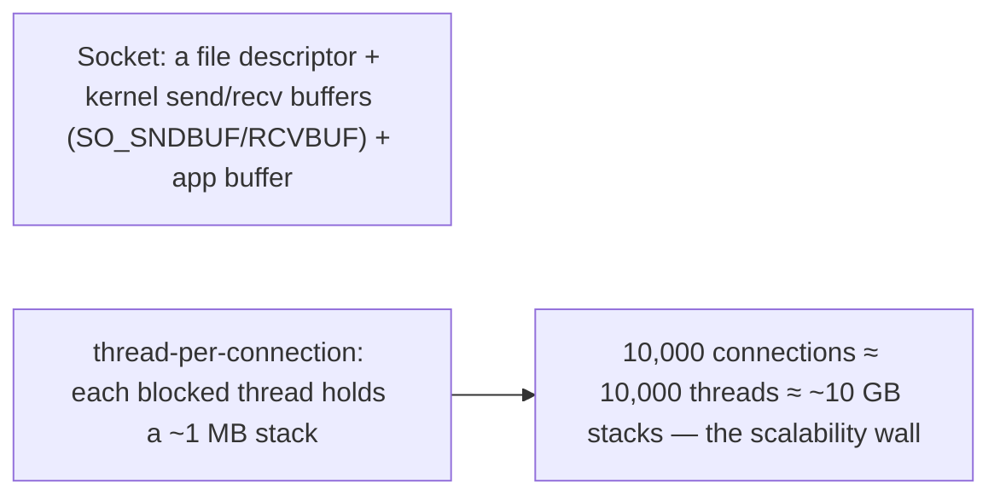
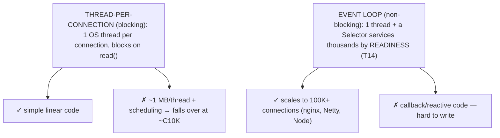
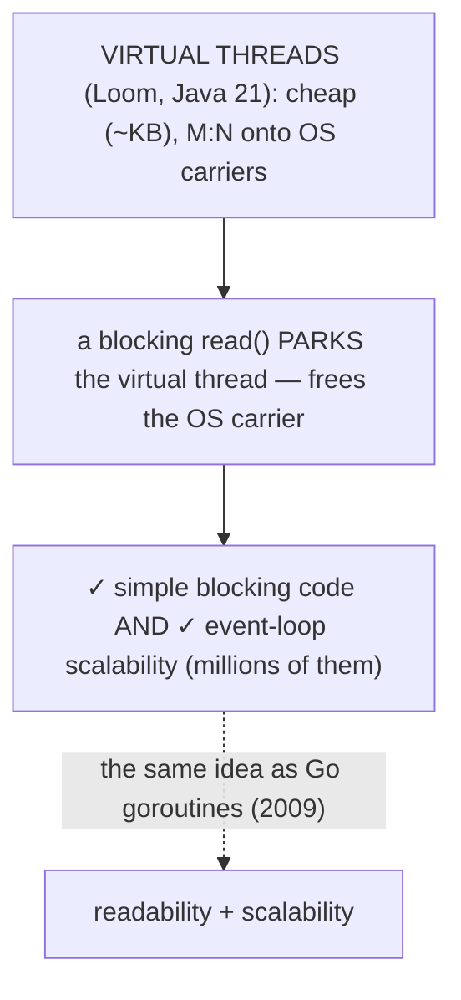
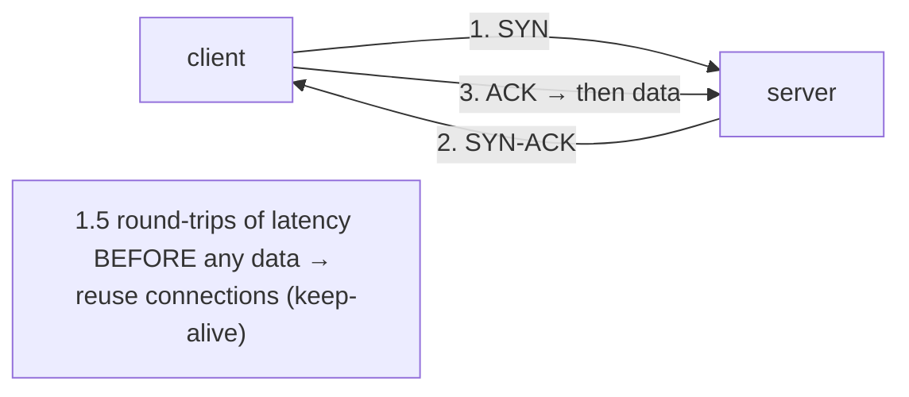
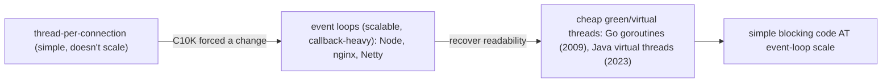

# Networking (Socket, HttpClient)

This is where the bytes go: across the network, to another machine. Everything you learned to serialize ([T21](./T21-serialization-and-deserialization.md)) and stream ([T13](./T13-i-o-streams-byte-and-character.md)) ultimately travels over a network connection, and Java exposes networking at two levels. At the **low level**, a TCP connection is a **`Socket`** — and the beautiful thing is that it is *just a pair of streams*: `getInputStream()`/`getOutputStream()` give you the same `InputStream`/`OutputStream` from [T13](./T13-i-o-streams-byte-and-character.md), now reading bytes the peer sent and writing bytes to send. A server uses a **`ServerSocket`** whose `accept()` blocks until a client connects. At the **high level**, Java 11's **`HttpClient`** speaks HTTP for you — request builders, synchronous and asynchronous sends, HTTP/2 — so you rarely touch raw sockets in application code. Beneath both sit the layers of the stack: IP addressing and DNS, TCP's reliable byte stream, and HTTP on top.

The depth bar is **the concurrency model — blocking thread-per-connection versus the non-blocking event loop — and the C10K problem that drove the industry from one to the other and, with virtual threads, back again**. The simplest server gives each connection its own thread that *blocks* on `read()` waiting for data: easy to write (linear, top-to-bottom code), but each thread costs a ~1 MB stack and OS scheduling, so **ten thousand concurrent connections means ~10 GB of idle stacks and a thrashing scheduler** — the famous *C10K problem*. The escape was the **event loop**: a single thread using a `Selector` ([T14](./T14-nio-2-path-files-channels.md)) to service thousands of connections by *readiness* — scalable (nginx, Netty, Node.js) but painful to program in callbacks. Java 21's **virtual threads** (Project Loom) reconcile the two: cheap JVM-scheduled threads that *park* on blocking I/O without tying up an OS thread, so you write simple blocking code that scales like an event loop — exactly what Go's goroutines have done since 2009. By the end you will write a socket server and an `HttpClient` request, understand TCP underneath, and know why a million-connection server no longer requires giving up readable code — and why you send JSON over HTTP rather than Java objects over a socket.

> [!NOTE]
> Prerequisites: [I/O streams](./T13-i-o-streams-byte-and-character.md) (`L1/C02/T13`) — a socket *is* an `InputStream`/`OutputStream`, and each read/write is a syscall; [NIO.2](./T14-nio-2-path-files-channels.md) (`L1/C02/T14`) — channels and `Selector`s power non-blocking networking; [Serialization](./T21-serialization-and-deserialization.md) (`L1/C02/T21`) — why you send JSON over HTTP, not Java objects over a socket; [try-with-resources](./T10-custom-exceptions-and-try-with-resources.md) (`L1/C02/T10`) — sockets are `Closeable` and leak file descriptors if unclosed. Forward: [T23](./T23-internationalization-i18n-and-formatting.md) (i18n — the last C02 topic), L3 (concurrency, virtual threads, async).

## The Network Stack

Networking is layered, and Java touches three of those layers:



- **IP** identifies hosts by address (IPv4 `a.b.c.d` 32-bit, IPv6 128-bit), and **DNS** resolves a name like `example.com` to an IP. Java: `InetAddress.getByName("example.com")` performs the DNS lookup.

```mermaid
flowchart LR
  Name["\"example.com\" (a name)"] -->|"InetAddress.getByName → DNS query"| IP["93.184.216.34 (an IP address)"]
  IP -->|"connect to IP:port"| Conn["TCP connection"]
  Note["DNS is a network round-trip — cache it, don't resolve per request"]
```

- **TCP** (`Socket`) is a **reliable, ordered, connection-oriented byte stream** — it guarantees delivery (retransmitting lost data), order (sequence numbers), and integrity (checksums). **UDP** (`DatagramSocket`) is **unreliable, connectionless datagrams** — fire-and-forget, low overhead, for video/voice/games/DNS where speed beats guaranteed delivery.
- **HTTP** is an application protocol *on top of* TCP — request/response, methods (GET/POST/…), headers, status codes; HTTPS is HTTP over TLS.

A **port** (16-bit) identifies a service on a host (80 = HTTP, 443 = HTTPS), and a connection is uniquely identified by the **4-tuple** `(source IP, source port, destination IP, destination port)`.



## The Low-Level Socket API

A server listens with **`ServerSocket`**; its **`accept()`** blocks until a client connects and returns a **`Socket`** for that connection. A `Socket` *is* a pair of streams — and that is the key insight: **a TCP connection is the [T13](./T13-i-o-streams-byte-and-character.md) `InputStream`/`OutputStream` abstraction, over the wire.**

```java
try (ServerSocket server = new ServerSocket(8080)) {
    while (true) {
        Socket socket = server.accept();              // BLOCKS until a client connects
        try (var in = socket.getInputStream();
             var out = socket.getOutputStream()) {
            in.transferTo(out);                        // echo the bytes back (T13)
        }
    }
}
```

The client side is symmetric: `new Socket(host, port)` opens the connection, then `getInputStream`/`getOutputStream` read and write bytes. You wrap those streams in buffered/character decorators exactly as in [T13](./T13-i-o-streams-byte-and-character.md) (`BufferedReader`, `PrintWriter`). Sockets are `Closeable`, so use `try`-with-resources to avoid leaking file descriptors ([T10](./T10-custom-exceptions-and-try-with-resources.md)).



## The Modern `HttpClient`

For HTTP you almost never use raw sockets — Java 11's **`HttpClient`** (`java.net.http`) handles the protocol. The client is immutable, thread-safe, and reusable (it pools connections — like `DateTimeFormatter`, build one and share it):

```java
HttpClient client = HttpClient.newHttpClient();
HttpRequest req = HttpRequest.newBuilder()
    .uri(URI.create("https://api.example.com/users"))
    .header("Accept", "application/json")
    .POST(HttpRequest.BodyPublishers.ofString(jsonBody))
    .build();

HttpResponse<String> resp = client.send(req, BodyHandlers.ofString());   // SYNCHRONOUS — blocks
int status = resp.statusCode();
String body = resp.body();

CompletableFuture<HttpResponse<String>> future =                          // ASYNCHRONOUS — non-blocking
    client.sendAsync(req, BodyHandlers.ofString());
```

`send` blocks until the response; `sendAsync` returns a `CompletableFuture` immediately (async — L3). It speaks **HTTP/2** by default (multiplexing many requests over one connection, falling back to HTTP/1.1), and `BodyHandlers`/`BodyPublishers` adapt the body to/from `String`, `byte[]`, files, or streams. It replaced the old, awkward, blocking-only `HttpURLConnection`.



## Memory — A Socket Is a File Descriptor, a Thread Is a Megabyte

A `Socket` is cheap in itself: a **file descriptor** (the OS socket handle) plus a little metadata. The memory lives in the **kernel's per-socket send and receive buffers** (`SO_SNDBUF`/`SO_RCVBUF`, often tens to hundreds of KB each, holding in-flight data) plus your application's buffer (the `BufferedReader` over the socket — [T13](./T13-i-o-streams-byte-and-character.md)). An `InetAddress` is just the IP bytes (4 or 16) plus the hostname.

The expensive thing is the **thread**. In the simplest server each connection is handled by a dedicated platform thread, and a Java platform thread carries a **call stack of ~512 KB–1 MB** (the `-Xss` thread stack — L0). A thread *blocked* on `accept()` or `read()` still holds its entire stack. So **10,000 concurrent connections = 10,000 threads ≈ 10 GB of idle stacks**, plus the OS scheduler tracking and context-switching among them all. That memory wall — not the sockets — is what breaks the simple model at scale.



## Architecture — Thread-per-Connection, the Event Loop, and Virtual Threads

Here is the central story of network programming. The **blocking, thread-per-connection** model is wonderfully simple — `accept` a connection, hand it to a thread, and that thread *blocks* on `read()` until data arrives, processes it linearly, and writes a response. The code reads top-to-bottom like ordinary logic. But it does not scale: each connection needs its own OS thread, a blocked thread wastes its ~1 MB stack, and the scheduler thrashes context-switching thousands of threads — so the practical ceiling is a few thousand connections. Handling **ten thousand** ("**C10K**", Dan Kegel, 1999) collapses it.



The historical escape was the **non-blocking event loop**: instead of one thread per connection, a single thread uses a **`Selector`** ([T14](./T14-nio-2-path-files-channels.md)) to monitor *many* sockets for **readiness** events ("this socket has data," "that one is writable"), servicing each as it becomes ready in a tight loop. One thread handles tens of thousands of connections — the model behind **nginx, Netty, and Node.js**. It scales beautifully, but at a steep cost in *readability*: you cannot write linear code, because one thread interleaves thousands of connections and must never block on any of them — so the logic fragments into callbacks, state machines, or reactive pipelines.

Java 21's **virtual threads** (Project Loom, JEP 444) reconcile the two. A virtual thread is a **cheap, JVM-scheduled thread** (a few KB, not ~1 MB) multiplexed `M:N` onto a small pool of OS "carrier" threads. When a virtual thread **blocks on I/O**, the JVM **parks** it — saving its tiny stack and freeing the carrier thread to run another virtual thread — so a blocking `read()` no longer ties up an OS thread. The payoff: you write **simple, blocking, thread-per-connection code** (readable, linear), and it **scales like an event loop** (millions of virtual threads). It is the readability of the old model with the scalability of the new — and exactly what **Go's goroutines** have offered since 2009.



Underneath, **TCP** earns its reliability with overhead worth knowing. A connection opens with a **3-way handshake** (client `SYN` → server `SYN-ACK` → client `ACK` — 1.5 round-trips *before any data*), so connection *setup* costs latency, which is why HTTP **keep-alive** and connection **pooling** (which `HttpClient` does) matter. During the connection, every segment is sequence-numbered and acknowledged, with retransmission on loss and a sliding **window** for flow control. And each socket `read`/`write` is a **syscall** ([T13](./T13-i-o-streams-byte-and-character.md)), so buffering applies here too.



## Cross-Language Perspective

The **socket layer is universal; the concurrency model is where languages differ and evolved.** Java's `Socket`/`ServerSocket` are a thin wrapper over the **POSIX BSD sockets API** — `socket`, `bind`, `listen`, `accept`, `connect`, `recv`, `send`, `close` — the same primitives every language wraps almost identically (Python's `socket` module is nearly 1:1 with the C API; Go's `net`, Rust's `std::net`, Node's `net`, C#'s `System.Net.Sockets`). A socket is a bidirectional byte stream identified by a 4-tuple, everywhere.

| Concurrency model | Languages | Trade-off |
|---|---|---|
| **Thread-per-connection** (blocking) | classic Java, C + pthreads, Python threads | simple, doesn't scale (C10K) |
| **Event loop** (non-blocking) | **Node.js** (by design), nginx, Java NIO/Netty, Python `asyncio` | scales, callback/async complexity |
| **Cheap green/virtual threads** | **Go goroutines**, **Java virtual threads**, Erlang/Elixir | simple blocking code *and* scales |
| **`async`/`await`** | Rust (`tokio`), C#, Python | scales, explicit async coloring |

The evolution is the story. **Node.js** made the *event loop* its entire identity — single-threaded, non-blocking from day one, which is why JavaScript server code is built on callbacks/promises/`async-await`. **Go** took the elegant path with **goroutines**: a goroutine is a lightweight (~few KB) thread the Go runtime `M:N`-schedules onto OS threads, transparently multiplexing blocking I/O onto `epoll` underneath — so you write *simple blocking* `conn.Read()` code that scales like an event loop. Go solved C10K cleanly in 2009, and it is the reason Go dominates network services. **Java's virtual threads (2023) are the same idea, finally** — and **Erlang/Elixir's** lightweight processes are an even older incarnation. **Rust** and **C#** chose `async`/`await` with an executor (`tokio`) — zero-cost but with explicit async "coloring." And every language has an HTTP client (Python `requests`/`httpx`, JS `fetch`, Go `net/http`, Rust `reqwest`) because the universal way services talk is **JSON (or protobuf) over HTTP** — *not* native object serialization ([T21](./T21-serialization-and-deserialization.md)). The convergence: a universal socket layer, a concurrency model that has arrived at cheap-threads-with-blocking-style-code, and application data carried as schema'd text/binary over HTTP.



## Common Mistakes

> [!WARNING]
> **Not closing sockets.** An unclosed `Socket`/`ServerSocket` leaks a file descriptor, and the OS caps them per process. Use `try`-with-resources ([T10](./T10-custom-exceptions-and-try-with-resources.md)).

> [!WARNING]
> **Thread-per-connection at scale.** Fine for hundreds of connections; it collapses near C10K (~10 GB of stacks). Use non-blocking NIO, an async framework, or — simplest — virtual threads (Java 21).

> [!WARNING]
> **No timeouts.** A hung or slow peer blocks a thread forever. Set `socket.setSoTimeout(ms)` (read timeout) and a connect timeout; for `HttpClient`, set `connectTimeout` and per-request `timeout`.

> [!WARNING]
> **Assuming one `read()` = one message.** TCP is a *byte stream*, not message-framed — a `read()` may return fewer bytes than asked, split a logical message across reads, or combine two. Frame messages yourself (length prefix or delimiter) or use a protocol that does (HTTP's `Content-Length`).

> [!WARNING]
> **Sending Java-serialized objects over a socket.** It combines the deserialization-RCE risk ([T21](./T21-serialization-and-deserialization.md)) with brittleness and Java-only coupling. Send **JSON over HTTP** instead.

> [!WARNING]
> **Plaintext and per-request DNS/connections.** Use HTTPS/TLS for anything sensitive; cache DNS and reuse connections (keep-alive) rather than re-resolving and re-handshaking on every request.

## Practice

> [!INTERVIEW]
> Common interview questions for this topic:
> 1. **What are the network layers?** IP (addressing/DNS), TCP (reliable ordered byte stream) vs UDP (unreliable datagrams), HTTP (on TCP); a connection is the 4-tuple of IPs and ports.
> 2. **TCP vs UDP?** TCP is reliable, ordered, connection-oriented (handshake, retransmit) for correctness; UDP is unreliable, connectionless, low-overhead for speed (streaming, games, DNS).
> 3. **What is a `Socket` in Java?** A TCP connection exposed as a pair of streams (`getInputStream`/`getOutputStream`) — the [T13](./T13-i-o-streams-byte-and-character.md) streams over the wire; `ServerSocket.accept` blocks for connections.
> 4. **What does `accept()` do?** Blocks until a client connects, then returns a `Socket` for that connection.
> 5. **What is the Java 11 `HttpClient`?** A reusable, thread-safe client with synchronous `send` and asynchronous `sendAsync` (`CompletableFuture`), HTTP/2 — replacing `HttpURLConnection`.
> 6. **Thread-per-connection model and its limit?** One OS thread per connection; simple but each ~1 MB stack + scheduling caps it at a few thousand connections (C10K).
> 7. **What is the C10K problem?** Handling 10,000 concurrent connections — thread-per-connection collapses under memory/scheduling cost; solved by event loops or cheap threads.
> 8. **The non-blocking/event-loop model?** A `Selector` monitors many sockets for readiness; one thread services thousands via an event loop (nginx/Netty/Node) — scalable but callback-based.
> 9. **What are virtual threads?** Cheap JVM threads (Java 21/Loom) `M:N`-scheduled onto OS threads; a blocking call parks the virtual thread without tying up an OS thread, so blocking-style code scales like an event loop.
> 10. **Why handle partial reads?** TCP is a byte stream, not message-framed — `read()` may return fewer bytes or split/merge messages; frame them (length/delimiter) or use HTTP.
> 11. **Why reuse connections / keep-alive?** Each new TCP connection costs a 3-way handshake; reuse avoids the round-trip latency.
> 12. **Why JSON over HTTP, not Java objects over a socket?** Java serialization is an RCE risk ([T21](./T21-serialization-and-deserialization.md)), brittle, and Java-only; JSON over HTTP is safe, debuggable, and language-neutral.
> 13. **How do other languages compare?** The BSD socket API is universal; concurrency evolved from thread-per-connection → event loops (Node) → cheap green threads (Go goroutines, Java virtual threads).

1. **Echo server.** Write a `ServerSocket.accept` loop that reads bytes and writes them back; connect with a `Socket` client (or `nc`/`telnet`).

2. **Line protocol.** Wrap the socket streams in `BufferedReader`/`PrintWriter`; send a line from the client and read the echoed line.

3. **Thread-per-connection.** Spawn a new thread per `accept` so the server handles several clients concurrently; observe the per-thread cost.

4. **`HttpClient` GET.** Fetch a URL synchronously; print the status code and body.

5. **POST JSON.** Send a JSON body with `BodyPublishers.ofString` and read the JSON response — the [T21](./T21-serialization-and-deserialization.md) safe path.

6. **`sendAsync`.** Fire several requests concurrently with `sendAsync`, then join their `CompletableFuture`s.

7. **DNS.** Resolve a hostname with `InetAddress.getByName` (print all addresses) and `getLocalHost`.

8. **Timeout.** Set `socket.setSoTimeout(1000)` and connect to a slow/non-responding peer; observe `SocketTimeoutException`.

9. **Partial reads / framing.** Show that `read()` can return fewer bytes than requested; implement length-prefixed message framing over the stream.

10. **UDP.** Send and receive a `DatagramPacket` over a `DatagramSocket`; contrast the lack of delivery guarantee with TCP.

11. **Selector sketch.** Describe (or code a minimal) NIO `Selector` loop that services two connections on one thread; relate to the event-loop model.

12. **Virtual threads.** Run the thread-per-connection server on `Executors.newVirtualThreadPerTaskExecutor()` (Java 21); note that it scales without the ~1 MB-per-thread cost.

13. **HTTPS.** Make an `HttpClient` request to an `https://` URL; note the TLS handshake happens transparently.

14. **Connection reuse.** Make several requests with one `HttpClient`; explain how keep-alive avoids re-handshaking each time.

15. **End-to-end explain-it-back.** (a) How a TCP connection works (3-way handshake, byte stream, the 4-tuple); (b) blocking thread-per-connection vs the non-blocking event loop and the C10K problem; (c) how virtual threads give blocking-style code at event-loop scale; (d) why you frame messages over a byte stream; (e) why you send JSON over HTTP rather than Java objects over a socket. Twelve sentences max.

## Recap

You should now be able to:

**Language layer.**

- Place IP/DNS, TCP vs UDP, and HTTP in the network stack, and identify a connection by its 4-tuple.
- Use the low-level `Socket`/`ServerSocket` API — `accept` blocks, and a connection is the [T13](./T13-i-o-streams-byte-and-character.md) `InputStream`/`OutputStream` over the wire — and the modern `HttpClient` (sync `send`, async `sendAsync`, HTTP/2).

**Memory layer.**

- Describe a `Socket` as a file descriptor plus kernel send/receive buffers, and explain the thread-per-connection memory wall (~1 MB stack per blocked thread → ~10 GB at C10K).

**Architecture layer.**

- Contrast blocking thread-per-connection (simple, doesn't scale) with the non-blocking event loop (scalable, callback-heavy), state the C10K problem, and explain how virtual threads deliver blocking-style code at event-loop scale.
- Describe TCP's handshake/retransmit/window mechanics and why keep-alive/pooling matter, handle partial reads with message framing, and recognize the universal BSD-socket layer plus the concurrency evolution to goroutines/virtual threads — and why services exchange JSON over HTTP rather than serialized objects.

The final topic of the chapter handles the human side of networked, global software: presenting text, numbers, dates, and currency correctly for every locale. [T23](./T23-internationalization-i18n-and-formatting.md) — internationalization (i18n) & formatting — covers `Locale`, `ResourceBundle` for externalized translatable strings, locale-aware formatting of numbers/currency/dates (`NumberFormat`, `DateTimeFormatter` from [T15](./T15-date-time-api-java-time.md)), and the Unicode and collation concerns beneath multilingual text — the last piece before the chapter is complete.

## Next

Continue to [Internationalization (i18n) & formatting](./T23-internationalization-i18n-and-formatting.md) — making software work for every language, region, and culture, and the **final topic of the Collections & Core APIs chapter**. T22 sent bytes around the world; T23 makes the *text* those bytes carry correct for each audience. It covers `Locale` (language + region, e.g. `en-US` vs `fr-FR`), `ResourceBundle` for externalizing translatable strings out of code, locale-aware **formatting** of numbers, currency, percentages, and dates (`NumberFormat`, `MessageFormat`, and the `DateTimeFormatter` from [T15](./T15-date-time-api-java-time.md)), and the Unicode and collation realities under multilingual text (the charset story from [T13](./T13-i-o-streams-byte-and-character.md), now about *sorting* and *displaying* — why German and Swedish sort the same letters differently). With it, the 23-topic chapter closes, and L1 moves on to **C03 — Testing Fundamentals**.
