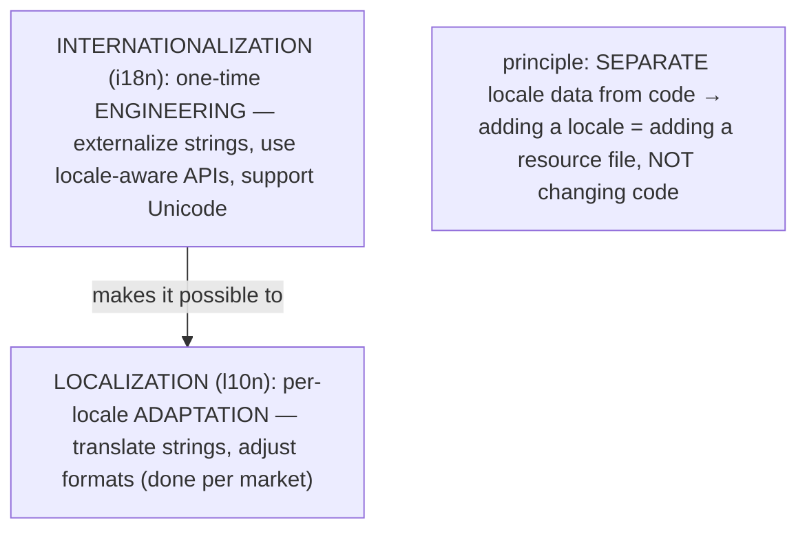
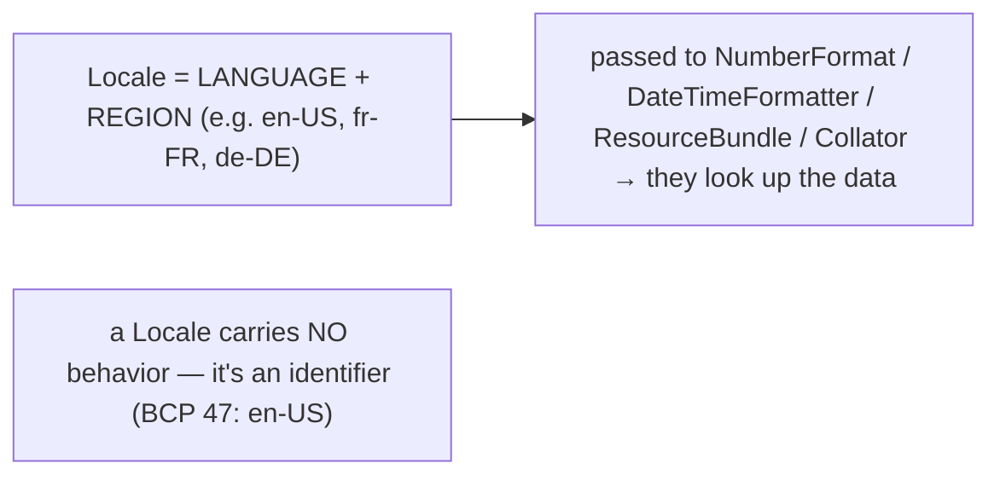
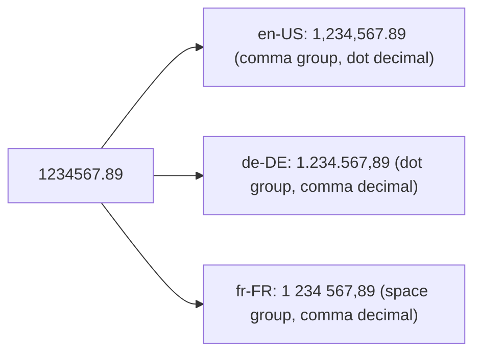
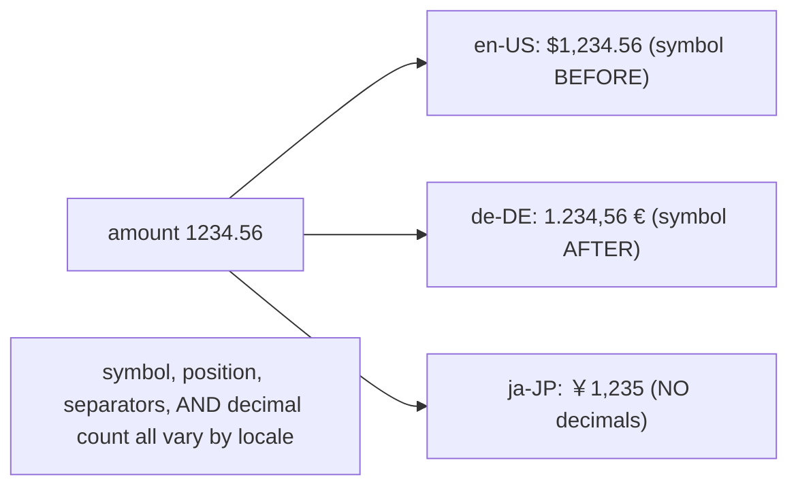
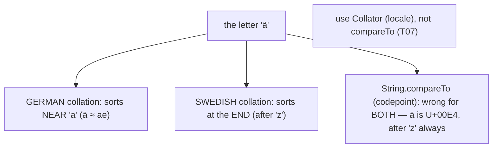
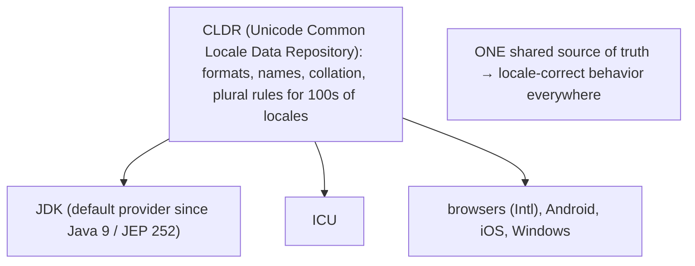
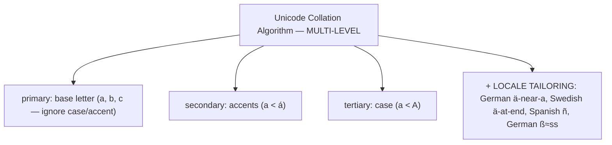
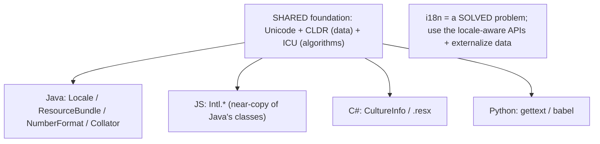

# Internationalization (i18n) & formatting

The final topic of the chapter handles the *human* side of global software: presenting text, numbers, dates, and currency correctly for every language, region, and culture. Two terms split the work. **Internationalization** (**i18n** — *i* + 18 letters + *n*) is the one-time *engineering* effort of designing software so it *can* be adapted to any locale **without code changes** — externalizing translatable strings, using locale-aware formatting APIs, and supporting Unicode. **Localization** (**l10n**) is the per-locale *adaptation* itself — the translations, the format adjustments, done (often by translators, not engineers) for each target market. The defining principle that ties them together is **separation of locale-specific data from code**: a well-internationalized app adds French support by dropping in a `messages_fr.properties` file, not by editing and recompiling code — the open-closed principle applied to localization.

The depth bar is **why naive approaches are wrong for a global audience, and the shared Unicode/CLDR infrastructure that makes the correct ones possible**. The same number `1234.56` is `1,234.56` in the US but `1.234,56` in Germany — the grouping and decimal separators *swap* — so you must format through a locale-aware `NumberFormat`, never a hardcoded pattern. The same letter `ä` sorts *near a* in German but *at the end of the alphabet* in Swedish — so `String.compareTo` (which orders by UTF-16 code unit) is simply **wrong** for displaying a sorted list to a human, and you need a **`Collator`** implementing the multi-level **Unicode Collation Algorithm**. And you cannot build a plural by "adding an s," because Slavic languages have several plural forms keyed to the number. None of this is guesswork: the JDK ships the **CLDR** (Unicode Common Locale Data Repository) — the same locale database browsers, ICU, and operating systems use — so correct per-locale formatting, collation, and plural rules "just work" once you ask for them with an explicit `Locale`. By the end you will externalize strings with `ResourceBundle`, format and sort per locale, avoid the default-locale trap, and see why i18n is a solved problem built on shared global infrastructure — and with it, the **23-topic Collections & Core APIs chapter is complete**.

> [!NOTE]
> Prerequisites: [Comparable/Comparator](./T07-comparable-vs-comparator.md) (`L1/C02/T07`) — `Collator` is the locale-aware `Comparator` that replaces `String.compareTo` for human sorting; [Date/Time](./T15-date-time-api-java-time.md) (`L1/C02/T15`) — `DateTimeFormatter` localizes dates; [I/O streams](./T13-i-o-streams-byte-and-character.md) (`L1/C02/T13`) — the charset foundation under text, and the `.properties` encoding trap; [Immutability](../C01-oop/T19-immutability-and-immutable-class-design.md) (`L1/C01/T19`) — `Locale` is an immutable identifier. Forward: **C03 — Testing Fundamentals** (the next chapter).

## i18n vs l10n — Separate Data From Code

The two activities are distinct, and the boundary between them is the whole design idea:



Internationalize **once** — write locale-agnostic code that pulls strings from resource files and formats through locale-aware APIs — and then **localize many times** by supplying data for each new locale. The payoff is maintainability: a global product doesn't fork its code per language; it ships one codebase plus a growing set of resource files.

## `Locale` — The Identifier

A **`Locale`** identifies a language plus a region (and optionally a script/variant) — it is just an **identifier**, carrying no behavior; you hand it to the locale-aware APIs, which look up the data for it.

```java
Locale us = Locale.US;                          // en-US
Locale fr = Locale.FRANCE;                       // fr-FR
Locale jp = Locale.forLanguageTag("ja-JP");      // BCP 47 language tag
Locale mx = Locale.of("es", "MX");               // Spanish, Mexico (Java 19+; replaces new Locale)
```



> [!WARNING]
> **The default-locale trap.** `Locale.getDefault()` returns the JVM's locale from the host OS — *platform-dependent*, so output varies by machine, exactly like the default-charset trap ([T13](./T13-i-o-streams-byte-and-character.md)). Always pass an **explicit** `Locale` (usually the *user's*, from their request or preferences — not the server's) to every formatting and parsing call.

## `ResourceBundle` — Externalizing Strings

A **`ResourceBundle`** pulls translatable strings out of code into per-locale files, looked up by key. The common form is `.properties` files named by locale — `messages.properties` (base), `messages_fr.properties`, `messages_de_DE.properties`:

```properties
# messages.properties (base / default)
greeting=Hello, {0}!
# messages_fr.properties
greeting=Bonjour, {0} !
```

```java
ResourceBundle bundle = ResourceBundle.getBundle("messages", Locale.FRANCE);
String pattern = bundle.getString("greeting");   // "Bonjour, {0} !"
```

The lookup follows a **fallback chain**: for `de_DE` it tries `messages_de_DE` → `messages_de` → (the default locale's bundle) → `messages` (the base), so you supply only the *differences* per locale and share everything else. A key missing from every level throws `MissingResourceException`.

```mermaid
flowchart TB
  Req["getBundle(\"messages\", Locale de_DE)"]
  Req --> A["messages_de_DE.properties"]
  A -->|"key missing"| B["messages_de.properties"]
  B -->|"missing"| C["messages.properties (base)"]
  C -->|"missing everywhere"| Err["MissingResourceException"]
```

> [!WARNING]
> **`.properties` encoding.** Historically `.properties` files were read as ISO-8859-1, so non-Latin characters needed `\uXXXX` escapes. **Since Java 9 they are read as UTF-8** by default, so you can write `é`, `日本語`, or `Ω` directly — but a file saved in the wrong encoding (or old assumptions) produces mojibake. Save resource files as UTF-8.

## Locale-Aware Formatting

The same data renders differently per locale, and you must format through the locale-aware APIs rather than hardcode patterns. **`NumberFormat`** is the headline surprise — the grouping and decimal separators *swap* between English and German:

```java
double n = 1234567.89;
NumberFormat.getInstance(Locale.US).format(n);      // "1,234,567.89"
NumberFormat.getInstance(Locale.GERMANY).format(n); // "1.234.567,89"  ← separators reversed!
NumberFormat.getInstance(Locale.FRANCE).format(n);  // "1 234 567,89"  ← space grouping
```



The family covers more than plain numbers: **`getCurrencyInstance`** renders `$1,234.56` (US, symbol before) vs `1.234,56 €` (Germany, symbol after) vs `￥1,235` (Japan — no decimals); **`getPercentInstance`** for percentages; and dates go through the localized **`DateTimeFormatter`** from [T15](./T15-date-time-api-java-time.md): `DateTimeFormatter.ofLocalizedDate(FormatStyle.LONG).withLocale(loc)` gives "June 4, 2026" (en-US), "4 juin 2026" (fr-FR), "4. Juni 2026" (de-DE).



Crucially, for *messages with embedded values* use **`MessageFormat`**, not string concatenation — because **word order and grammar vary by language**, the translation must control where the values go:

```java
// WRONG — word order is hardcoded in English:  "You have " + n + " new messages"
// RIGHT — the translation places {0}:
MessageFormat.format(bundle.getString("inbox"), count);   // "inbox=You have {0} new messages" / "inbox=Vous avez {0} nouveaux messages"
```

```mermaid
flowchart LR
  Concat["string concat: \"You have \" + n + \" messages\" — word order LOCKED to English ✗"]
  MF["MessageFormat with {0}: the TRANSLATION controls order + applies locale formatting ✓"]
  Concat -.->|"other languages reorder/inflect"| MF
```

## `Collator` — Sorting Human Text

Sorting strings for *people* is not codepoint order. **`String.compareTo`** compares UTF-16 code units ([T07](./T07-comparable-vs-comparator.md)) — which puts accented letters after `z`, mixes cases wrongly, and ignores locale rules. The right tool is **`Collator`**, the locale-aware `Comparator`:

```java
List<String> words = new ArrayList<>(List.of("Apfel", "Äpfel", "Zebra"));
words.sort(Collator.getInstance(Locale.GERMAN));   // German: Ä sorts near A
words.sort(Collator.getInstance(new Locale("sv"))); // Swedish: Ä sorts at the END (after Z)
```

The same letter `ä` sorts in completely different positions by locale — **near `a` in German, after `z` in Swedish** — so there is no single "correct" order, only a locale-correct one. `Collator` has adjustable **strength** (PRIMARY = base letters only, so `a`=`A`=`á`; SECONDARY adds accents; TERTIARY adds case), and for repeated sorts you precompute a **`CollationKey`** per string (a transformed byte form that compares fast).



## Memory — Identifiers, Caches, and Thread-Safety

A `Locale` is a small **immutable** object (language/country/variant strings); the common ones (`Locale.US`, …) are cached constants and the JVM interns Locales. `ResourceBundle` keeps a **static cache** keyed by `(base name, locale, classloader)`, so `getBundle` is cheap after the first load; the bundle itself holds the parsed key→value `Map` (the `.properties` file read as UTF-8 into a `Properties`). A `Collator` carries the locale's collation rules (from CLDR), and a `CollationKey` is a `byte[]`. `NumberFormat`/`DateFormat` hold the locale's `DecimalFormatSymbols` (the separators and currency symbol).

> [!WARNING]
> **`NumberFormat`, `DateFormat`, and `Collator` are not thread-safe.** Like `SimpleDateFormat` ([T15](./T15-date-time-api-java-time.md)), the `java.text` formatters hold mutable parse/format state, so a shared instance corrupts under concurrency. Use a per-thread instance (or a `ThreadLocal`), and prefer the **thread-safe** `DateTimeFormatter` for dates.

## Architecture — CLDR, the Collation Algorithm, and Plurals

The reason locale-correct behavior "just works" is **CLDR** — the **Unicode Common Locale Data Repository**, a massive community-maintained database of locale data (number/date/currency formats, day and month names, collation rules, plural rules, units) for hundreds of locales. It is the **single shared source of truth** that the JDK, ICU, browsers, Android, and operating systems all draw on — so "how does German group digits" has one authoritative answer. Java switched to **CLDR as its default locale-data provider in Java 9** (JEP 252), replacing the JDK's older, less complete data; that switch is why modern Java formatting and collation are correct out of the box.



**Collation** is the genuinely hard part. The **Unicode Collation Algorithm (UCA)** compares text at **multiple levels** — *primary* (base letter, ignoring case and accents), *secondary* (accents: `a` < `á`), *tertiary* (case: `a` < `A`) — and then each locale **tailors** the default (German sorts `ä` near `a`, Swedish puts it after `z`, Spanish places `ñ` between `n` and `o`, German `ß` ≈ `ss`). Codepoint comparison cannot produce any of this — which is the deep answer to "why not `String.compareTo`": `compareTo` gives *codepoint* order, but humans expect *collation* order, and only the UCA + CLDR tailoring delivers it.



Two more realities a global app must respect. **Plurals** are not "add an s": English has two forms (1 file / 2 files), but Slavic languages (Russian, Polish) have **three or four** forms selected by the number, and some languages have none — so you use CLDR **plural rules** (via ICU `MessageFormat`'s `{0,plural,...}`) rather than `n == 1 ? "" : "s"`. And **bidirectional text** — Arabic and Hebrew run right-to-left — requires the Unicode Bidi algorithm to interleave RTL text with LTR numbers and Latin, plus contextual letter shaping. The unifying principle remains: **keep locale-specific data (strings, formats, collation, plural rules) out of code**, pass an explicit `Locale`, and let the CLDR-backed APIs do the locale-correct work.

## Cross-Language Perspective

i18n is a **solved problem built on shared infrastructure**, and the same building blocks recur everywhere. The gold-standard library is **ICU** (International Components for Unicode, originally IBM, now Unicode) — `ICU4C`/`ICU4J` — from which the JDK's i18n partly derives and which offers even more (richer formatting, transliteration). Underneath everyone sits **CLDR**, the shared locale data. So the platform APIs are near-mirror images of each other:

| Platform | Locale | Externalized strings | Formatting / collation |
|---|---|---|---|
| **Java** | `Locale` | `ResourceBundle` (`.properties`) | `NumberFormat`, `DateTimeFormatter`, `Collator` |
| **JavaScript** | (BCP 47 tag) | i18next / FormatJS | **`Intl.NumberFormat`/`DateTimeFormat`/`Collator`/`PluralRules`** |
| **C# / .NET** | `CultureInfo` | `.resx` resources | `ToString`/`string.Format` + `CompareInfo` |
| **Python** | `locale` | **`gettext`** (`.po`/`.mo`) | `babel` (CLDR) |
| **Go / Rust** | `language.Tag` | message catalogs / `fluent` | `x/text` / `icu4x` |

The parallels are striking. **JavaScript's built-in `Intl`** API is almost a direct copy of Java's classes — `Intl.NumberFormat`, `Intl.DateTimeFormat`, `Intl.Collator`, `Intl.PluralRules` — all CLDR-backed, built into the runtime. **C#'s `CultureInfo` + `.resx`** is the direct analog of `Locale` + `ResourceBundle`. **Python's `gettext`** is the FOSS world's standard, keying translations by the *source string* in human-editable `.po` files (a different model from Java's abstract keys, but the same goal: strings out of code), with `babel` providing CLDR formatting. Every one of them externalizes strings, formats per CLDR, sorts by Unicode collation, and uses CLDR plural rules — and every one is bitten by the *same* mistakes: hardcoded strings, message concatenation, naive sorting, "just add s" plurals, and assuming one locale's formats. The lesson is encouraging: because the hard work lives once in shared standards (Unicode, CLDR, ICU), getting i18n right is mostly a matter of *using the locale-aware APIs and externalizing your data* — in any language.



## Common Mistakes

> [!WARNING]
> **Hardcoding user-facing strings.** Strings baked into code can't be translated. Externalize them into `ResourceBundle`/`.properties` (or the platform equivalent).

> [!WARNING]
> **Relying on the default locale.** `Locale.getDefault()` makes output platform-dependent. Pass an explicit locale — usually the user's — to every format/parse/sort call.

> [!WARNING]
> **`String.compareTo` for human-language sorting.** It's codepoint order, which mis-sorts accents and ignores locale rules. Use `Collator.getInstance(locale)` ([T07](./T07-comparable-vs-comparator.md)).

> [!WARNING]
> **Concatenating message fragments.** Word order and grammar vary by language. Use `MessageFormat` with `{0}` placeholders so the translation controls placement.

> [!WARNING]
> **"Just add s" for plurals.** Most languages don't pluralize that way (Slavic has several forms). Use CLDR plural rules (ICU `MessageFormat`).

> [!WARNING]
> **Assuming number/date formats or sharing `java.text` formatters across threads.** Hardcoding `1,234.56` or `MM/dd/yyyy` breaks per locale; and `NumberFormat`/`Collator` are not thread-safe. Format through locale-aware APIs with per-thread instances.

## Practice

> [!INTERVIEW]
> Common interview questions for this topic:
> 1. **i18n vs l10n?** Internationalization is designing software so it *can* be adapted without code changes (externalize locale data); localization is the actual per-locale adaptation (translation, formats).
> 2. **What is a `Locale`?** An identifier for a language + region (e.g. `en-US`); you pass it to locale-aware APIs, which look up the data.
> 3. **What's the default-locale trap?** `Locale.getDefault()` is platform-dependent, so relying on it makes output vary by machine — pass an explicit locale.
> 4. **What is `ResourceBundle`?** A mechanism to externalize translatable strings into `.properties` files looked up by key, with a fallback chain (`de_DE` → `de` → base).
> 5. **Why does the same number format differently per locale?** Grouping and decimal separators differ (`1,234.56` US vs `1.234,56` DE) — use `NumberFormat` with the locale.
> 6. **Why can't you concatenate message fragments?** Word order and grammar vary by language; use `MessageFormat` with `{0}` placeholders.
> 7. **Why is `String.compareTo` wrong for sorting human text?** It compares UTF-16 code units, not collation order — accents and locale rules (German `ä` near `a`, Swedish `ä` at the end) need `Collator`.
> 8. **What is the Unicode Collation Algorithm?** A multi-level comparison (primary = base letter, secondary = accent, tertiary = case) with per-locale tailoring — the basis of correct human-language sorting.
> 9. **What is CLDR?** The Unicode Common Locale Data Repository — the shared locale database (formats, names, collation, plural rules) the JDK (since Java 9), ICU, and browsers use.
> 10. **How do you handle plurals correctly?** Not "just add s" — use CLDR plural rules / ICU, since languages have varying plural forms.
> 11. **Are `NumberFormat`/`Collator` thread-safe?** No (`java.text`, like `SimpleDateFormat`); use per-thread instances or the thread-safe `DateTimeFormatter`.
> 12. **What encoding are `.properties` files?** UTF-8 since Java 9 (ISO-8859-1 with `\u` escapes before).
> 13. **How do other languages do i18n?** JS `Intl` (mirrors Java's classes, CLDR-backed), Python `gettext` (`.po`/`.mo`), C# `CultureInfo` + `.resx` — all on shared Unicode/CLDR/ICU infrastructure.

1. **`Locale`.** Create `Locale.US`, `Locale.FRANCE`, and `forLanguageTag("ja-JP")`; print `toLanguageTag()` and `getDisplayName()`.

2. **`ResourceBundle`.** Create `messages.properties` and `messages_fr.properties`; load and `getString("greeting")` for both locales.

3. **Fallback chain.** Request a key present only in the base bundle with `Locale.GERMANY`; show it falls back to base; then request a nonexistent key and observe `MissingResourceException`.

4. **`NumberFormat`.** Format `1234567.89` for US, Germany, and France; observe the swapped grouping/decimal separators.

5. **Currency.** Use `getCurrencyInstance` for US, Germany, and Japan; observe the symbol, its position, and the decimal digits (yen has none).

6. **Localized dates.** Format a `LocalDate` with `DateTimeFormatter.ofLocalizedDate(FormatStyle.LONG).withLocale(...)` for en-US, fr-FR, de-DE; compare month names and order ([T15](./T15-date-time-api-java-time.md)).

7. **`MessageFormat`.** Write a parameterized message with `{0}` (a name) and `{1,number}` (a count); format it for two locales; explain why concatenation would fail.

8. **`Collator`.** Sort a list of German words containing `ä`/`ö`/`ü` with `Collator.getInstance(Locale.GERMAN)` and with `String.compareTo`; observe the difference.

9. **Swedish vs German.** Sort the same `ä`-containing list with a German and a Swedish collator; confirm `ä` lands in different positions.

10. **Collation strength.** Compare `"café"` and `"cafe"` at PRIMARY (equal) vs SECONDARY (distinct) strength.

11. **`CollationKey`.** Precompute collation keys for a list and sort by them; explain the performance benefit for repeated sorts.

12. **Default-locale trap.** Format a number with no explicit locale; change `Locale.setDefault(...)` and observe the output change; fix by passing an explicit locale.

13. **UTF-8 properties.** Put `日本語` (or `Grüße`) directly in a `.properties` file and confirm it reads correctly (Java 9+ UTF-8).

14. **Cross-language sketch.** Format a price and a localized greeting in both Java (`NumberFormat`/`MessageFormat`) and JavaScript (`Intl`); note the parallel APIs.

15. **End-to-end explain-it-back.** (a) How i18n separates locale data from code (externalized strings/formats); (b) why `String.compareTo` is wrong for human sorting and `Collator`/the UCA is right; (c) what CLDR provides and who shares it; (d) why you pass an explicit `Locale`, not the default; (e) why plurals and messages need rules/placeholders, not concatenation. Twelve sentences max.

## Recap

You should now be able to:

**Language layer.**

- Distinguish internationalization (design for adaptation) from localization (per-locale adaptation) and apply the separate-data-from-code principle.
- Use `Locale` (passing an explicit one, never the default), `ResourceBundle` (`.properties` + fallback chain, UTF-8 since Java 9), locale-aware formatting (`NumberFormat`, `getCurrencyInstance`, localized `DateTimeFormatter`, `MessageFormat`), and `Collator` for human-language sorting.

**Memory layer.**

- Describe `Locale` as an interned immutable identifier, `ResourceBundle`'s static cache, and `CollationKey`s, and remember that the `java.text` formatters (`NumberFormat`/`Collator`) are not thread-safe.

**Architecture layer.**

- Explain CLDR as the shared locale-data source (the JDK's default since Java 9) and why locale-correct behavior is consistent across platforms.
- Explain the Unicode Collation Algorithm (multi-level + locale tailoring) and why codepoint order (`compareTo`) is wrong for users, plus the plural-rule and bidirectional-text realities.
- Place Java's APIs alongside JavaScript `Intl`, C# `CultureInfo`/`.resx`, and Python `gettext`, recognizing the shared Unicode/CLDR/ICU foundation and the universal i18n mistakes.

🎉 **This completes the Collections & Core APIs chapter (L1/C02, 23 topics)** — from the collections framework and its data structures (T01–T08), through the language facilities (exceptions, generics — T09–T12), to the core API libraries (I/O, NIO.2, date/time, regex, reflection, annotations, `Optional`, numeric types, serialization, networking, and now i18n — T13–T23). With C01 (Object-Oriented Programming) and C02 complete, L1's last chapter is **C03 — Testing Fundamentals**.

## Next

Continue to **C03 — Testing Fundamentals**, beginning with [Unit testing with JUnit 5](../C03-testing-fundamentals/T01-unit-testing-with-junit-5.md). With the language and its core libraries covered, the final L1 chapter turns to the discipline that keeps all of it correct: **automated testing**. It opens with **JUnit 5** — the standard Java testing framework — covering the test lifecycle (`@Test`, `@BeforeEach`/`@AfterEach`, `@BeforeAll`/`@AfterAll`), assertions, parameterized and nested tests, and how a test runner discovers and executes tests (built, fittingly, on the reflection and annotations of [T17](./T17-reflection.md)/[T18](./T18-annotations-using-and-writing-meta-annotations.md)). From there the chapter builds through assertions libraries (AssertJ/Hamcrest), mocking (Mockito), test doubles, TDD, and coverage — the practices that turn the knowledge of L1 into software you can change with confidence.
