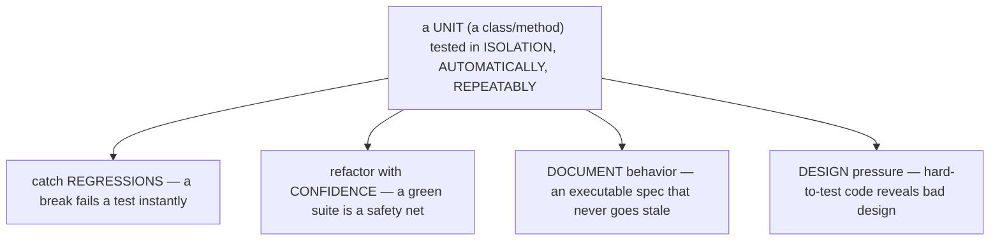
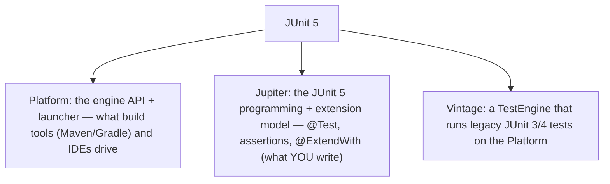
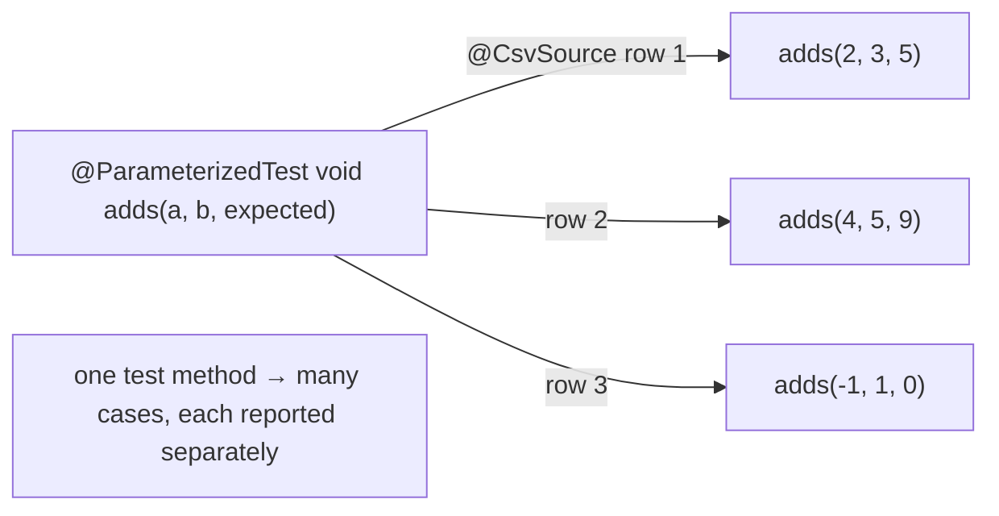
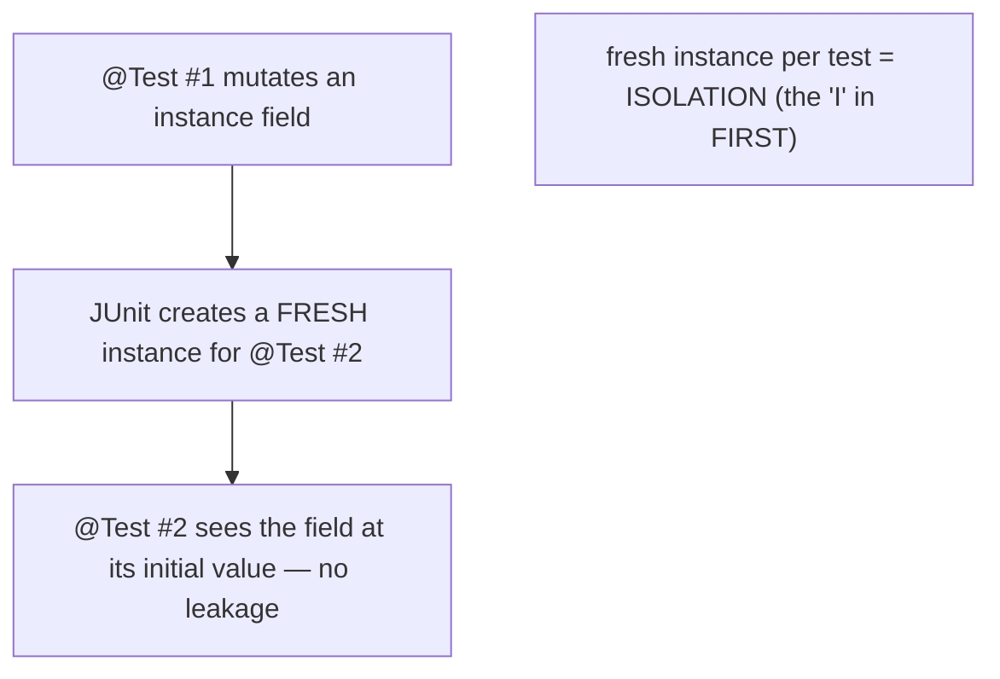
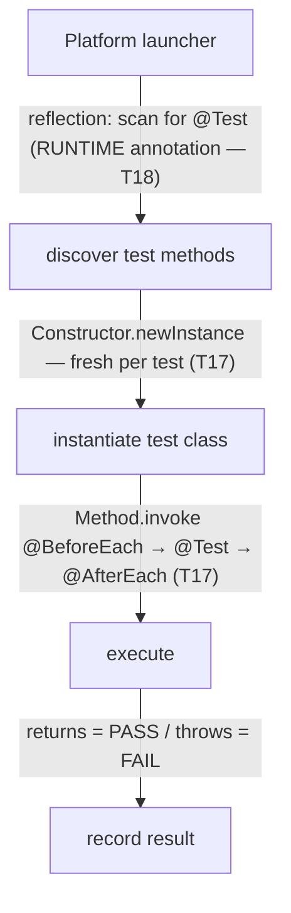
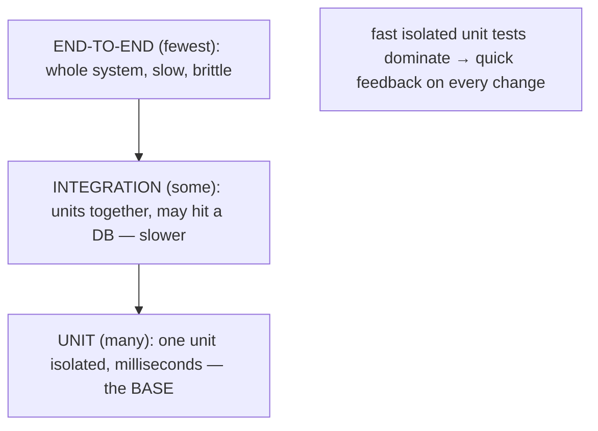
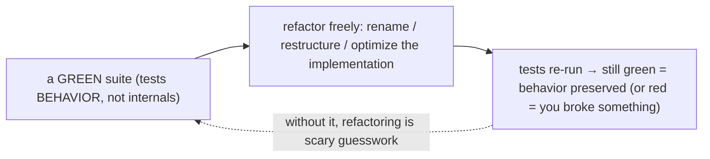
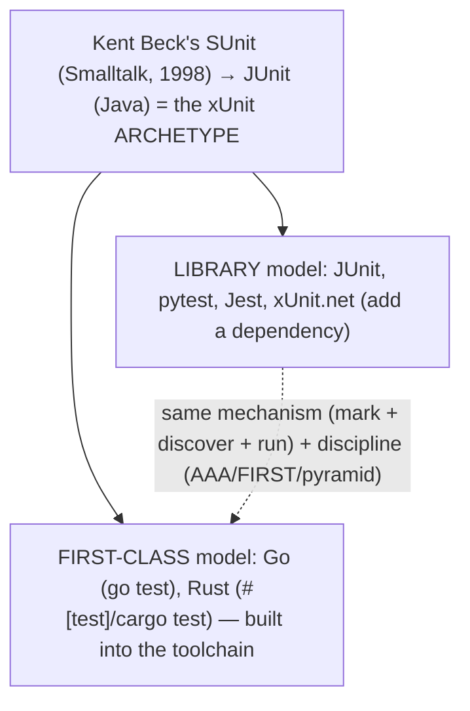

# Unit testing with JUnit 5

This chapter turns from *what the language can do* to *how you keep it correct*: **automated testing**. A **unit test** verifies a single unit of code — a class or a method — in **isolation**, **automatically**, and **repeatably**, so that a machine, not a human, checks the behavior on every change. The payoff is four-fold: tests **catch regressions** the instant a change breaks existing behavior, they let you **refactor with confidence** (a green suite is a safety net proving you didn't break anything), they **document** what the code is supposed to do (an executable specification that never goes stale), and they apply **design pressure** (code that is hard to test is usually badly designed). **JUnit 5** is the standard Java testing framework, and this topic covers its model — the `@Test` lifecycle, assertions, parameterized and nested tests — and the discipline that makes tests valuable.

The depth bar is **how a test runner actually finds and executes your tests — and it is the concrete payoff of reflection and annotations**. You never call your test methods; you just annotate them `@Test` and the framework runs them. *How?* Exactly the mechanism from [T17](../C02-collections-and-core-apis/T17-reflection.md) and [T18](../C02-collections-and-core-apis/T18-annotations-using-and-writing-meta-annotations.md): the JUnit Platform launcher uses **reflection** to scan your classes for methods carrying the `@Test` annotation (which is `@Retention(RUNTIME)`, so reflection can see it), **instantiates** the test class — a *fresh* instance per test, for isolation — and **invokes** each test method via `Method.invoke`, recording a pass if it returns and a fail if it throws. JUnit is *the* canonical "framework reads annotations and acts by reflection" example — the abstract machinery of T17/T18 made useful. And the architecture around it — the **testing pyramid**, the **FIRST** principles (Fast, Isolated, Repeatable, Self-validating, Timely), test-driven design feedback — is what turns a pile of test methods into a suite you can actually rely on. By the end you will write JUnit 5 tests with the full lifecycle, understand the reflection-driven engine underneath, and know why fast isolated tests are the foundation of changeable software.

> [!NOTE]
> Prerequisites: [Reflection](../C02-collections-and-core-apis/T17-reflection.md) (`L1/C02/T17`) and [Annotations](../C02-collections-and-core-apis/T18-annotations-using-and-writing-meta-annotations.md) (`L1/C02/T18`) — JUnit *is* the reflection-reads-annotations example; [Exceptions](../C02-collections-and-core-apis/T09-exceptions-try-catch-finally-checked-vs-unchecked.md) (`L1/C02/T09`) — a failed assertion throws `AssertionError`, and `assertThrows` tests exceptions; [Immutability](../C01-oop/T19-immutability-and-immutable-class-design.md) (`L1/C01/T19`) — testing is what makes confident refactoring possible. Forward: [T02](./T02-assertions-assertj-hamcrest.md) (assertion libraries), [T03](./T03-mocking-with-mockito.md) (mocking).

## What Unit Testing Is, and Why

A unit test pins down the behavior of one unit so a machine can re-check it forever:



The difference from manual testing is everything: a unit test runs in milliseconds, on every change, with a clear pass/fail and no human watching — so you find a break *when you cause it*, not weeks later in production.

## JUnit 5 Architecture

"JUnit 5" is not one library but **three sub-projects**, and knowing the split clarifies how it fits into your build:



- **JUnit Platform** is the foundation — a `TestEngine` API and a launcher that *discovers and runs* tests; your build tool and IDE talk to the Platform, which can run any engine.
- **JUnit Jupiter** is the new programming model you write against — `@Test`, `@BeforeEach`, the `Assertions` methods, the `@ExtendWith` extension model.
- **JUnit Vintage** is an engine that runs old JUnit 3/4 tests on the Platform, for backward compatibility.

You write **Jupiter** tests; the **Platform** finds and runs them.

## The Test Lifecycle

A test class uses lifecycle annotations to set up, run, and tear down. The core set:

```java
class CalculatorTest {
    Calculator calc;

    @BeforeAll static void initAll() { /* once, before all tests — STATIC */ }
    @BeforeEach void init()          { calc = new Calculator(); }   // before EACH test
    @AfterEach  void tearDown()      { /* after EACH test */ }
    @AfterAll  static void doneAll() { /* once, after all tests — STATIC */ }

    @Test
    @DisplayName("adds two positive numbers")
    void addsPositives() {
        assertEquals(5, calc.add(2, 3));
    }
}
```

- **`@Test`** marks a test method (no `public` needed in Jupiter; package-private is fine).
- **`@BeforeEach`/`@AfterEach`** run before/after *each* `@Test` — typically to create a fresh object under test and clean up.
- **`@BeforeAll`/`@AfterAll`** run *once* before/after the whole class, and must be **static** (next section explains why) — for expensive shared setup.
- **`@DisplayName`** gives a readable test name; **`@Disabled`** skips a test; **`@Nested`** groups related tests in an inner class; **`@Tag`** categorizes tests for filtering.

The execution order for a class with two tests, and the fact that drives it — **a new instance per test**:


## Assertions

A test *asserts* the expected outcome; a failed assertion throws `AssertionError`, which the engine records as a failure. The built-in `Assertions` (static methods) cover the essentials:

```java
assertEquals(5, calc.add(2, 3));                 // expected, actual
assertTrue(account.isActive());
assertThrows(InsufficientFundsException.class,   // assert code throws — returns the exception
    () -> account.withdraw(1_000_000));
assertAll("transfer",                            // run ALL, report every failure
    () -> assertEquals(0, from.balance()),
    () -> assertEquals(100, to.balance()));
```

`assertThrows` is the idiom for testing exceptions (it *returns* the thrown exception so you can inspect its message), and `assertAll` groups related assertions so one run reports *all* failures, not just the first. (The richer assertion ecosystem — AssertJ's fluent `assertThat`, Hamcrest matchers — is [T02](./T02-assertions-assertj-hamcrest.md).)

## Parameterized and Nested Tests

To run the *same* test logic over many inputs without copy-paste, use **`@ParameterizedTest`** with a source:

```java
@ParameterizedTest
@ValueSource(ints = {2, 4, 6, 100})
void evenNumbersAreEven(int n) { assertTrue(n % 2 == 0); }

@ParameterizedTest
@CsvSource({"2, 3, 5", "4, 5, 9", "-1, 1, 0"})    // input, input, expected
void adds(int a, int b, int expected) { assertEquals(expected, calc.add(a, b)); }
```

`@ValueSource` supplies single arguments; `@CsvSource` supplies argument rows; `@MethodSource` references a static method returning a `Stream<Arguments>` for complex/typed cases. The test runs **once per argument set**, so you cover many cases — including edge cases — in one concise method.



**`@Nested`** inner classes group tests by scenario (e.g. "when the account is empty" vs "when it has funds"), each inheriting the outer `@BeforeEach`, which keeps related tests organized and readable.

## The Shape of a Good Test — AAA, FIRST, and Isolation

A readable test follows **AAA** — **Arrange** (set up the object and inputs), **Act** (call the method under test), **Assert** (verify the result) — the same shape as BDD's *Given-When-Then*:


And good unit tests satisfy **FIRST**: **F**ast (milliseconds — so thousands run in seconds, on every change), **I**solated (no dependence on other tests or external state — any order, parallelizable), **R**epeatable (same result every run, every environment — no flakiness), **S**elf-validating (a clear pass/fail via assertions, no manual inspection), and **T**imely (written with or before the code).

The **isolation** is enforced by JUnit's most important default: **a fresh instance of the test class is created for *each* `@Test` method** (the `PER_METHOD` lifecycle). So instance fields are reset between tests, and no mutable state leaks from one test to the next — which is *why* `@BeforeAll` must be static (there is no single instance to attach it to) and *why* shared state is the #1 cause of flaky, order-dependent tests. (`@TestInstance(Lifecycle.PER_CLASS)` shares one instance and lets `@BeforeAll` be non-static — use it sparingly.)



## Mechanism — How the Runner Finds and Runs Tests (Reflection + Annotations)

Here is the payoff of [T17](../C02-collections-and-core-apis/T17-reflection.md)/[T18](../C02-collections-and-core-apis/T18-annotations-using-and-writing-meta-annotations.md) made concrete. You never call your test methods — so how do they run? **By reflection over annotations**, the exact framework pattern from those topics:

1. **Discover.** The Platform launcher (driven by Maven/Gradle/the IDE) asks the Jupiter engine to find tests: it uses **reflection** to scan classes for methods annotated **`@Test`** — and `@Test` is **`@Retention(RUNTIME)`** ([T18](../C02-collections-and-core-apis/T18-annotations-using-and-writing-meta-annotations.md)), which is *why* reflection can see it — building a tree of test descriptors.
2. **Instantiate.** For each `@Test`, the engine creates a **fresh instance** of the test class reflectively (`Constructor.newInstance` — [T17](../C02-collections-and-core-apis/T17-reflection.md)).
3. **Execute.** It invokes the `@BeforeEach` methods, then the `@Test` method, then `@AfterEach` — all via **`Method.invoke`** ([T17](../C02-collections-and-core-apis/T17-reflection.md)) — wrapping the whole class in `@BeforeAll`/`@AfterAll`.
4. **Record.** A test **passes** if its method returns normally and **fails** if it throws — an `AssertionError` from a failed assertion, or any other exception.



This is the textbook answer to "why do reflection and annotations exist?" — **JUnit is the canonical example**: an inert `@Test` marker that a framework reads by reflection and acts on. The fresh-instance-per-test step is what guarantees isolation. (And the reflection cost is irrelevant here — tests run at *build* time, not in a production hot loop, so the [T17](../C02-collections-and-core-apis/T17-reflection.md) "fine at startup, bad in a hot path" rule means it never matters.)

## Architecture — The Pyramid, and Why Tests Enable Change

A healthy suite is shaped like a **pyramid**: **many** fast, isolated **unit tests** at the base, **fewer** **integration tests** in the middle (units working together, possibly touching a database), and the **fewest** slow, brittle **end-to-end tests** at the top (the whole system through its UI/API). The inverted shape — mostly E2E tests — is the "ice-cream-cone" anti-pattern: slow, flaky, and expensive to maintain.



The pyramid is shaped by *why unit tests must be fast and isolated*. **Fast** because you run them on every change and in CI on every commit — a suite that takes minutes won't be run, and the feedback loop dies. **Isolated** (no DB/network/filesystem) because that makes them deterministic (no flaky failures from external state), parallelizable, and *precise* (a failure points at the broken unit, not "something in the stack"). Those are the same FIRST properties, now seen as architecture.

The deepest payoff is that **tests enable change**. A comprehensive green suite that tests **behavior** (the public contract) rather than **implementation** (internals) is a **safety net**: you can rename, restructure, and optimize freely, and the tests confirm the behavior is preserved — which is what makes [refactoring](../C01-oop/T19-immutability-and-immutable-class-design.md) safe instead of scary. And testing pushes *back* on design: code that is hard to unit-test (needs heavy setup, can't be isolated from a database, hides its dependencies) is revealing **tight coupling** — so the act of making code testable drives dependency injection, small methods, and single responsibility. "Listen to your tests": testability *is* good design feedback, and a red test in CI gates the build so broken code never ships.



## Cross-Language Perspective

Automated unit testing is universal, and **JUnit is the archetype the whole industry copied.** Kent Beck wrote the first such framework — **SUnit** for Smalltalk (1998) — then he and Erich Gamma built **JUnit** for Java, which became the template for the entire **"xUnit"** family: test classes, `setUp`/`tearDown` fixtures, assertions, a runner, and (in modern versions) annotations/attributes to mark tests.

| Language | Framework(s) | Mark a test | Built-in? |
|---|---|---|---|
| **Java** | **JUnit** (the archetype), TestNG | `@Test` | library |
| **Python** | `pytest`, `unittest` | `def test_*` | library (`unittest` is stdlib) |
| **JavaScript** | `Jest`, `Vitest`, Mocha | `it(...)` / `test(...)` | library |
| **C#** | `NUnit`, **`xUnit.net`**, MSTest | `[Test]` / `[Fact]` | library |
| **Go** | `testing` | `func TestXxx(t *testing.T)` | **built into the toolchain** (`go test`) |
| **Rust** | built-in | `#[test]` | **built into the toolchain** (`cargo test`) |

The parallels run deep. **Python's `unittest`** is a near-direct JUnit port (`TestCase`, `setUp`/`tearDown`, `assertEqual`), while **`pytest`** modernizes it with plain `assert` and a flexible *fixture* model. **C#'s `xUnit.net`** is even *named* after the pattern; **`NUnit`** is a direct .NET JUnit descendant. The biggest philosophical difference is **library vs first-class**: Java, Python, JS, and C# add testing as a *library* you depend on, whereas **Go and Rust build it into the language and toolchain** (`go test`, `cargo test`, `#[test]`) — a statement that testing is too essential to be optional. But across all of them the **mechanism** (mark tests with an annotation/attribute/naming convention, a runner discovers and executes them) and the **discipline** (AAA, FIRST, the testing pyramid) are the same — and they all trace back to JUnit's design.



## Common Mistakes

> [!WARNING]
> **Shared mutable state / order-dependent tests.** A test that depends on another test's side effect (or a static field mutated across tests) is flaky and order-dependent. JUnit's fresh-instance-per-test helps, but static/external state still bites — keep each test fully self-contained.

> [!WARNING]
> **Testing implementation instead of behavior.** Asserting on private internals or exact call sequences makes tests brittle — they break on any refactor even when the behavior is correct. Test the public contract / observable behavior.

> [!WARNING]
> **Slow "unit" tests that hit a DB/network/filesystem.** That's an *integration* test — slow and flaky. Substitute test doubles ([T03](./T03-mocking-with-mockito.md)/[T04](./T04-test-doubles-stub-mock-spy-fake.md)) so the unit test stays fast and isolated.

> [!WARNING]
> **No assertions.** A test that calls a method but asserts nothing passes vacuously (it only catches exceptions). Always assert the expected outcome.

> [!WARNING]
> **`@BeforeAll`/`@AfterAll` that aren't static.** In the default per-method lifecycle they must be static (there's no single instance), or you get an error. Use `@TestInstance(PER_CLASS)` only if you deliberately want a shared instance.

> [!WARNING]
> **Catching the exception by hand instead of `assertThrows`.** The `try { …; fail(); } catch (E e) {}` idiom is verbose and easy to get wrong. Use `assertThrows(E.class, () -> …)`.

## Practice

> [!INTERVIEW]
> Common interview questions for this topic:
> 1. **What is a unit test?** An automated, repeatable test of a single unit (class/method) in isolation.
> 2. **Why write unit tests?** Catch regressions, enable confident refactoring, document behavior, and surface design problems.
> 3. **What are JUnit 5's three parts?** Platform (engine/launcher infrastructure), Jupiter (the JUnit 5 model you write against), Vintage (runs JUnit 3/4).
> 4. **The lifecycle annotations?** `@Test`, `@BeforeEach`/`@AfterEach` (per test), `@BeforeAll`/`@AfterAll` (once per class, static), plus `@Nested`/`@DisplayName`/`@Disabled`/`@Tag`.
> 5. **Why must `@BeforeAll` be static?** The default per-method lifecycle creates a fresh instance per test, so a once-per-class hook can't belong to an instance.
> 6. **How does JUnit run my tests under the hood?** Reflection over annotations — it scans for `@Test` (`@Retention(RUNTIME)`) methods, instantiates the class fresh per test, and invokes each via `Method.invoke` (the T17/T18 mechanism).
> 7. **How is test isolation achieved?** A new test-class instance per `@Test`, so instance fields reset between tests.
> 8. **What is `assertThrows`?** An assertion that the given code throws the expected exception (and returns it for inspection).
> 9. **What is a parameterized test?** `@ParameterizedTest` + a source (`@ValueSource`/`@CsvSource`/`@MethodSource`) runs one test over many inputs.
> 10. **What are the FIRST principles?** Fast, Isolated, Repeatable, Self-validating, Timely.
> 11. **What is the testing pyramid?** Many fast unit tests, fewer integration tests, fewest slow end-to-end tests.
> 12. **Why do tests enable refactoring?** A green suite testing behavior (not internals) is a safety net — you change the implementation freely and the tests confirm behavior is preserved.
> 13. **How does testing relate to design?** Hard-to-test code reveals tight coupling; testability pressure drives dependency injection, small methods, and single responsibility.

1. **First test.** Write a `Calculator.add` and a `@Test` that asserts `add(2, 3) == 5` in AAA structure.

2. **`@BeforeEach`/`@AfterEach`.** Print from each and from two tests; confirm the order (before/after every test); use `@BeforeEach` to create a fresh `Calculator`.

3. **`@BeforeAll`/`@AfterAll`.** Make them static and print; confirm they run once, around the whole class.

4. **`assertThrows`.** Test that a method throws on invalid input; capture the exception and assert its message.

5. **`assertAll`.** Group three assertions, make two fail, and confirm *both* failures are reported.

6. **`@ParameterizedTest` + `@ValueSource`.** Run a test over several inputs with one method.

7. **`@CsvSource`.** Write a parameterized test with `(a, b, expected)` rows for an `add` method.

8. **`@MethodSource`.** Supply complex arguments via a static `Stream<Arguments>` provider.

9. **`@Nested` + `@DisplayName`.** Group tests by scenario in nested classes with readable names.

10. **`@Disabled` + `@Tag`.** Skip a test with a reason; tag tests and run only a tag.

11. **Isolation proof.** Add a mutable instance field; mutate it in one test and assert it's back to its initial value in another — demonstrating the fresh instance per test.

12. **Reflection discovery.** Explain (or inspect via the Platform) how JUnit finds `@Test` methods by reflection; confirm `@Test` is `@Retention(RUNTIME)` ([T18](../C02-collections-and-core-apis/T18-annotations-using-and-writing-meta-annotations.md)).

13. **Pyramid.** Classify a handful of tests as unit/integration/E2E and discuss the ideal ratio.

14. **Behavior vs implementation.** Write one brittle test that asserts internals and one robust test that asserts behavior; refactor the implementation and see which survives.

15. **End-to-end explain-it-back.** (a) How JUnit discovers tests (reflection scans for `@Test` `RUNTIME` annotations — T17/T18); (b) how it instantiates a fresh test object per test and invokes it via `Method.invoke`; (c) how pass/fail is recorded; (d) why fresh-instance-per-test gives isolation; (e) why fast isolated tests enable confident refactoring. Twelve sentences max.

## Recap

You should now be able to:

**Language layer.**

- Explain what a unit test is and the four reasons to write them (regressions, refactoring confidence, documentation, design pressure).
- Use the JUnit 5 lifecycle (`@Test`, `@BeforeEach`/`@AfterEach`, static `@BeforeAll`/`@AfterAll`, `@Nested`/`@DisplayName`/`@Disabled`/`@Tag`), the core assertions (`assertEquals`/`assertThrows`/`assertAll`), and parameterized tests, and structure tests with AAA.
- Distinguish JUnit Platform, Jupiter, and Vintage.

**Memory / mechanism layer.**

- Explain that a test runner *discovers* tests by reflection over `@Test` (`RUNTIME`-retained) annotations and *executes* them by instantiating a fresh test object per test and invoking via `Method.invoke` — JUnit as the canonical reflection-plus-annotations framework ([T17](../C02-collections-and-core-apis/T17-reflection.md)/[T18](../C02-collections-and-core-apis/T18-annotations-using-and-writing-meta-annotations.md)) — and how that fresh instance enforces isolation.

**Architecture layer.**

- State the FIRST principles and the testing pyramid, and explain why unit tests must be fast and isolated.
- Explain why a behavior-focused green suite enables confident refactoring, and how testability pressure drives good design (dependency injection, small methods, single responsibility) — with tests gating the CI build.
- Recognize JUnit as the xUnit archetype and place it against `pytest`, `Jest`, `xUnit.net`, and the built-into-the-toolchain testing of Go and Rust.

The next topic sharpens the *assert* step. JUnit's built-in assertions are functional but terse; [T02](./T02-assertions-assertj-hamcrest.md) — assertions (AssertJ, Hamcrest) — covers the fluent, readable assertion libraries (`assertThat(result).isEqualTo(...)`, matcher composition) that make test failures self-explanatory and complex expectations expressible.

## Next

Continue to [Assertions (AssertJ, Hamcrest)](./T02-assertions-assertj-hamcrest.md) — making the verification step expressive. T01 used JUnit's built-in `assertEquals`/`assertTrue`, which work but read awkwardly and give terse failure messages. T02 introduces the dedicated assertion libraries: **AssertJ**'s fluent, chainable `assertThat(actual).isEqualTo(expected).isNotNull()` (with rich, type-specific assertions for collections, strings, exceptions, and dates), and **Hamcrest**'s composable *matchers* (`assertThat(x, is(greaterThan(3)))`) — both producing readable tests and self-explanatory failure messages, the difference between "expected 5 but was 4" and a diagnostic that tells you exactly what was wrong.
