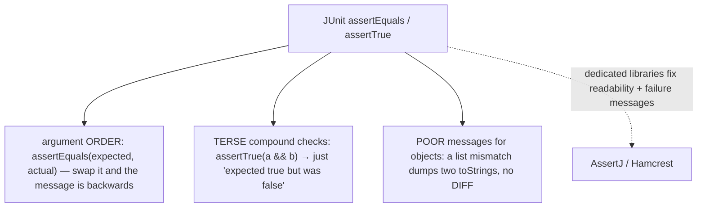
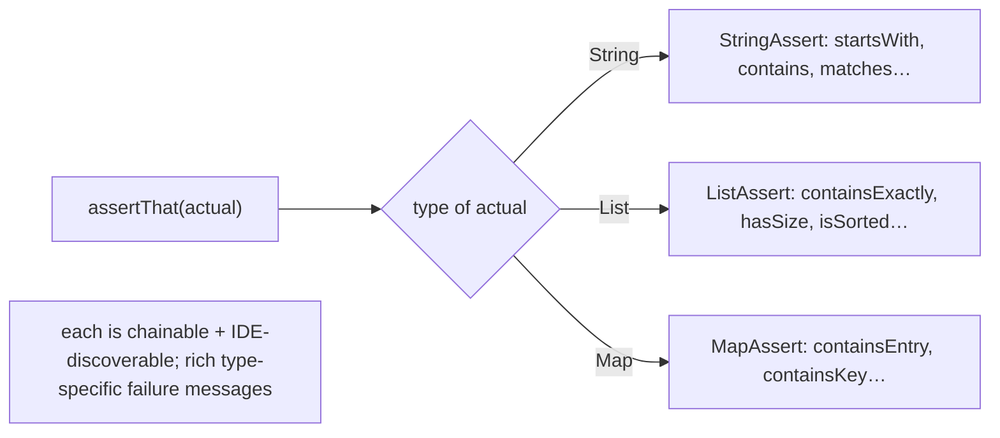
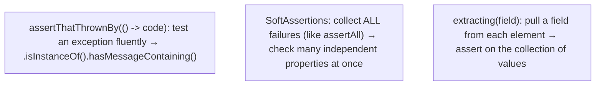
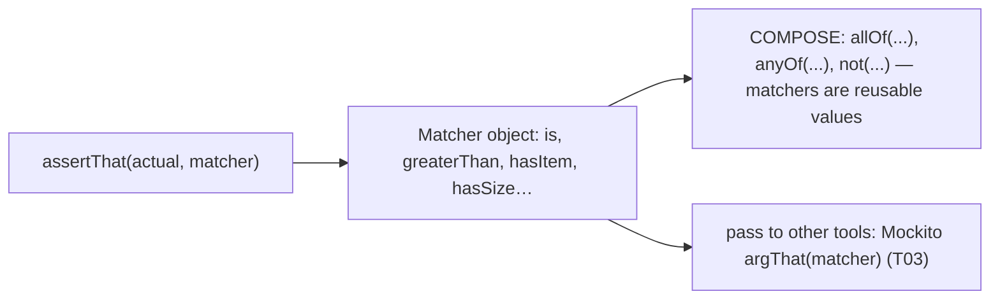
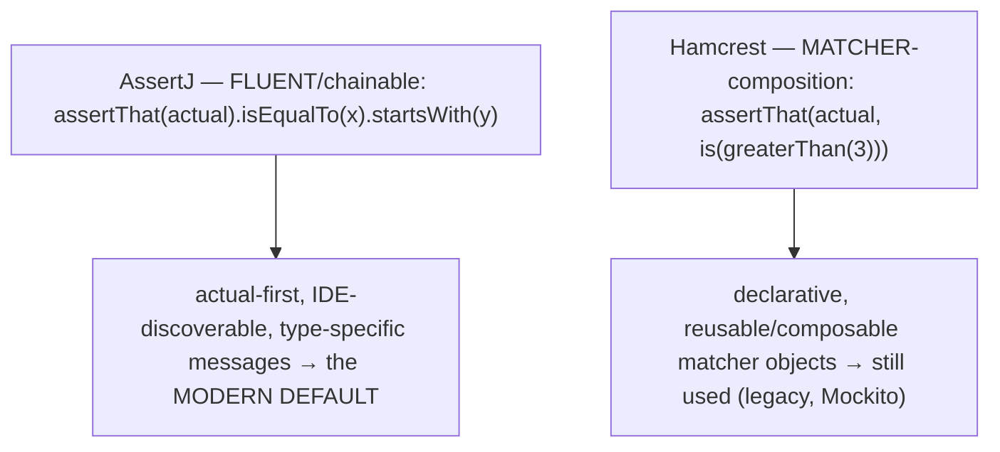
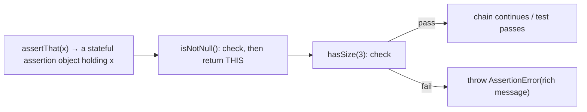
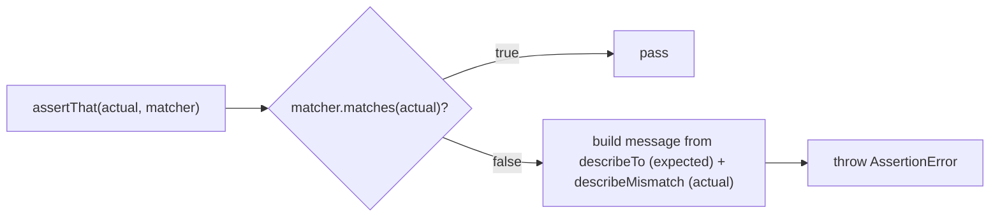
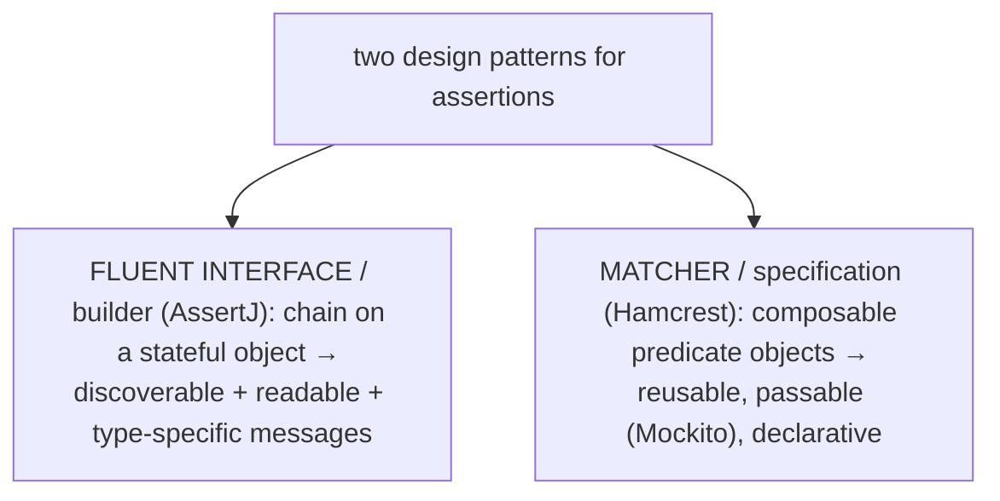
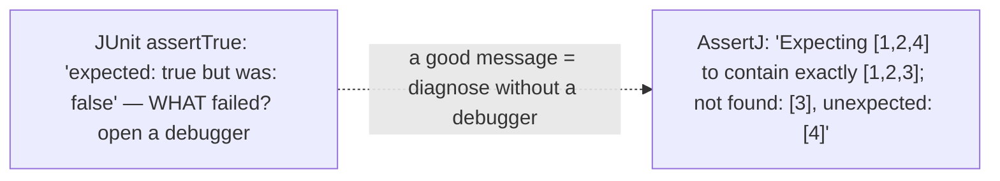
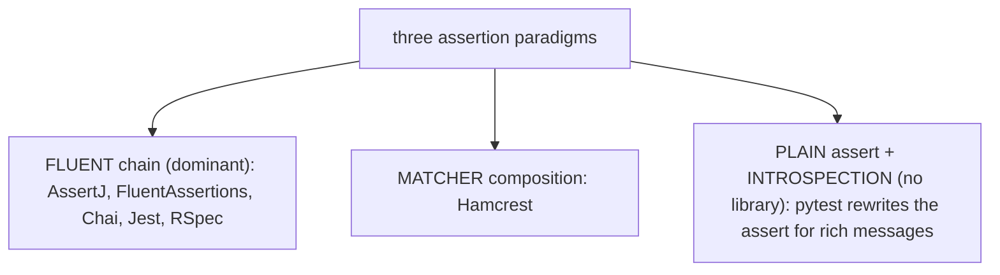

# Assertions (AssertJ, Hamcrest)

[T01](./T01-unit-testing-with-junit-5.md) gave you the test lifecycle and JUnit's built-in `assertEquals`/`assertTrue`; this topic sharpens the **assert** step — the part of a test that actually verifies the outcome. JUnit's bare assertions *work*, but they read awkwardly and fail unhelpfully: `assertEquals(expected, actual)` is easy to call with the arguments swapped (giving a backwards message), `assertTrue(list.contains("a") && list.size() == 3)` collapses a compound check into a uselessly terse "expected true but was false", and a mismatched-list `assertEquals` dumps two `toString`s with no indication of *which* element differs. The two dedicated assertion libraries fix this. **AssertJ** offers **fluent, chainable** assertions — `assertThat(actual).isEqualTo(expected).startsWith("A")` — that read like sentences and produce detailed, type-aware failure messages. **Hamcrest** offers **composable matchers** — `assertThat(actual, is(greaterThan(3)))` — declarative predicate objects you build and reuse.

The depth bar is **how assertions actually work and why failure-message quality is the whole point**. An assertion is nothing magical — it is just code that throws an `AssertionError` when a condition is false, which the runner from [T01](./T01-unit-testing-with-junit-5.md) records as a failure. AssertJ's chain is the **fluent-builder pattern**: `assertThat(x)` returns a *stateful assertion object* holding the actual value, and each method checks a condition and returns `this` so the next call can chain — a sequence of checks on a held value, throwing a richly-formatted `AssertionError` the moment one fails. That formatting is the real value: a good library turns "expected true but was false" into "Expecting `[1, 2, 4]` to contain exactly `[1, 2, 3]` but element at index 2 differs" — a diagnosis you can act on **without opening a debugger**, which is exactly what makes a test suite the fast, self-validating feedback loop the FIRST principles ([T01](./T01-unit-testing-with-junit-5.md)) demand. By the end you will write fluent AssertJ chains, compose Hamcrest matchers, know when each fits, and understand why assertion-library choice is really a *maintainability* decision — because tests are read far more than they are written.

> [!NOTE]
> Prerequisites: [JUnit 5](./T01-unit-testing-with-junit-5.md) (`L1/C03/T01`) — assertions run inside `@Test` methods and a failed one throws `AssertionError`; [Fields/constructors/`this`](../C01-oop/T02-fields-methods-constructors-this.md) (`L1/C01/T02`) — AssertJ's chaining is the fluent-builder pattern (methods returning `this`); [Math/BigDecimal](../C02-collections-and-core-apis/T20-math-bigdecimal-biginteger-random.md) (`L1/C02/T20`) — `isCloseTo`/`within` for floating-point tolerance; [Exceptions](../C02-collections-and-core-apis/T09-exceptions-try-catch-finally-checked-vs-unchecked.md) (`L1/C02/T09`) — `assertThatThrownBy` tests exceptions. Forward: [T03](./T03-mocking-with-mockito.md) (mocking).

## Why Not Just JUnit's Built-In Assertions?

JUnit's `Assertions` are fine for simple checks but degrade fast:



The cure is a library whose assertions read clearly *and* explain themselves when they fail.

## AssertJ — Fluent Assertions

**AssertJ**'s single entry point is `assertThat(actual)`, which returns a **type-specific assertion object** you chain checks onto. The actual value comes *first*, so there is no expected/actual confusion:

```java
import static org.assertj.core.api.Assertions.*;

assertThat(name).isEqualTo("Ada");
assertThat(name).isNotNull().startsWith("A").endsWith("a").hasSize(3);   // chained
assertThat(numbers).containsExactly(1, 2, 3).doesNotContain(4);
assertThat(scores).containsEntry("Ada", 95);
assertThat(total).isCloseTo(99.99, within(0.001));                       // float tolerance (T20)
```

Because `assertThat` returns a *type-specific* assertion — `assertThat(aString)` gives a `StringAssert`, `assertThat(aList)` a `ListAssert` — the available checks are **discoverable by IDE autocomplete**: type `assertThat(list).` and the IDE lists `containsExactly`, `hasSize`, `isSorted`, `allMatch`, and dozens more. You explore the API by typing rather than memorizing.



A few higher-value features: **`assertThatThrownBy`** tests exceptions fluently; **`extracting`** pulls a field from each element of a collection; and **`SoftAssertions`** collects *all* failures instead of stopping at the first:

```java
assertThatThrownBy(() -> account.withdraw(1_000_000))
    .isInstanceOf(InsufficientFundsException.class)
    .hasMessageContaining("balance");

assertThat(people).extracting(Person::name).containsExactly("Ada", "Grace");

SoftAssertions softly = new SoftAssertions();
softly.assertThat(order.total()).isEqualTo(99.99);
softly.assertThat(order.items()).hasSize(3);
softly.assertAll();   // reports BOTH failures, not just the first
```



## Hamcrest — Composable Matchers

**Hamcrest** takes the other approach: `assertThat(actual, matcher)`, where the **matcher** is a composable predicate object. It is declarative, and matchers compose with `allOf`/`anyOf`/`not`:

```java
import static org.hamcrest.MatcherAssert.assertThat;
import static org.hamcrest.Matchers.*;

assertThat(name, is("Ada"));
assertThat(count, is(greaterThan(3)));
assertThat(list, hasItem("a"));
assertThat(list, hasSize(3));
assertThat(value, allOf(greaterThan(3), lessThan(10)));   // composition
assertThat(value, not(equalTo(5)));
```

A `Matcher` is a **first-class, reusable object** — you can name one and use it in many assertions, compose them, and pass them to other tools (Mockito's `argThat(matcher)` argument matching — [T03](./T03-mocking-with-mockito.md)). Hamcrest predates AssertJ (JUnit 4 bundled it), and it's still common where composable, reusable predicates matter.



## AssertJ vs Hamcrest

Two paradigms for the same job:



**AssertJ** is the default for most new Java projects — fluent, autocomplete-discoverable, with excellent type-specific failure messages. **Hamcrest** still earns its place where you need **reusable, composable matchers** (shared across assertions, or passed to Mockito). Many codebases use AssertJ for assertions and reach for Hamcrest matchers where composition helps.

## Mechanism — An `AssertionError` and a Fluent Builder

There is no magic. **An assertion is code that throws an `AssertionError` when its condition is false**; the runner from [T01](./T01-unit-testing-with-junit-5.md) records a test as *failed* when its method throws (`AssertionError` or anything else) and *passed* when it returns normally.

AssertJ's chain is the **fluent-builder pattern** ([T02-C01](../C01-oop/T02-fields-methods-constructors-this.md)): `assertThat(actual)` constructs a stateful **assertion object** holding the `actual` value; each assertion method checks its condition against that held value and, on success, **returns `this`** so the next call chains — and on failure throws a richly-formatted `AssertionError`. So `assertThat(x).isNotNull().hasSize(3)` is "make an assertion object around `x`, run the null check (return self), run the size check (throw if wrong)."



Hamcrest's mechanism is the **matcher (specification) pattern**: a `Matcher<T>` is an object with `matches(actual) → boolean` plus `describeTo` (the expected) and `describeMismatch` (what was seen). `assertThat(actual, matcher)` calls `matcher.matches(actual)`; if `false`, it assembles a message from `describeTo`/`describeMismatch` and throws `AssertionError`. Composite matchers (`allOf`, `not`) are matchers that delegate to sub-matchers. In both libraries the failure **message is built lazily** (only on failure, so the passing path costs nothing), and AssertJ computes a human-readable **diff** for collections and strings.



## Architecture — Two Patterns, and Why the Message Is the Point

The two libraries embody two classic design patterns. **AssertJ is a fluent interface / builder** — method chaining on a stateful object — whose payoff is **discoverability** (autocomplete reveals the whole API after `assertThat(x).`), **readability** (it reads like English), and **type-specific messages** (a `ListAssert` knows it's a list and formats list-aware diffs). **Hamcrest is the matcher / specification pattern** — composable predicate objects — whose payoff is that matchers are **first-class, reusable, composable values** you can share and pass around. Fluent won for *assertions* (discoverability and messages), but matchers still win where you need a reusable predicate.



The deepest point is that **failure-message quality is the real value of an assertion library**, and it ties directly back to the FIRST principles ([T01](./T01-unit-testing-with-junit-5.md)). A test is only useful when it fails if you can tell *why* — and a good library turns a bare "expected true but was false" into a precise diagnosis you can fix from the message alone, *without* launching a debugger.



That is what makes the test loop **fast** (fix from the output, not a debugging session) and the suite genuinely **self-validating** (a clear, actionable pass/fail). And because **tests are read far more often than written** — every time someone changes the code, they read the tests to understand the intended behavior and to diagnose a failure — a readable assertion like `assertThat(order.total()).isEqualTo(99.99)` is *documentation*, while a cryptic `assertTrue(Math.abs(order.total() - 99.99) < 0.01)` obscures intent. Assertion-library choice is therefore a **maintainability** decision, and the runtime cost is irrelevant (test-time only, message-building only on failure).

## Cross-Language Perspective

Rich, fluent assertions are universal, and the same paradigms recur. The dominant style everywhere is the **fluent `expect`/`should` chain**:

| Language | Library | Style |
|---|---|---|
| **Java** | **AssertJ** / Hamcrest | `assertThat(x).isEqualTo(y)` / `assertThat(x, matcher)` |
| **.NET** | **FluentAssertions** | `x.Should().Be(y)` (the AssertJ analog) |
| **JavaScript** | **Chai** / Jest `expect` | `expect(x).to.equal(y)` / `expect(x).toBe(y)` |
| **Ruby** | **RSpec** | `expect(x).to eq(y)` |
| **Go** | `testify` | `assert.Equal(t, expected, actual)` |
| **Python** | **`pytest`** (plain `assert`) | `assert x == y` (rewritten for rich messages) |

The parallels are direct. **.NET's FluentAssertions** is AssertJ in another language — `result.Should().Be(expected)`, `list.Should().Contain(x).And.HaveCount(3)`, `action.Should().Throw<MyException>()` — and is the de-facto standard for .NET assertions. **JavaScript's Chai** and **Jest's `expect`** are the same fluent chain (`expect(x).to.equal`, `expect(fn).toThrow()`), as is **Ruby's RSpec** (`expect(x).to eq(y)`). The elegant outlier is **Python's `pytest`**: you write *plain* `assert x == y`, and pytest **rewrites the assert statements** (via AST/bytecode rewriting at import) so that on failure it *introspects* the expression and produces an AssertJ-quality diff — **no assertion library needed**. It's a genuinely different approach, and a nice contrast: Java needs a fluent library precisely *because* it can't rewrite the bare `assert` keyword the way pytest can. The convergence across all of them: every serious ecosystem invests in assertion tooling because **failure-message quality and readability matter**, the fluent chain dominates, and Hamcrest-style matcher composition (and pytest's introspection) are the alternatives.



## Common Mistakes

> [!WARNING]
> **Bare `assertEquals`/`assertTrue` for complex objects.** A mismatched list or a compound boolean gives a useless message. Use AssertJ for collections, objects, and exceptions so failures are self-explanatory.

> [!WARNING]
> **`assertEquals` argument-order swap.** `assertEquals(actual, expected)` (wrong order) produces a backwards "expected/was" message. AssertJ's `assertThat(actual).isEqualTo(expected)` puts the actual first and removes the confusion.

> [!WARNING]
> **Asserting on `toString` instead of the value.** `assertThat(obj.toString()).isEqualTo("...")` is brittle — `toString` can change without the behavior changing. Assert on the actual properties or value.

> [!WARNING]
> **Weak checks.** `assertThat(x).isNotNull()` when you meant to verify the value passes for *any* non-null result, hiding real bugs. Assert the actual expectation.

> [!WARNING]
> **Mixing Hamcrest and AssertJ `assertThat`.** Both define `assertThat` with different signatures (`assertThat(actual, matcher)` vs `assertThat(actual).method()`); importing the wrong one is confusing. Pick one style per test file.

> [!WARNING]
> **Over-asserting.** Asserting every field when only one matters makes tests brittle (they break on unrelated changes). Assert what the test is actually about; use `SoftAssertions` when you genuinely need to check many independent properties.

## Practice

> [!INTERVIEW]
> Common interview questions for this topic:
> 1. **Why use AssertJ/Hamcrest over JUnit's built-in assertions?** Better readability and far richer failure messages (collection diffs, no argument-order confusion) — diagnose failures from the message alone.
> 2. **What is AssertJ's style?** Fluent, chainable — `assertThat(actual).isEqualTo(expected)...` — with type-specific, IDE-discoverable assertions.
> 3. **What is Hamcrest's style?** Matcher-based — `assertThat(actual, matcher)` with composable matcher objects (`is`, `greaterThan`, `hasItem`, `allOf`).
> 4. **AssertJ vs Hamcrest — when each?** AssertJ for most assertions (fluent, discoverable, great messages); Hamcrest where you need reusable/composable matchers (or with Mockito).
> 5. **How does an assertion work under the hood?** It throws `AssertionError` when false; the runner records that as a failure.
> 6. **How does AssertJ chaining work?** `assertThat(x)` returns a stateful assertion object holding the actual value; each method checks and returns `this` (fluent builder) or throws.
> 7. **How do you test exceptions with AssertJ?** `assertThatThrownBy(() -> code).isInstanceOf(X.class).hasMessageContaining("...")`.
> 8. **What is `SoftAssertions`?** Collecting all assertion failures instead of stopping at the first — for checking many independent properties.
> 9. **What does `extracting` do?** Pulls a field from each element of a collection so you assert on the collection of those values.
> 10. **Why does failure-message quality matter?** It makes the suite self-validating and the feedback loop fast — you fix the bug from the message without a debugger.
> 11. **How does pytest differ?** It uses plain `assert` and rewrites/introspects the expression for a rich message — no assertion library needed.
> 12. **What's AssertJ's argument-order advantage?** `assertThat(actual).isEqualTo(expected)` — actual first, no expected/actual swap.
> 13. **How do other languages do fluent assertions?** .NET FluentAssertions (`x.Should().Be()`), JS Chai/Jest (`expect(x).to...`), Ruby RSpec (`expect(x).to eq`) — the fluent paradigm is universal.

1. **JUnit vs AssertJ messages.** Assert two lists equal; force a one-element mismatch; compare the JUnit `assertEquals` failure (two `toString`s) with the AssertJ failure (a diff).

2. **AssertJ chaining.** Write `assertThat(name).isNotNull().startsWith("A").hasSize(5)` and make one link fail; see which.

3. **Collection assertions.** Exercise `containsExactly` (order matters), `containsExactlyInAnyOrder`, `contains`, `doesNotContain`, `isSorted`.

4. **`assertThatThrownBy`.** Test that a method throws, with `isInstanceOf` + `hasMessageContaining`; compare with JUnit's `assertThrows`.

5. **`extracting`.** From a `List<Person>`, `extracting(Person::name)` and assert it `contains("Ada")`.

6. **`SoftAssertions`.** Check three properties, make two fail, and confirm both are reported.

7. **Float tolerance.** Use `assertThat(x).isCloseTo(0.3, within(1e-9))` to handle floating-point inexactness ([T20](../C02-collections-and-core-apis/T20-math-bigdecimal-biginteger-random.md)).

8. **Hamcrest matchers.** Write `assertThat(x, is(greaterThan(3)))`, `assertThat(list, hasItem("a"))`, `assertThat(list, hasSize(3))`.

9. **Compose matchers.** Use `allOf(greaterThan(3), lessThan(10))` and `not(equalTo(5))`.

10. **Custom AssertJ assertion.** Extend `AbstractAssert` for a domain type so you can write `assertThat(account).isOverdrawn()`.

11. **Custom Hamcrest matcher.** Extend `TypeSafeMatcher` (implement `matchesSafely` + `describeTo`).

12. **The fluent-builder mechanism.** Explain how `assertThat` returns a stateful object and each method returns `this`; trace a 3-link chain through to a failure.

13. **Message comparison.** Write a failing `assertEquals` and the equivalent AssertJ; rate the diagnostic value of each.

14. **Cross-language.** Write the same assertion in AssertJ, FluentAssertions (C#), Chai/Jest (JS), and pytest (plain `assert`); compare readability.

15. **End-to-end explain-it-back.** (a) How an AssertJ chain works (a stateful assertion object, each check returns `this` or throws `AssertionError`); (b) how the runner records the `AssertionError` as a failure; (c) why failure-message quality matters (diagnose without a debugger — the FIRST self-validating/fast themes); (d) the AssertJ-fluent vs Hamcrest-matcher paradigm difference; (e) how pytest gets rich messages without a library. Twelve sentences max.

## Recap

You should now be able to:

**Language layer.**

- Explain why dedicated assertion libraries beat JUnit's built-ins (readability, argument order, failure messages).
- Write fluent AssertJ assertions (`assertThat(actual).isEqualTo(...)`, collection/map/exception assertions, `assertThatThrownBy`, `extracting`, `SoftAssertions`) and composable Hamcrest matchers (`is`, `greaterThan`, `hasItem`, `allOf`/`not`).
- Choose AssertJ (fluent, discoverable, the default) vs Hamcrest (reusable, composable matchers).

**Memory / mechanism layer.**

- Explain that an assertion throws `AssertionError` on failure (recorded by the runner), that AssertJ's chain is the fluent-builder pattern (a stateful assertion object whose methods return `this`), and that a Hamcrest `Matcher` is an object with `matches` + `describeMismatch`, with messages built lazily and AssertJ computing diffs.

**Architecture layer.**

- Identify the two design patterns (AssertJ = fluent interface/builder, discoverable; Hamcrest = matcher/specification, composable) and why fluent won for assertions.
- Explain that failure-message quality is the real value — making tests self-validating and the feedback loop fast — and that test readability is a maintainability concern (tests are read more than written).
- Place AssertJ against .NET FluentAssertions, JS Chai/Jest, Ruby RSpec, and Python pytest's introspection-based plain `assert`.

The next topic moves from *checking values* to *controlling collaborators*. [T03](./T03-mocking-with-mockito.md) — mocking with Mockito — covers how to replace a unit's real dependencies (a database, a web service, a slow collaborator) with **mock objects** so the unit can be tested in true isolation — the missing piece that makes the "fast, isolated" unit tests of [T01](./T01-unit-testing-with-junit-5.md) achievable for code that talks to the outside world.

## Next

Continue to [Mocking with Mockito](./T03-mocking-with-mockito.md) — isolating the unit under test from its collaborators. T01 insisted unit tests be *fast and isolated*, and T02 made the *assert* step expressive — but real code depends on databases, web services, and other classes you don't want to invoke in a unit test. T03 introduces **Mockito**, the standard Java mocking framework: creating **mock** objects that stand in for real dependencies (`mock(Repository.class)`), **stubbing** their behavior (`when(repo.findById(1)).thenReturn(user)`), and **verifying** interactions (`verify(repo).save(user)`) — so you can test a unit's logic without its collaborators, the technique that turns "isolated unit test" from an aspiration into a practical reality for code with dependencies.
