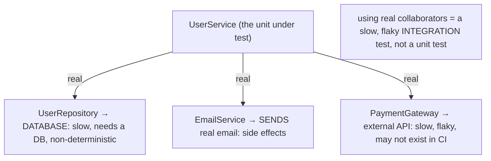
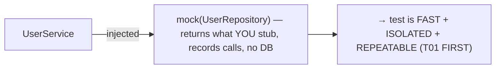
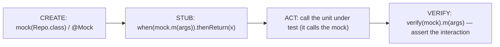
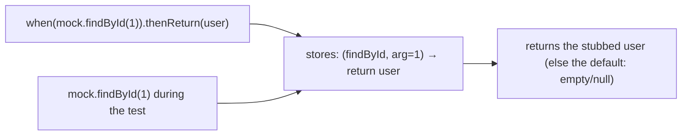
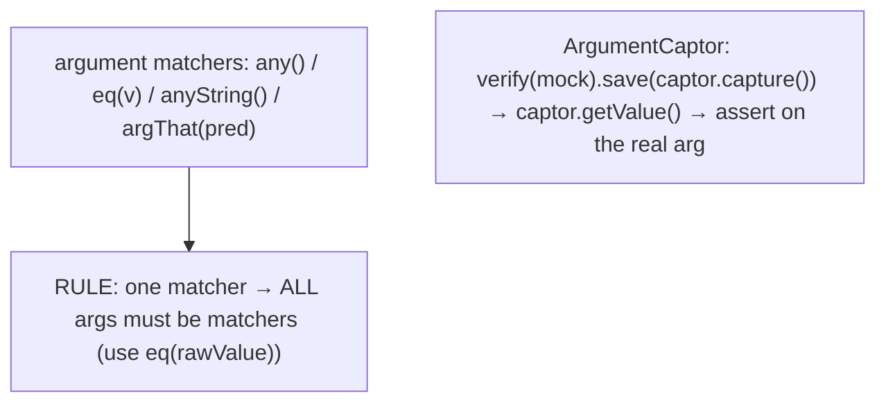
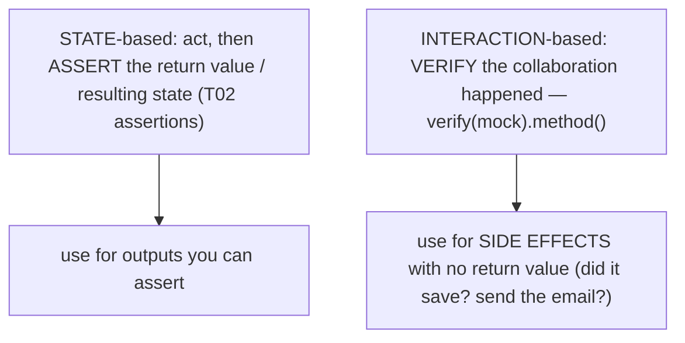
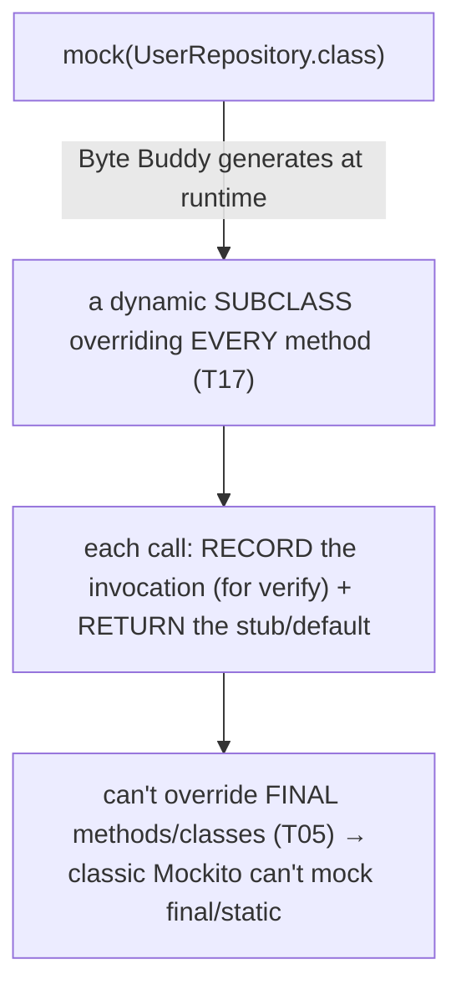
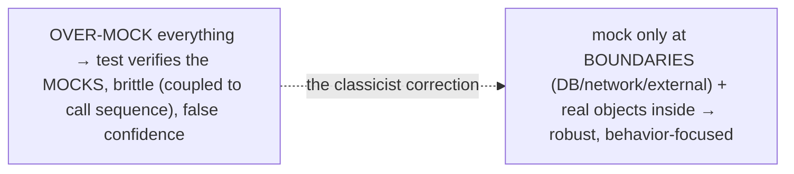
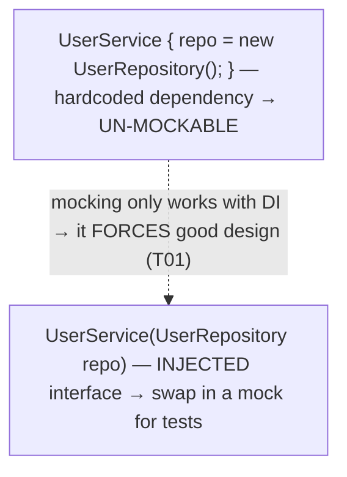
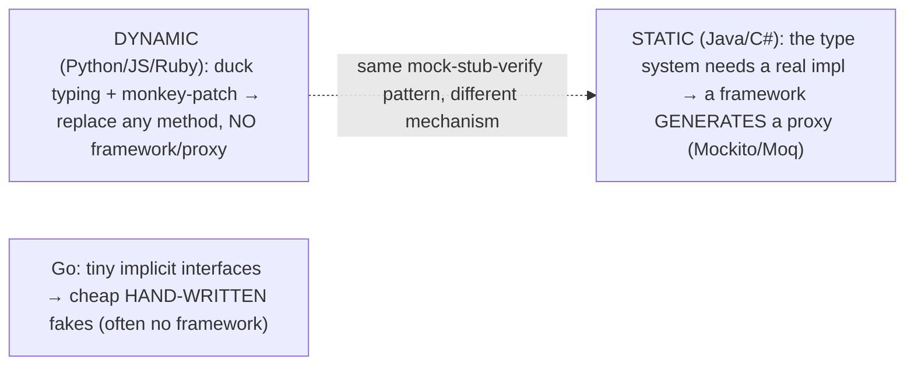

# Mocking with Mockito

[T01](./T01-unit-testing-with-junit-5.md) insisted that unit tests be **fast and isolated**, and [T02](./T02-assertions-assertj-hamcrest.md) made the *assert* step expressive — but real code rarely stands alone. A `UserService` depends on a `UserRepository` that hits a database, an `EmailService` that sends real mail, a `PaymentGateway` that calls an external API. Invoking those for real makes a "unit" test slow, non-deterministic, and side-effecting — an *integration* test in disguise. To test the unit in true isolation you must replace its collaborators with controllable stand-ins, and **Mockito** is the standard Java framework for doing so. The workflow is three steps — **mock** (create a fake collaborator), **stub** (`when(repo.findById(1)).thenReturn(user)` — define what it returns), and **verify** (`verify(repo).save(user)` — assert how it was used) — and it turns the *aspiration* of isolated unit testing into a *practical reality* for code with dependencies.

The depth bar is **how a mock is actually built, and the design force mocking exerts**. A mock is not magic: at runtime Mockito generates a **dynamic subclass** of the mocked type (using Byte Buddy bytecode generation) that **overrides every method** to record the call (for later `verify`) and return either the stubbed answer or a default — the same dynamic-proxy machinery as reflection ([T17](../C02-collections-and-core-apis/T17-reflection.md)), which is also *why* a classic mock cannot override a `final` method or class ([T05-C01](../C01-oop/T05-method-overriding.md)). And the deeper lesson is architectural: **you can only substitute a dependency with a mock if it is *injected*, not `new`-ed internally** — so adopting mocking *forces* dependency injection, the concrete proof of [T01](./T01-unit-testing-with-junit-5.md)'s claim that testability pressure drives good design. By the end you will mock, stub, and verify, capture arguments, distinguish state-based from interaction-based testing, and know the line between *useful* mocking (isolating at boundaries) and *over*-mocking (brittle tests that verify the mocks instead of the code).

> [!NOTE]
> Prerequisites: [JUnit 5](./T01-unit-testing-with-junit-5.md) (`L1/C03/T01`) — mocks live inside tests and enable the FIRST "isolated"; [Assertions](./T02-assertions-assertj-hamcrest.md) (`L1/C03/T02`) — `argThat` uses matchers, and you still assert state; [Reflection](../C02-collections-and-core-apis/T17-reflection.md) (`L1/C02/T17`) — Mockito builds mocks as runtime dynamic subclasses/proxies; [Method overriding](../C01-oop/T05-method-overriding.md) (`L1/C01/T05`) — why a proxy can't mock `final`; [Abstraction](../C01-oop/T07-abstraction-and-abstract-classes.md) (`L1/C01/T07`) — you mock interfaces, and mocking drives dependency injection. Forward: [T04](./T04-test-doubles-stub-mock-spy-fake.md) (the test-double taxonomy this topic previews).

## The Dependency Problem

A class under test has **collaborators**, and using the real ones breaks unit-test isolation:



Replace each collaborator with a **mock** — a fast, deterministic, in-memory stand-in you fully control — and the unit can be tested in isolation:



## Create, Stub, Verify

The Mockito workflow has three moves. **Create** a mock (every method returns a default — `null`/`0`/empty — until stubbed); **stub** its behavior; **verify** how it was used:

```java
@ExtendWith(MockitoExtension.class)
class UserServiceTest {
    @Mock UserRepository repo;          // a mock
    @Mock EmailService email;
    @InjectMocks UserService service;   // the unit, with the mocks injected

    @Test
    void registersAndEmailsNewUser() {
        when(repo.findByEmail("ada@x.com")).thenReturn(Optional.empty());   // STUB
        when(repo.save(any())).thenAnswer(inv -> inv.getArgument(0));

        User created = service.register("ada@x.com");                       // ACT

        assertThat(created.email()).isEqualTo("ada@x.com");                 // assert state (T02)
        verify(repo).save(any(User.class));                                 // VERIFY interaction
        verify(email).sendWelcome("ada@x.com");
    }
}
```

`@Mock` creates the mocks, `@InjectMocks` constructs the `UserService` and injects them, and `@ExtendWith(MockitoExtension.class)` wires it all up.



## Stubbing — Defining What a Mock Returns

`when(...).thenReturn(...)` defines a mock's response for given inputs; `thenThrow` simulates a failure; `thenAnswer` computes dynamically; chained returns handle consecutive calls:

```java
when(repo.findById(1L)).thenReturn(Optional.of(user));     // canned value
when(repo.findById(2L)).thenReturn(Optional.empty());
when(gateway.charge(any())).thenThrow(new TimeoutException()); // simulate an error path
when(clock.now()).thenReturn(t1).thenReturn(t2);            // consecutive calls
```

An unstubbed method returns the type's default (`null`, `0`, `false`, empty collection). Stubbing lets you drive the unit down every path — success, empty result, and *failure* — including error cases that would be hard to trigger with a real collaborator.



## Verifying Interactions and Capturing Arguments

`verify` asserts that the unit *called* a collaborator — essential for side effects with no return value to assert. Counts and **argument matchers** make it precise, and **`ArgumentCaptor`** grabs the actual argument for inspection:

```java
verify(repo).save(user);                       // called exactly once with `user`
verify(email, times(2)).send(any());           // exactly twice
verify(repo, never()).delete(any());           // never
verify(email).send(eq("ada@x.com"), anyString());  // matchers: eq + anyString

ArgumentCaptor<User> captor = ArgumentCaptor.forClass(User.class);
verify(repo).save(captor.capture());           // capture the saved object
assertThat(captor.getValue().email()).isEqualTo("ada@x.com");   // assert on it (T02)
```

**Argument matchers** (`any()`, `eq(v)`, `anyString()`, `argThat(predicate)` — the last using a matcher like Hamcrest's, [T02](./T02-assertions-assertj-hamcrest.md)) make stubbing/verification flexible — but with a strict rule: **if you use a matcher for one argument, you must use matchers for *all* arguments of that call** (wrap raw values in `eq(...)`), because Mockito tracks matchers positionally.



## Spies, and State vs Interaction Testing

A **spy** (`spy(realObject)` / `@Spy`) is a **partial mock**: it wraps a *real* object, so real methods run unless you stub them — useful for testing one method of a mostly-real object, though needing one is often a smell (the class may want splitting). And mocking surfaces a fundamental distinction:



**State-based** testing asserts the *result* (`assertThat(service.total()).isEqualTo(42)`); **interaction-based** testing verifies the unit *collaborated correctly* (`verify(email).send(...)`). Interaction verification is what mocks uniquely enable, and you reach for it when a behavior has **no return value to assert** — the side effect *is* the behavior. Prefer state-based assertions where you can; verify interactions for side effects.

## Mechanism — How Mockito Builds a Mock

A mock is an ordinary object with no real logic — and Mockito conjures it at runtime. `mock(UserRepository.class)` generates, on the fly, a **dynamic subclass** of the type (for an interface, a class implementing it; for a concrete class, a subclass) using **Byte Buddy** bytecode generation (Mockito 1 used CGLIB). *Every* method of that subclass is **overridden** to do two things: **record the invocation** (method + arguments) in an internal list — which is what `verify` later inspects — and **return the matching stubbed answer**, or the type's default if none. This is exactly the runtime-proxy machinery behind reflection ([T17](../C02-collections-and-core-apis/T17-reflection.md)).



Two consequences follow. Because the mechanism is **method overriding** ([T05-C01](../C01-oop/T05-method-overriding.md)), a classic mock **cannot override a `final` method or `final` class** (nor `static` methods or constructors). The modern **inline mock maker** (default since Mockito 5) works around this with a Java agent that instruments bytecode at load time, enabling `mockStatic`/`mockConstruction` and final-class mocking — at higher cost. And the mock holds only a *recording* and a *stub map*, no real state — whereas a **spy** wraps a real instance and delegates to it unless stubbed. (The reflection/codegen cost is test-time only, so it never matters — [T17](../C02-collections-and-core-apis/T17-reflection.md).)

## Architecture — Isolation, Over-Mocking, and the DI Force

Mocking exists to deliver [T01](./T01-unit-testing-with-junit-5.md)'s **isolation**: a fast, deterministic in-memory mock replaces a slow, external, non-deterministic collaborator, so the unit test becomes **Fast, Isolated, and Repeatable** even though the real code talks to a database or the network. But mocking is a sharp tool, and three architectural cautions matter.

**"Don't mock what you don't own"** (Freeman & Pryce). Mock *your own* abstractions — the `UserRepository`/`EmailService` *interfaces you defined* — not third-party types or value objects. You don't control a third-party API's contract, so a mock of it encodes assumptions that may be wrong; and mocking a value type (a `String`, a DTO) is pointless. Instead, **wrap** a third-party dependency in your own interface (an adapter) and mock *that*.

**Over-mocking is the common trap.** If you mock *everything*, the test verifies the **mocks**, not the real logic — a near-tautology that is **brittle** (coupled to the exact call sequence, so `verify(x).foo()` breaks on a refactor that changes *how* but not *what*) and gives **false confidence** (the real collaborators may not behave like your mocks). This is the crux of the **London (mockist)** vs **Detroit/classicist** schools of TDD: the mockist mocks all collaborators and verifies interactions; the classicist uses real objects where cheap and mocks **only at the boundaries** (database, network, external services), preferring state-based assertions. Most practitioners lean classicist for robustness — **mock at boundaries, use real objects inside.**



The deepest architectural point is that **mocking forces dependency injection**. You can only substitute a collaborator with a mock if the unit *receives* it (constructor/setter injection) rather than creating it internally with `new`. A `UserService` that does `new UserRepository()` in its constructor is **un-mockable** — its dependency is hardcoded. So writing testable code *requires* injecting dependencies as interfaces — which is precisely [T01](./T01-unit-testing-with-junit-5.md)'s "testability pressure drives good design," made concrete: adopting mocking drives dependency injection, loose coupling, and programming to interfaces ([T08-C01](../C01-oop/T08-interfaces-default-static-private-methods.md)).



## Cross-Language Perspective

Mocking is universal, but **dynamic and static languages do it very differently** — and the difference is the type system. The mock-stub-verify *pattern* is shared; the *implementation* is not.

| Language | Tool | How |
|---|---|---|
| **Java** | **Mockito** (the model), EasyMock | proxy/subclass via Byte Buddy |
| **C#** | **Moq**, NSubstitute | proxy via Castle DynamicProxy |
| **Python** | `unittest.mock` (`MagicMock`, `patch`) | monkey-patching (no proxy needed) |
| **JavaScript** | Jest (`jest.fn`/`jest.mock`), Sinon | mutable modules / functions |
| **Ruby** | RSpec mocks (`double`, `allow`) | open classes |
| **Go** | `gomock` / hand-written fakes | small interfaces, often by hand |

The split is sharp. **Dynamic languages mock *trivially*** — Python's `unittest.mock` (`MagicMock` auto-creates methods and records calls; `patch()` temporarily *replaces* any object/attribute), JavaScript's Jest (`jest.fn()`, auto-mocking whole modules), and Ruby's RSpec doubles all exploit **duck typing and monkey-patching**: any object can stand in for any other, and you can reassign a method at runtime, so **no proxy and no framework subclassing is needed**. **Static languages need a proxy-generating framework** — Java's Mockito and C#'s Moq must *generate* a real implementation of the interface/class at runtime (Byte Buddy, Castle DynamicProxy) because the type system demands one; you can't simply swap a method. **Go** takes a third path: its tiny, implicitly-satisfied interfaces make **hand-written fakes** so cheap that idiomatic Go often skips a mocking framework entirely (though `gomock` exists). The convergence is the design lesson, not the tooling: **mock at boundaries, inject dependencies, and don't over-mock** — true in every language.



## Common Mistakes

> [!WARNING]
> **Over-mocking.** Mocking every collaborator makes the test verify the mocks, not the code — brittle and falsely reassuring. Mock only at boundaries (DB, network, external services); use real objects inside.

> [!WARNING]
> **Mocking what you don't own.** Don't mock third-party types or value objects — you don't control their contracts, and mocking a value is pointless. Wrap a third-party dependency in your own interface and mock that.

> [!WARNING]
> **Verifying too much.** Verifying every call couples the test to the implementation (the *how*), so it breaks on harmless refactors. Verify only the meaningful side effect.

> [!WARNING]
> **Testing the mock, not the code.** A test that stubs a return and then verifies the call proves nothing about the unit's logic — it's a tautology. Assert the unit's actual behavior or result.

> [!WARNING]
> **Mixing matchers and raw values.** If one argument uses a matcher, all must (wrap raw values in `eq(...)`), or Mockito throws `InvalidUseOfMatchersException`.

> [!WARNING]
> **Hardcoded dependencies (no DI).** A collaborator created with `new` inside the class can't be mocked. Inject dependencies as interfaces — which is also better design.

## Practice

> [!INTERVIEW]
> Common interview questions for this topic:
> 1. **What is mocking and why?** Replacing a unit's real dependencies with controllable stand-ins so it can be tested in isolation (fast, deterministic) — without a real DB/network/external service.
> 2. **The Mockito workflow?** Create a mock (`mock()`), stub it (`when().thenReturn()`), exercise the unit, verify interactions (`verify()`).
> 3. **Stub vs mock vs spy?** A stub provides canned returns; a mock also lets you verify interactions; a spy is a partial mock wrapping a real object (real methods unless stubbed). (Full taxonomy in [T04](./T04-test-doubles-stub-mock-spy-fake.md).)
> 4. **How do you verify an interaction?** `verify(mock).method(args)`, with `times()`/`never()`/`atLeastOnce()`.
> 5. **What are argument matchers?** `any()`/`eq()`/`anyString()`/`argThat()` for flexible stubbing/verification — and if you use one matcher, all arguments must be matchers.
> 6. **What is `ArgumentCaptor`?** It captures the argument passed to a mock so you can assert on it.
> 7. **State vs interaction testing?** State asserts the return/result; interaction verifies the collaboration — use the latter for side effects with no return value.
> 8. **How does Mockito create a mock under the hood?** It generates a runtime dynamic subclass/proxy (Byte Buddy) overriding every method to record the call and return the stub/default.
> 9. **Why can't classic Mockito mock `final`?** A subclass-based proxy can't override `final` methods/classes; the inline mock maker (bytecode instrumentation) is needed.
> 10. **What is "don't mock what you don't own"?** Mock your own interfaces, not third-party types or value objects; wrap third-party deps in your own interface and mock that.
> 11. **What is the over-mocking risk?** Mocking everything tests the mocks, couples tests to the implementation, and gives false confidence — mock only at boundaries.
> 12. **How does mocking relate to dependency injection?** You can only substitute an injected dependency, so mocking forces DI — testability drives good design.
> 13. **How do dynamic languages differ?** Python/JS/Ruby mock trivially via duck typing/monkey-patching; static languages need a proxy-generating framework.

1. **Mock + stub + assert.** `mock(Repository.class)`, stub `findById`, call the service, and assert the returned result.

2. **`@Mock`/`@InjectMocks`.** Set up a test with `@ExtendWith(MockitoExtension.class)`, mocks, and an injected unit under test.

3. **Verify a side effect.** `verify(repo).save(user)` for a method that returns nothing; confirm the save happened.

4. **Counts.** Use `times(2)`, `never()`, and `verifyNoMoreInteractions`.

5. **Argument matchers.** Stub with `any()`/`eq()`; trigger `InvalidUseOfMatchersException` by mixing a matcher and a raw value, then fix it with `eq()`.

6. **`ArgumentCaptor`.** Capture the `User` passed to `save` and assert on its fields.

7. **Spy.** Wrap a real `ArrayList` in a `spy`; confirm real methods work and stub one with `doReturn().when(spy)...`.

8. **Error path.** `thenThrow` to make a collaborator fail, and verify the unit handles it.

9. **State vs interaction.** Write one test that asserts a return value and one that verifies a side-effecting call; explain when each fits.

10. **Refactor over-mocking.** Take a brittle test that mocks everything and verifies the call sequence; rewrite it to assert behavior with real objects inside.

11. **`BDDMockito`.** Rewrite a test in Given-When-Then style (`given().willReturn()`, `then().should()`).

12. **The proxy mechanism.** Print `mock.getClass()` and observe the generated subclass; explain why it can't mock a `final` class ([T05](../C01-oop/T05-method-overriding.md)).

13. **Don't mock what you don't own.** Wrap a third-party client in your own interface and mock the interface instead of the client.

14. **Cross-language.** Write the same mock-stub-verify in Mockito (Java) and `unittest.mock` (Python); compare the framework-vs-monkeypatch approaches.

15. **End-to-end explain-it-back.** (a) How Mockito builds a mock (a runtime dynamic subclass via Byte Buddy, overriding every method to record + answer); (b) the mock-stub-verify workflow; (c) why mocking enables isolation (a fast deterministic stand-in for a slow collaborator — the FIRST principles); (d) why it requires dependency injection; (e) the over-mocking risk. Twelve sentences max.

## Recap

You should now be able to:

**Language layer.**

- Explain why a unit's collaborators must be replaced to test it in isolation, and use Mockito's create-stub-verify workflow (`mock`/`@Mock`/`@InjectMocks`, `when().thenReturn()`/`thenThrow`, `verify()` with counts).
- Use argument matchers (with the all-or-nothing rule), `ArgumentCaptor`, spies, and `BDDMockito`, and distinguish state-based from interaction-based testing.

**Memory / mechanism layer.**

- Explain that Mockito builds a mock as a runtime dynamic subclass/proxy (Byte Buddy) overriding every method to record invocations and return stubs/defaults — the reflection/codegen machinery ([T17](../C02-collections-and-core-apis/T17-reflection.md)) — and why method-overriding ([T05](../C01-oop/T05-method-overriding.md)) means classic mocks can't touch `final`/`static` without the inline maker.

**Architecture layer.**

- Explain that mocking delivers FIRST isolation, when to verify interactions (side effects) vs assert state, and the cautions "don't mock what you don't own" and avoid over-mocking (mock at boundaries — the classicist vs mockist schools).
- Explain that mocking *forces* dependency injection (you can only substitute an injected dependency), making testability pressure drive loose coupling and programming to interfaces.
- Contrast dynamic-language monkey-patching (Python/JS/Ruby — no framework) with static-language proxy frameworks (Mockito/Moq) and Go's hand-written fakes.

The next topic names and organizes what this one demonstrated. [T04](./T04-test-doubles-stub-mock-spy-fake.md) — test doubles (stub, mock, spy, fake) — gives the precise vocabulary (Gerard Meszaros's taxonomy) for the *kinds* of stand-in: a **dummy** (a placeholder never used), a **stub** (canned answers), a **spy** (records calls for later inspection), a **mock** (pre-programmed with expectations it verifies), and a **fake** (a working lightweight implementation, like an in-memory database) — so you can choose the right double and use the terms correctly.

## Next

Continue to [Test doubles (stub, mock, spy, fake)](./T04-test-doubles-stub-mock-spy-fake.md) — the vocabulary for stand-ins. T03 used "mock" loosely for any substitute; T04 gives Gerard Meszaros's precise taxonomy of **test doubles**: a **dummy** (passed but never used — fills a parameter list), a **stub** (returns canned answers to drive a path), a **spy** (a stub that *also* records how it was called), a **mock** (pre-loaded with expectations it *verifies*), and a **fake** (a real but lightweight working implementation — an in-memory repository, an H2 database). Knowing which double you need — and that Mockito's `mock()` can play several of these roles — sharpens both your tests and your ability to discuss them precisely, the conceptual capstone of the mocking material.
