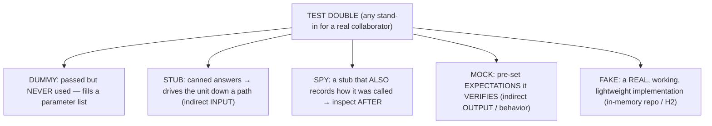
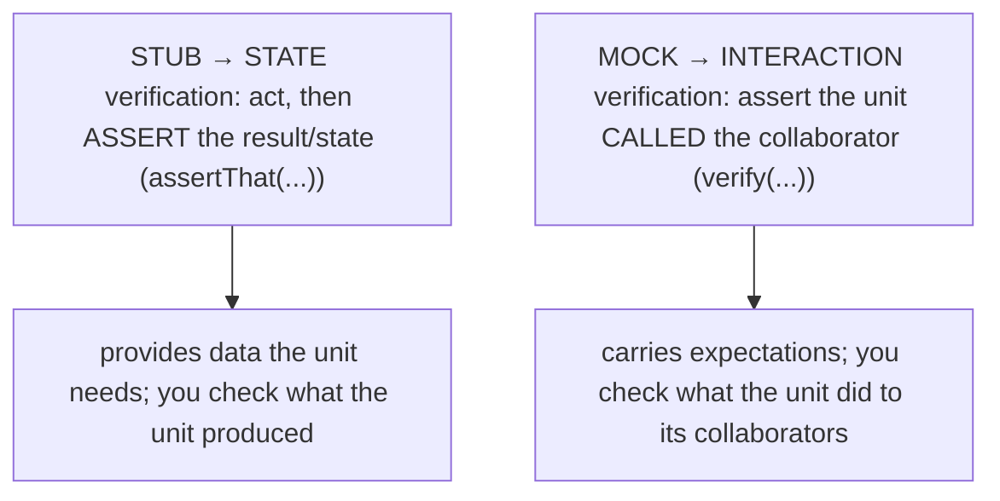
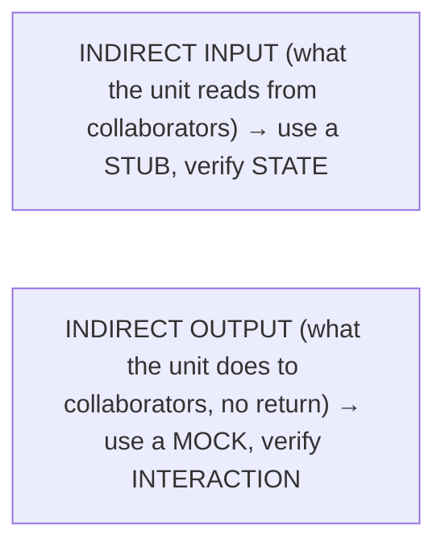
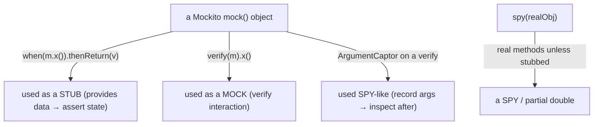
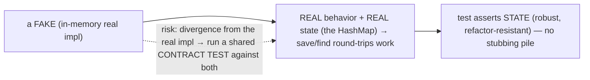
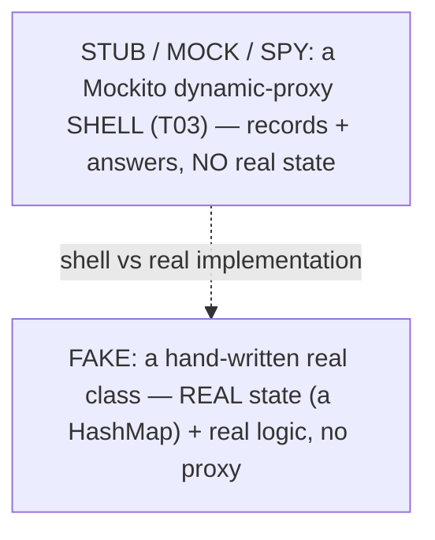
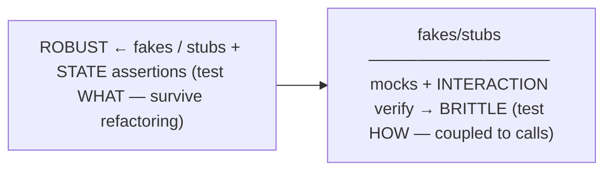
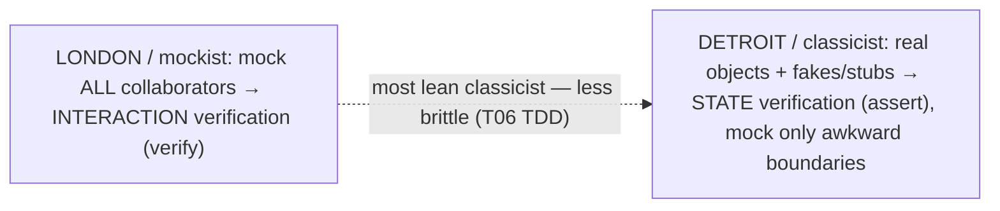
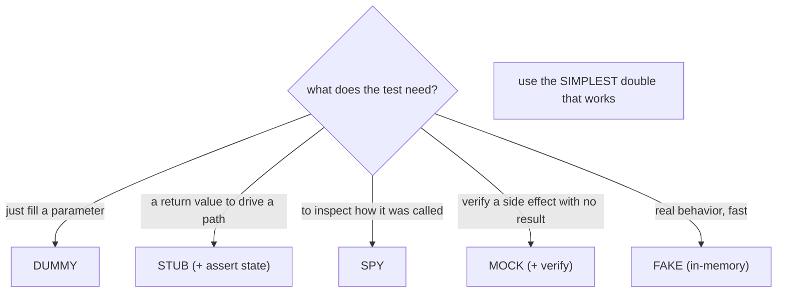
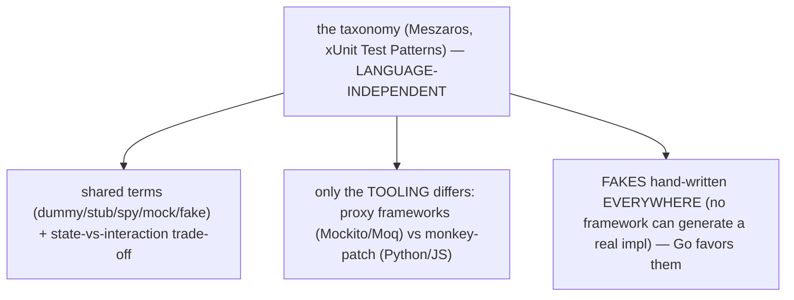

# Test doubles (stub, mock, spy, fake)

[T03](./T03-mocking-with-mockito.md) used the word "mock" loosely for any stand-in. This topic gives the **precise vocabulary** — Gerard Meszaros's taxonomy of **test doubles** — for the *kinds* of stand-in, so you can choose the right one and discuss it accurately. "Test double" is the umbrella term (by analogy with a stunt *double*) for any object you substitute for a real one in a test, and there are five recognized kinds, in rough order of capability: a **dummy** (a placeholder passed but never used — it just fills a parameter list), a **stub** (returns canned answers to drive the unit down a path), a **spy** (a stub that *also* records how it was called so you can inspect it afterward), a **mock** (pre-loaded with *expectations* it *verifies*), and a **fake** (a real, working, but lightweight implementation — an in-memory repository, an H2 database). Knowing which double you need — and that Mockito's `mock()` can play several of these roles — sharpens both your tests and your ability to reason about them.

The depth bar is **the stub-versus-mock distinction (state versus interaction verification) and why fakes are the underused, most-robust option**. The line Martin Fowler drew in "Mocks Aren't Stubs" is the most important one in testing: a **stub** provides *data* and you verify the result by asserting *state* (`assertThat(service.total()).isEqualTo(42)`), whereas a **mock** carries *expectations* and you verify *behavior* by checking it was *called* (`verify(email).send(...)`). That choice has a robustness consequence — **state-based tests survive refactoring** (they assert *what* the code does) while **interaction-based tests are brittle** (they assert *how*, coupling to the implementation's exact calls). The double that maximizes robustness is the most overlooked: a **fake** has *real behavior* (a `HashMap`-backed repository you can actually save to and read from), so you test against real state instead of a thicket of stubs and verifications — often a better choice than mocking. By the end you will name the five doubles, pick the simplest that fits, know when a fake beats a mock, and recognize that this taxonomy — and the state-vs-interaction trade-off — is language-independent.

> [!NOTE]
> Prerequisites: [Mocking with Mockito](./T03-mocking-with-mockito.md) (`L1/C03/T03`) — this names what T03 demonstrated; [JUnit 5](./T01-unit-testing-with-junit-5.md) (`L1/C03/T01`) and [Assertions](./T02-assertions-assertj-hamcrest.md) (`L1/C03/T02`) — state verification uses assertions; [Abstraction](../C01-oop/T07-abstraction-and-abstract-classes.md) (`L1/C01/T07`) and [Interfaces](../C01-oop/T08-interfaces-default-static-private-methods.md) (`L1/C01/T08`) — a fake is a real implementation of the same interface, substituted at the dependency-injection seam. Forward: [T05](./T05-testng-alternative.md) (TestNG), [T06](./T06-test-driven-development-tdd.md) (TDD — where the London/Detroit schools become concrete).

## "Test Double" — The Umbrella and the Five Kinds

**Test double** (Meszaros, *xUnit Test Patterns*) is the generic term for *any* substitute for a real collaborator, and it has five recognized varieties:



- **Dummy** — an object passed only to satisfy a signature, never actually exercised (e.g. a `null` or a do-nothing placeholder for a constructor argument this test doesn't touch).
- **Stub** — provides *canned answers* to the calls the test makes, supplying the **indirect input** the unit needs to reach a particular path. No verification; you assert the *result*.
- **Spy** — a stub that *additionally* **records** information about how it was called, so the test can examine it **afterward** (e.g. an email spy that collects the messages it was asked to send).
- **Mock** — pre-programmed with **expectations** (the calls it should receive) that it **verifies**; it fails the test if those interactions don't happen. Behavior set up *before* the act.
- **Fake** — a **real, working implementation** that takes a shortcut making it unfit for production — the canonical example is an **in-memory database** or a `HashMap`-backed repository. It has genuine behavior, just simplified and fast.

## Stub vs Mock — State vs Interaction

The most important distinction is **stub vs mock**, and it is really a distinction between two *styles of verification*:



A **stub** *provides data* and you verify the outcome by asserting **state** — exercise the unit, then `assertThat(service.calculate()).isEqualTo(42)`. A **mock** *carries expectations* and you verify **behavior** — `verify(email).send(...)` — checking that the unit made the right calls. Fowler's "Mocks Aren't Stubs" crystallized this: **stubs are for indirect input** (state verification), **mocks are for indirect output** (interaction verification). You reach for interaction verification only when a behavior has **no observable result to assert** — the side effect *is* the behavior (did it send the email? charge the card?).



## How Mockito Maps to the Taxonomy

Mockito blurs these lines because its `mock()` object is a **general-purpose double** you *use* as different kinds depending on the test:



The same Mockito object is a **stub** when you `when(...).thenReturn(...)` it, a **mock** when you `verify(...)` it, and **spy-like** when you capture its arguments — so calling every Mockito double a "mock" is loose but common. (Mockito even records-then-verifies *after* the act, which is technically more spy-style than the classic *expectations-up-front* mock of EasyMock.) The taxonomy still matters: it tells you *which role* a test needs and keeps team communication precise.

## Fakes — The Underused Robust Option

A **fake** is the double people forget, and often the best one. Instead of stubbing a repository's every method, you write a small **real implementation** of its interface backed by an in-memory structure:

```java
class InMemoryUserRepository implements UserRepository {   // a FAKE — real behavior, no DB
    private final Map<Long, User> store = new HashMap<>();
    public User save(User u)            { store.put(u.id(), u); return u; }
    public Optional<User> findById(Long id) { return Optional.ofNullable(store.get(id)); }
}
```

Now a test can do a real **round-trip** — save a user, then find it — and assert on **state**, with no stubbing and no interaction verification:

```java
var repo = new InMemoryUserRepository();
var service = new UserService(repo);
service.register("ada@x.com");
assertThat(repo.findByEmail("ada@x.com")).isPresent();   // state-based, robust
```

Because the fake has genuine behavior, the test is **state-based and refactor-resistant** (it asserts *what* happened, not *which calls* were made), reusable across many tests, and far less brittle than a pile of stubs. The one caution: a fake must stay **faithful** to the real implementation, or it gives false confidence — which is why the same **contract test** is often run against both the fake and the real (database-backed) implementation to prove they behave identically.



## Mechanism — Recording Shells vs a Real Object With State

The mechanical difference between the doubles is whether they hold **real state**. A Mockito **stub/mock/spy** is the dynamic-proxy object from [T03](./T03-mocking-with-mockito.md) — a generated subclass that *records* invocations and *answers* with stubs or defaults — and it holds **no real state or logic**; it's a recording shell. A **fake** is the opposite: a **hand-written ordinary class** (no proxy) that implements the interface with **real state** — the `HashMap` actually stores the entities, so `save` then `findById` genuinely round-trips.



That is why a fake supports state-based assertions a stub cannot: there is a real data structure to inspect. (A spy sits in between for Mockito — the proxy *records* calls, which is state about the *interactions* but not domain state.)

## Architecture — Robustness, the Simplest Double, and the Seam

Choosing a double is a **design decision about test robustness**, and it follows directly from the stub/mock split. **State-based tests** — using stubs or fakes plus assertions on outcomes — are **robust**: they assert *what* the unit does, so they survive refactoring of *how* it does it. **Interaction-based tests** — using mocks plus `verify` — are **brittle**: they assert the exact calls, so they break when you restructure the implementation even though the behavior is unchanged. The guidance that falls out is the [T03](./T03-mocking-with-mockito.md) one, now precise: **prefer state-based verification (stubs/fakes), and use interaction verification (mocks) only for side effects with no observable result.**



This reframes the **London (mockist)** vs **Detroit (classicist)** schools precisely: the mockist mocks all collaborators and verifies interactions; the classicist uses real objects and **fakes/stubs** with state verification, mocking only at awkward boundaries — and the classicist's tests are less brittle, which is why most practitioners lean that way. Two more principles guide the choice. **Use the simplest double that works** — the doubles form a rough power ordering (dummy → stub → spy → mock), and reaching for a mock when a stub-plus-assertion suffices over-couples the test; pick the *least powerful* one that does the job. And test doubles are how you exploit the **seam** ([Feathers](../C01-oop/T08-interfaces-default-static-private-methods.md)) that dependency injection creates: because the unit *receives* its collaborators as interfaces, you can substitute a double at that seam without touching the unit — doubles and DI together decouple the unit from its environment.





## Cross-Language Perspective

This taxonomy is **language-independent** — it comes from Meszaros's *xUnit Test Patterns*, the canonical reference for *every* xUnit-style framework, and the five kinds and the state-vs-interaction trade-off apply identically across languages:

| Double | Java | Python | Go |
|---|---|---|---|
| **stub/mock/spy** | Mockito proxy | `unittest.mock` (MagicMock) | `gomock` / hand-written |
| **fake** | hand-written class (in-memory) | hand-written class | **hand-written (idiomatic)** |
| **verification style** | state (assert) / interaction (verify) | same | same |

The terms — *dummy, stub, spy, mock, fake* — are shared vocabulary across the testing world, as is **Fowler's "mocks aren't stubs"** distinction and the **"prefer fakes/stubs, mock sparingly"** guidance. The tooling differs only in how stubs/mocks/spies are *produced*: Java's Mockito and C#'s Moq generate them via proxies, dynamic languages (Python `unittest.mock`, JS Jest) conjure them trivially via monkey-patching ([T03](./T03-mocking-with-mockito.md)) — but **fakes are hand-written everywhere**, because a fake is just a real (if simplified) implementation of the interface, which no framework can generate for you. **Go** leans hardest on fakes: its tiny, implicitly-satisfied interfaces make hand-written in-memory implementations so cheap and explicit that idiomatic Go often prefers a fake to a mocking framework altogether. The universal lesson is the same one the architecture section reached: choose the *kind* of double the test actually needs, prefer state-based fakes and stubs for robustness, and verify interactions only for side effects.



## Common Mistakes

> [!WARNING]
> **Calling everything a "mock."** A stub used for data is not a mock; the taxonomy matters for clear communication and for choosing the right tool. Reserve "mock" for interaction-verified doubles with expectations.

> [!WARNING]
> **Using a mock where a stub-plus-state-assertion would do.** Interaction verification couples the test to the implementation. If you can assert a result, use a stub and assert state — it's more robust.

> [!WARNING]
> **Not reaching for fakes.** A `HashMap`-backed in-memory fake often gives simpler, less brittle, state-based tests than a pile of stubs and verifications. Fakes are the underused default for repository-like collaborators.

> [!WARNING]
> **A fake that diverges from the real implementation.** If the in-memory fake behaves differently from the real database, your tests give false confidence. Run a shared **contract test** against both to keep them faithful.

> [!WARNING]
> **Reaching for the most powerful double by default.** Use the simplest one that works (dummy < stub < spy < mock). An over-powered double makes the test do (and assert) more than it needs to.

> [!WARNING]
> **Confusing a spy with a mock.** A spy records calls for *after-the-fact* inspection; a mock sets *expectations up front*. They differ in *when* the interaction is specified and verified.

## Practice

> [!INTERVIEW]
> Common interview questions for this topic:
> 1. **What is a "test double"?** Meszaros's umbrella term for any object that stands in for a real one in a test.
> 2. **Name the five kinds.** Dummy (placeholder, never used), stub (canned answers), spy (stub that records calls), mock (pre-set expectations it verifies), fake (a real but lightweight working implementation).
> 3. **Stub vs mock?** A stub provides data and you verify state (assert the result); a mock has expectations and you verify interaction (assert it was called).
> 4. **What is a fake?** A real, working, lightweight implementation (e.g. an in-memory repository) — real behavior, simplified, not for production.
> 5. **What is a spy?** A stub that also records how it was called, so the test can inspect the interactions afterward.
> 6. **What is a dummy?** A placeholder passed to fill a parameter list but never actually used.
> 7. **How does Mockito map to the taxonomy?** `mock()` is a general double — a stub with `when().thenReturn()`, a mock with `verify()`; `spy()` is a spy; `ArgumentCaptor` makes it spy-like.
> 8. **Which double gives the most robust tests?** Fakes/stubs with state-based assertions (test *what*); mocks with interaction verification are more brittle (test *how*).
> 9. **Why are fakes underrated?** They give real behavior and state-based, refactor-resistant tests — often better than mocking a repository.
> 10. **What's the "simplest double" principle?** Use the least powerful double that does the job (dummy < stub < spy < mock).
> 11. **What's the risk with fakes, and the fix?** Divergence from the real implementation → false confidence; mitigate with a contract test run against both.
> 12. **London vs Detroit in terms of doubles?** London/mockist uses mocks + interaction verification; Detroit/classicist uses stubs/fakes + state verification.
> 13. **Is the taxonomy language-specific?** No — it's from Meszaros's *xUnit Test Patterns* and applies to every language; the terms and trade-offs are universal.

1. **Identify the doubles.** Given a described test setup, label each stand-in as dummy, stub, spy, mock, or fake.

2. **Dummy.** Pass a `null`/placeholder argument to satisfy a constructor parameter the test doesn't exercise.

3. **Stub + state.** Stub a repository to return a fixed user, exercise the service, and assert the *result*.

4. **Mock + interaction.** Verify a side-effecting call (an email send with no return value) with `verify`.

5. **Spy.** Record the arguments/calls a collaborator received and inspect them after the act (via `ArgumentCaptor` or a hand-written spy).

6. **Fake.** Write an `InMemoryUserRepository` (`HashMap`-backed) and a save-then-`findById` round-trip test that asserts state.

7. **Stub vs mock robustness.** Test the same behavior two ways — state-based (stub + assert) and interaction-based (mock + verify) — then refactor the implementation and see which test survives.

8. **Fake beats mock.** Replace a heavily-stubbed mock repository with the in-memory fake; observe the test become simpler and state-based.

9. **One Mockito object, two roles.** Use the same Mockito `mock()` as a stub (`when`) in one test and a mock (`verify`) in another.

10. **Hand-written vs framework.** Implement a fake by hand and contrast it with a Mockito mock of the same interface.

11. **Simplest double.** For several scenarios, choose the least powerful double that does the job and justify it.

12. **Contract test.** Write one test suite and run it against both the in-memory fake and a real implementation to prove they agree.

13. **Spy vs mock timing.** Illustrate the difference between recording calls for after-the-fact inspection (spy) and setting expectations up front (mock).

14. **Cross-language.** Note how the taxonomy applies in Python/Go; sketch a Go-style hand-written fake (a small interface implementation).

15. **End-to-end explain-it-back.** (a) The five doubles and what each is for; (b) the stub-vs-mock / state-vs-interaction distinction; (c) how Mockito's `mock()` plays several roles; (d) why fakes give the most robust tests and their faithfulness risk; (e) the "simplest double" principle. Twelve sentences max.

## Recap

You should now be able to:

**Language layer.**

- Name the five test doubles (dummy, stub, spy, mock, fake) precisely and choose the right one for a test's need.
- State the stub-vs-mock distinction as state-vs-interaction verification (Fowler), and explain how Mockito's `mock()` plays the stub, mock, and spy roles.

**Memory / mechanism layer.**

- Explain that stubs/mocks/spies are dynamic-proxy recording shells with no real state ([T03](./T03-mocking-with-mockito.md)), while a fake is a hand-written real implementation with genuine state (the in-memory `HashMap`), which is why a fake supports state-based round-trip assertions.

**Architecture layer.**

- Explain why state-based tests (stubs/fakes) are robust and interaction-based tests (mocks) are brittle, and apply "prefer fakes/stubs, mock side effects only," the "simplest double" principle, and the London-vs-Detroit framing.
- Recognize fakes as the underused, most-robust option (with the divergence risk mitigated by contract tests), and test doubles as the substitution at the dependency-injection seam.
- Recognize the taxonomy and trade-offs as language-independent (Meszaros), with fakes hand-written everywhere and Go especially favoring them.

The next topic steps outside JUnit to its main alternative. [T05](./T05-testng-alternative.md) — TestNG — covers the other major Java testing framework, its differences from JUnit 5 (richer built-in support for data-driven tests, test groups, dependencies, and parallel execution), and where each fits — so you can read and work in a TestNG codebase and understand the design choices that distinguish the two.

## Next

Continue to [TestNG (alternative)](./T05-testng-alternative.md) — the other major Java testing framework. T01–T04 built up the JUnit 5 + Mockito stack; T05 steps sideways to **TestNG**, JUnit's longtime alternative, which predates several JUnit 5 features and still leads in some areas. It covers TestNG's annotations and lifecycle (`@Test`, `@BeforeMethod`/`@AfterMethod`, `@BeforeClass`/`@BeforeSuite`), its strengths — first-class **data providers** (`@DataProvider`) for data-driven tests, **test groups** and **dependencies** (`dependsOnMethods`), flexible **parallel execution**, and XML-based suite configuration — and how those compare with JUnit 5's parameterized tests, tags, and extension model, so you can work in either codebase and understand why a team might choose one over the other.
