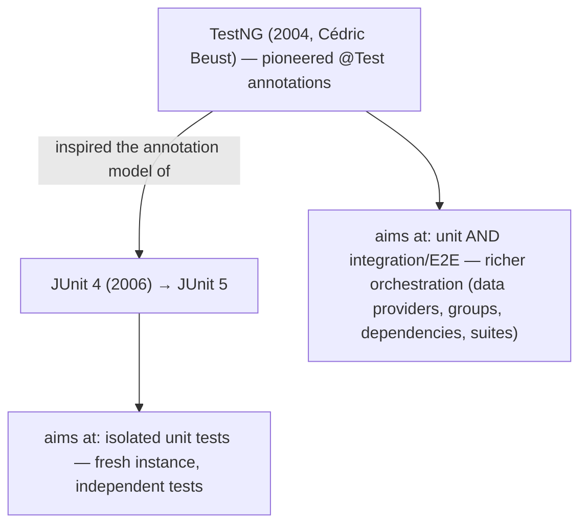
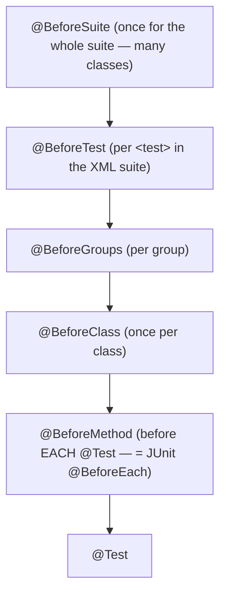
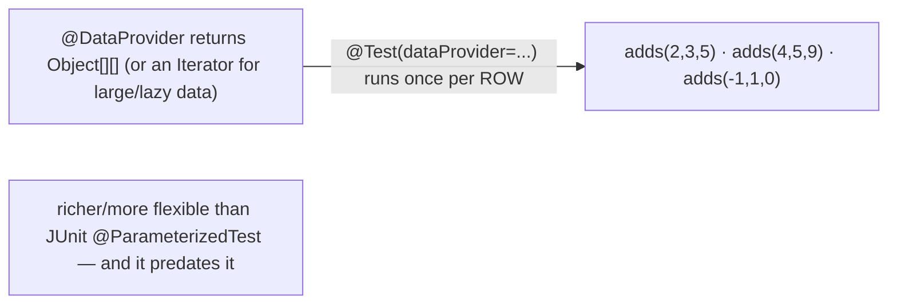
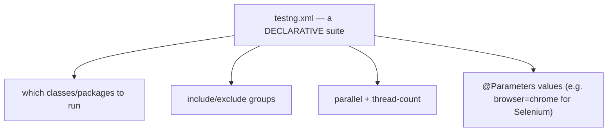
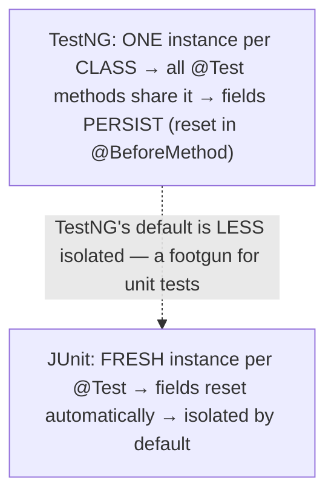
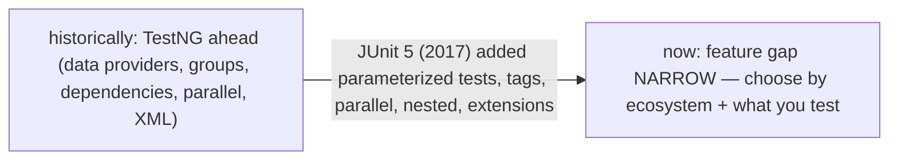
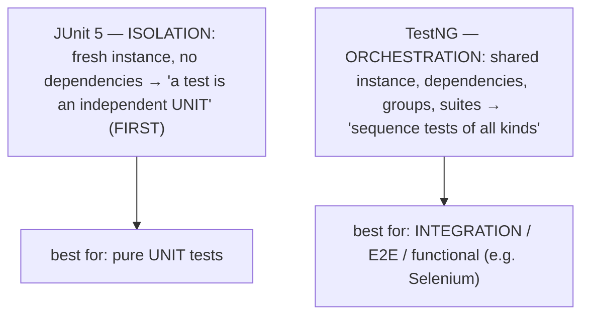
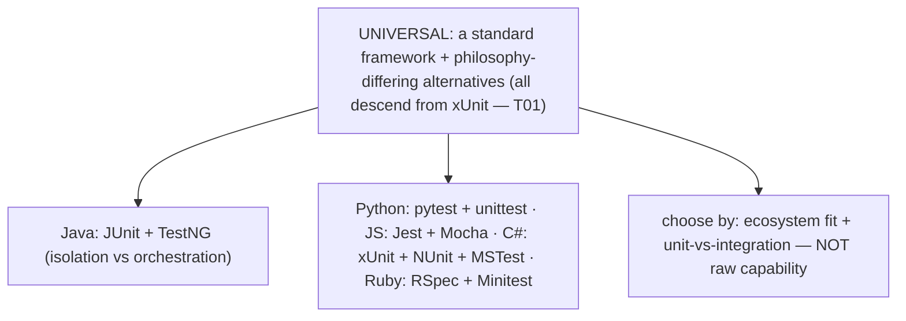

# TestNG (alternative)

T01–T04 built up the JUnit 5 + Mockito stack; this topic steps sideways to **TestNG**, JUnit's longtime alternative — so you can read and work in a TestNG codebase and understand the design choices that distinguish the two. TestNG (Cédric Beust, 2004 — "Next Generation") matters historically because it **pioneered the annotation-driven test model** that JUnit 4 then adopted: before TestNG, JUnit 3 marked tests by naming convention (`testXxx` methods in a `TestCase` subclass), and it was TestNG's `@Test` annotation that showed the way. Functionally, TestNG looks much like JUnit at the surface — `@Test` methods, before/after hooks, assertions — but it leans toward a richer feature set: first-class **data providers** for data-driven tests, **test groups**, **test dependencies**, flexible **parallel execution**, and declarative **XML suite configuration**.

The depth bar is **the design-philosophy difference beneath the feature lists — isolation versus orchestration — and the one mechanism choice that embodies it**. JUnit 5 enforces **isolation**: a *fresh instance of the test class per test method*, and *no way to make one test depend on another*. TestNG is more **permissive**: it reuses *one instance per test class* (so methods can share state) and lets a test declare `dependsOnMethods` so it runs only after a prerequisite passes (and is *skipped* if the prerequisite fails). That single instance-lifecycle difference — fresh-per-method versus one-per-class — is the concrete expression of two worldviews: JUnit treats a test as an *independent unit* (the FIRST "Isolated" principle from [T01](./T01-unit-testing-with-junit-5.md)), while TestNG treats the framework as a *test orchestrator* suited to integration and end-to-end suites where ordering and dependencies are legitimate. JUnit 5 has since caught up on most of TestNG's features, so the practical choice now comes down to *what you are testing* — pure units (JUnit) versus orchestrated integration flows (TestNG, the common choice for Selenium suites). By the end you will read TestNG code, use its distinctive features, and choose between the two with reasons.

> [!NOTE]
> Prerequisites: [JUnit 5](./T01-unit-testing-with-junit-5.md) (`L1/C03/T01`) — the baseline this contrasts against (lifecycle, isolation, parameterized tests); [Assertions](./T02-assertions-assertj-hamcrest.md) (`L1/C03/T02`) — TestNG has its own `Assert`/`SoftAssert` (with a *reversed* argument order); [Mocking](./T03-mocking-with-mockito.md) (`L1/C03/T03`) — Mockito works with either framework; [Reflection](../C02-collections-and-core-apis/T17-reflection.md) (`L1/C02/T17`) and [Annotations](../C02-collections-and-core-apis/T18-annotations-using-and-writing-meta-annotations.md) (`L1/C02/T18`) — TestNG discovers and runs tests by the same reflection-plus-annotations mechanism. Forward: [T06](./T06-test-driven-development-tdd.md) (TDD — where the isolation/orchestration schools become concrete practice).

## TestNG at a Glance

TestNG and JUnit share a lineage — both are annotation-driven xUnit frameworks discovered and run the same way — but TestNG was the pioneer and aims wider:



## The Lifecycle and Annotations

TestNG's `@Test` marks a method *or* a whole class (then all public methods are tests), and carries its configuration as **annotation attributes** — `expectedExceptions`, `timeOut`, `enabled`, `priority`, `invocationCount`, `dependsOnMethods`, `groups`, `dataProvider`. Its lifecycle hooks form a **finer hierarchy** than JUnit's:



`@BeforeMethod`/`@AfterMethod` correspond to JUnit's `@BeforeEach`/`@AfterEach`, and `@BeforeClass`/`@AfterClass` match — but TestNG adds `@BeforeSuite`/`@BeforeTest`/`@BeforeGroups` for coarser orchestration across many classes. A small but real gotcha: **TestNG's `Assert.assertEquals(actual, expected)` reverses JUnit's `(expected, actual)` order**, so a careless swap produces a backwards failure message.

## The Distinguishing Strengths

Four features are where TestNG has historically led. **Data providers** make data-driven testing first-class — a `@DataProvider` method returns the rows, and the `@Test` runs once per row:

```java
@DataProvider(name = "sums")
Object[][] sums() { return new Object[][] { {2, 3, 5}, {4, 5, 9}, {-1, 1, 0} }; }

@Test(dataProvider = "sums")
void adds(int a, int b, int expected) { assertEquals(calc.add(a, b), expected); }   // (actual, expected)!
```



**Test groups** categorize tests (`@Test(groups = {"smoke", "slow"})`) so you include/exclude them by group via the XML suite or CLI — like JUnit's `@Tag` but more central to TestNG's model:

```mermaid
flowchart LR
  Tests["@Test(groups={\"smoke\"}) / {\"slow\"} / {\"regression\"}"]
  Tests -->|"CI: include 'smoke' only"| Run["run the smoke subset (fast feedback)"]
  Tests -->|"nightly: include 'regression'"| Full["run the full set"]
  Note3["like JUnit @Tag, but central + composable via testng.xml"]
```

**Test dependencies** are unique: `@Test(dependsOnMethods = "login")` runs a test only *after* `login` passes — and if `login` *fails*, the dependent test is **skipped, not failed**. The runner builds a dependency graph and orders tests accordingly:

```mermaid
flowchart LR
  Login["@Test login()"]
  Login -->|"passes"| Dash["@Test(dependsOnMethods=\"login\") dashboard() — RUNS"]
  Login -.->|"FAILS"| Skip["dashboard() is SKIPPED (not failed)"]
  Note2["a dependency GRAPH the runner topologically orders — JUnit deliberately OMITS this"]
```

And **parallel execution** (`parallel="methods"/"classes"/"tests"` + a thread count) plus **XML suite configuration** (`testng.xml` defines suites, the classes/packages to run, groups to include/exclude, parallelism, and `@Parameters` values) let you compose complex test runs **declaratively, without code**.



## The Instance Lifecycle — One per Class

The most consequential behavioral difference is invisible until it bites: **TestNG creates one instance of the test class and reuses it for every `@Test` method**, whereas **JUnit creates a fresh instance per test**. So in TestNG, instance fields *persist across test methods*, and state set by one test is visible to the next — which is why you reset shared state in `@BeforeMethod`, and why TestNG tests are more prone to order-dependence.



## JUnit 5 vs TestNG Today

Historically TestNG led on features and JUnit 4 was simpler; then **JUnit 5 (2017) caught up** — adding `@ParameterizedTest` (data-driven), `@Tag` (groups), parallel execution, `@Nested`, dynamic tests, and the `@ExtendWith` extension model — so the gap narrowed sharply.



Where each leads now: **JUnit 5** is the de-facto standard for new Java projects — more widely used, first-class IDE/build-tool/ecosystem integration, Spring Boot's default, the cleaner extension model, and fresh-instance isolation by default (better for unit tests). **TestNG** retains the ergonomic edge for data providers, test dependencies, groups, declarative XML suites, and flexible parallelism — and is favored for **integration / end-to-end / functional** testing (Selenium UI suites very commonly use it). The rule of thumb: **new unit-test code → JUnit 5; integration-heavy, legacy, or enterprise-QA automation → often TestNG.**

## Mechanism — Same Runner, Different Isolation

Under the hood, TestNG works like JUnit ([T01](./T01-unit-testing-with-junit-5.md)): a runner **discovers** tests by **reflection** over `@Test` annotations (`@Retention(RUNTIME)` — [T17](../C02-collections-and-core-apis/T17-reflection.md)/[T18](../C02-collections-and-core-apis/T18-annotations-using-and-writing-meta-annotations.md)) and **invokes** them via `Method.invoke`, wrapping the lifecycle hooks — with the XML suite (or annotations) telling the runner which classes, groups, and parallelism to use. The defining mechanism difference is the **instance lifecycle**: JUnit's runner calls `Constructor.newInstance` *per test method* (isolation), while TestNG instantiates the class *once* and invokes every `@Test` on that same object (shared state). The **dependency** feature adds a graph step: `dependsOnMethods` forms a DAG that the runner topologically orders, checking each dependency's result and marking a test **skipped** if a prerequisite failed. And a `@DataProvider` is simply called to produce the rows, over which the runner iterates the test.

## Architecture — Isolation vs Orchestration

The feature differences all flow from one philosophical split. **JUnit 5 is built around isolation**: a fresh instance per test and no inter-test dependencies enforce the view that *a test is an independent unit* — the FIRST "Isolated" principle ([T01](./T01-unit-testing-with-junit-5.md)). JUnit **deliberately refuses** a test-dependency feature, on the grounds that dependent tests violate isolation, that cascading skips hide the true count of failures, and that order-coupled tests are a smell. **TestNG is built around orchestration**: a shared instance, test dependencies, groups, and declarative suites make it a *framework for organizing and sequencing tests of all kinds* — which fits **integration, functional, and end-to-end** testing, where ordering and dependencies are genuine (you cannot test the dashboard until login works, and skipping the dashboard test when login is broken is the sensible outcome).



So the choice mirrors **what you are testing**: pure unit tests favor JUnit's isolation; orchestrated integration flows favor TestNG's dependencies, groups, and suites. The test-dependency feature is genuinely **controversial** — both positions are defensible, and knowing *why* JUnit omits what TestNG offers is the real understanding. Two practical cautions follow: TestNG's **shared-instance default is a footgun for unit tests** (state leaks between methods unless you reset in `@BeforeMethod`), and **over-using `dependsOnMethods` couples tests** and lets one broken prerequisite cascade-skip many tests, masking how much is actually wrong. And the **XML-vs-annotation config** trade-off — TestNG's declarative suites recompose without recompiling (good for large QA matrices) but live apart from the code, while JUnit's annotation/code config is co-located and type-safe.

## Cross-Language Perspective

The "two (or more) frameworks, differing in philosophy" situation is **universal** — nearly every language has a standard framework plus alternatives that trade off style, ergonomics, and worldview:

| Language | Standard / popular | Alternatives | Axis of difference |
|---|---|---|---|
| **Java** | JUnit | **TestNG** | isolation vs orchestration |
| **Python** | `pytest` | `unittest`, nose2 | fixtures/plain-assert vs xUnit |
| **JavaScript** | Jest | Mocha, Vitest, Jasmine | all-in-one vs minimal/pluggable |
| **C#** | xUnit.net | NUnit, MSTest | (three majors, no single winner) |
| **Ruby** | RSpec | Minitest | BDD vs xUnit/spec |

The pattern is consistent: a popular default plus alternatives that differ in **philosophy** (isolation vs orchestration like JUnit/TestNG; BDD vs xUnit like RSpec/Minitest; all-in-one vs pluggable like Jest/Mocha) and **ergonomics** (fixture model, config style, assertion syntax) — but rarely in raw *capability*, since they all descend from the xUnit pattern ([T01](./T01-unit-testing-with-junit-5.md)). TestNG's signature features have analogs everywhere: data providers ≈ pytest's `parametrize` / JUnit's `@ParameterizedTest`; groups ≈ pytest *markers* / JUnit `@Tag`; test dependencies ≈ the `pytest-dependency` plugin (also a deliberate non-default, for the same isolation reasons JUnit cites). The universal lesson: **frameworks differ in ergonomics and philosophy, not fundamental capability — choose by ecosystem fit and by whether you are writing isolated unit tests or orchestrated integration flows.**



## Common Mistakes

> [!WARNING]
> **Assuming TestNG behaves like JUnit.** Different lifecycle (`@BeforeMethod`, not `@BeforeEach`), one instance per *class* (not per method), and a *reversed* `assertEquals(actual, expected)` argument order. Don't carry JUnit habits over blindly.

> [!WARNING]
> **Relying on TestNG's shared-instance state in unit tests.** Because the instance is reused, fields leak between methods, producing order-dependent, flaky tests. Reset state in `@BeforeMethod` — or use JUnit's fresh-instance isolation for unit tests.

> [!WARNING]
> **Over-using `dependsOnMethods`.** Test dependencies couple tests and make a single broken prerequisite cascade-skip many tests, hiding the real failure count. Reserve them for genuine integration ordering; most tests should be independent.

> [!WARNING]
> **Mixing JUnit and TestNG annotations in one class.** They are different frameworks (`org.junit` vs `org.testng`); a class belongs to one runner. Don't combine them.

> [!WARNING]
> **Choosing TestNG for pure unit tests by default.** For new unit-test code, JUnit 5's isolation and richer ecosystem are usually the better default. Reach for TestNG when you actually need its orchestration (integration/E2E).

## Practice

> [!INTERVIEW]
> Common interview questions for this topic:
> 1. **What is TestNG?** The other major Java testing framework (Cédric Beust), which pioneered the annotation model JUnit 4 adopted; richer in data-driven tests, groups, dependencies, and suite config.
> 2. **How does TestNG's lifecycle differ from JUnit's?** A finer hierarchy (`@BeforeSuite`/`Test`/`Group`/`Class`/`Method`); `@BeforeMethod` = JUnit `@BeforeEach`; and one instance per class (vs JUnit's fresh per method).
> 3. **What is `@DataProvider`?** A method returning `Object[][]`/`Iterator` that feeds a `@Test` once per row — TestNG's flexible data-driven testing (it predates JUnit's `@ParameterizedTest`).
> 4. **What are test groups?** `@Test(groups=...)` categorizes tests for include/exclude via XML/CLI — like JUnit's `@Tag` but more central.
> 5. **What are test dependencies, and does JUnit have them?** `@Test(dependsOnMethods)` runs a test only if its dependency passed (skip on failure); JUnit deliberately omits this — tests should be independent.
> 6. **The instance-lifecycle difference and why it matters?** TestNG reuses one instance per class (state leaks across methods → order-dependence); JUnit creates a fresh instance per test (isolation).
> 7. **How do TestNG and JUnit 5 compare today?** JUnit 5 caught up on most features and is the de-facto standard with the better ecosystem; TestNG keeps an edge in data-provider/dependency/suite ergonomics and integration/E2E.
> 8. **When would you choose TestNG?** Integration/E2E/functional suites needing dependencies, groups, flexible parallelism, and declarative XML config (e.g. Selenium); JUnit for pure unit tests.
> 9. **The design-philosophy difference?** JUnit enforces isolation (pure unit testing); TestNG is a flexible test orchestrator (suits integration with ordering/dependencies).
> 10. **How does TestNG discover and run tests?** The same as JUnit — reflection over `@Test` (`RUNTIME`) annotations plus `Method.invoke`, driven by a runner/XML suite.
> 11. **A common TestNG gotcha vs JUnit?** `assertEquals(actual, expected)` order is reversed from JUnit's `(expected, actual)`; and the shared instance leaks state.
> 12. **Is the test-dependency feature good or bad?** Debated — useful for genuine integration ordering, but it violates isolation and cascading skips can hide failures, which is why JUnit omits it.
> 13. **How is this situation universal?** Most languages have a standard framework plus alternatives differing in philosophy/ergonomics (pytest+unittest, Jest+Mocha, xUnit+NUnit+MSTest).

1. **TestNG lifecycle.** Write a class with `@BeforeClass`, `@BeforeMethod`, and two `@Test`s; print from each and confirm the order.

2. **`@DataProvider`.** Write a data-driven test with an `Object[][]` provider; compare it with the equivalent JUnit `@ParameterizedTest`.

3. **Test groups.** Tag tests with `@Test(groups=...)` and run only one group via `testng.xml` (or CLI).

4. **Test dependencies.** Make `dashboard()` depend on `login()`; pass, then *fail* `login()` and confirm `dashboard()` is **skipped**, not failed.

5. **`expectedExceptions`.** Test an exception with `@Test(expectedExceptions=...)`; contrast with JUnit's `assertThrows`.

6. **`testng.xml`.** Write a suite file selecting classes, including a group, and enabling parallelism.

7. **Parallel.** Set `parallel="methods"` with a thread count and observe concurrent execution.

8. **Instance lifecycle.** Add a mutable field, mutate it in one test, and observe it **persists** into the next test (vs JUnit's fresh instance).

9. **Assertion-order gotcha.** Use TestNG's `assertEquals(actual, expected)` and deliberately swap the arguments; read the backwards failure message.

10. **`SoftAssert`.** Collect multiple assertion failures and report them all with `assertAll()`.

11. **Feature comparison.** Build a JUnit-5-vs-TestNG table (lifecycle, data-driven, groups, dependencies, parallel, config, isolation).

12. **Choose the framework.** For a pure unit test and for a Selenium E2E suite, pick JUnit or TestNG and justify it.

13. **`@Parameters`.** Inject a parameter (e.g. a browser name) from `testng.xml` into a test.

14. **Cross-language.** Note the analogous "standard + alternatives" split in Python (pytest/unittest) and C# (xUnit/NUnit/MSTest).

15. **End-to-end explain-it-back.** (a) How TestNG differs from JUnit in lifecycle and instance isolation; (b) `@DataProvider`, groups, and dependencies; (c) why JUnit omits test dependencies; (d) the isolation-vs-orchestration philosophy; (e) when you'd choose each. Twelve sentences max.

## Recap

You should now be able to:

**Language layer.**

- Read and write TestNG tests — the lifecycle hierarchy (`@BeforeSuite`…`@BeforeMethod`), `@Test` attributes, `@DataProvider`, groups, `dependsOnMethods`, parallel execution, and `testng.xml` suites — and note the reversed `assertEquals` argument order.
- Compare TestNG with JUnit 5 (JUnit caught up on features; TestNG keeps an ergonomic edge for data-driven/dependencies/suites and integration testing).

**Memory / mechanism layer.**

- Explain that TestNG discovers and runs tests by the same reflection-plus-annotations mechanism as JUnit ([T17](../C02-collections-and-core-apis/T17-reflection.md)/[T18](../C02-collections-and-core-apis/T18-annotations-using-and-writing-meta-annotations.md)), with the key difference that it reuses one instance per class (vs JUnit's fresh per method), plus a dependency-graph step for `dependsOnMethods`.

**Architecture layer.**

- Explain the isolation-vs-orchestration design split — JUnit's fresh-instance, no-dependencies isolation (pure unit testing) vs TestNG's shared-instance, dependency-capable orchestration (integration/E2E) — and choose by what you are testing.
- State why JUnit deliberately omits test dependencies, and the cautions around TestNG's shared-instance footgun and over-coupled dependencies.
- Recognize the universal "standard framework plus philosophy-differing alternatives" situation across languages (pytest/unittest, Jest/Mocha, xUnit/NUnit/MSTest).

The next topic is the practice that ties the whole chapter together. [T06](./T06-test-driven-development-tdd.md) — test-driven development — covers the red-green-refactor discipline of writing the test *before* the code, why it produces better-designed, fully-covered software, and how the London (mockist) and Detroit (classicist) schools from [T03](./T03-mocking-with-mockito.md)/[T04](./T04-test-doubles-stub-mock-spy-fake.md) play out as concrete workflows.

## Next

Continue to [Test-Driven Development (TDD)](./T06-test-driven-development-tdd.md) — the discipline that inverts the usual order: write the test *first*, then the code to pass it. T01–T05 covered the *tools* of testing (JUnit/TestNG, assertions, mocking, doubles); T06 covers the *practice* that ties them together. It walks the **red-green-refactor** cycle (write a failing test → write the minimal code to pass → refactor with the test as a safety net), explains why test-first produces better-designed code (you design the API from the caller's side and only build what a test demands) and naturally high coverage, addresses TDD's costs and criticisms, and revisits the **London (mockist)** vs **Detroit (classicist)** schools from [T03](./T03-mocking-with-mockito.md)/[T04](./T04-test-doubles-stub-mock-spy-fake.md) as two concrete TDD workflows — the conceptual capstone of the testing chapter before [T07](./T07-test-coverage-jacoco.md) closes it with coverage measurement.
