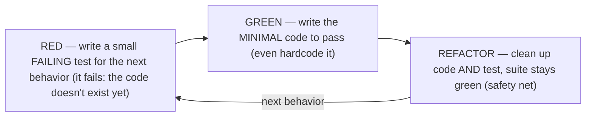
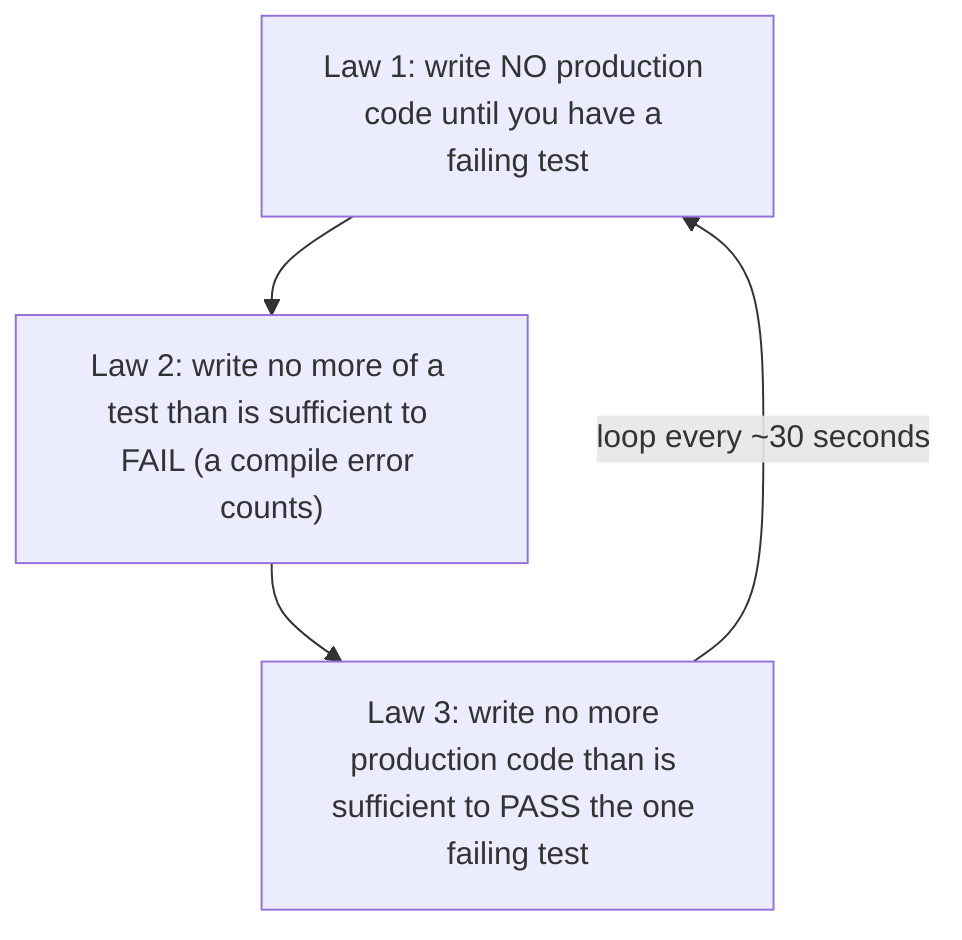
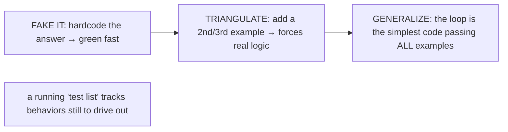
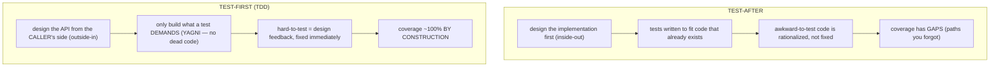
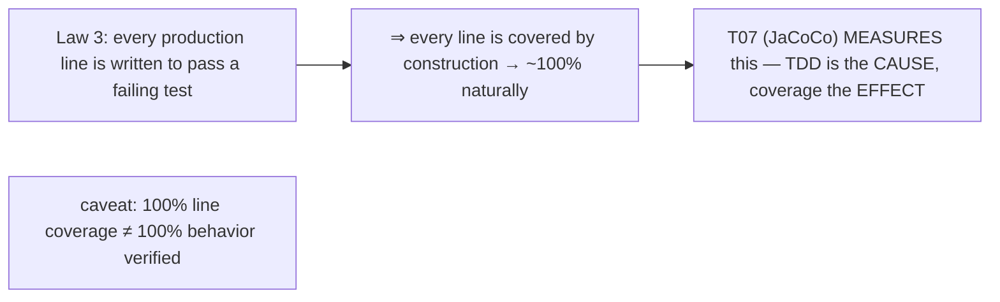
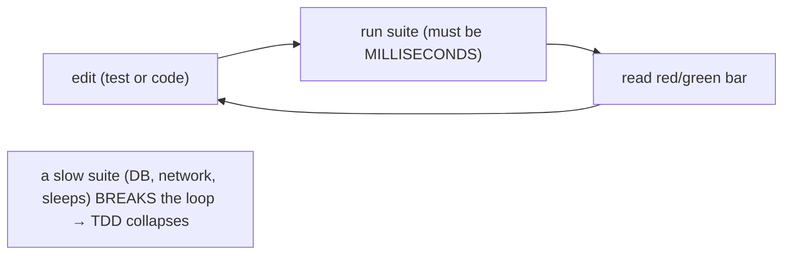
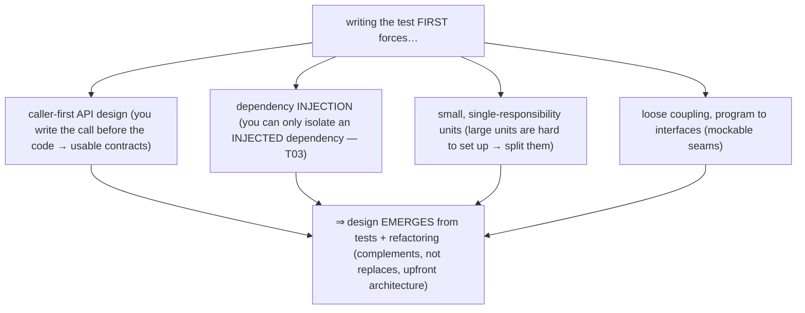
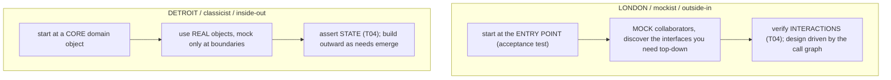
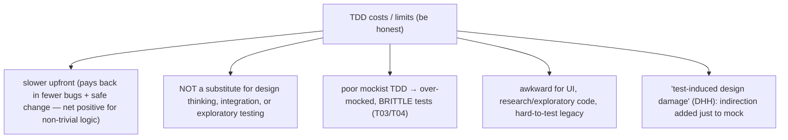
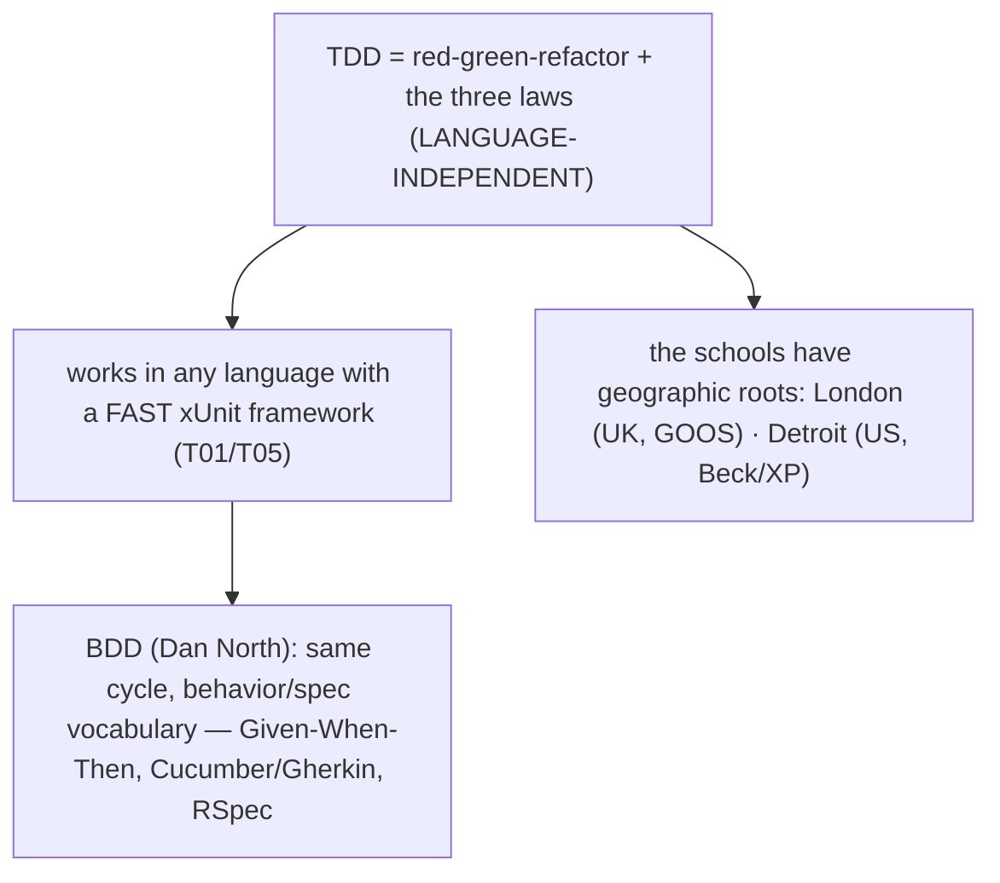

# Test-Driven Development (TDD)

T01–T05 covered the *tools* of testing — JUnit/TestNG, assertions, mocking, doubles. **Test-driven development is the *practice* that uses them**, and it inverts the order you would expect: you write the **test first**, watch it fail, then write just enough code to make it pass. TDD was popularized by Kent Beck (*Test-Driven Development: By Example*, 2002) out of Extreme Programming, and its discipline is a tight three-step loop — **red, green, refactor** — repeated in increments measured in *minutes*. The surprising claim, and the reason this topic is the conceptual capstone of the chapter, is that **TDD is primarily a design technique, not a testing technique**: writing the test first changes *how you design the code*, and the passing test suite is a side effect that happens to give you near-total coverage for free.

The depth bar is **why test-first produces better design** — not the mechanics of the loop (which take five minutes to learn) but the architectural force it applies. When you write the call before the implementation, you design the API from the *caller's* side; when you write only enough code to pass, you build only what is needed (YAGNI); when you can only test a unit in isolation, you are pushed toward dependency injection and small, focused units. So TDD operationalizes the "testability drives good design" theme from [T01](./T01-unit-testing-with-junit-5.md) into a continuous, per-minute feedback loop. We will walk a real cycle, state the three laws that keep the steps small, separate the honest costs from the hype (the "Is TDD Dead?" debate), and revisit the London/Detroit schools from [T03](./T03-mocking-with-mockito.md)/[T04](./T04-test-doubles-stub-mock-spy-fake.md) as two concrete TDD workflows.

> [!NOTE]
> Prerequisites: [JUnit 5](./T01-unit-testing-with-junit-5.md) (`L1/C03/T01`) — TDD is the practice built on the test lifecycle, FIRST principles, and the "tests enable refactoring / testability drives design" themes introduced there; [Assertions](./T02-assertions-assertj-hamcrest.md) (`L1/C03/T02`) — every red/green step is an assertion; [Mocking](./T03-mocking-with-mockito.md) (`L1/C03/T03`) and [Test doubles](./T04-test-doubles-stub-mock-spy-fake.md) (`L1/C03/T04`) — the London/Detroit schools become concrete TDD workflows here. Forward: [T07](./T07-test-coverage-jacoco.md) (coverage — which *measures* the high coverage TDD produces by construction).

## The Red–Green–Refactor Cycle

TDD is one short loop repeated endlessly. Each turn adds one small piece of behavior and leaves the code clean:



Each step has a distinct purpose. **Red** proves the test actually tests something — a test that passes the moment you write it tells you nothing (maybe the behavior already existed, maybe the assertion is wrong). Watching it fail *for the expected reason* validates the test itself. **Green** is about getting back to a working state as fast as possible — you are allowed to write *embarrassingly* simple code here, even hardcoding the answer, because the goal is a passing bar, not elegance. **Refactor** is where design happens: with a green suite as a safety net ([T01](./T01-unit-testing-with-junit-5.md) — tests enable fearless refactoring), you remove duplication and improve names and structure, *confident that the tests will catch any behavior change*. The discipline is to **stay in each state only briefly** — a full cycle is minutes or seconds, not hours.

## The Three Laws of TDD

Robert C. Martin ("Uncle Bob") sharpened the discipline into three laws that force the increments to stay tiny:



Taken literally, the laws lock you into a 30-second cycle: you cannot type a line of production code that is not demanded by a currently-failing test, and you cannot write a whole test before writing the code for its first failing assertion. This feels pedantic, and seasoned practitioners take larger steps when the implementation is obvious — but the laws describe the *limit* the discipline pulls toward, and the reason is that **small steps keep you always close to green**. When every increment is tiny, a newly-red bar points at the *last thing you did*, so debugging is near-instant; when you write fifty lines then run the tests, a failure could be anywhere.

## A Worked Cycle: Fake It, Then Triangulate

The cycle is best seen on a tiny kata — a string calculator that sums comma-separated numbers. Watch how each test *forces* the next bit of code:

```java
// RED #1 — the simplest case. Fails: add() doesn't exist yet.
@Test void emptyStringIsZero() { assertEquals(0, calc.add("")); }

// GREEN #1 — "fake it": hardcode the answer. Embarrassing, but green.
int add(String numbers) { return 0; }

// RED #2 — a single number. Fails: returns 0, expected 1.
@Test void singleNumber() { assertEquals(1, calc.add("1")); }

// GREEN #2 — now FORCED to generalize beyond the fake.
int add(String numbers) { return numbers.isEmpty() ? 0 : Integer.parseInt(numbers); }

// RED #3 — TRIANGULATE: a second data point forces the real logic.
@Test void twoNumbers() { assertEquals(3, calc.add("1,2")); }

// GREEN #3 — the split is now demanded by a test, not speculation.
int add(String numbers) {
    if (numbers.isEmpty()) return 0;
    int sum = 0;
    for (String n : numbers.split(",")) sum += Integer.parseInt(n);
    return sum;
}
// REFACTOR — with three green tests, simplify (e.g. streams) safely.
```

Two named strategies appear here. **"Fake it till you make it"** — return a hardcoded constant to get green, then let later tests drive out the real implementation — keeps you moving and confirms the test harness works. **Triangulation** — adding a second and third concrete example — *forces* generalization: with only `add("1") == 1` you could cheat with `return 1`, but `add("1,2") == 3` makes the loop the simplest thing that passes both. When the implementation is genuinely obvious, you skip the theatrics and just write it ("obvious implementation"); fake-it is the tool for when you are *unsure* how to proceed.



## Why Test-First Beats Test-After

Writing the test *first* is not a scheduling detail — it changes the design and the coverage. The contrast with the common "write code, then add tests" habit is stark:



Test-after tends to test *what the code does*; test-first specifies *what the code should do* before it exists. Three consequences follow. You **design from the caller's side**: writing `assertEquals(3, calc.add("1,2"))` before `add` exists means you choose the method's name, parameters, and return shape based on how it *reads at the call site*, not on what is convenient internally — this is outside-in, usability-first API design. You build **only what a test demands** (the YAGNI principle — "You Aren't Gonna Need It") — no speculative configuration knobs or unused branches, because nothing enters the production code unless a failing test required it. And awkwardness becomes **design feedback**: if a unit is hard to set up for a test, that difficulty is telling you the design is too coupled — and because you feel it *before* writing the implementation, you fix the design instead of working around it.

## Coverage by Construction

A direct corollary of law 3 (write no production code that is not demanded by a failing test) is that **every line of production code exists to satisfy some test**. Coverage is therefore not something you chase afterward — it falls out of the process:



This sets up the chapter's final topic. [T07](./T07-test-coverage-jacoco.md) introduces coverage *measurement* (JaCoCo) — but TDD is the practice that *produces* high coverage in the first place. The relationship matters: with test-after, you write code and then *measure* coverage and backfill the gaps (often grudgingly); with TDD, coverage is a *byproduct* you never have to think about. The important caveat — which T07 develops — is that **line coverage is not behavior coverage**: TDD gives you ~100% of lines executed *and* a meaningful assertion behind each, but a high coverage number alone (from any process) only proves lines *ran*, not that behavior was *verified*. TDD earns the number honestly; chasing the number without TDD can produce hollow tests.

## Mechanism — The Machinery of the Loop

TDD is a *practice*, so its "mechanism" is not bytes on the heap but the **machinery of the feedback loop** — and that machinery imposes one hard requirement. Each cycle is: edit the test or code, *run the suite*, read the red/green bar, repeat — dozens of times an hour. For that to be tolerable, **the tests must run in milliseconds**:



This is why TDD **reinforces the unit-test discipline** from earlier in the chapter rather than being independent of it. A test that hits a database or network ([T01](./T01-unit-testing-with-junit-5.md) — not a unit test) takes hundreds of milliseconds, so a TDD loop built on such tests would mean waiting minutes per cycle, and the practice collapses. TDD therefore *forces* you to keep collaborators out of the test — which means **mocking and dependency injection** ([T03](./T03-mocking-with-mockito.md)) and fast in-memory **fakes** ([T04](./T04-test-doubles-stub-mock-spy-fake.md)). It also assumes JUnit's **fresh-instance-per-test isolation** ([T01](./T01-unit-testing-with-junit-5.md)) — a TDD loop on TestNG's shared-instance default ([T05](./T05-testng-alternative.md)) risks state leaking between micro-steps and giving false reds/greens. The tooling that supports the loop — IDE run-on-save, `--watch`/continuous-test modes, the prominent red/green bar — exists precisely to shrink the edit→run→read cycle to seconds.

## Architecture — TDD Is a Design Technique

This is the deepest and most-missed point: **TDD's primary product is design, not tests**. Writing the test first exerts continuous pressure that shapes the architecture:



Each test you write first is a **design decision**. "Testability drives good design" appeared in [T01](./T01-unit-testing-with-junit-5.md) as an observation and in [T03](./T03-mocking-with-mockito.md) as the reason mocking forces DI; TDD turns it into a *continuous loop* — you feel every design problem the instant you try to write the next test, not weeks later in code review. If a class needs a live database to test, you inject a repository interface; if a method needs ten setup lines, it is doing too much and you split it; if you cannot name the test clearly, the behavior is not well-defined yet. The result is **emergent design**: the structure grows out of the tests and the refactor steps rather than being fully specified up front. This *complements* architecture rather than replacing it — you still need high-level design for the big shape (modules, boundaries, data flow), but the fine-grained class and method design *emerges* from the red-green-refactor rhythm. The phrase practitioners use is **"listen to your tests"**: when tests are hard to write, the code — not the test — is telling you something.

## The London and Detroit Schools as Workflows

The two schools introduced in [T03](./T03-mocking-with-mockito.md)/[T04](./T04-test-doubles-stub-mock-spy-fake.md) are, concretely, two *directions* of doing TDD — they differ in where you start and what doubles you use:



**London (mockist, outside-in)** — associated with *Growing Object-Oriented Software, Guided by Tests* (Freeman & Pryce, the "GOOS" book) — starts from the outside: write a failing acceptance test for the feature, then work inward, *mocking each collaborator you discover* and letting the mocks define the interfaces you will need. Design is driven top-down by the interactions. **Detroit (classicist, inside-out)** — Kent Beck's original style, from the Detroit/Chicago XP community — starts from the inside: pick a core domain object, build it with *real* objects and *state* assertions, and grow outward as the need for collaborators emerges, mocking only true boundaries (database, network). Both are genuine red-green-refactor TDD; they differ in **direction** (outside-in vs inside-out) and **doubles** (interaction-verifying mocks vs real objects with state assertions, [T04](./T04-test-doubles-stub-mock-spy-fake.md)). Most practitioners blend them — outside-in to discover structure, classicist within a unit to keep tests robust ([T04](./T04-test-doubles-stub-mock-spy-fake.md)'s warning that over-mocking yields brittle tests).

## The Costs and Criticisms

TDD is a discipline with real benefits *and* real costs, and selling it as a silver bullet does it a disservice. The honest ledger:



The famous critique is David Heinemeier Hansson's (DHH, creator of Rails) 2014 essay and the **"Is TDD Dead?"** debate that followed with Kent Beck and Martin Fowler. DHH argued that dogmatic TDD produces **"test-induced design damage"** — layers of indirection and abstraction introduced *solely* to make code unit-testable in isolation, harming the design it was supposed to improve — and that for many web apps, fast integration tests are more valuable than exhaustive isolated unit tests. The debate's resolution was nuanced and worth absorbing: TDD is **one valuable tool, not a religion**. It shines for well-understood logic with clear inputs and outputs (parsers, calculations, domain rules, algorithms); it is awkward for exploratory or research code (where you do not yet know the design), for UI, and for thin code that mostly wires frameworks together. The mature stance is to **apply TDD where it earns its keep and not treat it as a mandate** — and to watch for the specific failure mode of adding indirection just to satisfy a mock.

## Cross-Language Perspective

TDD is a **practice, not a tool**, so unlike a library it transfers across languages unchanged — Beck's *TDD by Example* even teaches it in both Java and Python:



Because the cycle only needs a fast test runner and an assertion, TDD is practiced identically with pytest, Jest, RSpec, Go's `testing`, Rust's `#[test]`, and so on — the discipline is the same; only the syntax of "write a failing test" changes. The notable evolution is **BDD (Behavior-Driven Development)**, introduced by Dan North as a reframing of TDD: same red-green-refactor loop, but the vocabulary shifts from "test" to "behavior/specification" and tests are written in a structured, often stakeholder-readable form — **Given-When-Then** (Cucumber/Gherkin in Java, RSpec in Ruby, SpecFlow in .NET). BDD's aim is to keep tests focused on *behavior and intent* rather than implementation, and to make the specification a shared artifact with non-developers; mechanically it is still TDD. The industry debates around TDD — its value, mockist-vs-classicist, BDD's role — are shared across all these ecosystems, because the *practice* is universal even though the *frameworks* differ ([T05](./T05-testng-alternative.md)).

## Common Mistakes

> [!WARNING]
> **Writing tests *after* the code and calling it TDD.** Test-after is a fine habit, but it is not TDD and it forfeits the main benefit — design feedback. It also tends to miss paths (you test what you built, not what you should have built), so the coverage is lower and the tests fit the implementation rather than specifying behavior.

> [!WARNING]
> **Skipping the refactor step.** Green is not the finish line. If you stop at green every cycle, duplication and poor structure accumulate until the code is unmaintainable — and the green suite that would have made cleanup *safe* goes unused. The refactor step is where TDD's design payoff is actually collected.

> [!WARNING]
> **Taking steps that are too big.** Writing a whole class then its tests (or fifty lines per cycle) violates the three laws and discards TDD's fast-feedback advantage: when the bar goes red, the cause could be anywhere. Take smaller steps — a newly-red bar should point at the last thing you typed.

> [!WARNING]
> **Testing implementation instead of behavior.** Tests coupled to *how* the code works (private methods, exact call sequences, over-mocking — [T03](./T03-mocking-with-mockito.md)/[T04](./T04-test-doubles-stub-mock-spy-fake.md)) break on every refactor, defeating the safety net. Drive out *behavior* (observable inputs/outputs) so the tests survive refactoring — which is the whole point of having them.

> [!WARNING]
> **Treating TDD as a religion (or confusing coverage with quality).** TDD is a tool that fits some problems (well-understood logic) better than others (UI, exploratory/research code); applying it dogmatically invites "test-induced design damage." And ~100% coverage from TDD ([T07](./T07-test-coverage-jacoco.md)) proves lines *ran* with an assertion behind them — not that every behavior and edge case was considered. Use judgment, not dogma.

## Practice

> [!INTERVIEW]
> Common interview questions for this topic:
> 1. **What is TDD?** A practice of writing a failing test *before* the production code, then writing the minimal code to pass and refactoring — the red-green-refactor cycle (Kent Beck).
> 2. **Describe the red-green-refactor cycle.** Red: write a small failing test. Green: write the minimal code to pass. Refactor: clean up code and test with the green suite as a safety net. Repeat in minutes.
> 3. **What are the three laws of TDD?** No production code without a failing test; write no more test than is sufficient to fail; write no more production code than is sufficient to pass — forcing tiny increments.
> 4. **Why write the test first — what's the benefit over test-after?** You design the API from the caller's side, build only what a test demands (YAGNI), get design feedback immediately, and earn ~100% coverage by construction.
> 5. **Why is TDD called a "design technique"?** Writing the test first forces caller-first APIs, dependency injection, and small single-responsibility units — design emerges from the tests; "testability drives design" as a continuous loop.
> 6. **What is "fake it till you make it" and triangulation?** Fake it: hardcode the answer to get green fast. Triangulate: add more examples that force the real implementation (the simplest code passing all of them).
> 7. **What's the role of the refactor step?** To improve structure and remove duplication *safely*, using the green suite as a net; skipping it lets cruft accumulate and wastes the safety the tests provide.
> 8. **Why must TDD's tests be fast?** The loop runs dozens of times an hour; slow tests (DB/network) break the rhythm — so TDD reinforces unit isolation, mocking/DI, and fast fakes.
> 9. **What are the London and Detroit schools?** London (mockist, outside-in): start at the entry point, mock collaborators, verify interactions. Detroit (classicist, inside-out): start at a core object, use real objects, assert state.
> 10. **What does TDD give you regarding coverage?** High coverage by construction — every production line exists to pass a test — which T07 then *measures*; but line coverage isn't behavior coverage.
> 11. **What are TDD's costs and criticisms?** Slower upfront; not a substitute for design/integration/exploratory testing; can cause over-mocked brittle tests or "test-induced design damage" (DHH); awkward for UI/research code.
> 12. **What was the "Is TDD Dead?" debate?** DHH vs Beck vs Fowler (2014): DHH argued TDD harms design and is overhyped; the resolution — TDD is one valuable tool, not dogma; apply it where it helps.
> 13. **How does TDD relate to BDD?** BDD (Dan North) is TDD reframed around behavior/specification — same red-green-refactor, Given-When-Then vocabulary (Cucumber/RSpec), stakeholder-readable specs.

1. **Walk the cycle.** TDD a `FizzBuzz` or string-calculator kata one assertion at a time; for each step, name which of red/green/refactor you are in.

2. **Obey the three laws.** Force yourself to take 30-second steps on a small function: failing test → minimal pass → repeat. Notice how a red bar always points at your last change.

3. **Fake it.** Get a test green by hardcoding the expected return value, then write a second test that *forces* you to generalize.

4. **Triangulate.** Add a third example and show that the only code passing all three is the real, general implementation (not a cheat).

5. **Refactor under green.** With three green tests, rewrite the implementation (e.g. loop → stream) and confirm the suite stays green — the safety net in action.

6. **Test-first an API.** Before writing any code, write the test you *wish* you could — choose the method name and signature from the call site. Then implement it.

7. **Feel the design pressure.** Try to TDD a method that news up a dependency internally; observe that you cannot isolate it, then refactor to inject the dependency ([T03](./T03-mocking-with-mockito.md)).

8. **London style.** TDD a small feature outside-in: start with an entry-point test, mock the collaborators, and let the mocks define the interfaces.

9. **Detroit style.** TDD the *same* feature inside-out with real objects and state assertions; compare the resulting tests' robustness ([T04](./T04-test-doubles-stub-mock-spy-fake.md)).

10. **Coverage by construction.** After TDD-ing a class, run a coverage tool ([T07](./T07-test-coverage-jacoco.md)) and observe it is already near 100% without any backfilling.

11. **A test list.** Before coding, jot the behaviors to test (empty, single, many, invalid); work the list one item per cycle, adding new items as you discover them.

12. **YAGNI.** Catch yourself about to add an unused parameter or config flag; confirm no failing test demands it, and don't write it.

13. **When TDD doesn't fit.** Name a task where TDD is awkward (exploratory data analysis, a UI layout) and explain why; describe what you'd do instead.

14. **BDD reframing.** Rewrite one of your tests in Given-When-Then form; note how the vocabulary shifts from "test" to "behavior."

15. **End-to-end explain-it-back.** In twelve sentences or fewer: (a) the red-green-refactor cycle and the three laws; (b) why test-first improves *design* (caller-first API, YAGNI, DI, small units); (c) coverage by construction and why line coverage isn't behavior coverage; (d) the London vs Detroit workflows; (e) one honest cost of TDD and when not to use it.

## Recap

You should now be able to:

**Language layer.**

- Run the **red-green-refactor** cycle and obey the **three laws** — write a failing test, the minimal code to pass, then refactor under a green suite, in minute-scale increments.
- Apply the **fake-it-till-you-make-it** and **triangulation** strategies (and "obvious implementation" when the code is trivial), driven from a running **test list**.

**Memory / mechanism layer.**

- Explain that TDD is a *practice* whose machinery is the tight edit→run→read loop, which **requires millisecond-fast tests** — so TDD reinforces unit isolation, mocking/DI ([T03](./T03-mocking-with-mockito.md)), fast fakes ([T04](./T04-test-doubles-stub-mock-spy-fake.md)), and JUnit's fresh-instance isolation ([T01](./T01-unit-testing-with-junit-5.md)), supported by run-on-save/red-green tooling.

**Architecture layer.**

- Explain **why TDD is primarily a design technique**: test-first forces caller-first API design, dependency injection, and small single-responsibility units, so design **emerges** from tests + refactoring (complementing upfront architecture) — operationalizing "testability drives design."
- Describe **coverage by construction** (every line exists to pass a test → ~100% naturally, which [T07](./T07-test-coverage-jacoco.md) measures) and the caveat that line coverage ≠ behavior coverage.
- Contrast the **London (mockist, outside-in)** and **Detroit (classicist, inside-out)** schools as two concrete TDD workflows ([T03](./T03-mocking-with-mockito.md)/[T04](./T04-test-doubles-stub-mock-spy-fake.md)).
- State TDD's honest **costs and criticisms** (the "Is TDD Dead?" debate, "test-induced design damage") and when *not* to use it — and place TDD as a language-independent practice with **BDD** as its behavior-focused reframing.

The chapter's final topic measures what TDD produces. [T07](./T07-test-coverage-jacoco.md) — test coverage with JaCoCo — covers how coverage is instrumented and reported, the difference between line and branch coverage, and why a coverage number is a useful signal but a dangerous *target* (Goodhart's law) — the measurement counterpart to the discipline you just learned.

## Next

Continue to [Test coverage (JaCoCo)](./T07-test-coverage-jacoco.md) — the chapter's closing topic, which *measures* the high coverage that TDD produces by construction. It covers how a coverage tool like **JaCoCo** instruments bytecode to record which lines and branches executed, the distinction between **line, branch, and instruction coverage**, how coverage is reported and gated in CI, and — most importantly — why coverage is a good *signal* but a bad *target*: chasing 100% (Goodhart's law) produces hollow tests that execute lines without verifying behavior. It closes the loop with this topic — TDD earns coverage honestly as a byproduct of driving every line from a test, whereas coverage-as-a-mandate without TDD invites gaming — completing **C03 — Testing Fundamentals** and, with it, **L1 — Core Java & OOP**.
