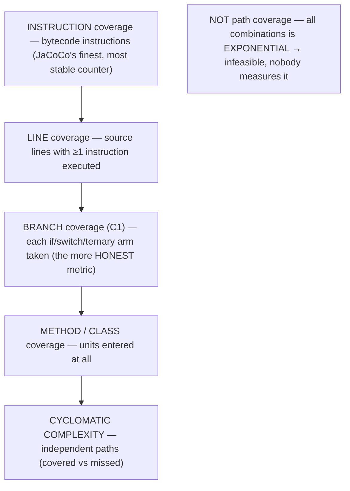
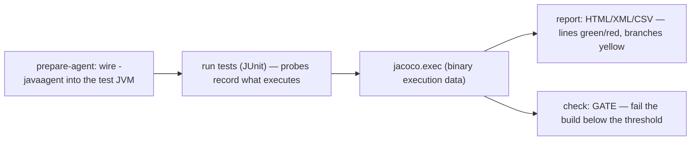
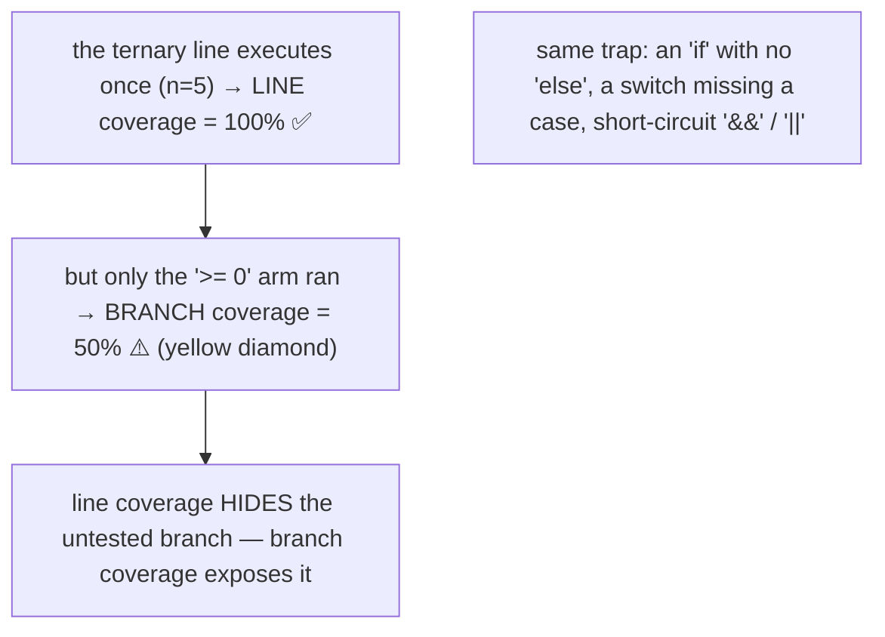
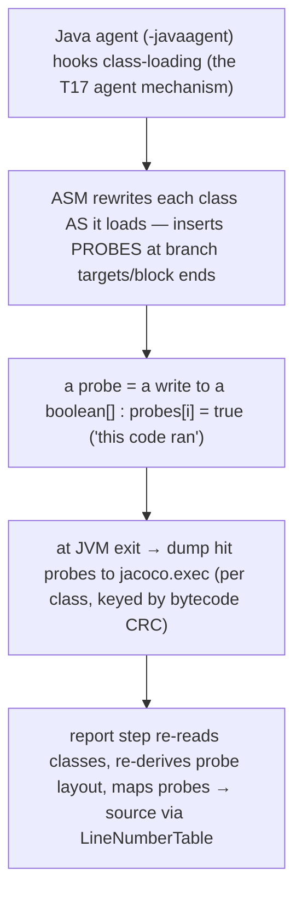
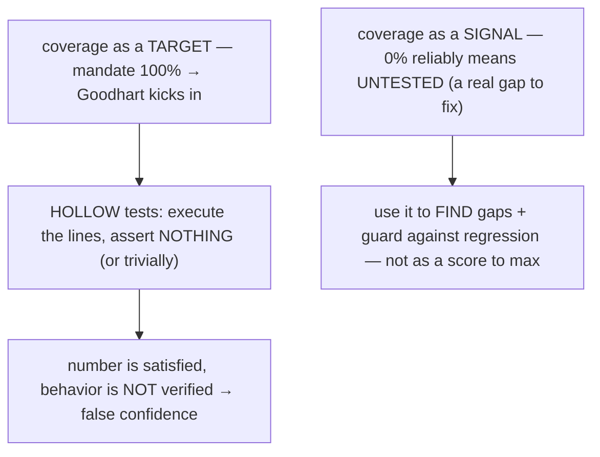
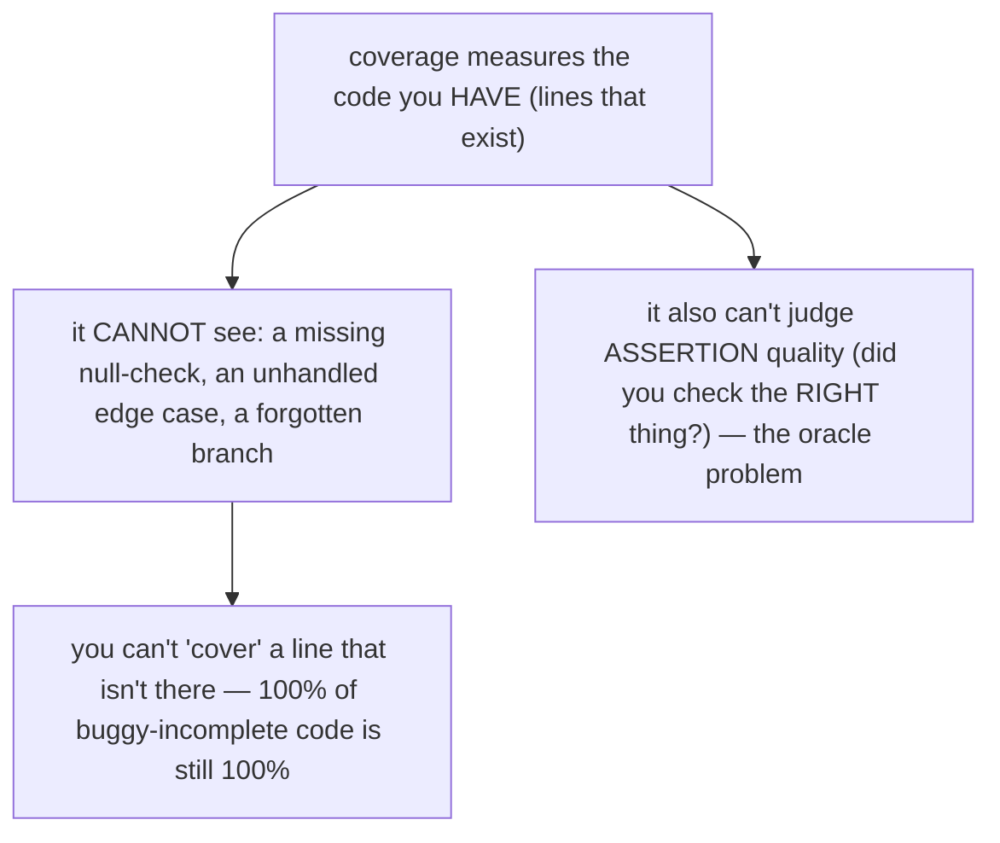
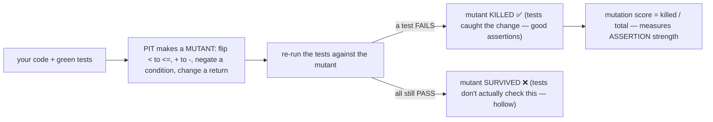
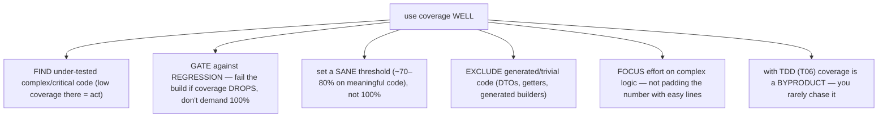
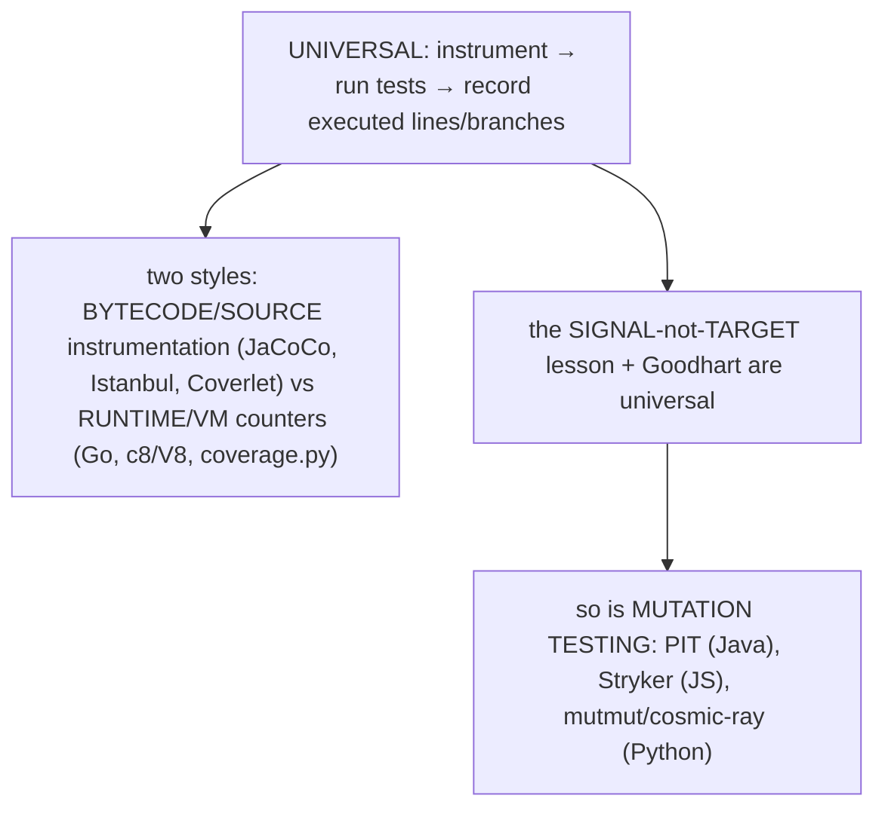
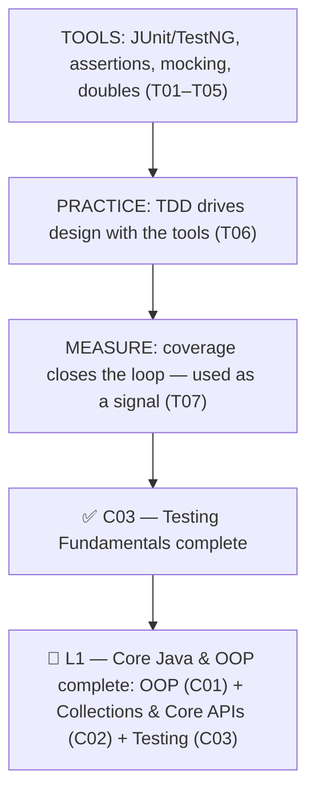

# Test coverage (JaCoCo)

T06 showed that test-driven development produces high coverage *by construction*; this final topic of the chapter covers the tool that **measures** it — and, more importantly, how to read that measurement without being fooled by it. **Code coverage** is the percentage of your production code that the test suite actually executes, and **JaCoCo** (Java Code Coverage) is the de-facto standard tool for computing it on the JVM. Run your tests through JaCoCo and you get a report that colours every line green (executed), red (never executed), or yellow (a branch only partly taken) — an immediate map of what your tests touch and what they miss. Coverage is one of the most useful and most *misused* metrics in software: invaluable for finding code that is definitely untested, dangerous the moment it becomes a target to hit.

The depth bar has two halves. First, **the mechanism** — JaCoCo does not parse your source; it **instruments bytecode**, attaching to the test JVM as a Java agent and using the same ASM bytecode-engineering machinery that powers Mockito ([T03](./T03-mocking-with-mockito.md)) and Java agents ([T17](../C02-collections-and-core-apis/T17-reflection.md)) to insert tiny *probes* that record which code ran. Second, **the judgment** — coverage is a **signal, not a target**. A high number is necessary but nowhere near sufficient: tests can execute every line while asserting nothing, so 0% reliably means "untested" but 100% does *not* mean "well tested." We will see why branch coverage is more honest than line coverage, why **mutation testing** is the stronger check that coverage can never be, and why Goodhart's Law makes a coverage *mandate* counterproductive. As the closing topic of L1, its recap ties the whole testing chapter — and the level — together.

> [!NOTE]
> Prerequisites: [TDD](./T06-test-driven-development-tdd.md) (`L1/C03/T06`) — coverage *measures* what TDD produces by construction; the two are cause and effect. [JUnit 5](./T01-unit-testing-with-junit-5.md) (`L1/C03/T01`) — coverage is gathered while the test suite runs. [Mocking](./T03-mocking-with-mockito.md) (`L1/C03/T03`) and [Reflection](../C02-collections-and-core-apis/T17-reflection.md) (`L1/C02/T17`) — JaCoCo's bytecode-instrumentation-via-agent is the same machinery behind Mockito's mock generation and Java agents. This is the **final topic of C03 and of L1** — its recap closes the chapter and the level.

## What Coverage Measures

"Coverage" is not one number but a family of metrics at different granularities. JaCoCo computes several **counters** from a single run, each answering "what fraction of *these units* did the tests execute?":



The key distinctions: **instruction coverage** is JaCoCo's base unit because it works directly on bytecode and is immune to formatting (it does not care how many statements you put on a line). **Line coverage** is the most quoted number but the most misleading (below). **Branch coverage** — also called decision or C1 coverage — counts whether each *arm* of every `if`, `switch`, and ternary was taken, and is the honest workhorse. **Method** and **class** coverage are coarse "did we touch it at all" gauges. **Path coverage** (every *combination* of branches) is deliberately absent everywhere: the number of paths grows exponentially with branches, so it is infeasible to measure or achieve — which is exactly why branch coverage, not path coverage, is the practical ceiling.

## Running JaCoCo

JaCoCo plugs into the build. In Maven, the `jacoco-maven-plugin` wires its agent into the test JVM and then generates the report:

```xml
<plugin>
  <groupId>org.jacoco</groupId>
  <artifactId>jacoco-maven-plugin</artifactId>
  <executions>
    <execution><goals><goal>prepare-agent</goal></goals></execution>     <!-- attaches -javaagent to the test JVM -->
    <execution><id>report</id><phase>test</phase>
      <goals><goal>report</goal></goals></execution>                     <!-- .exec → HTML/XML/CSV -->
    <execution><id>check</id><goals><goal>check</goal></goals>           <!-- the COVERAGE GATE -->
      <configuration><rules><rule><limits><limit>
        <counter>BRANCH</counter><value>COVEREDRATIO</value><minimum>0.80</minimum>
      </limit></limits></rule></rules></configuration></execution>
  </executions>
</plugin>
```



The `prepare-agent` goal is the crucial one — it adds JaCoCo's `-javaagent` to the JVM that runs the tests, so coverage is collected as a side effect of the normal test run. The HTML report renders your source with **green** backgrounds for executed lines, **red** for never-executed lines, and **yellow** diamonds for lines whose branches were only *partly* covered (some arms taken, some not) — so you can see at a glance not just *which* lines ran but *which decisions* went untested. The `check` goal turns coverage into a **gate**: configure a minimum (here 80% branch coverage) and the build fails below it. Gradle's `jacoco` plugin offers the same `jacocoTestReport` and `jacocoTestCoverageVerification` tasks.

## Line vs Branch Coverage

The single most important reading skill is knowing that **line coverage overstates how well-tested code is**. A line can be fully green while a decision on it was never exercised:

```java
String sign(int n) {
    return n >= 0 ? "non-negative" : "negative";   // ONE line, TWO branches
}

@Test void positive() { assertEquals("non-negative", sign(5)); }
// → 100% LINE coverage (the line ran) but 50% BRANCH coverage (the ': negative' arm never ran)
```



The single test reports 100% line coverage, which sounds complete, yet the entire negative-number behavior is untested — a real bug there (say returning the wrong string) would ship unnoticed. **Branch coverage** catches this: it reports 50% and JaCoCo paints a yellow diamond on the line, flagging the missed arm. The same trap appears with an `if` that has no `else` (the "skip" path is invisible to line coverage), a `switch` missing a case, and short-circuit `&&`/`||` (the right operand may never evaluate). The rule: **read branch coverage, not line coverage, when judging whether logic is tested** — and treat a high line number with a lower branch number as a warning that your tests walk the happy path and skip the alternatives.

## Mechanism — Bytecode Probes

JaCoCo never looks at your `.java` source while measuring; it works on **bytecode**, which is why it is accurate to what actually executed and works for any JVM language (Kotlin, Scala, Groovy). The mechanism is **instrumentation by inserting probes**:



The flow: JaCoCo's agent registers a **class-file transformer** (the same hook Java agents and instrumentation APIs use — [T17](../C02-collections-and-core-apis/T17-reflection.md)), and as each class loads it uses **ASM** — a bytecode-manipulation library — to weave in **probes**. A probe is the cheapest possible recorder: a write of `true` into a per-class `boolean[]`, placed at each branch target and block boundary so that the set of hit probes determines which lines and branches executed. Because it records only *executed-or-not* (a boolean), not hit *counts*, the runtime overhead is small. At JVM exit the hit probes are serialized to a binary **`.exec`** file (each class identified by a CRC of its bytecode), and the separate **report** step re-reads the original class files, re-derives where the probes were, and maps them back to source lines and branches using the class's **`LineNumberTable`** and `SourceFile` debug attributes (the same debug metadata that powers stack traces and debuggers).

The architectural point worth carrying away: **a coverage tool is an application of bytecode instrumentation** — the exact machinery you met as Mockito generating mock subclasses at runtime ([T03](./T03-mocking-with-mockito.md), via Byte Buddy/ASM) and as Java agents transforming classes ([T17](../C02-collections-and-core-apis/T17-reflection.md)). JaCoCo also supports **offline instrumentation** (rewriting `.class` files ahead of time) for environments where attaching an agent is impossible, but on-the-fly via the agent is the default.

## Architecture — Signal, Not Target

Coverage's deepest lesson is about *how you use the number*, and it is captured by **Goodhart's Law**: *"When a measure becomes a target, it ceases to be a good measure."* Coverage is an excellent diagnostic signal and a corrosive target:



The asymmetry is the key insight. **Low coverage is a reliable bad sign**: if a method shows 0%, no test exercises it, full stop — that is a genuine, actionable gap. **High coverage is necessary but not sufficient**: a test can call a method, walk every line, and assert *nothing* — coverage rises to 100% while the test verifies no behavior at all. A test like `@Test void run() { service.process(input); }` with no assertion is the canonical *hollow test*: green coverage, zero value. When an organization makes "100% coverage" a *mandate*, Goodhart's Law predicts exactly what happens — developers write hollow tests and test trivial getters to hit the number, the metric turns green, and the goal (catching bugs) is not served. So coverage answers "what is *definitely* untested?" (trustworthy) but never "what is *well* tested?" (it cannot). Use it to find and close gaps and to **gate against regression** (don't let coverage *drop*), not as a score to maximize.

## What Coverage Cannot See

Beyond the assertion-quality blind spot, coverage has a more fundamental limit: **it can only measure the code you wrote, not the code you should have written**.



If your code is missing a null check, an overflow guard ([T20](../C02-collections-and-core-apis/T20-math-bigdecimal-biginteger-random.md)), or a case for empty input, there are *no lines* for those situations — so coverage cannot flag their absence, and a fully-covered file can still be riddled with the bugs it forgot to handle. Coverage also says nothing about whether your assertions check the *right* thing (the "oracle problem" — a test can assert a wrong-but-consistent value). This is why coverage is a *floor*, not a *ceiling*, on test quality: it tells you the obvious gaps in the code that exists, and you still need thinking — edge-case analysis, property-based testing, exploratory testing — for the cases your code never considered.

## Mutation Testing — Testing the Tests

The stronger answer to "are my tests actually any good?" is **mutation testing**, which measures something coverage structurally cannot: whether your tests would *catch a bug*. **PIT (pitest)** is the standard Java tool:



PIT systematically introduces small faults — a *mutant* per change: flipping `<` to `<=`, `+` to `-`, negating a conditional, replacing a return value, removing a method call. For each mutant it re-runs the tests. If a test **fails**, the mutant is **killed** — your tests genuinely assert that behavior, which is exactly what you want. If all tests still **pass**, the mutant **survived** — your tests execute that code (coverage is happy) but do not actually *check* its result, exposing a hollow test that coverage rated as fine. The **mutation score** (killed ÷ total) therefore measures *assertion strength*, the dimension coverage is blind to — it is, literally, a test of your tests. It costs more (it re-runs the suite per mutant, though it uses coverage data to run only the tests that touch each mutated line), so it is typically run less often than coverage, but it is the rigorous answer to "is this 90%-covered code actually well tested?"

## Using Coverage Well

Putting the judgment together, the pragmatic stance is to treat coverage as a tool for finding weak spots and preventing backsliding — never as a score to chase:



Concretely: point coverage at your **complex, critical** code (a 40% branch number on a pricing engine is a real problem; a 40% number on plain DTOs is noise), and **exclude** generated and trivial code so the metric reflects logic that matters. Set a **sane threshold** — 70–80% branch coverage on meaningful code is healthy; insisting on 100% invites the hollow-test gaming Goodhart warns about. Use the gate primarily to **prevent regression** (don't let a PR lower coverage) rather than to enforce a high absolute target. And the tie-back to T06: when you practice **TDD**, coverage is a *byproduct* you almost never have to think about, because every production line was written to satisfy a failing test that asserts behavior — so the lines are not merely *executed* but genuinely *checked*. TDD earns coverage honestly; coverage-as-a-mandate *without* TDD is what produces the gaming. Coverage is best as a *conversation-starter about gaps*, not a *number on a dashboard to turn green*.

## Cross-Language Perspective

Coverage tooling is **universal**, and every tool works the same way in principle — instrument the code, run the tests, record which lines and branches executed — differing mainly in *how* they instrument:

| Language | Standard tool(s) | Instrumentation style |
|---|---|---|
| **Java/JVM** | **JaCoCo** (+ Cobertura, Clover) | bytecode probes via Java agent |
| **JavaScript** | **Istanbul/nyc**, **c8** | source transform (Istanbul) / V8 built-in (c8) |
| **Python** | **coverage.py** (+ pytest-cov) | sys.settrace runtime hook |
| **C#/.NET** | **Coverlet**, dotCover | IL (bytecode) instrumentation |
| **Go** | **`go test -cover`** (built-in) | source rewrite by the toolchain |
| **Ruby / Rust** | SimpleCov / llvm-cov, tarpaulin | runtime hook / LLVM source-based |



Two patterns echo earlier topics. First, the **library-vs-toolchain split** from [T01](./T01-unit-testing-with-junit-5.md): Java bolts coverage on via a plugin/agent, whereas **Go builds coverage into the toolchain** (`go test -cover`) just as it builds in the test framework — coverage is a first-class command, not an add-on. Second, the **signal-not-target** lesson and **Goodhart's Law** are language-independent truths about metrics, and so is the **mutation-testing** answer to them — PIT for Java, **Stryker** for JavaScript, **mutmut**/cosmic-ray for Python all do the same "mutate the code and see if a test dies" check. Coverage, and its wise use, look the same everywhere.

## Common Mistakes

> [!WARNING]
> **Treating 100% coverage as the goal.** Goodhart's Law guarantees the result: developers write hollow tests and cover trivial getters to hit the number, so the metric turns green while bug-catching does not improve. Coverage is a signal for finding gaps, not a target to maximize — chase *meaningful tests*, not the percentage.

> [!WARNING]
> **Writing tests with no assertions to raise coverage.** A test that calls a method but asserts nothing executes the lines (coverage rises) while verifying no behavior at all. Coverage cannot tell this apart from a real test — only you (or mutation testing) can. Every test needs a meaningful assertion ([T02](./T02-assertions-assertj-hamcrest.md)).

> [!WARNING]
> **Trusting line coverage over branch coverage.** A line with a ternary, an `if` without an `else`, or a `switch` missing a case can show 100% line coverage while half its branches never run. Read **branch** coverage when judging whether logic is actually tested.

> [!WARNING]
> **Believing high coverage means well-tested.** Coverage measures the code you *have*, not the cases you forgot (a missing null-check has no line to cover), nor whether your assertions check the right thing. High coverage is necessary, not sufficient — use edge-case analysis and mutation testing for what coverage cannot see.

> [!WARNING]
> **Padding the number with trivial code, or letting coverage silently rot.** Covering DTOs and getters to inflate the percentage while complex logic stays untested is worse than useless — it hides the real risk. Exclude generated/trivial code, focus on critical logic, and gate against *regression* so coverage can't quietly drop.

## Practice

> [!INTERVIEW]
> Common interview questions for this topic:
> 1. **What is code coverage?** The percentage of production code executed by the test suite — a measure of what the tests touch, reported at line/branch/instruction/method granularity.
> 2. **What is JaCoCo and how do you use it?** The standard JVM coverage tool; a Maven/Gradle plugin attaches its agent to the test JVM, records execution, and produces an HTML/XML report with red/green/yellow highlighting.
> 3. **Line vs branch coverage — which is more meaningful and why?** Branch (C1): line coverage can be 100% while a branch (e.g. a ternary's else, an if with no else) never runs, so branch coverage is the more honest signal.
> 4. **How does JaCoCo measure coverage mechanically?** It instruments bytecode via a Java agent (ASM), inserting boolean probes at branch targets; hit probes are dumped to a `.exec` file and mapped back to source via the LineNumberTable.
> 5. **Why does JaCoCo work on bytecode rather than source?** Accuracy to what actually executed, low overhead (a boolean write), and it works for any JVM language (Kotlin/Scala) without source at runtime.
> 6. **Why is coverage a signal but not a target?** Goodhart's Law — making 100% a target produces hollow tests that execute lines without asserting; coverage shows what's *definitely untested*, not what's *well tested*.
> 7. **Can you have 100% coverage and still have bugs?** Yes — tests with no/weak assertions, missing edge cases the code has no lines for, and wrong assertions all pass with full coverage.
> 8. **What is mutation testing and how does it differ from coverage?** It mutates the code (e.g. `<`→`<=`) and checks whether a test fails (kills the mutant); it measures *assertion strength*, the thing coverage is blind to.
> 9. **What's a sensible coverage target?** A sane threshold (~70–80% branch on meaningful code), excluding trivial/generated code, used mainly to prevent regression — not a 100% mandate.
> 10. **What is a coverage gate?** A build rule (JaCoCo `check`) that fails the build below a threshold or if coverage drops — best used to guard against regression.
> 11. **How does coverage relate to TDD?** TDD produces high coverage by construction (every line is driven by an asserting test), so with TDD coverage is an honest byproduct rather than something you chase.
> 12. **Why isn't path coverage measured?** The number of paths grows exponentially with branches, making it infeasible — branch coverage is the practical ceiling.
> 13. **How does coverage tooling compare across languages?** Universal and similar: JaCoCo (Java), Istanbul/c8 (JS), coverage.py (Python), Coverlet (.NET), built-in `go test -cover` (Go) — bytecode/source instrumentation vs runtime counters.

1. **Add JaCoCo.** Wire the Maven or Gradle plugin into a project, run the tests, and open the HTML report.

2. **Read the colours.** Find green, red, and yellow-diamond lines in the report and explain what each means.

3. **Line vs branch.** Write a method with a ternary or `if`/no-`else`; test only the happy path and confirm 100% line but ~50% branch coverage.

4. **The Goodhart demo.** Write a test that calls a method with **no assertion**; watch coverage rise while the test verifies nothing.

5. **Coverage gate.** Configure a branch-coverage minimum with JaCoCo `check` and make the build fail below it.

6. **Exclude trivial code.** Configure exclusions for generated classes/DTOs and see the percentage reflect real logic.

7. **Find the gap.** Sort the report by coverage, find the least-covered *complex* method, and add a meaningful test for it.

8. **Inspect the mechanism.** Locate the `jacoco.exec` file and explain the agent → ASM probe → `.exec` → LineNumberTable-mapping pipeline.

9. **Mutation testing.** Add PIT to the project, run it, and find a *surviving* mutant — a place where coverage is green but no assertion catches the change.

10. **Kill a mutant.** Add an assertion that kills that surviving mutant; rerun PIT and confirm the mutation score rose.

11. **Sane threshold.** Argue for a specific coverage target for a given module and justify why 100% is the wrong goal.

12. **TDD tie-in.** TDD a small class ([T06](./T06-test-driven-development-tdd.md)), then run coverage and observe it is already near 100% without any backfilling.

13. **What coverage can't see.** Take a fully-covered method missing a null-check; show that coverage stays 100% even though the bug is real.

14. **Cross-language.** Run `go test -cover` or Python `coverage.py` on a small program and compare the workflow with JaCoCo's.

15. **End-to-end explain-it-back.** In twelve sentences or fewer: (a) what line/branch/instruction coverage measure; (b) how JaCoCo instruments bytecode with probes; (c) why line coverage overstates and branch is honest; (d) why coverage is a signal not a target (Goodhart, hollow tests); (e) what mutation testing adds; (f) how TDD makes coverage an honest byproduct.

## Recap

You should now be able to:

**Language layer.**

- Define **code coverage** and JaCoCo's counters — **instruction, line, branch (C1), method, class, complexity** — and explain why **branch coverage is more honest than line coverage** (a 100%-line ternary or `if`/no-`else` can leave a branch untested) and why **path coverage** is infeasible.
- Run JaCoCo via the Maven/Gradle plugin, read the **red/green/yellow** HTML report, and configure a **coverage gate** (`check`).

**Memory / mechanism layer.**

- Explain that JaCoCo **instruments bytecode**, not source — a **Java agent** uses **ASM** to insert boolean **probes** at branch targets, which write to a per-class `boolean[]`, are dumped to a binary **`.exec`** file, and are mapped back to source lines via the **`LineNumberTable`** — the *same* bytecode-engineering machinery behind Mockito's mocks ([T03](./T03-mocking-with-mockito.md)) and Java agents ([T17](../C02-collections-and-core-apis/T17-reflection.md)), which is why a coverage tool is just an application of instrumentation.

**Architecture layer.**

- Explain why coverage is a **signal, not a target** — **Goodhart's Law**: 0% reliably means untested (a real gap), but 100% does not mean well-tested (hollow, assertion-free tests reach it), so use coverage to find gaps and guard against regression, not as a score to max.
- State what coverage **cannot see** — assertion quality and cases the code has no lines for — and why **mutation testing** (PIT — mutate the code, see if a test dies) is the stronger check of *assertion strength*.
- Use coverage **well** — sane threshold (~70–80% on meaningful code), exclude trivial/generated code, focus on complex logic, gate against regression — and explain how **TDD makes high coverage an honest byproduct** rather than a number to chase.
- Recognize coverage tooling as **universal** (Istanbul/c8, coverage.py, Coverlet, built-in `go test -cover`) with the same signal-not-target lesson and mutation-testing answer everywhere.

This completes **C03 — Testing Fundamentals**: the chapter moved from the *tools* of testing — JUnit 5 ([T01](./T01-unit-testing-with-junit-5.md)), assertions ([T02](./T02-assertions-assertj-hamcrest.md)), mocking ([T03](./T03-mocking-with-mockito.md)), test doubles ([T04](./T04-test-doubles-stub-mock-spy-fake.md)), and TestNG ([T05](./T05-testng-alternative.md)) — through the *practice* that drives design with them, TDD ([T06](./T06-test-driven-development-tdd.md)), to the *measurement* that closes the loop, coverage (this topic). Tools, practice, measurement — the complete picture of how professional Java is verified.

## The Road Ahead — L1 Complete



With this topic, **L1 — Core Java & OOP is complete**. Across three chapters you have built the full working vocabulary of a professional Java developer: the **object-oriented model** (C01 — classes, inheritance, interfaces, records, sealed types, modules, immutability), the **collections framework and core libraries** (C02 — lists/sets/maps and their performance, generics, exceptions, I/O and NIO.2, `java.time`, regex, reflection, annotations, `Optional`, numerics, serialization, networking, i18n), and the **testing discipline** (C03 — unit testing, assertions, mocking, doubles, TestNG, TDD, and coverage) that keeps all of it correct as it grows. You can now write idiomatic Java, reason about how it behaves down to bytes and bytecode, and verify it with confidence. The next level builds on this foundation — moving from writing correct Java to writing *concurrent, performant, production-grade* Java — but the language, libraries, and testing fluency assembled here are the bedrock everything above stands on.
