# Build, Dependencies & Project Tooling

The [L0 toolchain reference](../../L0-foundations/C03-tools-and-environment/T01-toolchain-quick-reference.md) took you as far as `javac`, `java`, the classpath, and a single-directory project — and deliberately stopped at *"once you have ≥ 1 third-party JAR, switch to a build tool."* This chapter is that switch. By L1 you are no longer compiling one file: you have a multi-package object model (C01), you pull in libraries, and — from the moment you wrote your first JUnit test (C03) — you depend on artifacts you did not write. **JUnit, Mockito, AssertJ, and JaCoCo are not in the JDK**; something has to fetch them, put them on the classpath for the right phase, run the tests, and report coverage. That something is a *build tool*, and learning to drive it is the single biggest productivity step at this level.

This is a reference for the **working developer's project workflow** at L1: how dependencies are named, found, downloaded, and resolved; how Maven and Gradle structure a build; how tests and coverage run *from* the build (the concrete payoff of the C03 testing stack); and the quality tooling — static analysis, formatting, refactoring, dependency security — that turns "code that compiles" into "code a team can maintain." It assumes L0's setup (a working JDK on `PATH`, an IDE, terminal basics) and stops short of L2/C02's deep build-tool mastery (authoring plugins, custom lifecycles, multi-module reactor builds) — the goal here is fluent *use*, with enough mechanism to diagnose what goes wrong.

## From Single Files to a Real Project

The L0 loop was *edit → `javac` → `java`*. The L1 loop adds dependency resolution, a test phase, and packaging — and you stop invoking `javac` by hand entirely; the build tool does it with the right classpath:

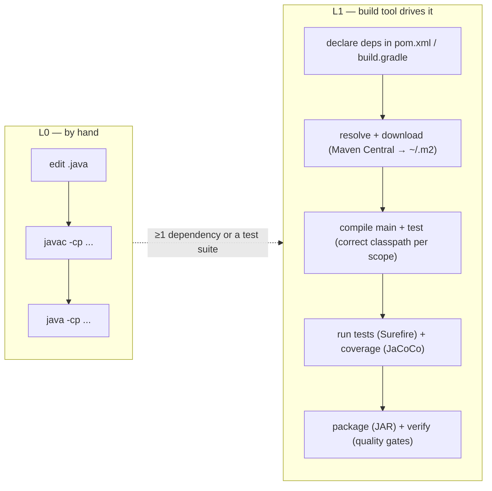

The build tool is fundamentally a **dependency resolver + task runner with conventions**. You declare *what* you depend on and *what* you want (compile, test, package); it figures out *how* — fetching transitive dependencies, ordering compilation, binding plugins to the right phase. Everything below is detail on that machine.

## The Standard Project Layout

Every Java build tool assumes the **Maven Standard Directory Layout**. Adopting it means zero configuration for where sources, tests, and resources live — *convention over configuration*. Deviating means fighting the tool.

```
my-app/
├── pom.xml                 (or build.gradle.kts)
├── mvnw, mvnw.cmd          the build wrapper (commit these)
├── .mvn/wrapper/...
├── src/
│   ├── main/
│   │   ├── java/           production code → packaged into the artifact
│   │   │   └── com/example/...
│   │   └── resources/      non-code files on the runtime classpath (config, .properties for i18n — C02/T23)
│   └── test/
│       ├── java/           test code → NOT packaged; compiled + run, then discarded
│       │   └── com/example/...
│       └── resources/      test-only resources (fixtures, test config)
└── target/                 (Maven) build output — gitignore it
    ├── classes/            compiled main
    ├── test-classes/       compiled test
    ├── my-app-1.0.jar      the artifact
    └── site/jacoco/        coverage report (C03/T07)
```

The crucial split is **`src/main` vs `src/test`**: test code and test-only dependencies (JUnit, Mockito) are compiled and run but **never shipped** in the artifact — enforced by the *test scope* (below). Gradle uses `build/` instead of `target/` but the `src/main` / `src/test` convention is identical. This shared layout is why you can switch a project between Maven and Gradle, or open it in any IDE, without rearranging files.

## Dependency Coordinates & Repositories

A dependency is named by **GAV coordinates** — `groupId:artifactId:version` — a globally unique address:

```xml
<dependency>
  <groupId>org.junit.jupiter</groupId>      <!-- the org / namespace (reverse-DNS) -->
  <artifactId>junit-jupiter</artifactId>    <!-- the specific library -->
  <version>5.10.2</version>                 <!-- exact version -->
  <scope>test</scope>                        <!-- where on the classpath (below) -->
</dependency>
```

GAV maps directly to a path in a repository. When the build needs `org.junit.jupiter:junit-jupiter:5.10.2`, it looks first in your **local repository** (`~/.m2/repository`, a machine-wide cache), and on a miss downloads from a **remote repository** — **Maven Central** by default — then caches it locally forever:

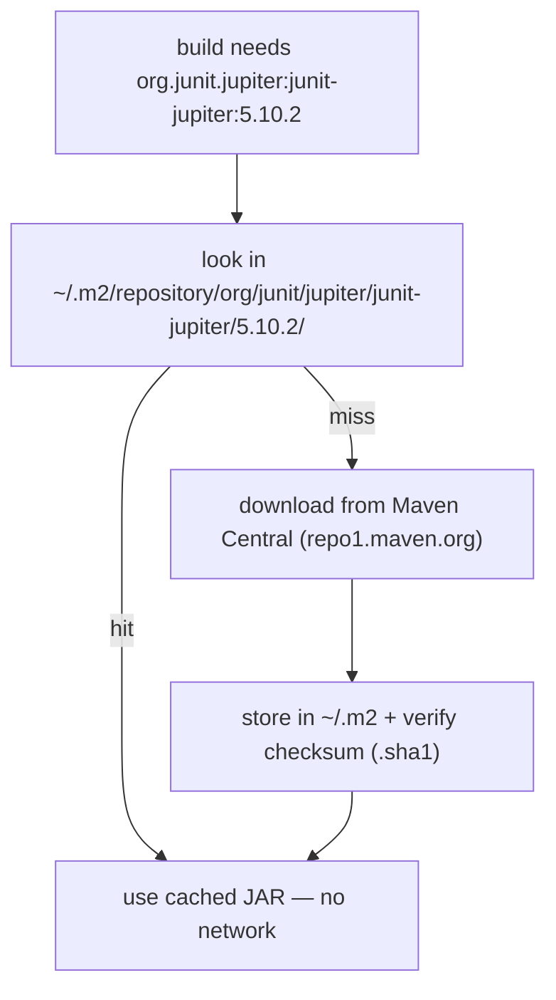

The on-disk path is mechanical: `groupId` dots become directories, then `artifactId`, then `version`, then the files — `~/.m2/repository/org/junit/jupiter/junit-jupiter/5.10.2/junit-jupiter-5.10.2.jar` plus its `.pom` (metadata) and `.sha1`/`.sha256` (integrity checksums). Because the local repo is a shared cache, the *first* build that needs a library is slow (network); every build after is offline-fast. Gradle uses the same Maven repositories and GAV scheme but keeps its own cache under `~/.gradle/caches`. Corporate setups insert a **repository manager** (Nexus, Artifactory) as a proxy — configured in `~/.m2/settings.xml` (Maven) — to cache artifacts internally and host private libraries.

> [!TIP]
> Browse [search.maven.org](https://search.maven.org) (Maven Central) to find a library's exact current coordinates and copy the dependency snippet. The "version you should use" question is answered there, not guessed.

## Transitive Dependencies & Conflict Resolution

You declare `junit-jupiter`; it pulls in `junit-jupiter-api`, `junit-jupiter-engine`, `junit-platform-commons`, `apiguardian-api`, and more — **transitive dependencies**, the libraries your libraries need. The build resolves the whole graph automatically. Inspect it:

```bash
mvn dependency:tree            # the full transitive graph
gradle dependencies            # Gradle equivalent (per-configuration)
```

```
com.example:my-app:jar:1.0
+- org.junit.jupiter:junit-jupiter:jar:5.10.2:test
|  +- org.junit.jupiter:junit-jupiter-api:jar:5.10.2:test
|  |  +- org.opentest4j:opentest4j:jar:1.3.0:test
|  |  +- org.junit.platform:junit-platform-commons:jar:1.10.2:test
|  |  \- org.apiguardian:apiguardian-api:jar:1.1.2:test
|  +- org.junit.jupiter:junit-jupiter-params:jar:5.10.2:test
|  \- org.junit.jupiter:junit-jupiter-engine:jar:5.10.2:test
\- org.mockito:mockito-core:jar:5.11.0:test
   +- net.bytebuddy:byte-buddy:jar:1.14.12:test          ← the proxy engine behind Mockito (C03/T03)
   +- net.bytebuddy:byte-buddy-agent:jar:1.14.12:test
   \- org.objenesis:objenesis:jar:3.3:test
```

This tree is also where abstract C03 mechanisms become concrete — Mockito's `byte-buddy` (the dynamic-subclass engine from T03) and the JUnit Platform/Jupiter split (T01) are right there as real JARs. The graph routinely contains the **same library at two versions** (your direct dep wants `guava:32.0`, a transitive dep wants `guava:31.0`). Only one can be on the classpath, so the tool picks — and Maven and Gradle pick **differently**:

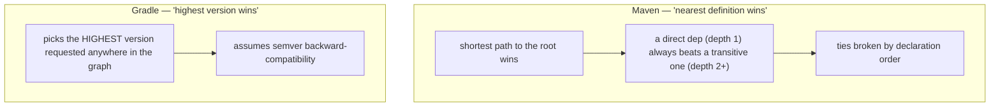

Neither is "correct" — a mismatch between *compiled-against* and *resolved* versions is the classic cause of a `NoSuchMethodError` or `NoClassDefFoundError` at runtime (JAR-hell from L0's classpath section, now via transitive graphs). The fix is to make the version explicit: declare the dependency directly to force it, `<exclusions>` to drop an unwanted transitive, or — best for a family of related libraries — a **BOM** (Bill of Materials):

```xml
<dependencyManagement>
  <dependencies>
    <dependency>
      <groupId>org.junit</groupId><artifactId>junit-bom</artifactId>
      <version>5.10.2</version><type>pom</type><scope>import</scope>
    </dependency>
  </dependencies>
</dependencyManagement>
```

A BOM centralizes a consistent set of versions; you then declare the JUnit artifacts *without* versions and inherit them from the BOM, guaranteeing the pieces agree. **Dependency scopes** control *which* classpath each dependency joins and whether it ships:

| Scope (Maven) | On compile CP? | On test CP? | Packaged / at runtime? | Use for |
|---|:---:|:---:|:---:|---|
| **compile** (default) | ✅ | ✅ | ✅ | normal libraries your code calls |
| **provided** | ✅ | ✅ | ❌ | APIs the container supplies (Servlet API) |
| **runtime** | ❌ | ✅ | ✅ | needed at run, not compile (JDBC drivers) |
| **test** | ❌ | ✅ | ❌ | **JUnit, Mockito, AssertJ** — never shipped |
| **import** | — | — | — | pull versions from a BOM |

Scope is why `test`-scoped JUnit never bloats your production artifact, and why a forgotten `runtime` driver compiles fine but throws `ClassNotFoundException` in production. Gradle expresses the same idea as **configurations**: `implementation`, `compileOnly`, `runtimeOnly`, `testImplementation` — with the additional `api` vs `implementation` distinction that controls whether a dependency *leaks* onto consumers' compile classpath (a deliberate encapsulation tool, echoing C01's access-control theme).

## Maven — Working Knowledge

Maven is **declarative**: the `pom.xml` (Project Object Model) describes *what* the project is; Maven supplies the *how* through a fixed **build lifecycle**. The default lifecycle is an ordered sequence of **phases**, and running a phase runs every phase before it:

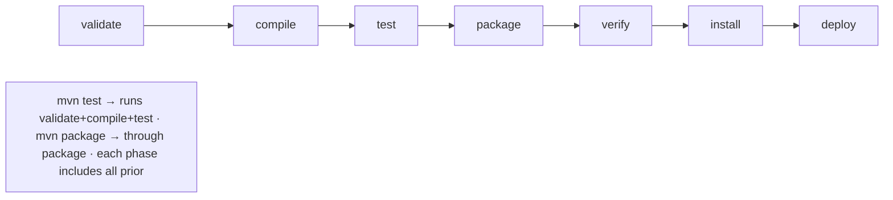

| Phase | What happens |
|---|---|
| `validate` | check the project is correct, all info available |
| `compile` | compile `src/main/java` → `target/classes` |
| `test` | run unit tests (Surefire) against `target/test-classes` |
| `package` | bundle compiled code → `target/my-app-1.0.jar` |
| `verify` | run integration tests (Failsafe) + quality checks |
| `install` | copy the artifact into `~/.m2` for other local projects |
| `deploy` | upload to a remote repository for the team |

Maven does no real work itself — **plugins** do, bound to phases via *goals*. The `maven-compiler-plugin:compile` goal is bound to the `compile` phase, `maven-surefire-plugin:test` to `test`, `maven-jar-plugin:jar` to `package`, and (from C03/T07) `jacoco-maven-plugin:report` to a test phase. A fuller POM:

```xml
<project xmlns="http://maven.apache.org/POM/4.0.0">
  <modelVersion>4.0.0</modelVersion>
  <groupId>com.example</groupId>
  <artifactId>my-app</artifactId>
  <version>1.0.0</version>
  <properties>
    <maven.compiler.release>21</maven.compiler.release>
    <project.build.sourceEncoding>UTF-8</project.build.sourceEncoding>
  </properties>
  <dependencies>
    <dependency>
      <groupId>org.junit.jupiter</groupId><artifactId>junit-jupiter</artifactId>
      <version>5.10.2</version><scope>test</scope>
    </dependency>
  </dependencies>
</project>
```

```bash
mvn clean           # delete target/
mvn compile         # compile main
mvn test            # compile + run unit tests
mvn package         # + build the JAR
mvn verify          # + integration tests + quality gates
mvn install         # + copy to ~/.m2
mvn -B -ntp verify  # batch mode, no transfer progress — the CI form
mvn help:effective-pom   # the REAL pom after inheritance + defaults are merged
```

Two POM facts save hours: every project implicitly inherits the **Super POM** (which is why Maven Central and the standard layout work with zero config), and `mvn help:effective-pom` prints the fully-merged POM so you can see the defaults you never wrote. Always set `maven.compiler.release` (not the older `source`/`target`) — it cross-compiles correctly against the named JDK's API.

## Gradle — Working Knowledge

Gradle is **programmable**: the build script (`build.gradle.kts` in Kotlin, or `build.gradle` in Groovy) is *code* that configures a graph of **tasks**. Where Maven has a fixed lifecycle, Gradle builds a **directed acyclic graph** of tasks and runs only what's needed, in dependency order:

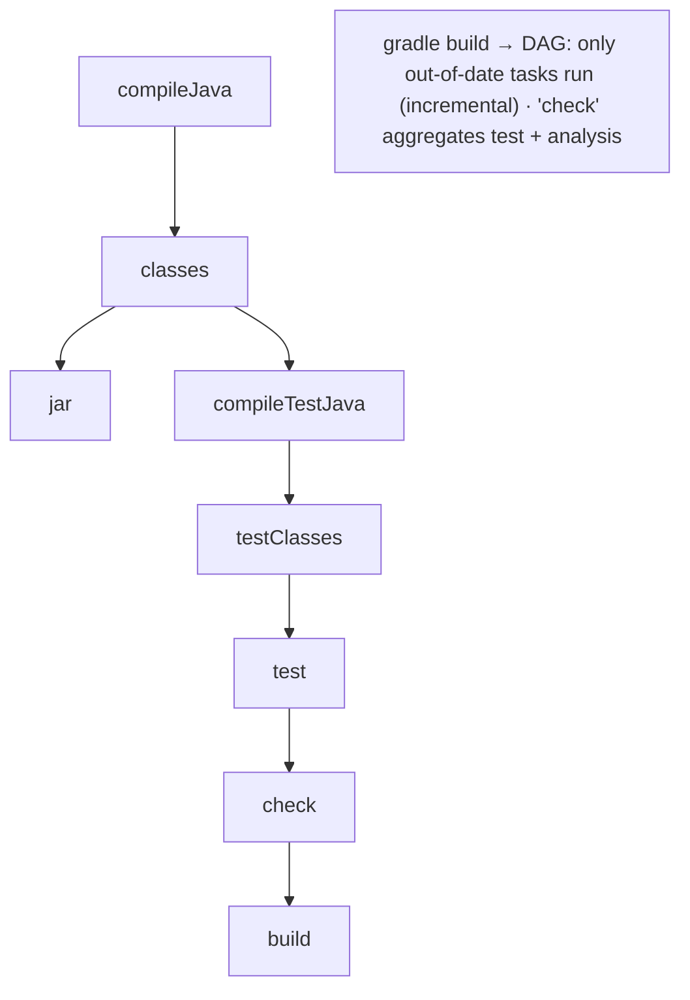

```kotlin
plugins {
    java
    jacoco                                    // C03/T07 coverage, as a plugin
}
java {
    toolchain { languageVersion = JavaLanguageVersion.of(21) }   // auto-downloads a JDK if absent
}
repositories { mavenCentral() }
dependencies {
    testImplementation("org.junit.jupiter:junit-jupiter:5.10.2")
    testImplementation("org.mockito:mockito-core:5.11.0")
}
tasks.test { useJUnitPlatform() }             // run via the JUnit 5 Platform (T01)
```

```bash
./gradlew build          # compile + test + check + assemble (via the wrapper)
./gradlew test
./gradlew jacocoTestReport
./gradlew dependencies   # the resolved graph
./gradlew tasks          # every available task
```

Gradle's performance comes from three mechanisms worth knowing: the **daemon** (a long-lived background JVM that avoids paying JVM startup + class-loading on every build), **incremental compilation + task up-to-date checks** (a task whose inputs and outputs are unchanged is skipped, marked `UP-TO-DATE`), and the **build cache** (reuse outputs across builds — even from other machines/CI). The trade-off vs Maven:

| | Maven | Gradle |
|---|---|---|
| Config | declarative XML (`pom.xml`) | imperative DSL (Kotlin/Groovy) — programmable |
| Model | fixed lifecycle/phases | task DAG |
| Speed | slower (no daemon by default) | faster (daemon, incremental, cache) |
| Predictability | high — every Maven build looks the same | depends on the script's logic |
| Ecosystem | huge, mature, stable | huge, Android's default, faster-moving |

The honest summary: **Maven for predictability and convention; Gradle for speed and flexibility**. New enterprise back-end projects still lean Maven; Android and performance-sensitive or highly-customized builds lean Gradle. Knowing both is normal — they consume the same Maven Central dependencies and the same project layout.

## The Build Wrapper

Commit the **wrapper** (`mvnw`/`mvnw.cmd` + `.mvn/`, or `gradlew`/`gradlew.bat` + `gradle/wrapper/`) and run `./mvnw`/`./gradlew` instead of a globally-installed `mvn`/`gradle`. The wrapper is a tiny script that downloads and uses an *exact, pinned* build-tool version recorded in the repo:

```properties
# gradle/wrapper/gradle-wrapper.properties
distributionUrl=https\://services.gradle.org/distributions/gradle-8.7-bin.zip
```

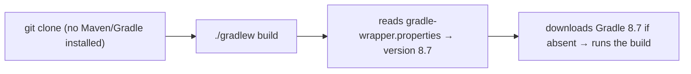

This kills the *"works on my machine — different build-tool version"* class of failure: every developer and the CI server use the **same** tool version, fetched automatically, with nothing to install beyond a JDK. It is the single most important reproducibility practice at this level — a fresh clone builds with `./gradlew build` and no prerequisites.

The mirror-image discipline is a correct **`.gitignore`** — commit *sources, the POM/build script, and the wrapper*; never commit *build output or IDE files* (they are regenerated and machine-specific):

```gitignore
target/          # Maven output      build/          # Gradle output
*.class          # stray compiled    .idea/  *.iml   # IntelliJ
.gradle/         # Gradle caches     .vscode/        # VS Code
# DO commit: mvnw, gradlew, .mvn/, gradle/wrapper/  ← the wrapper is part of the source
```

## Running Tests & Coverage from the Build

This is where C03 pays off: the testing stack you learned runs *as part of the build*, on every `verify`, gated in CI. Maven uses two plugins split by test type:

| Plugin | Runs in phase | Default pattern | For |
|---|---|---|---|
| **Surefire** | `test` | `*Test.java`, `Test*.java`, `*Tests.java` | fast **unit** tests (C03/T01) |
| **Failsafe** | `integration-test` / `verify` | `*IT.java`, `IT*.java` | slower **integration** tests |

The split exists because a failed *unit* test should fail `mvn test` immediately, whereas integration tests run later (in `verify`) and Failsafe is designed so the build still runs post-integration *teardown* even when a test fails. Coverage is the JaCoCo plugin (C03/T07) bound into the lifecycle:

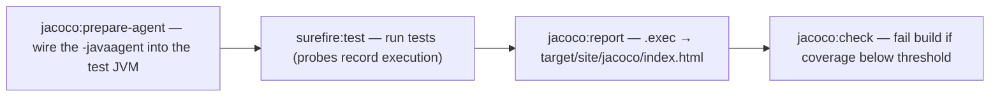

The `prepare-agent` goal injects the JaCoCo Java agent exactly as T07 described — the build wires it in automatically, the tests run, and `report`/`check` produce and gate the coverage. The result: one `mvn verify` (or `./gradlew build`) compiles, runs unit + integration tests, measures coverage, and fails if any test fails or coverage regresses. That single command is what CI runs.

## Annotation Processors in the Build

Annotation processing (JSR 269, C02/T18) runs *inside* compilation: `javac` discovers processors on the `--processor-path`, then calls them in **rounds** to generate new source and class files *before* the final compile — pure code generation, no runtime reflection. Build tools wire this up declaratively, and it powers some of the most common L1 libraries:

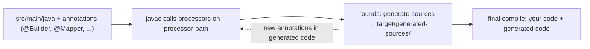

| Library | Generates | Note |
|---|---|---|
| **Lombok** | getters/setters/`equals`/`hashCode`/builders from `@Data`/`@Builder` | edits the AST non-standardly → needs an IDE plugin; can obscure the C01/T10 contracts |
| **MapStruct** | type-safe bean mappers | the T18 *compile-time* path — fast, AOT-friendly, no reflection |
| **Immutables / AutoValue** | immutable value classes (C01/T19) | the pre-`record` idiom |
| **Dagger** | dependency-injection wiring | compile-time DI (vs Spring's runtime reflection) |

```xml
<plugin>
  <artifactId>maven-compiler-plugin</artifactId>
  <configuration><annotationProcessorPaths>
    <path><groupId>org.mapstruct</groupId><artifactId>mapstruct-processor</artifactId>
      <version>1.5.5.Final</version></path>
  </annotationProcessorPaths></configuration>
</plugin>
```

In Gradle the same is `annotationProcessor("org.mapstruct:mapstruct-processor:1.5.5.Final")`. Generated sources land in `target/generated-sources/` (Maven) or `build/generated/` (Gradle) — the build adds them to the compile path automatically, and you commit *none* of it. This is the concrete, build-side realization of T18's "compile-time annotation processing avoids reflection" — the processor runs once at build time, so there is zero runtime cost (contrast Spring/Jackson reading annotations reflectively at startup).

## Logging — Facade & Binding

Real applications never diagnose themselves with `System.out.println` (C02/T13) — they use a logging framework with levels, timestamps, and configurable output. The Java ecosystem standardized on a **facade + binding** split that is the decorator/facade pattern (C02/T13) at the dependency level:

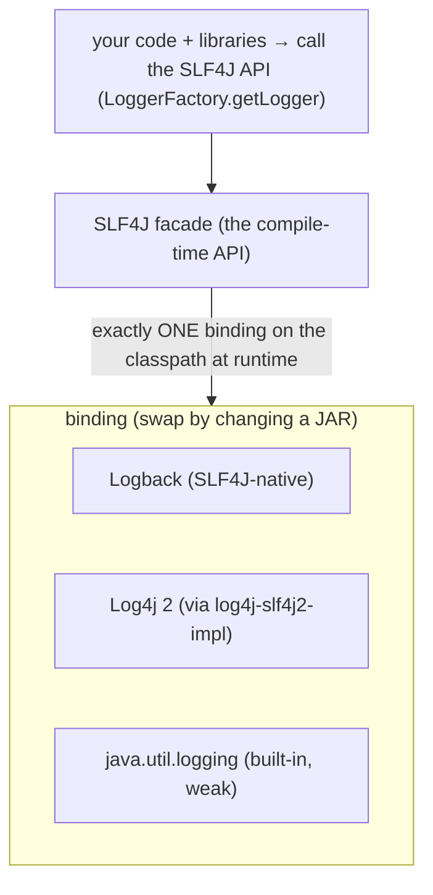

You compile against **SLF4J** (`org.slf4j:slf4j-api`); a **binding** supplies the implementation at runtime — **Logback** (SLF4J's native companion) or **Log4j 2**. Swapping the implementation is swapping a JAR; your code never changes. The rules that matter: a **library** should depend *only* on the SLF4J API (so the *application* picks the implementation — two frameworks must not fight), and exactly **one binding** belongs on the classpath (SLF4J warns at startup if it finds several). Use the five levels deliberately (`ERROR` > `WARN` > `INFO` > `DEBUG` > `TRACE`) and **parameterized messages** so formatting is skipped when the level is disabled:

```java
private static final Logger log = LoggerFactory.getLogger(OrderService.class);
log.info("user {} placed order {}", userId, orderId);   // no string concat unless INFO is enabled
log.debug("cart contents: {}", cart);                    // skipped entirely in production (INFO level)
```

This facade design is also why Log4Shell (next section) was so widespread — **Log4j 2 was the *binding*** underneath countless apps that only ever referenced SLF4J, so most victims did not even realize they shipped it.

## Static Analysis & Linting

Compilation proves code is *valid*; static analysis proves it avoids known *bugs and smells* — without running it. These tools plug into the build as quality gates ("shift left": catch problems at build time, not in review or production):

| Tool | Analyzes | Catches | Example |
|---|---|---|---|
| **Checkstyle** | source (style) | formatting/convention violations | missing Javadoc, naming, line length |
| **PMD** | source AST | code smells, complexity | unused variables, empty `catch`, high cyclomatic complexity |
| **SpotBugs** (ex-FindBugs) | **bytecode** | likely *bugs* | null-deref, ignored return value, bad `equals`/`hashCode` (C01/T10) |
| **Error Prone** (Google) | **`javac` AST plugin** | bug patterns *at compile time* | `==` on strings, `Optional.get()` without check, format-string mismatches |

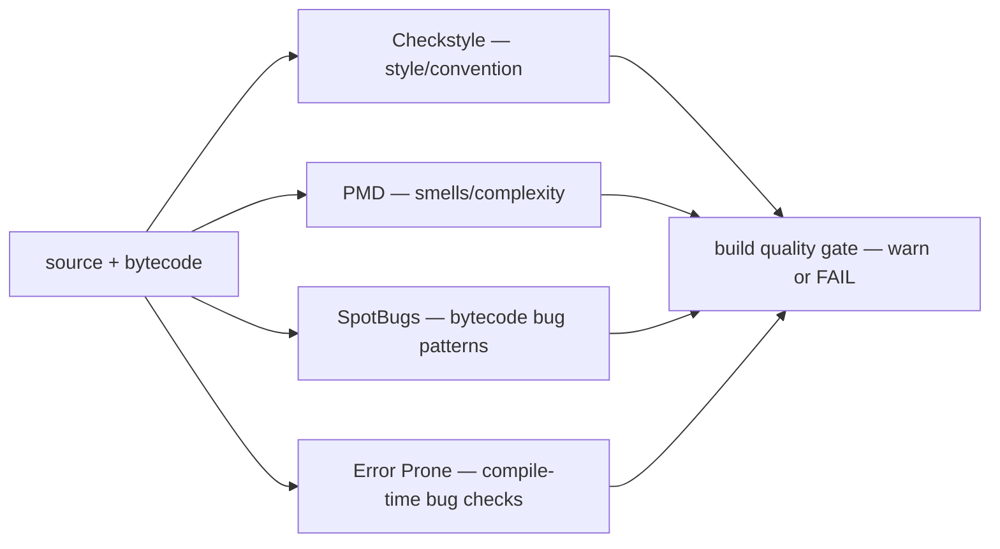

They overlap deliberately — SpotBugs reads bytecode (so it sees what the compiler *produced*, including the erasure and desugaring from C01/C02), while Error Prone hooks `javac` itself (so it can fail the compile and even *auto-fix* via suggested patches). A typical project runs Checkstyle + SpotBugs (or Error Prone) in `verify`, failing the build on new high-priority findings. The payoff is that a whole class of review comments ("you ignored this return value", "this `catch` is empty") becomes an automated gate.

## Code Formatting

Formatting is style with the arguments removed: pick a formatter, run it automatically, and *never debate brace placement again*. **google-java-format** and **palantir-java-format** are opinionated (near-zero configuration); **Spotless** is the build plugin that applies one and *fails the build* if code isn't formatted:

```bash
mvn spotless:check     # fail if any file is mis-formatted (CI)
mvn spotless:apply     # rewrite all files to the canonical format
```

Combined with editor *format-on-save* and an `.editorconfig` (a cross-IDE file pinning indent, charset, and line endings), every commit lands pre-formatted, diffs stay minimal (no formatting noise mixed into logic changes), and `git blame` stays meaningful. Automated formatting is a small thing that compounds: it removes an entire category of nitpick from code review and keeps the codebase visually uniform regardless of who wrote it.

## Refactoring with the IDE

The IDE's refactoring engine is a power tool you under-use at your peril — and it is the concrete enabler of two things this level taught: OOP design evolution (C01) and the **refactor** step of TDD's red-green-refactor (C03/T06). Because the IDE works on a full **AST + type model** (not text), these transformations are *behavior-preserving and safe* — it updates every reference, across the whole project, correctly:

| Refactoring | Does | Ties to |
|---|---|---|
| **Rename** (⇧F6) | rename a symbol + every reference | readable names without grep-and-pray |
| **Extract Method** (⌘⌥M) | pull a code block into a named method | TDD refactor step (C03/T06); reduce complexity |
| **Extract Variable / Constant / Field** | name a sub-expression | clarity; remove duplication |
| **Extract Interface / Superclass** | hoist members into a new supertype | C01 abstraction; enabling DI for tests (C03/T03) |
| **Change Signature** | add/reorder/remove params everywhere | evolve an API safely |
| **Inline** | replace a symbol with its definition | undo premature abstraction |
| **Move / Pull Up / Push Down** | relocate members across classes | shape the inheritance hierarchy (C01) |

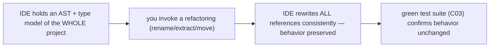

The discipline: make behavior changes *or* refactor, never both in one step — and lean on the IDE plus a green test suite so refactoring is mechanical and reversible. "Extract Interface" then "inject it" is the exact two-move sequence that makes a hard-to-test class mockable (C03/T03's *mocking-forces-DI*), done in seconds and without breaking callers.

## Dependency Hygiene & Supply-Chain Security

Every dependency is code you run but did not write — and its transitive graph multiplies that trust. Two failure modes matter. First, **bloat and drift**: unused or outdated dependencies. Audit them:

```bash
mvn dependency:analyze    # 'used undeclared' (relying on a transitive — declare it) + 'unused declared'
mvn versions:display-dependency-updates   # which deps have newer versions
```

Second — and far more serious — **supply-chain vulnerabilities**. A CVE in a deep transitive dependency is *your* vulnerability. The defining example is **Log4Shell** (CVE-2021-44228, December 2021): a remote-code-execution flaw in Log4j 2's JNDI lookup that was trivially exploitable and *everywhere*, because countless apps pulled Log4j in transitively without knowing. It is the same lesson as C02/T21's deserialization RCE, at the dependency level: untrusted input + a powerful library feature = compromise.

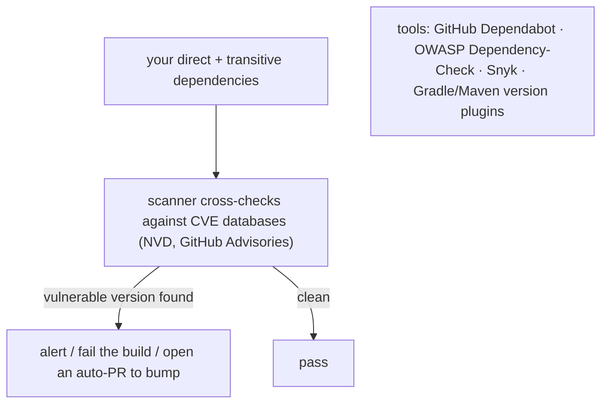

The defenses are now standard practice: **GitHub Dependabot** (automated PRs that bump vulnerable/outdated deps), **OWASP Dependency-Check** (a build plugin that fails on known-CVE dependencies), and **Snyk**. Run a scanner in CI, keep dependencies current, and minimize the graph — every dependency you *don't* add is an attack surface you don't own. Pin versions (never use Maven version *ranges* like `[1.0,2.0)` in production — they make builds non-reproducible and silently pull new code).

## Continuous Integration — Where It All Runs

CI is the server that runs the whole build on every push, so "it builds + all tests pass + coverage holds + no new bugs" is enforced for everyone, not trusted to each developer's machine. It is simply the wrapper command, run in a clean environment:

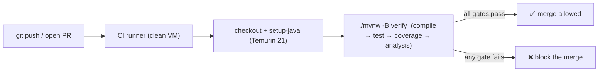

```yaml
# .github/workflows/ci.yml — GitHub Actions
name: CI
on: [push, pull_request]
jobs:
  build:
    runs-on: ubuntu-latest
    steps:
      - uses: actions/checkout@v4
      - uses: actions/setup-java@v4
        with: { distribution: 'temurin', java-version: '21', cache: 'maven' }
      - run: ./mvnw -B -ntp verify        # the same command you run locally
```

The principle that makes CI work is the one this whole chapter builds toward: **the build is reproducible and self-contained** — a clean machine with only a JDK can run `./mvnw verify` and get the identical result you get locally, because the wrapper pins the tool, the POM pins the dependencies, and the layout is conventional. CI then becomes a gate, not a mystery. (Deployment, Docker, and release pipelines are L4 territory — here the build *is* the unit.)

## Common Errors & First-Move Diagnosis

| Symptom | First check |
|---|---|
| `Could not resolve dependencies ... Could not find artifact` | typo in GAV; not on Maven Central (need another repo); offline; check `~/.m2/settings.xml` |
| `NoSuchMethodError` / `NoClassDefFoundError` at runtime (compiles fine) | transitive **version conflict** — `mvn dependency:tree`, force/exclude the version |
| `package x.y.z does not exist` (compile) | missing dependency, or wrong **scope** (e.g. a `test`-only lib used in `src/main`) |
| `ClassNotFoundException` only in production | a `runtime`-scoped dep (JDBC driver) missing from the artifact |
| Tests pass in IDE, fail/skip in `mvn` | Surefire naming (`*Test`), or test resources not on the build's test classpath |
| `release version 21 not supported` | build tool running on an older JDK than `maven.compiler.release` — check `JAVA_HOME` (L0) |
| Build differs locally vs CI | you ran global `mvn`/`gradle`; **use the wrapper** `./mvnw`/`./gradlew` |
| `BUILD SUCCESS` but stale results | forgot `clean`; old `target/` artifacts — `mvn clean verify` |

## Tooling Map — This Level vs Later

| Tool / concern | This level (L1) | Deferred to |
|---|---|---|
| `javac` / `java` / classpath / `jar` | L0 (use them via the build now) | — |
| Dependency management, Maven/Gradle *use* | **here** | — |
| Test + coverage from the build (Surefire/JaCoCo) | **here** (payoff of C03) | — |
| Static analysis, formatting, refactoring | **here** | — |
| Deep Maven/Gradle (plugins, multi-module, custom lifecycles) | orientation only | L2/C02 |
| API testing (Postman/curl), web tooling | — | L2 |
| Docker, CI/CD pipelines, release, native images | CI *concept* only | L4 |
| Production profiling (JFR/JMC/async-profiler), GC tuning | L0 intro | L3 |

## Recap

You now have a working mental map of the L1 developer workflow:

- **Project shape:** the standard `src/main` / `src/test` layout every tool assumes; convention over configuration.
- **Dependencies:** GAV coordinates → local `~/.m2` cache → Maven Central; transitive graphs (`dependency:tree`); scopes (`test` keeps JUnit out of the artifact); conflict resolution (Maven *nearest-wins* vs Gradle *highest-wins*); BOMs for consistent version sets.
- **Maven:** declarative POM; the fixed lifecycle (`validate → compile → test → package → verify → install`); plugins bound to phases; `mvn verify` as the one command.
- **Gradle:** programmable task DAG; the daemon + incremental build + cache for speed; configurations; the Maven-vs-Gradle trade-off (predictability vs flexibility/speed).
- **Wrapper:** `./mvnw`/`./gradlew` pin the exact tool version → reproducible builds, no "works on my machine."
- **Tests + coverage from the build:** Surefire (unit) vs Failsafe (integration); JaCoCo's `prepare-agent`/`report`/`check` wired into the lifecycle — the concrete payoff of C03.
- **Quality:** static analysis (Checkstyle/PMD/SpotBugs/Error Prone) and formatting (Spotless/google-java-format) as build gates; IDE refactorings as safe, AST-based transformations enabling C01 design and the C03/T06 refactor step.
- **Security:** dependency hygiene (`dependency:analyze`), supply-chain scanning (Dependabot/OWASP/Snyk), the Log4Shell lesson; pin versions, minimize the graph.
- **CI:** the wrapper command run on a clean machine on every push — the reproducible build as the team's gate.

The throughline: at L1 you stop driving `javac` by hand and start declaring intent to a build tool that resolves dependencies, runs your tests, measures coverage, and enforces quality — turning the language, collections, and testing skills of C01–C03 into a maintainable, team-ready project.

## Next

This chapter has the single reference. Continue to **[L1/C05 Hands-On](../C05-hands-on/README.md)** for the exercises and the end-of-level project, where you apply C01–C04 together: model a small domain with classes and collections, test it with JUnit, and build it with Maven or Gradle. Deeper build-tool mastery — custom plugins, multi-module reactor builds, advanced Gradle — arrives in **L2/C02 (Build Tools & Developer Workflow)**.
