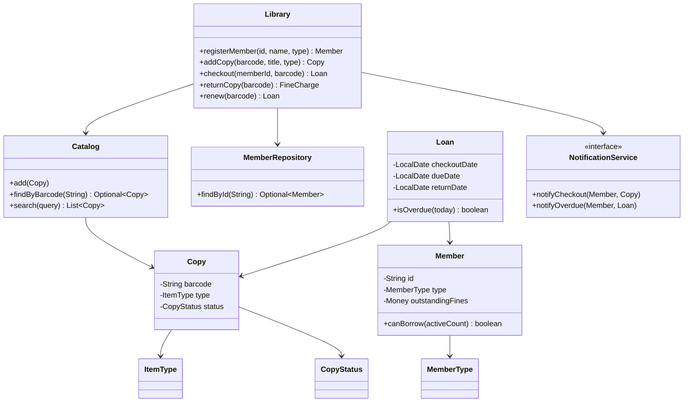
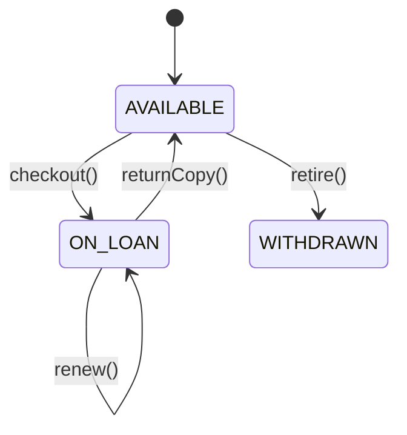
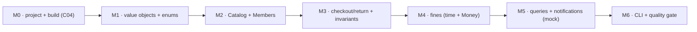

# Level Project — Library Management System

The end-of-L1 capstone. Where the L0 project was a single ~120-line procedural file, this is a small **object-oriented system** — a domain model of classes, enums, and records; collections for storage and queries; exceptions for invalid operations; a full JUnit test suite built test-first; and a Maven/Gradle build that runs the tests and reports coverage. It exercises *every* L1 chapter at once: **C01 (OOP)**, **C02 (Collections & Core APIs)**, **C03 (Testing)**, and **C04 (Tooling)**.

This page is a **project brief**, not a full solution — the point of a capstone is that *you* build it. It gives you the requirements, a suggested domain model, a design walkthrough, a set of **TDD milestones** (each one shippable and tested), key code *sketches* for the tricky decisions, and a precise **definition of done**. Many pieces come straight from the [exercises](./T01-exercises.md) — `Money` (#1, #12), invariant-guarding classes (#2), the `Optional` repository (#11), due dates (#13), enums with behaviour (#5), the Mockito-tested collaborator (#18), and the Maven build (#20). Assemble them into one application and you will have *built* something with Core Java, not just recited it.

## What You're Building

A library system a librarian could drive from the command line (or just a `main` demo): register members, catalogue items, check items in and out, and compute overdue fines. A sample session:

```
=== City Library ===
> add-member  M001  "Ada Lovelace"  STANDARD
Member registered: M001 Ada Lovelace (STANDARD, limit 5)

> add-item    BK-978-0134685991  "Effective Java"  BOOK
Catalogued: "Effective Java" [BOOK] copy BK-978-0134685991 (AVAILABLE)

> checkout    M001  BK-978-0134685991
Checked out to Ada Lovelace. Due 2026-06-19 (14-day loan).

> return      BK-978-0134685991            # returned 5 days late
Returned. Overdue 5 days. Fine: $1.25.

> member-loans M001
Ada Lovelace: 0 active loans, $1.25 outstanding fines.
```

The CLI is deliberately thin — all the *logic* lives in a `Library` service and its domain objects, so it can be driven equally well by a test, a `main`, or (later) a web layer.

## Spec — Functional Requirements

1. **Members.** Register a member with an id, name, and **type** (`STANDARD`, `STUDENT`, `STAFF`). Each type has a **borrowing limit** (e.g. 5 / 10 / 20). Look up a member by id.
2. **Catalogue.** Add an **item** with a barcode, title, and **type** (`BOOK`, `REFERENCE`, `DVD`, `MAGAZINE`). A title may have **multiple physical copies**, each its own barcode and availability.
3. **Checkout.** Lend an available copy to a member, recording the checkout date and a **due date** derived from the item type's loan period. Reject if: the member is over their limit, the copy is unavailable, or the item type is **non-loanable** (`REFERENCE` items never leave).
4. **Return.** Mark a copy returned (now available again). If returned after the due date, **compute a fine** = overdue days × the item type's daily rate, and add it to the member's outstanding balance.
5. **Renew.** Extend an active loan's due date once (reject a second renewal, or renewal of an overdue loan).
6. **Queries.** List a member's active loans and outstanding fines; search the catalogue by title/author/type; list all overdue loans.
7. **Notifications.** On checkout/overdue, call a `NotificationService` (an interface) — in tests, this is **mocked**; you never send real email.

**Constraints / non-functional:**

- Invalid operations throw **domain exceptions** (not generic `RuntimeException`), and **never leave the system half-updated** (fail atomically).
- Money is **`BigDecimal`/`Money`**, never `double`; dates are **`java.time`**.
- Value objects are **immutable**; entity state is **encapsulated** (no public setters leaking internals).
- A **JUnit test suite** covers the rules, built **test-first**, at a **branch-coverage bar** (target ≥ 80%).
- The whole thing **builds with Maven or Gradle** (`mvn verify` / `./gradlew build`) green, with coverage and static analysis wired in.

## Domain Model

The design separates **value objects** (immutable, equality-by-value), **entities** (identity + mutable state, encapsulated), **enums** (typed behaviour), and **services** (orchestration). A suggested model:



| Element | Kind | Why |
|---|---|---|
| `ISBN`, `Money` | **record / final class** (value object) | immutable, equality-by-value, safe map keys (C01/T10, T19) |
| `MemberType`, `ItemType`, `CopyStatus`, `LoanStatus` | **enum** | a closed set; `MemberType`/`ItemType` carry **behaviour** (limits, loan periods, fine rates) — C01/T13 |
| `Member`, `Copy`, `Loan` | **entity (class)** | identity + encapsulated mutable state (C01/T03) |
| `Catalog`, `MemberRepository` | **collection-backed store** | `Map`/`List` + `Optional` lookups (C02/T04, T19) |
| `Library` | **service** | orchestrates the use cases, enforces invariants, throws domain exceptions |
| `NotificationService` | **interface** | a seam to inject + mock in tests (C03/T03) |
| `LibraryException` + subtypes | **exception hierarchy** | typed failures (C02/T09, T10) |

## Key Design Decisions

**Title vs copy.** Model a *physical copy* (`Copy`, with a barcode and status) distinctly from the bibliographic *title*. This is what lets the library own three copies of one book — and it is a clean encapsulation exercise. (You can start with copy-only and add titles in a stretch.)

**Enums carry the policy.** `ItemType` is not just a label — give it the loan period and fine rate, and let `REFERENCE` be non-loanable via a method, so the rules live with the type (constant-specific behaviour, exercise #5 / C01/T13):

```java
enum ItemType {
    BOOK(14, "0.25"), DVD(7, "1.00"), MAGAZINE(7, "0.10"), REFERENCE(0, "0.00");
    private final int loanDays;
    private final Money dailyFine;
    ItemType(int loanDays, String dailyFine) {
        this.loanDays = loanDays;
        this.dailyFine = Money.of(dailyFine, "USD");
    }
    boolean isLoanable()      { return loanDays > 0; }
    int loanDays()            { return loanDays; }
    Money dailyFine()         { return dailyFine; }
}
```

**Invariants in the service, atomically.** `checkout` validates everything *before* mutating anything, so a rejected checkout leaves the copy available and the member unchanged (exercise #2's fail-atomically rule):

```java
public Loan checkout(String memberId, String barcode) {
    Member member = members.findById(memberId)
        .orElseThrow(() -> new MemberNotFoundException(memberId));
    Copy copy = catalog.findByBarcode(barcode)
        .orElseThrow(() -> new CopyNotFoundException(barcode));
    if (!copy.type().isLoanable())        throw new ItemNotLoanableException(barcode);
    if (copy.status() != CopyStatus.AVAILABLE) throw new CopyUnavailableException(barcode);
    if (!member.canBorrow(activeLoanCount(member)))
        throw new BorrowingLimitExceededException(memberId);
    // all checks passed — now mutate
    LocalDate due = clock.today().plusDays(copy.type().loanDays());
    Loan loan = new Loan(copy, member, clock.today(), due);
    copy.markOnLoan();
    loans.add(loan);
    notifications.notifyCheckout(member, copy);
    return loan;
}
```

**Inject the clock.** Notice `clock.today()` rather than `LocalDate.now()` — injecting a clock (a tiny interface, or `java.time.Clock`) makes due-date and overdue logic **deterministically testable** (the dependency-injection lesson from C03/T03; exercise #18). Same for the `NotificationService`.

**Money and time, done right.** Fines use `Money`/`BigDecimal` with an explicit rounding mode (exercise #12), and overdue days come from `ChronoUnit.DAYS.between(due, returned)` clamped at zero (exercise #13) — never `double`, never a hand-rolled date subtraction.

**Entities encapsulate; value objects are records.** A `Copy` owns its status and exposes *behaviour* (`markOnLoan`), never a setter; a `Member` owns its fine balance the same way. The identity-bearing entities are classes; the equality-by-value pieces are records:

```java
final class Copy {                          // entity: identity = barcode, mutable status (encapsulated)
    private final String barcode;
    private final ItemType type;
    private CopyStatus status = CopyStatus.AVAILABLE;
    void markOnLoan()   { if (status != CopyStatus.AVAILABLE) throw new IllegalStateException(barcode); status = CopyStatus.ON_LOAN; }
    void markReturned() { status = CopyStatus.AVAILABLE; }
    CopyStatus status() { return status; }   // expose the value, never a mutable internal
}

record ISBN(String value) {                 // value object: validated in the compact constructor
    private static final Pattern SHAPE = Pattern.compile("^97[89]\\d{10}$");   // precompiled (C02/T16)
    ISBN {
        String digits = value.replace("-", "");
        if (!SHAPE.matcher(digits).matches()) throw new IllegalArgumentException("bad ISBN: " + value);
        value = digits;
    }
}
```

**Exceptions are a typed hierarchy**, not raw `RuntimeException`s — so callers can catch precisely (C02/T09, T10):

```java
class LibraryException extends RuntimeException { LibraryException(String m) { super(m); } }
class MemberNotFoundException        extends LibraryException { /* ... */ }
class CopyUnavailableException       extends LibraryException { /* ... */ }
class BorrowingLimitExceededException extends LibraryException { /* ... */ }
```

### A Complete M1 Slice, Test-First

To see the rhythm end-to-end, here is one full red-green increment for `Money` (exercise #1) — the test is written *first*, then the minimal type that satisfies it:

```java
// RED — write the behaviour you want before Money exists.
@Test void money_addsWithinCurrency_andNormalisesScale() {
    assertThat(Money.of("4.99", "USD").plus(Money.of("0.01", "USD")))
        .isEqualTo(Money.of("5.00", "USD"));                 // 5.0 vs 5.00 must be equal
}
@Test void money_rejectsCrossCurrencyAddition() {
    assertThatThrownBy(() -> Money.of("1", "USD").plus(Money.of("1", "EUR")))
        .isInstanceOf(IllegalArgumentException.class);
}

// GREEN — the minimal value object that passes (note: String ctor + fixed scale, never double).
final class Money {
    private final BigDecimal amount;
    private final String currency;
    private Money(BigDecimal a, String c) { this.amount = a.setScale(2, RoundingMode.HALF_UP); this.currency = c; }
    static Money of(String amount, String ccy) { return new Money(new BigDecimal(amount), ccy); }
    Money plus(Money o) { requireSameCurrency(o); return new Money(amount.add(o.amount), currency); }
    private void requireSameCurrency(Money o) { if (!currency.equals(o.currency)) throw new IllegalArgumentException("currency mismatch"); }
    @Override public boolean equals(Object o) { /* amount + currency */ }
    @Override public int hashCode() { /* Objects.hash(amount, currency) */ }
}
```

That is the loop you repeat for every milestone: a failing test names the behaviour, the smallest correct code turns it green, then you refactor under the green bar. By M6 the suite *is* the specification, and coverage falls out by construction (C03/T06–T07).

The copy's lifecycle is a small state machine — model `CopyStatus` explicitly and let only `Copy` mutate it:



## Build It in Milestones (Test-First)

Build in thin, shippable increments — each milestone is **red-green-refactor** (C03/T06): write the failing test, make it pass, clean up. Never start a milestone before the previous one is green.



| Milestone | Goal | Write tests for | Topics |
|---|---|---|---|
| **M0** | Maven/Gradle project, `src/main`–`src/test`, JUnit + Mockito **test-scoped**, JaCoCo wired | a trivial smoke test (`mvn verify` green) | C04/T01 |
| **M1** | `Money`, `ISBN`, the four enums | value equality, `ISBN` validation, `ItemType` loan/fine values, `isLoanable` | C01/T10, T13, T14; C02/T20 |
| **M2** | `Catalog` (add/find/search), `MemberRepository`, `Member.canBorrow` | add-then-find, `findByBarcode` returns `Optional`, search filters, limit check | C02/T04, T19; C01/T03 |
| **M3** | `checkout` + `returnCopy` with **all invariants** | happy path, each rejection (`assertThrows`), fail-atomic, copy status transitions | C02/T09, T10; C03/T01 |
| **M4** | Fines: due-date derivation, overdue days, `Money` fine, balance update | on-time = no fine, late = correct fine, boundary (due-date = not overdue) | C02/T15, T20 |
| **M5** | Queries (member loans, overdue list, search) + `notifyOverdue` | query correctness; **mock** `NotificationService`, `verify` the call | C03/T03, T04 |
| **M6** | A thin CLI/demo `main`; the quality gate | branch coverage ≥ 80%; static analysis clean | C03/T07; C04/T01 |

A representative **test-first** step from M3 — the over-limit rejection, written before the code that satisfies it:

```java
@Test
void checkout_whenMemberAtBorrowingLimit_isRejectedAndCopyStaysAvailable() {
    Library lib = TestData.libraryWith(member("M1", STANDARD), copies(6));   // limit 5
    for (int i = 0; i < 5; i++) lib.checkout("M1", "C" + i);                 // fill the limit

    assertThatThrownBy(() -> lib.checkout("M1", "C5"))
        .isInstanceOf(BorrowingLimitExceededException.class);

    assertThat(lib.catalog().findByBarcode("C5").orElseThrow().status())
        .isEqualTo(CopyStatus.AVAILABLE);          // fail-atomic: the 6th copy untouched
}
```

And the M5 interaction test that mocks the collaborator (exercise #18, C03/T03):

```java
@Test
void overdueSweep_notifiesEachMemberWithAnOverdueLoan() {
    NotificationService notifier = mock(NotificationService.class);
    Library lib = TestData.libraryWith(notifier, clockAt("2026-06-20"), ...);
    // ... a loan due 2026-06-19 is now overdue ...

    lib.runOverdueSweep();

    verify(notifier).notifyOverdue(eq(member), any(Loan.class));
    verifyNoMoreInteractions(notifier);            // don't over-verify beyond the one that matters
}
```

## The Build (M0 / M6)

A minimal Maven setup that runs tests + coverage (lift from C04/T01):

```xml
<dependencies>
  <dependency><groupId>org.junit.jupiter</groupId><artifactId>junit-jupiter</artifactId>
    <version>5.10.2</version><scope>test</scope></dependency>
  <dependency><groupId>org.mockito</groupId><artifactId>mockito-core</artifactId>
    <version>5.11.0</version><scope>test</scope></dependency>
  <dependency><groupId>org.assertj</groupId><artifactId>assertj-core</artifactId>
    <version>3.25.3</version><scope>test</scope></dependency>
</dependencies>
```

```bash
mvn verify                 # compile + run tests + JaCoCo report + coverage gate
mvn dependency:tree        # see the test-scoped JARs (byte-buddy, opentest4j) — C03 made real
open target/site/jacoco/index.html
```

Wire the JaCoCo `prepare-agent`/`report`/`check` execution (C03/T07, C04/T01) with a **branch** minimum of `0.80`, run the build through the **wrapper** (`./mvnw verify`), and add a `.gitignore` that excludes `target/` but commits the wrapper.

## Acceptance Walkthrough

Beyond the unit suite, drive the finished system (via `main` or a top-level integration test) through these scenarios — the behavioural acceptance criteria:

| Scenario | Steps | Expected |
|---|---|---|
| Happy checkout/return | register member, add `BOOK` copy, checkout, return on time | due date = today + 14; return = available again, no fine |
| Overdue fine | checkout, advance the injected clock 19 days, return | overdue 5 days × $0.25 = **$1.25**, added to the member's balance |
| Due-date boundary | return exactly on the due date | **not** overdue; no fine |
| Borrowing limit | a `STANDARD` member checks out their limit + 1 | `BorrowingLimitExceededException`; the extra copy stays `AVAILABLE` |
| Unavailable copy | two members check out the same copy | second gets `CopyUnavailableException` |
| Non-loanable | checkout a `REFERENCE` item | `ItemNotLoanableException`; never leaves |
| Unknown member / copy | checkout with a bad id / barcode | `MemberNotFoundException` / `CopyNotFoundException` |
| Renewal | renew an active loan once, then again | first extends the due date; second is rejected |
| Search | search by title fragment / type | matching copies, ordered (a `Comparator`, exercise #4/#15) |
| Overdue sweep | run the sweep with some loans overdue | `NotificationService.notifyOverdue` called once per overdue member (mock verifies) |

## Pitfalls Specific to This Project

The traps the L1 topics warned about show up *here* concretely — watch for them (and see [C06 Best Practices](../C06-best-practices/README.md) next):

- **Leaking mutable state.** Returning the internal `List<Loan>` from `memberLoans()` lets callers mutate your store — return an unmodifiable view or a copy (C01/T19). Same for exposing `Copy.status` as a settable field.
- **`equals` on the wrong thing.** `Copy` is an *entity* (identity by barcode); `Money`/`ISBN` are *value objects* (equality by value). Don't give an entity value-equality or use a mutable object as a `HashMap` key (C01/T10 — the mutable-key trap).
- **`double` for fines.** `0.1 + 0.2 != 0.3`; use `Money`/`BigDecimal` with an explicit `RoundingMode`, and remember `BigDecimal` `equals` distinguishes `1.0` from `1.00` (C02/T20 — normalise the scale).
- **`LocalDate.now()` in the logic.** Non-deterministic tests follow; inject a clock (C03/T03). Use `ChronoUnit.DAYS.between`, not a hand-rolled day count (C02/T15).
- **Check-then-act, mutated too early.** Validate *all* preconditions before the first mutation, or a rejected checkout leaves a half-updated copy (exercise #2, fail-atomic).
- **Hollow tests for the coverage bar.** A test that calls `checkout` but asserts nothing lifts coverage without verifying behaviour — assert the outcome *and* the state, and consider a PIT mutation run (C03/T07).
- **Over-mocking.** Mock the `NotificationService` (a true external seam); use *real* `Catalog`/`Member` objects in tests — don't mock value objects or your own data (C03/T04 — classicist by default).

## Definition of Done

The project is "done" when **all** of these hold:

- [ ] Every functional requirement (1–7) works, demonstrated by a `main` or a test.
- [ ] Invalid operations throw a **specific** `LibraryException` subtype and leave state unchanged (fail-atomic) — proven by tests.
- [ ] Value objects are immutable; no entity exposes a setter that leaks internal mutable state; collections returned to callers are unmodifiable or copies (C01/T19).
- [ ] Money is `BigDecimal`/`Money` everywhere; dates are `java.time`; fines round explicitly.
- [ ] `equals`/`hashCode` are correct on every value object used as a key (C01/T10).
- [ ] The JUnit suite covers the happy paths **and** each documented edge case; the `NotificationService` and clock are injected and the notifier is mocked.
- [ ] `mvn verify` (or `./gradlew build`) is **green**, with **branch coverage ≥ 80%** (JaCoCo gate) — and the number is *earned* (no assertion-free hollow tests; C03/T07).
- [ ] A static-analysis pass (SpotBugs or Error Prone) and a formatter (Spotless) run in the build with no new high-priority findings (C04/T01).
- [ ] No raw types, no unchecked warnings, no ignored return values.

## Stretch Goals

- **Holds / reservations.** A member reserves a checked-out copy; on return it goes to the next reserver (a `Queue` per title — C02/T05).
- **Multiple copies + titles.** Promote the title into its own `Book`/`Title` entity with many `Copy`s; search by title returns availability counts.
- **Persistence.** Save/load the catalogue — first with Java serialization (then read C02/T21 on *why not* for untrusted data), then as JSON (a schema-based format), behind a `Repository` interface so the storage is swappable.
- **Renewal policy & fine caps.** Cap fines at the item's replacement cost; block checkout when fines exceed a threshold.
- **Reporting.** Most-borrowed titles, members with the most overdue days — `Stream` pipelines with `groupingBy` (exercise #15).
- **i18n.** Localise messages and format fines/dates per `Locale` (C02/T23).
- **A REST API.** Expose the `Library` service over HTTP — a natural lead-in to **L2** (don't build it here; just note the seam the service gives you).
- **Concurrency.** Make the catalogue safe for concurrent checkouts — a preview of **L3** (note the race in `checkout` between the availability check and the mutation).

## What You've Demonstrated

Finishing this project proves you can:

- **Design with objects** — value objects vs entities vs services; encapsulated state; immutability where it buys safety; an interface as a test seam (C01/T03, T07, T08, T19).
- **Use enums and records** for typed, behaviour-carrying domain concepts (C01/T13, T14).
- **Model relationships and lifecycles** — a copy's status state machine; loans linking members and copies; polymorphic per-type policy (C01/T05, T06, T13).
- **Choose and drive collections** — `Map` catalogues, `Optional` lookups, `Stream` queries, the right structure per access pattern (C02/T01–T08, T19).
- **Handle failure properly** — a typed exception hierarchy, atomic operations, try-with-resources for any I/O (C02/T09, T10).
- **Use the core libraries correctly** — `java.time` for due dates, `BigDecimal`/`Money` for fines, regex for ISBN validation (C02/T15, T16, T20).
- **Test like a professional** — a JUnit suite built **test-first** (TDD), Mockito for the notification seam, injected clock for deterministic time, a meaningful coverage bar (C03 — all of it).
- **Build like a professional** — a Maven/Gradle project with dependencies, tests, coverage, and static analysis wired into one `verify` (C04/T01).

That is the entire L1 module — OOP, collections and core APIs, testing, and tooling — exercised in one coherent application.

## Recap

You've taken the language, libraries, testing discipline, and tooling of L1 and built a real object-oriented system with them: a domain model that *encapsulates* its rules, *collections* that store and answer questions, *exceptions* that guard invariants, a *test suite* built test-first and measured for coverage, and a *build* that runs it all on every change. The number-guessing game previewed the OO transition at the end of L0; this project completes it — you now design with objects by default, prove correctness with tests by habit, and let the build tool do the assembling.

Keep this codebase. The same domain reappears as you climb: in **L2** it grows a database and a REST API; in **L3** it has to survive concurrency and scale; in **L4** it becomes a Spring application. The Core-Java foundation you just exercised is what all of that stands on.

## Next

This project closes the `L1/C05` Hands-On chapter. Continue to **[L1/C06 Best Practices & Pitfalls](../C06-best-practices/README.md)** — the idioms, anti-patterns, and trap catalogues distilled from C01–C04, consolidating the "do this, not that" judgment that turns working Core Java into *good* Core Java.
