# Lambda expressions

A **lambda expression** is an anonymous function — a block of behaviour you can pass around as a value. Before Java 8, "pass behaviour" meant writing an **anonymous inner class** implementing a single-method interface: verbose, ceremonial, and visually noisy. Lambdas collapse that ceremony to a single arrow expression, and they're the foundation of everything in this chapter — the Streams API (T04), `Optional` (T07), `CompletableFuture` (L3/C01), and the entire functional style of modern Java.

The depth-bar requirement isn't just "show the arrow syntax." At the **language** layer, a lambda is an instance of a **functional interface** (an interface with exactly one abstract method, "SAM"); it has **no type by itself** — its type is inferred from the surrounding context (**target typing**); it **captures** effectively-final local variables and the enclosing `this`; and crucially its `this` semantics **differ** from an anonymous inner class. At the **memory** layer, the single most important fact — and the one most developers get wrong — is that **lambdas do NOT compile to anonymous inner classes**. They compile to an **`invokedynamic`** instruction plus a private **synthetic method**; at first execution a **`LambdaMetafactory`** bootstrap spins up a **hidden class** implementing the interface and caches the resulting **`CallSite`**. Non-capturing lambdas become **singletons** (one instance reused forever, zero allocation after the first); capturing lambdas allocate one small object per evaluation. At the **architecture** layer, after warm-up the JIT **inlines** through the `invokedynamic` call site so a lambda invocation is as fast as a direct call — *unless* the call site goes **megamorphic** (one stream pipeline seeing many different lambda implementations), which collapses inlining and creates a real perf cliff. We'll cover every layer.

> [!NOTE]
> Prerequisites: [Methods, parameters, return values](../../L0-foundations/C02-java-core/T12-methods-parameters-return-values.md) (L0/C02/T12) — the `invoke*` opcode family, `invokedynamic`, method descriptors; [Variable scope & lifetime](../../L0-foundations/C02-java-core/T15-variable-scope-and-lifetime.md) (L0/C02/T15) — **effectively final**, scope, escape analysis; [Method overloading](../../L0-foundations/C02-java-core/T13-method-overloading.md) (L0/C02/T13) — overload resolution interacts with target typing; [Wrapper classes & autoboxing](../../L0-foundations/C02-java-core/T17-wrapper-classes-and-autoboxing.md) (L0/C02/T17) — why `IntFunction` exists (boxing in generic functional interfaces); [Source to Bytecode](../../L0-foundations/C01-cs-foundations/T04-source-to-bytecode-to-jvm-to-machine-code.md) (L0/C01/T04) — `invokedynamic`, bootstrap methods, the constant pool. Also assumes familiarity with **interfaces** and **anonymous inner classes** (L1/C01) — we contrast lambdas against them.

## Why Lambdas Exist

Consider sorting a list of strings by length. Pre-Java-8:

```java
Collections.sort(names, new Comparator<String>() {
    @Override
    public int compare(String a, String b) {
        return Integer.compare(a.length(), b.length());
    }
});
```

Eight lines, most of them ceremony: the `new Comparator<String>() {`, the `@Override`, the method signature, the braces. The *actual logic* is one line. Java 8:

```java
names.sort((a, b) -> Integer.compare(a.length(), b.length()));
```

One line. The lambda `(a, b) -> Integer.compare(a.length(), b.length())` **is** the comparator — the compiler infers that the `sort` method wants a `Comparator<String>`, and that this lambda implements its single method `compare`.

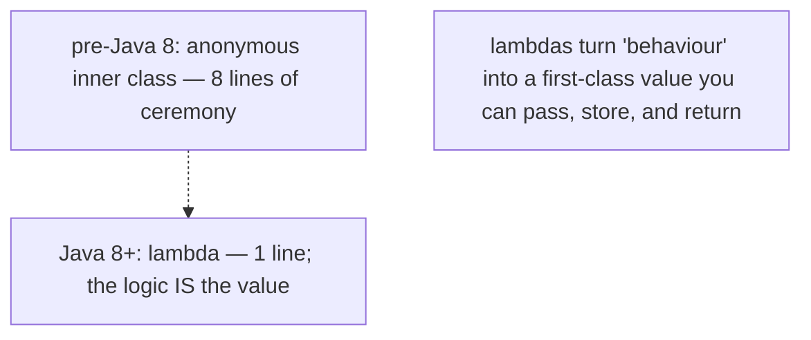

This is **passing behaviour as data**. A lambda is a value of a functional-interface type; you can store it in a variable, pass it to a method, return it from a method, put it in a collection — the same things you do with any object.

## Functional Interfaces — the Type a Lambda Implements

A lambda doesn't float free; it implements a **functional interface** — an interface with **exactly one abstract method** (the "SAM": Single Abstract Method).

```java
@FunctionalInterface
interface Transformer {
    String apply(String input);          // the single abstract method
}

Transformer upper = s -> s.toUpperCase();   // lambda implements apply()
String r = upper.apply("hello");             // "HELLO"
```

The `@FunctionalInterface` annotation is **optional but recommended** — it makes `javac` enforce the single-abstract-method rule (compile error if you add a second abstract method). Without it, the interface still works as a lambda target; the annotation just documents intent and guards against accidental breakage.

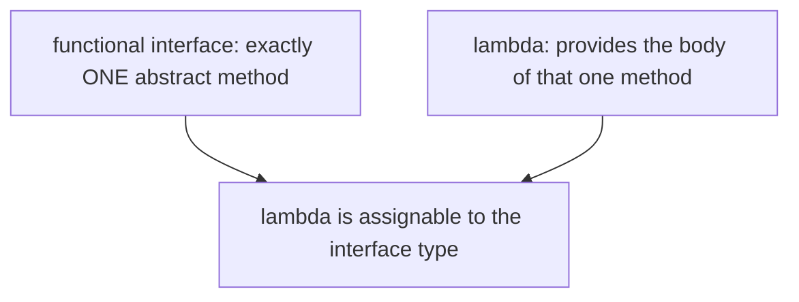

What counts as "one abstract method":

- **`default` methods don't count** — they have bodies.
- **`static` methods don't count** — they're not inherited as abstract.
- **`private` methods (Java 9+) don't count.**
- **Methods inherited from `Object`** (`equals`, `hashCode`, `toString`) **don't count** — a functional interface can declare them without breaking SAM-ness (e.g., `Comparator` declares `equals`).

The JDK ships a rich set of standard functional interfaces — `Function`, `Predicate`, `Supplier`, `Consumer`, `Runnable`, `Callable`, `Comparator`, etc. Full coverage in [T02](./T02-functional-interfaces-function-predicate-supplier-consumer.md). For now: a lambda needs a target functional interface, and the JDK provides most you'll ever need.

## Lambda Syntax — Every Form

The general shape is `parameters -> body`:

```java
// No parameters:
() -> 42
() -> { doSomething(); }

// One parameter (parens optional):
x -> x * 2
(x) -> x * 2

// One parameter with explicit type (parens required):
(int x) -> x * 2

// One parameter with var (Java 11+, parens required; enables annotations):
(var x) -> x * 2
(@NonNull var x) -> x * 2

// Multiple parameters:
(x, y) -> x + y
(int x, int y) -> x + y

// Expression body (implicit return):
(a, b) -> a + b

// Block body (explicit return required for non-void):
(a, b) -> {
    int sum = a + b;
    return sum;
}

// Block body, void:
s -> { System.out.println(s); }
```

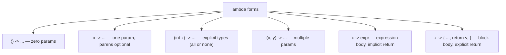

Rules:

- **Parameter types are usually inferred** from the target functional interface. You can write them explicitly, but it's all-or-nothing — either every parameter has a type or none does.
- **`var` parameters (Java 11+)** are all-or-nothing too, and their main use is allowing **annotations** on lambda parameters (`(@NonNull var x) -> ...`).
- **Expression body** (no braces) implicitly returns the expression's value.
- **Block body** (braces) requires an explicit `return` for non-void functional interfaces.
- A lambda **cannot specify a return type** — it's inferred from the body and the target.

## Target Typing — A Lambda Has No Type By Itself

This is the conceptual key. The expression `x -> x * 2` has **no type on its own**. The same lambda text means different things depending on context:

```java
Function<Integer, Integer> f = x -> x * 2;        // Function<Integer,Integer>
IntUnaryOperator g = x -> x * 2;                    // IntUnaryOperator (no boxing!)
ToIntFunction<Integer> h = x -> x * 2;             // ToIntFunction<Integer>
```

The compiler looks at the **target type** (the type expected at the assignment / argument / return position) and checks that the lambda is compatible with that functional interface's single method.

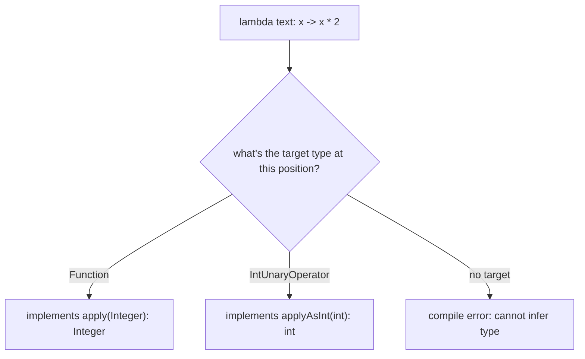

Consequence: a lambda can only appear where a target type is available — an assignment to a functional-interface variable, a method argument of functional-interface type, a return statement in a functional-interface-returning method, a cast (`(Runnable) () -> ...`), or a ternary with a functional-interface target. **A lambda cannot be assigned to `var`** without a cast — there's no target type to infer from:

```java
var f = x -> x * 2;                      // COMPILE ERROR — no target type
var f = (Function<Integer,Integer>) (x -> x * 2);    // OK — cast provides the target
Function<Integer,Integer> f = x -> x * 2;             // OK — declared type is the target
```

### Target Typing Interacts With Overloading

When a method is overloaded with two functional-interface parameters, the compiler must disambiguate. Sometimes it can't:

```java
interface IntToInt { int apply(int x); }
interface StrToStr { String apply(String x); }

void process(IntToInt f) { ... }
void process(StrToStr f) { ... }

process(x -> x);                         // ambiguous? — depends; cast to disambiguate
process((IntToInt) (x -> x));            // explicit
```

The full rules are in JLS §15.27.3; in practice, **cast to the intended type** when overload resolution is ambiguous.

## Variable Capture — Closures

A lambda can use variables from the enclosing scope. There are three kinds:

1. **Local variables** — must be **effectively final** (T15): either declared `final`, or never reassigned after initialisation.
2. **Instance fields** — accessed via the captured enclosing `this`.
3. **Static fields** — accessed directly (no capture needed; they're global).

```java
int factor = 3;                          // effectively final
Function<Integer, Integer> multiply = x -> x * factor;   // captures 'factor'
multiply.apply(5);                       // 15

factor = 4;                              // COMPILE ERROR — factor is captured, can't reassign
```

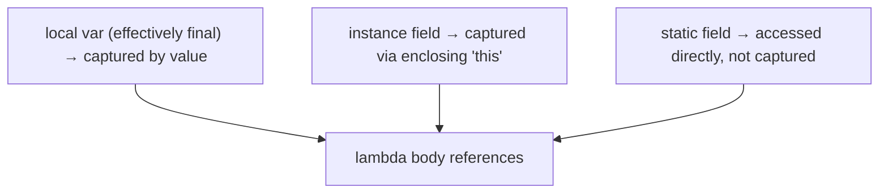

### Why Effectively Final?

A local variable lives in its method's **stack frame** (T15). When the method returns, the frame is gone. But a lambda capturing that local may **outlive** the method (it could be stored in a field, returned, or run later on another thread). So the lambda can't reference the stack slot directly — it **copies** the value at capture time.

If the variable could be reassigned, the lambda's captured copy and the method's live variable would diverge — which value should the lambda see? Java sidesteps the ambiguity by requiring effectively-final: the value never changes, so "copy at capture" and "read live" are equivalent.

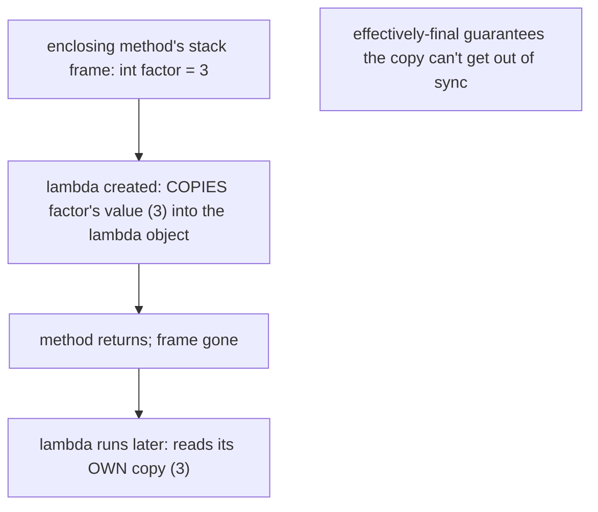

This is the same rule that bit us in T09 (loop-counter capture) and T15. Workaround for "I need a mutable captured value": use a single-element array, an `AtomicInteger`, or a mutable holder object — but be aware of the **concurrency hazard** (mutating captured state from a lambda that runs on another thread is a data race; T12 memory model).

### Capturing `this` — and the Memory-Leak Trap

When a lambda references an instance field or calls an instance method, it captures the **enclosing `this`** — a reference to the whole enclosing object. That keeps the enclosing object alive as long as the lambda lives:

```java
class EventProcessor {
    private final List<String> log = new ArrayList<>();

    Runnable makeTask() {
        return () -> log.add("ran");     // captures 'this' (to reach 'log')
    }
}
```

The returned `Runnable` holds a reference to the `EventProcessor` instance. If that `Runnable` is stored in a long-lived registry, the `EventProcessor` (and its `log`, and everything `log` references) can't be garbage-collected — a **memory leak**. Spot it: any lambda that reads a field or calls a non-static method captures `this`.

To avoid accidental capture, copy the needed field to a local first:

```java
Runnable makeTask() {
    List<String> localLog = this.log;    // local — lambda captures the local, not 'this'
    return () -> localLog.add("ran");
}
```

## Lambdas vs Anonymous Inner Classes — the `this` Difference

This is the most-asked interview distinction. Both can implement a functional interface, but their `this` semantics **differ**:

```java
class Outer {
    int value = 10;

    void anonymous() {
        Runnable r = new Runnable() {
            int value = 20;
            @Override public void run() {
                System.out.println(this.value);          // 20 — 'this' is the anon class
                System.out.println(Outer.this.value);    // 10 — explicit outer
            }
        };
    }

    void lambda() {
        Runnable r = () -> {
            System.out.println(this.value);              // 10 — 'this' is the ENCLOSING Outer
            // there is no separate lambda 'this'
        };
    }
}
```

In an **anonymous inner class**, `this` refers to the **anonymous class instance** — it has its own `this`, its own fields, can shadow. In a **lambda**, `this` refers to the **enclosing instance** — a lambda does **not** introduce a new scope for `this`. The lambda is "transparent" to `this`, `super`, and even labelled `break` targets.

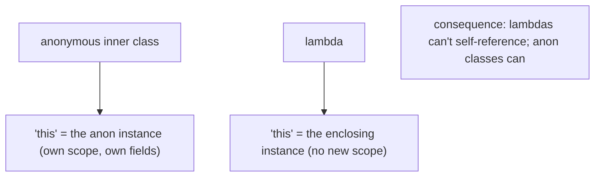

Practical consequences:

- A lambda **cannot reference itself** via `this` (it would mean the enclosing object). For a self-referential anonymous function (recursion), use an anonymous class or a named field.
- A lambda **cannot have instance fields or its own state** beyond captured variables.
- A lambda **cannot shadow** enclosing variable names with parameters (compile error if a lambda parameter has the same name as a captured local).

## Checked Exceptions in Lambdas

A lambda can only throw checked exceptions that its **target functional interface's method declares**. The standard JDK interfaces (`Function`, `Consumer`, etc.) **don't declare checked exceptions**, so a lambda passed to them can't throw them:

```java
Function<String, byte[]> readFile = path -> Files.readAllBytes(Path.of(path));   // COMPILE ERROR
// Files.readAllBytes throws IOException (checked); Function.apply doesn't declare it
```

Three ways out:

1. **Wrap in an unchecked exception** inside the lambda:

```java
Function<String, byte[]> readFile = path -> {
    try {
        return Files.readAllBytes(Path.of(path));
    } catch (IOException e) {
        throw new UncheckedIOException(e);
    }
};
```

2. **Use a custom functional interface that declares the checked exception:**

```java
@FunctionalInterface
interface ThrowingFunction<T, R> {
    R apply(T t) throws Exception;
}
```

3. **Use `Callable`** (which declares `throws Exception`) where appropriate.

Full exception coverage is in L1/C02; the rule for lambdas: the checked exceptions you can throw are exactly those the target method declares.

## Memory Layer — Lambdas Are NOT Anonymous Inner Classes

Now the deep part. The single most common misconception: "a lambda is just shorthand for an anonymous inner class." **It is not.** They compile to completely different bytecode.

### What an Anonymous Inner Class Compiles To

An anonymous inner class generates a **separate `.class` file** at compile time — `Outer$1.class`, `Outer$2.class`, etc. Each is a real class loaded at first use, with a constructor, the captured variables as fields, and the method implementation.

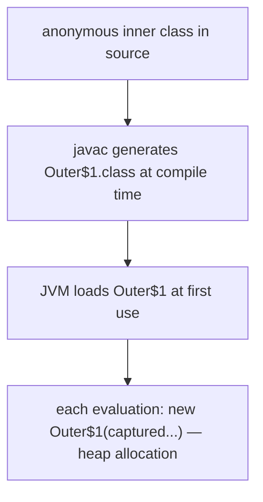

For a program with 50 anonymous classes, you get 50 extra `.class` files — class-loading overhead, metaspace footprint, slower startup.

### What a Lambda Compiles To — `invokedynamic`

A lambda generates **no extra `.class` file at compile time**. Instead, javac emits:

1. A **private synthetic method** in the enclosing class holding the lambda body (named `lambda$methodName$N`).
2. An **`invokedynamic`** instruction at the lambda's use site, linked to a **bootstrap method**: `LambdaMetafactory.metafactory`.

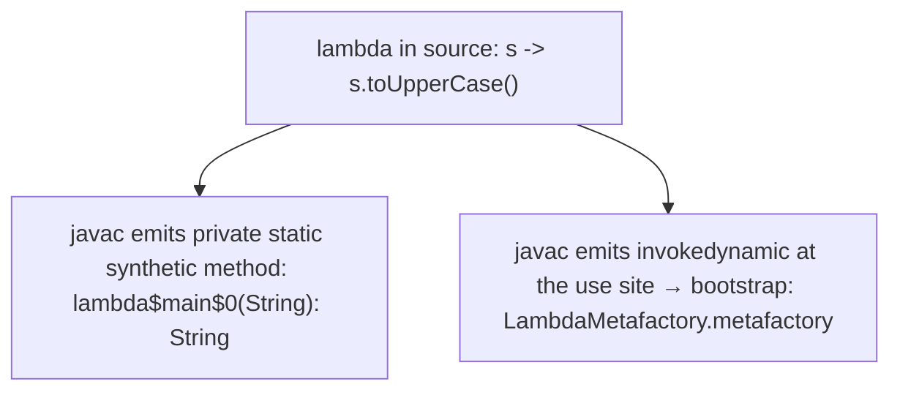

### Worked `javap` — Lambda Bytecode

Source:

```java
public class Demo {
    public static void main(String[] args) {
        Runnable r = () -> System.out.println("hi");
        r.run();
    }
}
```

`javap -c -p Demo`:

```
public static void main(java.lang.String[]);
  Code:
     0: invokedynamic #2,  0    // InvokeDynamic #0:run:()Ljava/lang/Runnable;
     5: astore_1
     6: aload_1
     7: invokeinterface #3,  1  // InterfaceMethod java/lang/Runnable.run:()V
    12: return

private static void lambda$main$0();    // ← the lambda body, as a synthetic method
  Code:
     0: getstatic     #4   // System.out
     3: ldc           #5   // String "hi"
     5: invokevirtual #6   // println
     8: return
```

And the `BootstrapMethods` attribute (from `javap -v`):

```
BootstrapMethods:
  0: #20 REF_invokeStatic java/lang/invoke/LambdaMetafactory.metafactory:
        (Ljava/lang/invoke/MethodHandles$Lookup;Ljava/lang/String;
         Ljava/lang/invoke/MethodType;Ljava/lang/invoke/MethodType;
         Ljava/lang/invoke/MethodHandle;Ljava/lang/invoke/MethodType;)
         Ljava/lang/invoke/CallSite;
    Method arguments:
      #21 ()V
      #22 REF_invokeStatic Demo.lambda$main$0:()V
      #23 ()V
```

Read it: the `invokedynamic` at offset 0 is bound to `LambdaMetafactory.metafactory`, which is told (via the bootstrap method arguments) the functional-interface method signature, a **`MethodHandle`** pointing to `lambda$main$0`, and the instantiated signature. The lambda body lives in `lambda$main$0` — a normal private static method.

### What Happens at Runtime — Bootstrap Once

The **first** time the `invokedynamic` executes:

1. The JVM calls `LambdaMetafactory.metafactory(...)` (the bootstrap method).
2. The metafactory **spins up a hidden class** at runtime that implements `Runnable`, whose `run()` calls `lambda$main$0`.
3. It returns a **`CallSite`** bound to a `MethodHandle` that produces an instance of that hidden class.
4. The `CallSite` is **cached** — linked permanently to this bytecode location.

Every **subsequent** execution skips the bootstrap and uses the cached `CallSite` directly — near-zero overhead.

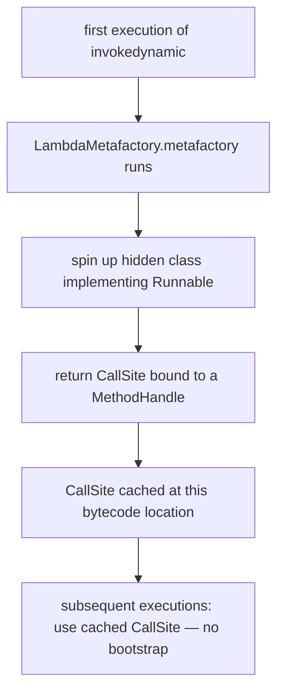

### Non-Capturing Lambdas Are Singletons

A **non-capturing** lambda (one that references no enclosing state) has no per-instance data — every instance is identical. So `LambdaMetafactory` creates **one** instance and **reuses it forever** (stored in a static field of the hidden class). Zero allocation after the first.

```java
Runnable r1 = () -> System.out.println("hi");
Runnable r2 = () -> System.out.println("hi");
System.out.println(r1 == r2);    // often FALSE — different invokedynamic sites
                                  // but within ONE site, the SAME instance is reused every time
```

For one lambda expression in the source evaluated repeatedly (e.g., in a loop), **the same object is returned each iteration** — no allocation. This is a key advantage over anonymous inner classes, which allocate a new object every time.

```mermaid
flowchart TB
  NonCap["non-capturing lambda: () -> println(\"hi\")"]
  NonCap --> Singleton["one instance, reused for every evaluation of THIS site"]
  Singleton --> ZeroAlloc["zero allocation after first"]
  Anon["anonymous inner class equivalent"]
  Anon --> NewEach["new object every evaluation"]
```

### Capturing Lambdas Allocate Per Evaluation

A **capturing** lambda holds its captured values as fields, so each evaluation with different captures needs a new object:

```java
for (int i = 0; i < 1000; i++) {
    final int captured = i;
    Runnable r = () -> System.out.println(captured);   // captures 'captured'
    submit(r);                                          // each r is a DISTINCT object
}
```

1000 distinct lambda objects, each holding its own `captured` value. The metafactory's `MethodHandle` takes the captured values as constructor arguments and produces a fresh instance. Still cheaper than anonymous inner classes (no separate `.class` file; smaller, JIT-friendlier), but not free.

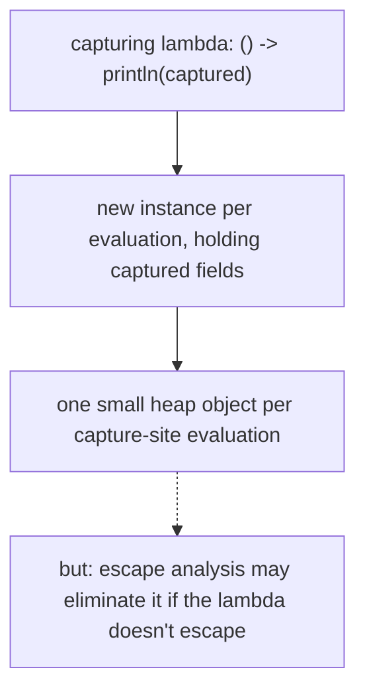

### Hidden Classes (Java 15+, JEP 371)

The mechanism for the runtime-generated lambda class evolved:

- **Pre-Java 15:** lambdas used **VM anonymous classes** via the internal `Unsafe.defineAnonymousClass`. Functional but a hack — these classes had quirky lifecycle and weren't proper JVM citizens.
- **Java 15+ (JEP 371):** lambdas use **hidden classes** — a first-class JVM concept. A hidden class is not discoverable by name, not in any class loader's registry, can be unloaded independently, and is the proper home for runtime-generated classes (lambdas, proxies, etc.).

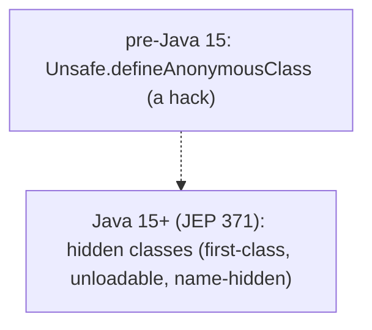

You won't see hidden classes by name in stack traces — they appear as `Demo$$Lambda$1/0x00000008000...` or similar.

### Why `invokedynamic` Instead of Generating Classes at Compile Time

The design (JSR 335) chose `invokedynamic` deliberately:

1. **No compile-time class explosion** — no `Foo$1.class`, `Foo$2.class` per lambda; smaller jars, faster class loading.
2. **Strategy decided at runtime** — the JDK can change *how* lambdas are implemented (singleton sharing, hidden classes, future optimisations) **without recompiling your code**. The bytecode just says "give me a Runnable from this method handle"; the JDK decides how.
3. **Non-capturing singleton optimisation** — only possible because the JDK controls instantiation at runtime.

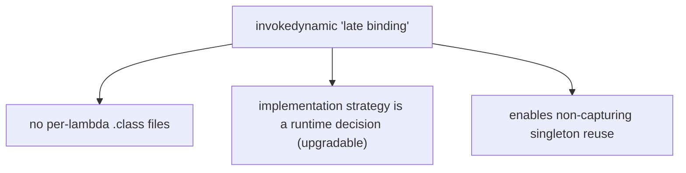

## Architecture Layer — JIT Inlining and the Megamorphic Cliff

### After Warm-Up, Lambdas Are as Fast as Direct Calls

Once the `CallSite` is linked, the lambda invocation is an **interface call** through a `MethodHandle`. The JIT, seeing a hot lambda call site with a **single** receiver type (the hidden class), treats it as **monomorphic** (T12) — it **inlines** the lambda body directly into the caller, eliminating the call entirely. After this, a `stream.map(x -> x * 2)` runs as fast as a hand-written loop with `x * 2` inlined.

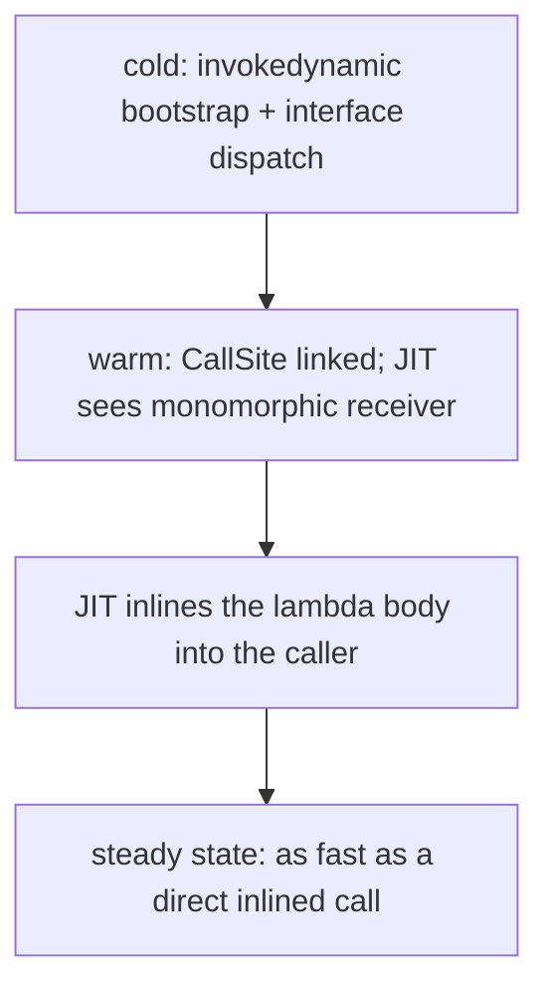

### Escape Analysis Eliminates Capturing-Lambda Allocation

If a capturing lambda **doesn't escape** the method (e.g., it's passed to an inlined stream operation that consumes it locally), **escape analysis** (T15, T17) scalar-replaces it — the captured fields become registers, the object is never heap-allocated. This is why `list.stream().filter(x -> x > threshold).count()` allocates nothing for the lambda in the common case: the lambda is created, consumed, and eliminated, all within the inlined pipeline.

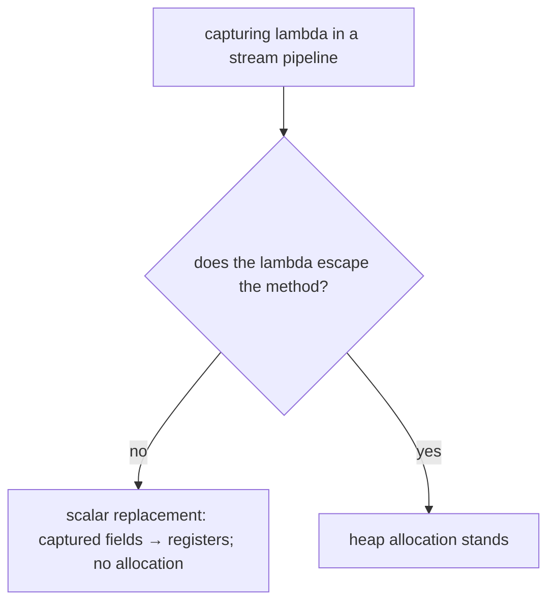

### The Megamorphic Cliff

Here's the perf trap. The JIT inlines a lambda call site only while it sees **few** receiver types (monomorphic = 1, bimorphic = 2). If a **single** stream operation (or any lambda-consuming call site) is reached with **many different lambda implementations**, the call site goes **megamorphic** — the JIT gives up on inlining and falls back to a slow virtual/interface dispatch.

This happens when a **shared utility method** is called with lots of different lambdas:

```java
// A utility used across the codebase with dozens of different lambdas:
static <T, R> List<R> transform(List<T> in, Function<T, R> fn) {
    List<R> out = new ArrayList<>();
    for (T t : in) out.add(fn.apply(t));     // ← THIS call site sees many fn types
    return out;
}
```

If `transform` is called from 50 places with 50 different lambdas, the `fn.apply(t)` call site sees 50 receiver types — megamorphic, no inlining, slow. The fix: let the JIT inline `transform` itself into each caller (so each gets its own monomorphic `fn.apply`), or accept the cost for non-hot paths.

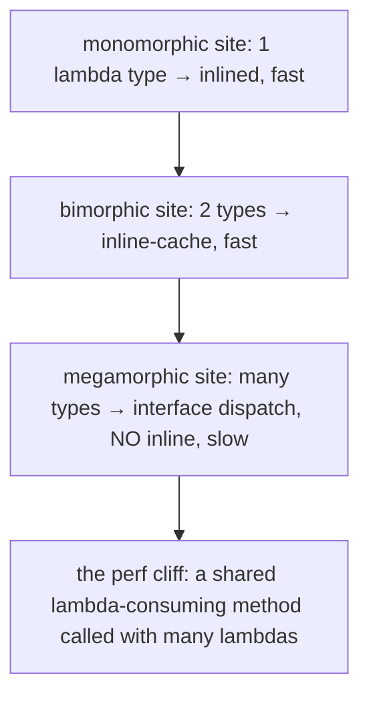

### Comparison to Closures in Other Languages

- **C function pointers** — just a code address; no captured state. A non-capturing Java lambda is similar (one shared instance, a method handle).
- **C++ lambdas** — compile to a unique anonymous struct (closure type) with captured fields as members; allocated on the stack when possible. Java's capturing lambdas are heap objects (subject to EA).
- **JavaScript / Python closures** — capture variables by reference (mutable); Java captures by value (effectively final) to avoid the stack-frame-lifetime problem.

## Common Mistakes

### Thinking Lambdas Are Anonymous Inner Classes

The #1 misconception. They compile to `invokedynamic` + a synthetic method, **not** to a `Foo$1.class`. The `this` semantics differ, the allocation behaviour differs (non-capturing singleton), and there's no extra class file.

### `this` Confusion

In a lambda, `this` is the **enclosing** instance. In an anonymous class, `this` is the **anonymous instance**. Don't expect a lambda to have its own `this`.

### Capturing a Non-Effectively-Final Variable

```java
int count = 0;
Runnable r = () -> System.out.println(count);
count++;                                  // COMPILE ERROR — count is captured
```

Copy to a fresh effectively-final local, or use an `AtomicInteger` / array holder (with concurrency caveats).

### Mutating Captured State (Concurrency Hazard)

```java
int[] sum = {0};
list.forEach(x -> sum[0] += x);          // works single-threaded; DATA RACE if parallel
```

Mutating captured state from a lambda is a data race if the lambda runs concurrently (parallel streams, T06; executors, L3/C01). Use a `Collector` / reduction instead.

### Accidental `this` Capture → Memory Leak

A lambda that reads a field or calls an instance method captures the whole enclosing object. If the lambda is long-lived (stored in a registry, a listener list), the enclosing object leaks. Copy needed fields to locals to avoid capturing `this`.

### Checked Exceptions in Standard Functional Interfaces

The JDK's `Function`/`Consumer`/etc. don't declare checked exceptions. Wrap in unchecked, or use a custom throwing interface.

### Overusing Lambdas — Readability

A 20-line block-body lambda is worse than a named method. Extract complex logic to a method and use a **method reference** (T03). Lambdas shine for short, obvious behaviour.

### The Megamorphic Cliff on Shared Lambda Utilities

A `transform(list, fn)` helper called with dozens of lambdas megamorphises its internal `fn.apply` call site. For hot paths, prefer letting the JIT inline the helper into each caller, or avoid the shared-utility pattern.

### Assuming Lambda Identity

```java
Runnable a = () -> {};
Runnable b = () -> {};
a == b;                                   // unspecified — don't rely on lambda identity
```

Two lambdas (even identical text) at different sites may or may not be the same instance. Never use `==` on lambdas; never use them as map keys expecting identity semantics.

> [!INTERVIEW]
> Lambdas are a top-3 modern-Java interview topic. The deep ones separate candidates.
>
> 1. **What's a lambda?** An anonymous function — an instance of a functional interface, providing the body of its single abstract method.
> 2. **What's a functional interface?** An interface with exactly one abstract method (SAM). `@FunctionalInterface` enforces it.
> 3. **Do lambdas compile to anonymous inner classes?** **No** — they compile to `invokedynamic` + a private synthetic method + a `LambdaMetafactory` bootstrap. No extra `.class` file.
> 4. **What's target typing?** A lambda has no type alone; its type is inferred from the context (the target functional interface).
> 5. **Why must captured locals be effectively final?** The lambda may outlive the method's stack frame; it copies the value at capture; effectively-final guarantees the copy can't diverge from the live variable.
> 6. **`this` in a lambda vs anonymous class?** Lambda `this` = enclosing instance (no new scope); anonymous-class `this` = the anonymous instance.
> 7. **What's the difference in allocation between a non-capturing and a capturing lambda?** Non-capturing = singleton (one reused instance, zero allocation after first). Capturing = a new object per evaluation, holding the captured fields.
> 8. **What's `LambdaMetafactory`?** The bootstrap method `invokedynamic` calls on first execution; it spins up a hidden class implementing the functional interface and returns a cached `CallSite`.
> 9. **What's a hidden class (JEP 371)?** Java 15+ first-class mechanism for runtime-generated classes (lambdas, proxies); name-hidden, independently unloadable. Replaced the old `Unsafe.defineAnonymousClass`.
> 10. **Are lambdas slow?** After warm-up, no — the JIT inlines through the linked `CallSite`. The exception is a **megamorphic** call site (one lambda-consumer seeing many lambda types), which kills inlining.
> 11. **Can a lambda throw checked exceptions?** Only those declared by the target functional interface's method. Standard JDK interfaces don't declare any.
> 12. **Why `invokedynamic` over compile-time classes?** No class explosion; runtime-upgradable strategy; non-capturing singleton optimisation.

## Practice

1. **Three syntaxes.** Write the comparator `(a, b) -> Integer.compare(a.length(), b.length())` as (a) an anonymous inner class, (b) a lambda, (c) a method reference (preview T03). Confirm identical sorting.
2. **Target typing.** Assign `x -> x * 2` to a `Function<Integer,Integer>`, an `IntUnaryOperator`, and a `ToIntFunction<Integer>`. Confirm all compile; note the boxing difference.
3. **`var` rejection.** Try `var f = x -> x;`. Confirm the compile error. Fix with a cast or explicit declared type.
4. **Effectively final.** Capture a local in a lambda, then reassign the local. Observe the compile error. Fix by copying to a fresh local.
5. **`this` semantics.** Reproduce the `Outer`/`anonymous`/`lambda` example. Confirm lambda `this.value` is the outer value; anonymous `this.value` is the anonymous's own.
6. **`javap` the lambda.** Compile `Runnable r = () -> System.out.println("hi");`. Run `javap -c -p`. Find the `invokedynamic`, the synthetic `lambda$main$0` method. Run `javap -v`; find the `BootstrapMethods` attribute referencing `LambdaMetafactory.metafactory`.
7. **No extra class file.** Compile a class with 3 lambdas. Confirm `ls *.class` shows only `Demo.class` — no `Demo$1.class`. Then compile an equivalent with 3 anonymous classes; confirm `Demo$1.class`, `Demo$2.class`, `Demo$3.class` appear.
8. **Non-capturing singleton.** In a loop, evaluate a **non-capturing** lambda `() -> 42` 1M times, storing each into the same variable and recording `System.identityHashCode`. Confirm they're all the same instance (no allocation). Use `-XX:+PrintGC` to confirm no garbage.
9. **Capturing allocation.** Do the same with a **capturing** lambda `() -> i`. Confirm distinct identity hash codes (distinct instances) and GC activity.
10. **Escape analysis.** Run `list.stream().filter(x -> x > t).count()` with `-XX:+UnlockDiagnosticVMOptions -XX:+PrintEliminateAllocations`. Confirm the lambda allocation is eliminated. Then store the lambda in a static field (force escape); confirm allocation reappears.
11. **Megamorphic cliff.** Write `transform(list, fn)` and call it from 1 site with 1 lambda; benchmark. Then call from 10 sites with 10 different lambdas; benchmark the shared call site. Observe the slowdown when the `fn.apply` site goes megamorphic.
12. **Memory leak via `this`.** Create a class that returns a lambda capturing a field; store it in a static list; null the original; force GC; confirm the object survives (via a `WeakReference` tracker). Fix by copying the field to a local.
13. **Checked exception.** Try a lambda calling `Files.readAllBytes` assigned to `Function<String, byte[]>`. Confirm compile error. Fix three ways: wrap in UncheckedIOException; custom throwing interface; Callable.
14. **Overload ambiguity.** Define two overloads taking different functional interfaces; call with an ambiguous lambda; observe the compile error; disambiguate with a cast.
15. **Self-reference impossibility.** Try to write a recursive lambda using `this`. Observe it doesn't work (this = enclosing). Achieve recursion via an anonymous class or a named field holding the function.
16. **Explain it back.** Trace `Runnable r = () -> System.out.println("hi"); r.run();` from source through (a) javac emitting the synthetic method + invokedynamic, (b) first run bootstrapping LambdaMetafactory → hidden class → cached CallSite, (c) the non-capturing singleton, (d) the JIT inlining the run() call after warm-up.

## Recap

You should now be able to:

- Define a **lambda** as an anonymous function — an instance of a **functional interface** (one abstract method, "SAM") providing that method's body.
- Recognise **`@FunctionalInterface`** as the optional-but-recommended annotation that enforces the single-abstract-method rule; recall that `default`/`static`/`private` and `Object` methods don't count toward SAM-ness.
- Write all **lambda syntax forms** — `() -> ...`, `x -> ...`, `(x, y) -> ...`, `(int x) -> ...`, `(var x) -> ...` (Java 11+), expression bodies (implicit return), block bodies (explicit return); recall the all-or-nothing rule for parameter types.
- Apply **target typing** — a lambda has no type by itself; the compiler infers it from the target functional interface at the assignment / argument / return / cast position; a lambda can't be assigned to bare `var`.
- Apply **variable capture** rules — effectively-final locals (captured by value), instance fields (via captured `this`), static fields (direct); explain **why effectively-final** (the lambda may outlive the stack frame, so it copies the value).
- Recognise **accidental `this` capture** as a memory-leak source (a lambda reading a field holds the whole enclosing object alive); avoid by copying fields to locals.
- Distinguish **lambda `this`** (the enclosing instance — no new scope) from **anonymous-inner-class `this`** (the anonymous instance — its own scope, fields, self-reference).
- Recall that a lambda can throw only the **checked exceptions its target method declares**; standard JDK interfaces declare none; work around with unchecked wrapping or a custom throwing interface.
- State the **key memory fact**: lambdas **do NOT** compile to anonymous inner classes. They compile to **`invokedynamic`** + a private **synthetic method** (`lambda$method$N`) + a **`LambdaMetafactory.metafactory`** bootstrap; **no extra `.class` file** at compile time.
- Trace the **runtime mechanism**: first execution bootstraps the metafactory → spins up a **hidden class** (JEP 371, Java 15+) implementing the interface → returns a cached **`CallSite`**; subsequent executions reuse it.
- Distinguish **non-capturing lambdas** (singleton — one reused instance, zero allocation after first) from **capturing lambdas** (a new object per evaluation, holding captured fields).
- Recall **why `invokedynamic`** was chosen — no compile-time class explosion, runtime-upgradable strategy, the non-capturing singleton optimisation.
- Predict the **JIT behaviour**: after warm-up the linked `CallSite` is inlined (lambda is as fast as a direct call); **escape analysis** eliminates non-escaping capturing-lambda allocation; a **megamorphic** call site (one lambda-consumer seeing many lambda types) collapses inlining — the perf cliff.
- Avoid the **common traps**: lambdas-are-anon-classes misconception, `this` confusion, non-effectively-final capture, mutating captured state (data race), accidental `this`-capture leak, checked exceptions in standard interfaces, over-long lambdas, the megamorphic cliff, relying on lambda identity (`==`).

## Next

Continue to [Functional interfaces (Function, Predicate, Supplier, Consumer)](./T02-functional-interfaces-function-predicate-supplier-consumer.md).
