# Functional interfaces (Function, Predicate, Supplier, Consumer)

A **functional interface** is an interface with exactly one abstract method — the type a lambda or method reference implements ([T01](./T01-lambda-expressions.md)). You *can* write your own; you rarely need to, because the JDK ships **43 ready-made functional interfaces** in `java.util.function`, plus the classics `Runnable`, `Callable`, and `Comparator`. This topic is the map: the **four core shapes** (`Function`, `Predicate`, `Supplier`, `Consumer`), their arity and operator variants, the **default/static combinators** that let you compose them, and — the deep part — the **primitive specialisations** (`IntUnaryOperator`, `ToIntFunction`, …) that exist solely to avoid autoboxing.

The depth-bar requirement isn't just "list the interfaces." At the **language** layer, the four shapes are distinguished by **arity** (how many inputs) and **whether they produce a value, a boolean, or nothing**; the combinators (`andThen`, `compose`, `and`, `or`, `negate`) build pipelines from small pieces. At the **memory** layer, the reason the JDK has *43* interfaces rather than *4* is **boxing**: a generic `Function<Integer, Integer>` boxes its input and output through `Integer` objects (T17), while a primitive-specialised `IntUnaryOperator` stays in `int` registers — a difference of **millions of allocations** in a hot loop, and the same reasoning that gave us `IntStream` over `Stream<Integer>`. At the **architecture** layer, a combinator chain like `f.andThen(g).andThen(h)` builds a small graph of wrapper objects; the JIT inlines the whole chain when each call site is **monomorphic**, but a combinator-built function shared across many call sites can go **megamorphic** and lose inlining. We'll cover every layer, with the boxing analysis at byte-level.

> [!NOTE]
> Prerequisites: [Lambda expressions](./T01-lambda-expressions.md) (L2/C01/T01) — what a functional interface *is*, target typing, the `invokedynamic` mechanism; [Wrapper classes & autoboxing](../../L0-foundations/C02-java-core/T17-wrapper-classes-and-autoboxing.md) (L0/C02/T17) — boxing cost, `IntStream` vs `Stream<Integer>`, the `Integer` cache; [Method overloading](../../L0-foundations/C02-java-core/T13-method-overloading.md) (L0/C02/T13) — method descriptors, why `apply` erases differently from `applyAsInt`; [Methods, parameters, return values](../../L0-foundations/C02-java-core/T12-methods-parameters-return-values.md) (L0/C02/T12) — `invokeinterface`, descriptors; [Arrays](../../L0-foundations/C02-java-core/T11-arrays-1-d-multi-dimensional.md) (L0/C02/T11) — for the `IntStream`/array reasoning. Also leans on **generics** (L1/C02) which the parallel session owns — we use `<T, R>` type parameters throughout; the mechanics are covered there.

## The Four Core Shapes

Every functional interface answers two questions: **how many inputs?** and **what comes out?** The four core single-input shapes:

| Interface | Shape | Single abstract method | "Reads as" |
|-----------|-------|------------------------|------------|
| `Function<T, R>` | T → R | `R apply(T t)` | transform a T into an R |
| `Predicate<T>` | T → boolean | `boolean test(T t)` | test a condition on a T |
| `Supplier<T>` | () → T | `T get()` | produce a T from nothing |
| `Consumer<T>` | T → () | `void accept(T t)` | do something with a T, produce nothing |

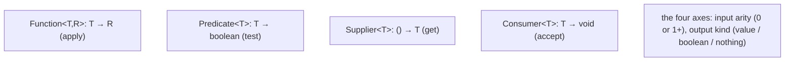

Examples:

```java
Function<String, Integer> length = s -> s.length();           // String → Integer
Predicate<String> isEmpty       = s -> s.isEmpty();           // String → boolean
Supplier<LocalDate> today       = () -> LocalDate.now();      // () → LocalDate
Consumer<String> print          = s -> System.out.println(s); // String → void

length.apply("hello");          // 5
isEmpty.test("");               // true
today.get();                    // 2026-06-04
print.accept("hi");             // prints "hi"
```

**Note the method names differ per shape** — `apply`, `test`, `get`, `accept`. This is deliberate: it lets one class implement several functional interfaces without method-name clashes, and it makes call sites self-documenting (`p.test(x)` reads as a test).

## Arity-2 Variants

For two inputs, the JDK adds `Bi`-prefixed versions:

| Interface | Shape | Method |
|-----------|-------|--------|
| `BiFunction<T, U, R>` | (T, U) → R | `R apply(T t, U u)` |
| `BiPredicate<T, U>` | (T, U) → boolean | `boolean test(T t, U u)` |
| `BiConsumer<T, U>` | (T, U) → void | `void accept(T t, U u)` |

There is **no `BiSupplier`** — a supplier takes no input, so "two inputs" is meaningless. There are no 3-arity interfaces in the JDK; if you need three inputs, write your own functional interface or use a parameter object.

```java
BiFunction<Integer, Integer, Integer> add = (a, b) -> a + b;       // (Int, Int) → Int
BiPredicate<String, Integer> longerThan   = (s, n) -> s.length() > n;
BiConsumer<String, Integer> repeat        = (s, n) -> { for (int i=0;i<n;i++) System.out.print(s); };

add.apply(2, 3);                // 5
longerThan.test("hello", 3);    // true
repeat.accept("ab", 2);         // prints "abab"
```

## Operator Specialisations — When Input and Output Match

When a `Function`'s input and output are the **same type**, the JDK provides shorter names:

| Interface | Equivalent to | Method |
|-----------|---------------|--------|
| `UnaryOperator<T>` | `Function<T, T>` | `T apply(T t)` (inherited) |
| `BinaryOperator<T>` | `BiFunction<T, T, T>` | `T apply(T t1, T t2)` (inherited) |

```java
UnaryOperator<String> shout = s -> s.toUpperCase();        // String → String
BinaryOperator<Integer> max = (a, b) -> a > b ? a : b;     // (Int, Int) → Int
```

`UnaryOperator<T>` **extends** `Function<T, T>` (so it has all of `Function`'s combinators); `BinaryOperator<T>` extends `BiFunction<T, T, T>`. They exist purely as readability sugar — `UnaryOperator<String>` signals "transforms a String into another String" more clearly than `Function<String, String>`. `List.replaceAll(UnaryOperator)` and `Stream.reduce(BinaryOperator)` use them.

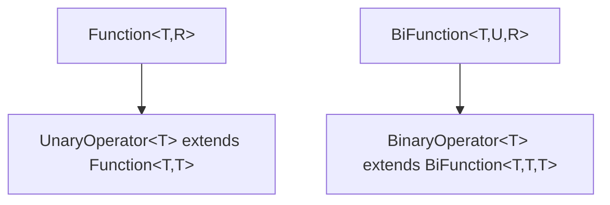

## Combinators — Composing Functional Interfaces

The real power: functional interfaces carry **default and static methods** that build new instances from old ones. This is **combinator-style composition** — small pieces, glued into pipelines.

### `Function` — `andThen`, `compose`, `identity`

```java
Function<Integer, Integer> times2 = x -> x * 2;
Function<Integer, Integer> plus1  = x -> x + 1;

Function<Integer, Integer> a = times2.andThen(plus1);   // plus1(times2(x)) = (x*2)+1
Function<Integer, Integer> b = times2.compose(plus1);   // times2(plus1(x)) = (x+1)*2

a.apply(5);                     // 11
b.apply(5);                     // 12

Function<String, String> id = Function.identity();      // x -> x
```

- **`andThen(after)`** — apply *this* first, then `after`: `after(this(x))`.
- **`compose(before)`** — apply `before` first, then *this*: `this(before(x))`.
- **`identity()`** (static) — returns `t -> t`. Useful as a no-op in stream collectors (`Collectors.toMap(k -> k, Function.identity())`).

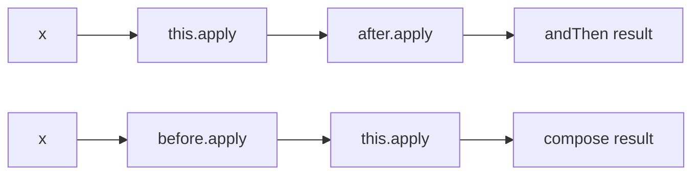

> [!IMPORTANT]
> `andThen` and `compose` differ only in **order**. `f.andThen(g)` runs `f` then `g`; `f.compose(g)` runs `g` then `f`. Memorise: **andThen = this-then-other**; **compose = other-then-this** (like maths `f ∘ g`).

### `Predicate` — `and`, `or`, `negate`, `isEqual`, `not`

```java
Predicate<String> notEmpty = s -> !s.isEmpty();
Predicate<String> shortStr = s -> s.length() < 10;

Predicate<String> valid = notEmpty.and(shortStr);       // both
Predicate<String> any   = notEmpty.or(shortStr);        // either
Predicate<String> empty = notEmpty.negate();            // NOT

Predicate<String> isFoo = Predicate.isEqual("foo");     // x -> Objects.equals("foo", x)
Predicate<String> notBlank = Predicate.not(String::isBlank);   // Java 11+
```

- **`and(other)`** / **`or(other)`** — short-circuiting logical AND/OR (T04 callback — same short-circuit semantics as `&&`/`||`).
- **`negate()`** — logical NOT of *this*.
- **`isEqual(target)`** (static) — `x -> Objects.equals(target, x)`.
- **`not(predicate)`** (static, Java 11+) — negates the *argument*. The key use is with **method references**, where `.negate()` can't be chained: `Predicate.not(String::isBlank)` reads better than `((Predicate<String>) String::isBlank).negate()`.

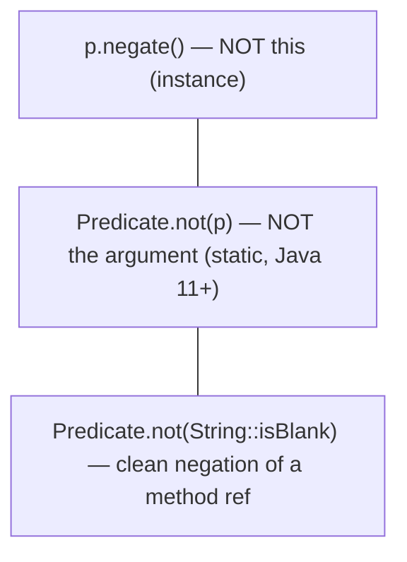

### `Consumer` — `andThen`

```java
Consumer<String> log   = s -> logger.info(s);
Consumer<String> print = s -> System.out.println(s);

Consumer<String> both = log.andThen(print);     // run log, then print, on the SAME input
both.accept("event");                            // logs AND prints "event"
```

`Consumer.andThen` runs *this* consumer, then `after`, **on the same input** — useful for fan-out side effects. There's no `compose` (a consumer produces nothing to feed forward).

### `Supplier` — No Combinators

`Supplier<T>` has only `get()`. There's nothing to compose (no input, and "andThen" would just be `andThen(Function)`, which would make it a `Function` anyway). If you want "supply then transform," do `() -> fn.apply(supplier.get())`.

### `BinaryOperator` — `minBy`, `maxBy`

```java
BinaryOperator<String> shorter = BinaryOperator.minBy(Comparator.comparingInt(String::length));
shorter.apply("hello", "hi");     // "hi"
```

`minBy(comparator)` / `maxBy(comparator)` build a `BinaryOperator` that returns the smaller/larger of two arguments per the comparator. Used with `Stream.reduce`.

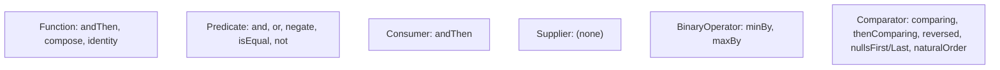

## The Primitive Specialisations — and Why There Are 43 Interfaces

Here's the deep part. Generics in Java can only parameterise over **reference types**, not primitives (T17, L1/C02 erasure). So `Function<Integer, Integer>` works with `Integer` objects — and every call **boxes** the input and output through the wrapper. For a hot numeric loop, that's catastrophic (T17's #1 perf trap). The JDK's answer: **primitive-specialised functional interfaces** that operate directly on `int`/`long`/`double`.

### The Full Specialisation Matrix

The combinatorial structure: **{ no boxing on input } × { no boxing on output } × { which primitive } × { arity }** produces dozens of interfaces. Grouped:

**Suppliers (produce a primitive):**

| Interface | Method |
|-----------|--------|
| `IntSupplier` | `int getAsInt()` |
| `LongSupplier` | `long getAsLong()` |
| `DoubleSupplier` | `double getAsDouble()` |
| `BooleanSupplier` | `boolean getAsBoolean()` |

**Consumers (consume a primitive):**

| Interface | Method |
|-----------|--------|
| `IntConsumer` | `void accept(int)` |
| `LongConsumer` | `void accept(long)` |
| `DoubleConsumer` | `void accept(double)` |

**Predicates (test a primitive):**

| Interface | Method |
|-----------|--------|
| `IntPredicate` | `boolean test(int)` |
| `LongPredicate` | `boolean test(long)` |
| `DoublePredicate` | `boolean test(double)` |

**Functions — primitive input, object output:**

| Interface | Method |
|-----------|--------|
| `IntFunction<R>` | `R apply(int)` |
| `LongFunction<R>` | `R apply(long)` |
| `DoubleFunction<R>` | `R apply(double)` |

**Functions — object input, primitive output ("To" projections):**

| Interface | Method |
|-----------|--------|
| `ToIntFunction<T>` | `int applyAsInt(T)` |
| `ToLongFunction<T>` | `long applyAsLong(T)` |
| `ToDoubleFunction<T>` | `double applyAsDouble(T)` |

**Functions — primitive-to-primitive cross-conversions:**

| Interface | Method |
|-----------|--------|
| `IntToLongFunction` | `long applyAsLong(int)` |
| `IntToDoubleFunction` | `double applyAsDouble(int)` |
| `LongToIntFunction` | `int applyAsInt(long)` |
| `LongToDoubleFunction` | `double applyAsDouble(long)` |
| `DoubleToIntFunction` | `int applyAsInt(double)` |
| `DoubleToLongFunction` | `long applyAsLong(double)` |

**Unary operators (primitive → same primitive):**

| Interface | Method |
|-----------|--------|
| `IntUnaryOperator` | `int applyAsInt(int)` |
| `LongUnaryOperator` | `long applyAsLong(long)` |
| `DoubleUnaryOperator` | `double applyAsDouble(double)` |

**Binary operators (two primitives → same primitive):**

| Interface | Method |
|-----------|--------|
| `IntBinaryOperator` | `int applyAsInt(int, int)` |
| `LongBinaryOperator` | `long applyAsLong(long, long)` |
| `DoubleBinaryOperator` | `double applyAsDouble(double, double)` |

**Object + primitive consumers, and bi-projections:**

| Interface | Method |
|-----------|--------|
| `ObjIntConsumer<T>` | `void accept(T, int)` |
| `ObjLongConsumer<T>` | `void accept(T, long)` |
| `ObjDoubleConsumer<T>` | `void accept(T, double)` |
| `ToIntBiFunction<T, U>` | `int applyAsInt(T, U)` |
| `ToLongBiFunction<T, U>` | `long applyAsLong(T, U)` |
| `ToDoubleBiFunction<T, U>` | `double applyAsDouble(T, U)` |

That's the ~43. The JDK pre-generated the **common** primitive specialisations (mostly `int`/`long`/`double`, the types `IntStream`/`LongStream`/`DoubleStream` use) and skipped the rare ones (`byte`, `short`, `char`, `float` specialisations don't exist — you'd box or widen).

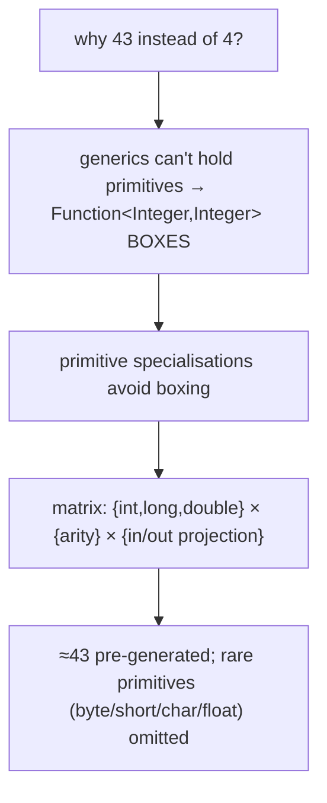

### The Boxing Cost — Byte-Level

Take `x -> x + 1` two ways:

```java
Function<Integer, Integer> boxed = x -> x + 1;
IntUnaryOperator         primitive = x -> x + 1;
```

The lambda body for `boxed` (T01: a synthetic method) has descriptor `(Ljava/lang/Integer;)Ljava/lang/Integer;`:

```
lambda$boxed$0(Integer):Integer
  aload_0
  invokevirtual Integer.intValue:()I    // UNBOX input
  iconst_1
  iadd
  invokestatic Integer.valueOf:(I)Ljava/lang/Integer;   // BOX result
  areturn
```

The body for `primitive` has descriptor `(I)I`:

```
lambda$primitive$1(int):int
  iload_0
  iconst_1
  iadd
  ireturn                                // no boxing at all
```

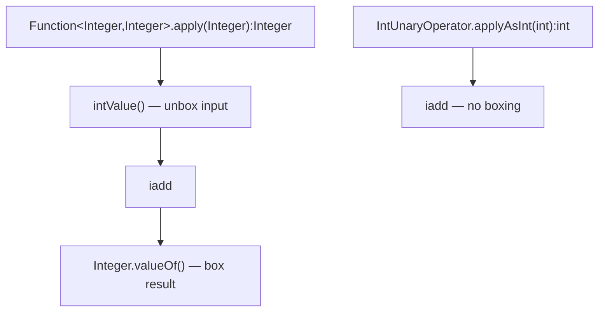

For one call the cost is ~one `Integer.valueOf` (often cached for small values, T17). For a **stream of 1,000,000 ints**:

```java
// Boxed path — ~2 million Integer allocations:
IntStream.range(0, 1_000_000)
    .boxed()                              // 1M Integers allocated
    .map(x -> x + 1)                      // Function<Integer,Integer>: rebox each result → 1M more
    .mapToInt(Integer::intValue)
    .sum();

// Primitive path — ZERO allocations:
IntStream.range(0, 1_000_000)
    .map(x -> x + 1)                      // IntUnaryOperator: stays in int
    .sum();
```

The boxed path allocates ~2 million `Integer` objects (~32 MB of garbage); the primitive path allocates **nothing**. ~10–50× throughput difference — the same lesson as `IntStream` vs `Stream<Integer>` (T17), now at the functional-interface level.

> [!IMPORTANT]
> **Use the primitive specialisation in hot numeric code.** `IntUnaryOperator` not `Function<Integer,Integer>`; `ToIntFunction<T>` not `Function<T,Integer>`; `IntPredicate` not `Predicate<Integer>`. The JIT's escape analysis (T01/T15) eliminates *some* boxing, but not reliably across stream boundaries — don't rely on it for hot paths.

## The Legacy / Other Functional Interfaces

Three predate `java.util.function` (or live elsewhere) but are functional interfaces and work with lambdas:

### `Runnable` (`java.lang`)

```java
@FunctionalInterface
public interface Runnable { void run(); }
```

`() → void`, no checked exceptions. Used for threads (L3/C01) and `ExecutorService.execute`. Functionally identical to a `Consumer` with no input — but predates the framework.

### `Callable<V>` (`java.util.concurrent`)

```java
@FunctionalInterface
public interface Callable<V> { V call() throws Exception; }
```

`() → V`, **declares `throws Exception`** — the difference from `Supplier<V>`. Use `Callable` when the work can throw checked exceptions (T01's checked-exception workaround); `Supplier` when it can't. Used with `ExecutorService.submit` and `Future` (L3/C01).

### `Comparator<T>` (`java.util`)

```java
@FunctionalInterface
public interface Comparator<T> { int compare(T a, T b); }
```

One abstract method (`compare`) — so it's a functional interface despite having **many** default/static methods. The combinators are the workhorse of modern sorting:

```java
List<Person> people = ...;

people.sort(Comparator.comparing(Person::lastName)            // by last name
        .thenComparing(Person::firstName)                     // tie-break by first
        .thenComparingInt(Person::age)                         // then by age (primitive, no boxing)
        .reversed());                                          // descending

Comparator.naturalOrder();          // T's compareTo
Comparator.reverseOrder();          // reversed natural
Comparator.nullsFirst(cmp);         // nulls sort first
Comparator.nullsLast(cmp);          // nulls sort last
```

- **`comparing(keyExtractor)`** (static) — takes a `Function<T, U extends Comparable>` and builds a comparator that compares by the extracted key.
- **`comparingInt`/`comparingLong`/`comparingDouble`** — primitive-key variants (avoid boxing the key — same lesson again).
- **`thenComparing`** — secondary sort key for ties.
- **`reversed`**, **`nullsFirst`**, **`nullsLast`**, **`naturalOrder`**, **`reverseOrder`**.

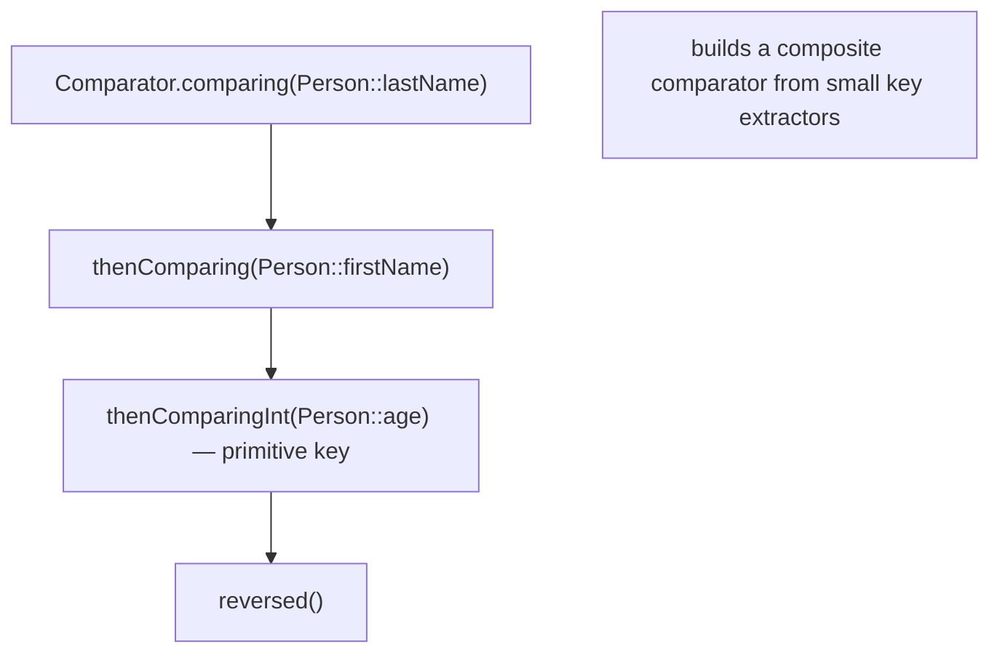

## Memory Layer — Same Lambda Mechanism, Different Descriptors

These interfaces don't change the lambda machinery from T01 — every lambda still becomes `invokedynamic` + a synthetic method + a `LambdaMetafactory` bootstrap producing a hidden class. The only memory-relevant difference between a generic and a primitive specialisation is the **method descriptor** of the synthetic method and the interface method:

| Interface method | Descriptor | Boxing |
|------------------|------------|--------|
| `Function.apply(Object):Object` | `(Ljava/lang/Object;)Ljava/lang/Object;` | input + output boxed (erased to Object) |
| `IntUnaryOperator.applyAsInt(int):int` | `(I)I` | none |
| `ToIntFunction.applyAsInt(Object):int` | `(Ljava/lang/Object;)I` | input boxed, output primitive |
| `IntFunction.apply(int):Object` | `(I)Ljava/lang/Object;` | input primitive, output boxed |
| `Predicate.test(Object):boolean` | `(Ljava/lang/Object;)Z` | input boxed |
| `IntPredicate.test(int):boolean` | `(I)Z` | none |

Because generics **erase** to `Object` (L1/C02), `Function<Integer, Integer>` is really `Function` with `apply(Object):Object` at the bytecode level — the `Integer` type parameter exists only at compile time. So the runtime *always* deals in `Object` references for generic functional interfaces, which is exactly why boxing is unavoidable there.

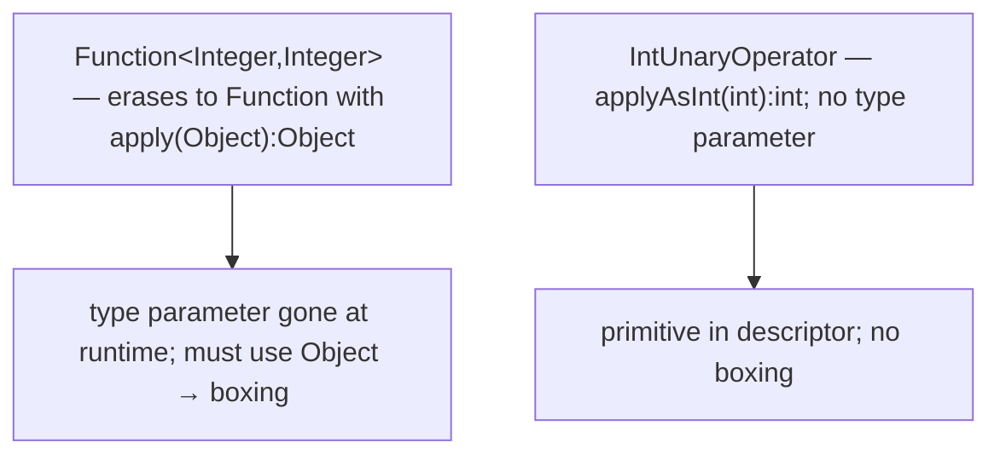

## Architecture Layer — Combinator Object Graphs and Inlining

### Each Combinator Allocates a Wrapper

`f.andThen(g)` doesn't fuse `f` and `g` into one function — it returns a **new** function (a lambda inside the `andThen` default method) that *holds references* to `f` and `g` and calls them in sequence:

```java
// Inside Function.andThen:
default <V> Function<T,V> andThen(Function<? super R, ? extends V> after) {
    return (T t) -> after.apply(this.apply(t));    // a NEW capturing lambda
}
```

So `times2.andThen(plus1).andThen(toStr)` builds a small object graph:

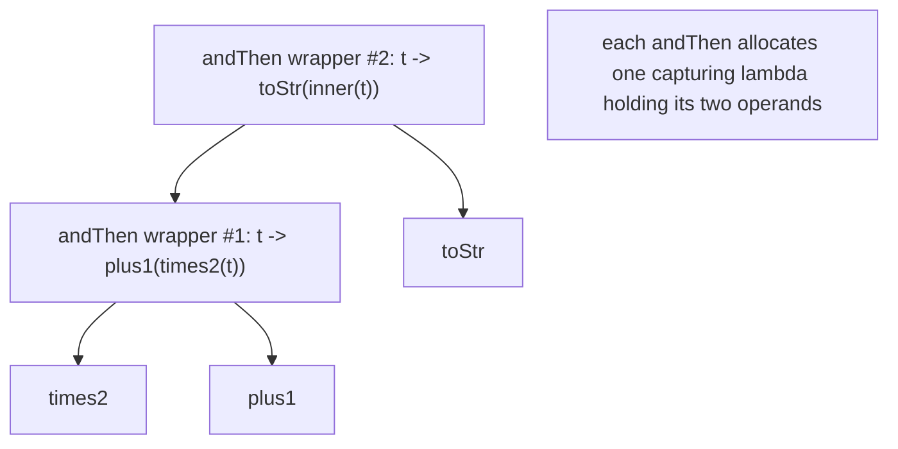

Two `andThen` calls = two extra capturing-lambda objects. For a one-time pipeline this is negligible; building a combinator chain **inside a hot loop** allocates per iteration — hoist the composed function out of the loop.

### The JIT Inlines Monomorphic Chains

When a composed function is invoked at a **monomorphic** call site (one receiver type), the JIT inlines `andThen`'s wrapper, then inlines `this.apply` and `after.apply` through *their* call sites — collapsing the whole chain into straight-line code. After warm-up, `times2.andThen(plus1).apply(x)` runs as fast as `(x*2)+1` inlined.

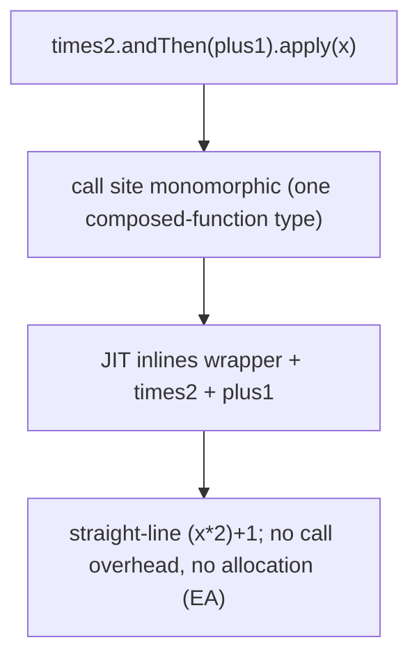

### The Megamorphic Risk (T01 callback)

If you store many different composed functions and feed them all through one shared call site (e.g., a `Map<String, Function<Req, Resp>>` of handlers all invoked at `handler.apply(req)`), that call site sees many receiver types → **megamorphic** → no inlining → slow interface dispatch per call. The fix is the same as T01: keep hot lambda-consuming call sites monomorphic, or accept the cost on non-hot paths.

### Why the JDK Chose Pre-Generated Interfaces Over Generic Boxing

Java *could* have shipped only `Function`, `Predicate`, `Supplier`, `Consumer` and let primitives box. It chose 43 interfaces instead because:

1. **Numeric stream throughput** would be unacceptable with mandatory boxing (T17's 10–50× penalty).
2. **No language-level value-type generics** existed (Project Valhalla, still incubating, will eventually allow `Function<int, int>`-style specialisation generically and may retire the hand-written 43).
3. **The cost is borne once by the JDK authors**, not by every user.

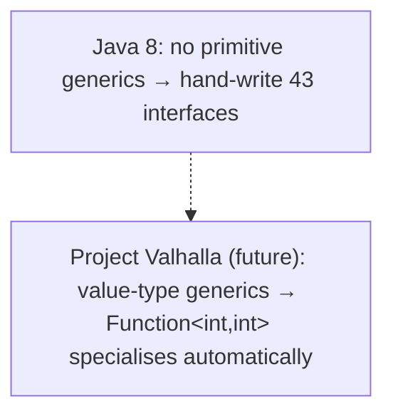

## Common Mistakes

### Using Boxed `Function<Integer, Integer>` in Hot Loops

The biggest one. `Function<Integer, Integer>` boxes; `IntUnaryOperator` doesn't. In a stream over a million ints, that's ~2M wasted allocations. Use the primitive specialisation. Same for `Predicate<Integer>` → `IntPredicate`, `Function<T, Integer>` → `ToIntFunction<T>`.

### Confusing `Supplier` with `Function`

`Supplier<T>` takes **no** input and produces a T (`get()`). `Function<T, R>` takes a T and produces an R (`apply`). If you find yourself ignoring a `Function`'s argument (`x -> constant`), you probably want a `Supplier`.

### Expecting `Consumer` to Return a Value

`Consumer` returns `void` — you can't chain its result into a `Function`. If you need "do something AND produce a value," use `Function` (and perform the side effect inside, though that's often a smell).

### `andThen` vs `compose` Order

`f.andThen(g)` = g-after-f; `f.compose(g)` = f-after-g. Mixing them up reverses your pipeline. Memorise: **andThen runs *this* first**.

### `Predicate.negate()` vs `Predicate.not()`

`p.negate()` negates the instance `p`. `Predicate.not(p)` (static, Java 11+) negates its argument — the only clean way to negate a **method reference** (`Predicate.not(String::isBlank)`), since you can't call `.negate()` on a bare method ref without a cast.

### `Function<T, Boolean>` Instead of `Predicate<T>`

`Function<T, Boolean>` boxes the boolean to `Boolean` and lacks `and`/`or`/`negate`. Use `Predicate<T>` — it's primitive-boolean and composable.

### Stateful Functional Interfaces Across Threads

```java
int[] counter = {0};
Consumer<String> count = s -> counter[0]++;       // mutable captured state
list.parallelStream().forEach(count);             // DATA RACE
```

A functional interface that mutates captured state is a data race under parallel streams (T06) or executors (L3/C01). Keep them stateless; use reductions/collectors for accumulation.

### Forgetting `BiFunction` Has No `compose`

`BiFunction` has `andThen` but not `compose` — composing "before" would require a function that produces two arguments, which has no general form. Only `andThen` (transform the single result) is available.

### Reinventing Standard Interfaces

```java
@FunctionalInterface interface StringTransformer { String transform(String s); }  // = UnaryOperator<String>
```

Before writing a custom functional interface, check `java.util.function` — `UnaryOperator<String>` already exists. Write your own only when you need a **checked-exception** declaration, **three+ parameters**, or a **primitive combination the JDK didn't pre-generate**.

> [!INTERVIEW]
> Functional interfaces are bread-and-butter modern-Java interview material.
>
> 1. **Name the four core functional interfaces and their methods.** `Function<T,R>`/`apply`, `Predicate<T>`/`test`, `Supplier<T>`/`get`, `Consumer<T>`/`accept`.
> 2. **Difference between `Supplier` and `Callable`?** Both produce a value with no input; `Callable.call()` declares `throws Exception` (checked), `Supplier.get()` doesn't.
> 3. **`Function.andThen` vs `compose`?** `f.andThen(g)` = `g(f(x))` (this first); `f.compose(g)` = `f(g(x))` (other first).
> 4. **Why does the JDK have ~43 functional interfaces?** Generics can't hold primitives → boxing; the primitive specialisations (`IntUnaryOperator`, `ToIntFunction`, …) avoid it.
> 5. **What's the difference between `Function<Integer,Integer>` and `IntUnaryOperator`?** The former boxes input and output (`apply(Object):Object` after erasure); the latter is `applyAsInt(int):int`, no boxing.
> 6. **When would you write a custom functional interface?** Checked exceptions, 3+ parameters, or a primitive combination not in `java.util.function`.
> 7. **What's `UnaryOperator`?** `Function<T,T>` — input and output same type. `BinaryOperator` = `BiFunction<T,T,T>`.
> 8. **`Predicate.negate()` vs `Predicate.not()`?** `negate()` negates the instance; `not()` (static, Java 11+) negates its argument — clean for method references.
> 9. **Is `Comparator` a functional interface?** Yes — one abstract method (`compare`); the many `default`/`static` methods don't count toward SAM.
> 10. **Why is `Function<T, Boolean>` worse than `Predicate<T>`?** Boxes the boolean and lacks `and`/`or`/`negate`.
> 11. **Does `andThen` fuse functions or wrap them?** It allocates a new capturing lambda holding both operands; the JIT inlines the chain when monomorphic.
> 12. **What's the runtime difference between `BiSupplier` and `Supplier`?** `BiSupplier` doesn't exist — a supplier takes no input, so two-arity is meaningless.

## Practice

1. **The four shapes.** Write a `Function`, `Predicate`, `Supplier`, and `Consumer` for `String`; call each with its method name (`apply`/`test`/`get`/`accept`).
2. **andThen vs compose.** With `times2` and `plus1`, compute `times2.andThen(plus1).apply(5)` and `times2.compose(plus1).apply(5)`. Predict 11 and 12; verify.
3. **Predicate combinators.** Build `notEmpty.and(shortStr).or(startsWithA)`. Test on several strings; confirm short-circuit by adding a `println` side effect.
4. **`Predicate.not` with a method reference.** Filter a list keeping non-blank strings using `Predicate.not(String::isBlank)`. Compare to the `.negate()` form (which needs a cast).
5. **Boxing bytecode.** Compile `Function<Integer,Integer> f = x -> x+1;` and `IntUnaryOperator g = x -> x+1;`. `javap -c -p`; find the synthetic methods. Confirm `f`'s has `intValue` + `Integer.valueOf`; `g`'s has only `iadd`.
6. **Boxing benchmark.** Sum `x -> x*2` over 10M ints two ways: `IntStream.range(...).map(...)` (IntUnaryOperator) vs `.boxed().map(Function<Integer,Integer>).mapToInt(...)`. Measure; observe ~10–50× difference and GC pressure (`-verbose:gc`).
7. **Custom throwing interface.** Write `@FunctionalInterface ThrowingFunction<T,R> { R apply(T t) throws Exception; }` and use it to wrap `Files.readAllBytes`. Compare to the unchecked-wrap approach (T01).
8. **Comparator chain.** Sort a `List<Person>` by last name, then first name, then age (use `thenComparingInt` for age — primitive). Then `.reversed()`. Verify ordering.
9. **`Comparator.comparing` primitive vs boxed.** Sort by `comparingInt(Person::age)` vs `comparing(Person::getAge)` (boxed). `javap`/profile the key-extraction difference.
10. **Combinator allocation.** Build `f.andThen(g).andThen(h)` inside a 1M-iteration loop (wrong) vs hoisted out (right). Measure allocation with `-XX:+PrintGC`; confirm the in-loop version allocates per iteration.
11. **Identity in a collector.** Use `Collectors.toMap(Person::id, Function.identity())` to build an id→person map. Confirm `Function.identity()` returns `t -> t`.
12. **`BinaryOperator.minBy`.** Reduce a stream of strings to the shortest using `Stream.reduce(BinaryOperator.minBy(comparingInt(String::length)))`.
13. **Consumer fan-out.** Build `log.andThen(audit).andThen(print)`; call once; confirm all three run on the same input in order.
14. **Stateful-consumer race.** Mutate a captured `int[]` from a `Consumer` in a `parallelStream().forEach`; observe a wrong total (data race). Fix with a `Collectors`/reduction.
15. **Megamorphic functional call site.** Put 10 different `Function<Req,Resp>` in a map; invoke all through one shared `handler.apply(req)` loop; benchmark vs invoking one repeatedly. Observe the megamorphic slowdown.
16. **Explain it back.** Trace `IntStream.range(0,N).map(x -> x+1).sum()` vs `...boxed().map(x -> x+1).mapToInt(Integer::intValue).sum()`: which functional interface each `map` takes (`IntUnaryOperator` vs `Function<Integer,Integer>`), where boxing happens, and the allocation count for each.

## Recap

You should now be able to:

- Recall the **four core functional-interface shapes** — `Function<T,R>` (`apply`, T→R), `Predicate<T>` (`test`, T→boolean), `Supplier<T>` (`get`, ()→T), `Consumer<T>` (`accept`, T→void) — distinguished by **input arity** and **output kind**, with **distinct method names**.
- Recall the **arity-2 variants** (`BiFunction`, `BiPredicate`, `BiConsumer`; no `BiSupplier`) and the **operator specialisations** (`UnaryOperator<T>` = `Function<T,T>`; `BinaryOperator<T>` = `BiFunction<T,T,T>`).
- Compose with **combinators**: `Function.andThen`/`compose`/`identity` (andThen = this-first; compose = other-first); `Predicate.and`/`or`/`negate`/`isEqual`/`not` (static `not` for method references); `Consumer.andThen`; `BinaryOperator.minBy`/`maxBy`.
- Explain **why the JDK has ~43 functional interfaces** — generics can't hold primitives, so generic interfaces box; the **primitive specialisations** (`IntUnaryOperator`, `ToIntFunction`, `IntPredicate`, `IntSupplier`, `IntConsumer`, `IntFunction`, the cross-conversions, the binary/unary operators, the `Obj*Consumer`s) avoid it.
- Quantify the **boxing cost**: `Function<Integer,Integer>` is `apply(Object):Object` after erasure — its lambda body does `intValue` + `Integer.valueOf` per call; `IntUnaryOperator` is `applyAsInt(int):int` with no boxing. Over a 1M-element stream, the boxed path allocates ~2M `Integer`s; the primitive path allocates **zero**.
- Choose the **primitive specialisation in hot numeric code** — `IntUnaryOperator` not `Function<Integer,Integer>`, `ToIntFunction<T>` not `Function<T,Integer>`, `IntPredicate` not `Predicate<Integer>`, `comparingInt` not `comparing` on an int key.
- Use the **legacy/other functional interfaces** — `Runnable` (()→void), `Callable<V>` (()→V `throws Exception` — vs `Supplier` which can't throw checked), and `Comparator<T>` (one abstract `compare`; rich `comparing`/`thenComparing`/`reversed`/`nullsFirst`/`naturalOrder` combinators).
- Confirm at the **memory** layer that functional interfaces don't change the lambda mechanism (still `invokedynamic` + synthetic method + hidden class, T01) — the only difference is the **method descriptor** (`(Ljava/lang/Object;)Ljava/lang/Object;` for generics vs `(I)I` for primitives) and the **erasure** that forces generic interfaces to deal in `Object` (hence boxing).
- Predict the **architecture** behaviour: each combinator (`andThen`/`compose`) **allocates a wrapper** capturing its operands; the JIT **inlines** the whole chain when monomorphic (chain runs as fast as straight-line code); a combinator-built function fed through a **shared call site with many types** goes **megamorphic** and loses inlining.
- Recall **why the JDK pre-generated 43 interfaces** rather than boxing — numeric-stream throughput; no value-type generics yet (Project Valhalla will eventually generalise this).
- Avoid the **common traps**: boxed `Function<Integer,Integer>` in hot loops, `Supplier`/`Function` confusion, expecting `Consumer` to return a value, `andThen`/`compose` order mix-up, `negate()` vs static `not()`, `Function<T,Boolean>` instead of `Predicate<T>`, stateful interfaces across threads (data race), expecting `BiFunction.compose`, reinventing standard interfaces.

## Next

Continue to [Method & constructor references](./T03-method-and-constructor-references.md).
