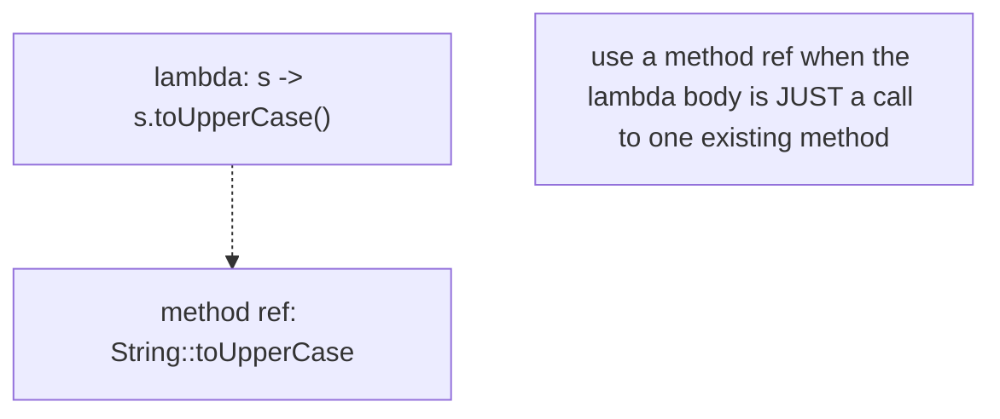
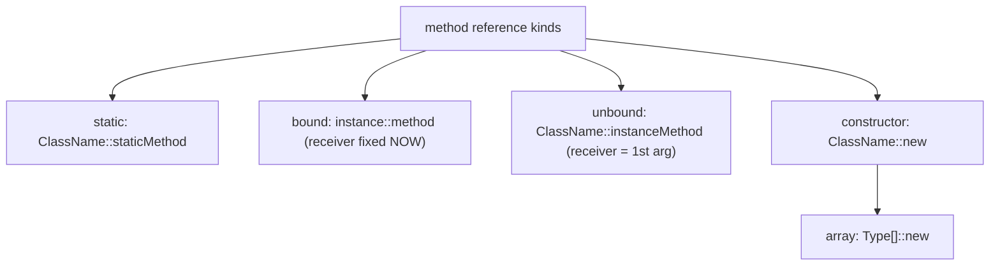
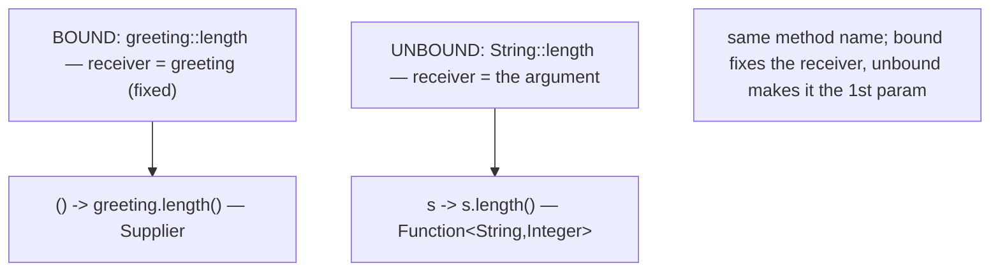
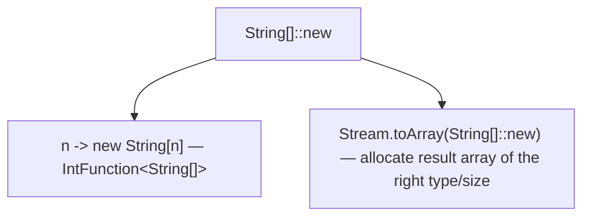
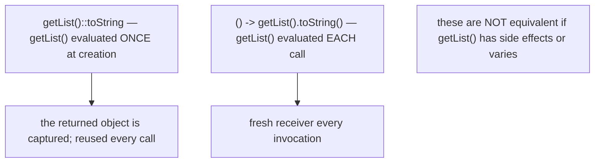
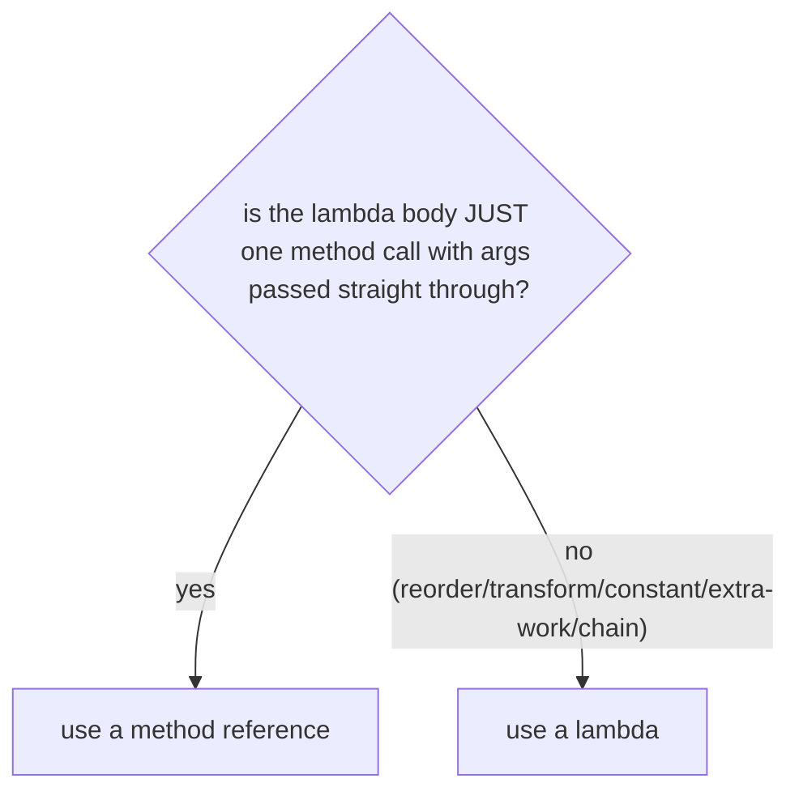
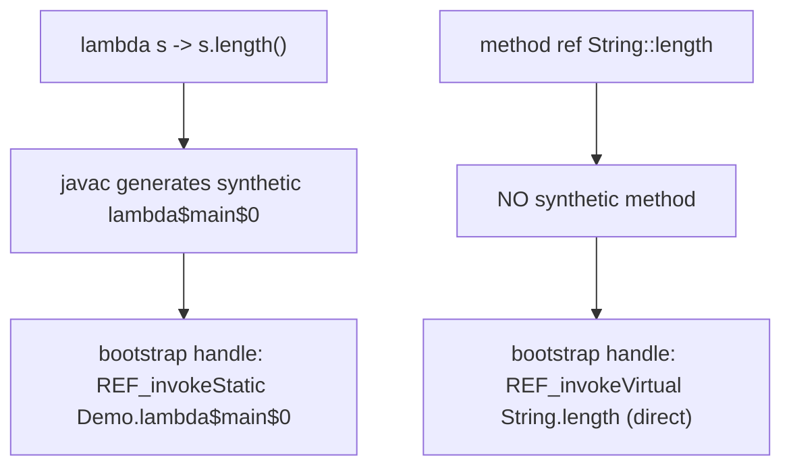
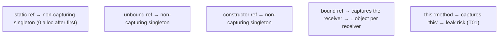
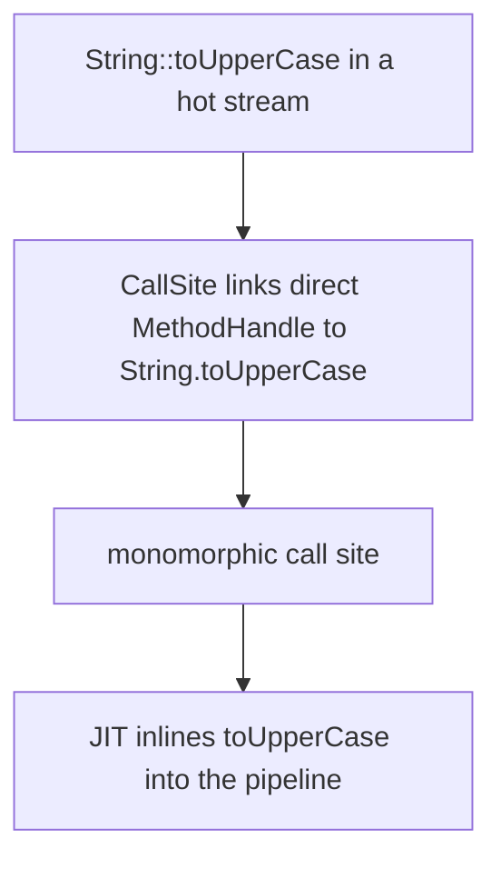

# Method & constructor references

A **method reference** (`::`) is a compact form of a lambda for the common case where the lambda body does nothing but **call one existing method**. `s -> s.length()` becomes `String::length`; `x -> System.out.println(x)` becomes `System.out::println`; `() -> new ArrayList<>()` becomes `ArrayList::new`. Method references are the natural follow-on to lambdas ([T01](./T01-lambda-expressions.md)) and functional interfaces ([T02](./T02-functional-interfaces-function-predicate-supplier-consumer.md)) — same target-typing model, often cleaner syntax.

The depth-bar requirement isn't just "show `::`." At the **language** layer there are **four kinds** (static, bound-instance, unbound-instance, constructor) plus the array-constructor variant, and the distinction between **bound** and **unbound** is the single most-confused point — and the source of a real **eager-receiver-evaluation** gotcha. At the **memory** layer, method references compile to the **same `invokedynamic` + `LambdaMetafactory`** machinery as lambdas — but with a crucial difference: for **direct** references, javac generates **no synthetic method**; the bootstrap's `MethodHandle` points **straight at the target method** (`REF_invokeVirtual String.length`), whereas a lambda's handle points at a generated `lambda$x$0` wrapper. One less layer of indirection, one less synthetic method in the class. At the **architecture** layer, the capture/singleton behaviour mirrors T01 — bound references **capture** their receiver (one instance per receiver value); unbound, static, and constructor references are **non-capturing singletons**; and `this::method` carries the same accidental-`this`-capture leak risk. We'll cover every layer with the `javap` evidence.

> [!NOTE]
> Prerequisites: [Lambda expressions](./T01-lambda-expressions.md) (L2/C01/T01) — target typing, `invokedynamic`, `LambdaMetafactory`, capturing vs non-capturing, the `this`-capture leak; [Functional interfaces](./T02-functional-interfaces-function-predicate-supplier-consumer.md) (L2/C01/T02) — the target types a `::` reference implements; [Method overloading](../../L0-foundations/C02-java-core/T13-method-overloading.md) (L0/C02/T13) — overload + static-vs-unbound resolution; [Methods, parameters, return values](../../L0-foundations/C02-java-core/T12-methods-parameters-return-values.md) (L0/C02/T12) — the `invoke*` opcode family, `MethodHandle` mechanics; [Wrapper classes & autoboxing](../../L0-foundations/C02-java-core/T17-wrapper-classes-and-autoboxing.md) (L0/C02/T17) — boxing in `Function<Integer,Integer>` vs primitive specialisations (the same `::` applies).

## Why Method References

When a lambda's entire body is a single method call, the lambda is **noise**:

```java
// Lambda — restates the obvious:
names.forEach(s -> System.out.println(s));
list.removeIf(s -> s.isEmpty());
strings.stream().map(s -> s.toUpperCase());
people.sort((a, b) -> a.getName().compareTo(b.getName()));

// Method reference — the method IS the value:
names.forEach(System.out::println);
list.removeIf(String::isEmpty);
strings.stream().map(String::toUpperCase);
people.sort(Comparator.comparing(Person::getName));
```

The method reference names *the method to call*; the compiler wires up the parameter passing. It's not just shorter — it's more direct: `String::toUpperCase` says "call `toUpperCase`," with no invented parameter name `s` to read past.



A method reference is still just an instance of a functional interface — it has a **target type**, inferred from context exactly like a lambda (T01). `String::toUpperCase` only means something where a `Function<String,String>` (or `UnaryOperator<String>`) is expected.

## The Four Kinds

| Kind | Syntax | Equivalent lambda | Example |
|------|--------|-------------------|---------|
| **Static** | `ClassName::staticMethod` | `(args) -> ClassName.staticMethod(args)` | `Integer::parseInt` |
| **Bound instance** | `instance::method` | `(args) -> instance.method(args)` | `System.out::println` |
| **Unbound instance** | `ClassName::instanceMethod` | `(obj, args) -> obj.method(args)` | `String::length` |
| **Constructor** | `ClassName::new` | `(args) -> new ClassName(args)` | `ArrayList::new` |



### 1. Static Method Reference — `ClassName::staticMethod`

The method reference stands for "call this static method, passing the functional-interface arguments through":

```java
Function<String, Integer> parse = Integer::parseInt;     // s -> Integer.parseInt(s)
parse.apply("42");                                       // 42

BinaryOperator<Integer> max = Integer::max;              // (a, b) -> Integer.max(a, b)
max.apply(3, 7);                                          // 7

IntBinaryOperator imax = Math::max;                       // (a, b) -> Math.max(a, b) — no boxing
```

The functional interface's arguments map **positionally** to the static method's parameters.

### 2. Bound Instance Method Reference — `instance::method`

The **receiver object is fixed** — captured when the `::` expression is evaluated. The functional-interface arguments map to the method's parameters:

```java
String greeting = "Hello";
Supplier<Integer> len = greeting::length;                // () -> greeting.length()
len.get();                                                // 5 — always 5; receiver is fixed

Consumer<String> printer = System.out::println;          // x -> System.out.println(x)
printer.accept("hi");                                     // prints "hi"

List<String> log = new ArrayList<>();
Consumer<String> append = log::add;                       // x -> log.add(x)
append.accept("event");                                   // log now ["event"]
```

The receiver (`greeting`, `System.out`, `log`) is **part of the closure** — the method reference is *bound* to that specific object.

### 3. Unbound Instance Method Reference — `ClassName::instanceMethod`

The trickiest one. The receiver is **not** fixed — it becomes the **first argument** of the functional interface, with the remaining arguments mapping to the method's parameters:

```java
Function<String, Integer> len = String::length;          // s -> s.length()
len.apply("hello");                                       // 5 — receiver is the ARGUMENT

Comparator<String> byNatural = String::compareTo;        // (a, b) -> a.compareTo(b)
byNatural.compare("apple", "banana");                    // negative

UnaryOperator<String> upper = String::toUpperCase;       // s -> s.toUpperCase()
upper.apply("hi");                                        // "HI"
```



This is the form behind `Comparator.comparing(Person::getName)` — `Person::getName` is an unbound reference (`p -> p.getName()`), exactly the `Function<Person, String>` key-extractor `comparing` wants.

> [!IMPORTANT]
> **Bound vs unbound is the #1 method-reference confusion.** `greeting::length` is *bound* — the receiver is the specific `greeting` object, so it implements `Supplier<Integer>` (no input). `String::length` is *unbound* — the receiver is supplied as the first argument, so it implements `Function<String,Integer>` (one input). Same method, different shape, determined by whether you wrote an *instance* or a *class name* before `::`.

### 4. Constructor Reference — `ClassName::new`

Stands for "call the constructor, passing the functional-interface arguments through":

```java
Supplier<ArrayList<String>> newList = ArrayList::new;    // () -> new ArrayList<>()
Function<String, StringBuilder> newSb = StringBuilder::new;  // s -> new StringBuilder(s)
BiFunction<String, Integer, char[]> ... ;                // any constructor arity

newList.get();                                            // a fresh empty ArrayList
newSb.apply("hi");                                        // new StringBuilder("hi")
```

Which constructor is chosen depends on the **target descriptor** — `Supplier<ArrayList>` picks the no-arg constructor; `Function<String, StringBuilder>` picks `StringBuilder(String)`. Used heavily in streams: `stream.map(Person::new)`, `stream.collect(Collectors.toCollection(LinkedList::new))`.

### 5. Array Constructor Reference — `Type[]::new`

A special constructor reference for arrays. It implements `IntFunction<Type[]>` — takes a length, returns a new array:

```java
IntFunction<String[]> makeArray = String[]::new;         // n -> new String[n]
makeArray.apply(5);                                       // new String[5]

// The canonical use — Stream.toArray:
String[] arr = stream.toArray(String[]::new);            // n -> new String[n]
```

`Stream.toArray(IntFunction)` needs a way to allocate the right-typed array of the right size; `String[]::new` is exactly `n -> new String[n]`.



### `this::` and `super::`

Two more forms, both bound:

```java
class Service {
    void handle(String s) { ... }
    void register() {
        bus.subscribe(this::handle);        // bound to 'this' — captures the enclosing instance!
    }
    void registerSuper() {
        bus.subscribe(super::handle);       // bound to 'super' dispatch
    }
}
```

`this::handle` is a **bound** reference capturing `this` — same accidental-`this`-capture memory-leak risk as a capturing lambda (T01). `super::handle` targets the parent's implementation (non-virtual).

## Target Typing — Same As Lambdas

A method reference has **no type by itself**; the compiler infers it from the target functional interface and checks the referenced method's signature is **compatible** (parameters assignable, return type assignable, exceptions within the declared set):

```java
Function<String, Integer> f = String::length;            // String→int: compatible with apply(String):Integer
Supplier<String> s = String::length;                     // COMPILE ERROR — length needs a receiver; Supplier has no input
var x = String::length;                                  // COMPILE ERROR — no target type to infer from
```

The same target-typing rules from T01 apply: a `::` reference appears only where a functional-interface target exists (assignment, argument, return, cast).

## Bound vs Unbound: The Eager-Receiver Gotcha

A **bound** method reference evaluates its receiver expression **once, eagerly**, when the `::` expression is reached — **not** each time the resulting function runs. This differs from the "equivalent" lambda:

```java
Supplier<String> a = getList()::toString;    // getList() called NOW, once; receiver fixed
Supplier<String> b = () -> getList().toString();   // getList() called EACH time b.get() runs
```

If `getList()` has side effects or returns different objects over time, `a` and `b` behave differently. The bound reference captured the **one** list returned at creation time.



> [!WARNING]
> A bound method reference's receiver is evaluated **eagerly, once**. `mutableState.get()::process` captures whatever `get()` returns *at that moment*. If you need the receiver re-evaluated per call, use a lambda.

## When a Method Reference Can't Replace a Lambda

A method reference can only express "call this one method, passing the arguments straight through." It **cannot**:

- **Reorder arguments**: `(a, b) -> foo(b, a)` — no method ref.
- **Transform arguments**: `x -> foo(x + 1)` — no method ref.
- **Pass a constant**: `x -> foo(x, DEFAULT)` — no method ref (the constant isn't an argument).
- **Do extra work**: `x -> obj.foo(x) * 2` — no method ref (the `* 2` is extra).
- **Chain calls**: `x -> x.trim().toLowerCase()` — no method ref (two calls).

In all of these, use a lambda. The rule: **method reference for a pure pass-through; lambda for anything else.**



## Overload and Static-vs-Unbound Resolution

A class-name reference can be **ambiguous** in two ways the compiler must resolve:

### Overloaded Target Methods

```java
// Math.max has int, long, float, double overloads:
IntBinaryOperator i    = Math::max;        // picks max(int, int)
DoubleBinaryOperator d = Math::max;        // picks max(double, double)
```

The compiler picks the overload matching the **target descriptor**. If no single overload matches (or several match equally), it's ambiguous — disambiguate with an explicit target type or a lambda.

### Static vs Unbound Same-Name

For `ClassName::name`, javac considers **both** interpretations — `name` as a static method (arguments straight through) and `name` as an unbound instance method (first argument as receiver):

```java
Function<String, Integer> a = Integer::parseInt;   // static: parseInt(String):int — straight through
Function<Integer, Integer> b = Integer::intValue;  // unbound: Integer.intValue() with the Integer as receiver
```

If a class has **both** a static and an instance method of the same name with signatures compatible with the target, the reference is **ambiguous** → compile error; use a lambda to disambiguate. In practice this is rare, but `Integer::parseInt` (static) vs a hypothetical unbound interpretation is the textbook example.

## Memory Layer — Same Mechanism, No Synthetic Method for Direct Refs

Method references compile to the **same** `invokedynamic` + `LambdaMetafactory` machinery as lambdas (T01) — first execution bootstraps a hidden class implementing the target interface, caches the `CallSite`, etc. The **crucial difference**: for a **direct** method reference, javac generates **no synthetic method** — the implementation `MethodHandle` points **straight at the target method**.

### Lambda vs Method Reference Bytecode

Source:

```java
public class Demo {
    public static void main(String[] args) {
        Function<String, Integer> viaLambda = s -> s.length();
        Function<String, Integer> viaRef    = String::length;
    }
}
```

For `viaLambda`, javac generates a **synthetic method**:

```
private static java.lang.Integer lambda$main$0(java.lang.String);
  Code:
     aload_0
     invokevirtual String.length:()I
     invokestatic  Integer.valueOf:(I)Ljava/lang/Integer;   // box to match Function's R
     areturn
```

…and the bootstrap's implementation handle is `REF_invokeStatic Demo.lambda$main$0`.

For `viaRef` (`String::length`), javac generates **no synthetic method**. The bootstrap's implementation handle is `REF_invokeVirtual String.length` — **pointing directly at `String.length`**. (Any needed boxing of the `int` result to `Integer` is handled by the `LambdaMetafactory`'s adaptation, not a hand-written wrapper.)

`javap -v` `BootstrapMethods` (sketch):

```
// viaLambda:
0: LambdaMetafactory.metafactory(...)
   args: (Ljava/lang/Object;)Ljava/lang/Object;,
         REF_invokeStatic Demo.lambda$main$0:(Ljava/lang/String;)Ljava/lang/Integer;,
         (Ljava/lang/String;)Ljava/lang/Integer;

// viaRef:
1: LambdaMetafactory.metafactory(...)
   args: (Ljava/lang/Object;)Ljava/lang/Object;,
         REF_invokeVirtual java/lang/String.length:()I,      // ← DIRECT, no synthetic method
         (Ljava/lang/String;)Ljava/lang/Integer;
```



### The Five `MethodHandle` Reference Kinds

The bootstrap's handle has a "kind" tag matching how the target is invoked:

| Reference kind | Used for |
|----------------|----------|
| `REF_invokeStatic` | static method refs (and lambdas — their synthetic body is static) |
| `REF_invokeVirtual` | unbound/bound instance refs to a class's virtual method (`String::length`) |
| `REF_invokeInterface` | unbound/bound instance refs to an interface method (`List::size`) |
| `REF_invokeSpecial` | `super::method`, private method refs (non-virtual) |
| `REF_newInvokeSpecial` | constructor refs (`ArrayList::new`) |

So `javap -v` on a method reference shows the direct target and its kind — `REF_newInvokeSpecial java/util/ArrayList."<init>":()V` for `ArrayList::new`, etc.

### Capture: Bound = Capturing, Unbound/Static/Ctor = Non-Capturing Singleton

The capture behaviour mirrors T01 exactly:

| Reference | Captures? | Allocation |
|-----------|-----------|------------|
| **Static** `Integer::parseInt` | nothing | **non-capturing singleton** (one reused instance) |
| **Unbound** `String::length` | nothing (receiver comes at call time) | **non-capturing singleton** |
| **Constructor** `ArrayList::new` | nothing | **non-capturing singleton** |
| **Bound** `greeting::length` | the receiver | **capturing** — a new instance per distinct receiver |
| **`this::method`** | the enclosing `this` | **capturing** — leak risk |



A non-capturing reference (static/unbound/constructor) used repeatedly returns the **same** instance — zero allocation after the first, exactly like a non-capturing lambda. A bound reference is a closure over its receiver; if the receiver varies (different objects), each `::` evaluation allocates.

## Architecture Layer — Linking, Inlining, Dispatch

### One Less Indirection

Because a direct method reference's handle points straight at the target (no synthetic wrapper), the **link step is marginally cheaper** and there's **no extra synthetic method** in the class file (smaller class, less to verify/JIT). For a lambda, the handle reaches the target *through* `lambda$x$0`; for a direct reference, it reaches it directly.

### JIT Inlining — Same As Lambdas

After the `CallSite` links, a method reference invocation is an interface call through the cached `MethodHandle`. At a **monomorphic** call site the JIT inlines straight through — `stream.map(String::toUpperCase)` ends up as inlined `toUpperCase` calls. The same **megamorphic cliff** (T01/T02) applies: a shared call site fed many different references loses inlining.



### Unbound References Still Dispatch Virtually

An unbound reference to a *virtual* method dispatches on the **runtime type** of the first argument. `CharSequence::length` invoked with a `String` actually calls `String.length`; with a `StringBuilder`, `StringBuilder.length`. The handle is `REF_invokeVirtual`/`REF_invokeInterface` — virtual dispatch. The JIT devirtualises and inlines when the receiver type is monomorphic at the call site (T12 CHA), and falls back to vtable/itable dispatch when megamorphic.

### `this::method` Leak (T01 callback)

A `this::method` reference captures the enclosing instance — if stored in a long-lived listener/registry, the enclosing object can't be GC'd. Same leak as a `this`-capturing lambda; same fix (don't hold the reference longer than the enclosing object should live, or capture only the needed field).

## Common Mistakes

### Confusing Bound and Unbound

`greeting::length` (bound — `Supplier<Integer>`) vs `String::length` (unbound — `Function<String,Integer>`). An *instance* before `::` binds the receiver; a *class name* makes the receiver the first argument. Getting this wrong produces a target-typing compile error.

### The Eager-Receiver Gotcha

A bound reference evaluates its receiver **once, now**. `cache.get(key)::process` captures the value `get` returned at that moment — not re-fetched per call. Use a lambda if you need fresh evaluation.

### `this::method` Memory Leak

Captures the whole enclosing object. If the reference outlives the object (registry, event bus), the object leaks. Same as T01's `this`-capture trap.

### Expecting a Method Reference to Reorder or Transform Arguments

`(a, b) -> compute(b, a)` and `x -> foo(x, CONST)` cannot be method references — the arguments don't pass straight through. Use a lambda.

### Overload / Static-vs-Unbound Ambiguity

`ClassName::method` may be ambiguous across overloads or between a static and an instance method of the same name. Disambiguate with an explicit target type or a lambda.

### Array Constructor Confusion

For an array, the reference is `Type[]::new` (an `IntFunction<Type[]>`), **not** `Type::new`. `Stream.toArray(String[]::new)` works; `Stream.toArray(String::new)` doesn't (that's the `String(...)` constructor, wrong type).

### Boxing Sneaking In

`map(Integer::valueOf)` or a `Function<T, Integer>` reference boxes (T02). For hot numeric paths, prefer a primitive-specialised target (`ToIntFunction`, `IntUnaryOperator`) — the same `::` works (`String::length` as a `ToIntFunction<String>` avoids the boxed `Function<String,Integer>`).

### Relying on Reference Identity

Like lambdas (T01), don't use `==` on method references or treat them as map keys expecting identity. Two `String::length` references may or may not be the same instance.

> [!INTERVIEW]
> Method references are a frequent follow-up to lambda questions.
>
> 1. **What are the four kinds of method reference?** Static (`ClassName::staticMethod`), bound instance (`instance::method`), unbound instance (`ClassName::instanceMethod`), constructor (`ClassName::new`).
> 2. **Bound vs unbound — difference?** Bound fixes the receiver now (`greeting::length` → `Supplier`); unbound takes the receiver as the first argument (`String::length` → `Function<String,Integer>`).
> 3. **Do method references compile to anonymous classes?** No — same `invokedynamic` + `LambdaMetafactory` as lambdas. But for direct refs, **no synthetic method** is generated; the handle points straight at the target.
> 4. **What's the `MethodHandle` kind for `ArrayList::new`?** `REF_newInvokeSpecial`.
> 5. **What's the eager-receiver gotcha?** A bound reference evaluates its receiver expression once, at creation — not per call. Differs from the equivalent lambda if the receiver has side effects.
> 6. **Which references are singletons vs capturing?** Static/unbound/constructor are non-capturing singletons; bound (including `this::`) captures the receiver.
> 7. **What's the array-constructor reference?** `Type[]::new` = `IntFunction<Type[]>` = `n -> new Type[n]`; used in `Stream.toArray`.
> 8. **When can a method reference NOT replace a lambda?** When you reorder/transform/constant/extra-work/chain — anything beyond a pure pass-through call.
> 9. **Why might `ClassName::method` be ambiguous?** Overloaded targets, or a static and an instance method of the same name both compatible with the target.
> 10. **Is `String::length` a bound or unbound reference, and what does it implement?** Unbound — `Function<String,Integer>` (or `ToIntFunction<String>` for no boxing).
> 11. **Does `this::handle` carry a leak risk?** Yes — it captures the enclosing instance, like a `this`-capturing lambda.
> 12. **How does an unbound reference to a virtual method dispatch?** Virtually, on the runtime type of the first argument; the JIT devirtualises when monomorphic.

## Practice

1. **Four kinds.** Write one of each: a static (`Integer::parseInt`), a bound (`System.out::println`), an unbound (`String::length`), and a constructor (`StringBuilder::new`) reference. Assign each to the right functional-interface target; invoke each.
2. **Bound vs unbound shape.** Assign `"hi"::length` to a `Supplier<Integer>` and `String::length` to a `Function<String,Integer>`. Confirm both compile; swap the targets and confirm both fail.
3. **Comparator.comparing.** Sort a `List<Person>` with `Comparator.comparing(Person::getName)` (unbound). Then `.thenComparingInt(Person::getAge)`. Confirm ordering.
4. **Stream.toArray.** Collect a `Stream<String>` to a `String[]` with `toArray(String[]::new)`. Try `toArray(String::new)`; observe the compile error.
5. **`javap` direct handle.** Compile `Function<String,Integer> f = String::length;` and `Function<String,Integer> g = s -> s.length();`. Run `javap -v`. Confirm `g` has a synthetic `lambda$...` method and its handle is `REF_invokeStatic`; confirm `f` has **no** synthetic method and its handle is `REF_invokeVirtual java/lang/String.length`.
6. **Constructor handle kind.** Compile `Supplier<ArrayList<String>> s = ArrayList::new;`. `javap -v`; find `REF_newInvokeSpecial java/util/ArrayList."<init>"`.
7. **Non-capturing singleton.** Assign `String::length` to a `Function` in a 1M-iteration loop; record `System.identityHashCode`. Confirm all identical (singleton, no allocation). Repeat with a **bound** ref over different receivers; confirm distinct instances.
8. **Eager-receiver gotcha.** Write `Supplier<String> a = sideEffectingGet()::toString;` where `sideEffectingGet()` prints and returns a value. Confirm the print happens **once** at creation. Compare to `() -> sideEffectingGet().toString()` which prints per call.
9. **`this::` leak.** Create a class that registers `this::handle` into a static list; null the instance; force GC; confirm it survives (track via `WeakReference`). Fix by not retaining the reference.
10. **Overload disambiguation.** Assign `Math::max` to an `IntBinaryOperator` and a `DoubleBinaryOperator`; confirm each picks the right overload. Create an ambiguous case and disambiguate with an explicit target.
11. **Static vs unbound.** Show `Integer::parseInt` (static, `Function<String,Integer>`) and an unbound instance ref of the same class (`Integer::intValue`, `Function<Integer,Integer>` / `ToIntFunction<Integer>`). Confirm the compiler picks the right interpretation from the target.
12. **Primitive target via `::`.** Assign `String::length` to a `ToIntFunction<String>` (no boxing) and to a `Function<String,Integer>` (boxes the result). `javap`/profile the difference (T02 boxing lesson).
13. **Map with constructor ref.** `names.stream().map(StringBuilder::new).collect(toList())` — confirm each name becomes a `StringBuilder`.
14. **`super::` form.** In a subclass overriding a method, call `super::method` as a reference; confirm it targets the parent's implementation.
15. **Can't-replace cases.** For each of `(a,b) -> foo(b,a)`, `x -> foo(x, 0)`, `x -> x.trim().toLowerCase()`, confirm there's no method-reference form; write the lambda.
16. **Explain it back.** Trace `strings.stream().map(String::toUpperCase)` from source through (a) javac emitting an `invokedynamic` whose handle is `REF_invokeVirtual String.toUpperCase` (no synthetic method), (b) first run bootstrapping the hidden class, (c) the non-capturing singleton reused for the whole stream, (d) the JIT inlining `toUpperCase` at the monomorphic map call site.

## Recap

You should now be able to:

- Recognise a **method reference** (`::`) as a compact lambda for the case where the body is a single pass-through call to an existing method — same **target typing** as lambdas.
- Distinguish the **four kinds** — **static** (`ClassName::staticMethod` = `args -> ClassName.staticMethod(args)`), **bound instance** (`instance::method` = `args -> instance.method(args)`, receiver fixed), **unbound instance** (`ClassName::instanceMethod` = `(obj, args) -> obj.method(args)`, receiver becomes the first argument), **constructor** (`ClassName::new`) — plus the **array constructor** (`Type[]::new` = `IntFunction<Type[]>`).
- Apply the **bound-vs-unbound rule**: an *instance* before `::` binds the receiver (→ fewer functional-interface inputs); a *class name* makes the receiver the first input. `greeting::length` is `Supplier<Integer>`; `String::length` is `Function<String,Integer>`.
- Avoid the **eager-receiver gotcha**: a bound reference evaluates its receiver expression **once, at creation** — not per call; not equivalent to the lambda if the receiver has side effects or varies.
- Recognise **when a method reference can't replace a lambda** — reordering, transforming, passing constants, extra work, or chaining calls all require a lambda.
- Resolve **overload and static-vs-unbound ambiguity** via the target descriptor; disambiguate with an explicit target type or a lambda when the compiler can't.
- Confirm at the **memory** layer that method references use the **same `invokedynamic` + `LambdaMetafactory`** machinery as lambdas — but for **direct** references, **no synthetic method is generated**; the bootstrap's `MethodHandle` points **straight at the target** (`REF_invokeVirtual`/`REF_invokeStatic`/`REF_invokeInterface`/`REF_invokeSpecial`/`REF_newInvokeSpecial`), one fewer indirection than a lambda's `REF_invokeStatic` to a `lambda$x$0` wrapper.
- Recall the **capture behaviour**: static, unbound, and constructor references are **non-capturing singletons** (zero allocation after first); **bound** references (including `this::method`) **capture the receiver** (one object per receiver; `this::` carries the same memory-leak risk as a `this`-capturing lambda).
- Predict the **architecture** behaviour: direct references link marginally cheaper (no synthetic wrapper); the JIT inlines through the cached `CallSite` at monomorphic sites; unbound references to virtual methods dispatch on the first argument's runtime type (devirtualised when monomorphic); the **megamorphic cliff** still applies to shared call sites.
- Use method references idiomatically — `Comparator.comparing(Person::getName)`, `stream.map(String::toUpperCase)`, `stream.toArray(String[]::new)`, `forEach(System.out::println)`, `Collectors.toCollection(LinkedList::new)` — and prefer a **primitive-specialised target** (`ToIntFunction` via `String::length`) over a boxed one in hot numeric code.
- Avoid the **common traps**: bound/unbound confusion, the eager-receiver gotcha, `this::` leak, expecting reordering/transforming, overload/static-vs-unbound ambiguity, array-constructor confusion (`Type[]::new` not `Type::new`), boxing sneaking in, relying on reference identity.

## Next

Continue to [Streams API (intermediate & terminal operations)](./T04-streams-api-intermediate-and-terminal-operations.md).
