# Streams API (intermediate & terminal operations)

The **Streams API** (Java 8+) is the central data-processing abstraction of modern Java — a declarative pipeline for transforming, filtering, and aggregating sequences of elements. Where a loop says *how* to iterate, a stream says *what* to compute: `list.stream().filter(x -> x > 0).map(String::valueOf).collect(toList())` reads as a specification, not a procedure. Streams build directly on lambdas ([T01](./T01-lambda-expressions.md)), functional interfaces ([T02](./T02-functional-interfaces-function-predicate-supplier-consumer.md)), and method references ([T03](./T03-method-and-constructor-references.md)) — every stream operation takes one of those as its argument.

The depth-bar requirement isn't just "list the operations." At the **language** layer, three properties define a stream and trip up newcomers: a stream is **lazy** (intermediate operations do nothing until a terminal operation runs), **single-use** (consumed once; reuse throws `IllegalStateException`), and **possibly infinite** (you must short-circuit). At the **memory** layer — the deep part — a stream is **not a data structure**; it stores no elements. Internally the pipeline is a small linked chain of stage objects, and when the terminal operation runs it builds a chain of **`Sink`** objects through which elements flow **one at a time, depth-first** — element 1 traverses filter→map→collect fully before element 2 starts — so there is **no intermediate collection per stage** (the key efficiency over a naive `filter-then-map-then-collect` that allocates a list per step). A **`Spliterator`** drives the source. **Stateful** operations (`sorted`, `distinct`) break this by materialising a buffer. At the **architecture** layer, the JIT **fuses** the stateless sink chain into effectively one loop body (after warm-up, `filter().map().forEach()` runs comparably to a hand-written loop); short-circuiting propagates a cancellation signal up the chain; and the same **megamorphic cliff** from T01/T02 can degrade a stream reused with many different lambda shapes. We'll cover every layer.

> [!NOTE]
> Prerequisites: [Lambda expressions](./T01-lambda-expressions.md), [Functional interfaces](./T02-functional-interfaces-function-predicate-supplier-consumer.md), [Method & constructor references](./T03-method-and-constructor-references.md) (L2/C01/T01–T03) — every stream op takes one of these; the `invokedynamic`/inlining/megamorphic story carries over directly; [Wrapper classes & autoboxing](../../L0-foundations/C02-java-core/T17-wrapper-classes-and-autoboxing.md) (L0/C02/T17) — `Stream<Integer>` vs `IntStream` boxing; [Arrays](../../L0-foundations/C02-java-core/T11-arrays-1-d-multi-dimensional.md) (L0/C02/T11) — `Arrays.stream`, `toArray`; [Loops](../../L0-foundations/C02-java-core/T09-loops-while-do-while-for-for-each.md) (L0/C02/T09) — the imperative form a stream replaces, and the JIT loop-optimisation baseline. **Collectors** (`groupingBy`, `toMap`, …) are deferred to [T05](./T05-collectors-and-grouping.md); **parallel streams** to [T06](./T06-parallel-streams.md).

## What a Stream Is — and Is Not

A **stream** is a sequence of elements supporting aggregate operations. Three things it is **not**:

1. **Not a data structure.** A stream stores no elements. It's a *view* over a source (a collection, array, generator, or I/O channel) plus a pipeline of operations. The elements live in the source (or are generated on demand), not in the stream.
2. **Not reusable.** A stream is consumed by its terminal operation. After that, it's spent — reusing it throws `IllegalStateException`.
3. **Not eager.** Building a pipeline does no work. Nothing happens until a terminal operation pulls elements through.

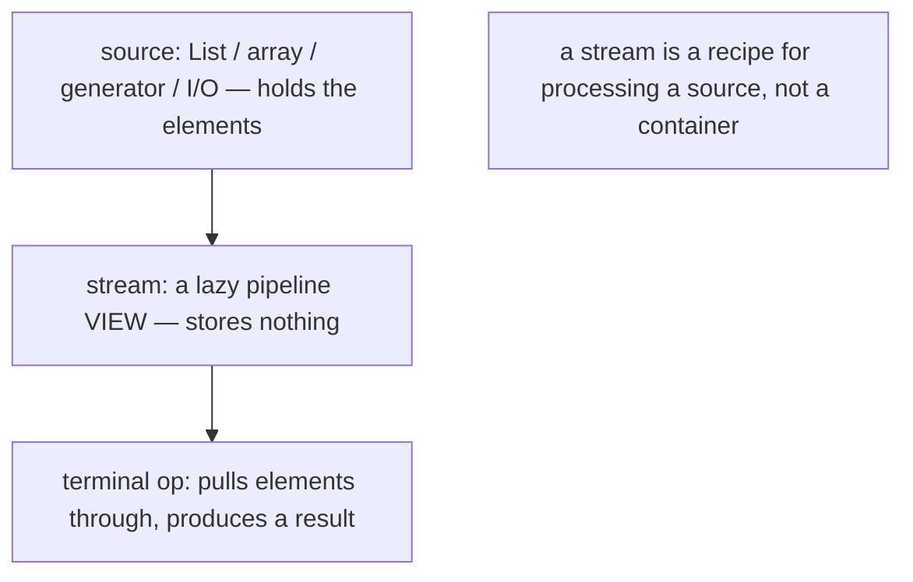

Contrast with a `Collection`: a `List` *holds* elements and you can iterate it repeatedly; a `Stream` *describes a computation* over a source and runs once.

## Anatomy of a Pipeline

Every stream pipeline has three parts:

```
source  →  0..N intermediate operations  →  exactly 1 terminal operation
```

```java
List<String> result =
    names.stream()                       // source
         .filter(s -> s.length() > 3)    // intermediate (lazy)
         .map(String::toUpperCase)        // intermediate (lazy)
         .sorted()                        // intermediate (lazy, stateful)
         .collect(Collectors.toList());   // terminal (eager — triggers everything)
```

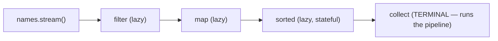

- **Intermediate operations** return a **new stream** and are **lazy** — they record what to do but don't execute.
- The **terminal operation** is **eager** — it triggers the whole pipeline and produces a result (a value, a collection, or a side effect). A pipeline with no terminal operation **does nothing**.

## Stream Sources

| Source | Produces |
|--------|----------|
| `collection.stream()` | sequential stream over a collection |
| `collection.parallelStream()` | parallel stream (T06) |
| `Arrays.stream(arr)` | stream over an array (`IntStream` for `int[]`) |
| `Stream.of(a, b, c)` | stream of explicit elements |
| `Stream.ofNullable(x)` | 0-or-1 element (Java 9+) |
| `Stream.empty()` | empty stream |
| `Stream.iterate(seed, next)` | **infinite** — `seed, next(seed), next(next(seed)), …` |
| `Stream.iterate(seed, hasNext, next)` | bounded iterate (Java 9+) |
| `Stream.generate(supplier)` | **infinite** — repeated `supplier.get()` |
| `IntStream.range(a, b)` / `rangeClosed(a, b)` | `[a,b)` / `[a,b]` ints |
| `"abc".chars()` | `IntStream` of code units |
| `Files.lines(path)` | `Stream<String>` (must be closed — try-with-resources) |
| `pattern.splitAsStream(text)` | regex split as a stream |
| `Random.ints(count, lo, hi)` | random `IntStream` |
| `Stream.concat(s1, s2)` | concatenation |

```java
Stream.of("a", "b", "c");
IntStream.range(0, 10);                          // 0..9
Stream.iterate(1, x -> x * 2).limit(10);         // powers of 2 — INFINITE, must limit
Stream.generate(Math::random).limit(5);          // 5 random doubles
try (Stream<String> lines = Files.lines(path)) { // I/O stream — close it!
    lines.filter(l -> !l.isBlank()).forEach(...);
}
```

> [!WARNING]
> `Stream.iterate(seed, next)` and `Stream.generate(supplier)` are **infinite**. Always bound them (`limit`, `takeWhile`) before a terminal operation, or the program hangs. `Files.lines` and other I/O-backed streams hold a resource — **close them** with try-with-resources.

## Intermediate Operations

Intermediate operations are **lazy** (they build the pipeline) and split into **stateless** and **stateful**.

### Stateless — Process Each Element Independently

A stateless op decides its output for an element using **only that element** — it needs no memory of other elements.

| Op | Signature | Effect |
|----|-----------|--------|
| `filter` | `Stream<T> filter(Predicate<T>)` | keep elements matching the predicate |
| `map` | `Stream<R> map(Function<T,R>)` | transform each element 1→1 |
| `mapToInt`/`mapToLong`/`mapToDouble` | → primitive stream | transform to a primitive stream (drops boxing) |
| `mapToObj` | `Stream<R>` (from primitive stream) | primitive stream → object stream |
| `flatMap` | `Stream<R> flatMap(Function<T, Stream<R>>)` | transform each element to a stream, then **flatten** all into one |
| `mapMulti` | (Java 16+) | imperative flatMap — pushes 0..N outputs per element without allocating a `Stream` each time |
| `peek` | `Stream<T> peek(Consumer<T>)` | run a side effect per element — **debugging only** |

```java
stream.filter(x -> x > 0)
      .map(x -> x * 2)
      .mapToInt(Integer::intValue);     // drop into IntStream — no boxing downstream

// flatMap: List<List<String>> → Stream<String>
listOfLists.stream()
           .flatMap(List::stream)        // flatten nested lists
           .distinct();

// flatMap to split: Stream<String> of sentences → Stream<String> of words
sentences.stream()
         .flatMap(s -> Arrays.stream(s.split(" ")));
```

`flatMap` is the "1→many then flatten" workhorse — turning a stream of collections into a stream of their elements, or splitting/expanding each element. `mapMulti` (Java 16+) does the same without allocating an intermediate `Stream` per element (a perf win when the per-element fan-out is small).

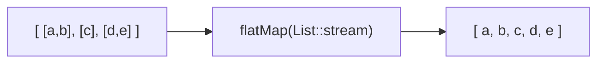

> [!WARNING]
> **`peek` is for debugging, not logic.** Its `Consumer` may not run at all under optimisation — since Java 9, `count()` (and other ops that can compute the result without traversal) may skip the pipeline entirely, so a `peek` before such a terminal never executes. Never put behaviour your program depends on inside `peek`.

### Stateful — May Need to See Other Elements

A stateful op needs memory across elements — a buffer, a seen-set, or a counter.

| Op | State it keeps | Notes |
|----|----------------|-------|
| `distinct` | a "seen" set | removes duplicates (by `equals`/`hashCode`) |
| `sorted` / `sorted(cmp)` | **buffers all elements** | can't emit anything until it's seen everything |
| `limit(n)` | a counter | short-circuiting — stops the upstream after n |
| `skip(n)` | a counter | drops the first n |
| `takeWhile(pred)` | (Java 9+) | take elements while predicate true; **stop at first false** (short-circuit) |
| `dropWhile(pred)` | (Java 9+) | drop while predicate true, then take the rest |

```java
stream.distinct()                       // needs a HashSet of seen elements
      .sorted()                          // buffers everything, then sorts
      .limit(10);                        // short-circuits after 10

IntStream.iterate(1, x -> x + 1)
         .takeWhile(x -> x < 100)        // 1..99, stops at 100
         .sum();
```

`sorted` is the heaviest stateful op — it must **materialise the entire stream into a buffer** before it can emit the first sorted element. On an infinite stream, `sorted` never terminates. `distinct` and `limit`/`skip` are lighter but still stateful.

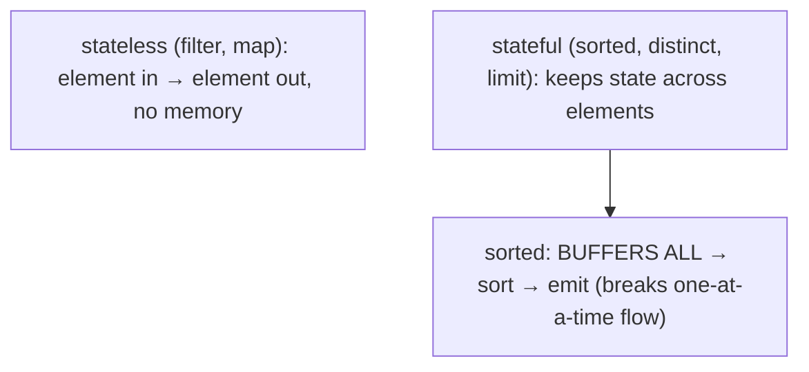

## Terminal Operations

The terminal operation triggers execution and produces a result. After it runs, the stream is consumed.

### Reduction / Aggregation

| Op | Returns | Effect |
|----|---------|--------|
| `reduce(identity, acc)` | T | fold all elements into one (with an identity + accumulator) |
| `reduce(acc)` | `Optional<T>` | fold (no identity → Optional, empty stream → empty) |
| `collect(Collector)` | depends | mutable reduction — into a `List`/`Set`/`Map`/`String`/… (T05) |
| `count()` | long | number of elements |
| `min(cmp)` / `max(cmp)` | `Optional<T>` | extreme element |
| `sum()` / `average()` / `summaryStatistics()` | (primitive streams) | numeric aggregates |

```java
int total      = nums.stream().reduce(0, Integer::sum);       // 0 + a + b + ...
Optional<Integer> max = nums.stream().reduce(Integer::max);    // empty if no elements
long n         = stream.count();
IntSummaryStatistics stats = ints.stream().mapToInt(i -> i).summaryStatistics();  // count/sum/min/max/avg in one pass
```

`reduce(identity, accumulator)`: the `identity` is the starting value (and the result for an empty stream); the `accumulator` combines the running result with each element. For parallel streams, a third `combiner` argument merges partial results (T06).

### Search / Match — Short-Circuiting

| Op | Returns | Short-circuits? |
|----|---------|-----------------|
| `anyMatch(pred)` | boolean | yes — stops at first match |
| `allMatch(pred)` | boolean | yes — stops at first non-match |
| `noneMatch(pred)` | boolean | yes — stops at first match |
| `findFirst()` | `Optional<T>` | yes — stops at first element (respects encounter order) |
| `findAny()` | `Optional<T>` | yes — any element (parallel-friendly, no order guarantee) |

```java
boolean hasNeg = nums.stream().anyMatch(x -> x < 0);          // stops at first negative
Optional<String> first = names.stream().filter(s -> s.startsWith("A")).findFirst();
```

These **short-circuit** — they can finish before consuming the whole source, which is what makes them safe on **infinite** streams: `Stream.iterate(1, x -> x+1).filter(x -> x > 1000).findFirst()` terminates.

### Iteration and Collection

| Op | Returns | Notes |
|----|---------|-------|
| `forEach(consumer)` | void | side effect per element; **no order guarantee in parallel** |
| `forEachOrdered(consumer)` | void | side effect in **encounter order** even in parallel |
| `toArray()` / `toArray(IntFunction)` | array | `toArray(String[]::new)` for typed arrays (T03) |
| `toList()` | `List<T>` | **unmodifiable** list (Java 16+) — the modern shortcut for `collect(toList())` |

```java
names.stream().forEach(System.out::println);
String[] arr = stream.toArray(String[]::new);
List<String> list = stream.filter(...).toList();              // Java 16+ — unmodifiable
```

> [!NOTE]
> `Stream.toList()` (Java 16+) returns an **unmodifiable** list — calling `add`/`remove` throws `UnsupportedOperationException`. `collect(Collectors.toList())` returns a list with **no guarantee** of mutability (often `ArrayList`, but don't rely on it). Use `toList()` for read-only results; `collect(Collectors.toCollection(ArrayList::new))` if you need a mutable, specific type.

## Laziness — the Model

Intermediate operations are **lazy**: they record the operation but don't execute. **Nothing runs until a terminal operation is invoked.** This is the foundation that enables fusion, short-circuiting, and infinite streams.

A trace makes it concrete:

```java
Stream.of("a", "bb", "ccc")
      .filter(s -> { System.out.println("filter " + s); return s.length() > 1; })
      .map(s -> { System.out.println("map " + s); return s.toUpperCase(); })
      .forEach(s -> System.out.println("forEach " + s));
```

Output:

```
filter a
filter bb
map bb
forEach BB
filter ccc
map ccc
forEach CCC
```

Read it carefully: the elements flow **one at a time, all the way through the pipeline**, not stage-by-stage. `"a"` is filtered out (no map, no forEach). `"bb"` is filtered (pass) → mapped → consumed, **then** `"ccc"` starts. It is **not** "filter all, then map all, then forEach all."

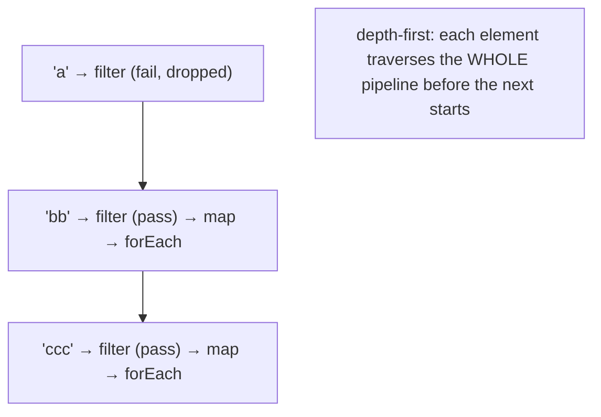

This **one-at-a-time, depth-first** flow is the key efficiency: there's no intermediate `List` after `filter` and another after `map`. Compare the naive imperative version that *would* allocate two intermediate lists:

```java
// Naive: two intermediate collections
List<String> filtered = new ArrayList<>();
for (String s : input) if (s.length() > 1) filtered.add(s);
List<String> mapped = new ArrayList<>();
for (String s : filtered) mapped.add(s.toUpperCase());
// stream version allocates neither
```

## Short-Circuiting

A short-circuiting operation can produce its result without consuming the whole source. The short-circuiting terminal ops (`findFirst`, `findAny`, `anyMatch`, `allMatch`, `noneMatch`) and the short-circuiting intermediate op (`limit`, `takeWhile`) stop early.

```java
Stream.iterate(1, x -> x + 1)        // INFINITE
      .filter(x -> x % 7 == 0)
      .findFirst();                  // returns 7 — never processes the rest
```

Short-circuiting is what makes infinite streams usable. The internal mechanism (memory section) is a **cancellation signal** that propagates up the sink chain so the source-driving loop stops pulling elements.

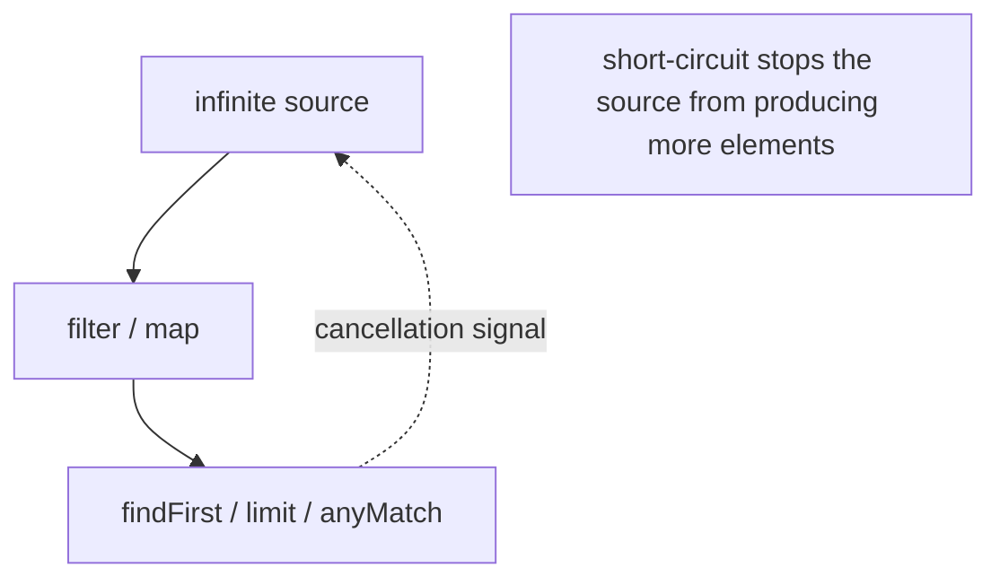

## Single-Use

A stream is consumed by its terminal operation. **Operating on it again throws `IllegalStateException`:**

```java
Stream<String> s = names.stream();
s.forEach(System.out::println);       // terminal — consumes the stream
s.count();                            // IllegalStateException: stream has already been operated upon or closed
```

Even chaining a second intermediate op after a terminal fails. If you need to traverse a source twice, create **two streams** from the source (or collect once and reuse the collection):

```java
names.stream().forEach(...);          // OK
names.stream().count();               // OK — a fresh stream from the same source
```

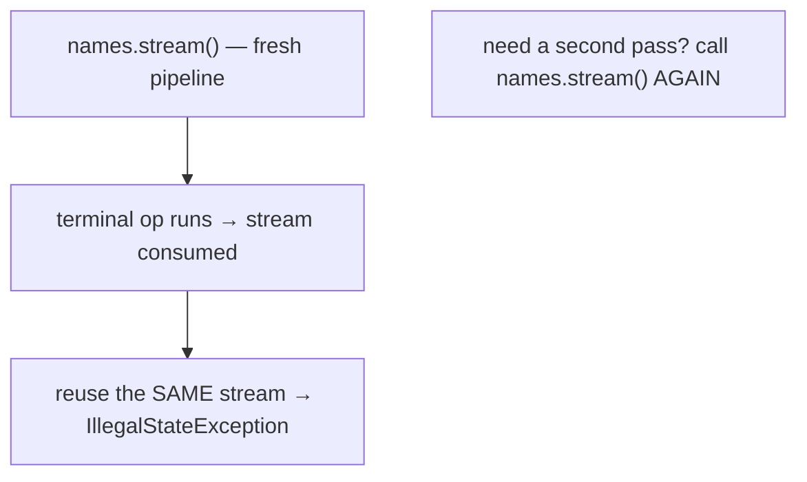

## Encounter Order

A stream may have a defined **encounter order** (the order elements appear) — inherited from an ordered source (`List`, arrays, `LinkedHashSet`) or imposed by `sorted`. Unordered sources (`HashSet`) produce streams with no defined order.

- Most ops **preserve** encounter order.
- `forEach` does **not** guarantee order in **parallel**; `forEachOrdered` does.
- `findFirst` respects order; `findAny` doesn't (it's a parallel-friendly "give me any element").
- `unordered()` explicitly drops the ordering constraint, allowing the runtime to optimise (relevant for parallel — T06).

```java
list.parallelStream().forEach(...);          // order NOT guaranteed
list.parallelStream().forEachOrdered(...);   // encounter order preserved (slower)
```

## Primitive Streams and Boxing (T02 / T17 callback)

`Stream<Integer>` boxes every element; `IntStream`/`LongStream`/`DoubleStream` operate on primitives directly. The same lesson as `IntUnaryOperator` vs `Function<Integer,Integer>` (T02) and `int[]` vs `Integer[]` (T17):

```java
// Boxed — allocates ~1M Integers:
list.stream().map(x -> x * 2).reduce(0, Integer::sum);

// Primitive — zero boxing:
list.stream().mapToInt(Integer::intValue).map(x -> x * 2).sum();
IntStream.range(0, 1_000_000).map(x -> x * 2).sum();
```

Convert between them:

- **Object → primitive**: `mapToInt`, `mapToLong`, `mapToDouble`.
- **Primitive → object**: `boxed()` or `mapToObj`.
- Primitive streams add `sum()`, `average()`, `summaryStatistics()`, `min()`, `max()` — primitive-specialised terminal ops with no boxing.

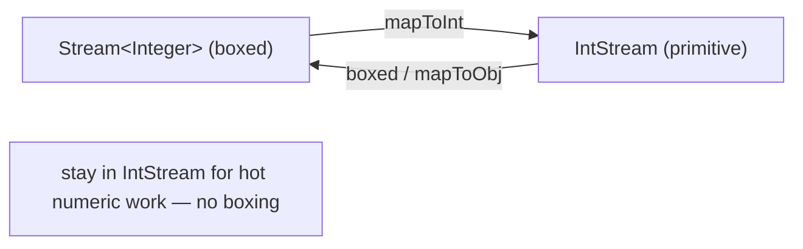

## Memory Layer — How the Pipeline Actually Works

Now the deep part: what a stream *is* in memory and how elements flow.

### The Pipeline Is a Linked Chain of Stage Objects

Each stream operation creates a **pipeline stage** object (`AbstractPipeline` subclass) linked to its previous stage. Building `source.stream().filter(p).map(f)` allocates:

- The **source stage** (wrapping the source's `Spliterator`).
- A **filter stage** (holding the `Predicate p`), linked to the source.
- A **map stage** (holding the `Function f`), linked to the filter.

Each stage is a small object (~tens of bytes) holding its operation's lambda and a reference to the previous stage. **No elements are touched yet** — this is just the recorded recipe.

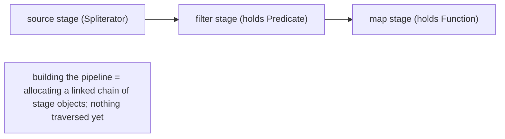

### The Terminal Op Builds a Sink Chain

When the terminal operation runs, it builds a chain of **`Sink`** objects. A `Sink<T>` is a `Consumer<T>` plus lifecycle hooks:

```java
interface Sink<T> extends Consumer<T> {
    default void begin(long size) {}              // called before any elements
    void accept(T t);                              // process one element
    default void end() {}                          // called after all elements
    default boolean cancellationRequested() { ... } // short-circuit signal
}
```

The terminal op's sink is the **innermost**. Each intermediate stage **wraps** the downstream sink — `wrapSink` iterates from the last stage back to the source, so the resulting **head sink** is the first op's wrapper, which forwards to the next, … down to the terminal sink.

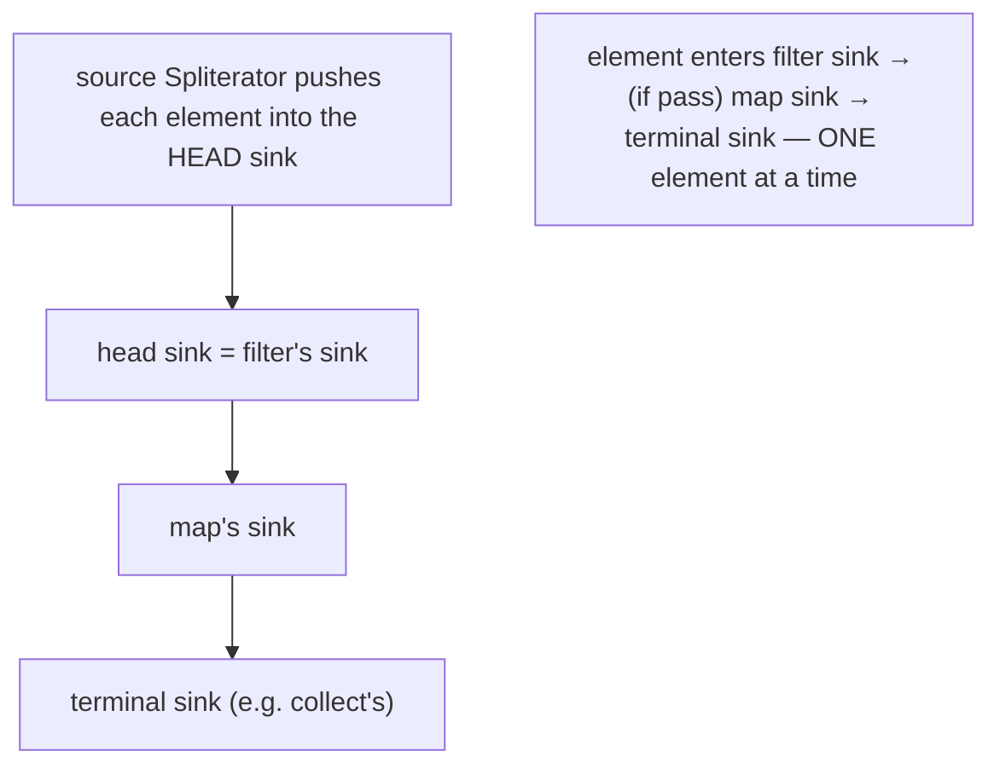

### Elements Flow One at a Time, Depth-First

The source's `Spliterator.forEachRemaining(headSink)` pushes each element into the head sink. For each element:

1. `filterSink.accept(x)` — if `p.test(x)`, call `mapSink.accept(x)`; else drop.
2. `mapSink.accept(x)` — call `terminalSink.accept(f.apply(x))`.
3. `terminalSink.accept(...)` — add to the result.

The element traverses the **whole chain** before the next element is pulled. **No per-stage collection is materialised** — that's the central efficiency. (This is exactly the trace from the Laziness section, now explained at the implementation level.)

### Stateful Ops Break the One-at-a-Time Flow

A stateful op can't forward an element immediately:

- **`sorted`** — its sink **buffers every element** in `begin`/`accept`, sorts in `end`, then pushes all sorted elements downstream. So `sorted` materialises an array/list of the whole stream. (This is why `sorted` on an infinite stream hangs, and why it's the heaviest op.)
- **`distinct`** — its sink keeps a `HashSet` of seen elements; forwards only the first occurrence.
- **`limit`/`skip`** — its sink keeps a counter; `limit` requests cancellation once it's forwarded n elements.

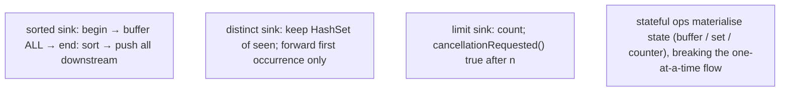

### The Spliterator

The source is described by a **`Spliterator<T>`** ("splittable iterator"):

- `boolean tryAdvance(Consumer)` — process one element.
- `void forEachRemaining(Consumer)` — process all (the sequential driver).
- `Spliterator<T> trySplit()` — split off a chunk for parallel processing (T06).
- `long estimateSize()` — element count estimate.
- `int characteristics()` — flags: `ORDERED`, `SORTED`, `DISTINCT`, `SIZED`, `SUBSIZED`, `NONNULL`, `IMMUTABLE`, `CONCURRENT`.

The characteristics let the runtime optimise: a `SIZED` spliterator lets `count()` skip traversal; a `SORTED` one lets `sorted()` become a no-op; a `DISTINCT` one lets `distinct()` skip the seen-set.

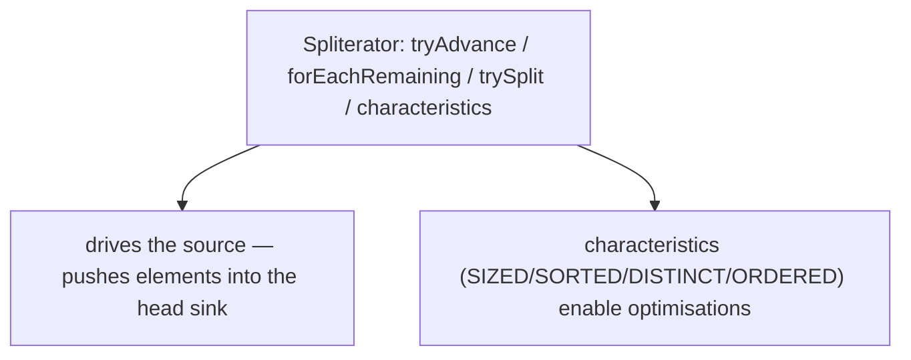

### Memory Footprint Summary

| Piece | Cost |
|-------|------|
| Pipeline stages | N small objects (one per op) holding the lambdas |
| Sink chain | N sink objects built at terminal time |
| Stateless ops | **no per-element collection** |
| `sorted` | buffers the **entire** stream |
| `distinct` | a `HashSet` of seen elements |
| Object stream | boxes each element (`Stream<Integer>`); `IntStream` doesn't |

## Architecture Layer — Fusion, Inlining, Overhead

### The JIT Fuses the Stateless Sink Chain

After warm-up, the JIT sees the sink chain's `accept` calls at **monomorphic** call sites (one lambda type each) and **inlines** them. `filter(p).map(f).forEach(c)` collapses into effectively:

```java
spliterator.forEachRemaining(x -> {        // conceptually, after inlining:
    if (p.test(x)) c.accept(f.apply(x));    // all inlined into one loop body
});
```

So a stateless stream pipeline runs comparably to a hand-written loop — the abstraction is (mostly) free after warm-up. Escape analysis (T01) eliminates the per-element wrapper allocations.

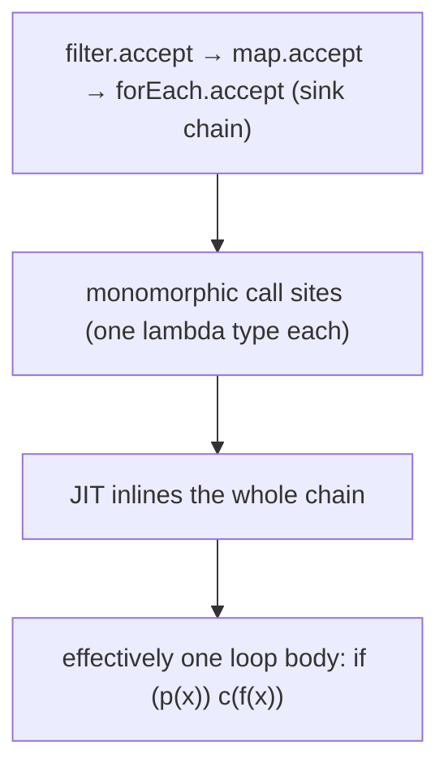

### Stateful Ops Break the Fusion

`sorted`, `distinct`, and friends **materialise** — they consume the upstream into a buffer, then start a *new* traversal downstream. So a pipeline with a `sorted` in the middle is really **two** fused segments separated by a materialisation point. This is a real cost (the buffer allocation + the extra pass), so push `filter` **before** `sorted` to shrink what gets buffered:

```java
big.stream().sorted().filter(p)...    // sorts everything, THEN filters — wasteful
big.stream().filter(p).sorted()...    // filters first, sorts only survivors — better
```

### The Megamorphic Cliff (T01/T02 callback)

If the **same stream-pipeline code** is reached with **many different lambda types** (e.g., a generic utility `process(list, mapper)` that streams + maps with whatever `mapper` is passed), the sink `accept` call sites go **megamorphic** — the JIT can't inline, and each element pays a virtual dispatch. The fix is the same as before: keep hot stream call sites monomorphic, or accept the cost off the hot path.

### Stream vs Plain Loop — the Honest Comparison

After warm-up, a stateless stream pipeline is usually within ~1.0–2× of a hand-written `for` loop for simple operations; for many real workloads they're equal. But there's a **per-pipeline setup cost** (allocating stages + sink chain) and a small **per-element dispatch cost** (even inlined). So:

- **Trivial hot loops over small/primitive data** — a plain `for` can be faster (no setup, RCE + SIMD from T09 apply directly). Don't stream a 3-element array.
- **Larger data, complex transforms, readability, parallelism** — streams win (clarity, and free parallelism via `parallelStream`).

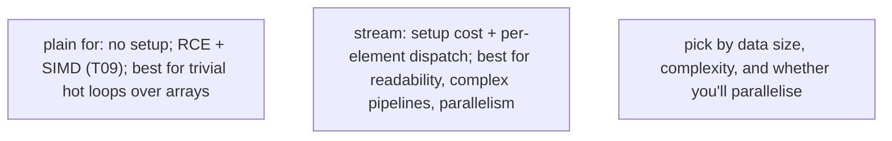

### Parallel Streams — Preview (full in T06)

`collection.parallelStream()` or `stream.parallel()` splits the source via `Spliterator.trySplit()` into chunks processed on the **`ForkJoinPool.commonPool`**, then merges partial results with the combiner. Worth it only for **large** data + **expensive** per-element work + a **splittable** source + an **associative** combine. Often *slower* than sequential for small data or cheap operations (split/merge overhead, common-pool contention). Full treatment in [T06](./T06-parallel-streams.md).

## Common Mistakes

### Reusing a Stream

```java
Stream<X> s = list.stream();
s.filter(...).count();
s.map(...);                          // IllegalStateException — already operated upon
```

A stream is single-use. Create a fresh one from the source.

### Side Effects in `map` / Stateful Lambdas

```java
List<X> out = new ArrayList<>();
list.stream().map(x -> { out.add(x); return x; });   // side effect in map — wrong
```

Stream operations should be **pure** (no side effects on shared state). Side effects break laziness reasoning and are **data races** under parallel streams. Build results with `collect`, not ad-hoc mutation.

### `peek` for Logic

`peek`'s consumer may not run (since Java 9, `count()` and size-known pipelines can skip traversal). Use `peek` only for debugging; never put depended-upon behaviour in it.

### Forgetting Laziness — No Terminal Op

```java
list.stream().filter(...).map(...);   // does NOTHING — no terminal op
```

A pipeline without a terminal operation never runs. The IDE often warns ("result of stream ignored").

### `forEach` to Build a Collection

```java
List<X> out = new ArrayList<>();
list.parallelStream().forEach(out::add);   // DATA RACE — ArrayList isn't thread-safe
```

Use `collect(Collectors.toList())` / `toList()`. `forEach` with `add` is unsafe in parallel and discouraged even sequentially.

### Boxing via `Stream<Integer>`

Use `IntStream` / `mapToInt` for numeric work (T17). `Stream<Integer>` boxes every element.

### Infinite Stream Without a Bound

```java
Stream.iterate(1, x -> x + 1).forEach(...);   // hangs forever
```

Bound with `limit` / `takeWhile` before a non-short-circuiting terminal op.

### `sorted` on Non-`Comparable`, No Comparator

```java
stream.sorted();        // ClassCastException at runtime if elements aren't Comparable
stream.sorted(Comparator.comparing(...));   // provide a comparator
```

### Modifying the Source During Streaming

```java
list.stream().forEach(x -> list.add(...));   // ConcurrentModificationException / undefined
```

Don't mutate the source while a stream over it runs.

### Not Closing I/O-Backed Streams

```java
Files.lines(path).forEach(...);   // leaks the file handle
try (var lines = Files.lines(path)) { lines.forEach(...); }   // correct
```

### Overusing Streams

A 3-element loop, an index-dependent transform, or a tight numeric kernel may be clearer and faster as a plain loop. Streams are a tool, not a mandate.

> [!INTERVIEW]
> Streams are the most-asked modern-Java topic after lambdas.
>
> 1. **Is a stream a data structure?** No — it stores no elements; it's a lazy pipeline view over a source.
> 2. **Intermediate vs terminal operation?** Intermediate ops are lazy and return a stream; the terminal op is eager, triggers execution, and produces a result. One terminal op per pipeline.
> 3. **What does "lazy" mean?** Intermediate ops do nothing until a terminal op runs. Enables fusion, short-circuiting, and infinite streams.
> 4. **Why can't you reuse a stream?** It's consumed by its terminal op; reuse throws `IllegalStateException`. Create a fresh stream from the source.
> 5. **Stateless vs stateful intermediate op?** Stateless (`filter`, `map`) needs only the current element; stateful (`sorted`, `distinct`, `limit`) keeps state across elements. `sorted` buffers the whole stream.
> 6. **How do elements flow through a pipeline?** One at a time, depth-first — each element traverses the whole chain before the next starts. No per-stage collection.
> 7. **What's short-circuiting?** An op that can finish without consuming the whole source (`findFirst`, `anyMatch`, `limit`). Makes infinite streams usable.
> 8. **What's a `Spliterator`?** The source descriptor — `tryAdvance`/`forEachRemaining`/`trySplit`/`characteristics`. Drives sequential traversal and parallel splitting.
> 9. **What's the internal `Sink` chain?** The terminal op builds a chain of sinks; the source pushes each element into the head sink, which cascades down to the terminal sink.
> 10. **`Stream<Integer>` vs `IntStream`?** The former boxes; the latter is primitive (no boxing). Use `mapToInt` to drop in, `boxed` to come back.
> 11. **Is a stream slower than a for loop?** After warm-up, a stateless pipeline is usually within ~1–2× and often equal; there's setup + per-element dispatch overhead, so trivial hot loops can favour a plain `for`.
> 12. **Why is `peek` unreliable?** It's for debugging; its consumer may be skipped under optimisation (e.g., `count()` skipping traversal since Java 9).

## Practice

1. **Lazy trace.** Run the `filter`/`map`/`forEach` trace from the Laziness section with prints. Confirm the depth-first, one-at-a-time order (`filter a`, `filter bb`, `map bb`, `forEach BB`, …).
2. **No terminal = nothing.** Write `list.stream().filter(x -> { System.out.println(x); return true; });` with no terminal op. Confirm no output. Add `.count()`; observe behaviour.
3. **Reuse throws.** Call a terminal op, then another op on the same stream variable. Confirm `IllegalStateException`. Fix by creating a fresh stream.
4. **Short-circuit on infinite.** `Stream.iterate(1, x -> x+1).filter(x -> x % 7 == 0).findFirst()`. Confirm it returns 7 and terminates.
5. **`limit` on infinite.** `Stream.generate(Math::random).limit(5).forEach(...)`. Confirm 5 values.
6. **flatMap.** Flatten a `List<List<Integer>>` into a `Stream<Integer>` with `flatMap(List::stream)`. Then split a `List<String>` of sentences into words.
7. **Stateful buffering.** Time `sorted()` on a 10M-element stream; observe it buffers the whole thing (memory spike via `-verbose:gc`). Confirm `sorted` on `Stream.iterate(...)` (infinite) hangs.
8. **Filter-before-sort.** Compare `big.stream().sorted().filter(p)` vs `big.stream().filter(p).sorted()` for a selective `p`. Measure; the filter-first version sorts fewer elements.
9. **Primitive vs boxed.** Sum 10M ints with `IntStream.range(...).map(...).sum()` vs `....boxed().map(...).reduce(0, Integer::sum)`. Measure throughput and GC; confirm the boxed path allocates ~millions of Integers.
10. **`peek` unreliability.** Put a `peek(System.out::println)` before `count()` on a `SIZED` source (a `List`). Confirm (Java 9+) the peek may not run. Add a `filter` before `count`; now it runs.
11. **`toList` immutability.** `stream.toList()` then `.add(...)`; confirm `UnsupportedOperationException`. Compare to `collect(Collectors.toCollection(ArrayList::new))`.
12. **`forEach` vs `forEachOrdered` in parallel.** `list.parallelStream().forEach(...)` vs `forEachOrdered`; observe order difference.
13. **`Spliterator` characteristics.** Get a `List`'s and a `HashSet`'s spliterator; print `characteristics()`. Confirm the List is `ORDERED`+`SIZED`; the HashSet `SIZED`+`DISTINCT` but not `ORDERED`.
14. **`count()` skip.** Confirm that `list.stream().peek(println).count()` on a sized source may skip the peek (Java 9+). Add a `flatMap`/`filter` and confirm it now must traverse.
15. **Stream vs loop benchmark.** JMH (or careful nanoTime + warm-up) summing an `int[]` with a plain `for`, an enhanced `for`, and `IntStream.of(arr).sum()`. Compare. Observe the plain `for` may win for tiny arrays; streams catch up for larger.
16. **Files.lines leak.** Open `Files.lines(path)` without try-with-resources in a loop many times; observe file-handle exhaustion. Fix with try-with-resources.
17. **Explain it back.** For `list.stream().filter(p).map(f).collect(toList())`, describe: (a) the pipeline stage objects allocated, (b) what the terminal `collect` triggers (sink chain build), (c) how one element flows filter→map→collect before the next, (d) why no intermediate `List` is allocated between filter and map, (e) how the JIT fuses the chain after warm-up.

## Recap

You should now be able to:

- Define a **stream** as a **lazy**, **single-use**, **possibly-infinite** pipeline over a source — **not a data structure** (it stores no elements).
- Recognise the **pipeline anatomy**: source → 0..N **intermediate** operations (lazy, return a stream) → exactly one **terminal** operation (eager, triggers execution, produces a result); a pipeline with no terminal op does nothing.
- Create streams from the common **sources** — `collection.stream()`, `Arrays.stream`, `Stream.of`/`iterate`/`generate`, `IntStream.range`, `String.chars`, `Files.lines` (close it!), and bound the **infinite** ones (`iterate`/`generate`) with `limit`/`takeWhile`.
- Distinguish **stateless** intermediate ops (`filter`, `map`/`mapToInt`/`mapToObj`, `flatMap`/`mapMulti`, `peek`) from **stateful** ones (`distinct`, `sorted`, `limit`/`skip`, `takeWhile`/`dropWhile`); recall that `sorted` **buffers the entire stream** and never terminates on an infinite source.
- Use the **terminal** ops — reduction (`reduce`, `collect`, `count`, `min`/`max`, `sum`/`summaryStatistics`), short-circuiting search/match (`anyMatch`/`allMatch`/`noneMatch`, `findFirst`/`findAny`), iteration (`forEach`/`forEachOrdered`), and collection (`toArray`, `toList` — unmodifiable, Java 16+).
- Explain the **laziness model** — intermediate ops record but don't execute; **nothing runs until the terminal op**; elements flow **one at a time, depth-first** (each element traverses the whole chain before the next), so there is **no intermediate collection per stage**.
- Explain **short-circuiting** (`findFirst`/`anyMatch`/`limit` stop early via a cancellation signal) as what makes infinite streams usable.
- Recall **single-use** semantics (reuse → `IllegalStateException`) and **encounter order** (preserved by most ops; `forEach` unordered in parallel, `forEachOrdered` ordered; `findAny` vs `findFirst`).
- Choose **primitive streams** (`IntStream`/`LongStream`/`DoubleStream`, via `mapToInt`/`boxed`) for numeric work to avoid boxing (T17/T02).
- Describe the **internal machinery**: the pipeline is a linked chain of **stage** objects holding the lambdas; the terminal op builds a **`Sink`** chain (head = first op, innermost = terminal); a **`Spliterator`** drives the source, pushing each element into the head sink; **stateless** ops add no per-element collection; **stateful** ops materialise a buffer/set/counter (breaking the one-at-a-time flow).
- Recall the **`Spliterator`** role — `tryAdvance`/`forEachRemaining`/`trySplit`/`characteristics`; characteristics (`SIZED`, `SORTED`, `DISTINCT`, `ORDERED`) enable optimisations (e.g., `count()` skipping traversal on `SIZED` sources — why `peek` before `count` may not run).
- Predict the **architecture** behaviour: the JIT **fuses + inlines** the stateless sink chain into effectively one loop body after warm-up (abstraction nearly free); **stateful** ops break the fusion (materialise + extra pass — so `filter` before `sorted`); the **megamorphic cliff** degrades a stream reused with many lambda types; a plain `for` can beat a stream on trivial hot loops (no setup, RCE+SIMD), while streams win on readability, complex pipelines, and parallelism.
- Avoid the **common traps**: reusing a stream, side effects / stateful lambdas in ops, `peek` for logic, no terminal op, `forEach`-to-build-a-collection (use `collect`), boxing via `Stream<Integer>`, unbounded infinite streams, `sorted` on non-`Comparable`, modifying the source mid-stream, not closing I/O-backed streams, overusing streams for trivial loops.

## Next

Continue to [Collectors & grouping](./T05-collectors-and-grouping.md).
