# Collectors & grouping

`collect` is the most powerful stream terminal operation ([T04](./T04-streams-api-intermediate-and-terminal-operations.md)) — it performs a **mutable reduction**, accumulating elements into a `List`, `Set`, `Map`, `String`, or any custom container. The strategy is encapsulated in a **`Collector`** object, and the `Collectors` factory class provides dozens of ready-made ones: `toList()`, `toMap()`, `joining()`, `counting()`, and — the crown jewels — `groupingBy()` and `partitioningBy()`, which turn a flat stream into a structured `Map`. This is where streams stop being "fancy loops" and become a genuine data-shaping language.

The depth-bar requirement isn't just "list the collectors." At the **language** layer, `collect` is **mutable reduction** — fundamentally different from `reduce`'s **immutable fold**, and understanding why decides whether your accumulation is O(N) or O(N²). The `Collector<T, A, R>` interface has five components (supplier, accumulator, combiner, finisher, characteristics), and the **downstream-collector** composition (`groupingBy(classifier, counting())`) is what makes grouping so expressive. At the **memory** layer, a collector mutates **one** container in place — `toList` grows a single `ArrayList` (amortised O(1) per add, the T07 `StringBuilder` lesson) rather than copying a list per element; `groupingBy` does a `computeIfAbsent` per key then accumulates into that group's downstream container. At the **architecture** layer, a **sequential** collect calls the supplier **once**, the accumulator per element, the finisher **once** — and **never** the combiner; a **parallel** collect builds a container **per thread** and **combiner-merges** them (the combiner must be associative); and **concurrent** collectors (`groupingByConcurrent`, `toConcurrentMap`) share **one** concurrent container across threads, skipping the merge — faster for unordered parallel. We'll cover every layer.

> [!NOTE]
> Prerequisites: [Streams API](./T04-streams-api-intermediate-and-terminal-operations.md) (L2/C01/T04) — `collect` as a terminal op, the lazy pipeline, primitive streams; [Functional interfaces](./T02-functional-interfaces-function-predicate-supplier-consumer.md) (L2/C01/T02) — `Supplier`/`BiConsumer`/`BinaryOperator`/`Function` (the Collector components); [Method references](./T03-method-and-constructor-references.md) (L2/C01/T03) — `ArrayList::new`, `List::add` as collector pieces; [StringBuilder/StringBuffer](../../L0-foundations/C02-java-core/T07-stringbuilder-stringbuffer.md) (L0/C02/T07) — amortised growth, the O(N²)-concat lesson `joining` avoids; [Wrapper classes & autoboxing](../../L0-foundations/C02-java-core/T17-wrapper-classes-and-autoboxing.md) (L0/C02/T17) — `summingInt` vs boxing. **Maps and `computeIfAbsent`** come from L1/C02 (collections) which the parallel session owns — we use them here; the mechanics are covered there.

## `collect` Is Mutable Reduction — Not `reduce`

A `reduce` (T04) is an **immutable fold**: each step takes the running result and an element, and produces a **new** result. For a single value (a sum), that's fine — `int` is cheap to "copy." But for building a **collection**, immutable folding is a disaster:

```java
// reduce to build a list — O(N²)! each step copies the whole list
List<String> bad = stream.reduce(
    new ArrayList<>(),
    (list, x) -> { var copy = new ArrayList<>(list); copy.add(x); return copy; },  // COPY every step
    (a, b) -> { var copy = new ArrayList<>(a); copy.addAll(b); return copy; });
```

Each accumulation copies the entire list-so-far — N copies of growing size = **O(N²)**, the same trap as string concatenation in a loop (T07).

`collect` is **mutable reduction**: it creates **one** mutable container and **mutates it in place** for each element:

```java
// collect — O(N): one ArrayList, grown in place
List<String> good = stream.collect(Collectors.toList());
```

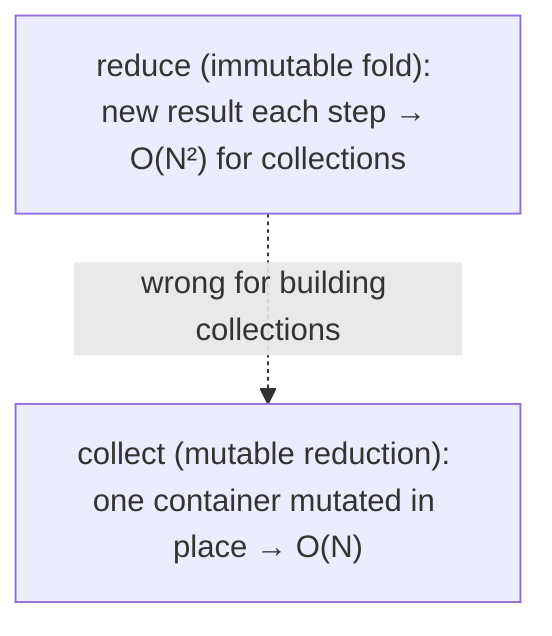

> [!IMPORTANT]
> Use **`collect`** to build collections/maps/strings; use **`reduce`** to fold to a single value (sum, product, min). Using `reduce` with immutable copying for a collection is O(N²) — the canonical performance mistake.

## The `Collector<T, A, R>` Interface

A `Collector` is the strategy `collect` uses. Three type parameters:

- **`T`** — the input element type.
- **`A`** — the **a**ccumulation (mutable container) type — often hidden.
- **`R`** — the **r**esult type.

Five components:

| Component | Type | Role |
|-----------|------|------|
| `supplier()` | `Supplier<A>` | create a new empty mutable container |
| `accumulator()` | `BiConsumer<A, T>` | fold one element into the container |
| `combiner()` | `BinaryOperator<A>` | merge two partial containers (parallel only) |
| `finisher()` | `Function<A, R>` | transform the container into the final result |
| `characteristics()` | `Set<Characteristics>` | `CONCURRENT`, `UNORDERED`, `IDENTITY_FINISH` |

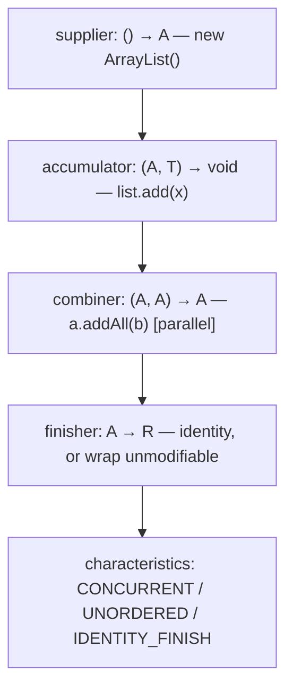

For `toList`, roughly: supplier `ArrayList::new`, accumulator `List::add`, combiner `(a,b)->{a.addAll(b);return a;}`, finisher identity (so `IDENTITY_FINISH`).

### The 3-Arg `collect` — the Interface Made Explicit

You can write a collector inline with the 3-argument `collect(supplier, accumulator, combiner)` — exactly the Collector's first three functions (no finisher, so `A == R`):

```java
List<String> list = stream.collect(
    ArrayList::new,        // supplier
    ArrayList::add,         // accumulator
    ArrayList::addAll);     // combiner

StringBuilder sb = stream.collect(
    StringBuilder::new,
    StringBuilder::append,
    StringBuilder::append);
```

This is the bare metal under `Collectors.toList()`. Use the named `Collectors` factories in real code; the 3-arg form is useful for understanding and for one-off custom containers.

## The `Collectors` Catalogue

### To Collections

| Collector | Result |
|-----------|--------|
| `toList()` | a `List` (mutable, typically `ArrayList`; no guarantee) |
| `toSet()` | a `Set` (`HashSet` — **unordered**) |
| `toCollection(Supplier)` | a specific collection — `toCollection(TreeSet::new)`, `toCollection(LinkedList::new)` |
| `toUnmodifiableList()` / `toUnmodifiableSet()` | immutable (Java 10+) — finisher wraps |

```java
List<String> names    = stream.collect(toList());
Set<String> unique    = stream.collect(toSet());
TreeSet<String> sorted = stream.collect(toCollection(TreeSet::new));
List<String> readonly = stream.collect(toUnmodifiableList());
```

> [!NOTE]
> For a simple read-only list, `Stream.toList()` (Java 16+, T04) is shorter than `collect(toUnmodifiableList())`. Use `collect(toCollection(...))` when you need a **specific** collection type (sorted set, linked list, etc.).

### To Maps — and the Duplicate-Key Trap

| Collector | Result |
|-----------|--------|
| `toMap(keyFn, valueFn)` | `Map<K,V>` — **throws on duplicate keys** |
| `toMap(keyFn, valueFn, mergeFn)` | duplicate keys merged via `mergeFn` |
| `toMap(keyFn, valueFn, mergeFn, mapSupplier)` | custom map type (`TreeMap`, `LinkedHashMap`) |
| `toConcurrentMap(...)` | a `ConcurrentHashMap` (parallel-friendly) |
| `toUnmodifiableMap(...)` | immutable (Java 10+) |

```java
Map<String, Person> byId = people.stream().collect(toMap(Person::id, p -> p));
```

If two elements produce the **same key**, `toMap(keyFn, valueFn)` throws:

```
java.lang.IllegalStateException: Duplicate key alice (attempted merging values P1 and P2)
```

Fix with a **merge function** that decides what to do with the collision:

```java
toMap(Person::name, p -> p, (a, b) -> a);          // keep first
toMap(Person::name, p -> p, (a, b) -> b);          // keep last
toMap(Word::text, w -> 1, Integer::sum);            // count occurrences
toMap(Person::dept, Person::name, (a, b) -> a + ", " + b);   // concatenate
```

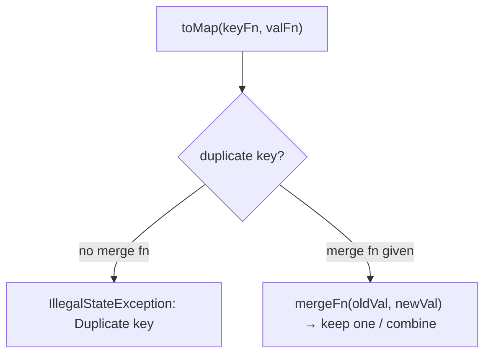

> [!WARNING]
> `toMap` **without a merge function throws on duplicate keys** — even if the values are equal. Whenever keys might collide (any key that isn't provably unique), supply a merge function.

### To String — `joining`

| Collector | Result |
|-----------|--------|
| `joining()` | concatenate all elements |
| `joining(delimiter)` | with a separator |
| `joining(delimiter, prefix, suffix)` | full form |

```java
String csv = names.stream().collect(joining(", "));               // "a, b, c"
String json = names.stream().collect(joining(", ", "[", "]"));    // "[a, b, c]"
```

`joining` uses a `StringBuilder` internally (T07) — O(N), not the O(N²) of `+`-concat in a loop. It only works on `Stream<? extends CharSequence>` (map to strings first if needed).

### Numeric and Statistical

| Collector | Result |
|-----------|--------|
| `counting()` | `Long` — element count |
| `summingInt/Long/Double(fn)` | sum of a projected value |
| `averagingInt/Long/Double(fn)` | `Double` — average |
| `summarizingInt/Long/Double(fn)` | `IntSummaryStatistics` (count/sum/min/max/avg in one pass) |
| `minBy/maxBy(Comparator)` | `Optional<T>` |
| `reducing(...)` | general reduction (3 overloads) |

```java
long n          = stream.collect(counting());
int totalAge    = people.stream().collect(summingInt(Person::age));
double avgAge   = people.stream().collect(averagingInt(Person::age));    // returns Double!
IntSummaryStatistics s = people.stream().collect(summarizingInt(Person::age));
// s.getCount(), getSum(), getMin(), getMax(), getAverage()
```

> [!NOTE]
> Watch the return types: `summingInt` returns `Integer`, `averagingInt` returns **`Double`** (an average isn't an int), `counting` returns **`Long`**. These mostly matter as **downstream** collectors (next section) — at top level, `stream.mapToInt(...).sum()` is usually cleaner (no boxing, T04).

### Adapting — Downstream Collectors

These **wrap another collector**, transforming elements before the downstream collects them:

| Collector | Effect |
|-----------|--------|
| `mapping(fn, downstream)` | map each element, then collect with `downstream` |
| `filtering(pred, downstream)` (Java 9+) | filter, then collect |
| `flatMapping(fn, downstream)` (Java 9+) | flatMap, then collect |
| `collectingAndThen(downstream, finisher)` | collect, then apply a final transform |

```java
// names per group, not the whole Person:
groupingBy(Person::dept, mapping(Person::name, toList()));

// collect to a list, then make it unmodifiable:
collectingAndThen(toList(), Collections::unmodifiableList);
```

These shine as the **downstream** argument to `groupingBy` (next).

## `groupingBy` — Stream → Structured Map

`groupingBy(classifier)` is the workhorse: it applies a **classifier function** to each element to compute a key, and collects elements with the same key into a `List`:

```java
// Map<Dept, List<Employee>>
Map<Dept, List<Employee>> byDept = emps.stream().collect(groupingBy(Employee::dept));
```

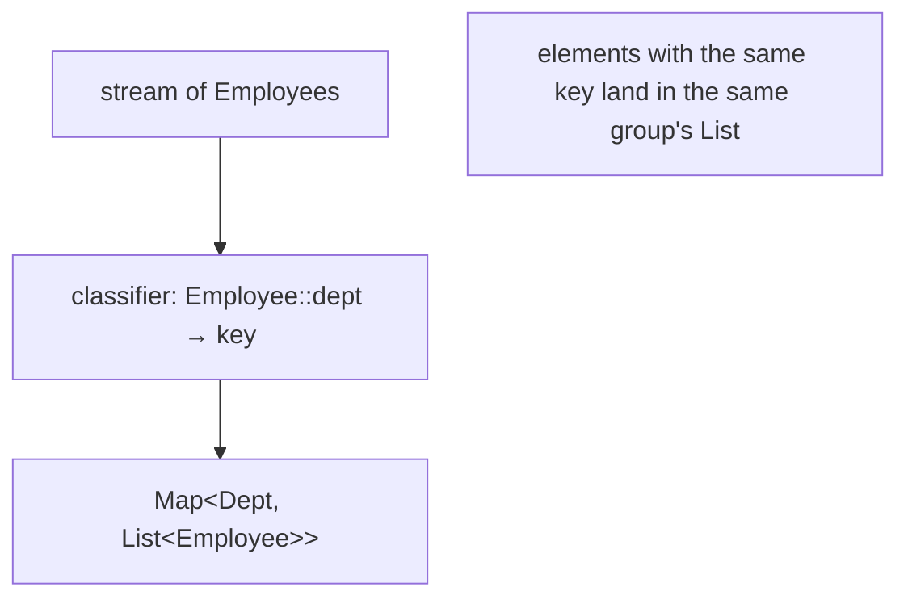

The power is the **downstream collector** — instead of collecting each group into a `List`, collect it however you like:

| Goal | Expression |
|------|-----------|
| count per group | `groupingBy(Employee::dept, counting())` → `Map<Dept, Long>` |
| names per group | `groupingBy(Employee::dept, mapping(Employee::name, toList()))` → `Map<Dept, List<String>>` |
| average salary per group | `groupingBy(Employee::dept, averagingDouble(Employee::salary))` → `Map<Dept, Double>` |
| highest-paid per group | `groupingBy(Employee::dept, maxBy(comparingDouble(Employee::salary)))` → `Map<Dept, Optional<Employee>>` |
| set of titles per group | `groupingBy(Employee::dept, mapping(Employee::title, toSet()))` → `Map<Dept, Set<String>>` |

```java
Map<Dept, Long> countByDept =
    emps.stream().collect(groupingBy(Employee::dept, counting()));

Map<Dept, Double> avgSalary =
    emps.stream().collect(groupingBy(Employee::dept, averagingDouble(Employee::salary)));

Map<Dept, List<String>> namesByDept =
    emps.stream().collect(groupingBy(Employee::dept, mapping(Employee::name, toList())));
```

`groupingBy(classifier)` is exactly `groupingBy(classifier, toList())` — the single-argument form just defaults the downstream to `toList()`.

### Custom Map Type and Nested Grouping

The three-argument form lets you pick the map type and the downstream:

```java
// TreeMap (sorted keys) instead of HashMap:
groupingBy(Employee::dept, TreeMap::new, toList());

// Nested grouping: Map<Dept, Map<Title, List<Employee>>>
groupingBy(Employee::dept, groupingBy(Employee::title));
```

Nesting `groupingBy` inside `groupingBy` builds a multi-level map — group by department, then within each department group by title. This is genuine multi-dimensional aggregation in one expression.

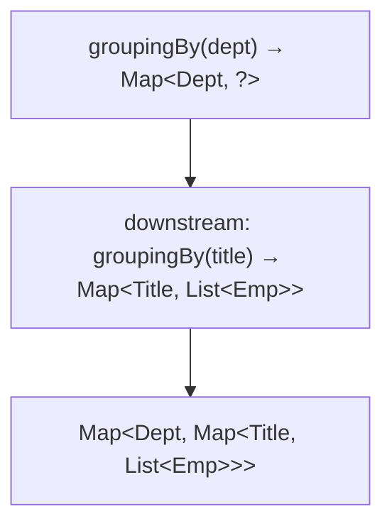

### `groupingByConcurrent`

`groupingByConcurrent(classifier, ...)` returns a `ConcurrentHashMap` and is **`CONCURRENT` + `UNORDERED`** — for **parallel** streams it shares one concurrent map across threads instead of building per-thread maps and merging. Faster for unordered parallel grouping (architecture section).

## `partitioningBy` — Split on a Boolean

`partitioningBy(predicate)` is grouping by a boolean — it splits the stream into two groups: elements where the predicate is **true**, and where it's **false**:

```java
Map<Boolean, List<Person>> byAdult =
    people.stream().collect(partitioningBy(p -> p.age() >= 18));

List<Person> adults = byAdult.get(true);
List<Person> minors = byAdult.get(false);
```

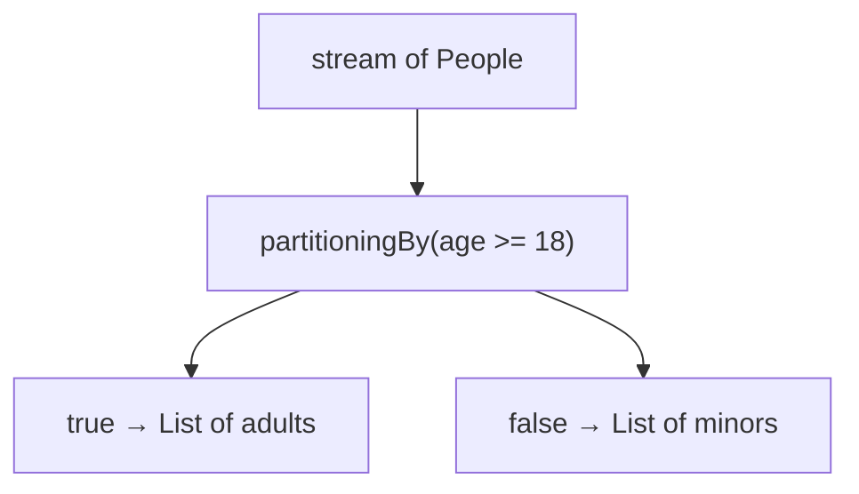

Two differences from `groupingBy(p -> p.age() >= 18)`:

1. **Always both keys.** `partitioningBy`'s result **always** has both `true` and `false` keys (with empty lists if no elements fall there). `groupingBy` only creates keys that occur — so if no minors, there's no `false` entry.
2. **Specialised 2-entry map.** It uses an optimised map for exactly two boolean keys.

`partitioningBy` also takes a **downstream**:

```java
Map<Boolean, Long> counts = people.stream().collect(partitioningBy(p -> p.age() >= 18, counting()));
```

## `teeing` — Two Collectors, One Pass (Java 12+)

`teeing(downstream1, downstream2, merger)` runs **two** collectors over the same stream in a single pass, then merges their results:

```java
// average and count in one pass:
record Stats(double avg, long count) {}
Stats stats = people.stream().collect(teeing(
    averagingInt(Person::age),
    counting(),
    Stats::new));
```

Useful when you need two aggregates and don't want two passes (the stream is single-use anyway, T04).

## Memory Layer — One Container, Mutated in Place

### The Container Is Mutated, Not Copied

`collect(toList())` creates **one** `ArrayList` and calls `add` per element. `ArrayList.add` is amortised O(1) (doubling growth, the same mechanism as `StringBuilder`, T07) — so N elements cost O(N) total, with ~log N reallocations of the backing array. This is the whole point of mutable reduction: **one** growing container, not N immutable copies.

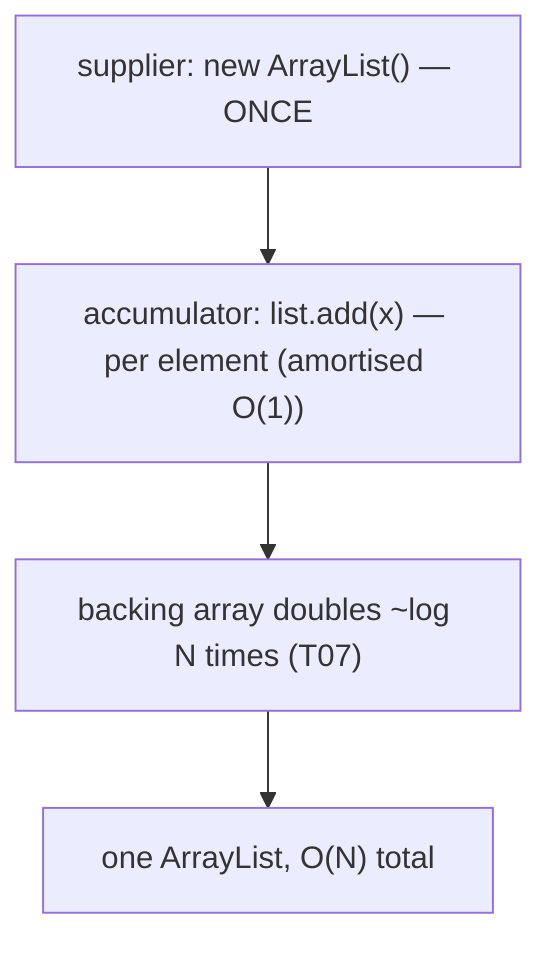

### `groupingBy` Internals — `computeIfAbsent` per Key

`groupingBy(classifier, downstream)` works like:

```java
Map<K, A> map = new HashMap<>();
for (T element : stream) {
    K key = classifier.apply(element);
    A container = map.computeIfAbsent(key, k -> downstream.supplier().get());   // new group container on first key
    downstream.accumulator().accept(container, element);                          // accumulate into the group
}
// finish: apply downstream.finisher() to each value (unless IDENTITY_FINISH)
```

So `groupingBy(dept, toList())` builds a `HashMap<Dept, ArrayList<Employee>>` — one `ArrayList` allocated per distinct department (lazily, on first occurrence), then elements `add`ed into their group. Memory = one map + one container per key + the elements (referenced, not copied).

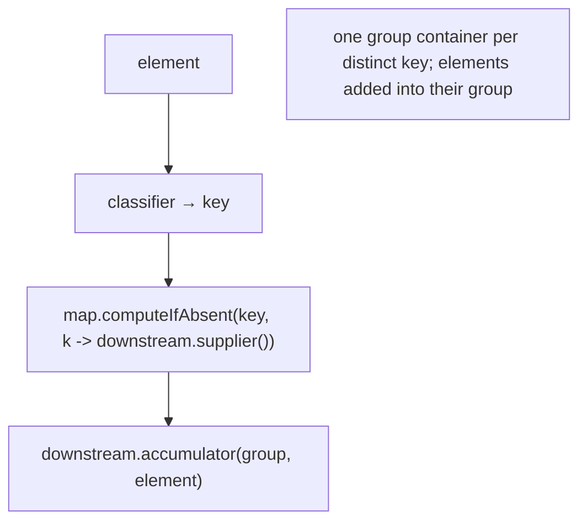

### Downstream Finisher

After accumulation, `groupingBy` applies the downstream **finisher** to each group's container — **unless** the downstream is `IDENTITY_FINISH` (then it's skipped). For `toList()` (IDENTITY_FINISH), the `ArrayList`s are returned directly. For `collectingAndThen(toList(), unmodifiableList)`, each group's list is wrapped at the end.

## Architecture Layer — Sequential vs Parallel Collection

### Sequential Collect — No Combiner

A **sequential** `collect` uses three of the five components:

1. `supplier()` — called **once** (one container).
2. `accumulator()` — called **per element**.
3. `finisher()` — called **once** (skipped if `IDENTITY_FINISH`).

The **combiner is never called** in sequential mode. So for a sequential `toList`, the combiner's correctness doesn't even matter.

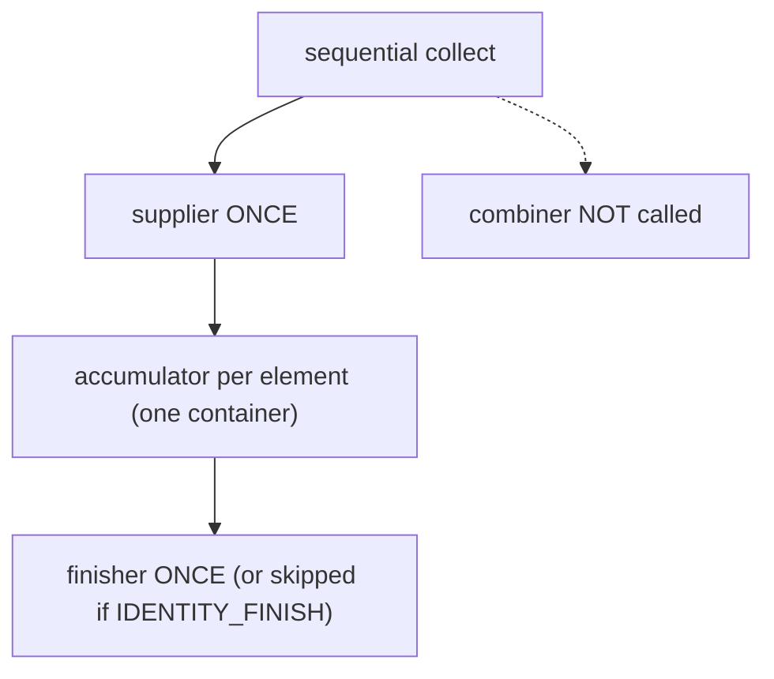

### Parallel Collect — Per-Thread Containers + Combiner Merge

A **parallel** `collect` (T06) splits the source, and **each thread**:

1. Calls `supplier()` to get its **own** container.
2. `accumulator()`s its chunk into that container.

Then the framework **combiner-merges** the partial containers pairwise into one, and applies the finisher once. The combiner **must be associative** (and consistent with the accumulator) for the result to be correct.

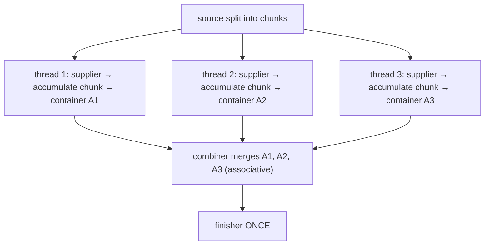

Because each thread accumulates into its **own** container, there's **no data race** even though the accumulator mutates — this is why `collect` is parallel-safe while ad-hoc `forEach(list::add)` is not (T04). The cost is the **merge** step (e.g., `addAll` for lists, per-entry merge for maps).

### Concurrent Collectors — One Shared Container, No Merge

A **`CONCURRENT` + `UNORDERED`** collector (`groupingByConcurrent`, `toConcurrentMap`) takes a different path in parallel: **all threads share one concurrent container** (a `ConcurrentHashMap`), and the accumulator is called **concurrently** on it. There are **no per-thread containers** and **no combiner merge** — which is faster for parallel **unordered** grouping (no merge cost), at the price of contention on the shared map.

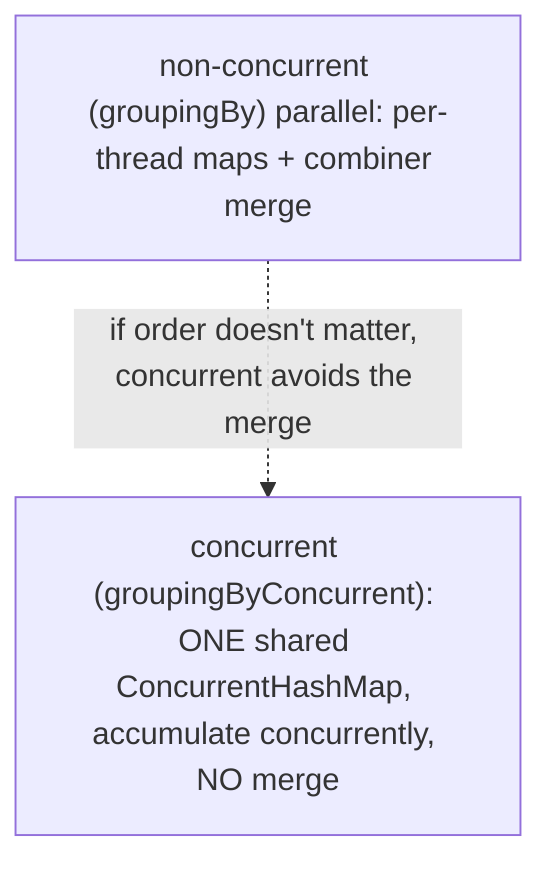

So: parallel + order doesn't matter → `groupingByConcurrent` can win (no merge). Parallel + order matters, or small data → plain `groupingBy` (sequential is often best for small data anyway, T06).

### `IDENTITY_FINISH` Skips the Finisher

When the finisher is the identity function (the container **is** the result — `toList`, `toSet`, `groupingBy`), the collector is flagged `IDENTITY_FINISH` and the runtime **skips** the finisher call entirely. `toUnmodifiableList`, `collectingAndThen`, `averagingInt` (the container is a `double[]`, the result a `Double`) are **not** identity-finish — their finisher runs.

## Common Mistakes

### `toMap` Duplicate-Key `IllegalStateException`

Covered above. Any non-unique key → throw. Always supply a merge function when keys might collide.

### `reduce` Instead of `collect` for Mutable Accumulation

Folding into a copied list/string with `reduce` is O(N²). Use `collect(toList())` / `collect(joining())`. (The canonical perf mistake.)

### Ordering Surprises with `toSet` / `groupingBy`

`toSet()` is a `HashSet`; `groupingBy` defaults to a `HashMap` — **both unordered**. If you need insertion order or sorted keys:

```java
toCollection(LinkedHashSet::new);                            // insertion-ordered set
groupingBy(classifier, LinkedHashMap::new, toList());        // insertion-ordered keys
groupingBy(classifier, TreeMap::new, toList());              // sorted keys
```

### Modifying a Collected Unmodifiable List

`toUnmodifiableList()` / `Stream.toList()` return immutable lists — `add`/`remove` throw. Use `toCollection(ArrayList::new)` if you need to mutate the result.

### Expecting `partitioningBy` to Omit an Empty Partition

`partitioningBy` **always** has both `true` and `false` keys (empty lists if no elements). `groupingBy` only creates keys that occur. Don't `if (map.containsKey(false))` on a partition — it's always there.

### Confusing Return Types

`averagingInt` returns `Double`; `counting` returns `Long`; `summingInt` returns `Integer`. As downstream collectors these matter for the map's value type (`Map<K, Double>` vs `Map<K, Long>`).

### `groupingBy` with a `null` Classifier Result

If the classifier returns `null` for some elements, `groupingBy` (backed by `HashMap`) tolerates a single `null` key — but `Collectors.groupingBy` historically threw NPE on null keys in some versions, and downstream operations may NPE. Filter out or map nulls before grouping if in doubt. `partitioningBy` never has this issue (always boolean).

### Using `collect(toList())` Where `Stream.toList()` Is Cleaner

For a read-only result, `stream.toList()` (Java 16+, T04) is shorter and clearly immutable. Reserve `collect(toCollection(...))` for when you need a specific mutable type.

### Forgetting the Downstream Default

`groupingBy(classifier)` defaults the downstream to `toList()`; `partitioningBy(pred)` likewise. When you want counts or sums per group, you must supply the downstream — `groupingBy(c, counting())`.

> [!INTERVIEW]
> Collectors are a deep modern-Java interview area — `groupingBy` especially.
>
> 1. **What's the difference between `collect` and `reduce`?** `collect` is mutable reduction (one container, mutated in place — O(N)); `reduce` is an immutable fold (new result each step — O(N²) for collections).
> 2. **What are the five components of a `Collector`?** supplier, accumulator, combiner, finisher, characteristics.
> 3. **What's the duplicate-key behaviour of `toMap`?** Throws `IllegalStateException` unless you provide a merge function.
> 4. **`groupingBy` vs `partitioningBy`?** `groupingBy` keys on any classifier (creates keys that occur); `partitioningBy` keys on a boolean predicate and always has both `true` and `false` keys.
> 5. **What's a downstream collector?** A collector passed to `groupingBy`/`partitioningBy`/`mapping` to collect each group — e.g., `groupingBy(dept, counting())`.
> 6. **When is the combiner called?** Only in **parallel** collection (to merge per-thread containers); never in sequential.
> 7. **Why is `collect(toList())` parallel-safe but `forEach(list::add)` is not?** `collect` gives each thread its own container and merges; `forEach` with a shared mutable list is a data race.
> 8. **What does `groupingByConcurrent` do differently?** Shares one `ConcurrentHashMap` across threads (CONCURRENT+UNORDERED) — no per-thread containers, no merge — faster for unordered parallel.
> 9. **What's `IDENTITY_FINISH`?** A characteristic meaning the finisher is identity (container == result), so the runtime skips it. `toList`/`toSet`/`groupingBy` have it; `toUnmodifiableList` doesn't.
> 10. **How do you build a `Map<Dept, Long>` of counts per department?** `groupingBy(Employee::dept, counting())`.
> 11. **How do you avoid the O(N²) trap when joining strings?** Use `Collectors.joining` (StringBuilder internally), not `reduce` with `+`.
> 12. **What's `teeing`?** (Java 12+) Run two collectors over one stream and merge their results in a single pass.

## Practice

1. **collect vs reduce.** Build a list two ways: `collect(toList())` and `reduce` with immutable copying. Benchmark on 100k elements; observe O(N) vs O(N²).
2. **3-arg collect.** Implement `toList` manually with `collect(ArrayList::new, ArrayList::add, ArrayList::addAll)`. Confirm it matches `collect(toList())`.
3. **toMap duplicate-key.** `people.stream().collect(toMap(Person::name, p -> p))` with two same-named people. Observe `IllegalStateException`. Fix with `(a, b) -> a` (keep first) and `(a, b) -> b` (keep last).
4. **joining.** Build a CSV with `joining(", ")` and a JSON-ish array with `joining(", ", "[", "]")`. Compare to a `reduce`-with-`+` version (O(N²)).
5. **counting per group.** `groupingBy(Employee::dept, counting())` → `Map<Dept, Long>`. Print the result.
6. **average per group.** `groupingBy(Employee::dept, averagingDouble(Employee::salary))` → `Map<Dept, Double>`.
7. **names per group via mapping.** `groupingBy(Employee::dept, mapping(Employee::name, toList()))` → `Map<Dept, List<String>>`.
8. **nested grouping.** `groupingBy(Employee::dept, groupingBy(Employee::title))` → `Map<Dept, Map<Title, List<Employee>>>`. Print the structure.
9. **partitioningBy always both keys.** Partition an all-adult list by `age >= 18`; confirm `map.get(false)` is an **empty list**, not null. Compare to `groupingBy(p -> p.age() >= 18)` which omits the absent key.
10. **ordering.** Group with the default (`HashMap`, unordered), then with `TreeMap::new` (sorted keys), then `LinkedHashMap::new` (insertion order). Compare key order.
11. **teeing.** Compute average age and count in one pass with `teeing(averagingInt(Person::age), counting(), (avg, cnt) -> ...)`.
12. **collectingAndThen.** Collect to a list then make it unmodifiable with `collectingAndThen(toList(), Collections::unmodifiableList)`; confirm `add` throws.
13. **summarizingInt.** Get count/sum/min/max/avg of ages in one pass via `summarizingInt(Person::age)`; print all five.
14. **Sequential vs parallel combiner.** Add prints to a custom collector's supplier/accumulator/combiner. Run sequential (combiner never called) then parallel (supplier per thread, combiner merges). Confirm.
15. **groupingByConcurrent.** Group a large list in parallel with `groupingBy` vs `groupingByConcurrent`; benchmark. Observe the concurrent version avoids the merge for unordered grouping.
16. **word frequency.** Count word occurrences in a text with `groupingBy(Function.identity(), counting())` and also with `toMap(w -> w, w -> 1L, Long::sum)`. Compare.
17. **Explain it back.** For `emps.stream().collect(groupingBy(Employee::dept, counting()))`, describe: (a) the supplier/accumulator/finisher of the outer collector and the `counting()` downstream, (b) the `computeIfAbsent` per department, (c) why no combiner runs sequentially, (d) what changes in parallel (per-thread maps + merge), (e) what `groupingByConcurrent` would change.

## Recap

You should now be able to:

- Distinguish **`collect` (mutable reduction)** from **`reduce` (immutable fold)** — `collect` mutates **one** container in place (O(N)); folding into copied collections with `reduce` is O(N²). Use `collect` for collections/maps/strings; `reduce` for single-value folds.
- Recall the **`Collector<T, A, R>`** five components — `supplier` (new container), `accumulator` (fold an element in), `combiner` (merge two containers, parallel only), `finisher` (container → result), `characteristics` (`CONCURRENT`/`UNORDERED`/`IDENTITY_FINISH`) — and the **3-arg `collect(supplier, accumulator, combiner)`** form that exposes the first three.
- Use the **`Collectors` catalogue** — `toList`/`toSet`/`toCollection`/`toUnmodifiable*`; `toMap` (with the **duplicate-key `IllegalStateException`** and the **merge-function** fix); `joining`; `counting`/`summingInt`/`averagingInt` (→ `Double`)/`summarizingInt`/`minBy`/`maxBy`/`reducing`; the adapting collectors `mapping`/`filtering`/`flatMapping`/`collectingAndThen`.
- Build structured maps with **`groupingBy`** (classifier → `Map<K, List<T>>`; the single-arg form defaults the downstream to `toList()`); add a **downstream collector** (`counting()`, `mapping(...)`, `averagingDouble(...)`, nested `groupingBy`) and a **custom map type** (`TreeMap::new`, `LinkedHashMap::new`).
- Use **`partitioningBy`** (boolean classifier → `Map<Boolean, List<T>>`) and recall its two differences from `groupingBy`: it **always** has both `true` and `false` keys, and uses an optimised 2-entry map.
- Use **`teeing`** (Java 12+) to run two collectors over one stream and merge their results in a single pass.
- Describe the **memory** behaviour — one container mutated in place (`ArrayList.add` amortised O(1), T07); `groupingBy` does `computeIfAbsent` per key then accumulates into each group's downstream container; the downstream finisher runs per group unless `IDENTITY_FINISH`.
- Predict the **architecture** behaviour — **sequential** collect: supplier once, accumulator per element, finisher once, **combiner never**; **parallel** collect: per-thread containers + **combiner merge** (associative), which is why `collect` is parallel-safe while ad-hoc `forEach(list::add)` is not; **concurrent** collectors (`groupingByConcurrent`, `toConcurrentMap`) share one `ConcurrentHashMap` (CONCURRENT+UNORDERED) and skip the merge — faster for unordered parallel; **`IDENTITY_FINISH`** skips the finisher.
- Avoid the **common traps**: `toMap` duplicate-key throw, `reduce`-for-mutable-accumulation (O(N²)), ordering surprises with `toSet`/`groupingBy` (HashMap unordered — use `LinkedHashMap`/`TreeMap`), modifying an unmodifiable result, expecting `partitioningBy` to omit empty partitions, confusing collector return types (`averagingInt` → `Double`), null classifier results, `collect(toList())` vs the cleaner `Stream.toList()`, forgetting to supply a downstream when you want counts/sums per group.

## Next

Continue to [Parallel streams](./T06-parallel-streams.md).
