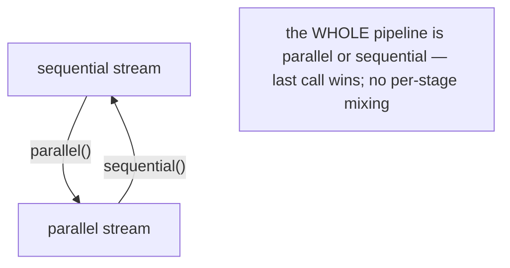
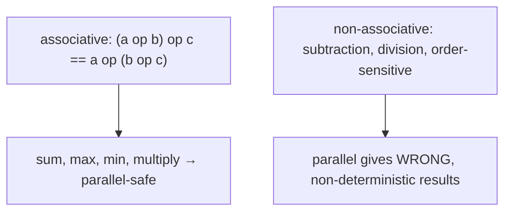
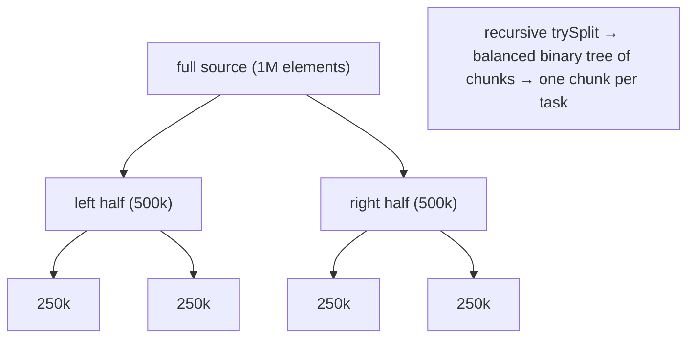
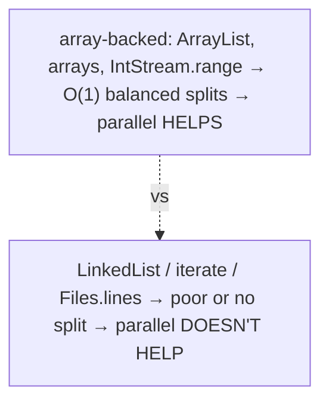
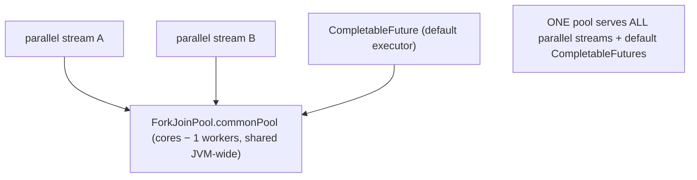
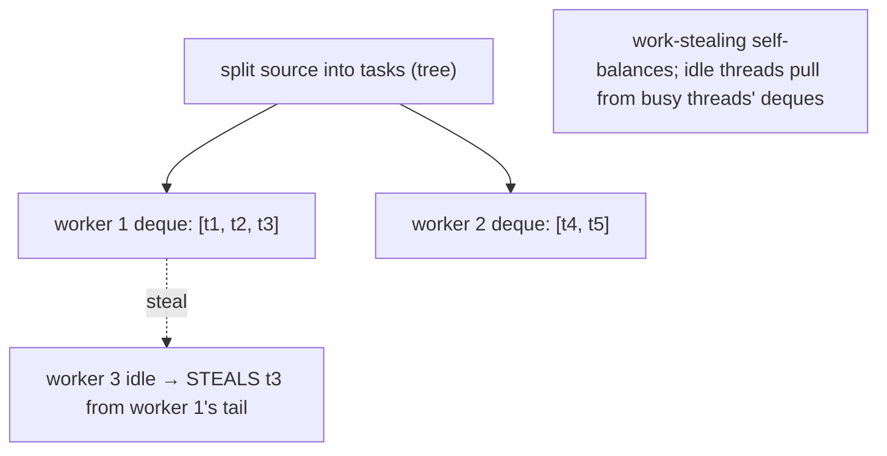
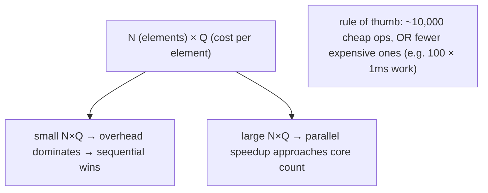
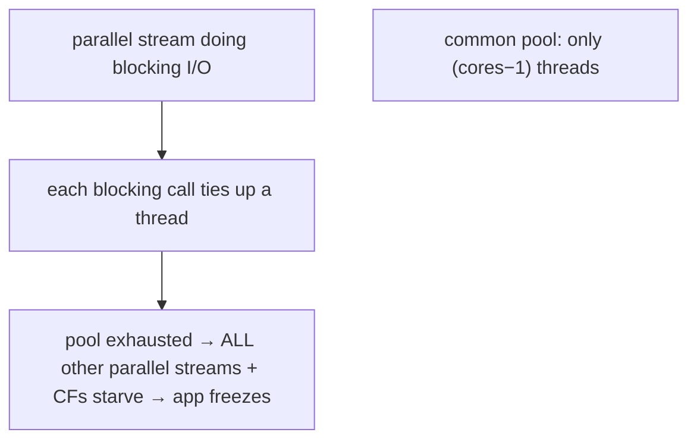
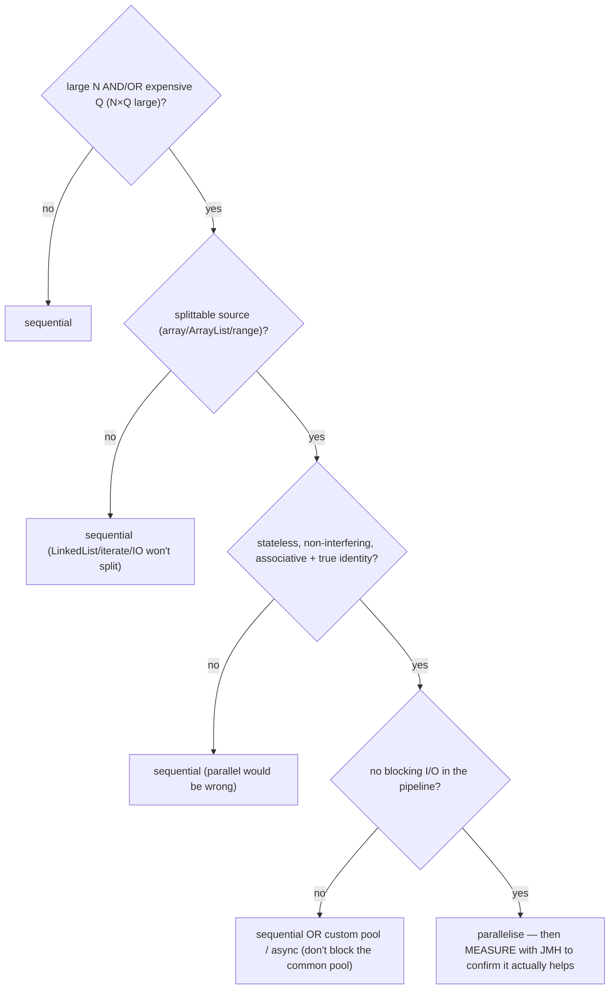

# Parallel streams

A **parallel stream** processes its elements on **multiple threads** — splitting the source into chunks, computing them concurrently, and merging the results. The API surface is almost invisible: `list.parallelStream()` or `stream.parallel()` and you're parallel. That tiny surface hides a large amount of machinery — a recursive source split, a shared fork/join thread pool, work-stealing — and a set of **correctness requirements** and **performance traps** that make parallel streams the most-misused feature in the chapter. Used right (large data, expensive per-element work, a splittable source), they give near-linear speedups for free. Used wrong (small data, blocking I/O, non-associative reductions), they're slower, wrong, or freeze the whole JVM.

The depth-bar requirement isn't just "add `.parallel()`." At the **language** layer, parallel execution imposes **correctness contracts** that sequential doesn't care about: operations must be **stateless** and **non-interfering**, and reductions must be **associative** with a true **identity** — violate these and parallel silently produces *wrong answers*. At the **memory** layer, parallelism rests on **`Spliterator.trySplit()`** ([T04](./T04-streams-api-intermediate-and-terminal-operations.md)) — the source recursively splits into a binary tree of chunks, and whether this is **balanced and cheap** (arrays, `ArrayList`, `IntStream.range`) or **poor** (`LinkedList`, `Stream.iterate`, `Files.lines`) decides whether parallelism helps at all. At the **architecture** layer, parallel streams run on the **shared `ForkJoinPool.commonPool`** with **work-stealing**, carry real **overhead** (split + schedule + merge), follow the **N×Q rule** (parallelism pays only when *elements × cost-per-element* is large), and have a dangerous **blocking-task hazard**: blocking I/O on the common pool starves *every other* parallel stream in the JVM. We'll cover every layer and finish with a decision guide.

> [!NOTE]
> Prerequisites: [Streams API](./T04-streams-api-intermediate-and-terminal-operations.md) (L2/C01/T04) — the lazy pipeline, the `Spliterator`, short-circuiting; [Collectors & grouping](./T05-collectors-and-grouping.md) (L2/C01/T05) — sequential vs parallel `collect`, per-thread containers + combiner merge, concurrent collectors; [Threads & Runnable](../../L3-advanced-jvm/C01-concurrency/T01-threads-and-runnable.md) (L3/C01/T01) — threads, the cost of context switches, why blocking ties up a thread. The **Fork/Join framework** itself is L3/C01/T13 (not yet authored — forward-referenced here); we cover what a stream user needs.

## Making a Stream Parallel

Two ways in, one way out:

```java
List<X> data = ...;
data.parallelStream().filter(...).map(...).collect(toList());     // parallel from the start
data.stream().parallel().filter(...).collect(toList());           // convert to parallel
data.stream().parallel().sequential().collect(toList());          // ...back to sequential
```

`parallel()` and `sequential()` set a **single flag on the whole pipeline** — there is **no per-stage parallelism**. The **last** call wins:

```java
stream.parallel().filter(...).sequential().map(...);    // runs SEQUENTIAL (last call)
```

So you can't make `filter` parallel and `map` sequential — the entire pipeline is one or the other, decided by the last `parallel()`/`sequential()` before the terminal op.



## Correctness Requirements — Where Parallel Bites

Sequential streams tolerate sloppy lambdas; parallel streams don't. Four contracts:

### 1. Stateless Operations

A `map`/`filter`/etc. lambda must compute its output from **only its input element** — not from external mutable state that changes during execution:

```java
int[] counter = {0};
stream.parallel().map(x -> x + counter[0]++);   // WRONG — shared mutable state, data race
```

Stateful lambdas race across threads and produce non-deterministic, wrong results.

### 2. Non-Interfering — Don't Modify the Source

```java
list.parallelStream().forEach(x -> list.add(...));   // WRONG — modifying the source mid-stream
```

Same rule as sequential, but parallel makes the `ConcurrentModificationException` (or undefined behaviour) far more likely.

### 3. Associative Accumulator (and True Identity)

For `reduce`, the accumulator must be **associative** — `(a op b) op c == a op (b op c)` — because parallel combines partial results in a **non-deterministic order**:

```java
// Sum is associative → parallel gives the right answer:
int sum = nums.parallelStream().reduce(0, Integer::sum);          // correct

// Subtraction is NOT associative → parallel gives WRONG answers:
int diff = nums.parallelStream().reduce(0, (a, b) -> a - b);      // wrong & non-deterministic!
```

`(10 - 3) - 2 = 5` but `10 - (3 - 2) = 9` — subtraction depends on grouping, which parallel doesn't fix. Addition, multiplication, min, max, `String` concatenation (with a matching combiner), and `Math.max` are associative; subtraction, division, and order-sensitive folds are not.

The **identity** must also be a true identity: `combiner(identity, x) == x` for all `x`. In parallel the identity may be combined **multiple times** (once per chunk), so a wrong identity (e.g., `1` for an addition fold) gives a wrong total.



### 4. No Side Effects on Shared Mutable State

```java
List<X> out = new ArrayList<>();
list.parallelStream().forEach(out::add);    // DATA RACE — ArrayList isn't thread-safe
```

Use `collect` (T05) — it gives each thread its **own** container and merges them safely. Ad-hoc `forEach(mutableCollection::add)` is a data race in parallel (and discouraged even sequentially).

> [!WARNING]
> Parallel streams **silently produce wrong results** when these contracts are violated — no exception, just a wrong answer (sometimes; non-deterministically). This is far more dangerous than a crash. Before parallelising, verify: stateless, non-interfering, associative + true identity, no shared mutation.

## Encounter Order in Parallel

Parallel streams still **respect encounter order** for ordered sources by default — `collect`, `reduce`, `findFirst` produce order-consistent results. But some ops trade order for speed:

| Op | Parallel behaviour |
|----|--------------------|
| `forEach` | **no order guarantee** — fastest |
| `forEachOrdered` | encounter order preserved — slower (coordination) |
| `findFirst` | respects order (more coordination) |
| `findAny` | returns **any** element — parallel-friendly, no order cost |
| `unordered()` | explicitly drops the ordering constraint → lets the runtime skip order-preservation (speeds up `distinct`, `limit`, etc. in parallel) |

```java
list.parallelStream().forEach(System.out::println);          // order NOT guaranteed
list.parallelStream().forEachOrdered(System.out::println);   // order preserved (slower)
list.parallelStream().unordered().distinct()...;              // faster distinct (order relaxed)
```

Prefer `findAny` over `findFirst` and `forEach` over `forEachOrdered` in parallel when order doesn't matter — the order-preserving variants add real coordination cost.

## Memory Layer — `Spliterator.trySplit()` Decomposition

Parallelism rests entirely on the source's ability to **split**. A stream's source is a `Spliterator` (T04); for parallel execution, the runtime calls **`trySplit()`** to break off a portion for another thread.

### The Split Tree

`trySplit()` returns a new `Spliterator` covering roughly **half** the elements (the original keeps the other half), or `null` if it can't split. This recurses — each half splits again — building a **binary tree** of chunks, until chunks are small enough (a threshold derived from the estimated size and the pool's parallelism):



### Good Splitters vs Bad Splitters

Whether splitting is **cheap and balanced** decides whether parallelism helps:

| Source | Split quality | Why |
|--------|---------------|-----|
| `ArrayList`, arrays (`Arrays.stream`) | **excellent** — O(1), balanced | backed by an array; split = compute a midpoint index |
| `IntStream.range(a, b)` | **excellent** — O(1), balanced | a numeric range; split the bounds |
| `HashSet`, `HashMap` | **good** — reasonably balanced | split the hash table buckets |
| `LinkedList` | **poor** — O(n), unbalanced | must walk to find the midpoint; splits are slow and lopsided |
| `Stream.iterate(seed, next)` | **terrible** — sequential | each element depends on the previous; can't split ahead |
| `Files.lines`, `BufferedReader.lines` | **terrible** — sequential I/O | read order is inherent; no split-ahead |
| `Stream.generate(supplier)` | **terrible** — no size, unordered | infinite, no structure to split |



The **`SIZED`** and **`SUBSIZED`** spliterator characteristics (T04) matter here: `SIZED` means the total size is known; `SUBSIZED` means each split also knows its size — both enable **balanced, predictable** splitting and let the framework size tasks well. Array-backed sources are `SIZED` + `SUBSIZED`; `iterate` and I/O streams are not.

> [!IMPORTANT]
> **Parallelise array-backed sources** (`ArrayList`, arrays, `IntStream.range`). **Don't bother** with `LinkedList`, `Stream.iterate`, or `Files.lines` — they split poorly (or not at all), so the threads can't get balanced work and parallelism adds overhead with no benefit.

## Architecture Layer — Fork/Join, Work-Stealing, and Overhead

### The Shared `ForkJoinPool.commonPool`

Parallel streams run on the **common `ForkJoinPool`** — a **single, JVM-wide, shared** thread pool:

- **Default size** = `Runtime.getRuntime().availableProcessors() - 1` worker threads. (The submitting thread also participates, so effectively all cores are used.)
- **Configurable** via `-Djava.util.concurrent.ForkJoinPool.common.parallelism=N`.
- **Shared across the entire JVM** — every parallel stream, and every `CompletableFuture` without a custom executor, uses the *same* pool.



That sharing is the root of the blocking hazard (below): a few badly-behaved tasks affect everything.

### Fork/Join + Work-Stealing

The computation is a **recursive fork/join task** mirroring the split tree (full mechanism in L3/C01/T13):

1. If a chunk is small enough → **compute it directly** (a leaf task).
2. Else → **split** into two subtasks, **fork** one (queue it for another thread), **compute** the other, then **join** (wait for the forked result) and **merge**.

Each worker thread has its own **deque** of tasks. When a thread runs out of work, it **steals** a task from the **tail** of a busy thread's deque — **work-stealing**. This keeps all cores busy even when the work is unbalanced; the load self-balances without central coordination.



### The Overhead — Why Parallel Can Be Slower

Parallelism is not free:

- **Splitting** the source (`trySplit` calls down the tree).
- **Task creation + scheduling** (`ForkJoinTask` objects, deque operations).
- **Merging** partial results (the combiner — T05; for `collect`, per-thread containers then merge).
- **Common-pool contention** and **cache effects** (threads on different cores sharing data; cache-line bouncing).

For **small data** or **cheap per-element work**, this overhead **dwarfs** the parallel benefit — parallel is **slower** than sequential. A `list.parallelStream().map(x -> x + 1)` over 100 elements is pure loss.

### The N×Q Rule of Thumb

Parallelism pays off when **N × Q** is large enough to amortise the machinery, where:

- **N** = number of elements.
- **Q** = cost per element (how expensive the per-element work is).



Rough guidance (Goetz/Lea): parallelism is worth considering at **~10,000 elements** of cheap work, or **far fewer** elements of expensive work (e.g., 100 elements each doing a multi-millisecond computation). Below ~1,000 cheap ops, sequential almost always wins. **Always measure** (with JMH or careful warm-up) — don't assume.

### The Blocking-Task Hazard

The most dangerous parallel-stream mistake. The common pool has only ~(cores − 1) threads. If a parallel stream's per-element work **blocks** — a network call, a database query, `Thread.sleep`, a contended lock, a blocking queue — it **ties up a common-pool thread doing nothing**:

```java
urls.parallelStream()
    .map(url -> httpClient.get(url))     // BLOCKS on I/O — ties up a common-pool thread per call
    .collect(toList());
```

Because the pool is **shared JVM-wide**, a handful of blocking parallel streams can **exhaust all common-pool threads**, **starving every other parallel stream and `CompletableFuture`** in the application — the whole app freezes or deadlocks.



Fixes:

1. **Don't parallelise blocking work.** CPU-bound work only on parallel streams.
2. **Use a custom `ForkJoinPool`** to isolate the work (next section).
3. **Use async/virtual-thread APIs** for I/O (`CompletableFuture` with a dedicated executor, or virtual threads — L3/C01/T14) instead of parallel streams.

> [!WARNING]
> **Never do blocking I/O in a parallel stream on the common pool.** It can starve the entire JVM's parallel machinery. Parallel streams are for **CPU-bound** work over large data. For I/O, use async APIs or virtual threads.

### Isolating Work With a Custom `ForkJoinPool`

A parallel stream runs on **whatever pool the submitting thread belongs to**. So you can run it on a *custom* pool by submitting it from that pool:

```java
ForkJoinPool customPool = new ForkJoinPool(4);
try {
    List<Integer> result = customPool.submit(() ->
        list.parallelStream().map(expensiveCpuWork).collect(toList())
    ).get();
} finally {
    customPool.shutdown();
}
```

The parallel stream executes on `customPool`, isolated from the common pool. This is the documented (if slightly hacky) way to bound parallel-stream work and protect the common pool. (For blocking work, a dedicated bounded pool is safer than the common pool — but virtual threads are the modern answer.)

### Concurrent Collectors Avoid the Merge (T05 callback)

For parallel **collection**, `groupingByConcurrent` / `toConcurrentMap` (T05) share **one** `ConcurrentHashMap` across threads instead of per-thread maps + merge — faster for unordered parallel grouping (no merge step), at the price of contention on the shared map.

## When to Parallelise — Decision Guide



All of:

- **Large N×Q** (≥ ~10k cheap ops, or fewer expensive ones).
- **Splittable source** (array-backed; not linked/iterate/IO).
- **Associative** reduction + true identity; **stateless**, **non-interfering** ops.
- **No blocking** in the pipeline (or use a custom pool / async).
- **Measured** to actually help.

If any fail → **sequential**. The default should be sequential; reach for parallel deliberately, and verify.

## Common Mistakes

### Parallelising Small or Cheap Streams

```java
shortList.parallelStream().map(x -> x + 1)...   // slower than sequential — overhead dominates
```

Below the N×Q threshold, the fork/join machinery costs more than it saves.

### Stateful or Side-Effecting Lambdas

Shared mutable state read or written in a parallel lambda is a data race and produces wrong, non-deterministic results. Keep lambdas pure.

### `forEach(sharedCollection::add)`

A data race on a non-thread-safe collection. Use `collect(toList())` — it's parallel-safe (per-thread containers + merge, T05).

### Non-Associative Reduce

`reduce(0, (a, b) -> a - b)` and other non-associative folds give wrong answers in parallel. Verify associativity before parallelising a reduce.

### Blocking I/O on the Common Pool

The JVM-wide starvation hazard. Never block in a common-pool parallel stream. Use a custom pool or async I/O.

### Assuming Parallel Preserves `forEach` Order

`forEach` is unordered in parallel. Use `forEachOrdered` if you need order (slower), or restructure to avoid order dependence.

### Parallelising `LinkedList` / `iterate` / `Files.lines`

These split poorly or not at all — parallelism adds overhead with no balanced work. Copy to an `ArrayList` first if you must parallelise, or stay sequential.

### Measuring Without Warm-Up / JMH

Naive `System.nanoTime` benchmarks measure the cold interpreter, not steady state (T04). Use JMH or careful warm-up; parallel-vs-sequential numbers are meaningless otherwise.

### Wrong Identity in `reduce`

In parallel, the identity is combined once per chunk. `reduce(1, Integer::sum)` (using 1 as the identity for addition) gives a wrong total — use `0`.

### Nesting Parallel Streams

A parallel stream whose elements each run another parallel stream saturates the common pool with nested tasks. Flatten or keep the inner work sequential.

> [!INTERVIEW]
> Parallel streams are a favourite "do you actually understand this?" interview topic.
>
> 1. **How do you make a stream parallel?** `collection.parallelStream()` or `stream.parallel()`. The whole pipeline is parallel; the last `parallel()`/`sequential()` wins.
> 2. **What pool do parallel streams run on?** The shared `ForkJoinPool.commonPool` (size = cores − 1, JVM-wide).
> 3. **What does a parallel reduce require of the accumulator?** Associativity (and a true identity) — because partial results combine in non-deterministic order. Subtraction is not associative → wrong results.
> 4. **Why might a parallel stream be slower than sequential?** Overhead — splitting, task scheduling, merging, contention. For small N or cheap Q, overhead dominates.
> 5. **What's the N×Q rule?** Parallelism pays only when elements × cost-per-element is large (≈10k cheap ops or fewer expensive ones).
> 6. **What's the blocking-task hazard?** Blocking I/O in a common-pool parallel stream ties up shared threads and can starve the whole JVM's parallel machinery. Use a custom pool or async I/O.
> 7. **Which sources parallelise well?** Array-backed (`ArrayList`, arrays, `IntStream.range`) — O(1) balanced `trySplit`. Poorly: `LinkedList`, `Stream.iterate`, `Files.lines`.
> 8. **What's `trySplit`?** The `Spliterator` method that breaks off ~half the elements for another thread; recursion builds the split tree.
> 9. **What's work-stealing?** Idle worker threads steal tasks from busy threads' deques, self-balancing the load.
> 10. **Why is `collect` parallel-safe but `forEach(list::add)` not?** `collect` gives each thread its own container and merges; `forEach` with a shared mutable list is a data race.
> 11. **`findFirst` vs `findAny` in parallel?** `findFirst` respects encounter order (coordination cost); `findAny` returns any element (parallel-friendly).
> 12. **How do you isolate parallel-stream work from the common pool?** Submit the stream computation to a custom `ForkJoinPool` via `pool.submit(() -> ...parallelStream()...).get()`.

## Practice

1. **Parallel vs sequential — small.** Benchmark (JMH or warm-up) `map(x -> x+1)` over 100 elements, sequential vs parallel. Confirm parallel is **slower** (overhead).
2. **Parallel vs sequential — large + expensive.** Benchmark a CPU-heavy op (e.g., `isPrime`) over 1M ints, sequential vs parallel. Confirm parallel approaches core-count speedup.
3. **N×Q sweep.** Vary N (100, 10k, 1M) and Q (trivial add, vs a 0.1ms computation). Find where parallel starts winning. Relate to the N×Q rule.
4. **Non-associative wrongness.** `reduce(0, (a,b) -> a-b)` sequential vs parallel over a list. Confirm parallel gives a **different, wrong** answer. Repeat with `Integer::sum` (correct both ways).
5. **Wrong identity.** `reduce(1, Integer::sum)` parallel; confirm the total is wrong (identity combined per chunk). Fix with `0`.
6. **forEach order.** `parallelStream().forEach(println)` vs `forEachOrdered(println)`. Observe the order difference.
7. **Data race via forEach.** `parallelStream().forEach(arrayList::add)`; run many times; observe lost/corrupted elements or exceptions. Fix with `collect(toList())`.
8. **trySplit observation.** Get an `ArrayList`'s and a `LinkedList`'s spliterator; call `trySplit()` and print the result sizes (`estimateSize`). Confirm the ArrayList splits cleanly in half; the LinkedList splits poorly or returns null.
9. **Source matters.** Sum 1M ints from an `ArrayList` vs a `LinkedList` in parallel. Confirm the `LinkedList` gets little/no speedup.
10. **Common-pool size.** Print `ForkJoinPool.commonPool().getParallelism()`. Run with `-Djava.util.concurrent.ForkJoinPool.common.parallelism=2` and confirm it changes.
11. **Blocking starvation.** Run a parallel stream where each element `Thread.sleep(100)`s, while another thread tries to run its own parallel stream. Observe the second one starving. Fix by submitting to a custom `ForkJoinPool`.
12. **Custom pool isolation.** Run a parallel stream inside `new ForkJoinPool(4).submit(() -> ...).get()`. Confirm (via `Thread.currentThread().getName()`) it runs on the custom pool, not the common one.
13. **groupingBy vs groupingByConcurrent in parallel.** Group 1M elements in parallel both ways; benchmark; confirm the concurrent collector avoids the merge for unordered grouping (T05).
14. **unordered speedup.** `parallelStream().distinct()` vs `parallelStream().unordered().distinct()`; benchmark; observe the unordered version can be faster (no order preservation).
15. **findAny vs findFirst.** In a parallel stream, time `findFirst` vs `findAny`; confirm `findAny` is cheaper (no order coordination).
16. **Explain it back.** For `list.parallelStream().filter(p).map(f).collect(toList())` on a 1M-element `ArrayList`: describe (a) how `trySplit` builds the chunk tree, (b) which pool runs it and its size, (c) how work-stealing balances the chunks, (d) why `collect` is safe (per-thread containers + merge), (e) the N×Q condition under which this beats sequential, (f) what would go wrong if `f` did blocking I/O.

## Recap

You should now be able to:

- Make a stream parallel with `collection.parallelStream()` or `stream.parallel()`, and recall that the **whole pipeline** is parallel or sequential (no per-stage mixing; last `parallel()`/`sequential()` wins).
- Apply the **correctness contracts** parallel imposes: **stateless** ops, **non-interfering** (don't modify the source), **associative** accumulator + **true identity** for reductions (non-associative folds like subtraction give wrong, non-deterministic answers), and **no side effects on shared mutable state** (use `collect`, not `forEach(list::add)`).
- Recognise that parallel streams **silently produce wrong results** when these contracts are violated — verify before parallelising.
- Handle **encounter order** in parallel — `forEach` is unordered (fast), `forEachOrdered` preserves order (slower); `findAny` is parallel-friendly, `findFirst` respects order; `unordered()` relaxes ordering for speed.
- Explain the **`Spliterator.trySplit()`** decomposition — the source recursively splits into a balanced binary tree of chunks; **array-backed sources** (`ArrayList`, arrays, `IntStream.range`) split cheaply and balanced (`SIZED`+`SUBSIZED`), while **`LinkedList`/`Stream.iterate`/`Files.lines`** split poorly or not at all (so parallelism doesn't help them).
- Describe the **architecture**: parallel streams run on the shared **`ForkJoinPool.commonPool`** (size cores − 1, JVM-wide); the computation is a recursive **fork/join** task tree with **work-stealing** (idle threads steal from busy deques, self-balancing).
- Account for the **overhead** (split + schedule + merge + contention) that makes parallel **slower** for small N or cheap Q, and apply the **N×Q rule** (parallelism pays at ≈10k cheap ops, or fewer expensive ones) — and **always measure**.
- Avoid the **blocking-task hazard**: blocking I/O on the common pool ties up shared threads and can **starve the whole JVM**; for I/O use async APIs / virtual threads, or isolate CPU work on a **custom `ForkJoinPool`** (`pool.submit(() -> ...parallelStream()...).get()`).
- Use **concurrent collectors** (`groupingByConcurrent`, `toConcurrentMap`, T05) to avoid the per-thread-container merge in unordered parallel collection.
- Apply the **decision guide** — parallelise only when N×Q is large, the source is splittable, the ops are stateless/non-interfering/associative, there's no blocking, and you've measured a real benefit; default to sequential otherwise.
- Avoid the **common traps**: parallelising small/cheap streams, stateful/side-effecting lambdas, `forEach(sharedCollection::add)`, non-associative reduce, blocking I/O on the common pool, assuming `forEach` order, parallelising `LinkedList`/`iterate`/`Files.lines`, benchmarking without warm-up, wrong identity, nesting parallel streams.

## Next

Continue to [Optional in depth](./T07-optional-in-depth.md).
