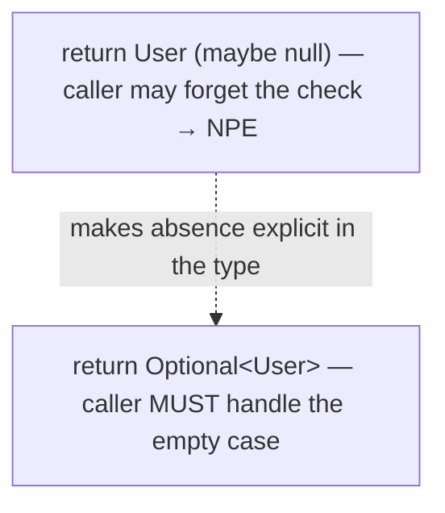
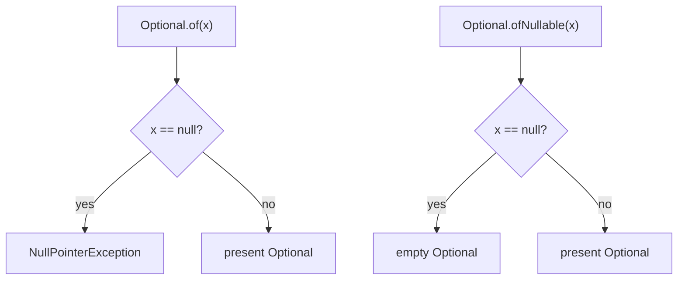
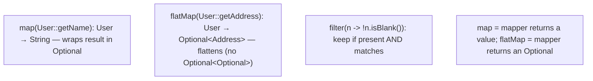
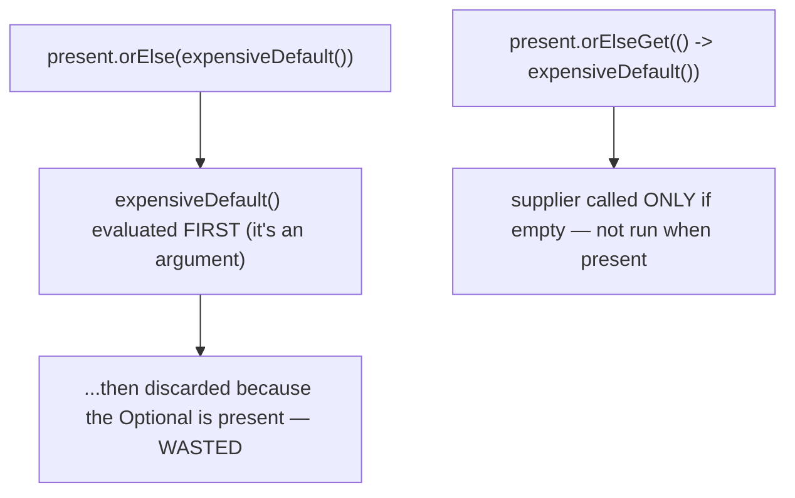
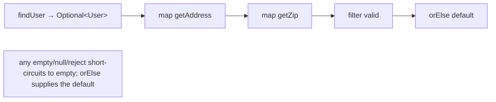
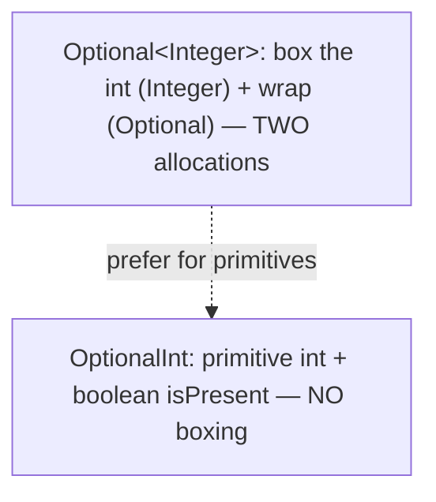
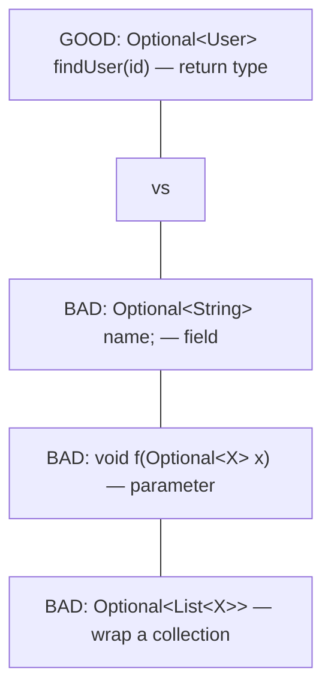
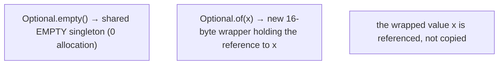
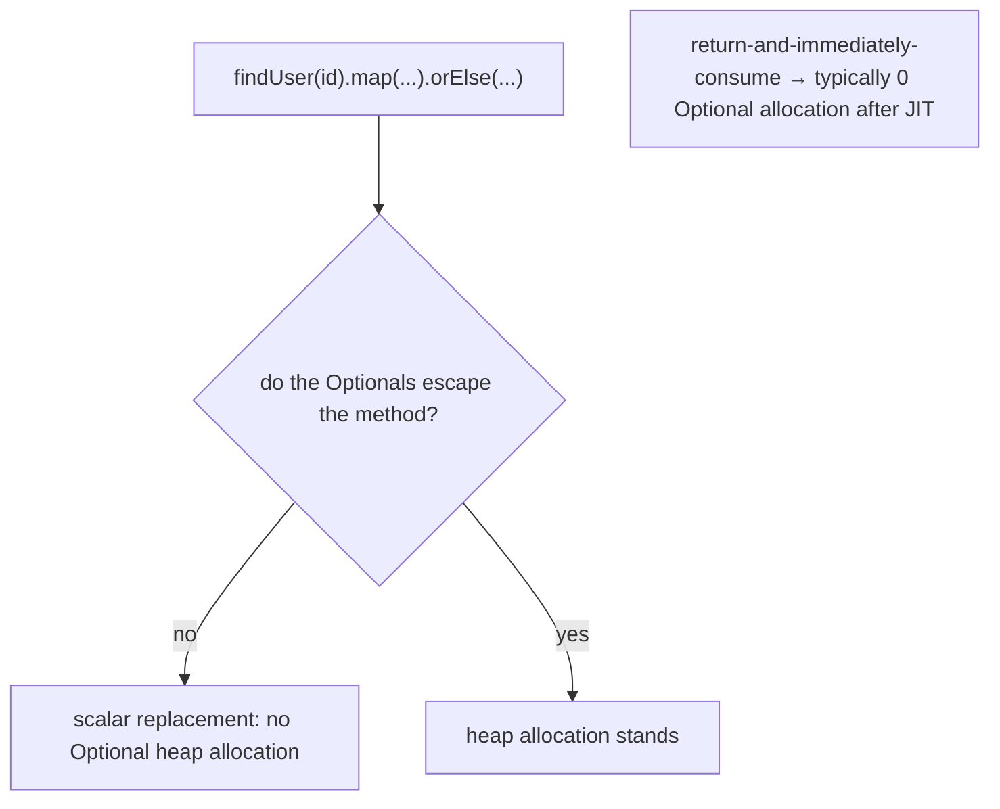
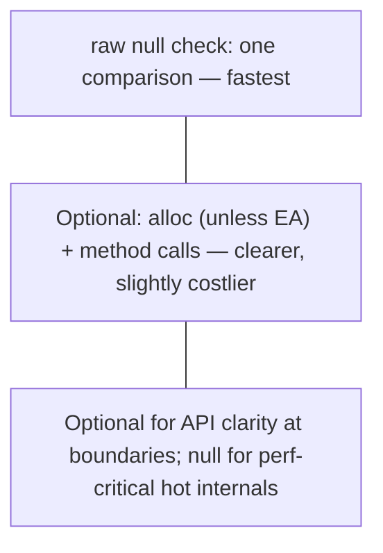

# Optional in depth

`Optional<T>` is a container that holds either **one value** or **nothing** — the principled, type-level alternative to returning `null`. When a method might not have a result, `Optional<User> findUser(String id)` says so **in the signature**: the caller can't ignore the maybe-absent case the way they can silently forget a null check. Optional is the capstone of the functional toolkit — it composes with `map`/`filter`/`flatMap` just like a one-element stream, and it appears all over the Streams API (`findFirst`, `reduce`, `max` all return `Optional`).

The depth-bar requirement isn't just "use `Optional`." At the **language** layer, the API has sharp edges — `Optional.of(null)` **throws**, `get()` without a check defeats the purpose, and the **`orElse` vs `orElseGet`** distinction (eager vs lazy default evaluation) is a real correctness/performance trap. There's a tight set of **best-practice rules** (Effective Java item 55): Optional is for **return types only** — never fields, parameters, or collections. At the **memory** layer, Optional is a thin immutable wrapper — `Optional.empty()` is a **shared singleton** (zero allocation), while `Optional.of(x)` allocates one ~16-byte object; an `Optional<Integer>` allocates **twice** (box the int, then wrap), which is why `OptionalInt` exists. At the **architecture** layer, Optional adds an allocation and a few method calls over a raw null check — which is why the JDK's own hot internals still use `null` — but **escape analysis** ([T01](./T01-lambda-expressions.md)/[T15](../../L0-foundations/C02-java-core/T15-variable-scope-and-lifetime.md)) eliminates short-lived Optionals, so the common return-and-immediately-consume pattern often allocates nothing after JIT. We'll cover every layer.

> [!NOTE]
> Prerequisites: [Streams API](./T04-streams-api-intermediate-and-terminal-operations.md) (L2/C01/T04) — `findFirst`/`reduce`/`max` return `Optional`; `Optional.stream()` flatMaps into pipelines; [Functional interfaces](./T02-functional-interfaces-function-predicate-supplier-consumer.md) (L2/C01/T02) — `Function`/`Predicate`/`Supplier`/`Consumer` (the `map`/`filter`/`orElseGet`/`ifPresent` arguments); [Method references](./T03-method-and-constructor-references.md) (L2/C01/T03) — `Optional::stream`, `User::getName` in chains; [Wrapper classes & autoboxing](../../L0-foundations/C02-java-core/T17-wrapper-classes-and-autoboxing.md) (L0/C02/T17) — why `OptionalInt` avoids double allocation; [Variable scope & lifetime](../../L0-foundations/C02-java-core/T15-variable-scope-and-lifetime.md) (L0/C02/T15) — escape analysis eliminating short-lived Optionals.

## Why Optional Exists — the `null` Problem

`null` is famously Tony Hoare's "billion-dollar mistake." Two concrete problems:

1. **It doesn't document intent.** `User findUser(String id)` — can this return `null`? The signature doesn't say. Callers forget to check → `NullPointerException` at runtime, far from the cause.
2. **The compiler can't help.** Nothing forces you to handle the null case; the NPE surfaces only when the null is dereferenced.

`Optional` puts the "maybe absent" into the **type**:

```java
Optional<User> findUser(String id);     // the signature SAYS: you might get nothing
```

Now the caller **must** acknowledge the empty case — you can't call `User` methods on an `Optional<User>` without first unwrapping it. The compiler enforces the conversation.



> [!IMPORTANT]
> Optional's job is **documenting and enforcing the maybe-absent contract at API boundaries** — not eliminating null everywhere. Inside a method, a plain null check is often fine; Optional shines as a **return type**.

## Creating an Optional

| Factory | Behaviour |
|---------|-----------|
| `Optional.of(value)` | wraps a **non-null** value — **throws `NullPointerException` if value is null** |
| `Optional.ofNullable(value)` | wraps the value, or returns **empty** if it's null |
| `Optional.empty()` | the empty Optional (a shared singleton) |

```java
Optional<String> a = Optional.of("hello");           // present
Optional<String> b = Optional.of(null);              // NullPointerException!
Optional<String> c = Optional.ofNullable(maybeNull); // empty if maybeNull is null — the safe factory
Optional<String> d = Optional.empty();               // empty
```



> [!WARNING]
> **`Optional.of(null)` throws.** Use `of` only when you *know* the value is non-null (and want a fast failure if it isn't); use `ofNullable` whenever the value might be null. Mixing these up is the #1 Optional bug.

## Querying — the Imperative API (Mostly to Avoid)

| Method | Returns |
|--------|---------|
| `isPresent()` | `true` if a value is present |
| `isEmpty()` | `true` if empty (Java 11+) |
| `get()` | the value, or throws `NoSuchElementException` if empty |

```java
if (opt.isPresent()) {
    User u = opt.get();      // works, but verbose and un-idiomatic
}
```

This **`isPresent()` + `get()`** pattern is "null with extra steps" — it doesn't gain you anything over a null check and is exactly what the functional API replaces. Reserve `get()` for cases where you've *proven* presence (and even then, prefer `orElseThrow()` for a clearer failure).

> [!WARNING]
> **Avoid `get()` without a guard.** Calling `get()` on an empty Optional throws `NoSuchElementException`. Using `isPresent()` + `get()` everywhere defeats Optional's purpose — use the functional methods (`map`/`orElse`/`ifPresent`) instead.

## The Functional API — the Preferred Way

Optional composes like a one-element stream.

### `map`, `flatMap`, `filter`

```java
Optional<User> user = findUser(id);

Optional<String> name = user.map(User::getName);            // transform if present
Optional<String> upper = user.map(User::getName).map(String::toUpperCase);  // chain

Optional<String> valid = user.map(User::getName).filter(n -> !n.isBlank()); // keep if matches

// flatMap when the mapper itself returns an Optional:
Optional<Address> addr = user.flatMap(User::getAddress);    // getAddress() returns Optional<Address>
```

- **`map(Function<T,U>)`** — transform the value if present; empty stays empty. If the mapper returns `null`, `map` yields **empty** (it wraps with `ofNullable` internally).
- **`flatMap(Function<T, Optional<U>>)`** — like `map`, but the mapper **returns an Optional**; `flatMap` **flattens** it, avoiding `Optional<Optional<U>>`.
- **`filter(Predicate<T>)`** — keep the value if present **and** matches; otherwise empty.



> [!IMPORTANT]
> **`map` vs `flatMap`**: use `map` when the mapper returns a **plain value**; use `flatMap` when the mapper returns an **`Optional`**. Using `map` with an Optional-returning function gives you `Optional<Optional<T>>` — the nested-Optional smell.

### `ifPresent`, `ifPresentOrElse`

```java
user.ifPresent(u -> System.out.println(u.getName()));        // run if present
user.ifPresentOrElse(                                         // Java 9+
    u -> System.out.println(u.getName()),                    // present action
    () -> System.out.println("no user"));                    // empty action
```

`ifPresent(Consumer)` runs a side effect when present; `ifPresentOrElse(Consumer, Runnable)` (Java 9+) adds an else-branch — the functional replacement for `if (opt.isPresent()) {...} else {...}`.

## Defaulting — `orElse` vs `orElseGet` (the Trap)

| Method | Default | Evaluated |
|--------|---------|-----------|
| `orElse(value)` | a value | **always** — even when present! |
| `orElseGet(Supplier)` | a supplier | **lazily** — only when empty |
| `orElseThrow()` | (Java 10+) | throws `NoSuchElementException` if empty |
| `orElseThrow(Supplier<X>)` | a supplied exception | throws it if empty |
| `or(Supplier<Optional<T>>)` | a fallback Optional | (Java 9+) chains alternative Optionals |

```java
String n1 = user.map(User::getName).orElse("anonymous");           // default value
String n2 = user.map(User::getName).orElseGet(() -> computeDefault()); // lazy default
User u    = findUser(id).orElseThrow(() -> new NotFoundException(id));  // throw on empty
Optional<User> result = findInCache(id).or(() -> findInDb(id));        // fallback chain
```

### The `orElse` Eager-Evaluation Trap

`orElse(x)` takes a **value** `x`, which is **evaluated at the call site before `orElse` runs** — so the default is computed **even when the Optional is present** and the default is thrown away:

```java
Optional<String> present = Optional.of("value");

String a = present.orElse(expensiveDefault());        // expensiveDefault() RUNS — wastefully!
String b = present.orElseGet(() -> expensiveDefault()); // expensiveDefault() does NOT run (present)
```



For a **cheap constant** default (`orElse("anonymous")`), `orElse` is fine and clearer. For an **expensive** default, a default with **side effects** (`orElse(saveAndReturn())` — saves every time!), or any computation you don't want to run when present, use **`orElseGet`**.

> [!WARNING]
> `orElse(computeDefault())` **always runs `computeDefault()`** — even when the value is present. For expensive or side-effecting defaults, use `orElseGet(() -> computeDefault())` (lazy). This is the most common Optional performance/correctness bug.

## Chaining — the Idiom

The functional methods chain into a single null-safe expression:

```java
String zip = findUser(id)               // Optional<User>
    .map(User::getAddress)               // Optional<Address>  (if getAddress returns Address)
    .map(Address::getZip)                // Optional<String>
    .filter(z -> z.matches("\\d{5}"))    // Optional<String> (keep valid)
    .orElse("00000");                    // String — default if anything was absent/invalid
```

If `findUser` is empty, or any `map` produces null, or the filter rejects, the whole chain short-circuits to empty and `orElse` supplies the default — **no explicit null checks, no NPE**. This is Optional's reason to exist.



## `Optional.stream()` — Bridging to Streams (Java 9+)

`Optional.stream()` returns a stream of **0 or 1** element — empty for an empty Optional, one element for a present one. The idiom: **flatMap a stream of Optionals to drop the empties**:

```java
List<User> found = ids.stream()
    .map(this::findUser)         // Stream<Optional<User>>
    .flatMap(Optional::stream)   // Stream<User> — empties vanish
    .toList();
```

Without `Optional.stream()`, you'd `.filter(Optional::isPresent).map(Optional::get)` — uglier and `get`-laden. `flatMap(Optional::stream)` is the clean way to turn a stream of maybe-values into a stream of present values.

## Primitive Optionals — `OptionalInt`, `OptionalLong`, `OptionalDouble`

Just as `IntStream` avoids boxing (T04/T17), `OptionalInt`/`OptionalLong`/`OptionalDouble` hold a **primitive** value — no `Integer` wrapper:

```java
OptionalInt max = IntStream.of(3, 1, 4, 1, 5).max();   // OptionalInt — no boxing
int m = max.getAsInt();                                 // or orElse(0)
```

Returned by `IntStream.max()`/`min()`/`average()` (well, `average()` returns `OptionalDouble`). They have `getAsInt`/`getAsLong`/`getAsDouble`, `isPresent`, `isEmpty`, `orElse`, `orElseGet`, `orElseThrow`, `ifPresent`/`ifPresentOrElse` — but **no `map`/`flatMap`/`filter`** (those would reintroduce generics). Prefer them over `Optional<Integer>` for primitive results.



## Best-Practice Rules (Effective Java Item 55)

A tight set of dos and don'ts:

| Rule | Why |
|------|-----|
| **Use Optional as a return type** for maybe-absent results | documents the contract; the intended use |
| **Never use Optional as a field** | adds an allocation per object + serialization issues; use null or a default |
| **Never use Optional as a method parameter** | forces callers to wrap; use overloads or accept null |
| **Never use Optional in collections** (`Optional<List>`, `List<Optional>`, `Map<K,Optional<V>>`) | use an **empty collection** or omit the key — far cleaner |
| **Never wrap a collection/array/map in Optional** | return an **empty** one instead; `Optional<List<X>>` is almost always wrong |
| **Never call `get()` without proven presence** | use `map`/`orElse`/`orElseThrow` |
| **Don't use Optional purely to avoid an `if`** | a plain null check is sometimes clearer |



The core mental model: **Optional is a return-type tool.** A maybe-absent *collection* should be an empty collection; a maybe-absent *field* should be null or a default; a maybe-absent *parameter* should be an overload. Optional in the wrong position adds cost and clutter without the documentation benefit.

## Memory Layer — A Thin Immutable Wrapper

`Optional<T>` is a `final` class with a single field:

```java
public final class Optional<T> {
    private static final Optional<?> EMPTY = new Optional<>(null);   // shared singleton
    private final T value;                                            // null == empty
    public static <T> Optional<T> empty()        { return (Optional<T>) EMPTY; }
    public static <T> Optional<T> of(T v)        { return new Optional<>(Objects.requireNonNull(v)); }
    public static <T> Optional<T> ofNullable(T v){ return v == null ? empty() : of(v); }
}
```

Two memory consequences:

1. **`Optional.empty()` is a shared singleton** — it returns the same `EMPTY` instance every time. **Zero allocation** for the empty case.
2. **`Optional.of(x)` allocates one object** — 12-byte header + 4-byte `value` reference + 4-byte padding = **16 bytes** (T17 object layout) holding the reference to `x` (which already exists; not copied).



### `Optional<Integer>` Allocates Twice — Why `OptionalInt` Exists

For a primitive, `Optional<Integer>` is **two** allocations:

```java
Optional<Integer> a = Optional.of(compute());   // box the int → Integer (16 B) + wrap → Optional (16 B) = 32 B
OptionalInt       b = OptionalInt.of(compute()); // OptionalInt holds a primitive int + a boolean — no boxing
```

`OptionalInt` stores a primitive `int value` and a `boolean isPresent` — no wrapper object for the value. For hot numeric code, `OptionalInt` saves the boxing allocation (the same lesson as `IntStream` and `IntUnaryOperator`).

### Escape Analysis Eliminates Short-Lived Optionals

The common pattern is **return an Optional and immediately consume it**:

```java
String name = findUser(id).map(User::getName).orElse("anonymous");
```

Here the `Optional<User>` and `Optional<String>` are created and consumed within the same expression — they **don't escape**. **Escape analysis** (T01/T15/T17) scalar-replaces them: the wrapper objects are never heap-allocated; the value (or the empty marker) lives in registers. So after JIT warm-up, this chain often allocates **nothing** for the Optionals — the cost is just the value reference and a few (inlined) method calls.



EA **fails** when the Optional escapes — stored in a field, returned up several layers, or passed to a non-inlined method. In those cases the allocation stands.

## Architecture Layer — Cost vs a Null Check

A raw null check is **one comparison** — `if (x != null)`. An Optional adds an **allocation** (unless EA eliminates it) and a few **virtual method calls** (`map`, `orElse`, the lambda). For an API boundary called thousands of times per second, that's negligible — the clarity is worth it. For a **hot internal loop** called billions of times, it's not — which is why the **JDK's own hot internals** (`HashMap`, `ArrayList`, the collections) still return and store `null`, not Optional.



So the honest position: **Optional is for API design, not performance.** Use it at boundaries to document maybe-absence; EA makes the return-and-consume pattern nearly free; don't sprinkle it through hot internal code. The **megamorphic caveat** (T01/T02) also applies — a shared Optional-returning-and-mapping utility reached with many `map` lambda types can lose inlining.

## Common Mistakes

### `Optional.of(null)` Throws

Use `ofNullable` when the value might be null. `of(null)` → `NullPointerException`.

### `get()` Without a Guard

`get()` on empty throws `NoSuchElementException`. Use `map`/`orElse`/`orElseThrow`; reserve `get()`/`orElseThrow()` for proven presence.

### `orElse(expensive())` Always Evaluates

The eager-evaluation trap. Use `orElseGet(() -> expensive())` for expensive or side-effecting defaults.

### Optional as a Field

```java
class User { private Optional<String> middleName; }   // wrong — allocation per User + serialization issues
```

Use `null` or a default. Optional isn't `Serializable` by design.

### Optional as a Parameter

```java
void register(Optional<String> referrer);   // wrong — forces callers to wrap
```

Use an overload (`register()` / `register(String)`) or accept null.

### `Optional<List<X>>` Instead of an Empty List

```java
Optional<List<Order>> getOrders();    // wrong
List<Order> getOrders();              // right — return an empty list for "none"
```

A maybe-empty collection is an **empty collection**, not an Optional-wrapped one.

### `isPresent()` + `get()` Instead of the Functional API

```java
if (opt.isPresent()) return opt.get().getName();   // verbose, un-idiomatic
else return "anonymous";
// vs:
return opt.map(User::getName).orElse("anonymous"); // idiomatic
```

### Nesting Optionals

`Optional<Optional<T>>` from using `map` where `flatMap` is needed. Use `flatMap` when the mapper returns an Optional.

### Optional in a Hot Loop

Allocating an Optional per iteration (when it escapes EA) adds GC pressure. For hot internal loops, a null check or a sentinel is faster.

### `optional.orElse(null)`

Unwrapping back to a nullable defeats the purpose — though it's sometimes a necessary evil at a boundary with a null-based API. Recognise it as a smell.

### Trying to Serialize an Optional

`Optional` is **not `Serializable`** — by design, to discourage its use as a field. Don't put it in serializable state.

> [!INTERVIEW]
> Optional is a standard modern-Java interview topic — the `orElse`/`orElseGet` trap especially.
>
> 1. **What problem does Optional solve?** It makes maybe-absence explicit in the type, so callers can't silently forget the null check.
> 2. **`of` vs `ofNullable`?** `of(null)` throws NPE; `ofNullable(null)` returns empty. Use `ofNullable` when the value might be null.
> 3. **`orElse` vs `orElseGet`?** `orElse(x)` always evaluates `x` (even when present); `orElseGet(supplier)` evaluates lazily only when empty. Use `orElseGet` for expensive/side-effecting defaults.
> 4. **`map` vs `flatMap`?** `map` when the mapper returns a value; `flatMap` when it returns an Optional (flattens, avoiding `Optional<Optional>`).
> 5. **Where should you NOT use Optional?** Fields, parameters, collections — return types only (Effective Java 55).
> 6. **Why does `OptionalInt` exist?** `Optional<Integer>` allocates twice (box + wrap); `OptionalInt` holds a primitive — no boxing.
> 7. **Is `Optional.empty()` allocation-free?** Yes — it returns a shared singleton.
> 8. **What's the cost of Optional vs a null check?** An allocation (unless escape analysis eliminates it) + a few method calls. EA makes return-and-consume nearly free; hot internals still use null.
> 9. **What does `Optional.stream()` do?** Returns a 0-or-1-element stream; `flatMap(Optional::stream)` drops empties from a stream of Optionals.
> 10. **Why is `isPresent()` + `get()` discouraged?** It's "null with extra steps" — use `map`/`orElse`/`ifPresent` instead.
> 11. **Is Optional Serializable?** No — by design, to discourage field use.
> 12. **What's `or`?** (Java 9+) Returns this Optional if present, else a supplied fallback Optional — chains alternatives.

## Practice

1. **of vs ofNullable.** `Optional.of(null)` → confirm NPE. `Optional.ofNullable(null)` → confirm empty.
2. **orElse eager trap.** `Optional.of("x").orElse(sideEffect())` where `sideEffect()` prints. Confirm it prints (even though present). Switch to `orElseGet(() -> sideEffect())`; confirm it does NOT print.
3. **map chain.** `findUser(id).map(User::getName).map(String::toUpperCase).orElse("ANON")`. Test with present and absent users.
4. **map vs flatMap.** Where `getAddress` returns `Optional<Address>`, use `map` and observe `Optional<Optional<Address>>`; switch to `flatMap` for `Optional<Address>`.
5. **filter.** `Optional.of("").filter(s -> !s.isEmpty())` → confirm empty. `Optional.of("x").filter(s -> !s.isEmpty())` → present.
6. **ifPresentOrElse.** Branch on present/absent with `ifPresentOrElse(println, () -> println("none"))`.
7. **orElseThrow.** `findUser(id).orElseThrow(() -> new NotFoundException(id))`; test the throw path.
8. **or chain.** `findInCache(id).or(() -> findInDb(id))`; confirm DB is consulted only on cache miss.
9. **Optional.stream.** Turn `ids.stream().map(this::findUser)` (a `Stream<Optional<User>>`) into a `Stream<User>` with `flatMap(Optional::stream)`. Confirm empties vanish.
10. **OptionalInt.** `IntStream.of(3,1,4).max()` → `OptionalInt`; `getAsInt()` / `orElse(0)`. Confirm no boxing (vs `Stream<Integer>...max()` which boxes).
11. **empty singleton.** Confirm `Optional.empty() == Optional.empty()` (same instance). Confirm two `Optional.of("x")` are different instances.
12. **EA elimination.** Run `findUser(id).map(User::getName).orElse("x")` in a tight loop 10M times with `-XX:+PrintEliminateAllocations`. Confirm the Optionals are scalar-replaced (no allocation). Then store the Optional in a static field (force escape); confirm allocation reappears.
13. **Double allocation.** Measure heap for `Optional<Integer>.of(i)` vs `OptionalInt.of(i)` in a loop; confirm the boxed version allocates ~twice.
14. **Best-practice violations.** Write (and then fix) an `Optional<String>` field, an `Optional` parameter, and an `Optional<List<X>>` return. Convert each to the recommended form.
15. **isPresent+get → functional.** Refactor an `if (opt.isPresent()) ... else ...` into `map(...).orElse(...)` / `ifPresentOrElse`.
16. **Explain it back.** For `findUser(id).map(User::getName).orElse("anon")`: describe (a) what `findUser` returns and why, (b) what `map` does when present vs empty, (c) why `orElse("anon")` is safe here (cheap constant) but `orElse(expensive())` would be wasteful, (d) how escape analysis makes the chain allocation-free after JIT.

## Recap

You should now be able to:

- Explain **why `Optional` exists** — to make maybe-absence explicit in the type and force callers to handle it, fixing `null`'s two problems (doesn't document intent; the compiler can't help).
- Create Optionals correctly — `Optional.of(x)` (**throws on null**), `Optional.ofNullable(x)` (null → empty — the safe factory), `Optional.empty()` (shared singleton).
- Recognise the **imperative API** (`isPresent`/`isEmpty`/`get`) as mostly to-avoid — `isPresent()` + `get()` is "null with extra steps"; never call `get()` without proven presence.
- Use the **functional API**: `map` (transform if present), `flatMap` (when the mapper returns an Optional — flattens, avoiding `Optional<Optional>`), `filter` (keep if present and matches), `ifPresent`/`ifPresentOrElse`.
- Apply the **`orElse` vs `orElseGet`** distinction — `orElse(x)` **always** evaluates `x` (even when present); `orElseGet(supplier)` evaluates **lazily** only when empty. Use `orElse` for cheap constants, `orElseGet` for expensive or side-effecting defaults.
- Use `orElseThrow()`/`orElseThrow(Supplier)`, `or(Supplier<Optional>)` (fallback chains), and **`Optional.stream()`** + `flatMap(Optional::stream)` to drop empties from a stream of Optionals.
- Prefer **`OptionalInt`/`OptionalLong`/`OptionalDouble`** for primitive results — `Optional<Integer>` allocates twice (box + wrap); the primitive optionals hold a primitive + a boolean (no boxing).
- Apply the **best-practice rules** (Effective Java 55): Optional is a **return-type** tool — **never** a field, parameter, or collection element; a maybe-empty collection is an **empty collection**, not an Optional-wrapped one; Optional isn't `Serializable`.
- Describe the **memory** model — Optional is a `final` class with one `value` field (null == empty); `empty()` is a zero-allocation shared singleton; `of(x)` allocates one ~16-byte wrapper; **escape analysis** scalar-replaces short-lived Optionals, so the return-and-immediately-consume pattern is typically allocation-free after JIT.
- Predict the **architecture** trade-off — Optional adds an allocation (unless EA) + method calls over a raw null check, which is why hot JDK internals still use null; Optional is for **API clarity at boundaries**, not perf-critical hot paths; the megamorphic caveat applies to shared Optional-mapping utilities.
- Avoid the **common traps**: `Optional.of(null)`, `get()` without a guard, `orElse(expensive())` (always-evaluates), Optional as a field/parameter, `Optional<List>` instead of an empty list, `isPresent()`+`get()` instead of the functional API, nesting Optionals, Optional in a hot loop, `orElse(null)`, serializing Optional.

## Next

Continue to [Functional programming style & immutability](./T08-functional-programming-style-and-immutability.md).
