# Functional programming style & immutability

This is the chapter's **synthesis** topic. Lambdas ([T01](./T01-lambda-expressions.md)), functional interfaces ([T02](./T02-functional-interfaces-function-predicate-supplier-consumer.md)), method references ([T03](./T03-method-and-constructor-references.md)), streams ([T04](./T04-streams-api-intermediate-and-terminal-operations.md)–[T06](./T06-parallel-streams.md)), and `Optional` ([T07](./T07-optional-in-depth.md)) are the *tools*; **functional-programming style** is the *mindset* that makes them coherent. Its load-bearing pillar is **immutability** — data that doesn't change after construction. Get immutability right and most of the chapter's pitfalls (parallel-stream data races, defensive copying, thread-safety, `Optional` misuse) evaporate.

The depth-bar requirement isn't just "prefer immutable." At the **language** layer, FP rests on **pure functions** (same input → same output, no side effects) and **referential transparency** (an expression can be replaced by its value); immutability is realised in Java via the **immutable-class recipe**, **records** (Java 16+ — concise immutable data, with the shallow-immutability caveat), and **immutable collections** (`List.of`/`copyOf` vs the merely-unmodifiable *view*). At the **memory** layer, immutable objects can be **shared freely** (one instance, many references, no copies — String interning, the flyweight pattern), and the **`final`-field JMM safe-publication guarantee** is *why* immutable objects are thread-safe **without locks** (a properly-constructed object's final fields are visible to all threads after construction — full mechanism in L3/C01/T12). At the **architecture** layer, the JIT treats trusted **final fields as near-constants** (folding their reads), **escape analysis** stack-allocates short-lived immutables, immutability enables **memoization** and **lock-free sharing** — and the cost is **copy-on-change allocation churn**, which a generational GC handles cheaply (most immutables die young) but which structural-sharing techniques mitigate. We'll cover every layer and tie the chapter together.

> [!NOTE]
> Prerequisites: [Optional in depth](./T07-optional-in-depth.md), [Streams API](./T04-streams-api-intermediate-and-terminal-operations.md), [Parallel streams](./T06-parallel-streams.md) (L2/C01/T04–T07) — pure lambdas required for parallel; Optional as functional error handling; [Lambda expressions](./T01-lambda-expressions.md) (L2/C01/T01) — first-class functions, effectively-final capture, escape analysis; [Strings & Text Blocks](../../L0-foundations/C02-java-core/T06-strings-and-text-blocks.md) (L0/C02/T06) — the canonical immutable, hashCode caching, interning; [Variable scope & lifetime](../../L0-foundations/C02-java-core/T15-variable-scope-and-lifetime.md) (L0/C02/T15) — escape analysis, `final` semantics. Forward-references **the Java Memory Model** (L3/C01/T12) — final-field safe publication — and **records/immutability** at the OOP level (L1/C01).

## The Functional-Programming Tenets

Functional programming is a style, not a language feature. Its core ideas, as they apply in Java:

| Tenet | Meaning | In Java |
|-------|---------|---------|
| **Pure functions** | same input → same output; no side effects | a lambda that reads only its arguments |
| **Immutability** | data doesn't change after construction | `final` fields, records, immutable collections |
| **First-class functions** | functions are values | lambdas, method references (T01/T03) |
| **Referential transparency** | an expression == its value | pure expressions can be cached/replaced |
| **Higher-order functions** | functions taking/returning functions | `map`, `filter`, the combinators (T02) |
| **Function composition** | build complex from simple | `andThen`/`compose` (T02) |
| **Declarative over imperative** | say *what*, not *how* | streams (T04) vs loops |

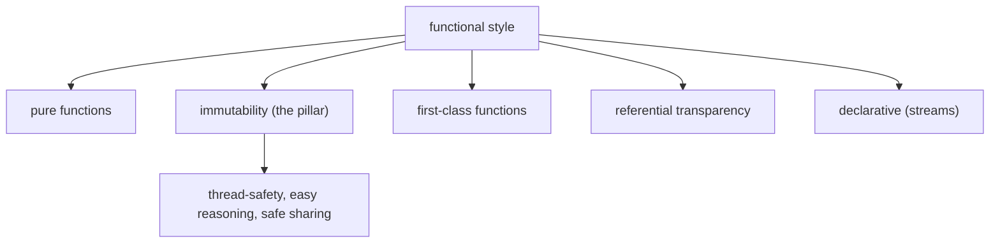

Java is not a pure functional language (it has mutation, side effects, and exceptions), but the **functional style** — pure functions over immutable data — is achievable and pays off in correctness and concurrency.

## Pure Functions

A **pure function** has two properties:

1. **Deterministic** — the same input always produces the same output.
2. **No side effects** — it doesn't modify external state, do I/O, or depend on mutable external state.

```java
int doubleIt(int x) { return x * 2; }            // PURE — output depends only on input

int counter = 0;
int impureIncr(int x) { return x + counter++; }  // IMPURE — reads/writes external state
void log(String s) { System.out.println(s); }    // IMPURE — side effect (I/O)
```

Why purity matters:

- **Testable** — no setup/mocking; just `assertEquals(4, doubleIt(2))`.
- **Parallelisable** — pure functions have no shared state to race on (the parallel-stream requirement, T06).
- **Cacheable / memoizable** — the result depends only on the input, so it can be cached.
- **Reasoning-friendly** — you can understand a pure function in isolation; no spooky action at a distance.

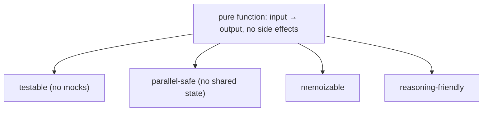

**Stream operations should be pure** — a `map`/`filter` lambda that mutates external state breaks parallel execution (T06) and laziness reasoning (T04). Purity is the contract that makes streams safe to parallelise.

## Referential Transparency

An expression is **referentially transparent** if it can be **replaced by its value** without changing the program. `2 + 3` can be replaced by `5`. A pure function call `doubleIt(4)` can be replaced by `8`. This is what makes equational reasoning (and compiler optimisations like constant folding and common-subexpression elimination, T04) valid.

```java
// Referentially transparent — pure(x) can be replaced by its value:
int a = pure(x) + pure(x);     // == 2 * pure(x); the compiler/you can substitute

// NOT referentially transparent — impureIncr(x) has a side effect:
int b = impureIncr(x) + impureIncr(x);   // each call is different; can't substitute
```

Side effects, mutation, and exceptions all break referential transparency — which is why FP minimises them.

## Immutability — the Recipe

Immutability is the pillar. An **immutable object** can't change after construction. The recipe for a hand-written immutable class:

1. **Make the class `final`** (or all constructors private + factory methods) — so no subclass can add mutable state or override behaviour.
2. **Make all fields `private final`** — no reassignment after construction.
3. **No setters** (no mutator methods of any kind).
4. **Defensively copy mutable inputs** in the constructor — don't store the caller's array/list/`Date` reference directly (they could mutate it afterward).
5. **Defensively copy mutable outputs** in getters — don't return the internal array/list reference (callers could mutate it); return a copy or an unmodifiable view.
6. **Don't let `this` escape during construction** — no registering listeners or passing `this` to other code before the constructor finishes.

```java
public final class ImmutablePoint {
    private final int x;
    private final int y;
    private final int[] tags;                         // mutable component!

    public ImmutablePoint(int x, int y, int[] tags) {
        this.x = x;
        this.y = y;
        this.tags = tags.clone();                     // defensive copy IN
    }

    public int x() { return x; }
    public int y() { return y; }
    public int[] tags() { return tags.clone(); }      // defensive copy OUT
}
```

**`String` is the canonical immutable** (T06): `final` class, `private final byte[] value`, no mutators, hash cached. Every "modification" (`toUpperCase`, `substring`) returns a **new** String.

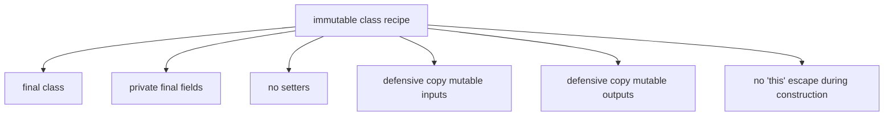

> [!WARNING]
> A class with `final` fields is **not** automatically immutable. `final int[] arr` means the *reference* can't be reassigned — but `arr[0] = 5` still works. And exposing the array via a getter without a defensive copy lets callers mutate your internal state. **Immutability requires `final` fields AND defensive copies of mutable components.**

## Records — Concise Immutable Data (Java 16+)

A **record** (JEP 395) is the modern way to write an immutable data class. The compiler generates the boilerplate:

```java
public record Point(int x, int y) {}
```

This auto-generates: `private final int x, y`; accessors `x()` and `y()`; a canonical constructor `Point(int x, int y)`; and consistent `equals`, `hashCode`, `toString`. The class is **implicitly `final`**, and the fields are **final**. It's the immutable-class recipe, distilled to one line.

### Compact Constructor for Validation

The **compact constructor** validates or normalises without re-listing the parameters:

```java
public record Range(int lo, int hi) {
    public Range {                                    // compact — no parameter list, no assignments
        if (lo > hi) throw new IllegalArgumentException("lo > hi");
    }
}
```

The compiler assigns the fields after the compact constructor body runs (so you validate/normalise the parameters, then assignment happens automatically).

### Records Are Shallowly Immutable — Copy Mutable Components

A record's fields are `final`, but if a component is a **mutable object**, the record holds a **reference** to it — the referenced object can still be mutated. To make a record **truly** immutable, defensively copy mutable components in the compact constructor (and on the way out):

```java
public record Team(String name, List<Player> players) {
    public Team {
        players = List.copyOf(players);               // defensive copy IN (immutable copy)
    }
    // List.copyOf is immutable, so the accessor can return it directly — no copy-out needed
}
```

Without the `List.copyOf`, a caller could mutate the list after constructing the `Team`, and the record would silently change — breaking immutability.

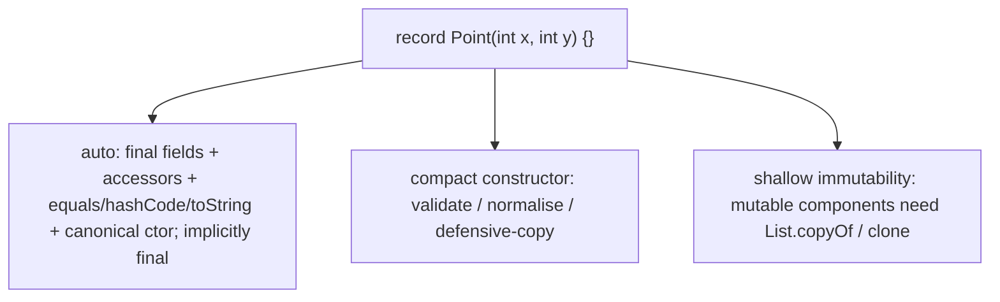

## Immutable Collections

| Factory | Result |
|---------|--------|
| `List.of(...)` / `Set.of(...)` / `Map.of(...)` | immutable; **reject null elements**; throw on modification (Java 9+) |
| `List.copyOf(coll)` | immutable copy of an existing collection (Java 10+) |
| `Collections.unmodifiableList(list)` | a read-only **view** of a backing list (the backing list can still be mutated through its own reference!) |
| `Stream.toList()` | unmodifiable list (Java 16+, T04) |

```java
List<String> a = List.of("x", "y", "z");             // truly immutable
List<String> b = List.copyOf(existing);              // immutable snapshot

List<String> backing = new ArrayList<>(...);
List<String> view = Collections.unmodifiableList(backing);
view.add("q");                                        // throws
backing.add("q");                                     // SUCCEEDS — and 'view' now shows it!
```

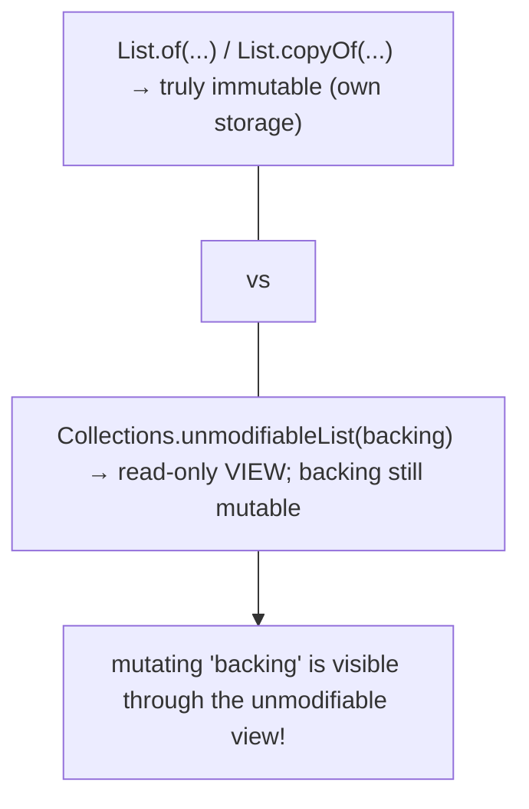

> [!WARNING]
> **`Collections.unmodifiableList` is a *view*, not a copy.** If anyone retains the backing list's reference and mutates it, the "unmodifiable" view reflects the change. For a true immutable, use `List.copyOf(backing)` (an independent snapshot) or `List.of(...)`. Also note all of these are **shallowly** immutable — `List.of(mutableObject)` is an immutable list of *references* to objects that can still be mutated.

## Why Immutability — the Payoffs

| Benefit | Why |
|---------|-----|
| **Thread-safety for free** | no writes → no data races → share across threads with **no synchronisation** |
| **Safe map keys + hashCode caching** | the hash never changes → safe `HashMap` key; the hash can be computed once and cached (String, T06) |
| **No downstream defensive copying** | if it can't change, share the reference freely — no one can mutate it |
| **Easier reasoning** | a value you read stays that value — no spooky action at a distance |
| **Safe publication** | a properly-constructed immutable's `final` fields are visible to all threads after construction (JMM, below) |
| **Failure atomicity** | validate in the constructor; if it throws, no half-built object exists |

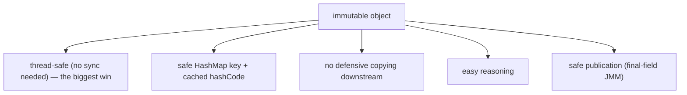

**Thread-safety for free** is the headline. A mutable object shared across threads needs synchronisation (locks, `volatile`, atomics — L3/C01) to avoid races. An immutable object needs **none** — there are no writes to race on. This is why FP-style concurrent code (immutable data + pure functions) is so much easier to get right than lock-based mutable-state code.

## The Cost — Copy-on-Change and Structural Sharing

Immutability's cost is **allocation**: a "change" produces a **new** object. Updating one field of an immutable 10-field record allocates a whole new record:

```java
record Point(int x, int y) {
    Point withX(int newX) { return new Point(newX, this.y); }   // "wither" — returns a modified COPY
}
Point p2 = p1.withX(5);     // p1 unchanged; p2 is a new object
```

For a **hot mutation path** (updating an object millions of times), this copy-on-change churn creates young-generation GC pressure. Two mitigations:

1. **Generational GC handles it cheaply** — most copies die young (the old version is immediately discarded), and a generational collector reclaims young garbage very cheaply (T15 / GC topics). So the churn is usually fine.
2. **Structural sharing (persistent data structures)** — functional languages implement "modified" collections that **share** most of their structure with the original (e.g., a persistent tree shares unchanged subtrees; only the path to the change is copied). Java's standard `List.copyOf` **copies** (no sharing), but libraries (Vavr, PCollections) and builder patterns reduce the cost. For most application code, plain immutable copies + generational GC are sufficient.

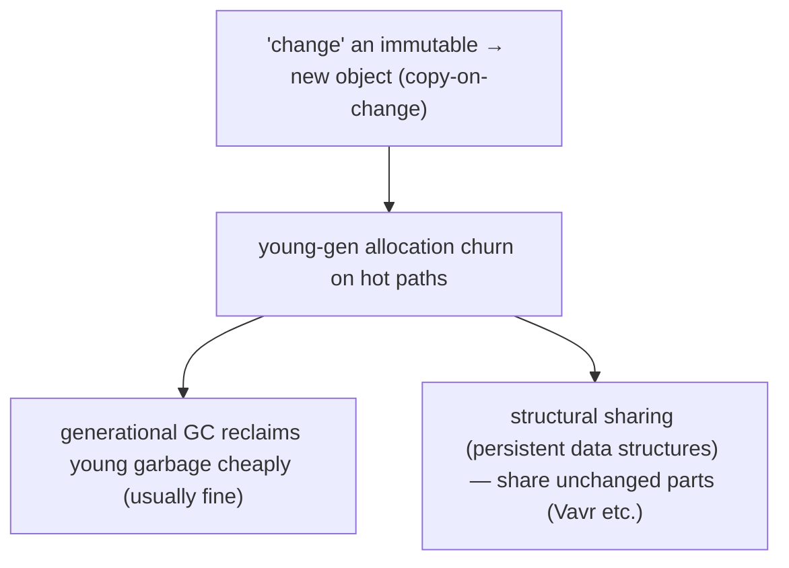

## Functional Error Handling

FP prefers **returning** error information over **throwing**, because exceptions break referential transparency (a function that throws isn't a pure value-returning expression):

- **`Optional<T>`** (T07) instead of returning `null` — a maybe-absent result as a value.
- **`Either<L, R>` / `Result<T, E>`** patterns — a value that is *either* a success or a typed failure. Not built into Java's standard library, but a common pattern (and a library staple — Vavr's `Either`, `Try`).
- **Exceptions** remain the right tool for *exceptional* conditions (truly unexpected failures), but FP style routes *expected* absence/failure through return values.

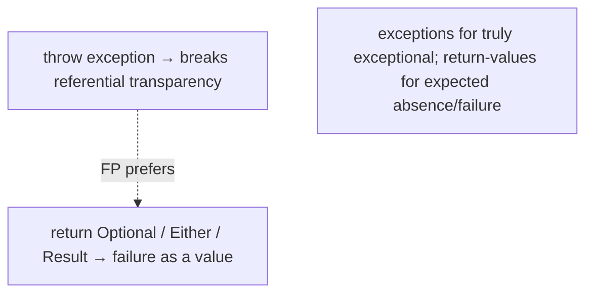

## Memory Layer — Sharing and Safe Publication

### Immutable Objects Are Shared Freely

Because an immutable object can't change, **one instance can be shared by any number of references** with no risk — no copies needed. This is the basis of:

- **String interning** (T06) — identical string literals share one pooled instance.
- **The flyweight pattern** — share immutable value objects (e.g., a cache of `Integer` for −128..127, T17) instead of allocating duplicates.
- **Caching / memoization** — an immutable result can be cached and handed out repeatedly.

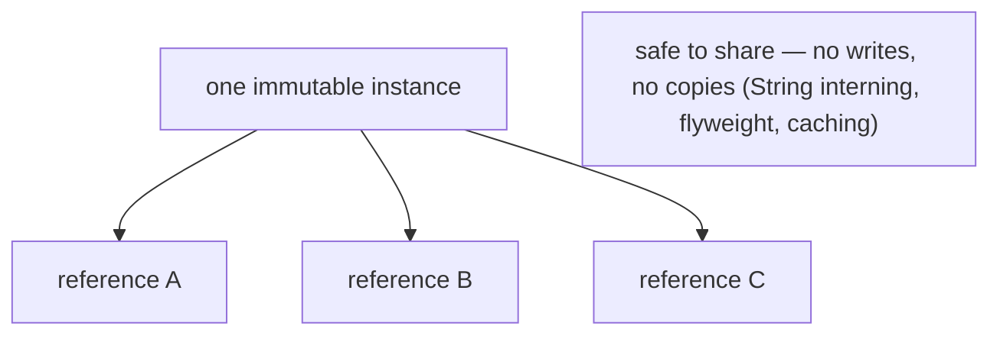

### The `final`-Field Safe-Publication Guarantee (JMM)

This is *why* immutable objects are thread-safe without synchronisation. The Java Memory Model (JLS §17.5; full mechanism in L3/C01/T12) guarantees that a thread reading a **properly-constructed** object (one whose `this` didn't escape during construction) sees the **correctly-initialised values of its `final` fields** — without any synchronisation. So an immutable object built on one thread and handed to another is **safely published**: the receiving thread sees the right field values.

Without `final` (or without immutability), publishing an object across threads can expose **partially-constructed** state (the reference is visible before the field writes are — a real, subtle bug). Immutable objects with `final` fields are immune.

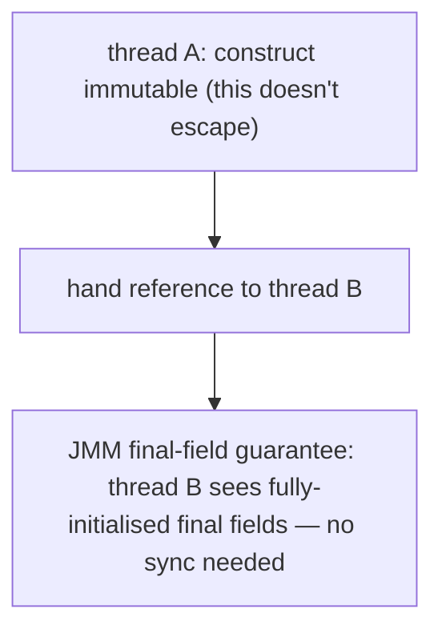

### hashCode Caching

An immutable object's hash never changes, so it can compute the hash **once** and cache it. `String` does exactly this (T06) — `hashCode()` computes lazily on first call and stores the result. Mutable objects can't safely cache their hash (it would go stale).

## Architecture Layer — JIT, Escape Analysis, GC

### The JIT Treats Trusted Final Fields as Near-Constants

The JIT optimises reads of **trusted final fields** aggressively — `static final` constants are folded outright (T03), and the JIT can hoist/cache instance-`final`-field reads because the value can't change after construction (it's conservative about reflection/`Unsafe` rewrites of finals, but the common case is optimised). So reading an immutable object's fields repeatedly is cheap — the JIT can keep them in registers.

### Escape Analysis Stack-Allocates Short-Lived Immutables

A `new Point(1, 2)` that doesn't escape its method is **scalar-replaced** by escape analysis (T01/T15) — the fields live in registers, no heap allocation. So short-lived immutable values (a `Point` created, used, discarded within a method) often cost nothing after JIT warm-up. This is why the copy-on-change pattern is cheaper than it looks: many copies never escape.

### Immutability Enables Lock-Free Sharing and Memoization

- **Lock-free sharing** — immutable data needs no locks to share across threads, eliminating synchronisation overhead (lock acquisition ~20–50 cycles, T07 StringBuffer lesson) and lock contention.
- **Memoization** — pure functions over immutable inputs can be cached; the JIT and application caches both exploit this.

### The GC Trade-Off

Copy-on-change increases allocation (young-gen churn), but:

- **Generational GC** reclaims young garbage cheaply — most immutable copies die in the young generation, where collection is a fast copy of the *survivors* (the dead majority costs nothing).
- **Compact immutables** (records, Compact Strings T06) have good **cache locality** — packed fields, no extra indirection.

So the architecture verdict: immutability's allocation cost is usually outweighed by the **thread-safety, cache-locality, and lock-free-sharing** benefits — except on the hottest mutation paths, where mutable state + careful synchronisation can win.

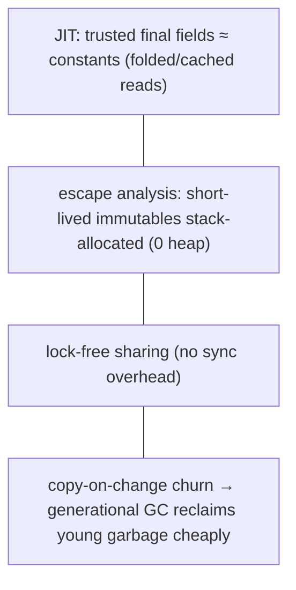

## Common Mistakes

### Exposing a Mutable Field Without a Defensive Copy

```java
final class Bad {
    private final int[] data;
    Bad(int[] data) { this.data = data; }            // NO copy in — caller can mutate later
    int[] data() { return data; }                     // NO copy out — caller can mutate internal state
}
```

Both the constructor and the getter leak the mutable array. Defensive-copy both ways (`data.clone()`).

### `final` Reference to a Mutable Object

```java
final List<String> list = new ArrayList<>();
list.add("x");                                        // WORKS — final means the REFERENCE is fixed, not the object
```

`final` prevents reassignment of `list`, not mutation of the `ArrayList`. Use `List.of` / `List.copyOf` for an immutable list.

### Forgetting Defensive Copies in Records

```java
record Team(String name, List<Player> players) {}    // shallow — caller's list can mutate the record
```

Add a compact constructor with `players = List.copyOf(players)`.

### Mutating Through an Aliased Reference

Two references to the same mutable object; mutating via one affects "the other." Immutability eliminates this class of bug entirely.

### Equating `final` with Deeply Immutable

`final` is shallow (the reference) and doesn't recurse into the object. Deep immutability requires every reachable object to be immutable too.

### `unmodifiableList` Over a Mutable Backing List

The view is read-only but the backing list isn't — covered above. Use `List.copyOf` for a true snapshot.

### `List.of(mutableObjects)` Thinking the Contents Are Immutable

The *list* is immutable; the *objects in it* may not be. Shallow immutability. Make the elements immutable too (e.g., records) for deep immutability.

### Premature Immutability on a Hot Mutation Path

Copy-on-change churn can hurt the hottest paths (e.g., a tight numerical accumulator). There, a mutable local + careful design can win. Profile before optimising; immutability is the *default*, not a mandate everywhere.

### Side Effects in Stream Lambdas

Breaks purity → breaks parallel correctness (T06) and laziness reasoning (T04). Keep stream operations pure; accumulate with `collect` (T05), not side effects.

### Throwing Where an Optional/Result Is Cleaner

Routing *expected* absence through exceptions breaks referential transparency and is slower (exception construction fills in a stack trace). Use `Optional` (T07) for expected absence; reserve exceptions for the exceptional.

> [!INTERVIEW]
> The FP-and-immutability synthesis is a senior-leaning interview area.
>
> 1. **What's a pure function?** Deterministic (same input → same output) and side-effect-free. Testable, parallel-safe, memoizable.
> 2. **What's referential transparency?** An expression can be replaced by its value without changing the program. Side effects/mutation/exceptions break it.
> 3. **How do you make a class immutable?** Final class, private final fields, no setters, defensive copies of mutable inputs and outputs, no `this` escape during construction.
> 4. **Does `final` make an object immutable?** No — `final` fixes the reference, not the object's contents. `final List` can still be mutated via `add`.
> 5. **What does a `record` give you?** Final fields, accessors, equals/hashCode/toString, a canonical constructor — implicitly final. But it's **shallowly** immutable; copy mutable components.
> 6. **`List.of` vs `Collections.unmodifiableList`?** `List.of` is truly immutable (own storage); `unmodifiableList` is a read-only **view** — the backing list can still be mutated.
> 7. **Why is an immutable object thread-safe without synchronisation?** No writes → no data races; the JMM's final-field guarantee ensures safe publication (correctly-initialised final fields visible to all threads).
> 8. **What's the cost of immutability?** Allocation — a "change" is a new object (copy-on-change). Generational GC and escape analysis mitigate it.
> 9. **What's structural sharing?** Persistent data structures share unchanged parts between versions, reducing copy cost — used by functional languages and libraries (Vavr).
> 10. **Why prefer `Optional`/`Either` over exceptions for expected failures?** Exceptions break referential transparency and are costly; returning failure as a value keeps functions pure.
> 11. **Why must stream lambdas be pure?** Side effects on shared state are data races in parallel and break laziness reasoning.
> 12. **What's the compact constructor in a record for?** Validation, normalisation, and defensive copying of mutable components — the parameters are validated before the auto-assignment.

## Practice

1. **Pure vs impure.** Write a pure `doubleIt` and an impure `incrWithCounter`. Show the impure one returns different results for the same input across calls.
2. **Immutable class recipe.** Write an immutable `Money(long cents, String currency)` by hand (final class, final fields, no setters). Add a mutable component (`int[] tags`) and defensive-copy it both ways. Prove a caller can't mutate the internals.
3. **`final` ≠ immutable.** `final List<String> list = new ArrayList<>(); list.add("x");` — confirm it compiles and mutates. Then `final List<String> imm = List.of("x"); imm.add("y");` — confirm it throws.
4. **Record basics.** Write `record Point(int x, int y) {}`. Confirm the auto-generated `equals`/`hashCode`/`toString`/accessors. Confirm two equal points are `.equals` and hash-equal.
5. **Compact constructor validation.** `record Range(int lo, int hi)` with a compact constructor throwing if `lo > hi`. Confirm construction fails on bad input (failure atomicity — no half-built object).
6. **Shallow record immutability.** `record Team(String name, List<Player> players) {}` without a defensive copy. Mutate the caller's list after construction; confirm the record changes. Fix with `List.copyOf` in the compact constructor.
7. **unmodifiableList view.** Wrap a backing `ArrayList` with `Collections.unmodifiableList`. Mutate the backing list; confirm the view reflects the change. Switch to `List.copyOf`; confirm it doesn't.
8. **Wither pattern.** Add `Point withX(int x)` returning a new `Point`. Confirm the original is unchanged.
9. **Thread-safe sharing.** Share an immutable record across two threads reading it concurrently; confirm no synchronisation is needed and no races occur. Contrast with a mutable object (show a race).
10. **hashCode caching.** Implement an immutable class that caches its hashCode (compute once, store). Confirm `hashCode()` computes only on first call.
11. **EA on short-lived immutable.** Create and consume a `Point` inside a tight loop with `-XX:+PrintEliminateAllocations`. Confirm it's scalar-replaced (no allocation). Then store it in a field; confirm allocation reappears.
12. **Copy-on-change churn.** Update an immutable record 10M times in a loop (each `withX`); measure GC with `-verbose:gc`. Compare to mutating a mutable object. Discuss the generational-GC mitigation.
13. **Side-effect-free stream.** Take a stream pipeline with a side-effecting `map` lambda; run it in parallel; observe wrong results. Make the lambda pure + use `collect`; confirm correct.
14. **Optional vs exception.** Write a lookup two ways — throwing `NotFoundException` and returning `Optional`. Discuss which keeps referential transparency.
15. **Deep vs shallow immutability.** `record Config(List<String> servers)` with `List.copyOf` — confirm the list is immutable but if elements were mutable they'd still be mutable. Show deep immutability requires immutable elements.
16. **Explain it back.** For `record Point(int x, int y) {}` shared across threads: describe (a) why it's thread-safe without locks, (b) the JMM final-field guarantee that makes publication safe, (c) how EA can make a short-lived `Point` allocation-free, (d) the copy-on-change cost of a `withX` and why generational GC handles it.

## Recap

You should now be able to:

- Recall the **FP tenets** — pure functions, immutability, first-class functions (T01/T03), referential transparency, higher-order functions + composition (T02), declarative-over-imperative (T04) — and recognise functional style as a *mindset* layered on Java's tools.
- Define a **pure function** (deterministic + side-effect-free) and its benefits (testable, parallel-safe, memoizable, reasoning-friendly); recall that **stream lambdas must be pure** for correct parallel execution (T06).
- Explain **referential transparency** (an expression == its value) and that side effects, mutation, and exceptions break it.
- Apply the **immutable-class recipe** — `final` class, `private final` fields, no setters, defensive copies of mutable inputs **and** outputs, no `this` escape — and recall that **`final` alone is not immutability** (`final List` can still be mutated).
- Use **records** (Java 16+) as concise immutable data (auto final fields/accessors/`equals`/`hashCode`/`toString`, implicitly final); use the **compact constructor** for validation/normalisation/defensive-copy; recall records are **shallowly** immutable — copy mutable components (`List.copyOf`).
- Distinguish **truly immutable collections** (`List.of`/`copyOf` — own storage) from the **unmodifiable *view*** (`Collections.unmodifiableList` — backing list still mutable); recall all are **shallowly** immutable.
- Recall **why immutability** pays off — **thread-safety for free** (no writes → no races → no synchronisation, the headline), safe map keys + cached hashCode (T06), no downstream defensive copying, easier reasoning, **safe publication** (the JMM final-field guarantee), and failure atomicity.
- Account for the **cost** — copy-on-change allocation — and its mitigations: **generational GC** (young copies reclaimed cheaply) and **structural sharing** (persistent data structures share unchanged parts; Vavr et al.); the **wither** pattern (`withX` returns a modified copy).
- Prefer **functional error handling** — `Optional` (T07) / `Either` / `Result` over `null` and over throwing for *expected* absence/failure (exceptions break referential transparency); reserve exceptions for the truly exceptional.
- Describe the **memory** model — immutable objects are **shared freely** (one instance, many references — interning, flyweight, caching); the **`final`-field JMM safe-publication guarantee** is *why* they're thread-safe without locks (full mechanism L3/C01/T12); hashCode can be cached.
- Predict the **architecture** behaviour — the JIT treats trusted **final fields as near-constants** (folded/cached reads); **escape analysis** stack-allocates short-lived immutables (copy-on-change often free); immutability enables **lock-free sharing** and **memoization**; generational GC + cache-locality usually outweigh the allocation churn, except on the hottest mutation paths.
- Avoid the **common traps**: exposing a mutable field without defensive copies, `final`-reference-to-mutable-object, missing record component copies, aliased mutation, `final` ≠ deeply immutable, `unmodifiableList` over a mutable backing, `List.of(mutables)` shallow immutability, premature immutability on hot paths, side effects in stream lambdas, throwing where `Optional` is cleaner.

## Next

Continue to [New language features by version (Java 8 to 21+)](./T09-new-language-features-by-version-java-8-to-21-plus.md).
