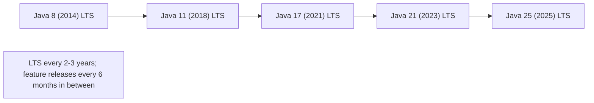
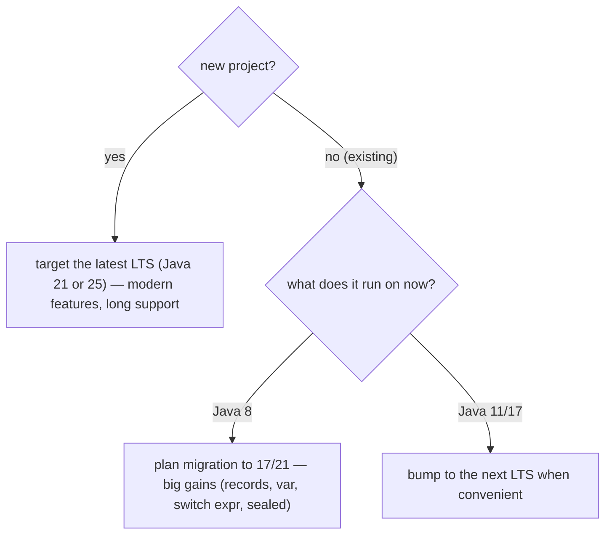

# New language features by version (Java 8 to 21+)

This is the chapter's **map of modern Java's evolution** — a release-by-release tour of what changed from **Java 8** (the functional revolution that this whole chapter builds on) through **Java 21** (virtual threads, pattern matching) and beyond. Java reinvented its release model in 2017 (a feature release every six months instead of every few years), so "modern Java" is now a moving target — and knowing **which features exist in your target version** is a practical, daily concern: a feature you reach for might not exist in the runtime you deploy to, and a `--release` set too low silently hides what's available.

This is a **survey topic** — the *mechanism* of each feature lives in its own deep topic (lambdas → [T01](./T01-lambda-expressions.md), records → [T08](./T08-functional-programming-style-and-immutability.md), switch expressions → [L0/C02/T08](../../L0-foundations/C02-java-core/T08-control-flow-if-else-switch-switch-expressions.md), virtual threads → L3/C01/T14, …). Here we organise them **chronologically**, mark the **LTS** releases, explain the **release cadence** and the **preview-feature** mechanism, and give a **feature → version → deep-topic** cross-reference. The depth-bar here is **accuracy and orientation** rather than under-the-hood mechanism (the per-feature deep links carry that).

> [!NOTE]
> Prerequisites: [Functional programming style & immutability](./T08-functional-programming-style-and-immutability.md), [Lambda expressions](./T01-lambda-expressions.md), [Streams API](./T04-streams-api-intermediate-and-terminal-operations.md), [var](../../L0-foundations/C02-java-core/T18-var-local-variable-type-inference.md) (this chapter + L0/C02/T18) — the features we're placing on the timeline; [JDK vs JRE vs JVM](../../L0-foundations/C01-cs-foundations/T05-jdk-vs-jre-vs-jvm.md) (L0/C01/T05) — versions, `--release`, the class-file version, `UnsupportedClassVersionError`.

## The Release Cadence and LTS

Before Java 9, releases came every few years (Java 6 in 2006, 7 in 2011, 8 in 2014). Since Java 9 (2017), Java ships a **feature release every six months** — March and September — with a predictable version number.

- **Feature releases** (every 6 months) get ~6 months of updates, then you're expected to move on.
- **LTS (Long-Term Support) releases** get **years** of updates and are what most production systems target: **Java 8, 11, 17, 21, 25** — roughly every **2–3 years**.



**Most teams run an LTS** (8 → 11 → 17 → 21 → 25) and skip the non-LTS releases. The non-LTS releases are where features incubate; they land in the next LTS as stable.

### Preview Features and `--enable-preview`

Big language features don't ship final on day one — they go through **preview** (one or more releases) before becoming **standard**:


A preview feature must be explicitly enabled at **both compile and run time**:

```bash
javac --release 21 --enable-preview Main.java
java  --enable-preview Main
```

Preview features can **change or be removed** between releases (string templates, previewed in 21, were withdrawn in 23). **Don't use preview features in production** — they're for evaluation and feedback. A class compiled with `--enable-preview` even refuses to run on a *different* minor version.

### Reading a JEP

Every significant change is a **JEP** (JDK Enhancement Proposal) — a numbered document at `openjdk.org/jeps/N` explaining the motivation, design, and alternatives. "JEP 361" *is* switch expressions; "JEP 444" *is* virtual threads. Reading the JEP is the authoritative way to understand a feature (T09's resources: L0/C09).

## Java 8 (March 2014) — LTS — The Functional Revolution

The release this entire chapter rests on. The biggest language change since generics (Java 5):

| Feature | Deep topic |
|---------|-----------|
| **Lambda expressions** | [T01](./T01-lambda-expressions.md) |
| **Functional interfaces** + `@FunctionalInterface` | [T02](./T02-functional-interfaces-function-predicate-supplier-consumer.md) |
| **Method & constructor references** | [T03](./T03-method-and-constructor-references.md) |
| **Streams API** | [T04](./T04-streams-api-intermediate-and-terminal-operations.md)–[T06](./T06-parallel-streams.md) |
| **`Optional<T>`** | [T07](./T07-optional-in-depth.md) |
| **`default` and `static` interface methods** | L1/C01 |
| **`java.time`** (the new Date/Time API, JSR 310) | L1/C02 |
| **`CompletableFuture`** (async composition) | L3/C01 |

Also: `StringJoiner`/`String.join`, `Arrays.parallelSort`, Base64, repeating + type annotations, and — under the hood — **PermGen replaced by Metaspace** (T15). Nashorn (a JavaScript engine) arrived here and was removed in 15.

Java 8 is still **widely deployed** in legacy systems — a huge amount of production Java is "Java 8 + libraries." Knowing what's *not* in 8 (modules, `var`, records, the new HTTP client) matters for those codebases.

## Java 9 (September 2017) — Modules and the New Cadence

The release that started the 6-month cadence and shipped the long-delayed module system:

| Feature | Notes / deep topic |
|---------|--------------------|
| **JPMS** (Java Platform Module System, Project Jigsaw) | `module-info.java` — L1/C01 |
| **Collection factories** `List.of`/`Set.of`/`Map.of` | immutable (T08) |
| **Private interface methods** | L1/C01 |
| **Stream additions** `takeWhile`/`dropWhile`/`iterate(seed, hasNext, next)`/`ofNullable` | [T04](./T04-streams-api-intermediate-and-terminal-operations.md) |
| **Optional additions** `stream()`/`or()`/`ifPresentOrElse()` | [T07](./T07-optional-in-depth.md) |
| **JShell** (the REPL) | L0/C03 |
| **Compact Strings** (JEP 254) | `byte[]` + coder — [T06](../../L0-foundations/C02-java-core/T06-strings-and-text-blocks.md) |
| **`StringConcatFactory`** (JEP 280) | `invokedynamic` string concat — [T06](../../L0-foundations/C02-java-core/T06-strings-and-text-blocks.md) |

Also: G1 became the **default GC**; the reactive-streams `Flow` API; multi-release JARs.

## Java 10 (March 2018) — `var`

| Feature | Deep topic |
|---------|-----------|
| **`var`** local-variable type inference (JEP 286) | [T18](../../L0-foundations/C02-java-core/T18-var-local-variable-type-inference.md) |
| `List.copyOf`/`Set.copyOf`/`Map.copyOf` | [T08](./T08-functional-programming-style-and-immutability.md) |
| `Optional.orElseThrow()` (no-arg) | [T07](./T07-optional-in-depth.md) |
| `Collectors.toUnmodifiableList/Set/Map` | [T05](./T05-collectors-and-grouping.md) |

Also: Application Class-Data Sharing (AppCDS), parallel full GC for G1.

## Java 11 (September 2018) — LTS — The Practical Workhorse

The LTS most teams jumped to from 8. Lots of day-to-day quality-of-life:

| Feature | Notes / deep topic |
|---------|--------------------|
| **`var` in lambda parameters** (JEP 323) | [T18](../../L0-foundations/C02-java-core/T18-var-local-variable-type-inference.md), [T01](./T01-lambda-expressions.md) |
| **New `String` methods** `isBlank`/`strip`/`stripLeading`/`stripTrailing`/`lines`/`repeat` | [T06](../../L0-foundations/C02-java-core/T06-strings-and-text-blocks.md) |
| **`Files.readString`/`writeString`** | L1/C02 |
| **The standard HTTP Client** (`java.net.http`, JEP 321) | L4/C05 |
| **Single-file source launcher** (`java Hello.java`, JEP 330) | L0/C01 |
| `Optional.isEmpty()` | [T07](./T07-optional-in-depth.md) |
| `Collection.toArray(IntFunction)` | [T03](./T03-method-and-constructor-references.md) |

Also: **removed Java EE + CORBA modules** (JEP 320) — a migration gotcha from 8; Nashorn deprecated; Epsilon (no-op) GC; ZGC experimental; Flight Recorder open-sourced.

## Java 12–13 (2019) — Previews Incubate

Non-LTS releases where the next wave of language features started previewing:

| Feature | Status | Deep topic |
|---------|--------|-----------|
| **Switch expressions** | preview (12), refined (13 — added `yield`) | [L0/C02/T08](../../L0-foundations/C02-java-core/T08-control-flow-if-else-switch-switch-expressions.md) |
| **Text blocks** | preview (13) | [T06](../../L0-foundations/C02-java-core/T06-strings-and-text-blocks.md) |
| **`Collectors.teeing`** | standard (12) | [T05](./T05-collectors-and-grouping.md) |

Also: Shenandoah GC (experimental), `String.transform`/`indent`.

## Java 14 (March 2020) — Switch Expressions Land, Records Begin

| Feature | Status | Deep topic |
|---------|--------|-----------|
| **Switch expressions** (JEP 361) | **standard** | [L0/C02/T08](../../L0-foundations/C02-java-core/T08-control-flow-if-else-switch-switch-expressions.md) |
| **Records** (JEP 359) | preview | [T08](./T08-functional-programming-style-and-immutability.md) |
| **Pattern matching for `instanceof`** (JEP 305) | preview | [L0/C02/T08](../../L0-foundations/C02-java-core/T08-control-flow-if-else-switch-switch-expressions.md) |
| **Helpful NullPointerExceptions** (JEP 358) | standard | L0/C03 |

The **helpful NPE messages** (`Cannot invoke "String.length()" because "name" is null`) are a quiet but huge debugging win — on by default since 17.

## Java 15 (September 2020) — Text Blocks Standard, Sealed Begins

| Feature | Status | Deep topic |
|---------|--------|-----------|
| **Text blocks** (JEP 378) | **standard** | [T06](../../L0-foundations/C02-java-core/T06-strings-and-text-blocks.md) |
| **Sealed classes** (JEP 360) | preview | L1/C01 |
| **Records** (JEP 384) | second preview | [T08](./T08-functional-programming-style-and-immutability.md) |
| **Hidden classes** (JEP 371) | standard | used by lambdas — [T01](./T01-lambda-expressions.md) |

Also: ZGC + Shenandoah **production-ready**; **Nashorn removed** (JEP 372); EdDSA signatures.

## Java 16 (March 2021) — Records and Pattern `instanceof` Standard

| Feature | Status | Deep topic |
|---------|--------|-----------|
| **Records** (JEP 395) | **standard** | [T08](./T08-functional-programming-style-and-immutability.md) |
| **Pattern matching for `instanceof`** (JEP 394) | **standard** | [L0/C02/T08](../../L0-foundations/C02-java-core/T08-control-flow-if-else-switch-switch-expressions.md) |
| **`Stream.toList()`** | standard | [T04](./T04-streams-api-intermediate-and-terminal-operations.md) |
| **`Stream.mapMulti`** | standard | [T04](./T04-streams-api-intermediate-and-terminal-operations.md) |
| **Vector API** (JEP 338) | incubator | L3/C02 |

Also: strong encapsulation of JDK internals by default (JEP 396) — another migration consideration; Unix-domain socket channels.

## Java 17 (September 2021) — LTS — The Big Modernisation Target

The LTS that most "modern Java" migrations target. Records, text blocks, switch expressions, pattern `instanceof`, and helpful NPEs are all standard here:

| Feature | Status | Deep topic |
|---------|--------|-----------|
| **Sealed classes** (JEP 409) | **standard** | L1/C01 |
| **Pattern matching for `switch`** (JEP 406) | preview | [L0/C02/T08](../../L0-foundations/C02-java-core/T08-control-flow-if-else-switch-switch-expressions.md) |
| Strongly encapsulate JDK internals (JEP 403) | standard | (no more `--illegal-access`) |
| Enhanced pseudo-random generators (JEP 356) | standard | L1/C02 |
| Restore always-strict floating point (JEP 306) | standard | L0/C02/T02 |

Java 17 is the practical floor for "I want modern Java" today — everything in this chapter plus records, sealed types, and text blocks are stable.

## Java 18–20 (2022–2023) — The Loom Run-Up

Non-LTS releases where virtual threads, record patterns, and pattern-switch matured:

| Feature | Status | Deep topic |
|---------|--------|-----------|
| **UTF-8 by default** (JEP 400, Java 18) | standard | L0/C02/T06 |
| **Simple Web Server** (`jwebserver`, JEP 408, Java 18) | standard | L0/C03 |
| **Virtual Threads** (JEP 425, Java 19) | preview | L3/C01/T14 |
| **Record Patterns** (JEP 405, Java 19) | preview | [L0/C02/T08](../../L0-foundations/C02-java-core/T08-control-flow-if-else-switch-switch-expressions.md) |
| **Pattern matching for `switch`** | further previews | [L0/C02/T08](../../L0-foundations/C02-java-core/T08-control-flow-if-else-switch-switch-expressions.md) |
| **Structured Concurrency** | incubator | L3/C01/T15 |
| **Scoped Values** | incubator | L3/C01 |

## Java 21 (September 2023) — LTS — Virtual Threads and Full Pattern Matching

The current dominant modern LTS. The Loom and Amber projects landed:

| Feature | Status | Deep topic |
|---------|--------|-----------|
| **Virtual Threads** (JEP 444) | **standard** — Project Loom | L3/C01/T14 |
| **Pattern matching for `switch`** (JEP 441) | **standard** | [L0/C02/T08](../../L0-foundations/C02-java-core/T08-control-flow-if-else-switch-switch-expressions.md) |
| **Record Patterns** (JEP 440) | **standard** | [L0/C02/T08](../../L0-foundations/C02-java-core/T08-control-flow-if-else-switch-switch-expressions.md) |
| **Sequenced Collections** (JEP 431) | standard | L1/C02 |
| **Generational ZGC** (JEP 439) | standard | L3/C02 |
| String Templates (JEP 430) | preview — **later withdrawn (23)** | — |
| Structured Concurrency (JEP 453) | preview | L3/C01/T15 |
| Scoped Values (JEP 446) | preview | L3/C01 |

**Virtual threads** are the headline — a million cheap threads per JVM, which changes how you write concurrent and I/O code (the parallel-stream blocking hazard from [T06](./T06-parallel-streams.md) is one thing virtual threads fix). **Pattern matching for switch + record patterns** complete the "data-oriented programming" story (sealed types + records + pattern switch = exhaustive, destructuring dispatch).

## Java 22–25 (2024–2025) — the Frontier

The 6-month cadence continues; the highlights (deep coverage in later modules):

| Feature | Release | Status |
|---------|---------|--------|
| **Foreign Function & Memory API** (JEP 454) | 22 | **standard** — call native code / off-heap memory without JNI |
| **Stream Gatherers** (JEP 461 → 485) | 22 preview → 24 standard | custom intermediate stream ops |
| **Class-File API** (JEP 457 → 484) | 22 preview → 24 standard | standard bytecode manipulation |
| **Implicit classes + instance `main`** | 21+ previews → later standard | simpler entry-point for beginners (no `public static void main` boilerplate) |
| **Flexible constructor bodies** (statements before `super()`) | 22+ previews → 25 standard | validate before the super-constructor |
| **Module import declarations** | 23+ previews → 25 standard | `import module M;` |
| **Compact Object Headers** (JEP 450 → 519) | 24 experimental → 25 | smaller object headers (T02 layout) — less memory |
| **AOT class loading/linking** (Project Leyden) | 24+ | faster startup |
| **Scoped Values** | → standard (25) | thread-local replacement for virtual threads |

**Java 25 (September 2025)** is the current LTS as of this writing — the natural target for new projects that want the latest stable platform. The detailed mechanism of these frontier features belongs to L3 (JVM internals) and L4 (backend); here they mark the trajectory.

> [!NOTE]
> Java's pace means any "latest features" list dates quickly. The durable knowledge is the **cadence** (6-month releases, LTS every 2–3 years), the **preview mechanism**, and **which LTS your project targets**. Check `java --version` and the JEP index (`openjdk.org/jeps`) for the authoritative current state.

## Which Version Should You Target?



Practical guidance:

- **New projects** → the latest LTS (21, or 25 if available and your tooling supports it).
- **Existing Java 8** → migrating to 17/21 is high-value (records, `var`, switch expressions, sealed types, the new HTTP client, helpful NPEs) but watch the migration gotchas (removed EE/CORBA modules, strong encapsulation).
- **Libraries** → often target an older LTS (8 or 11) for broad compatibility, then offer multi-release JARs.

The **`--release N`** flag compiles against version N's API and class-file version — set it to your *deployment* target, not your *build* JDK, so you don't accidentally use APIs that won't exist at runtime.

## Cross-Reference — Feature → Version → Deep Topic

| Feature | Standard since | Deep topic |
|---------|---------------|-----------|
| Lambdas / streams / Optional | Java 8 | T01–T07 |
| `default`/`static` interface methods | Java 8 | L1/C01 |
| `java.time` | Java 8 | L1/C02 |
| Modules (JPMS) | Java 9 | L1/C01 |
| `List.of`/`copyOf` immutable collections | Java 9/10 | [T08](./T08-functional-programming-style-and-immutability.md) |
| `var` (local + lambda params) | Java 10/11 | [T18](../../L0-foundations/C02-java-core/T18-var-local-variable-type-inference.md) |
| Standard HTTP Client | Java 11 | L4/C05 |
| Switch expressions | Java 14 | [L0/C02/T08](../../L0-foundations/C02-java-core/T08-control-flow-if-else-switch-switch-expressions.md) |
| Text blocks | Java 15 | [T06](../../L0-foundations/C02-java-core/T06-strings-and-text-blocks.md) |
| Records | Java 16 | [T08](./T08-functional-programming-style-and-immutability.md) |
| Pattern matching for `instanceof` | Java 16 | [L0/C02/T08](../../L0-foundations/C02-java-core/T08-control-flow-if-else-switch-switch-expressions.md) |
| Sealed classes | Java 17 | L1/C01 |
| Pattern matching for `switch` + record patterns | Java 21 | [L0/C02/T08](../../L0-foundations/C02-java-core/T08-control-flow-if-else-switch-switch-expressions.md) |
| Virtual threads | Java 21 | L3/C01/T14 |
| Sequenced collections | Java 21 | L1/C02 |
| Foreign Function & Memory API | Java 22 | L3/C02 |
| Stream gatherers | Java 24 | [T04](./T04-streams-api-intermediate-and-terminal-operations.md) |

## Common Mistakes

### Using Preview Features in Production

Preview features need `--enable-preview` at compile **and** run time, can change or be removed between releases (string templates were withdrawn), and a preview-compiled class won't run on a different minor version. Keep them out of production.

### Targeting an Old `--release` and Missing Features

Compiling with `--release 11` hides Java 17+ features (records, sealed, pattern switch) even on a Java 21 build JDK. Set `--release` to your real deployment target — too low and you can't use what you want; too high and it won't run on the deployment runtime.

### Confusing LTS vs Non-LTS Support

Non-LTS releases get ~6 months of updates; don't pin production to a non-LTS. Target an LTS (8/11/17/21/25) for multi-year support.

### Assuming a Feature Exists in an Older Runtime

A class compiled for Java 17 won't load on a Java 11 JVM — `UnsupportedClassVersionError` (the class-file major version is too new, T05/L0/C03). The runtime must be ≥ the compile target.

### Migration Gotchas From Java 8

Java 11 **removed** the Java EE and CORBA modules; Java 16/17 **strongly encapsulated** JDK internals (no more reflective access to `sun.*`). A Java 8 app that reached into internals or used bundled EE classes needs fixes to run on 17+.

### Forgetting Helpful NPE Messages Are Version-Dependent

The detailed `Cannot invoke ... because "x" is null` messages arrived in Java 14 (on by default since 17). On older runtimes you get the terse old form.

> [!INTERVIEW]
> "What's new in Java X" is a standard interview opener — know the LTS highlights.
>
> 1. **What landed in Java 8?** Lambdas, streams, `Optional`, method references, default/static interface methods, `java.time`, `CompletableFuture`. The functional revolution.
> 2. **What's the release cadence?** A feature release every 6 months (Mar/Sep) since Java 9; LTS every 2–3 years (8, 11, 17, 21, 25).
> 3. **What's an LTS release?** A Long-Term Support release with years of updates — the target for production. Non-LTS releases get ~6 months.
> 4. **What's new in Java 11?** `var` in lambdas, new `String` methods, the standard HTTP client, single-file launcher, `Optional.isEmpty`; removed Java EE/CORBA.
> 5. **What's new in Java 17?** Sealed classes standard; records, text blocks, switch expressions, pattern `instanceof`, helpful NPEs all standard by now.
> 6. **What's new in Java 21?** Virtual threads, pattern matching for switch, record patterns, sequenced collections, generational ZGC.
> 7. **What's a preview feature and how do you use it?** A not-yet-final feature; needs `--enable-preview` at compile and run time; can change or be removed.
> 8. **When did records become standard?** Java 16 (preview in 14).
> 9. **When did switch expressions become standard?** Java 14.
> 10. **What does `--release N` do?** Compiles against version N's API and class-file version — set it to your deployment target.
> 11. **Why might a class fail with `UnsupportedClassVersionError`?** It was compiled for a newer Java than the runtime.
> 12. **What's a JEP?** A JDK Enhancement Proposal — the numbered design document for each feature (e.g., JEP 444 = virtual threads).

## Practice

1. **Check your version.** Run `java --version` and `javac --version`. Identify the major version and whether it's an LTS.
2. **Class-file version.** Compile a class; `javap -v` it; read the `major version` (52 = Java 8, 55 = Java 11, 61 = Java 17, 65 = Java 21). Map the number to the release.
3. **`--release` targeting.** Compile a record on a Java 21 JDK with `--release 16` (works) and `--release 11` (fails — records didn't exist). Observe the error.
4. **Preview feature.** Find a current preview feature in your JDK (e.g., via the JEP list). Compile/run it with and without `--enable-preview`; observe the requirement.
5. **UnsupportedClassVersionError.** Compile for Java 17; try to run on a Java 11 runtime (install both via SDKMAN, L0/C03). Observe the error and read the version numbers in the message.
6. **Feature archaeology.** For each of `var`, records, text blocks, switch expressions, virtual threads — find (via the JEP index) the release it was *previewed* and the release it became *standard*.
7. **String methods by version.** Confirm `"  ".isBlank()` (Java 11) and `"x".repeat(3)` (Java 11) don't compile under `--release 8`.
8. **Migration audit.** Take a Java 8 snippet using a `sun.*` internal or a `javax.xml.bind` (JAXB) class; confirm it fails to compile/run on Java 17 (removed/encapsulated). Find the replacement.
9. **LTS timeline.** Draw the LTS timeline (8 → 11 → 17 → 21 → 25) with years; mark which features each LTS first made standard.
10. **Explain it back.** A teammate wants to use records and pattern-matching `switch`. What's the minimum LTS they must target, and why? (Records: 16, but the minimum *LTS* is 17; pattern switch: 21.) What happens if they compile for 17 and use pattern switch? (Compile error — not available until 21.)

## Recap

You should now be able to:

- Explain the **release cadence** — a feature release every six months (Mar/Sep) since Java 9; **LTS** releases (Java 8, 11, 17, 21, 25) every 2–3 years are the production targets; non-LTS releases get ~6 months of support and are where features incubate.
- Use the **preview-feature mechanism** — `--enable-preview` at compile *and* run time; preview features can change or be removed (string templates withdrawn); keep them out of production.
- Place the chapter's features on the **timeline**: **Java 8** (lambdas/streams/Optional/method refs/default methods/`java.time`/CompletableFuture — the functional revolution); **Java 9** (modules, `List.of`, stream/Optional additions, Compact Strings, JShell); **Java 10/11** (`var`, new `String` methods, standard HTTP client); **Java 14** (switch expressions standard, records preview); **Java 15/16** (text blocks standard, records standard, pattern `instanceof` standard); **Java 17** (sealed classes standard — the big modernisation LTS); **Java 21** (virtual threads, pattern matching for switch, record patterns, sequenced collections); **Java 22–25** (FFM API, stream gatherers, simpler `main`, compact object headers, Leyden AOT; Java 25 the current LTS).
- Cross-reference each feature to its **deep topic** (lambdas → T01, records → T08, switch expressions/pattern matching → L0/C02/T08, `var` → T18, virtual threads → L3/C01/T14, Compact Strings → T06, …).
- Choose a **target version** — latest LTS for new projects; high-value migration from Java 8 to 17/21 (watch removed EE/CORBA modules and strong encapsulation); set `--release` to the *deployment* target.
- Read a **JEP** as the authoritative spec for a feature (`openjdk.org/jeps/N`).
- Avoid the **common traps**: preview features in production, `--release` too low (hides features) or too high (won't run), confusing LTS vs non-LTS support, `UnsupportedClassVersionError` from a newer-than-runtime class, Java-8 migration gotchas (removed modules, encapsulated internals), version-dependent helpful-NPE messages.

This **completes the L2/C01 Functional & Modern Java chapter** — you now have the full modern-Java toolkit (lambdas, functional interfaces, method references, streams, collectors, parallel streams, `Optional`, the FP/immutability mindset) and a map of where each piece arrived in the language's evolution.

## Next

This is the last topic of the **Functional & Modern Java** chapter. Continue to the next chapter, [Build Tools & Workflow](../C02-build-tools-and-workflow/README.md), which covers Maven, Gradle, dependency management, and the build lifecycle.
