# Maven (lifecycle, POM, dependencies, plugins)

Once a Java project grows past a handful of files or needs a single third-party JAR, hand-running `javac`/`java` (L0/C03) stops scaling — you need a **build tool** to compile, test, manage dependencies, and package consistently. **Maven** is the most widely deployed Java build tool: declarative, convention-over-configuration, and the de-facto standard for the JVM ecosystem (Spring, most enterprise Java, Maven Central itself). This topic is the foundation of the build-tools chapter; [Gradle](./T02-gradle-tasks-build-scripts-dependencies.md) (T02) is the programmable alternative, and [dependency conflicts](./T03-dependency-management-and-version-conflicts.md) (T03) and [multi-module projects](./T04-multi-module-projects.md) (T04) build on what you learn here.

The depth-bar requirement isn't just "show a `pom.xml`." Maven's power is its **model**: every project is a **POM** (Project Object Model) with **coordinates** (groupId:artifactId:version); building runs a fixed **lifecycle** of **phases**, each bound to plugin **goals** that do the actual work; **dependencies** are resolved **transitively** from **repositories** (your local `~/.m2` cache backed by remote Maven Central) with a specific **mediation** rule (nearest-wins) when versions conflict. Under the hood, `mvn` is itself a **JVM process** running plugins that invoke `javac` (T04 — source → bytecode), fork a test JVM (Surefire), and zip the output into a JAR (T19 — packaging). Understanding the model — not memorising XML — is what makes Maven (and every later build tool) make sense.

> [!NOTE]
> Prerequisites: [JDK vs JRE vs JVM](../../L0-foundations/C01-cs-foundations/T05-jdk-vs-jre-vs-jvm.md) (L0/C01/T05) — Maven needs a JDK (it compiles); [Source to Bytecode](../../L0-foundations/C01-cs-foundations/T04-source-to-bytecode-to-jvm-to-machine-code.md) (L0/C01/T04) — the compile step Maven orchestrates; [Command-Line Basics](../../L0-foundations/C01-cs-foundations/T08-command-line-terminal-basics.md) (L0/C01/T08) — running `mvn`, the classpath; [Comments, Javadoc & code style](../../L0-foundations/C02-java-core/T19-comments-javadoc-and-code-style.md) (L0/C02/T19) — JAR packaging, the manifest. The toolchain reference (L0/C03) introduced Maven at a high level; this is the deep version.

## What Maven Is

Maven is a **build automation and dependency-management tool** built on two ideas:

1. **Declarative, not imperative.** You describe *what* the project is (its coordinates, dependencies, packaging) in a `pom.xml`; Maven knows *how* to build it. Contrast a Makefile or a shell script, where you spell out every step.
2. **Convention over configuration.** Maven assumes a standard project layout, a standard build lifecycle, and standard plugin behaviour. Follow the conventions and the `pom.xml` is tiny; deviate and you configure the differences.

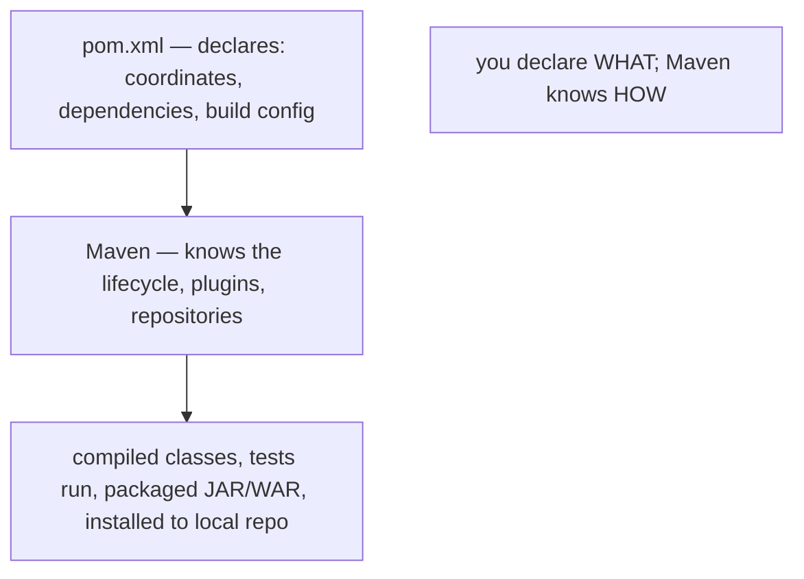

A minimal `pom.xml`:

```xml
<project xmlns="http://maven.apache.org/POM/4.0.0">
    <modelVersion>4.0.0</modelVersion>
    <groupId>com.example</groupId>
    <artifactId>my-app</artifactId>
    <version>1.0.0</version>
    <properties>
        <maven.compiler.release>21</maven.compiler.release>
    </properties>
</project>
```

That's enough to compile, test, and package a conventionally-laid-out project.

## Coordinates — GAV

Every Maven artifact is identified by **coordinates**: **groupId**, **artifactId**, **version** (GAV), plus a **packaging** type:

| Coordinate | Meaning | Example |
|------------|---------|---------|
| `groupId` | the organisation / namespace (reverse domain) | `org.springframework` |
| `artifactId` | the project / module name | `spring-core` |
| `version` | the release version | `6.1.0` |
| `packaging` | the output type (default `jar`) | `jar` / `war` / `pom` |
| `classifier` (optional) | a variant | `sources` / `javadoc` |

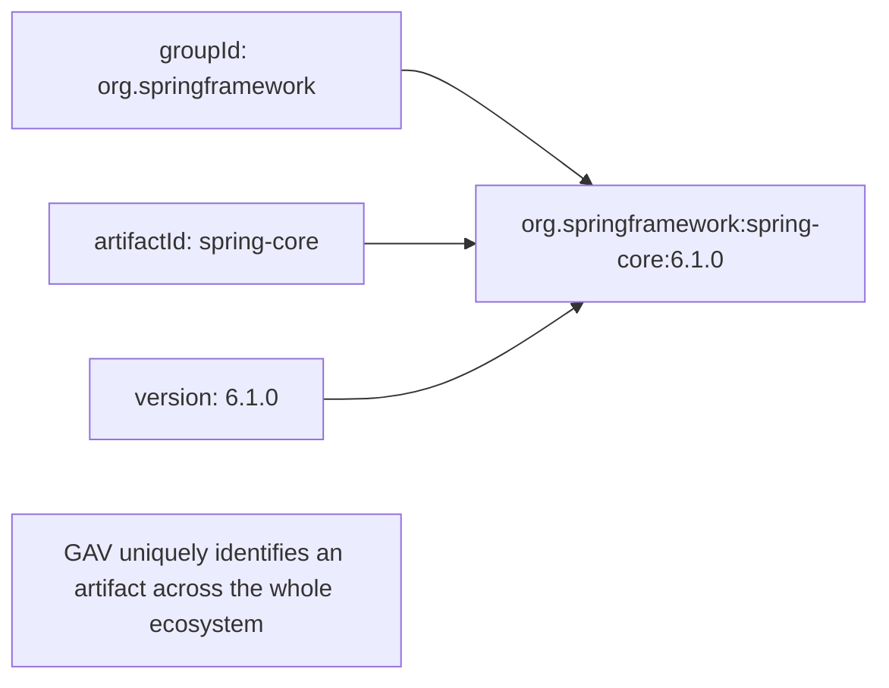

These coordinates are **globally unique** — `org.springframework:spring-core:6.1.0` means the same artifact on every machine. That's what makes dependency management work: you name a dependency by its coordinates, and Maven finds it.

## Standard Directory Layout (Convention)

Maven expects this structure — follow it and you write almost no build config:

```
my-app/
├── pom.xml
├── src/
│   ├── main/
│   │   ├── java/         ← main source code
│   │   └── resources/    ← main resources (copied to the classpath)
│   └── test/
│       ├── java/         ← test source code
│       └── resources/    ← test resources
└── target/               ← build output (generated; gitignore)
    ├── classes/          ← compiled main classes
    ├── test-classes/     ← compiled test classes
    └── my-app-1.0.0.jar  ← the packaged artifact
```

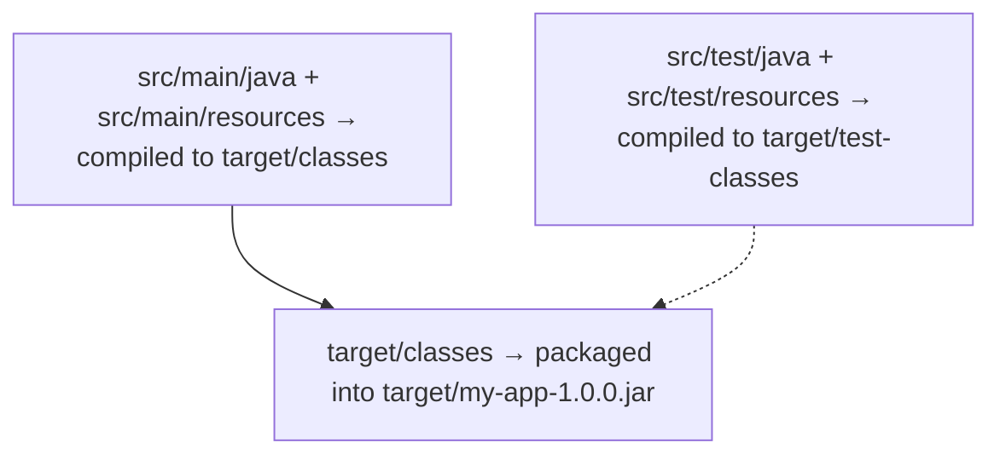

Resources in `src/main/resources` are **copied** (not compiled) onto the classpath — config files, properties, templates. Anything in `target/` is regenerated by the build and should never be edited or committed.

## The Build Lifecycle

Maven's central concept. A **lifecycle** is an ordered sequence of **phases**. Maven has **three** built-in lifecycles:

| Lifecycle | Purpose |
|-----------|---------|
| **`default`** | build and deploy the project (the main one) |
| **`clean`** | remove build output (`target/`) |
| **`site`** | generate project documentation |

### The `default` Lifecycle Phases

The `default` lifecycle has ~23 phases; the ones you use daily:

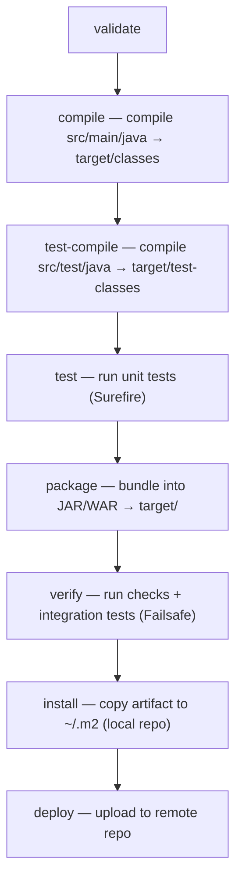

| Phase | What it does |
|-------|--------------|
| `validate` | check the project is correct |
| `compile` | compile main source → `target/classes` |
| `test-compile` | compile test source → `target/test-classes` |
| `test` | run unit tests (Surefire plugin) |
| `package` | bundle compiled code into a JAR/WAR |
| `verify` | run integration tests + quality checks (Failsafe) |
| `install` | install the artifact into the **local** repo (`~/.m2`) for other local projects |
| `deploy` | upload the artifact to a **remote** repo for the team |

### Phase Runs All Prior Phases — the Key Rule

Running a phase runs **every phase before it** in the lifecycle. `mvn package` runs `validate` → `compile` → `test-compile` → `test` → `package`. `mvn install` runs all the way through `install`. You never run `compile` then `test` separately — `mvn test` already compiled.

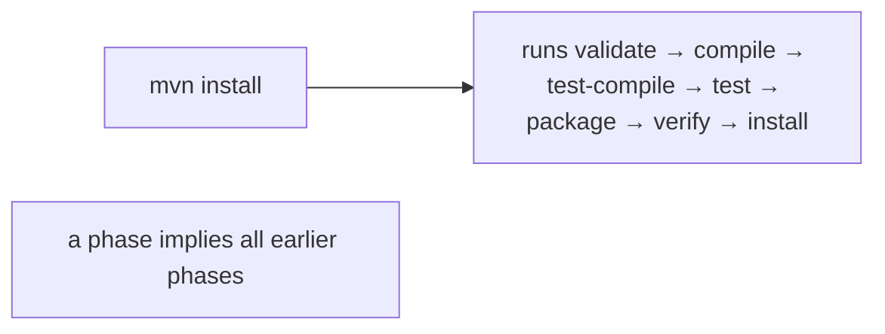

> [!IMPORTANT]
> **`mvn <phase>` runs that phase and all phases before it.** `mvn test` compiles first; `mvn package` tests first; `mvn install` packages first. To skip earlier work you use flags (`-DskipTests` to skip tests, `-o` for offline), not by running phases out of order.

The `clean` lifecycle (`pre-clean`, `clean`, `post-clean`) is separate — `mvn clean` deletes `target/`. The idiom `mvn clean install` runs the clean lifecycle's `clean` **then** the default lifecycle through `install` — a fresh, full build.

## Phases Bind to Plugin Goals

A phase by itself **does nothing** — it's a name. The actual work is done by **plugin goals** bound to phases. Maven's packaging type (`jar`, `war`, …) supplies **default bindings**:

| Phase | Bound goal (for `jar` packaging) |
|-------|----------------------------------|
| `compile` | `maven-compiler-plugin:compile` |
| `test-compile` | `maven-compiler-plugin:testCompile` |
| `test` | `maven-surefire-plugin:test` |
| `package` | `maven-jar-plugin:jar` |
| `install` | `maven-install-plugin:install` |
| `deploy` | `maven-deploy-plugin:deploy` |

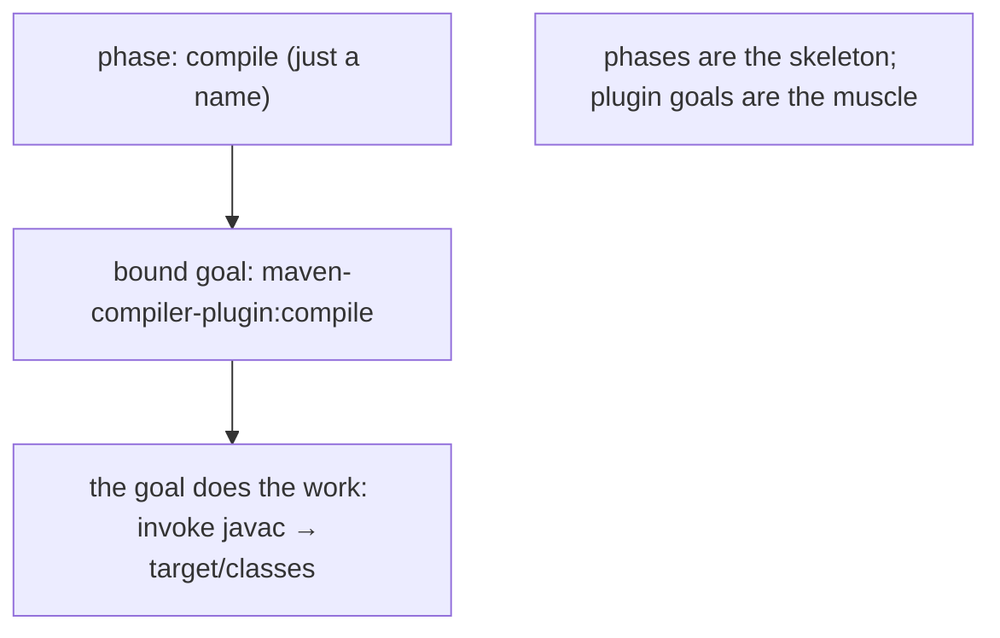

So `mvn compile` runs whatever goal is bound to the `compile` phase (the compiler plugin's `compile` goal). You can also **bind extra goals** to phases in your POM (e.g., bind a code-coverage goal to `test`, T07).

## Plugins and Goals

A **plugin** is a collection of **goals** (individual tasks). You invoke a goal directly with `plugin:goal` syntax:

```bash
mvn compiler:compile          # the compiler plugin's compile goal
mvn dependency:tree           # the dependency plugin's tree goal — show the dependency graph
mvn surefire:test             # run tests directly
mvn help:effective-pom        # show the fully-resolved POM
mvn versions:display-dependency-updates   # check for newer dependency versions
```

You can mix lifecycle phases and direct goals:

```bash
mvn clean compile             # clean phase + compile phase
mvn clean install             # clean + the full default lifecycle through install
mvn clean package -DskipTests # clean + build + package, skipping tests
```

Plugins are themselves artifacts (with GAV coordinates), downloaded from repositories like any dependency. You configure them in the POM's `<build><plugins>` section.

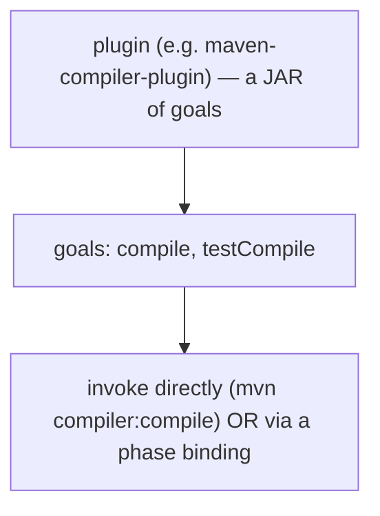

## Dependencies

The feature that made Maven essential. You declare a dependency by its coordinates; Maven downloads it (and its dependencies) and puts them on the classpath.

```xml
<dependencies>
    <dependency>
        <groupId>com.google.guava</groupId>
        <artifactId>guava</artifactId>
        <version>33.0.0-jre</version>
    </dependency>
    <dependency>
        <groupId>org.junit.jupiter</groupId>
        <artifactId>junit-jupiter</artifactId>
        <version>5.10.0</version>
        <scope>test</scope>
    </dependency>
</dependencies>
```

### Dependency Scopes

A **scope** controls *when* a dependency is on the classpath (compile / test / runtime) and whether it's packaged and transitive:

| Scope | Compile | Test | Runtime | Packaged | Transitive | Example |
|-------|:-------:|:----:|:-------:|:--------:|:----------:|---------|
| `compile` (default) | ✅ | ✅ | ✅ | ✅ | ✅ | Guava, Spring |
| `provided` | ✅ | ✅ | ❌ | ❌ | ❌ | Servlet API (the container provides it) |
| `runtime` | ❌ | ✅ | ✅ | ✅ | ✅ | JDBC driver (needed to run, not to compile) |
| `test` | ❌ | ✅ | ❌ | ❌ | ❌ | JUnit, Mockito |
| `system` | ✅ | ✅ | ❌ | ❌ | ❌ | a local JAR by path — **avoid** |
| `import` | — | — | — | — | — | only in `dependencyManagement` (BOMs) |

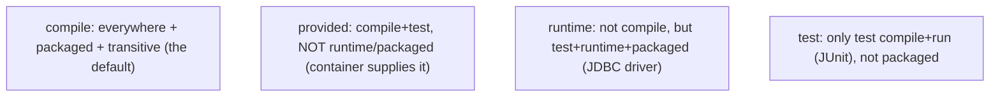

Scope mistakes are common: a `test` dependency used in main code won't compile; a `provided` dependency relied on at runtime fails (the container didn't supply it).

### Transitive Dependencies

If your project depends on **A**, and A depends on **B**, and B depends on **C**, Maven pulls in **all three** — the **transitive** closure. You declare A; you get A, B, C automatically.

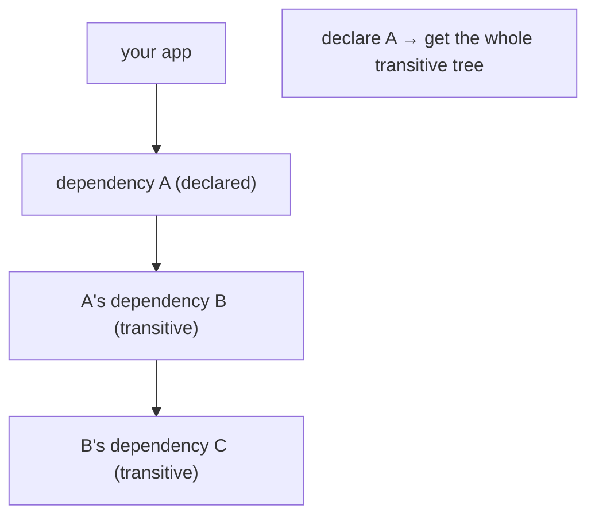

`mvn dependency:tree` shows the full resolved graph — essential for debugging "where did this JAR come from?"

### Dependency Mediation — Nearest Wins

When the transitive graph contains **two versions** of the same artifact (A → C:1.0, B → C:2.0), Maven must pick one. Its rule is **nearest wins**: the version at the **shortest path** from the root POM. If two are at the same depth, the **first declared** wins.

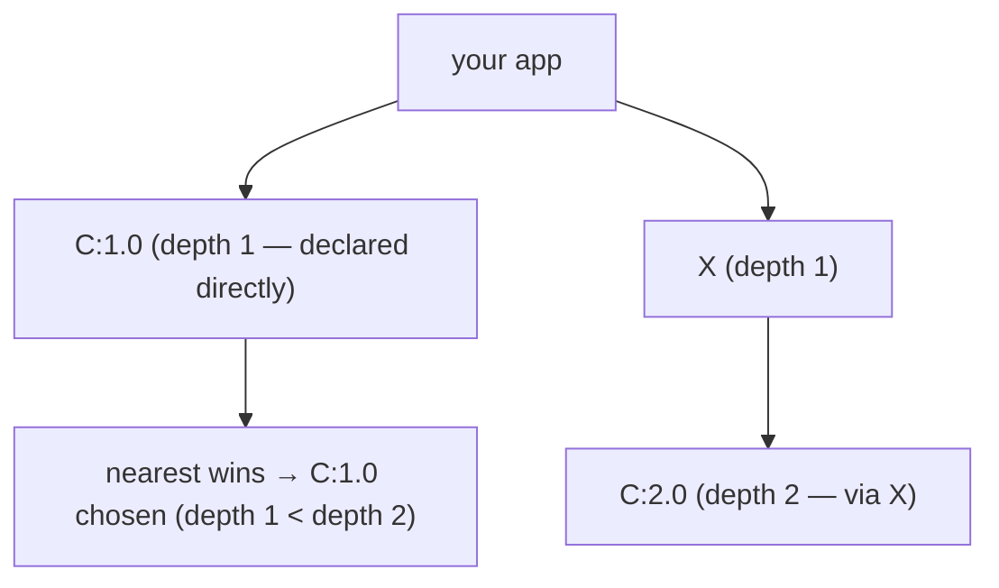

This is **different from Gradle**, which picks the **highest** version. Maven's nearest-wins can surprise you — a deep transitive dependency on a *newer* version loses to a shallow older one. The deep treatment of conflicts (and the fix via `dependencyManagement` and exclusions) is in [T03](./T03-dependency-management-and-version-conflicts.md).

### `dependencyManagement` and BOMs

`<dependencyManagement>` declares **versions centrally** without adding the dependency. Children (or the same POM) then declare the dependency **without a version**, inheriting the managed one. This is how you keep versions consistent across a multi-module project, and how **BOMs** (Bill of Materials, like the Spring Boot BOM) pin a whole family of versions:

```xml
<dependencyManagement>
    <dependencies>
        <dependency>
            <groupId>org.springframework.boot</groupId>
            <artifactId>spring-boot-dependencies</artifactId>
            <version>3.2.0</version>
            <type>pom</type>
            <scope>import</scope>     <!-- import the whole BOM -->
        </dependency>
    </dependencies>
</dependencyManagement>

<dependencies>
    <dependency>
        <groupId>org.springframework.boot</groupId>
        <artifactId>spring-boot-starter-web</artifactId>
        <!-- no version — comes from the BOM -->
    </dependency>
</dependencies>
```

### Exclusions

To drop an unwanted transitive dependency (a conflicting or vulnerable one), exclude it:

```xml
<dependency>
    <groupId>com.example</groupId>
    <artifactId>some-lib</artifactId>
    <version>1.0</version>
    <exclusions>
        <exclusion>
            <groupId>commons-logging</groupId>
            <artifactId>commons-logging</artifactId>
        </exclusion>
    </exclusions>
</dependency>
```

## Repositories

Maven resolves dependencies from **repositories** — directories of artifacts laid out by coordinates.

| Repository | Location | Role |
|------------|----------|------|
| **Local** | `~/.m2/repository` | your machine's cache of downloaded artifacts |
| **Central** | `repo.maven.apache.org` | the default public remote (Maven Central) |
| **Remote** | corporate Nexus/Artifactory, JitPack, etc. | team/private artifacts |

The flow: a build needs a dependency → check the **local** repo → if absent, download from a **remote** repo → cache it locally → use it. Subsequent builds hit the local cache (fast, offline-capable with `-o`).

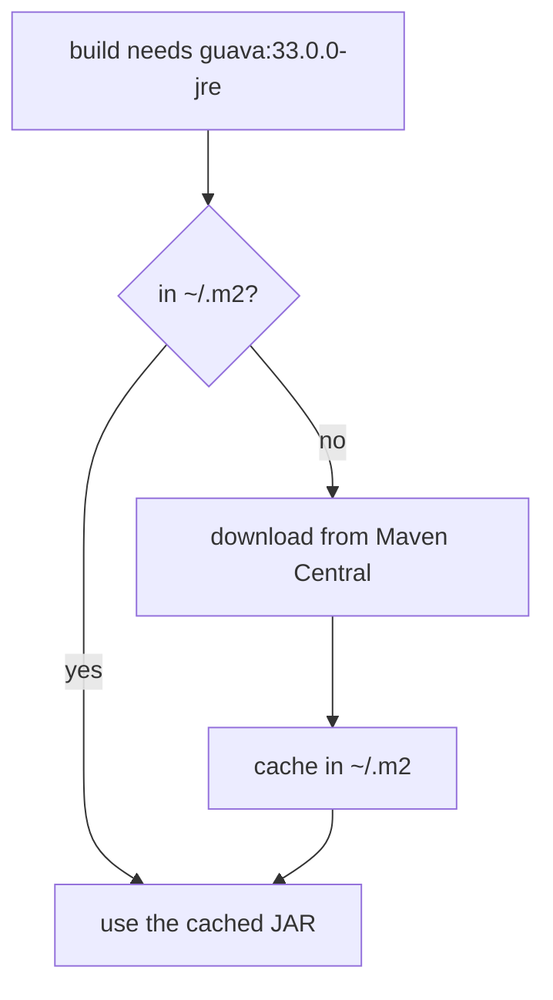

### Coordinates → Path

Coordinates map directly to a path in the repository:

```
org.springframework:spring-core:6.1.0
→ org/springframework/spring-core/6.1.0/spring-core-6.1.0.jar
  (groupId dots become slashes; then artifactId/version/artifactId-version.jar)
```

This is why coordinates are globally unique — they *are* the address.

### SNAPSHOT vs Release Versions

- A **release** version (`1.0.0`) is **immutable** — once published, it never changes. Maven caches it permanently.
- A **SNAPSHOT** version (`1.0.0-SNAPSHOT`) is a **mutable** development version — Maven re-checks the remote for a newer build periodically. Used during development before a release.

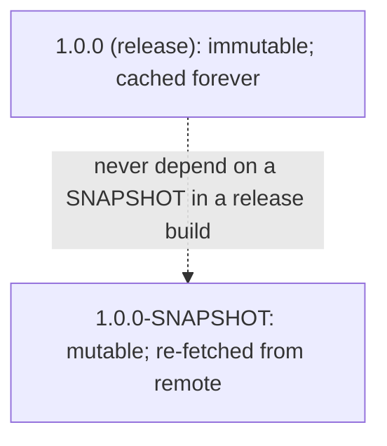

> [!WARNING]
> **Never release a build that depends on a `SNAPSHOT`.** A SNAPSHOT can change under you, so your "released" 1.0.0 might build differently tomorrow. Releases must depend only on releases (Maven's release plugin enforces this).

## Inheritance, the Super POM, and the Effective POM

Every POM **inherits** from the **super POM** — Maven's built-in base POM that supplies the default lifecycle bindings, the central repository, and standard plugin versions. Your POM can also have an explicit **parent** (for shared config across modules, T04).

The **effective POM** is the fully-resolved result: super POM + parent(s) + your POM, with all inheritance, interpolation, and defaults applied. Inspect it with:

```bash
mvn help:effective-pom
```

This reveals where a plugin version or repository "came from" when it's not in your POM — it was inherited.

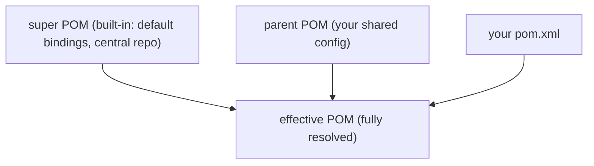

## Properties and Profiles

**Properties** centralise values for reuse and interpolate with `${...}`:

```xml
<properties>
    <java.version>21</java.version>
    <spring.version>6.1.0</spring.version>
</properties>
...
<dependency>
    <groupId>org.springframework</groupId>
    <artifactId>spring-core</artifactId>
    <version>${spring.version}</version>
</dependency>
```

Built-in properties include `${project.version}`, `${project.basedir}`, `${java.home}`.

**Profiles** are conditional build configurations — activated by a property, the OS, the JDK, or explicitly with `-P`:

```bash
mvn package -Pproduction          # activate the 'production' profile
```

Profiles let one POM build differently for dev / test / prod (different dependencies, plugins, or properties) without separate build files.

## Under the Hood

Maven is software running on the JVM — the build is itself a Java program:

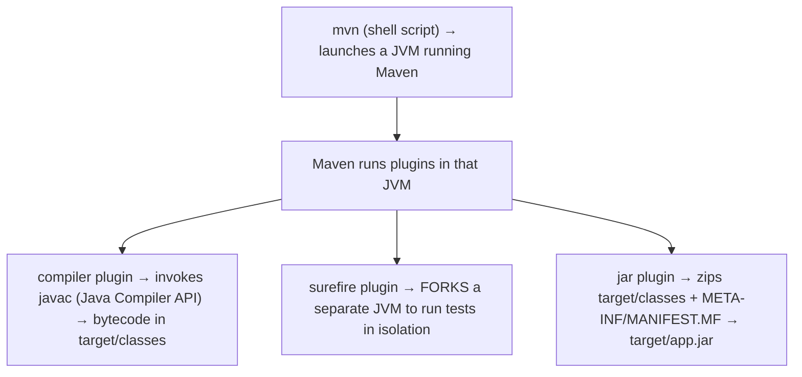

- **`mvn` is a launcher script** that starts a JVM running Maven core, which orchestrates the lifecycle.
- The **compiler plugin** invokes `javac` (via the Java Compiler API or a forked process) — the same source → bytecode step from T04, producing `target/classes`.
- The **Surefire plugin** by default **forks a fresh JVM** to run tests, isolating them from the build JVM (so a test that calls `System.exit` or leaks state doesn't corrupt the build).
- The **JAR plugin** is essentially a **ZIP**: it packs `target/classes` plus a generated `META-INF/MANIFEST.MF` (T19 — packaging) into the artifact.
- The **local repository** (`~/.m2`) is a plain **filesystem cache** keyed by coordinates; dependency resolution builds an in-memory graph and reads JARs from there.

One known weakness: Maven's **incremental compilation is limited** — it recompiles based on coarse staleness checks and often recompiles more than strictly necessary. Gradle (T02) has a more sophisticated incremental build and build cache, which is part of why large projects often prefer it.

## Common Maven Commands

```bash
mvn clean                       # delete target/
mvn compile                     # compile main source
mvn test                        # compile + run unit tests
mvn package                     # ...+ build the JAR/WAR
mvn verify                      # ...+ integration tests + checks
mvn install                     # ...+ install to ~/.m2 (for local consumers)
mvn deploy                      # ...+ upload to the remote repo
mvn clean install               # fresh full build through install
mvn clean package -DskipTests   # build the JAR, skip tests
mvn dependency:tree             # show the resolved dependency graph
mvn help:effective-pom          # show the fully-resolved POM
mvn -o ...                      # offline (local repo only)
mvn -pl module -am ...          # build one module + its dependencies (T04)
```

## Common Mistakes

### Confusing a Phase with a Goal

`mvn compile` (a **phase** — runs whatever's bound to it) vs `mvn compiler:compile` (a **goal** — runs that specific plugin goal). Phases run a whole sequence; goals run one task.

### Forgetting "Phase Runs All Prior Phases"

You don't `mvn compile` then `mvn test` — `mvn test` already compiled. Running earlier phases separately wastes time and can confuse.

### Wrong Dependency Scope

A `test` dependency used in `src/main/java` won't compile. A `provided` dependency relied on at runtime fails (the container must supply it). Match the scope to where the dependency is actually used.

### Dependency-Version Conflicts (Nearest Wins)

When two transitive versions clash, Maven picks the nearest, which may be the *older* one — a surprising bug. Diagnose with `dependency:tree`; fix with `dependencyManagement` or exclusions (T03).

### Depending on a SNAPSHOT in a Release

A SNAPSHOT can change under you. Release builds must depend only on releases.

### Running `install` When `verify`/`package` Suffices

`mvn install` writes to your shared local repo (`~/.m2`), which can mask problems and pollute other projects. For CI or a quick check, `mvn verify` (or `package`) is usually enough; reserve `install` for when a *local* consumer needs the artifact.

### Editing the JAR in `target/`

`target/` is regenerated every build. Edit the source and rebuild; never hand-edit build output.

### Not Committing the Right Things

Commit `pom.xml`; **gitignore `target/`**. The build output is derived, not source.

### Forgetting the Build JDK vs `--release`

Set `maven.compiler.release` to your **deployment** target (T09 — `--release`), not just the build JDK, so you don't accidentally use APIs that won't exist at runtime.

> [!INTERVIEW]
> Maven is a standard build-tools interview area.
>
> 1. **What's a POM?** The Project Object Model — `pom.xml`, declaring the project's coordinates, dependencies, and build config.
> 2. **What are Maven coordinates?** groupId:artifactId:version (GAV) + packaging — the globally-unique identity of an artifact.
> 3. **What's the build lifecycle?** An ordered sequence of phases (validate → compile → test → package → verify → install → deploy); running a phase runs all prior phases.
> 4. **Difference between a phase and a goal?** A phase is a lifecycle step (a name); a goal is a plugin task. Phases run the goals bound to them.
> 5. **What are the dependency scopes?** compile (default), provided, runtime, test, system, import — controlling when a dependency is on the classpath and whether it's packaged/transitive.
> 6. **What are transitive dependencies?** Dependencies of your dependencies, pulled in automatically.
> 7. **How does Maven resolve version conflicts?** Nearest wins (shortest path to root; first-declared on a tie) — unlike Gradle's highest-version.
> 8. **What's `dependencyManagement`?** Central version declarations (without adding the dependency) that children inherit; the basis of BOMs.
> 9. **What's the difference between the local and central repositories?** Local (`~/.m2`) is your cache; Central is the default public remote. Maven downloads from remote and caches locally.
> 10. **SNAPSHOT vs release?** SNAPSHOT is a mutable dev version (re-fetched); release is immutable (cached forever). Don't release depending on a SNAPSHOT.
> 11. **What does `mvn clean install` do?** Clean lifecycle's `clean` (delete `target/`) then the default lifecycle through `install` — a fresh full build installed to `~/.m2`.
> 12. **What's the effective POM?** The fully-resolved POM after inheritance from the super POM and any parents — `mvn help:effective-pom`.

## Practice

1. **Minimal project.** Create the standard layout + a minimal `pom.xml`; put a `Main` class in `src/main/java`. Run `mvn package`; find the JAR in `target/`; run it.
2. **Lifecycle trace.** Run `mvn -X package` (debug) and watch the phases execute in order. Confirm `compile`, `test-compile`, `test`, `package` all run.
3. **Phase vs goal.** Run `mvn compile` and `mvn compiler:compile`; observe both compile. Then `mvn dependency:tree` (a direct goal).
4. **Add a dependency.** Add Guava (`com.google.guava:guava`); use it in `Main`; rebuild. Run `mvn dependency:tree`; find Guava and its transitives.
5. **Scopes.** Add JUnit with `<scope>test</scope>`; write a test in `src/test/java`; run `mvn test`. Try using JUnit in `src/main/java`; confirm it won't compile.
6. **Transitive + conflict.** Add two dependencies that share a transitive dependency at different versions. Run `dependency:tree -Dverbose`; find the conflict and which version Maven chose (nearest wins).
7. **Exclusion.** Exclude a transitive dependency; confirm it disappears from `dependency:tree`.
8. **dependencyManagement.** Set up a `dependencyManagement` block with a version; declare the dependency without a version; confirm the managed version is used (via `dependency:tree`).
9. **Local repo path.** Find a downloaded JAR under `~/.m2/repository`; confirm the path matches the coordinates (`org/.../artifact/version/artifact-version.jar`).
10. **SNAPSHOT.** Set your version to `1.0.0-SNAPSHOT`; `mvn install`; find it in `~/.m2`; note the SNAPSHOT naming. Change to `1.0.0`; reinstall; compare.
11. **Effective POM.** Run `mvn help:effective-pom`; find a plugin version or the central repository that you never declared (inherited from the super POM).
12. **Properties + profile.** Add a `${java.version}` property used in the compiler config. Add a profile activated with `-P`; build with and without it; observe the difference.
13. **Skip tests.** Run `mvn package -DskipTests` vs `mvn package`; confirm the first skips the test phase's work.
14. **Surefire fork.** Add a test that prints `Thread.currentThread()` / the PID; confirm it runs in a forked JVM separate from the build (different process).
15. **Explain it back.** For `mvn clean install` on a project depending on Guava: describe (a) what `clean` does, (b) the phases `install` triggers in order, (c) how Guava is resolved (local cache → Central → cache), (d) which plugin goals run at `compile`/`test`/`package`/`install`, (e) where the artifact ends up.

## Recap

You should now be able to:

- Describe **Maven** as a declarative, convention-over-configuration build + dependency tool — you declare *what* the project is in `pom.xml`; Maven knows *how* to build it.
- Identify artifacts by **coordinates** (groupId:artifactId:version + packaging) — globally unique, and the address used to resolve dependencies.
- Recall the **standard directory layout** (`src/main/java`, `src/main/resources`, `src/test/java`, `target/classes`) and that following it minimises configuration.
- Explain the **build lifecycle** — the three lifecycles (`default`, `clean`, `site`); the `default` phases in order (validate → compile → test-compile → test → package → verify → install → deploy); and the rule that **running a phase runs all prior phases**.
- Distinguish a **phase** (a lifecycle step / name) from a **goal** (a plugin task) — phases run the goals **bound** to them (compile → compiler:compile, test → surefire:test, package → jar:jar); you can invoke goals directly with `plugin:goal`.
- Declare **dependencies** with the right **scope** (compile / provided / runtime / test / system / import) controlling classpath presence, packaging, and transitivity.
- Explain **transitive dependencies** (you get your dependencies' dependencies), **dependency mediation** (Maven picks the **nearest** version on a conflict — first-declared on a tie — unlike Gradle's highest), and the tools to control it (`dependencyManagement`/BOMs for central versions, `exclusions` to drop unwanted transitives; deep conflict handling in T03).
- Describe **repositories** — the **local** cache (`~/.m2`), **Central** (the default remote), and corporate **remotes**; the download → cache flow; coordinates → repository path; and **SNAPSHOT** (mutable dev) vs **release** (immutable) versions (never release depending on a SNAPSHOT).
- Explain **inheritance** — every POM inherits from the **super POM** (default bindings, central repo); the **effective POM** is the fully-resolved result (`mvn help:effective-pom`).
- Use **properties** (`${...}` interpolation) and **profiles** (`-P`, conditional config) for reuse and environment-specific builds.
- Recall the **under-the-hood** picture: `mvn` launches a **JVM** running Maven; the compiler plugin invokes **`javac`** → `target/classes` (T04); Surefire **forks a test JVM**; the JAR plugin **zips** classes + manifest (T19); the local repo is a **filesystem cache**; incremental compilation is limited (a Gradle advantage).
- Avoid the **common traps**: phase-vs-goal confusion, forgetting phase-runs-prior, wrong dependency scope, nearest-wins version surprises, releasing on a SNAPSHOT, over-using `install`, editing `target/`, not gitignoring `target/`, build-JDK vs `--release` mismatch.

## Next

Continue to [Gradle (tasks, build scripts, dependencies)](./T02-gradle-tasks-build-scripts-dependencies.md).
