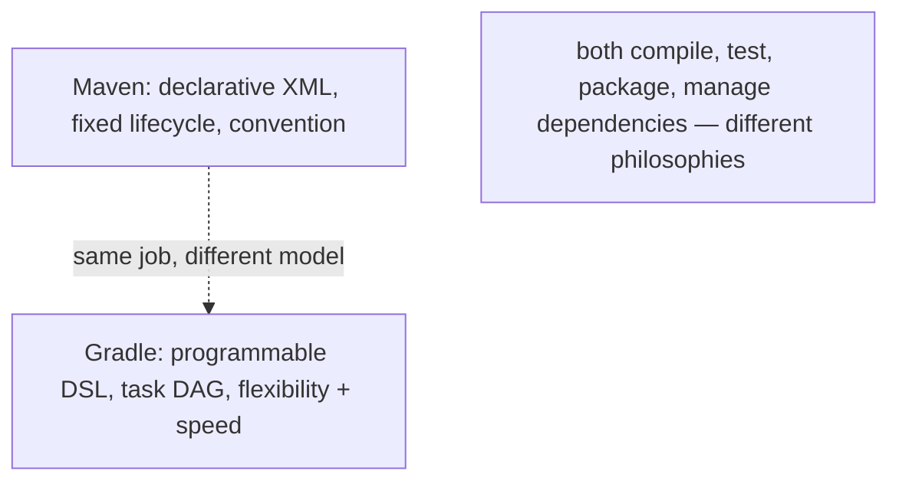
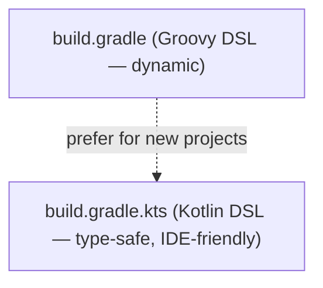
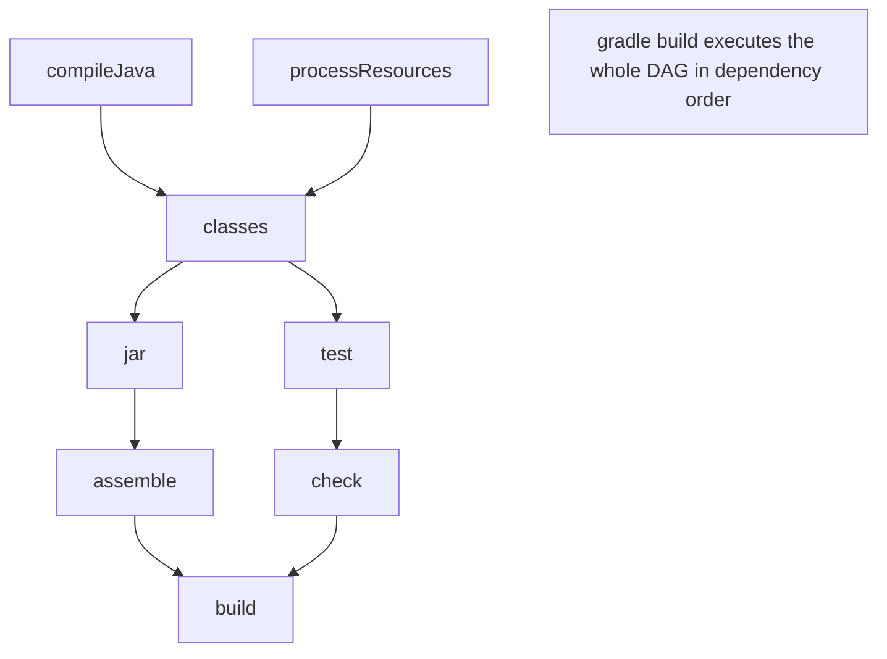
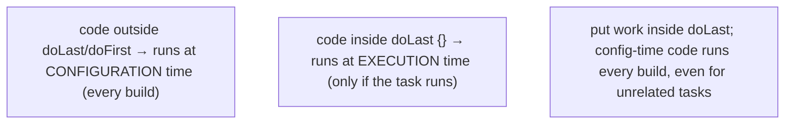
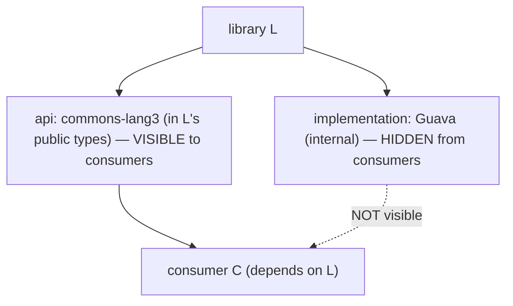
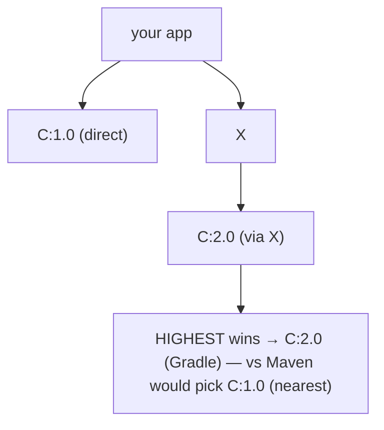
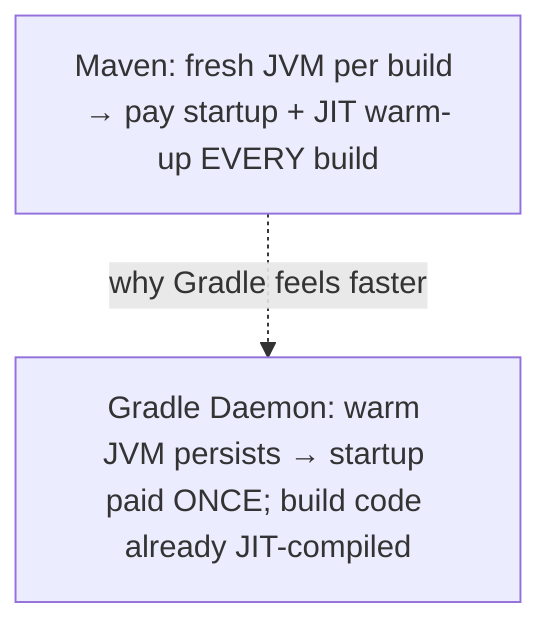
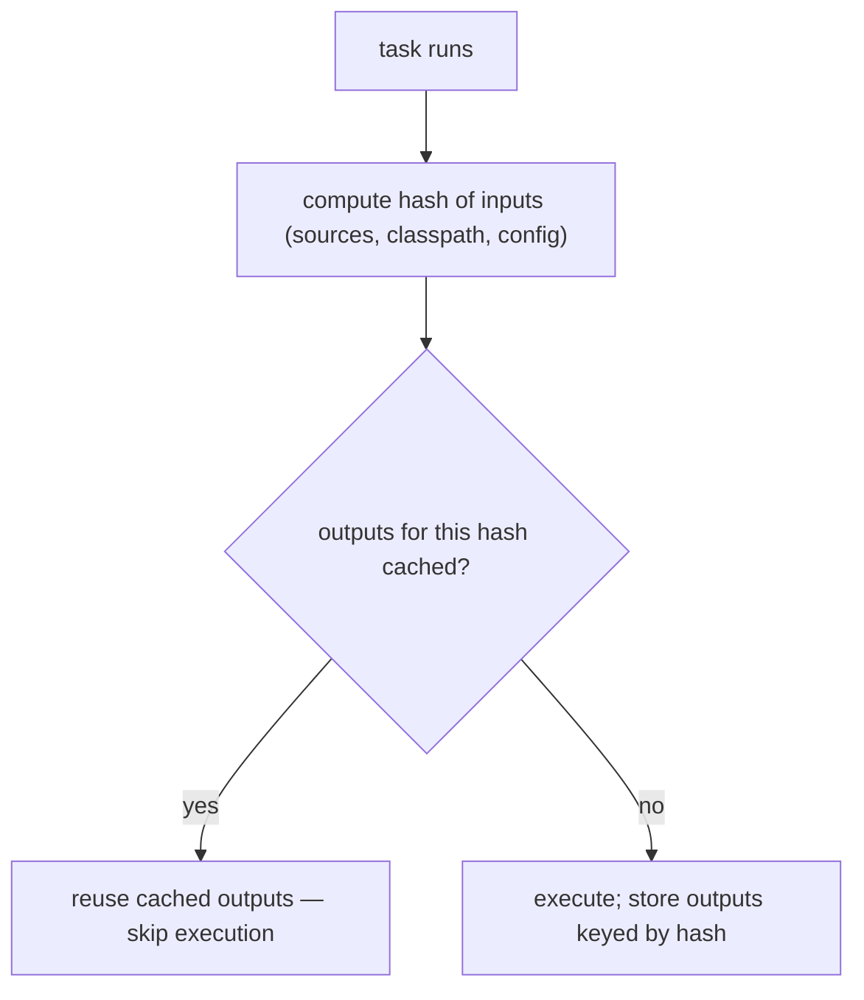
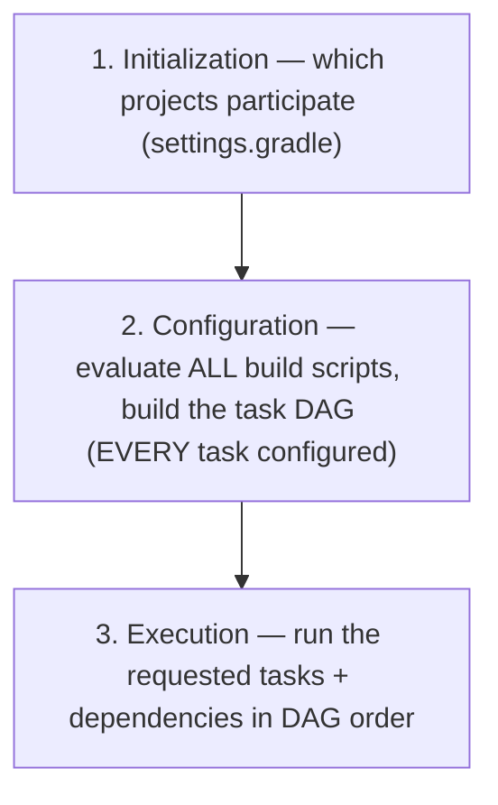
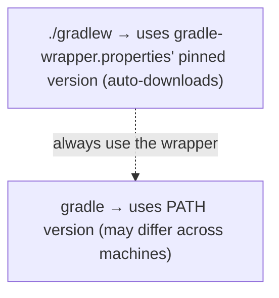

# Gradle (tasks, build scripts, dependencies)

**Gradle** is the other dominant JVM build tool — the **programmable** alternative to Maven ([T01](./T01-maven-lifecycle-pom-dependencies-plugins.md)). Where Maven is declarative XML over a fixed lifecycle, Gradle is a **build script** (Groovy or Kotlin) that constructs a **graph of tasks**; where Maven values convention, Gradle values flexibility. It's the default build tool for Android and increasingly common for backend Java, prized for **speed** (a warm daemon, an input-hashing build cache, precise incremental builds) — at the cost of a steeper learning curve. Understanding Gradle's *model* (the task DAG, the configuration/execution phases, the `api`/`implementation` distinction) is what separates "I copy-paste `build.gradle`" from "I understand my build."

The depth-bar requirement isn't just "show a `build.gradle`." At the **language** layer, a Gradle build is a **directed acyclic graph (DAG) of tasks** with inputs, outputs, and dependencies; dependencies use **configurations** that — crucially — distinguish **`api`** (exposed to consumers) from **`implementation`** (hidden), a transitive-control feature Maven lacks; and version conflicts resolve to the **highest** version (vs Maven's nearest-wins, T01). At the **architecture** layer, Gradle's speed comes from three mechanisms: the **Gradle Daemon** (a long-lived warm JVM that avoids per-build JVM startup *and* JIT re-warmup — the single biggest reason Gradle feels faster than Maven's fresh-JVM-per-build, T01); the **build cache** (task outputs keyed by an input hash, reused across builds and machines); and **incremental builds** (tasks whose inputs are unchanged are skipped as UP-TO-DATE). And the **configuration phase vs execution phase** distinction — Gradle evaluates *every* build script on *every* build to construct the task graph before running anything — is the source of both subtle bugs and the configuration-cache optimisation. We'll cover every layer.

> [!NOTE]
> Prerequisites: [Maven](./T01-maven-lifecycle-pom-dependencies-plugins.md) (L2/C02/T01) — coordinates, dependency scopes, repositories, the lifecycle Gradle contrasts with; [Source to Bytecode](../../L0-foundations/C01-cs-foundations/T04-source-to-bytecode-to-jvm-to-machine-code.md) (L0/C01/T04) — the compile step; [JDK vs JRE vs JVM](../../L0-foundations/C01-cs-foundations/T05-jdk-vs-jre-vs-jvm.md) (L0/C01/T05) — Gradle runs on the JVM; the daemon is a warm JVM; [Methods, parameters, return values](../../L0-foundations/C02-java-core/T12-methods-parameters-return-values.md) (L0/C02/T12) — JIT warm-up, which the daemon preserves. Deep **dependency conflict** handling is [T03](./T03-dependency-management-and-version-conflicts.md).

## Gradle vs Maven — Two Philosophies

| Aspect | Maven (T01) | Gradle |
|--------|-------------|--------|
| Build script | XML — **declarative** | Groovy/Kotlin DSL — **programmable** |
| Model | lifecycle → phases → goals | **task DAG** |
| Convention | strong, fixed | flexible, configurable |
| Dependency conflict | **nearest** version wins | **highest** version wins |
| Transitive control | scope only | **`api` vs `implementation`** |
| Speed | fresh JVM per build | **daemon + cache + incremental** |
| Learning curve | gentler | steeper |
| Android | rare | **default** |



Neither is "better" — Maven's rigidity is a feature (every Maven project builds the same way); Gradle's flexibility is a feature (complex builds, custom tasks, Android). Many teams use whichever their ecosystem defaults to.

## Build Scripts

A Gradle project's structure:

```
my-app/
├── settings.gradle.kts        ← project structure (root name, subprojects)
├── build.gradle.kts           ← the build script (tasks, plugins, dependencies)
├── gradle.properties          ← build properties (JVM args, flags)
├── gradlew / gradlew.bat      ← the Gradle Wrapper scripts
├── gradle/
│   └── wrapper/
│       └── gradle-wrapper.properties   ← pins the Gradle version
└── src/                       ← same layout as Maven (main/java, test/java, ...)
```

The build script comes in two dialects:

- **`build.gradle`** — the **Groovy DSL** (original; dynamically typed).
- **`build.gradle.kts`** — the **Kotlin DSL** (type-safe, IDE autocomplete, compile-time-checked) — **preferred for new projects**.

A minimal `build.gradle.kts`:

```kotlin
plugins {
    java
    application
}

group = "com.example"
version = "1.0.0"

repositories {
    mavenCentral()
}

dependencies {
    implementation("com.google.guava:guava:33.0.0-jre")
    testImplementation("org.junit.jupiter:junit-jupiter:5.10.0")
}

application {
    mainClass = "com.example.Main"
}
```



> [!TIP]
> **Prefer the Kotlin DSL (`build.gradle.kts`)** for new projects — it's type-checked at compile time, so typos and wrong types are caught immediately, and the IDE gives full autocomplete. The Groovy DSL is dynamically typed: a typo silently creates a new property instead of erroring.

## The Task Graph — Gradle's Core Abstraction

The single most important concept: a Gradle build is a **directed acyclic graph (DAG) of tasks**. A **task** is a unit of work with:

- A **name** (`compileJava`, `test`, `jar`).
- **Inputs** (source files, classpath, configuration).
- **Outputs** (compiled classes, the JAR).
- **Actions** (what it does — `doLast {}` / `doFirst {}`).
- **Dependencies** (`dependsOn` — tasks that must run first).

When you run `gradle build`, Gradle **resolves the DAG** and executes the requested task plus all its transitive dependencies, **in dependency order**.



This DAG replaces Maven's fixed phase sequence. Tasks `dependsOn` each other explicitly, so the build is a true graph (not a linear list) — independent branches can run in **parallel** (architecture section), and only the tasks actually needed for your goal run.

## Built-In Tasks (from Plugins)

Tasks come from **plugins**. The `java` plugin adds the standard Java build tasks; the `application` plugin adds run/distribution tasks:

| Task | From plugin | Does |
|------|-------------|------|
| `compileJava` | `java` | compile `src/main/java` |
| `processResources` | `java` | copy `src/main/resources` |
| `classes` | `java` | aggregate (compileJava + processResources) |
| `compileTestJava` | `java` | compile `src/test/java` |
| `test` | `java` | run unit tests |
| `jar` | `java` | build the JAR |
| `assemble` | `java` | build all artifacts (JAR, etc.) |
| `check` | `java` | run all verification (tests, static analysis) |
| `build` | `java` | **aggregate**: `assemble` + `check` |
| `run` | `application` | run the `mainClass` |

`gradle build` is the "do everything" task — it depends on `assemble` (produce artifacts) and `check` (verify). `gradle tasks` lists all available tasks.

## Custom Tasks

You define your own tasks in the build script:

```kotlin
tasks.register("hello") {
    doLast {
        println("Hello from Gradle")
    }
}

tasks.register("printVersion") {
    doLast {
        println("Version: ${project.version}")
    }
}
```

`doLast { ... }` registers an **action** that runs during the **execution** phase (when the task actually runs). Code **outside** `doLast`/`doFirst` runs during the **configuration** phase (when the build script is evaluated) — a distinction that matters a lot (architecture section).



## Plugins

Plugins add tasks, configurations, and conventions. The `plugins {}` block:

```kotlin
plugins {
    java                                    // core plugin (no version needed)
    application                             // core plugin
    id("org.springframework.boot") version "3.2.0"   // community plugin (id + version)
    id("io.spring.dependency-management") version "1.1.4"
}
```

- **Core plugins** (`java`, `application`, `java-library`) ship with Gradle — reference by name/id, no version.
- **Community plugins** (Spring Boot, Shadow, Spotless, …) come from the **Gradle Plugin Portal** — need an `id` and `version`.

The `java-library` plugin is special — it adds the **`api`** configuration (next section), so use it for **libraries** that expose dependencies to consumers (vs `java` for applications).

## Dependencies and Configurations

Dependencies go in the `dependencies {}` block, each assigned to a **configuration** (Gradle's richer take on Maven's scopes):

```kotlin
dependencies {
    implementation("com.google.guava:guava:33.0.0-jre")        // internal use
    api("org.apache.commons:commons-lang3:3.14.0")             // exposed to consumers (java-library)
    compileOnly("org.projectlombok:lombok:1.18.30")            // compile only (not runtime/packaged)
    annotationProcessor("org.projectlombok:lombok:1.18.30")    // annotation processor (T08/T10)
    runtimeOnly("org.postgresql:postgresql:42.7.0")            // runtime only (JDBC driver)
    testImplementation("org.junit.jupiter:junit-jupiter:5.10.0")  // test compile + runtime
}
```

| Configuration | Compile | Runtime | Exposed to consumers | Maven equivalent |
|---------------|:-------:|:-------:|:--------------------:|------------------|
| `implementation` | ✅ | ✅ | **❌** | (compile, but hidden) |
| `api` | ✅ | ✅ | **✅** | compile |
| `compileOnly` | ✅ | ❌ | ❌ | provided |
| `runtimeOnly` | ❌ | ✅ | ✅ | runtime |
| `testImplementation` | test ✅ | test ✅ | ❌ | test |
| `annotationProcessor` | (processing) | ❌ | ❌ | (annotation processing) |

## The `api` vs `implementation` Distinction — Gradle's Headline Feature

This is the concept Maven **doesn't have**, and it's worth understanding deeply. In Maven, a `compile`-scope dependency **always leaks transitively** — if A depends on B, anyone depending on A also sees B on their compile classpath (T01). Gradle separates two cases:

- **`api`** — "this dependency is part of my **public API**." Consumers of your module **see** it transitively. Use it only when the dependency's types appear in your **public signatures** (a method that returns a `com.google.common.collect.ImmutableList`, say).
- **`implementation`** — "this dependency is an **internal detail**." Consumers **don't see** it. Use it for everything you use only inside your code.



Two benefits:

1. **Encapsulation** — consumers can't accidentally depend on your *internal* libraries. If you used Guava internally via `implementation`, a consumer can't `import com.google.common...` and become coupled to your implementation choice. Swap Guava for something else later without breaking anyone.
2. **Build speed** — changing an `implementation` dependency (or your code that uses it) **doesn't recompile your consumers**, because their compile classpath (their ABI view) didn't change. Changing an `api` dependency **does** recompile consumers. So `implementation` shrinks the recompilation blast radius — a major win on large multi-module builds.

> [!IMPORTANT]
> **Default to `implementation`; use `api` only when the dependency's types appear in your public API.** Over-using `api` leaks your internals to consumers and forces them to recompile when those internals change — defeating the feature. This is the single most impactful Gradle dependency decision.

## Dependency Resolution — Highest Version Wins

When the dependency graph contains multiple versions of an artifact, Gradle picks the **highest** version (vs Maven's **nearest-wins**, T01):



Highest-wins is usually safer (newer is typically backward-compatible), but it can pull in a newer version than you expected. Gradle has rich conflict control — `resolutionStrategy.force(...)`, `strictly("1.0")` version constraints, dependency `constraints {}`, and platform/BOM support — covered in depth in [T03](./T03-dependency-management-and-version-conflicts.md).

### Version Catalogs (`libs.versions.toml`)

The modern way to centralise dependency versions — Gradle's answer to Maven's `dependencyManagement`/BOM. A `gradle/libs.versions.toml`:

```toml
[versions]
guava = "33.0.0-jre"
junit = "5.10.0"

[libraries]
guava = { module = "com.google.guava:guava", version.ref = "guava" }
junit = { module = "org.junit.jupiter:junit-jupiter", version.ref = "junit" }
```

Referenced type-safely (the IDE autocompletes `libs.guava`):

```kotlin
dependencies {
    implementation(libs.guava)
    testImplementation(libs.junit)
}
```

Version catalogs give one place to update versions across a multi-module build — the recommended modern practice.

## Repositories

Same artifact format as Maven (the Maven repository layout is the standard):

```kotlin
repositories {
    mavenCentral()                                   // Maven Central
    google()                                         // Android
    maven { url = uri("https://repo.example.com") }  // corporate Nexus/Artifactory
    mavenLocal()                                     // your ~/.m2 (use sparingly)
}
```

Gradle downloads and caches into `~/.gradle/caches` (its own cache, separate from Maven's `~/.m2`).

## Architecture Layer — Why Gradle Is Fast

Gradle's speed comes from three mechanisms, all rooted in **not redoing work**.

### The Gradle Daemon — a Warm JVM

The biggest single advantage over Maven. Maven starts a **fresh JVM** for every build (T01) — paying JVM startup (~hundreds of ms) **and** JIT warm-up (the build code runs interpreted/C1 until it's been called enough to compile to C2, T12) **every time**. Gradle runs a **long-lived background daemon JVM** that **stays warm between builds**:



After a few builds the daemon's build logic is fully JIT-compiled to native (T12) and its caches (project model, dependency metadata) are hot — so subsequent builds skip both the startup cost and the warm-up. `gradle --stop` kills daemons; `--no-daemon` disables (slower; mainly for CI where each build is cold anyway).

### The Build Cache — Reuse Task Outputs

Each task's **outputs** are keyed by a **hash of its inputs** (source files, classpath, task configuration). If a task runs with inputs matching a previous run, Gradle **reuses the cached outputs** instead of re-executing:



- **Local cache** (`~/.gradle/caches`) — reuse across builds on your machine, even across different checkouts/branches.
- **Remote cache** — a shared cache (team/CI) so one person's (or CI's) build outputs are reused by everyone — "never build the same thing twice across the whole team."

### Incremental Builds — Skip UP-TO-DATE Tasks

Gradle tracks each task's input/output **fingerprints** (file hashes + metadata). On rebuild, a task whose inputs **haven't changed** is marked **`UP-TO-DATE`** and **skipped** entirely:

```bash
> gradle build
> Task :compileJava UP-TO-DATE      # inputs unchanged — skipped
> Task :test UP-TO-DATE
> Task :jar UP-TO-DATE
BUILD SUCCESSFUL (most tasks skipped)
```

This is far more precise than Maven's coarse staleness checks (T01). Some tasks are *themselves* incremental — Gradle's incremental Java compilation recompiles only the changed classes and their dependents, not the whole source tree.

> [!NOTE]
> When you see `UP-TO-DATE` (or `FROM-CACHE`), the task **didn't run** — its outputs were reused. This is correct and fast, not a bug. If you genuinely need a task to re-run, change its inputs or use `--rerun-tasks`.

### Configuration Phase vs Execution Phase

A Gradle build has **three** phases:



The crucial subtlety: the **configuration phase runs on EVERY build, for EVERY task** — Gradle must configure the whole task graph before it knows what to run. So **expensive logic at configuration time slows every build**, even builds that don't touch that task. This is why **execution-time work belongs in `doLast {}`/`doFirst {}`** — code outside those blocks runs at configuration time:

```kotlin
tasks.register("slow") {
    val data = expensiveComputation()    // runs at CONFIGURATION time — EVERY build! (bad)
    doLast {
        val data2 = expensiveComputation()   // runs at EXECUTION time — only when 'slow' runs (good)
    }
}
```

The **configuration cache** (newer Gradle) caches the configured task graph, **skipping the configuration phase** on subsequent builds with unchanged build scripts — a significant speedup for large builds.

### Parallel Execution

`--parallel` (or `org.gradle.parallel=true` in `gradle.properties`) runs **independent** tasks (typically across subprojects, T04) concurrently, using the daemon's worker threads — another speedup for multi-module builds.

## The Gradle Wrapper

The `gradlew` / `gradlew.bat` scripts (plus `gradle/wrapper/`) **pin a specific Gradle version per project**. You commit them and **always run `./gradlew`** instead of a globally-installed `gradle`:

```bash
./gradlew build          # uses the project's pinned Gradle version (downloads it if needed)
gradle build             # uses whatever Gradle is on PATH — version mismatch risk
```

The wrapper guarantees everyone (and CI) builds with the **same Gradle version**, regardless of what's installed — eliminating "works on my machine" version drift. Update the version via `./gradlew wrapper --gradle-version 8.6`.



## Common Mistakes

### Config-Time Work Where Execution-Time Is Meant

Code outside `doLast`/`doFirst` runs at **configuration** time — every build, for every task. Expensive config-time logic slows the whole build. Put work inside `doLast {}`.

### `api`/`implementation` Misuse

Using `api` everywhere leaks your internals to consumers and forces them to recompile when internals change. Using `implementation` when a dependency's types are in your public API breaks consumers (they can't compile). Default to `implementation`; use `api` only for public-API types.

### Groovy-DSL Dynamic-Typing Footguns

In the Groovy DSL, a typo silently creates a property instead of erroring. Prefer the **Kotlin DSL** (`.kts`) for type-safety and IDE support.

### Not Using the Daemon or Cache

Running `--no-daemon` or with caching off discards Gradle's main speed advantages. Keep the daemon on (default); enable the build cache (`org.gradle.caching=true`).

### Not Using the Wrapper

Running a globally-installed `gradle` of a different version than the project expects causes subtle build differences. Always `./gradlew`; commit the wrapper.

### Misunderstanding `UP-TO-DATE` / `FROM-CACHE`

A skipped task isn't a bug — its outputs were reused because inputs didn't change. Don't "fix" it by deleting outputs; if you must force a re-run, change inputs or use `--rerun-tasks`.

### Mixing Maven and Gradle Caches

Gradle uses `~/.gradle/caches`, not Maven's `~/.m2` (unless you add `mavenLocal()`). Don't assume an artifact in `~/.m2` is visible to Gradle.

### Overriding Built-In Tasks Incorrectly

Reconfiguring `test` or `jar` without understanding the plugin's defaults can break the build. Extend (`tasks.named("test") { ... }`) rather than replace.

> [!INTERVIEW]
> Gradle is a standard build-tools interview area, often paired with "vs Maven."
>
> 1. **Gradle vs Maven?** Gradle is programmable (Groovy/Kotlin DSL) over a task DAG; Maven is declarative XML over a fixed lifecycle. Gradle is faster (daemon/cache/incremental), more flexible, steeper to learn.
> 2. **What's the task graph?** A DAG of tasks (each with inputs/outputs/actions/dependsOn); `gradle <task>` runs that task and its transitive dependencies in order.
> 3. **`api` vs `implementation`?** `api` exposes the dependency to consumers transitively; `implementation` hides it (better encapsulation + faster builds — consumers don't recompile on internal changes). Default to `implementation`.
> 4. **How does Gradle resolve version conflicts?** Highest version wins (vs Maven's nearest-wins).
> 5. **What's the Gradle Daemon?** A long-lived warm JVM reused across builds — avoids JVM startup and JIT re-warmup, the main reason Gradle is faster than Maven's fresh-JVM-per-build.
> 6. **What's the build cache?** Task outputs keyed by an input hash, reused across builds (local) and machines (remote) — never build the same thing twice.
> 7. **What's an incremental build?** Tasks whose inputs are unchanged are marked UP-TO-DATE and skipped; some tasks (Java compile) are internally incremental.
> 8. **Configuration vs execution phase?** Configuration evaluates all build scripts and builds the task graph (every build); execution runs the selected tasks. Config-time work runs every build — put work in `doLast`.
> 9. **What's the Gradle Wrapper?** `gradlew` scripts that pin a Gradle version per project; always use them for reproducible builds.
> 10. **Groovy vs Kotlin DSL?** Groovy (`build.gradle`) is dynamic; Kotlin (`build.gradle.kts`) is type-safe with IDE support — preferred for new projects.
> 11. **What's a version catalog?** `libs.versions.toml` — centralised, type-safe dependency versions (Gradle's `dependencyManagement` equivalent).
> 12. **Why does an `implementation` change not recompile consumers?** Their compile classpath (ABI view) didn't change — `implementation` deps aren't on consumers' compile classpath.

## Practice

1. **Minimal project.** Create `settings.gradle.kts` + `build.gradle.kts` with the `java`/`application` plugins; add a `Main`; run `./gradlew run`.
2. **Task list + DAG.** Run `./gradlew tasks` (list) and `./gradlew build --dry-run` (show the task execution order without running). Identify the DAG order.
3. **Custom task.** Register a `hello` task with `doLast { println(...) }`; run `./gradlew hello`.
4. **Config vs execution.** Put a `println` outside `doLast` and one inside. Run an *unrelated* task; confirm the config-time `println` runs (every build) but the `doLast` one doesn't.
5. **Add a dependency.** Add Guava via `implementation`; use it; build. Run `./gradlew dependencies` to see the resolved graph.
6. **api vs implementation.** Create a two-module build (a library + a consumer). Put a dependency in the library as `implementation`; confirm the consumer can't `import` it. Switch to `api`; confirm it now can.
7. **Recompile blast radius.** With the consumer depending on the library, change an `implementation` dependency of the library; confirm the consumer is **not** recompiled (UP-TO-DATE). Switch to `api`; confirm it **is** recompiled.
8. **Highest wins.** Set up a version conflict; run `./gradlew dependencies`; confirm Gradle chose the **highest** version (contrast with Maven's nearest from T01).
9. **Incremental / UP-TO-DATE.** Run `./gradlew build` twice; confirm the second run shows tasks as `UP-TO-DATE` (skipped). Touch a source file; rebuild; confirm only the affected tasks re-run.
10. **Build cache.** Enable `org.gradle.caching=true`; run a clean build; `./gradlew clean`; rebuild; confirm tasks show `FROM-CACHE`.
11. **Daemon.** Run `./gradlew --status` to see daemons. Time a build with the daemon vs `--no-daemon`; observe the warm-daemon speedup on the second build.
12. **Version catalog.** Create `gradle/libs.versions.toml`; reference `libs.guava` in `build.gradle.kts`; confirm IDE autocomplete and the resolved version.
13. **Wrapper.** Confirm `./gradlew --version` matches `gradle-wrapper.properties`. Run a globally-installed `gradle --version`; note any difference.
14. **Kotlin vs Groovy typo.** In a Groovy `build.gradle`, misspell a property; observe it silently succeeds. In Kotlin `.kts`, the same typo is a compile error.
15. **Explain it back.** For `./gradlew build` on a project with Guava (`implementation`): describe (a) the three phases (init/config/execution), (b) the task DAG executed, (c) how the daemon keeps the build JVM warm, (d) how the build cache/incremental skip unchanged tasks, (e) why a Guava change wouldn't recompile a downstream consumer module.

## Recap

You should now be able to:

- Contrast **Gradle** (programmable Groovy/Kotlin DSL, task DAG, flexible, fast) with **Maven** (declarative XML, fixed lifecycle, conventional) — same job, different philosophy; Gradle is the Android default and increasingly common for backend.
- Recognise the **build-script files** — `build.gradle` (Groovy) vs `build.gradle.kts` (Kotlin, **preferred** — type-safe, IDE-friendly); `settings.gradle(.kts)` for project structure; `gradle.properties`; the **Gradle Wrapper** (`gradlew`) that pins the version.
- Explain the **task graph** — a DAG of tasks (name, inputs, outputs, actions, `dependsOn`); `gradle <task>` runs the task and its transitive dependencies in dependency order; built-in tasks come from plugins (`java`: compileJava/test/jar/check/build aggregate; `application`: run).
- Define **custom tasks** with `tasks.register(...) { doLast { ... } }`, and recall that **`doLast`/`doFirst` run at execution time** while code outside them runs at **configuration time**.
- Use **plugins** (`plugins { java; id("...") version "..." }`) — core plugins (`java`, `application`, `java-library`) by name; community plugins by id+version from the Plugin Portal.
- Declare dependencies with **configurations** — `implementation`, `api`, `compileOnly`, `runtimeOnly`, `testImplementation`, `annotationProcessor` — and recall the table mapping them to Maven scopes.
- Explain the **`api` vs `implementation`** distinction (Gradle's headline feature Maven lacks): `api` exposes a dependency to consumers transitively; `implementation` hides it — giving **encapsulation** (consumers can't couple to your internals) and **build speed** (changing an `implementation` dependency doesn't recompile consumers). **Default to `implementation`.**
- Recall that Gradle resolves version conflicts to the **highest** version (vs Maven's nearest-wins), with rich control (`resolutionStrategy`/`constraints`, T03), and that **version catalogs** (`libs.versions.toml`) centralise versions type-safely.
- Explain Gradle's **speed** mechanisms: the **Gradle Daemon** (a warm JVM that avoids per-build JVM startup *and* JIT re-warmup — the main edge over Maven's fresh-JVM-per-build); the **build cache** (task outputs keyed by input hash, reused across builds/machines); **incremental builds** (UP-TO-DATE tasks skipped; internally-incremental compilation).
- Recall the **three build phases** — initialization, **configuration** (evaluate all scripts + build the DAG, runs every build), **execution** (run selected tasks); config-time work slows every build, so execution work belongs in `doLast`; the **configuration cache** skips the configuration phase on unchanged builds.
- Always use the **Gradle Wrapper** (`./gradlew`) for reproducible, version-pinned builds.
- Avoid the **common traps**: config-time vs execution-time confusion, `api`/`implementation` misuse, Groovy-DSL dynamic-typing footguns (prefer Kotlin DSL), not using the daemon/cache, not using the wrapper, misreading `UP-TO-DATE`/`FROM-CACHE` as a bug, mixing Maven/Gradle caches, incorrectly overriding built-in tasks.

## Next

Continue to [Dependency management & version conflicts](./T03-dependency-management-and-version-conflicts.md).
