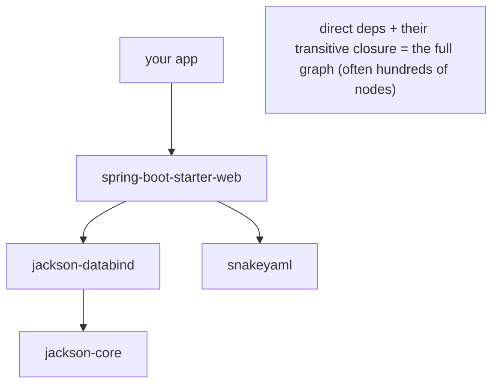
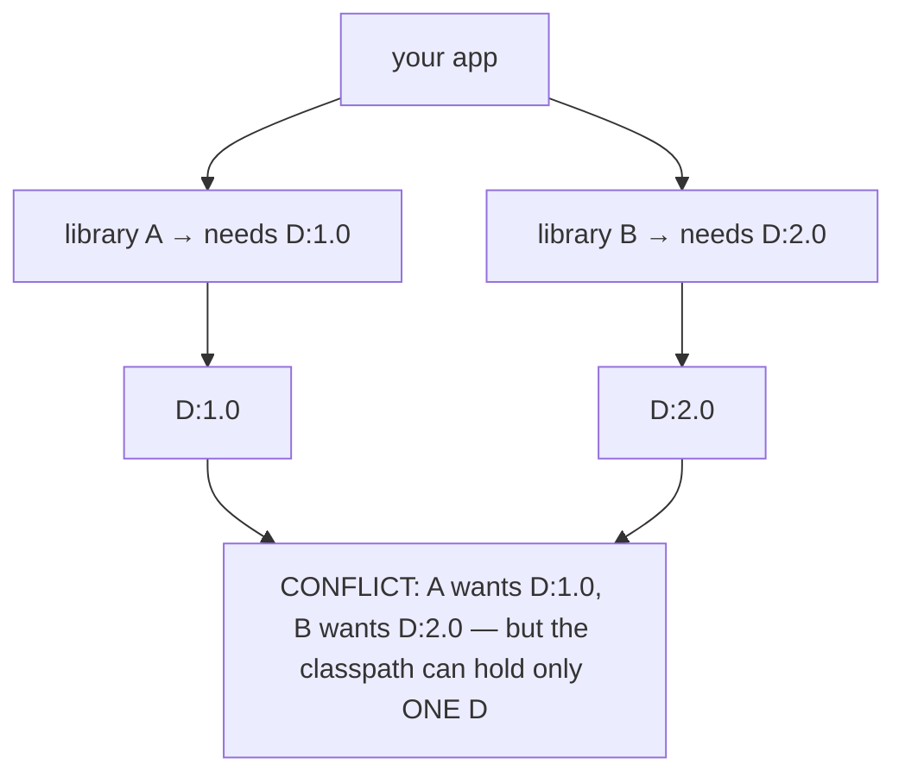
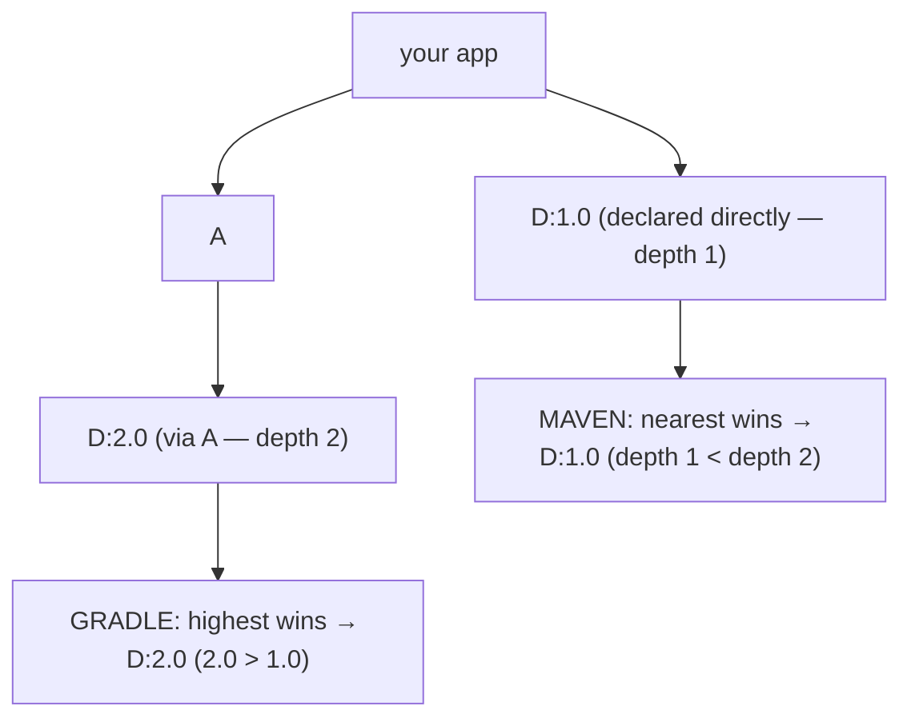
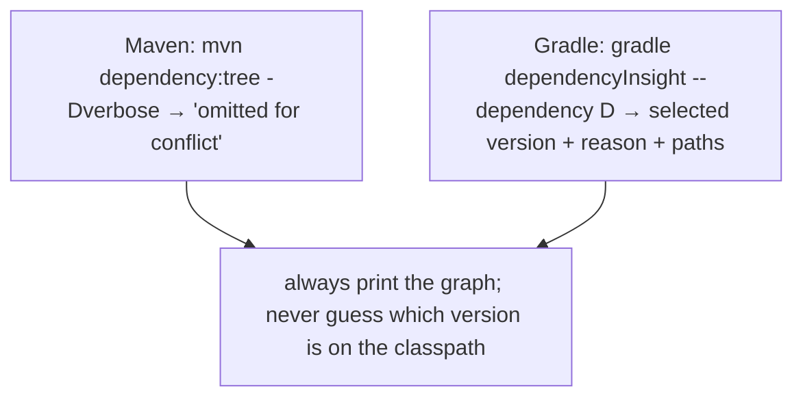
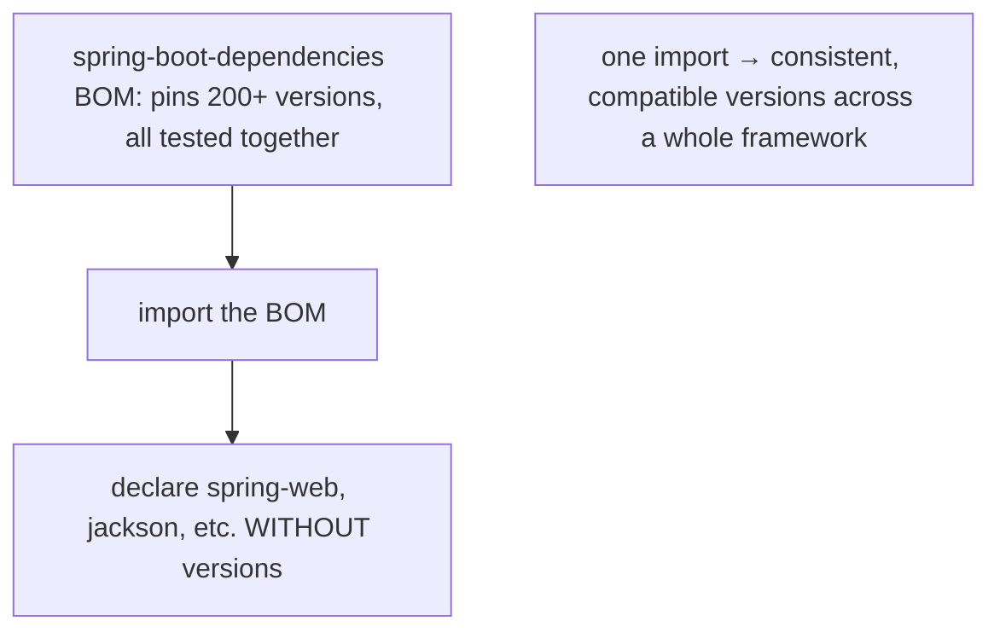
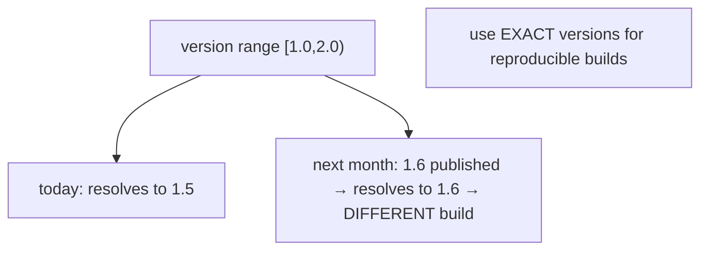
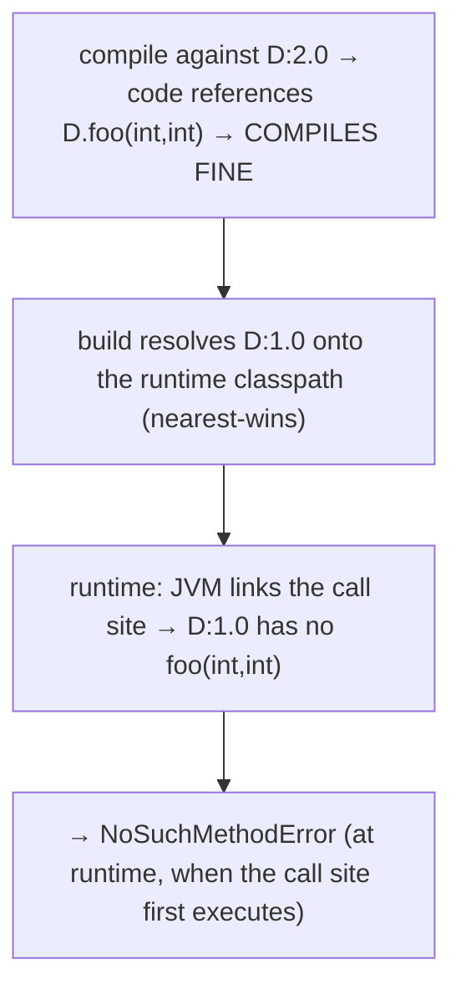
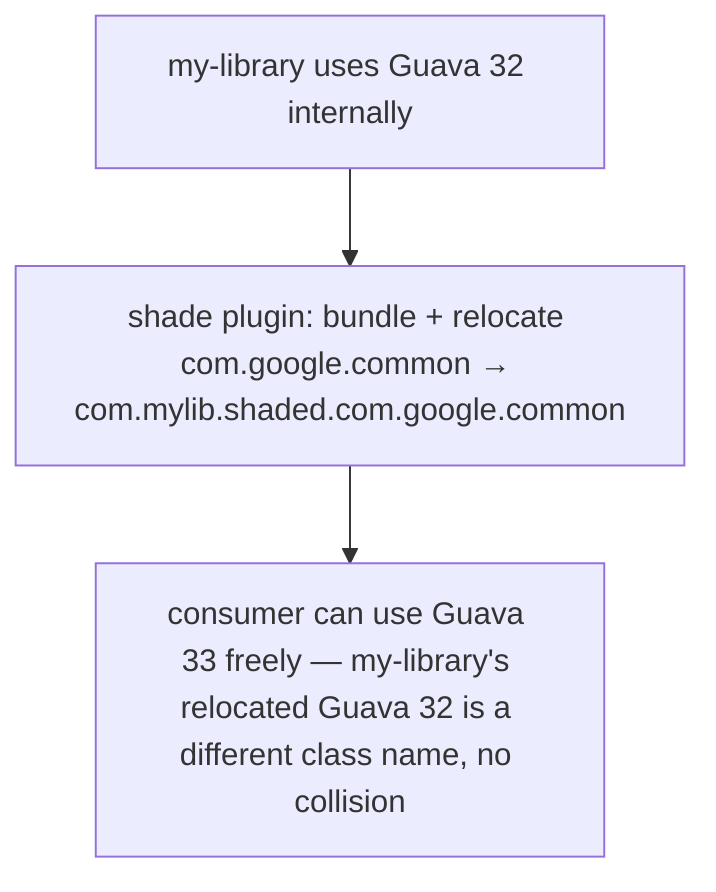
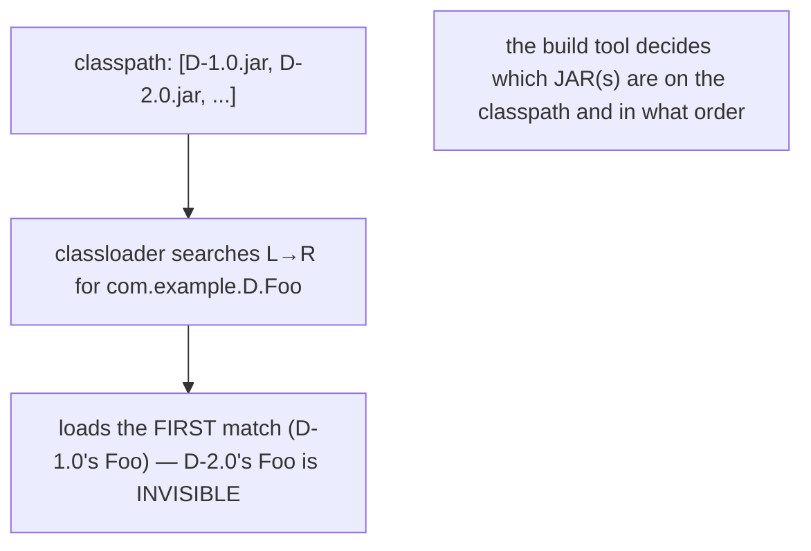
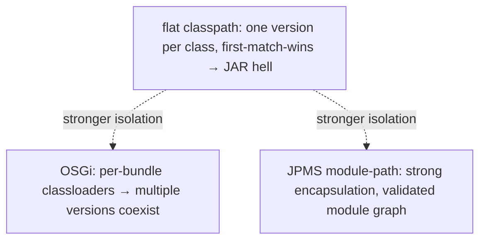

# Dependency management & version conflicts

Maven ([T01](./T01-maven-lifecycle-pom-dependencies-plugins.md)) and Gradle ([T02](./T02-gradle-tasks-build-scripts-dependencies.md)) make adding a dependency one line — but a real project pulls in **hundreds** of artifacts transitively, and sooner or later two of them demand **different versions** of the same library. The build tool must pick one; the wrong pick **compiles cleanly and then explodes at runtime** with a `NoSuchMethodError`. This topic is the deep treatment of the conflict mechanics T01/T02 introduced: how the dependency graph forms diamonds, how Maven and Gradle resolve them **differently**, how to diagnose and override, and — the part that trips up even experienced engineers — **why a build-time resolution failure surfaces as a runtime linkage error**.

The depth-bar requirement isn't just "use `dependency:tree`." At the **language** layer: conflicts arise from **diamond dependencies** (two transitive paths to different versions); Maven resolves them by **nearest-wins** and Gradle by **highest-wins** — which pick *differently* on the same graph; and the fixes are `dependencyManagement`/BOMs/exclusions (Maven) and `constraints`/`force`/`platform` (Gradle). At the **architecture** layer — the deep part — the classpath is a **flat, ordered list** where a classloader loads exactly **one** class per name (T15) **first-match-wins** (L0/C03); the conflict is resolved at **build time** (which JAR lands on the classpath) but the **symptom is at runtime** (`NoSuchMethodError`, `NoClassDefFoundError`, `AbstractMethodError`) because the JVM **resolves symbolic references lazily** (T04 — verify/prepare/resolve), so code compiled against version 2.0's API blows up only when it runs against version 1.0's classes. Stronger isolation (OSGi, JPMS modules) and **shading/relocation** are the escape hatches. We'll cover every layer.

> [!NOTE]
> Prerequisites: [Maven](./T01-maven-lifecycle-pom-dependencies-plugins.md), [Gradle](./T02-gradle-tasks-build-scripts-dependencies.md) (L2/C02/T01–T02) — transitive dependencies, scopes/configurations, nearest-vs-highest resolution; [Source to Bytecode](../../L0-foundations/C01-cs-foundations/T04-source-to-bytecode-to-jvm-to-machine-code.md) (L0/C01/T04) — class loading (verify/prepare/resolve), symbolic references, lazy linkage; [Variable scope & lifetime](../../L0-foundations/C02-java-core/T15-variable-scope-and-lifetime.md) (L0/C02/T15) — one Class per name per classloader; [Methods, parameters, return values](../../L0-foundations/C02-java-core/T12-methods-parameters-return-values.md) (L0/C02/T12) — method resolution, the `invoke*` family whose failed linkage throws `NoSuchMethodError`. The toolchain reference (L0/C03) covered the classpath first-match-wins rule.

## The Dependency Graph

A project's dependencies form a **directed graph**: your **direct** dependencies, plus *their* dependencies, plus *those* dependencies — the **transitive closure**. A modest Spring Boot app easily has 100+ nodes.



The build tool walks this graph, collects every node, and produces **one flat set of artifacts** for the classpath. The trouble starts when the graph requests **two versions of the same node**.

## Why Conflicts Happen — Diamond Dependencies

The classic conflict shape is a **diamond**: two paths from your app reach the same library at **different versions**.



The reason only one can win: the **classpath holds exactly one version of a class** — a classloader maps each class name to exactly one `Class` object (T15), and there's no version namespacing on a flat classpath. So `com.example.D.Foo` is *one* class; you can't have D:1.0's `Foo` and D:2.0's `Foo` both loaded. The build tool **must choose**.

## Resolution Strategies — Nearest vs Highest (Side by Side)

Maven and Gradle choose **differently**, which is a real source of "works in Maven, breaks in Gradle" surprises.

- **Maven — nearest wins.** The version at the **shortest path** from the root POM. On a depth tie, the **first declared** wins.
- **Gradle — highest wins.** The **highest version number** requested anywhere in the graph, regardless of depth.

Consider this graph — your app declares **D:1.0 directly** (depth 1) *and* transitively pulls **D:2.0 via A** (depth 2):



**Same graph, different result.** Maven keeps the **older** D:1.0 (it's nearer); Gradle takes the **newer** D:2.0 (it's higher). If your code needs a method only in 2.0, the Maven build breaks at runtime; if a transitive consumer needs 1.0-only behaviour, the Gradle build might. Neither rule is "right" — they're different heuristics, and you must know which tool you're using.

> [!IMPORTANT]
> **Maven = nearest-wins; Gradle = highest-wins.** On the same dependency graph they can select different versions. Migrating between the tools — or just reasoning about a conflict — requires knowing which rule applies. When in doubt, **pin the version explicitly** rather than relying on either heuristic.

## Diagnosing Conflicts

Never guess — print the graph.

### Maven

```bash
mvn dependency:tree                          # the full resolved tree
mvn dependency:tree -Dverbose                # incl. "omitted for conflict with X" annotations
mvn dependency:tree -Dincludes=group:artifactId   # filter to one artifact's paths
```

The `-Dverbose` output annotates each conflict:

```
[INFO] +- com.example:A:jar:1.0
[INFO] |  \- com.example:D:jar:2.0 (omitted for conflict with 1.0)   ← lost the conflict
[INFO] \- com.example:D:jar:1.0                                       ← won (nearest)
```

### Gradle

```bash
gradle dependencies                          # the full resolved tree per configuration
gradle dependencyInsight --dependency D      # WHY a version was chosen + which paths requested it
```

`dependencyInsight` is the killer tool — it shows the **selected** version, **every** requested version, and the **reason** (e.g., "by conflict resolution: between versions 1.0 and 2.0").



## Forcing and Overriding a Version

Once you know the conflict, **pin** the version you want.

### Maven — `dependencyManagement` and Exclusions

`<dependencyManagement>` is **authoritative** — a version declared there **overrides** transitive versions (it's a hard pin, not just "nearest"):

```xml
<dependencyManagement>
    <dependencies>
        <dependency>
            <groupId>com.example</groupId>
            <artifactId>D</artifactId>
            <version>2.0</version>     <!-- everyone gets 2.0, regardless of nearest-wins -->
        </dependency>
    </dependencies>
</dependencyManagement>
```

`<exclusions>` drop an unwanted transitive entirely (a conflicting or vulnerable one):

```xml
<dependency>
    <groupId>com.example</groupId>
    <artifactId>A</artifactId>
    <exclusions>
        <exclusion><groupId>com.example</groupId><artifactId>D</artifactId></exclusion>
    </exclusions>
</dependency>
```

### Gradle — Constraints, `force`, `strictly`, Exclude

```kotlin
dependencies {
    constraints {
        implementation("com.example:D:2.0")    // require at least 2.0
    }
    implementation("com.example:A") {
        exclude(group = "com.example", module = "D")   // drop transitive D
    }
}

configurations.all {
    resolutionStrategy {
        force("com.example:D:2.0")              // hard-force 2.0 everywhere
    }
}

// Strict version — fail the build if something needs a different version:
implementation("com.example:D") { version { strictly("2.0") } }
```

`strictly` is the strongest — it **fails the build** if any other part of the graph requires an incompatible version, surfacing the conflict at build time instead of letting it slide to runtime.

## BOMs — Bill of Materials

A **BOM** is a POM that declares a **curated, mutually-compatible set of versions** (only `dependencyManagement`, no actual dependencies). Import it once and a whole **family** of libraries gets consistent, tested-together versions — the Spring Boot BOM is the canonical example:



**Maven** imports a BOM with `<scope>import</scope>`:

```xml
<dependencyManagement>
    <dependencies>
        <dependency>
            <groupId>org.springframework.boot</groupId>
            <artifactId>spring-boot-dependencies</artifactId>
            <version>3.2.0</version>
            <type>pom</type>
            <scope>import</scope>
        </dependency>
    </dependencies>
</dependencyManagement>
```

**Gradle** uses `platform()` (or `enforcedPlatform()` to hard-force):

```kotlin
dependencies {
    implementation(platform("org.springframework.boot:spring-boot-dependencies:3.2.0"))
    implementation("org.springframework.boot:spring-boot-starter-web")   // version from the BOM
}
```

BOMs are the right answer for any framework family (Spring, Jackson, JUnit) — they eliminate a whole class of version-mismatch bugs.

## Version Ranges — Avoid Them

Both tools support **version ranges** (`[1.0,2.0)` = "any version ≥ 1.0 and < 2.0"). **Avoid them** in production:

```xml
<version>[1.0,2.0)</version>    <!-- resolves to whatever's latest in range — NON-REPRODUCIBLE -->
```

The resolved version **changes over time** as new versions are published — so your "same build" produces a **different artifact** next month, breaking reproducibility and making "it worked yesterday" debugging impossible.



> [!WARNING]
> **Don't use version ranges in production builds.** They make your build non-reproducible — the resolved version drifts as new releases appear, so the same source produces different artifacts over time. Pin exact versions; bump them deliberately.

## Dependency Locking — Reproducible Builds

To guarantee the **exact** resolved versions stay fixed (even with transitive drift), use **dependency locking**:

- **Gradle** — `gradle dependencies --write-locks` generates `gradle.lockfile`(s) pinning every resolved version; subsequent builds **verify** against the lock and fail if resolution would differ. Commit the lockfile.
- **Maven** — encourages exact versions in the first place; for stricter reproducibility, plugins (e.g., the dependency plugin, or the `maven-lockfile` community plugin) or a fully-pinned `dependencyManagement` achieve the same.

Locking turns "the build resolves whatever it resolves today" into "the build uses exactly these versions, verified" — essential for reproducible CI and supply-chain integrity (T11).

## JAR Hell — Why the Symptom Is at Runtime

The deepest point of this topic. The conflict is **resolved at build time** (the tool decides which JAR goes on the classpath), but the **symptom often appears at runtime** — and that disconnect confuses everyone the first time.

### The Mechanism

Suppose your code calls `D.foo(int, int)` — a method **added in D:2.0**. You compile against D:2.0, so it **compiles fine**. But the build resolves **D:1.0** onto the runtime classpath (Maven nearest-wins picked the older one). D:1.0's `Foo` only has `foo(int)`. At runtime, when the JVM **resolves** the symbolic reference to `D.foo(int, int)` (T04 — lazy linkage, on first execution of that call site), it finds no such method → **`NoSuchMethodError`**:



### The Linkage-Error Family

These are all **linkage errors** — the compiled bytecode's symbolic reference doesn't match the actual class loaded at runtime:

| Error | Cause |
|-------|-------|
| `NoSuchMethodError` | a method you compiled against is missing at runtime (version mismatch) |
| `NoSuchFieldError` | a field you compiled against is missing |
| `NoClassDefFoundError` | a class present at compile time is absent at runtime (missing JAR) |
| `AbstractMethodError` | an interface method added in a newer version isn't implemented by an older impl on the classpath |
| `IncompatibleClassChangeError` | a class changed shape incompatibly (e.g., class ↔ interface) |
| `ClassNotFoundException` | a *reflective* / dynamic lookup failed (not a linkage error per se, but the same root cause) |

> [!IMPORTANT]
> **Compile success does NOT guarantee runtime safety.** Code compiled against one version of a dependency can throw `NoSuchMethodError`/`NoClassDefFoundError`/`AbstractMethodError` at runtime if a *different* version is resolved onto the classpath. The JVM links symbolic references **lazily** (T04), so the error surfaces only when the offending code runs — often deep in production, far from the build. Diagnose with `dependency:tree`/`dependencyInsight`; fix by pinning the version.

This is distinct from `UnsupportedClassVersionError` (T09 / L0/C03) — that's about the **class-file version** (compiled for Java 21, run on Java 11). These linkage errors are about an **API mismatch within the same Java version** — same bytecode format, wrong library version.

## Shading and Relocation

When you genuinely need a *private* copy of a dependency (a library that uses Guava internally but doesn't want to force its Guava version on consumers), the answer is **shading with relocation**:

- The **Shadow** (Gradle) / **Shade** (Maven) plugins build an **uber JAR** (fat JAR) bundling all dependencies into one.
- **Relocation** **rewrites the package names** of bundled dependencies — `com.google.common.*` → `com.mylib.shaded.com.google.common.*` — so the bundled copy **can't collide** with a different Guava version on the consumer's classpath. The two are now *different class names*, so the classloader loads both without conflict.



Shading is the poor-man's classloader isolation — it sidesteps the conflict by making the names unique. The cost: bigger JARs, duplicated code, and hidden dependencies (a security scanner, T11, may miss the relocated copy). Use it sparingly, mainly for libraries that must embed a specific dependency version.

## Architecture Layer — Classpath, Classloaders, Isolation

### The Classpath Is Flat and First-Match-Wins

The runtime classpath is an **ordered list** of JARs/directories (L0/C03). The classloader searches it **left to right** and loads the **first** class it finds with a given name — **first-match-wins**:



So even if both versions ended up on the classpath, only one class wins. The build tool's job is to ensure **one consistent version** is there; the flat-classpath-with-one-class-per-name model is *why* version conflicts are unavoidable without stronger isolation.

### One Class Per Name Per Classloader

A classloader (T15) maps each class name to exactly **one** `Class` object — there's **no version dimension**. `com.example.D.Foo` is one class; the JVM can't distinguish "Foo from 1.0" from "Foo from 2.0" in the same loader. This is the root cause of JAR hell.

### Stronger Isolation — OSGi and JPMS

Two systems provide version isolation the flat classpath can't:

- **OSGi** — each "bundle" gets its **own classloader** with **explicit, version-ranged imports/exports**. Two bundles can use **different versions of the same library simultaneously** (each loads its own copy in its own classloader). Powerful but complex; used in Eclipse, some enterprise/embedded systems.
- **JPMS (Java Platform Module System)** — the `module-path` (vs the flat classpath) gives **strong encapsulation** and **reliable configuration** (the module graph is validated at startup; split packages and missing modules fail fast). It doesn't allow two versions of one module, but it makes the dependency structure explicit and catches problems earlier. (Full coverage in L1/C01.)



### Linkage Is Lazy

The JVM resolves symbolic references **lazily** (T04 — the resolve phase happens on first use, not at load). So a `NoSuchMethodError` from a version mismatch surfaces only when the **specific call site first executes** — which can be a rare code path triggered weeks into production. This lazy timing is why "it ran fine for a month then crashed" version bugs exist: the broken call site simply hadn't run yet.

## Common Mistakes

### Ignoring `dependency:tree` / `dependencies` Warnings

The conflict is reported — people don't read it. Run the tree tool when you add or bump a dependency; read the "omitted for conflict" / "by conflict resolution" notes.

### Version Ranges in Production

Non-reproducible builds. Pin exact versions.

### Transitive-Version Surprise

A deep transitive dependency bumps a version you didn't expect (especially under Gradle's highest-wins). Diagnose with `dependencyInsight`; pin if needed.

### Assuming Compile Success = Runtime Safety

The compile classpath and the runtime classpath can differ (`provided`/`compileOnly`, or a resolved-wrong version). Compile success doesn't prevent `NoSuchMethodError`.

### Not Using a BOM for a Framework Family

Hand-picking Spring/Jackson versions invites mismatches. Use the framework's BOM.

### Letting the Diamond Resolve Itself

Relying on nearest/highest-wins for a critical dependency is fragile. Pin the version you've tested.

### Shading Everything

Fat JARs with relocated everything bloat artifacts and hide dependencies from vulnerability scanners (T11). Shade only when you must embed a specific version.

### Not Locking Dependencies

For reproducible CI and supply-chain integrity, lock the resolved versions (Gradle lockfiles; fully-pinned Maven `dependencyManagement`).

> [!INTERVIEW]
> Dependency conflicts are a senior-leaning build-tools interview area.
>
> 1. **What's a diamond dependency?** Two transitive paths to different versions of the same artifact; the classpath can hold only one, so the tool must choose.
> 2. **How do Maven and Gradle differ in conflict resolution?** Maven picks the **nearest** version (shortest path, first-declared on a tie); Gradle picks the **highest**. They can pick differently on the same graph.
> 3. **Why does a version conflict cause a runtime error, not a compile error?** It's resolved at build time (which JAR is on the classpath), but the JVM links symbolic references lazily — so a `NoSuchMethodError` surfaces when the call site runs, not at compile.
> 4. **Name some linkage errors from version mismatches.** `NoSuchMethodError`, `NoClassDefFoundError`, `AbstractMethodError`, `IncompatibleClassChangeError`.
> 5. **How do you diagnose a conflict?** `mvn dependency:tree -Dverbose` / `gradle dependencyInsight --dependency X`.
> 6. **How do you force a version?** Maven `dependencyManagement` (authoritative) / `exclusions`; Gradle `constraints`/`force`/`strictly`/`exclude`.
> 7. **What's a BOM?** A POM declaring a curated, compatible version set; import it (Maven `scope=import` / Gradle `platform()`) to get consistent versions of a framework family.
> 8. **Why avoid version ranges?** Non-reproducible builds — the resolved version drifts as new releases appear.
> 9. **What's dependency locking?** Pinning the exact resolved versions (Gradle lockfiles) so builds are reproducible.
> 10. **What's shading/relocation?** Bundling dependencies into an uber JAR and rewriting their package names to avoid collisions with a different version on the consumer's classpath.
> 11. **Why can't the classpath hold two versions of one class?** A classloader maps each class name to one `Class` object — no version dimension; the flat classpath is first-match-wins.
> 12. **How do OSGi/JPMS help?** OSGi gives each bundle its own classloader (multiple versions coexist); JPMS's module-path adds strong encapsulation and a validated module graph.

## Practice

1. **Build a diamond.** Create two dependencies that transitively require different versions of a third. Run `mvn dependency:tree -Dverbose`; find the "omitted for conflict" line and the winner.
2. **Nearest vs highest.** Set up the side-by-side graph (declare D:1.0 directly + pull D:2.0 transitively). Resolve with Maven (`dependency:tree`) and Gradle (`dependencyInsight`); confirm Maven picks 1.0 and Gradle picks 2.0.
3. **dependencyInsight.** Run `gradle dependencyInsight --dependency <artifact>`; read the selected version, all requested versions, and the reason.
4. **Force a version (Maven).** Use `dependencyManagement` to pin the loser of a conflict; re-run `dependency:tree`; confirm the pinned version now wins.
5. **Force a version (Gradle).** Use `resolutionStrategy.force` and a `constraints` block; confirm via `dependencyInsight`.
6. **Exclusion.** Exclude a transitive dependency; confirm it disappears from the tree.
7. **`strictly` failure.** Set a Gradle `strictly("1.0")` constraint on a dependency that something else needs at 2.0; confirm the build **fails** (surfacing the conflict at build time).
8. **BOM.** Import the Spring Boot BOM (Maven `scope=import` / Gradle `platform()`); declare a starter without a version; confirm the BOM's version is used.
9. **Reproduce `NoSuchMethodError`.** Compile code against a method added in version 2.0; force version 1.0 onto the runtime classpath; run; observe the `NoSuchMethodError` at runtime (not compile). Note where in execution it surfaces.
10. **`NoClassDefFoundError`.** Compile against a class, then remove its JAR from the runtime classpath; run; observe `NoClassDefFoundError`.
11. **Version range drift (thought experiment).** Set a range `[1.0,2.0)`; resolve; note the version. Imagine a new 1.x release — explain why the build is now non-reproducible.
12. **Dependency lock (Gradle).** Run `gradle dependencies --write-locks`; inspect `gradle.lockfile`; change a transitive version and confirm the locked build fails until you update the lock.
13. **Shading.** Build an uber JAR with the Shadow/Shade plugin and a relocation rule; inspect the JAR; confirm the relocated package names (`com.mylib.shaded...`).
14. **Classpath first-match-wins.** Put two JARs with the same class (different versions) on the classpath in different orders; confirm which class loads depends on classpath order.
15. **Explain it back.** For an app that compiles against Jackson 2.16 but resolves Jackson 2.13 at runtime (a transitive pulled the older one): describe (a) why it compiles, (b) how the build chose 2.13, (c) why a `NoSuchMethodError` appears at runtime and when, (d) the `dependency:tree`/`dependencyInsight` step to diagnose, (e) the BOM/constraint fix.

## Recap

You should now be able to:

- Explain the **dependency graph** — direct dependencies plus their transitive closure — and how the build tool flattens it into one classpath.
- Recognise a **diamond dependency** (two transitive paths to different versions of one artifact) as the root cause of conflicts, because the **classpath holds only one version of a class** (one `Class` per name per classloader — no version dimension).
- Apply the **resolution rules**: Maven **nearest-wins** (shortest path, first-declared on a tie) vs Gradle **highest-wins** — and recognise they pick **differently** on the same graph (a migration/reasoning trap).
- **Diagnose** conflicts with `mvn dependency:tree -Dverbose` (omitted-for-conflict) and `gradle dependencyInsight --dependency X` (selected version + reason + paths) — never guess.
- **Override** a version: Maven `dependencyManagement` (authoritative pin) + `exclusions`; Gradle `constraints`/`force`/`strictly` (build-time failure on conflict) + `exclude`.
- Use **BOMs** (curated compatible version sets) for framework families — Maven `<scope>import</scope>`, Gradle `platform()` — to eliminate version-mismatch bugs.
- **Avoid version ranges** in production (non-reproducible — the resolved version drifts) and use **dependency locking** (Gradle lockfiles / fully-pinned Maven) for reproducible builds.
- Explain **JAR hell**: conflicts are resolved at **build time** (which JAR is on the classpath) but the **symptom is at runtime** — `NoSuchMethodError`/`NoClassDefFoundError`/`AbstractMethodError`/`IncompatibleClassChangeError` — because the JVM resolves symbolic references **lazily** (T04); **compile success does not guarantee runtime safety**; this is distinct from the class-file-version `UnsupportedClassVersionError` (T09).
- Use **shading/relocation** (Shadow/Shade uber JARs that rewrite bundled package names) as a private-copy escape hatch — sparingly, given the bloat and hidden-dependency cost (T11).
- Describe the **architecture**: the runtime classpath is a **flat, ordered, first-match-wins** list (L0/C03); a classloader loads **one class per name** (T15); **OSGi** (per-bundle classloaders → coexisting versions) and **JPMS** (validated module-path, strong encapsulation) provide stronger isolation than the flat classpath; **linkage is lazy**, so version bugs surface only when the offending call site runs.
- Avoid the **common traps**: ignoring tree warnings, version ranges in production, transitive-version surprise, assuming compile success means runtime safety, not using a BOM, letting diamonds self-resolve, shading everything, not locking dependencies.

## Next

Continue to [Multi-module projects](./T04-multi-module-projects.md).
