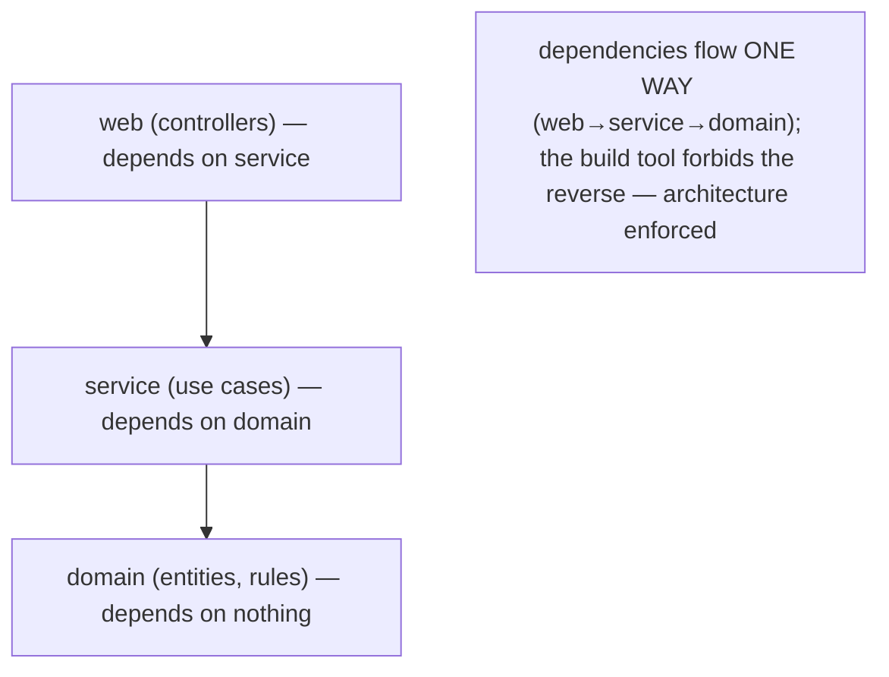
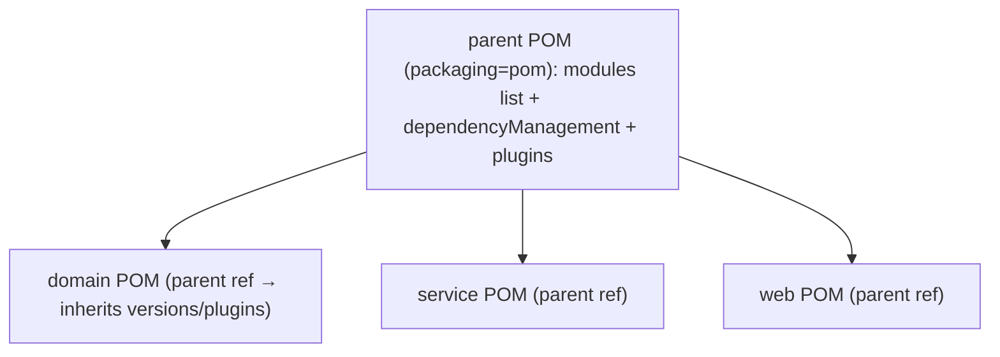
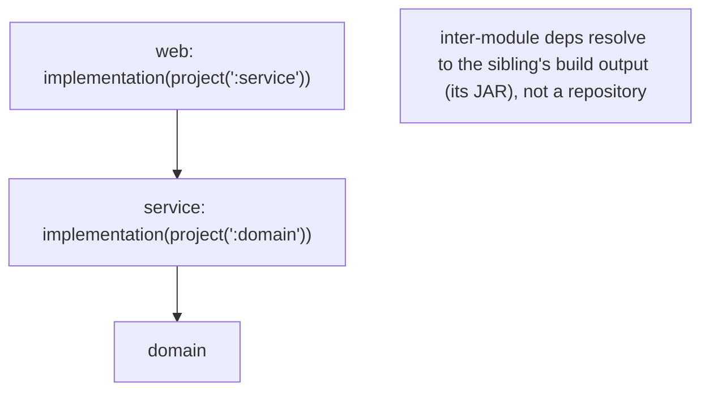
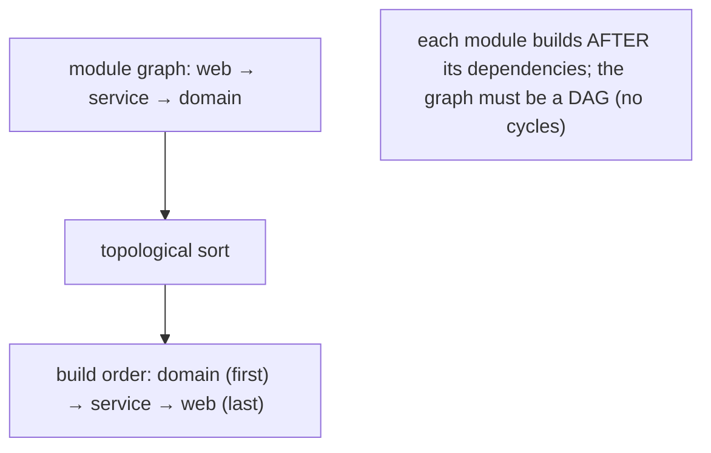
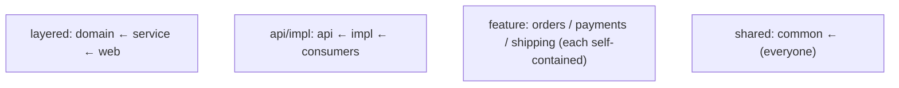
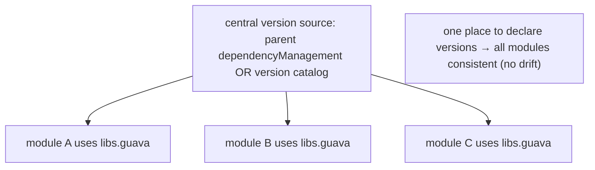
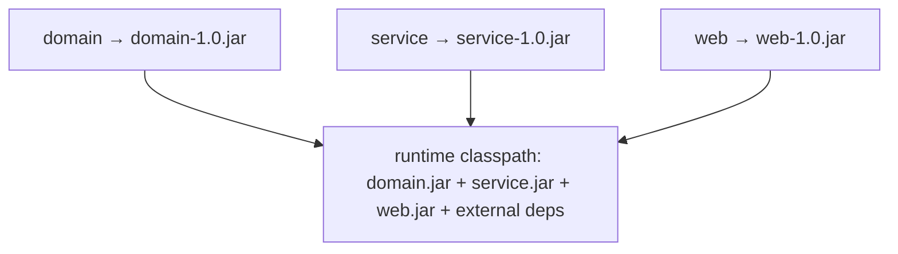
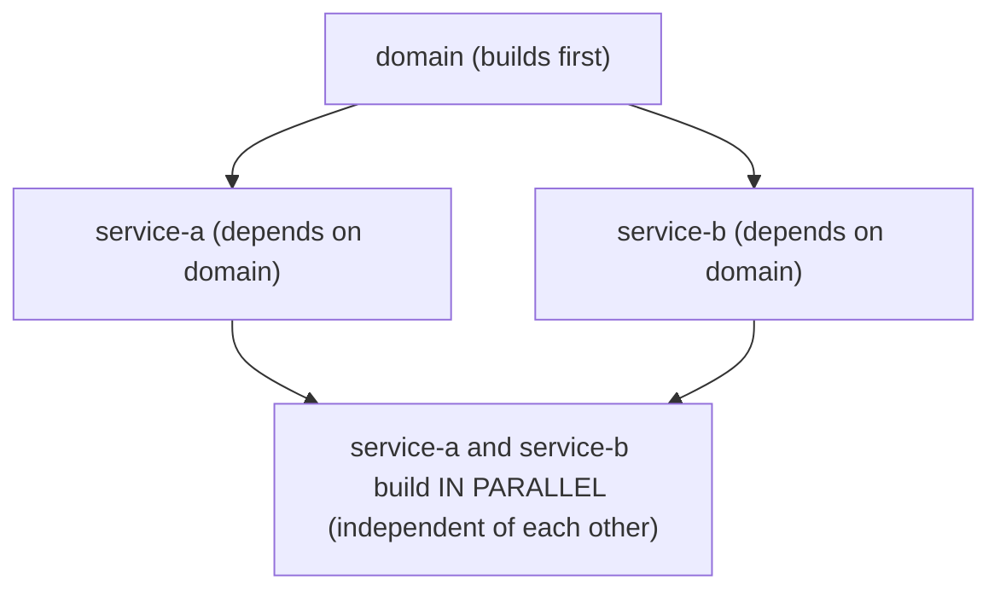
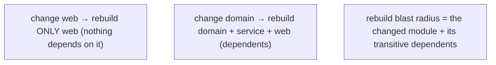
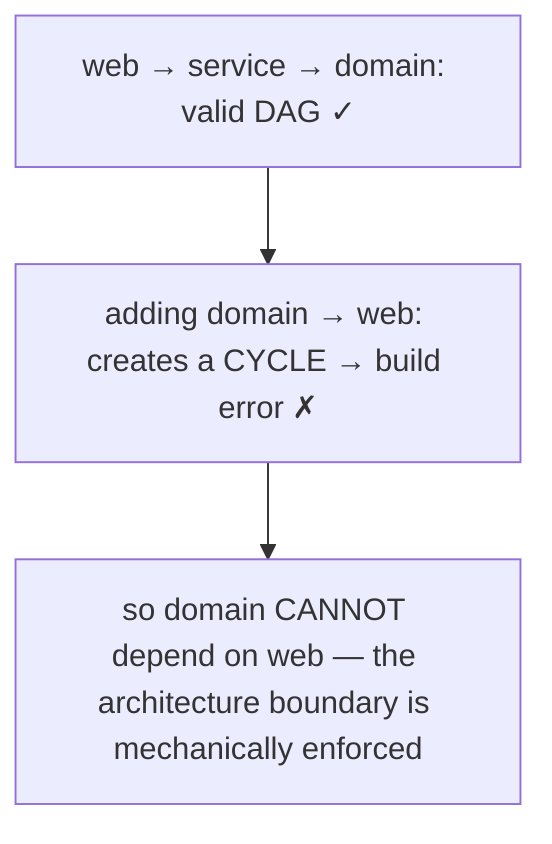

# Multi-module projects

As a codebase grows past a single deliverable, you split it into **multiple modules** that build together as one project — a `domain` module, a `service` module, a `web` module, each with its own sources, dependencies, and JAR. Multi-module builds are how real Java systems are structured: separation of concerns, independent dependency sets, reuse of shared code, faster incremental builds, and — the underrated benefit — **architectural boundaries enforced by the build tool**. Because the module dependency graph must be a **DAG** (no cycles), `web → service → domain` is allowed but `domain → web` is a build error, so the tool *physically prevents* `domain` from calling `web`.

The depth-bar requirement isn't just "split into folders." At the **language** layer, a multi-module project has an **aggregator/parent** (Maven: a `packaging=pom` POM with a `<modules>` list; Gradle: `settings.gradle` with `include(...)`), per-module build files, **inter-module dependencies** (referencing a sibling's build output, not a repository artifact), and shared configuration (parent `dependencyManagement`, version catalogs, convention plugins). At the **architecture** layer — the deep part — each module produces its **own JAR**; the build computes a **topological sort** of the module DAG (Maven's *reactor*) so each module builds **after** its dependencies; **independent** modules build in **parallel**; and **incremental** builds rebuild only **changed modules and their dependents** — the rebuild blast radius shrunk further by the `api`/`implementation` distinction ([T02](./T02-gradle-tasks-build-scripts-dependencies.md)). The **no-cycles DAG requirement** is precisely what makes the build tool an architecture enforcer. We'll cover every layer.

> [!NOTE]
> Prerequisites: [Maven](./T01-maven-lifecycle-pom-dependencies-plugins.md), [Gradle](./T02-gradle-tasks-build-scripts-dependencies.md) (L2/C02/T01–T02) — coordinates, the POM/build-script, `api`/`implementation`, inheritance, the incremental build; [Dependency management & conflicts](./T03-dependency-management-and-version-conflicts.md) (L2/C02/T03) — version consistency across modules, BOMs/catalogs; [Recursion](../../L0-foundations/C02-java-core/T14-recursion.md) (L0/C02/T14) — topological sort / DAG traversal (the build-order algorithm). Multi-module structure also relates to L5/C01 architecture (module boundaries as design).

## Why Multi-Module

Splitting one codebase into modules buys five things:

1. **Separation of concerns.** Each module is a cohesive unit — `domain` (entities, business rules), `service` (use cases), `web` (controllers). Clear responsibilities, smaller mental units.
2. **Independent dependency sets.** The `web` module needs Spring MVC; `domain` needs nothing. A single-module project would force every dependency on everything.
3. **Reuse.** A `common` or `domain` module is depended on by several others — write once, share.
4. **Faster incremental builds.** Change one module and only it (plus its dependents) rebuilds — a major speedup over rebuilding a monolith (T02 incremental).
5. **Enforced architectural boundaries.** The module dependency graph **is** the architecture, and the build tool enforces it: `web` can depend on `service`, but `service` can't depend on `web` (that would create a cycle, which is a build error). You **cannot accidentally** call a `web` class from `domain` — `domain` doesn't depend on `web`, so its classes aren't even on `domain`'s classpath.



## The Aggregator / Parent Structure

### Maven

A multi-module Maven project has a **parent (aggregator)** POM with `<packaging>pom</packaging>` and a `<modules>` list, plus a POM per submodule:

```
my-app-parent/
├── pom.xml          ← parent: packaging=pom, <modules>, shared config
├── domain/
│   └── pom.xml
├── service/
│   └── pom.xml
└── web/
    └── pom.xml
```

The parent POM:

```xml
<project>
    <groupId>com.example</groupId>
    <artifactId>my-app-parent</artifactId>
    <version>1.0.0</version>
    <packaging>pom</packaging>          <!-- aggregator: no JAR, it coordinates -->

    <modules>
        <module>domain</module>
        <module>service</module>
        <module>web</module>
    </modules>

    <dependencyManagement>              <!-- shared versions, inherited by all -->
        <dependencies>...</dependencies>
    </dependencyManagement>
</project>
```

Each submodule references the parent and inherits its config:

```xml
<project>
    <parent>
        <groupId>com.example</groupId>
        <artifactId>my-app-parent</artifactId>
        <version>1.0.0</version>
    </parent>
    <artifactId>service</artifactId>     <!-- inherits group + version + dependencyManagement -->
    ...
</project>
```

Submodules **inherit** the parent's `dependencyManagement`, `properties`, and `<build>` plugins (T01) — so versions and plugin config are declared **once** in the parent.



> [!NOTE]
> **Aggregator vs parent are conceptually distinct.** An *aggregator* POM lists `<modules>` to build together; a *parent* POM provides inherited config to children. The same POM usually does both, but they're separate roles — a parent needn't aggregate, and an aggregator needn't be the parent.

### Gradle

Gradle declares the module structure in **`settings.gradle(.kts)`** with `include`:

```kotlin
// settings.gradle.kts
rootProject.name = "my-app"
include(":domain", ":service", ":web")
```

Each module has its own `build.gradle.kts`; shared config lives in the root build script or — the modern approach — **convention plugins** (a shared plugin in `buildSrc`/`build-logic` applied to each module). The older `subprojects {}` / `allprojects {}` blocks work but create cross-project configuration coupling that hurts the configuration cache and parallelism — **prefer convention plugins** for shared config.

```kotlin
// older: subprojects block in root build.gradle.kts (discouraged for large builds)
subprojects {
    apply(plugin = "java")
    // shared config...
}
```

## Inter-Module Dependencies

A module depends on a sibling by referencing it — but the dependency resolves to the sibling's **build output**, not a repository artifact:

**Maven** — declare a `<dependency>` on the sibling's GAV:

```xml
<dependency>
    <groupId>com.example</groupId>
    <artifactId>domain</artifactId>
    <version>1.0.0</version>
</dependency>
```

**Gradle** — use the `project(...)` notation:

```kotlin
dependencies {
    implementation(project(":domain"))     // depend on the domain module's output
    api(project(":api"))                    // expose the api module transitively (T02)
}
```

The `api`/`implementation` distinction (T02) applies to inter-module dependencies too: `implementation(project(":domain"))` means consumers of *this* module don't see `domain`; `api(project(":domain"))` exposes it. Default to `implementation` to keep module boundaries tight.



## The Reactor — Build Order via Topological Sort

When you build a multi-module project, the tool must build modules **in dependency order** — a module's dependencies must be built before it. Maven calls this the **reactor**: it reads all the module POMs, builds the **module dependency graph**, and **topologically sorts** it (T14 — a DAG traversal) so each module builds **after** everything it depends on:



The graph **must be a DAG** — a **cycle** (domain → web → domain) makes the order undefined and is a **build error**. (This is the architecture-enforcement mechanism: the no-cycles rule physically prevents bidirectional module coupling.)

Gradle does the same — it computes the cross-module **task DAG** (T02) and executes tasks in dependency order across modules.

### Building a Subset

You often don't need to build everything:

```bash
# Maven:
mvn -pl service install              # build only the 'service' module
mvn -pl service -am install          # 'service' + its dependencies (Also Make)
mvn -pl service -amd install         # 'service' + modules that depend on it (Also Make Dependents)

# Gradle:
gradle :service:build                # build 'service' (and its dependencies)
gradle :service:test                 # test just 'service'
```

`-pl` (projects list) + `-am` (also-make) is the CI-friendly idiom: when only `service` changed, build `service` and what it needs — not the whole tree.

## Common Module Structures

| Structure | Modules | When |
|-----------|---------|------|
| **Layered** | `domain` → `service` → `web` | classic enterprise app (clean architecture) |
| **api / impl split** | `api` (interfaces) + `impl` (implementations) | libraries with a stable public API; pluggable impls |
| **Feature modules** | `orders`, `payments`, `shipping` | bounded contexts / feature teams (modular monolith) |
| **Shared / common** | `common` (utilities) + the rest depend on it | cross-cutting helpers |



The api/impl split is especially powerful with the `api`/`implementation` distinction (T02): consumers depend on the `api` module; the `impl` module is wired in at runtime only — so changing the implementation doesn't recompile consumers.

## Shared Configuration and Version Consistency

A key multi-module concern: keep **versions consistent** across all modules (T03 — version conflicts are worse when each module picks its own version). Centralise:

- **Maven** — the parent POM's `<dependencyManagement>` (and a BOM import) declares versions once; submodules omit versions and inherit them (T01/T03).
- **Gradle** — a **version catalog** (`gradle/libs.versions.toml`, T02/T03) shared across all modules; or a `platform()`/BOM applied per module.



Without this, modules drift to different versions of the same library, reintroducing the conflicts of T03 inside your own project.

## Architecture Layer — JARs, Parallelism, Incremental Rebuild

### Each Module Produces Its Own JAR

Every module compiles to its own `target/classes` (Maven) / `build/classes` (Gradle) and packages its own **JAR** — its own artifact with its own coordinates. At runtime, **all** the module JARs plus the external dependencies are on the classpath together (T03 — one flat classpath). So multi-module is a **build-time** organisation; at runtime it's just more JARs on the path.



### Independent Modules Build in Parallel

Modules with **no dependency between them** can build **concurrently**:

```bash
mvn -T 4 install          # Maven: 4 threads
mvn -T 1C install         # Maven: 1 thread per CPU core
gradle build --parallel   # Gradle: parallel project execution
```

The topological sort respects dependencies (a module waits for what it depends on) but runs **independent branches** of the DAG in parallel — a real speedup on multi-core machines for wide module graphs.



### Incremental Rebuild — Only Changed Modules and Their Dependents

The biggest multi-module win (T02 incremental). When you change a module, the build rebuilds **only that module and the modules that depend on it** (transitively) — everything else is UP-TO-DATE:

- Change **`domain`** → rebuild `domain`, `service`, `web` (they all depend on it, directly or transitively).
- Change **`web`** → rebuild only `web` (nothing depends on it).



And the **`api`/`implementation` distinction shrinks the blast radius further** (T02/T03): if `web` depends only on `service`'s `api`, then changing `service`'s `implementation` (or an `implementation` dependency of `service`) **doesn't recompile `web`** — `web`'s compile classpath (its view of `service`) didn't change. Tight module APIs = smaller rebuilds.

### The DAG Requirement Enforces Architecture

The reason the module graph **must be a DAG** isn't just a build-order technicality — it's what makes the structure an architecture enforcer. A layered design says "`web` depends on `service`, `service` on `domain`, dependencies flow one way." Encode that as module dependencies and the build tool **guarantees** it: `domain → web` would be a cycle (since `web → service → domain` already exists), which is a **build error**. You literally **cannot** write code in `domain` that imports a `web` class — `web` isn't on `domain`'s classpath, and adding the dependency to make it compile would break the build with a cycle. **The build tool turns an architectural rule into a mechanical guarantee.**



## Common Mistakes

### Circular Module Dependencies

`A → B → A` is a build error (the reactor can't order a cycle). Break it: extract the shared part into a third module both depend on, invert one dependency (dependency-inversion principle), or merge the two if they're truly one concern.

### Version Drift Across Modules

Each module declaring its own version of a shared library reintroduces T03 conflicts inside your project. Centralise versions in the parent `dependencyManagement` / a version catalog.

### Over-Modularisation

Too many tiny modules add overhead — a build file, a JAR, configuration time, and reactor coordination per module. A module per class is as wrong as one giant module. Modularise by **cohesive responsibility**, not by file count.

### Wrong Inter-Module Scope (`api` Overuse)

Using `api(project(":x"))` when `implementation` would do leaks `x` to your consumers and enlarges their rebuild blast radius (T02). Default to `implementation` for inter-module dependencies.

### Building Everything When a Subset Would Do

In CI, `mvn -pl changed-module -am install` (or Gradle's targeted task) builds only what changed plus its dependencies — far faster than a full reactor build when one module changed.

### Everything in One Module

The opposite extreme — no boundaries, no incremental-rebuild benefit, no enforced architecture. A monolith module is fine for a tiny app but loses multi-module's advantages as it grows.

### Gradle `subprojects {}` Cross-Configuration

`subprojects {}`/`allprojects {}` couple project configuration in ways that hurt the configuration cache and parallel builds. Prefer **convention plugins** for shared config in large Gradle builds.

### Misreading the Reactor Build Order

A module builds **after** its dependencies — so `domain` builds before `service`. Surprises here usually mean a missing/extra inter-module dependency; check the graph.

> [!INTERVIEW]
> Multi-module structure is a common build-tools / architecture interview area.
>
> 1. **Why split a project into modules?** Separation of concerns, independent dependency sets, reuse, faster incremental builds, and enforced architectural boundaries.
> 2. **How is a Maven multi-module project structured?** A parent POM with `packaging=pom` and a `<modules>` list; each submodule references the parent and inherits its config.
> 3. **How does Gradle declare modules?** `settings.gradle` with `include(":a", ":b")`; per-module build scripts; shared config via convention plugins.
> 4. **How do you reference a sibling module?** Maven: a `<dependency>` on its GAV. Gradle: `implementation(project(":x"))`.
> 5. **What's the reactor?** Maven's mechanism that topologically sorts modules by their dependencies and builds them in order.
> 6. **What determines the build order?** A topological sort of the module DAG — each module builds after its dependencies.
> 7. **What happens with a circular module dependency?** Build error — the reactor can't order a cycle; the graph must be a DAG.
> 8. **How does multi-module enable faster builds?** Incremental rebuilds touch only changed modules + their dependents; independent modules build in parallel.
> 9. **How does `api` vs `implementation` affect multi-module builds?** `implementation` hides a module dependency from consumers and shrinks their rebuild blast radius; `api` exposes it.
> 10. **How do you keep versions consistent across modules?** Parent `dependencyManagement` (Maven) / version catalog (Gradle) — declare versions once.
> 11. **How do you build just one module?** Maven `-pl module -am`; Gradle `:module:build`.
> 12. **Why does the DAG requirement enforce architecture?** A cycle is a build error, so dependencies must flow one way — the build tool mechanically prevents reverse coupling (e.g., `domain` can't depend on `web`).

## Practice

1. **Build a 3-module project.** Create `domain`, `service`, `web` with the layered dependency chain. Maven: parent POM + module POMs; Gradle: `settings.gradle` + module build scripts. Build the whole thing.
2. **Inter-module dependency.** Make `service` depend on `domain` and `web` on `service`. Use a `domain` class from `service`; confirm it compiles. Try using a `web` class from `domain`; confirm you can't (no dependency).
3. **Reactor order.** Build with Maven `-X` / Gradle `--info`; observe the build order (`domain` first, `web` last). Confirm it matches the topological sort.
4. **Circular dependency.** Add a dependency from `domain` to `web` (creating a cycle). Build; observe the cycle error. Remove it.
5. **Build a subset.** `mvn -pl service -am install` (or `gradle :service:build`); confirm only `service` + `domain` build, not `web`.
6. **Incremental blast radius.** Build everything. Change a `web` source; rebuild; confirm only `web` recompiles. Change a `domain` source; rebuild; confirm `domain` + `service` + `web` recompile.
7. **api vs implementation blast radius.** Make `web` depend on `service` via `implementation`. Change a `service` `implementation` dependency; confirm `web` is UP-TO-DATE (not recompiled). Switch to `api`; confirm `web` recompiles.
8. **Parallel build.** Add two independent `service-a` and `service-b` modules both depending on `domain`. Build with `mvn -T 4` / `gradle --parallel`; confirm `service-a` and `service-b` build concurrently.
9. **Shared versions.** Put a shared dependency version in the parent `dependencyManagement` (Maven) / version catalog (Gradle). Declare it without a version in two modules; confirm both use the managed version (`dependency:tree`).
10. **Version drift.** Deliberately declare different versions of one library in two modules; observe the inconsistency (T03). Fix by centralising.
11. **api/impl split.** Create an `api` module (interfaces) + `impl` module (implementations) + a consumer depending on `api`. Confirm the consumer compiles against `api` only and the impl is wired at runtime.
12. **Convention plugin (Gradle).** Move shared config from `subprojects {}` into a convention plugin in `buildSrc`; apply it to each module; confirm the build still works and is cleaner.
13. **Module JARs.** Build the project; find each module's JAR; confirm each module produces its own artifact with its own coordinates.
14. **Explain it back.** For a layered `web → service → domain` project: describe (a) the reactor's topological build order, (b) what rebuilds when you change `domain` vs `web`, (c) why `domain` can't depend on `web` (cycle → build error), (d) how independent modules parallelise, (e) where shared versions live.

## Recap

You should now be able to:

- Explain **why multi-module** — separation of concerns, independent dependency sets, reuse, faster incremental builds, and **architectural boundaries enforced by the build tool** (the module graph *is* the architecture).
- Structure a **Maven** multi-module project — a parent/aggregator POM with `packaging=pom` and `<modules>`, plus per-submodule POMs that reference the parent and **inherit** its `dependencyManagement`/properties/plugins; and distinguish the aggregator role (lists modules) from the parent role (provides inherited config).
- Structure a **Gradle** multi-module project — `settings.gradle` with `include(...)`, per-module build scripts, and shared config via **convention plugins** (preferred over `subprojects {}` for large builds).
- Declare **inter-module dependencies** — Maven `<dependency>` on a sibling's GAV; Gradle `implementation(project(":x"))` (or `api(project(...))` to expose transitively) — resolving to the sibling's build output, not a repository.
- Explain the **reactor** / build order — a **topological sort** of the module DAG so each module builds **after** its dependencies; a **cycle is a build error** (the graph must be a DAG); build a subset with `mvn -pl x -am` / `gradle :x:build`.
- Recognise the **common module structures** — layered (`domain → service → web`), api/impl split, feature modules, shared/common.
- Keep **versions consistent** across modules via parent `dependencyManagement` / a Gradle version catalog (avoiding the T03 conflicts inside your own project).
- Describe the **architecture**: each module produces its **own JAR** (multi-module is build-time organisation; runtime is one flat classpath); **independent modules build in parallel** (`mvn -T`, `gradle --parallel`); **incremental rebuilds** touch only **changed modules + their dependents**, with the **`api`/`implementation`** distinction shrinking the rebuild blast radius further; and the **no-cycles DAG requirement** mechanically enforces one-way architectural dependencies.
- Avoid the **common traps**: circular module dependencies, version drift across modules, over-modularisation, `api` overuse for inter-module deps, building everything when a subset would do, the everything-in-one-module extreme, Gradle `subprojects {}` cross-configuration, misreading the reactor build order.

## Next

Continue to [Git workflows (branching, PRs, rebasing)](./T05-git-workflows-branching-prs-rebasing.md).
