# Git workflows (branching, PRs, rebasing)

Git's object model — commits, trees, blobs, branches-as-pointers — is the foundation ([L0/C01/T10](../../L0-foundations/C01-cs-foundations/T10-introduction-to-git-and-version-control.md)). This topic is the **collaboration layer** on top: how teams actually *use* Git to work together without stepping on each other. **Branching strategies** decide how work is isolated and integrated; **pull requests** are the code-review and CI gate before code reaches the main branch; and **merge vs rebase** — the most-debated Git topic — decides what your project's history looks like. Get the workflow right and a team of dozens collaborates smoothly; get it wrong and you have merge hell, lost work, and a tangled history nobody can read.

The depth-bar requirement isn't just "run `git merge`." At the **language** layer: the dominant **branching strategies** (trunk-based, GitHub Flow, GitFlow) and their trade-offs; the **PR lifecycle** (open → CI → review → approve → merge) as the integration gate; the **merge vs rebase** distinction (a merge commit preserves history as-it-happened; a rebase rewrites it into a linear sequence) and the **golden rule** (never rebase shared history); **interactive rebase** to clean up commits; **conflict resolution** via the 3-way merge; and the toolbox (`stash`, `cherry-pick`, `bisect`, `reflog`, `blame`, `revert`). At the **architecture** layer — tying back to T10's object model — a **branch is a 41-byte pointer** to a commit (creating one is O(1), not a copy); a **merge** creates a commit with **two parents** (the DAG gains a diamond); a **rebase** creates **new commits with new SHAs** (because the commit hash is content-addressed and includes the parent — change the base, change the hash) and **orphans** the old ones (recoverable via `reflog` until GC); and "rewriting history" is really "the DAG is immutable and content-addressed, so you create new commits and move the pointer." We'll cover every layer.

> [!NOTE]
> Prerequisites: [Introduction to Git & version control](../../L0-foundations/C01-cs-foundations/T10-introduction-to-git-and-version-control.md) (L0/C01/T10) — **the commit DAG, content-addressing (SHA), branches-as-pointers, staging, the three areas** — this topic assumes all of it; [Multi-module projects](./T04-multi-module-projects.md) (L2/C02/T04) — the topological/DAG mental model; [Recursion](../../L0-foundations/C02-java-core/T14-recursion.md) (L0/C02/T14) — `git bisect` is binary search; [Comments, Javadoc & code style](../../L0-foundations/C02-java-core/T19-comments-javadoc-and-code-style.md) (L0/C02/T19) — commit messages as documentation.

## Branching Strategies

A **branch** isolates work in progress so it doesn't disturb the stable main line until it's ready. Teams adopt a **strategy** for how branches are created, named, and integrated. The common ones:

| Strategy | Shape | Best for |
|----------|-------|----------|
| **Trunk-based** | one `main`; very short-lived branches (hours–a day); feature flags hide incomplete work | high-velocity teams, continuous deployment |
| **GitHub Flow** | `main` + feature branches + PRs; merge to `main`, deploy | web apps with CI/CD (the common default) |
| **GitFlow** | `main` (prod) + `develop` (integration) + `feature`/`release`/`hotfix` branches | scheduled, versioned releases (heavier; falling out of favour) |

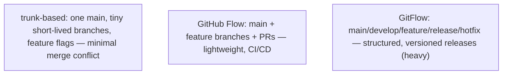

### Trunk-Based Development

Everyone integrates to **one** branch (the trunk/`main`) frequently — feature branches live **hours to a day or two**, then merge. Incomplete work is hidden behind **feature flags** (runtime switches) rather than long-lived branches. The benefit: branches never diverge far from `main`, so merges are tiny and conflicts rare. Favoured by high-velocity teams (Google, many startups) practising continuous integration.

### GitHub Flow

The lightweight default for most web teams: branch off `main`, make changes, open a **pull request**, get it reviewed + CI-checked, merge to `main`, deploy. No `develop` branch, no release branches — `main` is always deployable. Simple and effective for continuous-delivery products.

### GitFlow

A structured model with **`main`** (production), **`develop`** (integration), **`feature`** branches (off `develop`), **`release`** branches (stabilise before a versioned release), and **`hotfix`** branches (urgent fixes off `main`). Designed for **scheduled, versioned releases** (a library, a desktop app). It's **heavy** — lots of branches and ceremony — and has fallen out of favour for continuous-delivery teams, but remains sensible for versioned products with formal release cycles.

> [!TIP]
> **Default to GitHub Flow or trunk-based for most projects.** They keep branches short-lived and `main` deployable. Reach for GitFlow only when you genuinely have scheduled, versioned releases that need stabilisation branches.

## Pull Requests — the Integration Gate

A **pull request** (PR; "merge request" on GitLab) proposes merging one branch into another (typically `feature → main`). It's the **code-review + CI gate** — the checkpoint where a change is reviewed by humans and validated by automation before it reaches the main line:

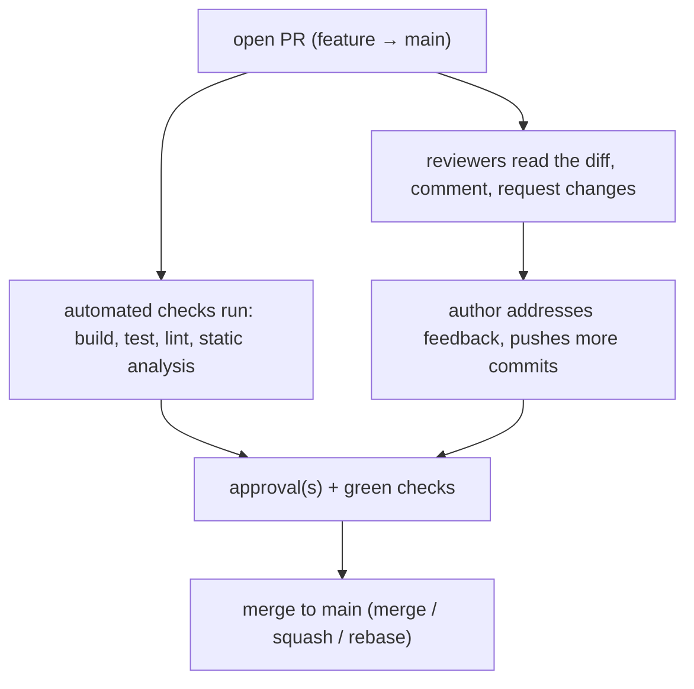

Key elements:

- **Automated checks** (CI) — the build, tests, linters (T06), static analysis (T07), and vulnerability scans (T11) run on the PR; a red check blocks the merge.
- **Code review** — reviewers read the diff and leave comments; the author iterates. This is where knowledge spreads and bugs get caught.
- **Draft PRs** — mark a PR as draft when it's work-in-progress and not ready for review.
- **Branch protection** — rules on `main` requiring N approvals and passing checks before a merge is allowed; often forbidding direct pushes to `main` (everything goes through a PR).

The PR is the **unit of code review** and the **integration point** — the place where "my work" becomes "our work."

## Merge vs Rebase — the Core Distinction

The most-debated Git topic. Both integrate one branch's changes into another; they differ in **what the history looks like afterward**.

### Merge

`git merge feature` (or merging a PR) creates a **merge commit** with **two parents** — joining the two lines of development. History is preserved **exactly as it happened** (non-linear; the branch's commits stay as-is):

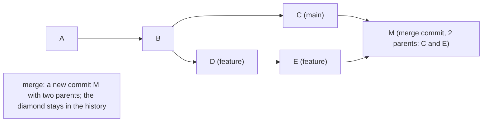

### Rebase

`git rebase main` takes your branch's commits and **replays** them on top of `main`'s current tip — producing a **linear** history. But it **rewrites** the commits: each gets a **new SHA** (because the commit hash is content-addressed and includes the parent — T10 — and the parent changed):

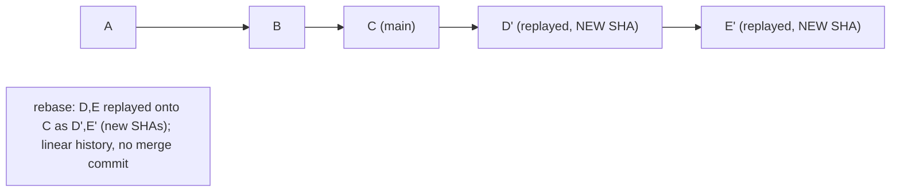

| | Merge | Rebase |
|--|-------|--------|
| History | non-linear (preserves the diamond) | linear (replayed) |
| Merge commit | yes | no |
| Commit SHAs | unchanged | **rewritten (new)** |
| Reflects reality | exactly as it happened | a cleaned-up retelling |
| Safe on shared branches | yes | **no** (rewrites history) |

**Which to use?** It's a team convention. Merge preserves the true history (good for auditability); rebase gives a clean linear history (easier to read, `git log` is a straight line). Many teams rebase *local* feature branches onto `main` before opening a PR (clean), then *merge* the PR (preserve the integration point) — or use squash-merge (next section).

## The Golden Rule of Rebasing

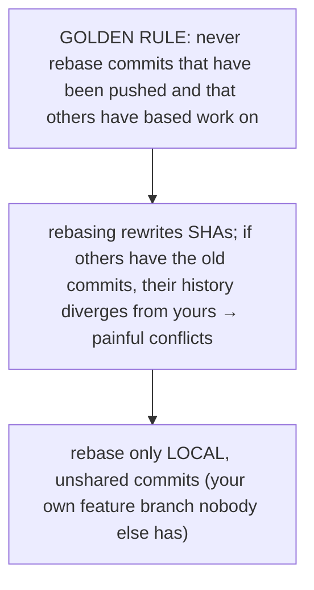

> [!WARNING]
> **Never rebase shared/published history.** Rebasing creates **new commits with new SHAs** and abandons the old ones. If you've pushed those commits and a colleague has fetched them (or branched off them), your rebase makes your history diverge from theirs — and reconciling it is a mess (duplicate commits, conflicts, lost work). **Rebase only your own local, unpushed (or unshared) commits.** For shared history, **merge** (or `revert`) instead.

## Interactive Rebase — Cleaning Up Commits

`git rebase -i <base>` lets you **rewrite your local commits** before sharing them — turn a messy work-in-progress history (`"wip"`, `"fix typo"`, `"actually fix it"`) into clean, logical commits:

```
pick a1b2c3d Add user validation
squash e4f5g6h fix typo            # combine into the previous commit
reword h7i8j9k Add tests           # edit the commit message
drop k1l2m3n debug println         # delete this commit
# reorder lines to reorder commits
```

| Action | Effect |
|--------|--------|
| `pick` | keep the commit as-is |
| `squash`/`fixup` | combine into the previous commit |
| `reword` | edit the commit message |
| `edit` | pause to amend the commit |
| `drop` | delete the commit |
| (reorder lines) | reorder the commits |

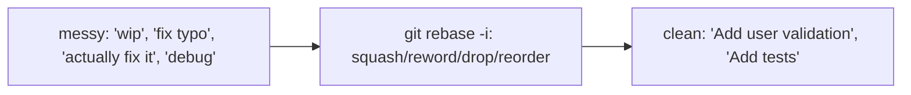

This is the workhorse for preparing a tidy PR. Since it rewrites history, the golden rule applies — only on your own unshared commits.

## Merge Strategies for PRs

When you merge a PR, the platform (GitHub/GitLab) offers three strategies:

| Strategy | Result |
|----------|--------|
| **Merge commit** | a merge commit joining the branch; preserves all the branch's individual commits |
| **Squash-and-merge** | collapses **all** the branch's commits into **one** commit on `main` — clean linear `main`, loses intermediate commits |
| **Rebase-and-merge** | replays the branch's commits onto `main` (linear, no merge commit); preserves individual commits |

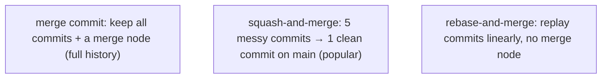

**Squash-and-merge** is popular — it lets developers commit messily on their branch (frequent WIP commits) while keeping `main`'s history clean (one commit per PR/feature). The trade-off: you lose the intermediate commits (sometimes that granularity matters). Pick a team convention and stick to it.

## Resolving Conflicts

When two branches change the **same lines** of the same file, Git can't auto-combine them → a **conflict**.

### The 3-Way Merge

Git resolves merges with a **3-way merge**: it compares the **common ancestor** (base), **your version** (ours), and **their version** (theirs). Changes that don't overlap are merged automatically; **overlapping** changes are conflicts you must resolve by hand:

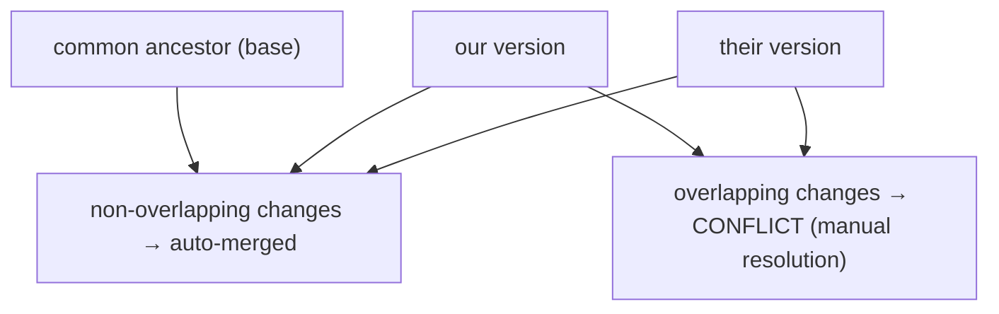

### Conflict Markers

A conflict leaves markers in the file:

```
<<<<<<< HEAD
int timeout = 30;          // our change
=======
int timeout = 60;          // their change
>>>>>>> feature-branch
```

You edit to resolve (keep one, combine, or write something new), **remove the markers**, then `git add` the file and continue (`git merge --continue` or `git rebase --continue`). During a **rebase**, conflicts are resolved **per replayed commit** (potentially several rounds), which can be more tedious than a single merge resolution.

> [!WARNING]
> **Resolve conflicts thoughtfully — don't blindly pick one side.** Blindly taking "ours" or "theirs" can silently drop a colleague's change (or yours). Read both sides, understand the intent, and combine correctly. Test after resolving.

## The Workflow Toolbox

Beyond branch/merge/rebase, a handful of commands handle everyday situations:

| Command | Use |
|---------|-----|
| `git stash` / `stash pop` | shelve uncommitted WIP to switch contexts, then restore |
| `git cherry-pick <commit>` | apply a single commit from another branch onto the current one (new SHA) |
| `git bisect` | **binary-search** for the commit that introduced a bug (mark good/bad; Git checks out the midpoint; test; repeat — O(log n) tests) |
| `git reflog` | a log of where `HEAD` has been — **recover "lost" commits** after a bad rebase/reset |
| `git blame <file>` | annotate each line with the commit that last changed it (who/when/why) |
| `git revert <commit>` | create a **new** commit that undoes a previous one — **safe for shared history** (vs `reset`, which rewrites) |

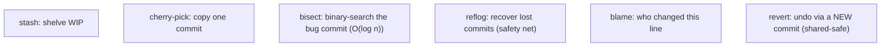

`git bisect` is the standout: to find which of 1000 commits introduced a regression, you test only ~10 (`log₂ 1000`) — the same binary-search efficiency as T14. `git reflog` is the safety net that makes Git forgiving — almost nothing is truly lost until garbage collection.

## Architecture Layer — Branches, Merges, Rebases on the DAG

Tying back to T10's object model, here's what these operations *physically* do.

### A Branch Is a 41-Byte Pointer

A branch is **not** a copy of the code — it's a tiny **ref file** (`.git/refs/heads/feature`) containing a single 40-character commit **SHA** (41 bytes with the newline). Creating a branch **writes 41 bytes** — O(1), instant, regardless of repo size:

```
.git/refs/heads/main      → a1b2c3d4...  (40-char SHA)
.git/refs/heads/feature   → e5f6g7h8...
HEAD                       → ref: refs/heads/feature   (which branch you're on)
```

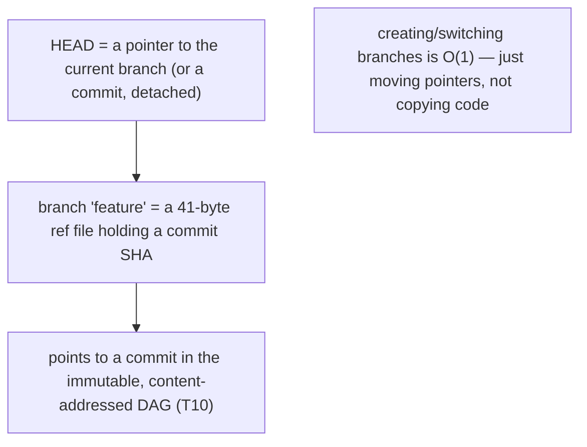

### Merge Creates a Two-Parent Commit; Fast-Forward Just Moves the Pointer

A **merge** creates a new commit with **two parents** (the source and target tips) — the DAG gains a diamond. A **fast-forward** merge is the special case where the target branch is a **direct ancestor** of the source (no divergence) — Git just **moves the branch pointer forward** to the source tip, **no merge commit needed**:

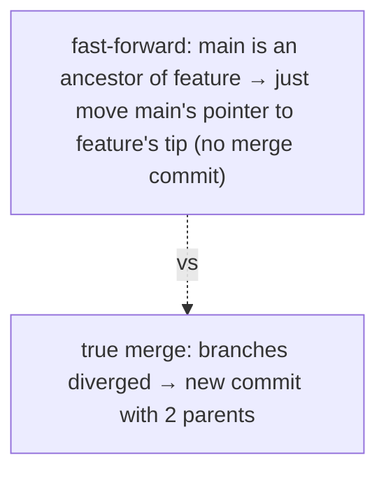

### Rebase Creates New Commits and Orphans the Old Ones

A **rebase** replays your commits onto a new base. Because a commit's SHA is **content-addressed** and **includes its parent** (T10), changing the parent **changes the SHA** — so the replayed commits are **brand-new objects** (`D'`, `E'` with new SHAs). The **old** commits (`D`, `E`) become **orphaned** (nothing points to them) but **still exist in the object store** — recoverable via `git reflog` until **garbage collection** prunes unreachable objects (default: after ~30 days):

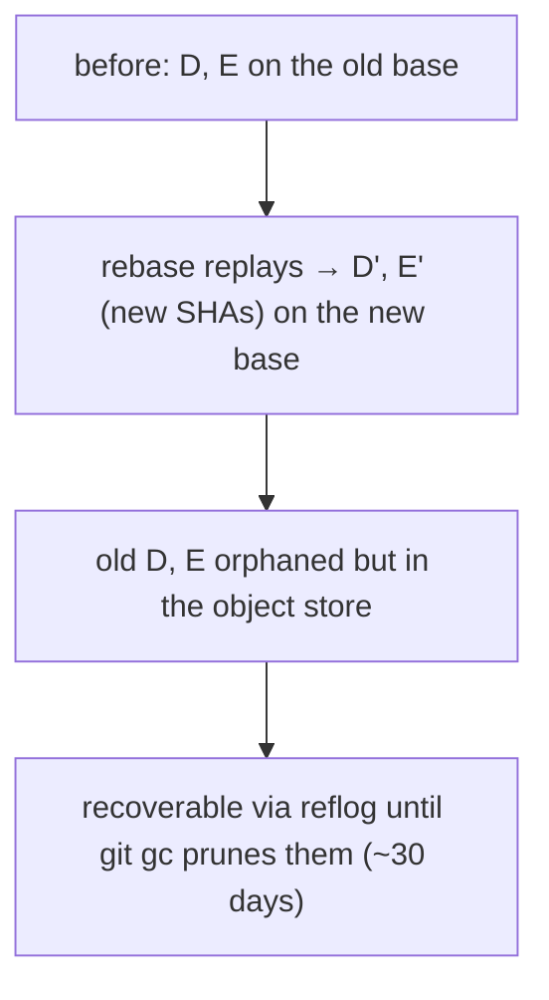

This is the precise meaning of "rewriting history": the DAG is **immutable and content-addressed** (T10) — you **cannot mutate** a commit. "Rewriting" means **creating new commits** and **moving the branch pointer** to them, leaving the originals orphaned. That's why a rebase is recoverable (reflog) and why rebasing *shared* history is dangerous (others still point at the originals).

### 3-Way Merge Operates on Tree Objects

The 3-way merge algorithm compares the **tree objects** (T10 — a tree is a directory snapshot) of the base, ours, and theirs commits, file by file and (within a file) hunk by hunk — auto-merging non-overlapping changes and flagging overlaps. The content-addressed object model makes "find the common ancestor and diff three trees" efficient.

## Common Mistakes

### Rebasing Shared History (the Cardinal Sin)

Rebasing pushed commits that others have based work on diverges histories and causes pain. Rebase only local, unshared commits. (The golden rule.)

### Force-Push Without `--force-with-lease`

After a rebase, you must force-push (the remote has the old commits). A plain `git push --force` **overwrites** whatever's on the remote — including a colleague's pushes you didn't fetch. Use **`git push --force-with-lease`**: it fails if the remote changed since your last fetch, protecting against clobbering others' work.

### Merge vs Rebase Confusion

Merging when you wanted a clean linear history, or rebasing shared branches. Know your team's convention; rebase locally, merge (or squash) shared.

### Giant PRs

A 2000-line PR is unreviewable — reviewers skim, bugs slip through, conflicts pile up. Keep PRs **small and focused** (one logical change) so they're quick to review and merge.

### Long-Lived Branches → Merge Hell

A branch that diverges from `main` for weeks accumulates conflicts and integration risk. Keep branches **short-lived** (trunk-based); rebase/merge `main` in frequently.

### Committing Secrets or Large Files

A committed secret (API key, password) or a large binary is in **history forever** — even after deletion, it's in past commits. Removing it requires rewriting history (`git filter-repo`/BFG) and rotating the secret. Prevent it: `.gitignore` + pre-commit secret scanning (T11).

### Not Pulling Before Pushing

If the remote advanced since your last fetch, your push is **rejected** (non-fast-forward). `git pull` (merge or `--rebase`) to integrate, then push.

### Resolving Conflicts by Blindly Picking a Side

Taking "ours" or "theirs" wholesale can silently drop a real change. Understand both sides; combine correctly; test.

### Working Directly on `main`

No review, no isolation, no CI gate. Branch + PR even for small changes (branch protection should enforce this).

> [!INTERVIEW]
> Git workflow questions are universal in developer interviews.
>
> 1. **Merge vs rebase?** Merge creates a merge commit (two parents, non-linear history, preserves reality); rebase replays commits onto a new base (linear, rewrites SHAs). Rebase only local/unshared commits.
> 2. **What's the golden rule of rebasing?** Never rebase shared/published history — it rewrites SHAs and diverges others' histories.
> 3. **What's a pull request?** A proposal to merge a branch, gated by code review + CI before reaching `main`.
> 4. **Trunk-based vs GitFlow?** Trunk-based: one main, short-lived branches, feature flags (CI/CD). GitFlow: main/develop/feature/release/hotfix (versioned releases, heavier).
> 5. **What's a fast-forward merge?** When the target is a direct ancestor of the source — Git just moves the pointer forward, no merge commit.
> 6. **What's squash-and-merge?** Collapse a branch's commits into one on `main` — clean history, loses intermediate commits.
> 7. **How do you resolve a merge conflict?** Edit the conflict markers (`<<<< ==== >>>>`), keep/combine the right changes, remove markers, `git add`, continue.
> 8. **What's `git bisect`?** Binary search for the commit that introduced a bug — O(log n) tests.
> 9. **What's `git reflog` for?** Recovering "lost" commits (after a bad rebase/reset) — the safety net.
> 10. **`revert` vs `reset`?** `revert` creates a new commit undoing a change (safe for shared history); `reset` moves the branch pointer (rewrites history).
> 11. **What is a branch, physically?** A 41-byte ref file holding a commit SHA — a movable pointer, not a copy.
> 12. **Why does rebase create new SHAs?** A commit's hash is content-addressed and includes its parent; changing the base changes the parent, hence the hash.

## Practice

1. **Feature branch + PR.** Branch off `main`, make a change, push, open a PR (on GitHub/GitLab), observe CI run, get a review, merge.
2. **Merge vs rebase visually.** Create a divergence (commits on `main` and a `feature` branch). Merge one copy; rebase another. Compare `git log --graph` — diamond vs linear.
3. **New SHAs from rebase.** Note a commit's SHA on `feature`; rebase onto `main`; confirm the SHA **changed** (content-addressing + new parent).
4. **Golden rule violation (safe sandbox).** Push a branch; rebase it; force-push; from another clone that had the old commits, observe the divergence pain. (Do this only in a sandbox.)
5. **Interactive rebase cleanup.** Make 4 messy commits (`wip`, `fix`, etc.); `git rebase -i` to squash into 2 clean commits with good messages.
6. **Squash-merge.** Open a PR with several WIP commits; squash-and-merge; confirm `main` has **one** clean commit.
7. **Conflict resolution.** Change the same line on two branches; merge; resolve the conflict markers; confirm the result. Repeat with rebase (per-commit resolution).
8. **Fast-forward.** Branch off `main`, commit, switch to `main`, merge — observe it fast-forwards (no merge commit) because `main` didn't diverge. Then create a divergence and observe a true merge commit.
9. **`git stash`.** Start a change, `git stash`, switch branches, come back, `git stash pop`; confirm the WIP is restored.
10. **`git cherry-pick`.** Apply one commit from another branch onto your current branch; confirm a new commit with the same change (new SHA).
11. **`git bisect`.** Introduce a bug at a known commit; `git bisect start`, mark a good and bad commit; let Git binary-search; confirm it finds the culprit in ~log₂(n) steps.
12. **`git reflog` recovery.** Do a `git reset --hard` that "loses" commits; use `git reflog` to find them; `git reset --hard <reflog-sha>` to recover.
13. **`git blame`.** Run `git blame` on a file; identify who/when/why a specific line was last changed.
14. **`--force-with-lease`.** After a rebase, push with `--force-with-lease`; simulate a remote change and confirm it **fails** (protecting against clobbering), vs plain `--force` which overwrites.
15. **Explain it back.** For a feature branch rebased onto `main` then merged via squash: describe (a) what the rebase did to the commit SHAs and why, (b) where the old commits went (orphaned, reflog-recoverable), (c) why rebasing would be dangerous if a colleague had branched off the feature, (d) what squash-merge produced on `main`, (e) the branch as a 41-byte pointer throughout.

## Recap

You should now be able to:

- Choose a **branching strategy** — **trunk-based** (one `main`, tiny short-lived branches, feature flags — for CI/CD velocity), **GitHub Flow** (`main` + feature branches + PRs — the lightweight default), or **GitFlow** (`main`/`develop`/`feature`/`release`/`hotfix` — for scheduled, versioned releases; heavier).
- Run the **pull-request lifecycle** as the integration gate — open → CI checks (build/test/lint/scan) → code review → address feedback → approval → merge; with **draft PRs** and **branch protection** (required reviews + status checks, no direct pushes to `main`).
- Distinguish **merge** (creates a merge commit with two parents; preserves history non-linearly) from **rebase** (replays commits onto a new base; linear history but **rewrites SHAs**); apply the **golden rule** — never rebase shared/published history; rebase only local, unshared commits.
- Use **interactive rebase** (`rebase -i`: squash/reword/reorder/drop/edit) to clean up local commits before sharing.
- Choose a **PR merge strategy** — merge commit (full history), **squash-and-merge** (one clean commit per feature; loses intermediates), or rebase-and-merge (linear).
- **Resolve conflicts** via the **3-way merge** (base/ours/theirs; non-overlapping auto-merged, overlaps flagged); edit the **conflict markers** (`<<<< ==== >>>>`), keep/combine correctly, `git add`, continue — and never blindly pick a side.
- Use the **toolbox** — `git stash` (shelve WIP), `cherry-pick` (copy a commit), `bisect` (binary-search the bug commit, O(log n), T14), `reflog` (recover lost commits — the safety net), `blame` (who/when/why a line), `revert` (undo via a new commit — safe for shared history, vs `reset`).
- Describe the **architecture** (tying back to T10): a **branch is a 41-byte pointer** (creating/switching is O(1), not a copy); a **merge** creates a two-parent commit (the DAG gains a diamond), or **fast-forwards** (just moves the pointer) when there's no divergence; a **rebase** creates **new commits with new SHAs** (content-addressing includes the parent) and **orphans** the old ones (reflog-recoverable until GC); "rewriting history" means the immutable, content-addressed DAG can't be mutated, so you create new commits and move the pointer.
- Avoid the **common traps**: rebasing shared history, force-push without `--force-with-lease`, merge-vs-rebase confusion, giant PRs, long-lived branches (merge hell), committing secrets/large files (in history forever), not pulling before pushing, blindly resolving conflicts, working directly on `main`.

## Next

Continue to [Code formatters & linters (Checkstyle, Spotless)](./T06-code-formatters-and-linters-checkstyle-spotless.md).
