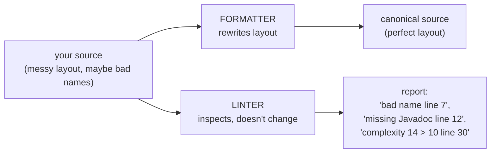
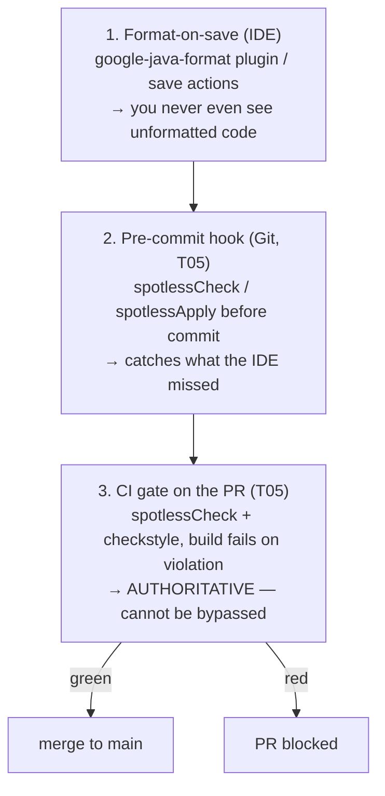
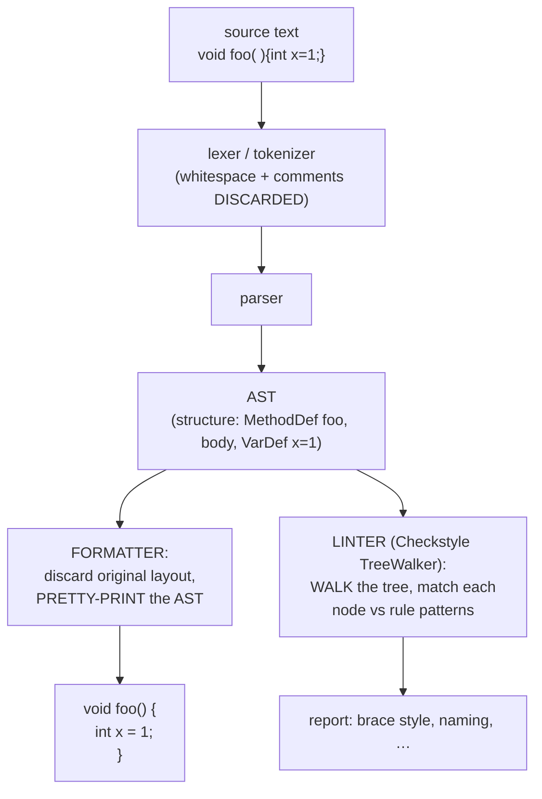

# Code formatters & linters (Checkstyle, Spotless)

Code style — naming, indentation, line length, Javadoc — is *for humans*, and it has **zero effect on what the program does** ([L0/C02/T19](../../L0-foundations/C02-java-core/T19-comments-javadoc-and-code-style.md)). T19 defined the *rules*; this topic is about **automating their enforcement** so a team never argues about a brace position in code review again. Two categories of tool do this. **Formatters** (google-java-format, Spotless) *rewrite* your code into one canonical layout — there's nothing to debate because the machine decides. **Linters / style-checkers** (Checkstyle) *read* your code and *report* deviations a formatter can't fix — bad names, missing Javadoc, excessive complexity. Wire both into the build and the developer workflow and style becomes invisible: code is consistent, and reviewers spend their attention on *logic*, not whitespace.

The depth-bar isn't just "run the plugin." At the **language** layer: the **formatter-vs-linter distinction** (rewrite vs report); the concrete tools (**google-java-format**'s opinionated non-configurability, **Spotless** as the build-side orchestrator with **`spotlessApply`** vs **`spotlessCheck`**, **Checkstyle**'s XML rulesets); and the **three-gate workflow** (format-on-save → pre-commit → CI verify). At the **architecture** layer: both tools run the **same front-end as a compiler** — **lexer → parser → AST** ([L0/C01/T03](../../L0-foundations/C01-cs-foundations/T03-what-is-a-programming-language-compiled-vs-interpreted.md)) — a formatter discards your layout and **pretty-prints the AST** back out; a linter **walks the AST** matching each node against rule patterns. And the payoff fact: because the **lexer throws whitespace and comments away**, formatting changes **nothing** about the emitted **bytecode** — a formatted and an unformatted file compile to **byte-identical `.class` files** (T19). These are **build-time** tools (Gradle/Maven tasks), **cached and incremental** ([L2/C02/T02](./T02-gradle-tasks-build-scripts-dependencies.md)), gated in **CI** on the PR ([L2/C02/T05](./T05-git-workflows-branching-prs-rebasing.md)) — and they never ship in your JAR.

> [!NOTE]
> Prerequisites: [Comments, Javadoc & code style](../../L0-foundations/C02-java-core/T19-comments-javadoc-and-code-style.md) (L0/C02/T19) — **the style rules being enforced, and that style has zero runtime effect**; [What is a programming language — compiled vs interpreted](../../L0-foundations/C01-cs-foundations/T03-what-is-a-programming-language-compiled-vs-interpreted.md) (L0/C01/T03) — **the lexer → parser → AST front-end** both tools reuse; [Gradle](./T02-gradle-tasks-build-scripts-dependencies.md) (L2/C02/T02) — these are **build tasks**, cached and bound to `check`; [Git workflows](./T05-git-workflows-branching-prs-rebasing.md) (L2/C02/T05) — the **pre-commit hook** and **CI/PR gate** that enforce them, and `git blame`.

## Why Automate Style at All?

Style debates are the textbook example of **bikeshedding** — teams burn disproportionate energy arguing trivial, low-stakes choices (tabs vs spaces, brace placement) precisely *because* everyone has an opinion and the cost of being wrong is nil. Three concrete costs of *not* automating:

- **Review noise.** "Add a space here", "wrap this line", "rename `x`" — comments about layout drown out comments about *correctness*. Every one is a round-trip that slows the PR ([T05](./T05-git-workflows-branching-prs-rebasing.md)).
- **Drift.** Without enforcement, every developer's IDE settings differ; the codebase becomes a patchwork; diffs are polluted by reformatting churn.
- **It doesn't scale.** Manual style review is O(reviewers × changes). A machine does it in milliseconds, deterministically, for free.

The fix: let a **tool** own style. Make it **non-negotiable** (the build fails if you violate it) and **automatic** (your editor fixes it on save). Then style simply *is*, and humans never discuss it.

> [!TIP]
> The single best argument for an **opinionated** formatter (one with no configuration) is that it ends the debate *permanently*. There is no team meeting about config because there is no config. The style might not be everyone's favourite — but a consistent style nobody loves beats five inconsistent styles everyone fights about.

## Formatters vs Linters — the Core Distinction

These two words get used loosely; the distinction is sharp and worth nailing down:

| | **Formatter** | **Linter / style-checker** |
|---|---|---|
| **Action** | **Rewrites** code to a canonical layout | **Reads** code, **reports** deviations |
| **Fixes for you?** | Yes — it *is* the fix | No (mostly) — you fix manually |
| **Scope** | Layout: whitespace, wrapping, import order, blank lines | Names, Javadoc presence, complexity, magic numbers, braces policy + layout it can *flag* |
| **Configurable?** | Often deliberately **not** (google-java-format) | Yes — XML/DSL rulesets (Checkstyle) |
| **Java examples** | google-java-format, palantir-java-format, Spotless (orchestrator) | Checkstyle (style); PMD/SpotBugs (bugs → [T07](./T07-static-analysis-pmd-spotbugs-sonarqube.md)) |
| **Analogy (JS/Python)** | Prettier, Black | ESLint, Flake8 |

The one-line mental model: **a formatter *writes*, a linter *reads*.**



They are **complementary, not competitors**. A formatter eliminates an entire *class* of review comments (every layout nit, gone). But a formatter can't tell you a method is named `processData2` instead of something meaningful, or that it has no Javadoc, or that it's 200 lines long — those need a **linter**. The standard setup is **both**: a formatter for layout (auto-fixed, invisible) **plus** a linter for the structural/semantic rules a formatter has no opinion on.

> [!IMPORTANT]
> There is **overlap**: Checkstyle *can* check `LineLength` or indentation. But it only **reports** — it won't wrap the line for you. So don't make Checkstyle police layout that a formatter already guarantees; that's redundant and a frequent source of [conflicting configs](#common-mistakes). Let the **formatter own layout**; let the **linter own everything layout can't express** (naming, Javadoc, complexity).

## Formatters — google-java-format, palantir, and Spotless

### google-java-format

Google's formatter implements the [Google Java Style Guide](https://google.github.io/styleguide/javaguide.html). Its defining trait is being **almost entirely non-configurable** — there is effectively *one* knob (2-space Google style vs 4-space AOSP style) and nothing else. You don't choose where braces go or how lines wrap; the tool decides, the same way, every time. That's a **feature**: deterministic output and zero bikeshedding. **palantir-java-format** is a popular fork with a more readable multi-line/fluent-call layout, but the same opinionated philosophy.

### Spotless — the Build-Side Orchestrator

**Spotless** is *not itself a formatter*. It's a **Gradle/Maven plugin** that **orchestrates** formatting steps as part of the build. You tell Spotless *which* formatter to delegate to (google-java-format, palantir, Eclipse) plus a chain of simple fixers (trim trailing whitespace, ensure a final newline, enforce import order, insert a license header). It exposes **two tasks** — and the distinction between them is the single most important thing in this topic:

| Task | What it does | Where you run it |
|------|--------------|------------------|
| **`spotlessApply`** | **Rewrites** your files to be compliant — *the fix* | Locally, in the IDE, in pre-commit |
| **`spotlessCheck`** | **Verifies** compliance; **fails the build** if any file is non-compliant — *the gate* | In CI, bound to `check` |

`spotlessCheck` is automatically wired into Gradle's **`check`** task ([T02](./T02-gradle-tasks-build-scripts-dependencies.md)), so a plain `gradle build` runs it. A minimal Gradle config:

```groovy
plugins { id 'com.diffplug.spotless' version '6.25.0' }

spotless {
  java {
    googleJavaFormat('1.19.2')   // delegate to google-java-format
    importOrder()                // canonical import ordering
    removeUnusedImports()
    trimTrailingWhitespace()
    endWithNewline()
    licenseHeaderFile('config/license-header.txt')
  }
}
// `gradle spotlessApply` rewrites; `gradle spotlessCheck` (and `gradle build`) verifies.
```

> [!WARNING]
> **Never run `spotlessApply` in CI.** CI's job is to **verify and fail** (`spotlessCheck`), not to silently rewrite. If CI runs `spotlessApply`, every build "passes" by reformatting on the server — hiding the fact that the committed code was non-compliant, and (if it commits the result back) fighting the developer's next push. CI gates; it does not fix. Fixing happens on the developer's machine.

## Linters / Style-Checkers — Checkstyle

**Checkstyle** is the canonical Java style-checker. You feed it an **XML ruleset**, and it inspects your source against those rules, emitting a violation report and (optionally) **failing the build** above a severity/count threshold. It enforces exactly the rules T19 described — and many more a formatter has no concept of:

- **Naming** — `camelCase` methods/fields, `CONSTANT_CASE` statics, `PascalCase` types (T19).
- **Javadoc** — require Javadoc on public methods/classes; validate `@param`/`@return` (T19).
- **Structure & complexity** — cyclomatic complexity ceilings, method/file length limits, parameter counts, magic numbers, nesting depth.
- **Conventions** — import order, no star imports, brace policy, whitespace rules (overlapping with formatters — see above).

You usually start from a **published ruleset** — `google_checks.xml` or `sun_checks.xml` ship with Checkstyle — and trim. A ruleset is a **tree of `<module>` elements**: the root **`Checker`**, a **`TreeWalker`** (which parses each file to an AST and drives the per-node checks), and individual check modules nested under it:

```xml
<module name="Checker">
  <module name="LineLength"><property name="max" value="100"/></module>
  <module name="TreeWalker">
    <module name="MethodName"/>                <!-- ^[a-z][a-zA-Z0-9]*$ -->
    <module name="ConstantName"/>              <!-- ^[A-Z][A-Z0-9_]*$ -->
    <module name="MissingJavadocMethod"/>      <!-- public methods need Javadoc -->
    <module name="CyclomaticComplexity">
      <property name="max" value="10"/>
    </module>
    <module name="MagicNumber"/>
    <module name="NeedBraces"/>                 <!-- always brace if/for/while -->
  </module>
</module>
```

Wire it into Gradle with the built-in `checkstyle` plugin (it too binds into `check`):

```groovy
plugins { id 'checkstyle' }
checkstyle {
  toolVersion = '10.17.0'
  configFile = file('config/checkstyle/checkstyle.xml')
  maxWarnings = 0          // fail the build on any violation
}
```

> [!TIP]
> **Checkstyle flags; a formatter fixes.** Checkstyle can tell you a line is too long; google-java-format will *wrap* it. So don't make Checkstyle the layout police — point it at what formatters can't express (names, Javadoc, complexity, magic numbers) and let the formatter own whitespace and wrapping. (For deeper *bug* detection — null-derefs, resource leaks — you want PMD/SpotBugs, the subject of [T07](./T07-static-analysis-pmd-spotbugs-sonarqube.md).)

## The Workflow — Format-on-Save → Pre-commit → CI

Enforcement works best as **three gates**, each catching what the previous missed, funnelling toward one authoritative check ([T05](./T05-git-workflows-branching-prs-rebasing.md)):



1. **Format-on-save (IDE).** Install the google-java-format plugin (or configure save actions) so every save reformats. The developer literally never produces unformatted code. Instant, frictionless — but local-only and easy to forget to set up.
2. **Pre-commit hook (Git, [T05](./T05-git-workflows-branching-prs-rebasing.md)).** A Git hook runs `spotlessCheck` (or auto-`spotlessApply`) before the commit is created, blocking a non-compliant commit. Catches the developer who didn't configure their IDE. Still bypassable (`git commit --no-verify`), so it's a convenience, not the law.
3. **CI gate on the PR ([T05](./T05-git-workflows-branching-prs-rebasing.md)).** The PR's CI pipeline runs `spotlessCheck` + `checkstyle`. If anything is non-compliant, the build is **red** and **branch protection** blocks the merge. This is the **only authoritative gate** — it runs on a server, can't be skipped, and is the same for everyone. The first two gates exist to make sure this one is *never red by surprise*.

> [!IMPORTANT]
> The golden rule mirrors the Spotless task split: **the developer's machine *fixes* (`spotlessApply`); CI *verifies* (`spotlessCheck`) and *fails*.** The first two gates fix; the third only judges. Never invert it.

## Memory & Architecture Layer — How They Actually Work

Both formatters and linters are **source-code processors**, and they run the **exact front-end you met in [L0/C01/T03](../../L0-foundations/C01-cs-foundations/T03-what-is-a-programming-language-compiled-vs-interpreted.md)** — the same first stages a compiler uses:



- **A formatter parses to an AST, throws away your layout entirely, and *pretty-prints* the AST back to text** using its canonical rules. This is *why* it's deterministic, why it can't be "partially" applied, and why it **erases manual alignment** — the formatter never sees your carefully aligned columns; only the *structure* (the AST) survives the parse, and it regenerates layout from structure alone.
- **A linter parses to an AST and *walks* the tree**, matching each node against rule patterns: "a `MethodDef` whose name fails `^[a-z][a-zA-Z0-9]*$`" → naming violation; "a method whose decision-point count exceeds 10" → complexity violation. Checkstyle's **`TreeWalker`** module is literally an AST walker that dispatches each node to the registered check modules.

### Zero Runtime Impact — Bytecode Is Byte-Identical

This is the fact that ties the whole topic back to T19. The **lexer discards whitespace and comments** — they are *not tokens*, they never reach the AST's semantic content, and they never reach **bytecode**. Therefore:

> A file and its reformatted twin compile to **byte-identical `.class` files**. Formatting changes **nothing** the JVM ever sees.

You can prove it: format a file two different ways, run `javac` on each, and `diff` the `.class` outputs (or compare `javap -c -p`) — **identical**. Style is *exclusively* a human concern (T19); the machine erased it before code generation even began. (Comments *can* be retained by tools for Javadoc/annotation processing, but they are not executable and don't alter bytecode semantics.) This is also why formatting/linting is **safe to apply at any time** — it can never change behaviour, only text.

### Build-Time Cost, Cached and Incremental

Spotless and Checkstyle are **build tasks** — Gradle plugin tasks / Maven plugin goals bound into the `check` lifecycle ([T02](./T02-gradle-tasks-build-scripts-dependencies.md)). They add a few seconds to a cold build, but Gradle's **incremental build + build cache** ([T02](./T02-gradle-tasks-build-scripts-dependencies.md)) declare the source files **and** the config as task inputs — so on a warm build with unchanged inputs the tasks are **`UP-TO-DATE`** and skipped entirely. The cost is therefore *near-zero* in the steady state. And it's **build-time only**: these tools run on the **developer machine** (IDE/pre-commit) and the **CI runner** ([T05](./T05-git-workflows-branching-prs-rebasing.md)) — **never at runtime, never shipped in the JAR**. There is no production footprint whatsoever.

> [!TIP]
> Adopting a formatter on a **legacy** codebase? Don't sprinkle reformatting through feature PRs — do the whole reformat in **one dedicated commit**, then add that commit's SHA to a **`.git-blame-ignore-revs`** file so `git blame` ([T05](./T05-git-workflows-branching-prs-rebasing.md)) skips it. Otherwise the reformat shows up as "the last person to touch every line", destroying blame's archaeology. On a **new** codebase, turn the formatter on at commit 1 and the problem never exists.

## Common Mistakes

### Confusing Formatter and Linter

Expecting Checkstyle to *fix* your layout (it only reports), or expecting google-java-format to catch a bad method name (it only does layout). They do different jobs — use **both**, each for what it's good at.

### Running `spotlessApply` in CI Instead of `spotlessCheck`

CI then "passes" by rewriting on the server, **hiding** that the committed code was non-compliant — and may fight the developer's next push. CI must run **`spotlessCheck`** and **fail**. Fixing is a local concern.

### Not Enforcing in CI at All

Relying on the IDE and goodwill. Someone's editor isn't configured, style drifts, and the "standard" is fiction. Only the **CI gate** is authoritative — it can't be bypassed ([T05](./T05-git-workflows-branching-prs-rebasing.md) branch protection). The IDE and pre-commit gates are conveniences; CI is the law.

### A Giant Reformat Buried in a Feature PR

Mixing a whole-file reformat with a logic change makes the diff **unreviewable** (the real change is lost in 500 lines of whitespace) and causes conflicts for everyone. Do the reformat in its **own commit/PR**, and use `.git-blame-ignore-revs`.

### Formatter ↔ Checkstyle Config Conflict

Checkstyle's `LineLength max=80` while the formatter wraps at 100 → **every** build fails, forever, no matter what the developer does (the two tools demand contradictory things). **Align the configs** (or, better, let the formatter own line length and don't have Checkstyle check it).

### Over-Configuring Checkstyle

Hundreds of bespoke rules nobody agreed to → so much noise the team learns to ignore the report, defeating the point. **Start from `google_checks.xml`** and trim to what the team actually cares about.

### Fighting the Formatter

Turning it off for "special" sections, or hand-aligning code the formatter will undo on the next save. The formatter is deterministic and regenerates layout from the AST — your manual alignment **cannot survive**. Write code that reads well *after* formatting; don't fight the tool.

### Treating Linter Warnings as Optional

A warning nobody ever fixes is just noise that trains people to ignore *all* warnings. Either **enforce** the rule (fail the build, `maxWarnings = 0`) or **remove** it. A rule with no teeth is worse than no rule.

> [!INTERVIEW]
> Formatter/linter questions probe whether you understand the *toolchain* and the *mechanism* — not just that you've seen a green check.
>
> 1. **Formatter vs linter?** A formatter **rewrites** code to a canonical layout (google-java-format); a linter **reads** code and **reports** deviations and some patterns (Checkstyle). Write vs read — and you typically use both.
> 2. **What is Spotless, and `spotlessApply` vs `spotlessCheck`?** A build plugin that *orchestrates* formatters + simple fixers. `spotlessApply` **rewrites** files (the fix); `spotlessCheck` **verifies** and **fails the build** (the gate, bound to `check`).
> 3. **Why is google-java-format deliberately non-configurable?** To kill bikeshedding — no config means no debate; output is deterministic and identical for everyone.
> 4. **What does Checkstyle catch that a formatter can't?** Naming conventions, Javadoc presence, cyclomatic complexity, magic numbers, parameter counts — structural/semantic rules, not just layout.
> 5. **Should CI run `spotlessApply` or `spotlessCheck`?** **Check** — CI must verify and fail, never silently rewrite (which hides non-compliance).
> 6. **Do formatters or linters change the bytecode?** **No.** The lexer discards whitespace/comments before code generation, so a formatted and an unformatted file produce **byte-identical `.class`** files. Style is purely for humans (T19).
> 7. **How does a formatter work internally?** Parse source to an **AST** (lexer → parser, [L0/C01/T03](../../L0-foundations/C01-cs-foundations/T03-what-is-a-programming-language-compiled-vs-interpreted.md)), discard the original layout, then **pretty-print** the AST using canonical rules.
> 8. **How does a linter work internally?** Parse to an AST and **walk the tree**, matching each node against rule patterns — exactly what Checkstyle's **`TreeWalker`** does.
> 9. **Where do you enforce style in the workflow?** Three gates: **format-on-save** (IDE) → **pre-commit hook** (Git) → **CI gate** on the PR (authoritative, can't be bypassed — [T05](./T05-git-workflows-branching-prs-rebasing.md)).
> 10. **How do you adopt a formatter on a legacy codebase without wrecking `git blame`?** Reformat in **one dedicated commit** and add its SHA to **`.git-blame-ignore-revs`** so blame skips it.
> 11. **What's the build-time cost?** A few seconds cold; **near-zero warm** because the tasks are cached/incremental (inputs = sources + config, [T02](./T02-gradle-tasks-build-scripts-dependencies.md)). **No runtime cost** — build-time only, never in the JAR.
> 12. **Checkstyle vs PMD/SpotBugs?** Checkstyle = **style** + simple patterns (works on the source AST). PMD/SpotBugs = deeper **bug** detection (PMD on the AST, SpotBugs on **bytecode**) — covered in [T07](./T07-static-analysis-pmd-spotbugs-sonarqube.md).

## Practice

1. **Add Spotless.** Add the Spotless plugin + `googleJavaFormat` to a Gradle build; run `gradle spotlessApply`; watch a messy file get reformatted.
2. **Check vs Apply.** Deliberately misformat a file; run `gradle spotlessCheck` and watch the **build fail**; fix it with `spotlessApply`; confirm `spotlessCheck` now passes.
3. **Bound to `check`.** Run plain `gradle build` and confirm `spotlessCheck` runs as part of `check` ([T02](./T02-gradle-tasks-build-scripts-dependencies.md)).
4. **Prove bytecode is identical.** Format a file two different ways (different whitespace/wrapping), `javac` both, and `diff` the `.class` files (or compare `javap -c -p`). Confirm **byte-identical** — the lexer erased the difference.
5. **Add Checkstyle.** Wire the `checkstyle` plugin with `google_checks.xml`; run it; read the violation report.
6. **Custom rule.** Add a `MethodName` regex and a `MagicNumber` check to a custom ruleset; trigger each violation, then fix it.
7. **Division of labour.** Write code with both a too-long line *and* a bad method name. Confirm the **formatter** fixes the line but **not** the name, and **Checkstyle** flags the name — demonstrating who owns what.
8. **Format-on-save.** Install the google-java-format plugin in IntelliJ; enable format-on-save; confirm files reformat as you save.
9. **Pre-commit hook.** Add a Git pre-commit hook ([T05](./T05-git-workflows-branching-prs-rebasing.md)) running `spotlessCheck`; try to commit a misformatted file and watch the hook **block** it; then bypass with `--no-verify` and note that it's bypassable (hence not authoritative).
10. **CI gate.** Add a CI job (the PR gate, [T05](./T05-git-workflows-branching-prs-rebasing.md)) running `spotlessCheck` + `checkstyle`; open a PR with a violation and watch CI go **red** and block the merge.
11. **The CI anti-pattern.** Misconfigure CI to run `spotlessApply`; observe it "passes" by rewriting; explain why that's wrong (hides violations) and switch it to `spotlessCheck`.
12. **Blame-friendly reformat.** Reformat a legacy file in one commit; add the SHA to `.git-blame-ignore-revs`; run `git blame` and confirm it **skips** the reformat commit ([T05](./T05-git-workflows-branching-prs-rebasing.md)).
13. **Config conflict.** Set Checkstyle `LineLength max=80` but a formatter wrapping at 100; watch the **perpetual** build failure; reconcile by removing the Checkstyle line-length check (let the formatter own it).
14. **Caching.** Run a clean build, then re-run with no source changes; confirm the Spotless/Checkstyle tasks report **`UP-TO-DATE`** (cached, [T02](./T02-gradle-tasks-build-scripts-dependencies.md)).
15. **Explain it back.** For `void  foo( ){int x=1;}` trace: (a) the **formatter** — parse → AST → pretty-print → `void foo() { int x = 1; }`; (b) **Checkstyle** — parse → AST → `TreeWalker` walks → reports brace/naming findings; (c) the **compiler** — the same lexer discards the extra spaces, so the bytecode is identical to the formatted version's; (d) **where** each runs in the IDE → pre-commit → CI workflow.

## Recap

You should now be able to:

- Distinguish a **formatter** (rewrites code to a canonical layout — google-java-format, palantir; the fix) from a **linter / style-checker** (reads and reports deviations + simple patterns — Checkstyle; the report), and explain why you use **both**.
- Explain **google-java-format**'s deliberate **non-configurability** as a feature (deterministic output, no bikeshedding), and use **Spotless** as the build-side **orchestrator** with **`spotlessApply`** (rewrite/fix) vs **`spotlessCheck`** (verify/gate, bound to `check`).
- Configure **Checkstyle** with an **XML ruleset** (`Checker` → `TreeWalker` → check modules) to enforce the T19 rules — naming, Javadoc presence, complexity, magic numbers — and start from `google_checks.xml` rather than hand-rolling hundreds of rules.
- Enforce style through the **three-gate workflow** — **format-on-save** (IDE, frictionless) → **pre-commit hook** (Git, convenience) → **CI gate** on the PR (authoritative, unbypassable, [T05](./T05-git-workflows-branching-prs-rebasing.md)) — with the rule that the **developer fixes (`apply`) and CI verifies (`check`)**.
- Describe the **architecture**: both tools run the **lexer → parser → AST** front-end ([L0/C01/T03](../../L0-foundations/C01-cs-foundations/T03-what-is-a-programming-language-compiled-vs-interpreted.md)); a formatter **discards layout and pretty-prints the AST**; a linter **walks the AST** matching rule patterns (`TreeWalker`).
- State the key fact: because the **lexer discards whitespace and comments**, formatting produces **byte-identical bytecode** — zero runtime impact (T19); and that these are **build-time** tools, **cached/incremental** ([T02](./T02-gradle-tasks-build-scripts-dependencies.md)), **never shipped** in the JAR.
- Avoid the **common traps**: formatter/linter confusion, running `spotlessApply` in CI, not enforcing in CI at all, burying a reformat in a feature PR, formatter↔Checkstyle config conflicts, over-configuring Checkstyle, fighting the formatter, and ignored warnings.

## Next

Continue to [Static analysis (PMD, SpotBugs, SonarQube)](./T07-static-analysis-pmd-spotbugs-sonarqube.md).
