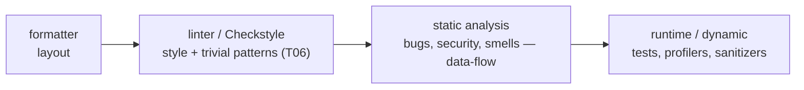
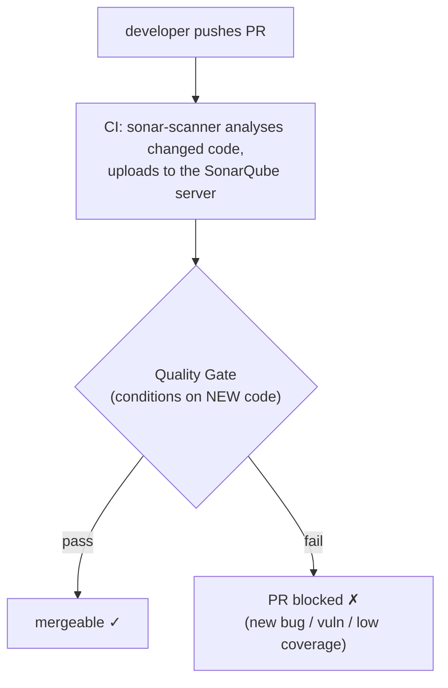
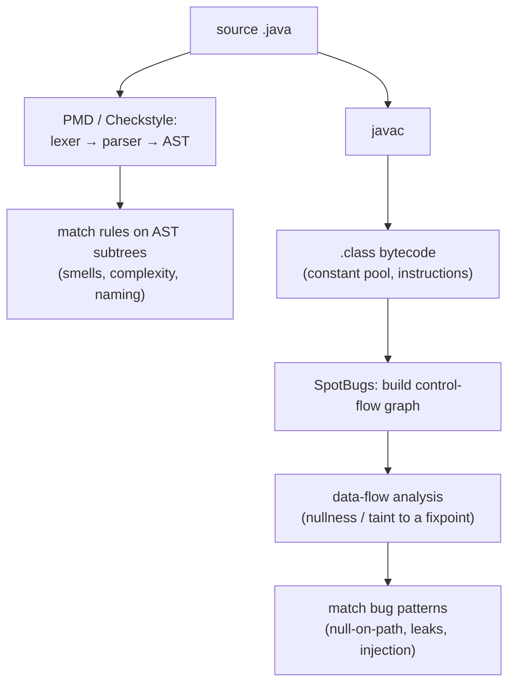
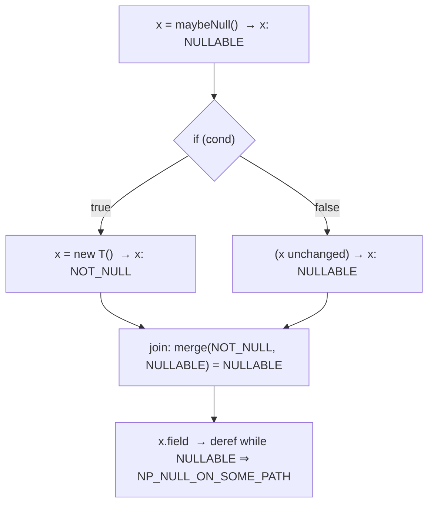

# Static analysis (PMD, SpotBugs, SonarQube)

Formatters and linters ([T06](./T06-code-formatters-and-linters-checkstyle-spotless.md)) police *style* — layout, naming, Javadoc. **Static analysis** is the tier above: inspecting code **without running it** to find real **bugs**, **code smells**, and **security vulnerabilities** — a null that can reach a dereference, a stream never closed on an exception path, a user-controlled string flowing into a SQL query. Three tools dominate the Java world, and the interesting thing is that they work on **different substrates**: **PMD** parses your **source** into an AST and matches smell patterns; **SpotBugs** analyses the **compiled bytecode** with **data-flow analysis** to find deeper bug patterns; **SonarQube** is the **platform** that aggregates analysers, tracks quality over time, and enforces a **quality gate** on every pull request. Wire them into CI and a whole class of defects is caught at build time, before the code ever runs.

The depth-bar goes past "add the plugin." At the **language** layer: where static analysis sits on the spectrum (formatter → linter → static analysis → runtime testing); what **PMD**, **SpotBugs** (+ **FindSecBugs**), and **SonarQube** each find; **false positives** and how to suppress them; the **quality gate** and **"clean as you code."** At the **architecture** layer: the **source-AST-vs-bytecode** distinction (why SpotBugs reads `.class` files — [L0/C01/T04](../../L0-foundations/C01-cs-foundations/T04-source-to-bytecode-to-jvm-to-machine-code.md) — and catches what a source matcher can't); **data-flow analysis** over a **control-flow graph** (tracking nullness/taint to a fixpoint); and the deep reason false positives and false negatives are *unavoidable* — by **Rice's theorem / the halting problem**, non-trivial program properties are **undecidable**, so every analyser **approximates**, trading **soundness** against **completeness**. Like formatting, it's all **build-time** — zero runtime footprint, nothing ships in the JAR.

> [!NOTE]
> Prerequisites: [Code formatters & linters](./T06-code-formatters-and-linters-checkstyle-spotless.md) (L2/C02/T06) — **the linter tier this builds on, and the lexer→parser→AST front-end**; [Source → bytecode → JVM → machine code](../../L0-foundations/C01-cs-foundations/T04-source-to-bytecode-to-jvm-to-machine-code.md) (L0/C01/T04) — **the `.class`/constant pool/bytecode SpotBugs analyses**; [What is a programming language — compiled vs interpreted](../../L0-foundations/C01-cs-foundations/T03-what-is-a-programming-language-compiled-vs-interpreted.md) (L0/C01/T03) — **the AST PMD walks**; [Git workflows](./T05-git-workflows-branching-prs-rebasing.md) (L2/C02/T05) — the **CI/PR gate** that enforces the quality gate.

## The Static-Analysis Spectrum

**Static** analysis examines code **without executing it**; **dynamic** analysis observes a *running* program (tests, profilers, sanitizers, fuzzers). Static analysis trades completeness for **earliness** — it runs at build time and needs no test data, but it can't see runtime-only facts (actual inputs, config, which branch really executes). Tooling forms a ladder of increasing semantic depth:



A linter ([T06](./T06-code-formatters-and-linters-checkstyle-spotless.md)) matches **surface** patterns ("method name is wrong", "line too long"). Static analysis goes deeper: it reasons about **what values flow where** — that a variable is null on *some* path reaching a dereference, that a resource isn't closed on *every* path, that untrusted input reaches a sensitive sink. That reasoning is what separates "a bug finder" from "a style checker."

## PMD — Source-AST Smell Detection

**PMD** parses your **source** into an AST (the same lexer→parser front-end as a compiler — [L0/C01/T03](../../L0-foundations/C01-cs-foundations/T03-what-is-a-programming-language-compiled-vs-interpreted.md), [T06](./T06-code-formatters-and-linters-checkstyle-spotless.md)) and runs **rules** that match AST subtrees. It's strong on *smells, complexity, and questionable constructs*:

- **Dead/wasteful code** — empty `catch`/`if`/`while`, unused locals/parameters/private methods, unnecessary boxing.
- **Complexity & design** — high cyclomatic/NPath complexity, God classes, long methods, deep nesting, `switch` without `default`.
- **Error-prone constructs** — assignment in a condition, comparing strings with `==`, confusing ternaries.

Rules are grouped into **categories** (Best Practices, Code Style, Design, Documentation, Error Prone, Multithreading, Performance, Security), selected via an XML ruleset (like Checkstyle); custom rules are written as **XPath over the AST** or in Java. PMD also bundles **CPD** (the **Copy-Paste Detector**) — it tokenizes the codebase and finds duplicated blocks, a real maintainability smell that no per-file rule can see.

```groovy
plugins { id 'pmd' }
pmd {
  toolVersion = '7.0.0'
  ruleSetFiles = files('config/pmd/ruleset.xml')
  consoleOutput = true
}
// binds pmdMain/pmdTest into `check`; fails the build above the priority threshold
```

> [!NOTE]
> PMD and Checkstyle overlap (both parse source to an AST and run rules), but they lean different ways: **Checkstyle owns *style/format conventions*** (naming, Javadoc, whitespace — [T06](./T06-code-formatters-and-linters-checkstyle-spotless.md)); **PMD owns *smells, complexity, and design***. Many teams run both, or consolidate into SonarQube's ruleset.

## SpotBugs — Bytecode Bug-Pattern Detection

**SpotBugs** (the maintained successor to **FindBugs**) is the one that's *different*: it analyses **compiled bytecode** — the `.class` files — **not source**. It therefore runs **after** `compileJava`, and it sees exactly what the compiler produced: the **constant pool**, the real `invokevirtual`/`getfield`/`ifnull` instructions, the actual control flow ([L0/C01/T04](../../L0-foundations/C01-cs-foundations/T04-source-to-bytecode-to-jvm-to-machine-code.md)).

Why bytecode? Because it's **normalized** — syntactic sugar is desugared, constants folded, generics erased — and it has **explicit control flow**, which makes it ideal for **data-flow analysis**. SpotBugs builds a control-flow graph and tracks values (nullness, types, locks) along paths, catching things a source pattern-matcher *cannot* see:

- **Correctness** — null dereference on *some* path (`NP_NULL_ON_SOME_PATH`), impossible casts, infinite recursive loops, ignored return values.
- **Bad practice** — broken `equals`/`hashCode`/`clone` contracts, comparing boxed types with `==`.
- **Performance** — needless boxing ([T17](../../L0-foundations/C02-java-core/T17-wrapper-classes-and-autoboxing.md)), `String` concat in a loop, inefficient collection use.
- **Multithreading** — unsynchronized access to a shared field, broken double-checked locking, `wait()` outside a loop.
- **Security** (via the **FindSecBugs** plugin) — SQL/command injection, weak crypto, XXE, path traversal, hardcoded keys — using **taint analysis** (track untrusted input from a *source* to a sensitive *sink*).

Each finding carries a **pattern code** (e.g. `NP_NULL_ON_SOME_PATH`), a **rank** (1–20, scariness) and a **confidence** — so you can triage. Configure via the Gradle/Maven plugin (it needs the compiled classes), set `effort`/`reportLevel`, and supply an **exclude filter** (XML) for false positives.

> [!IMPORTANT]
> **PMD and SpotBugs are complementary, not redundant — because they read different things.** PMD reads **source** (it can flag a confusingly-named variable or an over-complex method — facts that live in source text). SpotBugs reads **bytecode** (it can prove a null reaches a dereference via data-flow — a fact that lives in control flow). Asking PMD to find a dataflow null-deref, or SpotBugs to enforce naming, is asking the wrong tool. Run **both**.

## SonarQube — the Platform & Quality Gate

**SonarQube** isn't just another analyser — it's a **platform**: a **server** (the SonarQube instance with a web dashboard) plus a **scanner** that runs in CI, analyses the code, and uploads results. It runs its own rule engine (overlapping PMD/SpotBugs/Checkstyle territory) and can ingest their reports too. What it adds over a one-shot CLI tool:

- **History & ownership** — tracks quality *over time* and *per branch/PR*, assigns issues to the author via `git blame` ([T05](./T05-git-workflows-branching-prs-rebasing.md)), and quantifies **technical debt** (estimated time-to-fix, the SQALE model).
- **Issue taxonomy** — **Bug** (reliability), **Vulnerability** (security-exploitable), **Code Smell** (maintainability), **Security Hotspot** (security-sensitive code a human must *review*, not necessarily a bug).
- **The quality gate** — a set of **pass/fail conditions**, usually on **new code**: e.g. *0 new bugs, 0 new vulnerabilities, coverage on new code ≥ 80%, duplication on new code < 3%, all new security hotspots reviewed*. The PR's CI **fails** if the gate fails, and **branch protection** ([T05](./T05-git-workflows-branching-prs-rebasing.md)) blocks the merge.



The governing philosophy is **"clean as you code"**: gate on **new and changed code**, not the entire legacy base. You don't have to fix ten years of debt to adopt Sonar — you just stop *adding* new debt, and the codebase improves as you touch it. The "new code" period is defined against a **baseline** (since a date, a previous version, or the branch fork point). **SonarLint** is the IDE plugin that surfaces the same rules *as you type* (shift-left); **SonarCloud** is the hosted SaaS (free for open source).

## False Positives, Suppression & Severity

Every static analyser produces **false positives** — flagging something that isn't actually a bug. This is **inherent**, not a sign of a bad tool (see the architecture section). Managing them well is the difference between a tool people trust and one they mute:

- **Suppress narrowly, with a reason.** `@SuppressWarnings("PMD.UnusedLocalVariable")`, `@SuppressFBWarnings(value = "NP_NULL_ON_SOME_PATH", justification = "checked above")`, `// NOPMD`, a SpotBugs exclude-filter, or Sonar's *"false positive" / "won't fix"* marking — always at the **narrowest scope** and **with a comment explaining why**. A blanket class-level suppression hides real bugs.
- **Triage by severity/rank/confidence.** A SpotBugs rank-1 Correctness bug or a Sonar Vulnerability outranks a minor smell. Don't treat all findings as equal.
- **Baseline the legacy.** Use "clean as you code" so pre-existing findings don't drown the new, actionable ones.

## The Workflow — Where Static Analysis Runs

Like formatting ([T06](./T06-code-formatters-and-linters-checkstyle-spotless.md)), enforcement layers from the IDE out to the authoritative CI gate — but static analysis is **heavier** (it needs compiled classes and does data-flow), so the balance shifts toward CI:

1. **IDE** — SonarLint / IntelliJ inspections surface findings *as you type* (shift-left, cheapest to fix).
2. **Pre-commit** — light checks only; SpotBugs/Sonar scans are usually too slow here.
3. **CI / PR gate ([T05](./T05-git-workflows-branching-prs-rebasing.md))** — the authoritative place: PMD + SpotBugs + the Sonar scan run on the PR, and the **quality gate** fails the build, blocking the merge. Same "only CI is authoritative" principle as T06 — it can't be bypassed.

## Memory & Architecture Layer — How It Actually Works

### Source-AST vs Bytecode — Two Substrates

The single most important mechanism here is *what each tool reads*:



- **Source/AST (PMD, Checkstyle)** keeps names, structure, comments, and intent — so it can flag a confusing name or a complex method. But it sees code *as written*, before the compiler resolves and normalizes it.
- **Bytecode (SpotBugs)** is post-compilation: desugared, normalized, with an exact constant pool and explicit control flow ([L0/C01/T04](../../L0-foundations/C01-cs-foundations/T04-source-to-bytecode-to-jvm-to-machine-code.md)). Names are mostly gone, but the *behaviour* is laid bare — ideal for proving dataflow facts. That's the trade: source sees intent; bytecode sees behaviour.

### Data-Flow Analysis Over the Control-Flow Graph

This is what lifts SpotBugs/Sonar above pattern matching. The analyzer builds a **control-flow graph** (basic blocks joined by edges for branches/loops) and propagates **abstract values** along the edges until they reach a **fixpoint** (stop changing). For null-checking, the abstract domain is a small **lattice** — `NULL`, `NOT_NULL`, `NULLABLE`, `UNKNOWN` — and at every join point the incoming states **merge**:



The merge at the join concludes `x` *might* be null, so the dereference is flagged. **Taint analysis** (FindSecBugs / Sonar security) is the *same* machinery with a different lattice — `TAINTED` (from an untrusted **source** like an HTTP parameter) vs `SANITIZED` — flagging a path where tainted data reaches a sensitive **sink** (a SQL string, a shell command) without sanitization.

### Abstract Interpretation & the Undecidability Limit

Why can't a tool just be *right*? Because computing these properties exactly, without running the program, is **impossible in general**. Data-flow analysis is a form of **abstract interpretation** — computing over *abstract* domains (the nullness lattice) instead of concrete values, precisely because the concrete values aren't known at build time. And by **Rice's theorem** (a corollary of the **halting problem**), **every non-trivial semantic property of programs is undecidable**: no algorithm can decide it for *all* programs while always terminating. So no analyser can be simultaneously:

- **Sound** — reports *every* real bug (no **false negatives**), **and**
- **Complete** — reports *only* real bugs (no **false positives**), **and**
- **Terminating**.

Real tools therefore **approximate**, deliberately leaning one way:

| Lean | Guarantee | Cost | Typical tools |
|------|-----------|------|---------------|
| **Sound, incomplete** | misses nothing | **false positives** (over-reports) | security/verification tools |
| **Complete, unsound** | no false alarms | **false negatives** (misses bugs) | practical bug-finders (SpotBugs stays quiet unless confident) |

This is the deep reason false positives and false negatives are **unavoidable** — it's mathematics, not tool immaturity. It reframes "the tool was wrong" as "the tool made a necessary approximation," and it tells you *how* to read a clean run.

> [!WARNING]
> **A clean static-analysis run does not mean the code is correct.** False negatives are inherent (undecidability) — the tool *will* miss bugs. Static analysis **complements** tests and code review ([T05](./T05-git-workflows-branching-prs-rebasing.md)); it never replaces them. Treat "0 findings" as "0 findings of the patterns this tool checks," not "bug-free."

### Build-Time Cost & Footprint

PMD (parse source, match AST) is relatively cheap. SpotBugs is heavier — it needs the **compiled classes** and runs CFG construction + data-flow — so it slots in **after `compileJava`**. A full SonarQube scan (whole ruleset + upload) is heaviest and is typically a **CI-side / scheduled** job, with **incremental** PR analysis on changed code. All of it is **build-time / CI-time**, **cached** where the build tool allows ([T02](./T02-gradle-tasks-build-scripts-dependencies.md)), and — exactly like formatting ([T06](./T06-code-formatters-and-linters-checkstyle-spotless.md)) — has **zero runtime footprint**: it changes no bytecode and ships nothing in the JAR.

> [!TIP]
> Adopting on a **legacy** codebase? Turn on **"clean as you code"** (a Sonar baseline) and gate **new code only**. Trying to zero out years of accumulated findings before you start guarantees you never start — the same lesson as T06's "reformat in one commit, then enforce forward."

## Common Mistakes

### Ignoring the Report → Alert Fatigue

A report nobody acts on becomes wallpaper, and people stop reading *all* of it. Either **gate** it (fail the build) or **remove** it — a finding with no consequence trains the team to ignore findings ([T06](./T06-code-formatters-and-linters-checkstyle-spotless.md) echo).

### A Too-Strict Gate People Game

If the gate is unreasonable, developers route around it — blanket-suppressing, disabling the scan, or merging despite it. Tune to **high-signal** rules so the gate is respected.

### Suppressing Instead of Fixing

A `@SuppressFBWarnings` with no justification hides a *real* bug as easily as a false one. Suppress only confirmed false positives, at the **narrowest scope**, **with a reason**.

### No Baseline on Legacy

Pointing a fresh scanner at a 10-year codebase yields thousands of pre-existing findings that bury the few new, actionable ones. Use **clean-as-you-code**.

### Confusing the Tools' Scopes

Expecting **PMD (source)** to catch a data-flow null-deref (that's **SpotBugs/bytecode**), or **SpotBugs** to enforce naming (that's **Checkstyle**). Match the tool to the substrate.

### Running Heavy Scans on Every Keystroke

SpotBugs and full Sonar scans are **CI-weight** (they need compiled classes and do data-flow). The in-IDE, real-time path is **SonarLint** / IDE inspections — don't run the heavy scanner on every save.

### Treating a Clean Scan as a Correctness Proof

False negatives are inherent. "The scan is green" ≠ "there are no bugs." Keep your tests and reviews.

### Treating All Findings as Equal

A rank-1 Correctness bug and a minor style smell are not the same. Triage by **rank/severity/confidence** and fix the dangerous ones first.

> [!INTERVIEW]
> Static-analysis questions test whether you understand the *mechanism* (substrate, data-flow, the undecidability limit) — not just that you've run a scanner.
>
> 1. **Static vs dynamic analysis?** Static inspects code **without running it** (build-time: PMD/SpotBugs/Sonar); dynamic observes a *running* program (tests, profilers, sanitizers). Static catches issues earlier but can't see runtime-only facts.
> 2. **PMD vs SpotBugs — the key difference?** PMD analyses **source** (AST → smells, complexity); SpotBugs analyses **compiled bytecode** (CFG + data-flow → real bug patterns like null-on-some-path). Different substrates, complementary.
> 3. **Why does SpotBugs work on bytecode?** Bytecode is normalized/desugared with explicit control flow and an exact constant pool ([L0/C01/T04](../../L0-foundations/C01-cs-foundations/T04-source-to-bytecode-to-jvm-to-machine-code.md)) — ideal for data-flow analysis, catching dataflow bugs invisible to a source matcher.
> 4. **What is data-flow analysis?** Build a control-flow graph, propagate abstract values (e.g. a nullness lattice) along paths to a fixpoint, and flag a dereference where null is possible. **Taint analysis** is the same machinery for security (source → sink).
> 5. **What is SonarQube's quality gate?** Pass/fail conditions, usually on **new code** (new bugs/vulnerabilities/coverage/duplication/hotspots); CI fails and branch protection blocks the merge if the gate fails.
> 6. **What is "clean as you code"?** Gate on **new/changed** code, not the legacy base — adopt without fixing all historical debt first.
> 7. **Bug vs Vulnerability vs Code Smell vs Security Hotspot (Sonar)?** Reliability / security-exploitable / maintainability / security-sensitive-code-needing-human-review.
> 8. **Why are false positives unavoidable?** Non-trivial program properties are **undecidable** (Rice's theorem / halting problem), so analysers must approximate — you can't be sound, complete, and terminating at once.
> 9. **Sound vs complete?** **Sound** = no false negatives (misses no bug, but produces false positives); **complete** = no false positives (but has false negatives). Real tools pick a lean.
> 10. **Does a clean scan mean the code is bug-free?** **No** — false negatives are inherent; static analysis complements tests/review, doesn't replace them.
> 11. **How do you handle a false positive?** Confirm it's genuinely false, then suppress **narrowly with a justification** (`@SuppressFBWarnings`/`//NOPMD`/Sonar mark) — never a blanket suppression.
> 12. **Where do these run, and what's the runtime cost?** Build/CI-time (SpotBugs/Sonar need compiled classes; heavier than linting), gated on the PR ([T05](./T05-git-workflows-branching-prs-rebasing.md)); **zero runtime footprint** — nothing ships in the JAR.

## Practice

1. **Add PMD.** Wire the PMD plugin with a ruleset; run it; read the smell report; fix an empty `catch` and an unused variable.
2. **CPD.** Introduce duplicated blocks; run the Copy-Paste Detector; confirm it flags the duplication that no per-file rule could.
3. **SpotBugs dataflow.** Add SpotBugs; write a method that assigns `null` on one branch and dereferences after the join; confirm SpotBugs flags `NP_NULL_ON_SOME_PATH` while a *source* linter does **not** — demonstrating bytecode + data-flow.
4. **Broken contract.** Override `equals` without `hashCode`; confirm SpotBugs flags the `HE_*` bad-practice pattern.
5. **FindSecBugs taint.** Build a SQL string from a method parameter; add FindSecBugs; confirm the injection finding (untrusted **source** → SQL **sink**).
6. **Substrate contrast.** Run PMD and SpotBugs on the same file; note PMD catches the unused var + complexity, SpotBugs catches the null-deref — different substrates, complementary.
7. **Stand up SonarQube.** Run SonarQube in Docker + the scanner on a project; explore Bugs / Vulnerabilities / Code Smells / Security Hotspots on the dashboard.
8. **Quality gate.** Configure a gate (0 new bugs, coverage on new code); open a PR that violates it; watch CI fail and block the merge ([T05](./T05-git-workflows-branching-prs-rebasing.md)).
9. **Clean as you code.** Set a baseline on a legacy project; confirm old findings don't block, but a newly introduced one does.
10. **Suppress a false positive.** Trigger one; suppress it with `@SuppressFBWarnings` + a `justification`; confirm it's gone *without* disabling the rule globally.
11. **SonarLint shift-left.** Install SonarLint in the IDE; see a finding surface as you type, before it ever reaches CI.
12. **Cost & footprint.** Time PMD vs SpotBugs vs a full Sonar scan; confirm SpotBugs needs compiled classes and is heavier — and that none of them changes the built JAR/bytecode.
13. **Trace the lattice.** For a small method with a null-on-some-path, draw the CFG and the nullness lattice; trace how the merge at the join concludes "null possible at the deref."
14. **A false negative.** Find a real bug all three tools miss; explain *why* (undecidability/approximation) and what *does* catch it (a test).
15. **Explain it back.** For one method, trace (a) PMD: source → AST → rule match; (b) SpotBugs: `javac` → bytecode → CFG → data-flow; (c) SonarQube's quality-gate decision on the PR; (d) why a clean run is **not** a correctness proof.

## Recap

You should now be able to:

- Place **static analysis** on the spectrum (formatter → linter → static analysis → runtime testing) and define it as inspecting code **without running it** to find bugs, smells, and vulnerabilities — distinct from style linting ([T06](./T06-code-formatters-and-linters-checkstyle-spotless.md)) and from dynamic analysis.
- Use **PMD** (source-AST smells, complexity, design + the **CPD** copy-paste detector), **SpotBugs** (**bytecode** bug patterns via data-flow — null-on-path, leaks, broken contracts, concurrency — plus **FindSecBugs** taint-based security), and **SonarQube** (the **platform**: quality history, technical debt, the **quality gate**, **"clean as you code"**, SonarLint, SonarCloud) — and explain why PMD and SpotBugs are **complementary** (different substrates).
- Manage **false positives** by suppressing **narrowly, with justification**, triaging by **rank/severity/confidence**, and **baselining** the legacy.
- Enforce findings through the **CI/PR quality gate** ([T05](./T05-git-workflows-branching-prs-rebasing.md)) — the authoritative, unbypassable place — with the IDE (SonarLint) shifting checks left.
- Explain the **architecture**: the **source-AST vs bytecode** substrate distinction ([L0/C01/T03](../../L0-foundations/C01-cs-foundations/T03-what-is-a-programming-language-compiled-vs-interpreted.md)/[T04](../../L0-foundations/C01-cs-foundations/T04-source-to-bytecode-to-jvm-to-machine-code.md)); **data-flow analysis** over the **control-flow graph** (a nullness/taint lattice propagated to a fixpoint); **abstract interpretation**; and the **undecidability limit** (Rice's theorem / halting) that forces every tool to **approximate** — trading **soundness** against **completeness**, making false positives *and* false negatives unavoidable.
- State the build-time facts: SpotBugs/Sonar need **compiled classes** and are **CI-weight**, cached where possible ([T02](./T02-gradle-tasks-build-scripts-dependencies.md)), with **zero runtime footprint** — and a **clean run is not a correctness proof**.
- Avoid the **common traps**: alert fatigue, a gamed too-strict gate, suppressing instead of fixing, no legacy baseline, confusing tool substrates, running heavy scans on every keystroke, treating a clean scan as correctness, and treating all findings as equal.

## Next

Continue to [Lombok](./T08-lombok.md).
